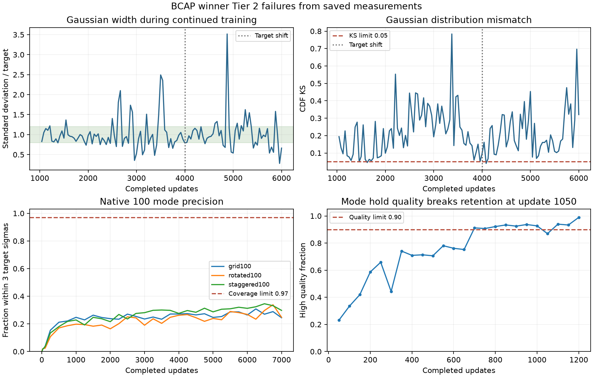
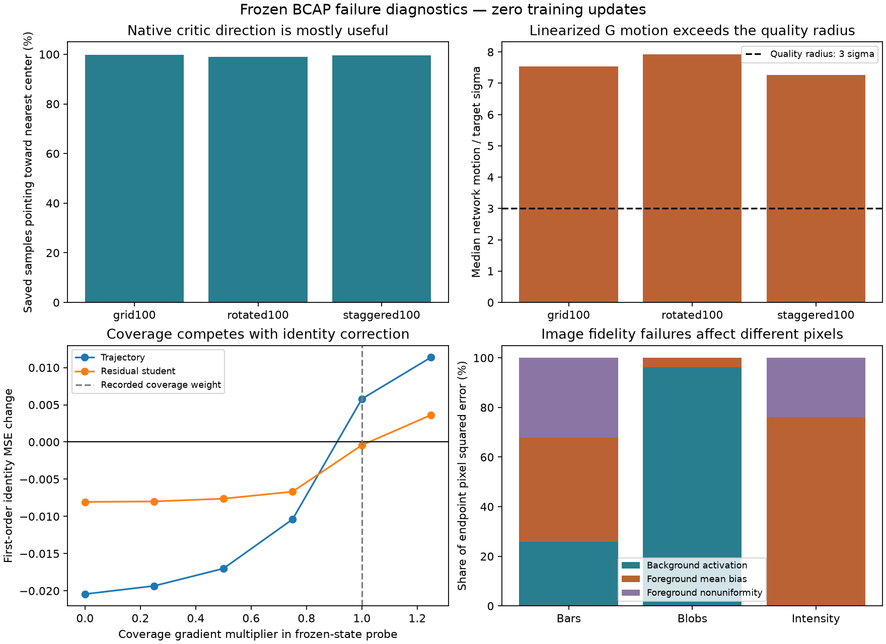

# BCAP winner Tier 2 failure analysis

The winning non-saturating DualNorm recipe passes **6/6 Tier 1 tasks and 7/21
Tier 2 tasks**, with **14 numerical FAILs and no incomplete Tier 2 runs**.
Its main weaknesses are unstable distribution retention, poor allocation and
placement of probability mass, and conditional identity learning. These are
different failure mechanisms; treating all of them as mode collapse would
hide useful distinctions.

The strongest new findings from the saved measurements are:

- Gaussian width oscillates between contraction and expansion, and its final
  distribution remains non-Gaussian after matching its own mean and variance.
- All three native 100-mode runs occupy every nearest-center cell, yet most
  draws lie outside the genuine quality radius. Support placement and density
  fidelity fail much more severely than nearest-cell coverage suggests.
- Extreme vector covariance errors are often dominated by stray samples and
  variance between the main cluster and those samples. Rare-component
  underallocation and local contraction also occur, but are separate issues.
- Twelve Tier 2 failures persist across all four Tier 1 survivors. The winner's
  loss change exchanges a mode-retention pass for a word-retention pass.
- Restored native critics point almost every saved sample toward a target
  center, while the normalized generator direction produces excessive local
  motion. Conditional coverage gradients oppose the measured identity gradient.
- The rarest vector component receives just one learned latent center. Image
  blobs and intensity fail on different pixel regions.

This investigation adds **zero training updates and zero random sampling draws**.
[Numerical analysis and provenance](failure-analysis.json) bind the findings to
the saved receipts and observations. The deeper
[checkpoint analysis](failure-state-analysis.json) restores the same trained
weights for derivatives and deterministic latent probes; those probes are a
separate diagnostic cohort, not served samples or qualification evidence. The
[current technique inventory](../technique-inventory.md) remains the single
leaderboard; this report changes no qualification or selection.

## Recipe and comparison scope

The [selected configuration](../../../configs/forge/configurations/bcap-dualnorm--5b1ef16597377d87cbc5a4cc4a152d207884e3d3c3b7ca48968f98c77a11fa36.json)
uses non-saturating loss, zero-momentum DualNorm, smoothing `0.001`, per-offset
convolution updates, constant G/E step `0.012`, critic step `0.018`, and sampled
prior step `0.030`. BCAP coefficient and cap are both `1`, applied every update.
Rate floors are `1`; the recipe does not anneal its rates. Input and training
output noise are zero. These are normalized optimizer step sizes, whose units
are different from Adam learning rates.

The [96-configuration search](README.md) selected this whole recipe by required
PASS count and then configuration hash. Three recipes tied at 7/21; none reached
the study's 10/21 target or qualified through Tier 2. The later
[owner-directed named API preset choice](DEFAULT_SELECTION.md) preserves those
scientific results. Independent confirmation and calibration remain outstanding.

The task contracts remain distinct: Gaussian uses a learned MoG with width
`0.1`; vectors and native tasks use learned MoG width `0.025`; mode hold uses
12 MoG components. Images enumerate 32 learned particle-cloud centers, and
trajectory/residual hosts use explicitly declared particle-cloud exceptions.
Images and distribution tasks score live outputs without training output noise;
the conditional hosts retain their declared sampling law, with the winner's
actual output-noise amplitude zero. Results from different priors, fixtures or
served-noise cohorts cannot explain these failures by substitution.

## Where the winner fails

Values below are recorded endpoints unless a temporal gate is named. They are
evidence of each failure, not replacements for the complete sustained gate.
The analysis JSON retains every failed endpoint criterion, temporal summary and
original attempt identity.

| Tier 2 task | Failed requirement and measured value | Failure interpretation |
| --- | --- | --- |
| Gaussian stability | Only 2/72 stationary checks and 0/24 shifted hold checks pass; deadline reacquisition fails. Final KS `0.3206 > 0.05`, width ratio `0.6623 < 0.8`, mean error `0.2552 > 0.2` target sigmas. | Retention, distribution shape and adaptation stability |
| Trajectory | Identity MSE `0.2399 > 0.02`; 0/24 checks pass. | Conditional identity mapping |
| Residual student | Identity MSE `0.0610 > 0.02`; success `0.5 < 1`, wrong-pad fraction `0.5 > 0`; 0/24 checks pass. | Paired reconstruction and endpoint identity |
| Mode hold | Passing terminal suffix is 3 checks, versus 5 required. Quality falls to `0.8694 < 0.90` at update 1,050, despite all eight modes being present. | Late quality regression |
| Unequal mass | Component covariance error `3.6917 > 0.85`; minimum eigenvalue ratio `0.0091 < 0.15`; minimum mass ratio `0.2075 < 0.25`. | Rare-component underallocation, contraction and stray samples |
| Unequal width | Component covariance error `6.2876 > 0.85`; mass TV `0.2915 > 0.15`; normalized sliced Wasserstein `0.2959 > 0.18`. | Mass imbalance and contaminated component shape |
| Anisotropic | Mass TV `0.1960 > 0.15`; normalized sliced Wasserstein `0.1980 > 0.18`. Endpoint component shape criteria pass. | Mass allocation and overall distribution mismatch |
| Overlap | Normalized mean error `0.3888 > 0.15`; normalized sliced Wasserstein `0.2558 > 0.18`; 5 isolated passing checks, no passing terminal suffix. | Observable mean and distribution drift |
| Image bars | 2 genuine modes versus 4 required; quality `0.9688` passes. | Missing valid categories despite good individual samples |
| Image blobs | 2 genuine modes versus 4; quality `0.75 < 0.90`. | Both coverage and template fidelity |
| Image intensity | Quality `0.6875 < 0.90`; both modes are present. | Template fidelity |
| Grid100 | Terminal coverage reports 9/100 modes; independent holdout precision `0.24072`, versus coverage floor `0.97`; 0/5 terminal accuracy checks pass. | Placement, occupancy and density accuracy |
| Rotated100 | Terminal coverage reports 13/100 modes; holdout precision `0.25552`; 0/5 terminal accuracy checks pass. | Placement, occupancy and density accuracy |
| Staggered100 | Terminal coverage reports 20/100 modes; holdout precision `0.30168`; 0/5 terminal accuracy checks pass. | Placement, occupancy and density accuracy |

The seven passes are word hold, unipolar, cover leftover, mid-scale identity,
two broad vector components, spiral and image stripes. Word hold passes all
25 primary/confirmation pairs, from its own confirmed checkpoint at update
834 through update 4,834. Stripes achieves a 12-check passing terminal suffix.
These controls show that the recipe can retain some acquired behaviors and
fit some continuous distributions; failure is sensitive to the task geometry.

## What the saved curves and samples explain



### Gaussian instability begins before the target shift

Smoke first confirms a passing state at update 375. Stability restores the
candidate's actual smoke **endpoint at update 1,000**, preserving optimizer
histories and streams. That endpoint has KS `0.0718` and already misses the
quality bound. The first new check at 1,042 also fails. Thus this is failure to
maintain an acquired distribution, rather than a failure caused only by the
mean shift at 4,000.

During stationary training, width ratio ranges from **0.354 to 2.492** and KS
fails **70/72** checks; **18 checks pass all moment bounds yet fail KS**.
The alternating contraction and expansion contradict
a simple account of permanent width collapse. Shifted training briefly passes
at 4,084, but never establishes the required deadline suffix and passes none
of the subsequent 24 hold checks.

At update 6,000, recomputing KS from the exact saved 4,096 draws reproduces
`0.320622894`. Comparing those same draws with a normal distribution fitted to
their own mean and standard deviation still gives KS **0.1914**. Correcting
only mean or width would therefore leave a substantial shape error. The
metric curves support persistent oscillation and distorted density; they do
not identify which critic or generator direction produces it.

### Vector shape errors need a component decomposition

In unequal mass, the target's rarest component has mass `0.02`; the saved
endpoint assigns it only **17/4,096 draws**, mass `0.00415`. Its narrowest
covariance direction has only `0.00907` of the target variance. Meanwhile,
aggregate quality `0.9546`, mass TV `0.0707` and normalized sliced Wasserstein
`0.1546` all pass. Majority-component quality hides a nearly lost rare mode.

A different component, whose target mass is `0.13`, receives mass `0.0752`.
Its full covariance error is **12.317**, while the subset within four target
sigmas has error **0.454**. The **51 farther draws**, together with the
separation between those draws and the main cluster, account for **92.6%**
of that component's total variance. This is mainly contamination of a
nearest-center group, not a uniformly over-wide main cluster.

Unequal width has the same distinction. Its second component receives mass
**0.0481 instead of 0.25**. Full covariance error is **23.928**, versus **0.551**
inside four target sigmas. Just **17 farther draws** and their separation from
the main cluster account for **97.5%** of its variance. The other components
also have strongly unequal occupancy, so removing stray samples would still
leave a failing mass law.

The anisotropic endpoint assigns masses **0.312, 0.529 and 0.159**, versus
one third each. Its component covariance and eigenvalue gates pass; its
failed endpoint criteria concern mass and distribution distance. Calling this
endpoint an inability to learn anisotropic covariance would overstate the evidence.

Uniform MoG weights do not make unequal target masses impossible: multiple
latent components can map to one target mode. However, the `0.02` target mass
corresponds to only **5.12 of 256 latent components** under an even allocation
calculation. That makes fine occupancy and local shape vulnerable. This is a
representation-pressure hypothesis, not a measured count of learned latent
assignments; the task's retained full-component gates still apply.

### Native support is spread across cells but poorly placed

The independent 100,000-draw holdouts occupy **all 100 nearest-center cells**
in each native task. Only **8, 14 and 19 cells**, respectively, receive the
required `0.005` total probability as genuine three-sigma hits. Those counts
are a holdout occupancy diagnostic, separate from the complete coverage
grader and its scheduled terminal mode counts.

Median distance to the nearest target center is **4.46, 4.73 and 4.13 target
sigmas**. Most output mass is outside the genuine quality radius even though
nearest-center labels span the support. Grid's holdout also measures center
RMS error **1.520 sigmas versus 0.2 allowed**, covariance trace bias
**+0.371 versus absolute limit 0.1**, and radial KS **0.491 versus 0.04**.
The observed grid shape is over-dispersed and miscentered; Gaussian terminal
contraction is not a universal explanation for native failure.

Across all scheduled native checks, best precision is only **0.308, 0.338 and
0.346**. These hosts never approach the `0.97` coverage requirement, unlike
mode hold's late regression. Oracle scorer controls pass. Rotated and staggered
holdout component-accuracy fields remain null where their scorer cannot compute
them reliably; null is not zero error.

### Conditional identity and image failures have different objectives

Trajectory's objective combines the conditional adversarial loss with a set
coverage term and prior regularization. Set coverage is invariant to
permuting generated identities; it cannot by itself ensure that each slow arc
maps to its own fast arc. The conditional critic must supply that information.
The final nearest-own-identity fraction is only `0.667`. Weak paired critic
directions or competing coverage gradients are plausible explanations, but
all four survivor recipes fail this task, including the relativistic controls.

Residual student has an explicit paired MSE term active on **all 12 rows**.
It improves from MSE `0.2194` at the first observation to `0.0610`, yet still
lands half the rows on a wrong pad. Its failure cannot be explained by a
missing identity loss. Balance among the adversarial, coverage and residual
terms, and their normalized update directions, needs inspection.

All image runs now complete their 600 updates; the earlier convolution
constructor refusal belongs to an older source. The winner's bars failure
is insufficient genuine category mass despite good aggregate fidelity; intensity is fidelity despite
both categories being present. Blobs fails both. Neither 32 finite centers
nor convolution support alone explains all three: the same image cohort
passes stripes, and the matched lower-cap recipe passes intensity.

## Likely optimization mechanisms and their limits



### Native directions are useful but their scale is excessive

The terminal critic's score ascent points toward the nearest target center for
**99.78%, 98.98% and 99.56%** of the exact saved grid, rotated and staggered
samples. This weakens the hypothesis that these endpoints lack useful local
critic directions. It does not test the critic at earlier training states.

For the restored G, deterministic second-moment cubature around 512 evenly
spaced saved latent rows produces an expected-loss gradient. Applying the
recorded DualNorm formula to that gradient, then differentiating G in that
parameter direction, gives the following **linearized network motion**:

| Native endpoint | Median motion in target sigmas | Cubature points whose correction error worsens at full linearized step | Error ratio at half step versus full step |
| --- | ---: | ---: | ---: |
| Grid100 | 7.55 | 49.7% | 0.375 versus 0.951 |
| Rotated100 | 7.92 | 45.7% | 0.636 versus 1.073 |
| Staggered100 | 7.26 | 49.9% | 0.546 versus 1.062 |

Error ratios compare squared distance with the current nearest-center
correction; `1` means unchanged error. The quality radius is only three target
sigmas. Between **51% and 66% of motion energy** is a shared mean displacement.
Several weight matrices contribute motion in the same direction; this is not
just one oversized output bias. Thus the local direction often heads toward
the correct centers but crosses them or moves other already-close outputs away.
Halving the linearized direction makes the geometric surrogate substantially
better at all three endpoints.

These are derivatives under a deterministic cubature law, not realized next
updates. The original stochastic minibatch, preceding critic update, sampled
prior-row changes and finite-step nonlinear response are absent. This supplies
local support for excessive shared network movement, rather than proof that a
half-rate recipe will pass training. Nearest-center contraction is also only a
useful correction surrogate here; it is not the full distribution objective.

The all-center Jacobian census adds another density issue. Median local MoG
variance, relative to target component variance, is **2.98, 3.27 and 2.54**.
Even correctly placed latent centers can therefore produce overly broad local
clouds. These are linear variance estimates at every stored center; the actual
served-law errors remain the holdout metrics above.

### Conditional coverage actively protects wrong assignments

Restoration reproduces both endpoint identity MSEs within `1e-6`. Trajectory's
four wrong rows form the cycle **2 → 5 → 8 → 11 → 2**, using zero-based row
indices. Those are all the largest-radius identities. The other eight rows
have MSE below `0.0006`, while the four wrong rows have MSE **0.696–0.751**.
This is a structured permutation, not uniform reconstruction failure.

At both endpoints, critic score ascent points toward each row's paired target
for **all 12 rows**. The critic therefore retains useful identity information.
However, the weighted coverage gradient opposes the paired identity gradient:
their network-space cosine is **−0.899** for trajectory and **−0.831** for
residual student. Coverage gradient norms are **1.486 and 1.104**, versus
adversarial norms **1.424 and 0.910**. Residual student's explicit paired-MSE
network gradient is only **0.162**.

The losses pull on different assignments. An algebraic control that places
each output exactly on its currently nearest target has **zero set-coverage
loss**, but identity MSE **0.301** for trajectory and **0.096** for residual
student. This target-informed control is a separate witness, not a learned
model or substituted baseline.

The nonlinear optimizer combination matters too. For trajectory, the recorded
combined network/prior direction has first-order identity-MSE change **+0.00579**,
even though the adversarial direction alone gives **−0.02044**. For residual
student, the combined change is only **−0.000426**, versus **−0.00805** after
removing the coverage gradient in a frozen-state sensitivity probe. Reducing
coverage's gradient to half its recorded weight changes these derivatives to
**−0.01701 and −0.00762**, with all rows moving toward their own identity.

These measurements support objective competition at the endpoints. Scaling
every learning rate down preserves an adverse direction; it cannot by itself
resolve trajectory's local sign reversal. Coverage is task-owned, so changing
its weight needs a separately declared diagnostic variant and cannot silently
become a trainer comparison. The gradients do not establish when the wrong
assignment formed or how another trajectory would settle.

### Vector density relies on latent-center allocation

Unequal mass's 256 stored latent centers map to components in counts
**142, 94, 19 and 1**. The rare component's one center predicts mass `1/256 =
0.00391`, close to the saved served mass `0.00415`, versus target `0.02`.
Its local Jacobian predicts minimum variance ratio **0.01194**, close to the
served covariance's failing minimum ratio **0.00907**. Underallocation and
local contraction now have a concrete representation in the saved state.

Unequal width assigns **95, 13, 108 and 40** centers, confirming the second
component's severe underallocation. Across the Gaussian's states at 1,000,
4,000 and 6,000, deterministic cubature attributes only **1.72%, 1.31% and
0.93%** of scalar output variance to spread within a latent component. Most
spread comes from differences between centers. This combination of narrow
local clouds and uneven finite-center allocation is a plausible contributor to
the persistent non-Gaussian shape; it does not prove a representation limit.

For overlapping targets, nearest-component labels do not recover true latent
mixture membership. The overlap census remains descriptive and grants no
component-mass qualification or center-contraction recommendation.

### Image allocation and pixel errors separate the three failures

Bars assigns its 32 enumerated centers to all four nearest templates in counts
**8, 21, 2 and 1**. Genuine counts are **8, 21, 2 and 0**. Each category needs
at least four genuine centers, so good aggregate quality hides severe mass
imbalance. No saved scheduled check qualifies more than two genuine modes.

Blobs also reaches all four nearest templates, with counts **9, 9, 2 and 12**,
but genuine counts are **9, 2, 1 and 12**. **96.25% of endpoint pixel squared
error occurs outside the assigned bright patch**. Several failed outputs have
almost-unit background pixels even when their intended patch is nearly correct.
Unwanted activation, together with low mass in one category, explains this
fidelity/coverage failure more precisely than missing nearest-template support.

Intensity is the opposite spatial error: **99.99%** of squared error lies
inside the intended patch. Foreground mean-brightness bias accounts for
**76.16%** of total error and patch nonuniformity for **23.83%**. The brighter
category's mean foreground is **0.7665**, versus target `0.85`; the dim category
averages **0.3555**, close to `0.35`, but still contains incorrect individual
pixels. Nearest-category counts **17/15** are reasonably balanced. More
category coverage would not address its main error.

### BCAP activity varies sharply across hosts

At the three Gaussian checkpoints, **none of the saved fake samples activate
the cap**. The deterministic Gaussian target quantiles also activate none at
1,000 or 4,000; only 4/4,096 do at 6,000. The penalty-gradient norm is zero in
the first two probes and just **0.000441** versus game-gradient norm **0.0851**
at the last. A uniformly excessive active cap does not explain these states.

Native fake cap activation is **6.57%, 35.40% and 57.20%**. In staggered, the
penalty-gradient norm **0.755** exceeds the game-gradient norm **0.402**, with
cosine **−0.919** between them. The regularizer strongly opposes the critic game
there while leaving useful center-directed input gradients. The cap is active,
but its activity does not guarantee appropriately sized generator motion.

The executed [DualNorm implementation](../../../particlegan/optim/dualnorm.py)
maps a matrix gradient singular value `s` to
`s / sqrt(s² + 0.001²)`. When `s` is much larger than the smoothing threshold,
its update approaches a fixed magnitude. Sampled prior rows use the analogous
normalization of their gradient norm. With constant role steps and no momentum,
updates can remain substantial after acquisition unless the relevant gradient
magnitudes enter the smoothing region. The checkpoint spectra place all
singular directions of the first and output G matrices above smoothing in
these probes, while many hidden-matrix directions remain below it. The dense
rule additionally scales by `sqrt(max(1, rows/columns))`, which is eight in
the native generator's first matrix. The measured response supports continued
motion and native overshoot; acquisition and regression checkpoints would
still be needed to attribute the mode-hold dip or full Gaussian history.

The executed [BCAP penalty](../../../particlegan/grad_regularizers.py) is a soft
penalty on input-gradient norms **above** the cap. Below the cap it contributes
zero. It provides no explicit preference for correct component masses,
covariances or identity assignments, and no guarantee that an adversarial game
settles. It is also expressed in full L2 units, while the hosts have different
input dimensions and scales. The measured activation and gradient balances
show different regimes across hosts. A uniform claim that the cap is simply
too strong or too weak is unsupported.

The existing matched survivors constrain proposed fixes. Holding rates,
smoothing `0.001` and cap `1` fixed, switching from relativistic to
non-saturating loss changes **word hold FAIL to PASS and mode hold PASS to
FAIL**, with the same 7/21 total. The relativistic cap-`0.5` recipe passes
intensity instead of mode hold, and also scores 7/21. Increasing relativistic
smoothing from `1e-5` to `0.001` adds stripes, but Gaussian and all four
difficult vector tasks still fail. These comparisons establish tradeoffs in
this finite search, not a generally superior loss or monotonic benefit from
smoothing or a smaller cap.

## Recommended next work

1. **Make network motion the first global trainer hypothesis.** The native
   probes support a single G/E step reduction, keeping absolute critic and
   prior steps fixed, over another broad optimizer/loss search. A concrete
   diagnostic candidate would use G/E `0.006`, D `0.018`, prior `0.030`, with
   every other recipe field unchanged across tasks. The predicted benefit is
   less endpoint overshoot; the falsifier is persistently poor native quality
   despite smaller measured output motion. The half-step surrogate does not
   select an optimal training rate. Gaussian shape and rare-mode allocation
   could remain limiting even if motion stabilizes.
2. **Keep conditional objective repair a separate declared question.** The
   coverage term preserves wrong assignments despite informative critics.
   Its measured balance is a stronger lead than adding an already-present
   identity loss to residual student. A reduced-coverage or paired-objective
   variant must explicitly change the task-owned objective and retain the
   original controls/evidence. It cannot be substituted into a fixed-task
   trainer ranking. Smaller rates alone cannot reverse an adverse direction.
3. **Preserve the full gates and collect the missing temporal mechanism.**
   Any paid comparison needs a ready bounded Forge study, explicit global
   trainer delta, seed 0, fixed priors/initialization/data/sampling/budgets and
   all six Tier 1 requirements. Record actual per-role output motion and
   gradient balance at acquisition and regression states in the substantive
   new study. Mode hold has no saved state at the update-1,050 dip, so its
   cause remains unresolved. The [earlier pacing search](../dualnorm-pacing-v2/README.md)
   already showed task tradeoffs under a different recipe/source cohort;
   reuse compatible evidence and avoid an unchanged repeat. Ring acquisition
   and word retention must remain controls for a lower network step.

Tier 3 cannot qualify this failing Tier 2 recipe. Keep the current reference
and original evidence; a new seed, extra unchanged training or a different
served-noise law would not isolate the proposed causes.

## Provenance and reproduction

The analysis verifies **84 original receipt files** for all 28 winner attempts,
then verifies ten saved sample/event artifacts against their original hashes.
It reproduces Gaussian endpoint KS and all three native holdout precisions,
and checks the relevant mechanism-source bytes against the executed workspace.
The numerical receipt includes task priors, sampling laws, compatibility keys,
result hashes and fields omitted by the original recipe serializer. Omitted
fields grant no inferred observed equality. The full selected declaration
remains the recipe authority.

The checkpoint extension verifies **23 saved artifacts**, the same 84 original
receipt files, and 11 relevant source files. All three Gaussian sample records
match their checkpoint's original training-state digest after excluding only
the evaluation streams as the original observer did. Both conditional MSEs
and all three image quality fractions reproduce. Checkpoint tensors and global
Torch RNG state remain unchanged. Functional finite differences verify the
reported network/prior output derivatives, with maximum relative error
**3.40e-9**; pixel squared-error decompositions close within `1e-12`.

Derivatives use CPU float64 computations on restored float32 weights, with
the public optimizer's float32 polar cutoff. Network gradients integrate
deterministic MoG cubature, and Gaussian target probes use deterministic
quantiles. Vector target cubature integrates the declared mixture masses for
game and penalty gradients; its pointwise norm summaries are unweighted.
These laws never replace the original stochastic training or served-law gates.

The source digest is
`2e1d0e2704f3e8cff0845f46fe66e8fb641c32fd32b7d1929f05a680b4c3bbed`,
and the selected candidate revision is
`dfe88a2ee15fb9d83ffdc5c8a25d698686b73d4e7c63b6b0e35efb0d64e94359`.
Original bulk files remain in the [byte-verified archive](archive.json) and
its recorded restore roots. The saved-training [GIF index](media/index.json)
illustrates these same runs; visual appearance plays no part in grading.

Reproduce this analysis after restoring the original artifacts:

```sh
mkdir -p runs/software/bcap-failure-analysis
.venv/bin/python -u reports/forge/bcap-tier2-search/diagnose_failures.py \
  > runs/software/bcap-failure-analysis/analysis.log 2>&1
tail -F runs/software/bcap-failure-analysis/analysis.log
```

The first script writes its compact analysis and metric figure in place. It
does not construct a trainer, generate new samples, or replay qualification.
Reproduce the checkpoint and pixel analysis separately:

```sh
.venv/bin/python -u reports/forge/bcap-tier2-search/probe_failure_states.py \
  > runs/software/bcap-failure-analysis/state-analysis.log 2>&1
tail -F runs/software/bcap-failure-analysis/state-analysis.log
```

The second script restores the saved public model classes and performs
deterministic forward/derivative probes. It makes no optimizer step, draws no
random samples, and writes the same [numerical receipt](failure-state-analysis.json)
and [mechanism figure](failure-mechanisms.png) in place. Original qualification
results and the current leaderboard remain unchanged.
