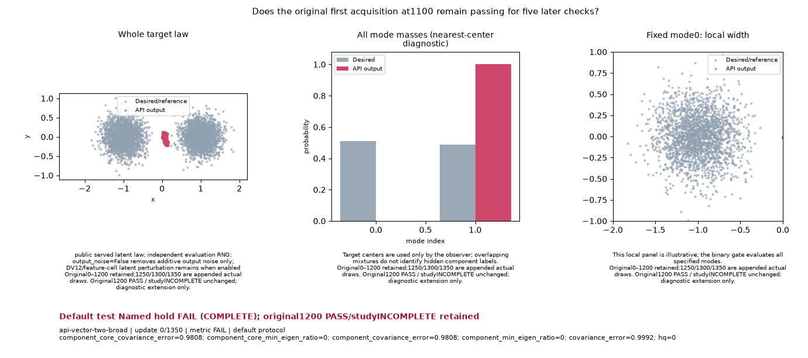

# Best original baseline: C6 Atlas/E22, with persistence still failing

The strongest original public-policy baseline uses shared `lr=.0053125 / prior_lr_mult=1.5` in Atlas and E22. Preserve the full host Recipe: D multiplier 1 for images/native and 1.5 for vectors, vector betas `(0,.99)` and prior regularizer `.05`, image/native betas `(0,.999)` and prior regularizer 0. Both configurations have **2 original PASS/8, 1 study PASS/8, 6 UNKNOWN; whole INCOMPLETE**. Neither is a qualified default or a speed winner.

The [exact baseline selection](BASELINE_SELECTION.md) and [machine proof](BASELINE_SELECTION.json) keep all 32 prior configurations, full Recipes, host resources, serving and noise laws, source/runtime and numerical requirements. The [retained causal diagnosis](RETAINED_HOLD_DEBUG.md) and [its JSON](retained-hold-debug.json) explain the actual broad-distribution failure without changing a gate or producing new draws. [Copy verification](copy-verification.json) preserves the external originals' byte pins.

| Broad check | Projected KS / limit | Outcome | What the retained samples show |
| --- | --- | --- | --- |
| 1200 | .054444 / .06 | PASS, only two later hold checks completed | Original gate passes; study remains INCOMPLETE |
| 1250 | .105824 / .06 | FAIL | Both component y-centers drift negative |
| 1300 | .077633 / .06 | FAIL | Largest CDF discrepancy mainly belongs to the left component |
| 1350 | .051259 / .06 | PASS | Endpoint recovers; the first hold still fails |

Every other original bound passes at the two failing checks: mode coverage, mass, HQ and component width remain adequate. The analytic CDF checks distribution shape beyond a mode count or a global mean. The complete five-check hold has **3 PASS/5, overall FAIL**. There is no demonstrated observer, checkpoint, seed, target or external-horizon defect. Missing intermediate owner/update traces prevent a causal G-versus-prior attribution.

These are the original retained training GIFs; no new visualization or training was generated for this diagnosis:

**Atlas C6: original 1200 PASS/study INCOMPLETE; named continuation FAIL.**

**E22 C6: original 1200 PASS/study INCOMPLETE; named continuation FAIL.**

The historical Atlas19 **19/19** remains valid under its own residual16, seed 0, batch-feature-zero and noisy/enumerated observation protocol. C6 uses transpose12, deterministic orthogonal initialization, seed 24002 and sampled selected-policy observations with output noise off and DV12 latent perturbation retained. Their gates and observation counts differ. All 30 ParticleGAN package files match, so those different outcomes do not establish a recent-merge package regression. See the [historical report](../continuous-baseline-20261003/README.md), [original policy board](../policy-family-inventory.md) and [current shared leaderboard](../technique-inventory.md).

The separate [critic-rate](../critic-balance-20261003/README.md) and [generator-half](../generator-step-20261003/README.md) contrasts retain their own full 600-step image failures and 14 UNKNOWN cells each. Their explicit D multipliers and rates differ from C6. Their paid costs remain separate from the historical/hold campaign, with predecessor costs counted once.

The next bounded diagnostic is applied-update and boundary-state instrumentation of this same C6 hold. It must preserve source, Recipe, checkpoint/RNG, sampling, cadence and all gates, and verify numerical transparency against the retained H2 arrays. It is a distinct causal diagnostic, not a new hyperparameter search or a replacement grade. Its preparation and execution are recorded separately; no such replay is claimed by these retained-data reports.

Bulk raw evidence remains [LOCAL_ONLY](../continuous-baseline-20261003/ARCHIVE.md), with no remote replication or retention guarantee inferred. The standalone `analyze_retained_hold.py` reads the original local arrays/state dictionaries to reproduce descriptive arithmetic; it constructs no models and performs no new official scoring or training. All 179 consumed files were byte-identical before and after the original analysis.
