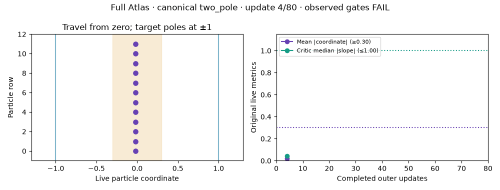

# First comparable Full Atlas case: canonical two_pole

**FAIL** — fresh seed0, 80 outer updates, 24 ordinary live observations; final five at 67/70/74/77/80.

This test asks whether direct particles leave zero while the original critic stays bounded. Its unchanged gates are mean absolute particle coordinate ≥0.30 and median absolute critic slope ≤1.00. It does not require balanced coverage of both poles.

Full original Atlas configuration SHA `a3ee5c67ac6594014feeb1ec333131abb4b1d86832510b69923100ebd8510ad4`; model-source commit `c6dbe8f6cdbe5c4df1c25ca67d807f075939e99d`, digest `316a06746b89287fe46fe71dd163992e3d0f5748e533551ba1bb2f2633f63e85`.
The public Recipe and ordered UpdatePolicy retain applicable Atlas controls, including learned training output noise. The host owns zero12×1 direct coordinates and the stored critic. Latent-prior multiplier/betas/A2 are inapplicable. Recipe.total_steps remains None;80 is the external test horizon. Measurements use live parameters with no evaluation draws.

[Frozen declaration, independent grade and cost](results.json)

Final live mean |coordinate|: **0.002446** (≥0.30); median |critic slope|: **0.010897** (≤1.00).

[Raw live evidence](two_pole/raw-result.json) · [Independent grade](two_pole/grade.json)

Case supervisor paid 12.931743s; conservative residual reservation 0.000000s. The original 300s allowance includes construction, all updates, grading and media. Parent metadata has its own cumulative 180s cap.
Retained prior charges 5994.113643s are counted once; the parent publication cutoff is recorded separately from later publication work.

The run stops here. first non-PASS. The remaining25 common cases have not run. This single case cannot select a family default or rank whole-family convergence speed.
