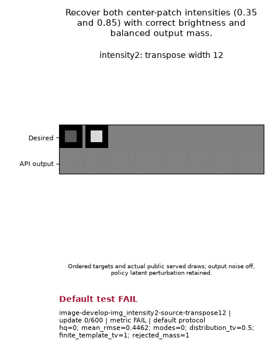

# Critic-rate contrast: capacity supported, learning failed

Both Atlas and E22 can represent all eight required public-API targets in the zero-update capacity test. Both then failed the complete 600-update intensity2 training test. The gates stopped each candidate there: **16 capacity SUPPORTED; 2 learning FAIL; 14 learning UNKNOWN**. Neither configuration qualifies as a shared default or speed winner.

This tests one shared tuple per family: `lr=.0053125`, `prior_lr_mult=1.5`, `d_lr_mult=2.25`, with seed 24002. The nominal critic rate increases while nominal generator/prior rates stay fixed. Policy damping makes actual rates endogenous. This follows the representation → shared-default search → gates process in [PR #247](https://github.com/255BITS/ParticleGAN/pull/247), and the separate baseline and persistence evidence in [PR #266](https://github.com/255BITS/ParticleGAN/pull/266). Historical successes do not fill these new cells.

| Required question | Capacity, both families | Atlas learning | E22 learning |
| --- | --- | --- | --- |
| Recover equally likely .35/.85 center-patch brightness | SUPPORTED | FAIL, full 600 | FAIL, full 600 |
| Recover both broad modes and their within-mode spread | SUPPORTED | UNKNOWN | UNKNOWN |
| Recover all 100 axis-aligned modes, mass and local width | SUPPORTED | UNKNOWN | UNKNOWN |
| Recover the same law at a fixed 25° rotation | SUPPORTED | UNKNOWN | UNKNOWN |
| Recover the staggered 100-mode geometry | SUPPORTED | UNKNOWN | UNKNOWN |
| Preserve 55/30/13/2% occupancy, including the rare mode | SUPPORTED | UNKNOWN | UNKNOWN |
| Recover oriented covariance ellipses and narrow-axis spread | SUPPORTED | UNKNOWN | UNKNOWN |
| Recover all four bar locations, orientations and sharp pixels | SUPPORTED | UNKNOWN | UNKNOWN |

[Exact questions and bounds](QUESTIONS_AND_MEDIA.md) explain why each case exists. [Machine results](results.json) retain all sixteen cells, recipes, original and added grades, source bindings, costs and artifact identities. UNKNOWN means the earlier gate stopped training; it is neither an observed failure nor missing successful evidence.

## Actual goal GIFs and failure

Each GIF shows the .35/.85 reference patches and actual sampled outputs at nine original training checkpoints, with a fixed grayscale. Both original gates and added first-window persistence grades are FAIL: all 25 recorded metric checks fail, no five-pass window is acquired, and later-hold confirmation is unavailable. At the final checkpoint HQ and valid-mode counts are zero, assignment TV is .5 and rejected-mass-aware template TV is 1, both above the .1 limit.

Atlas:

E22:

The [media review](MEDIA_QA.md) checked the retained first/middle/final frames and original bytes. These two runs have byte-identical GIFs, sampled arrays and learned parameter states. Their complete family policies differ; this small host uses Atlas's reference backend. The unreached native hosts still test a distinct family capability.

[Retained-state diagnosis](INTENSITY_FAILURE_ANALYSIS.md) establishes near-black foreground saturation by step 25, small nonzero final generator gradients, and a final effective critic rate near 3% of its nominal value. It does not establish which early force caused collapse. [Earlier broad-mode hold diagnosis](FROZEN_HOLD_ANALYSIS.md) concerns a separate PR #266 cohort: temporary projection-KS failures after acquisition. Its source and sampling law remain separate.

## Protocol and evidence

The original hosts, gates, sampling laws, seed, evaluation seed, horizons and cadence are unchanged. The added study requires the first five consecutive primary PASS observations, at least five later checks, and every later check passing. Reacquisition grants no credit. Images use 600 updates; vectors 1,200; native cases 7,000. Native scope is 24 post-update 20,000-output observations and the final five; it does not inherit Atlas19's independent 100,000-output certification. No quality run follows a failed smoke gate.

The original launch had a **pre-training engineering ERROR** because the copied discovery inventory omitted the unchanged ring task JSON. [Snapshot review](snapshot-review.md) identifies the defect. A new report-owned inventory wrapper supplied those original bytes without modifying the package, configurations, grader or old evidence. The corrected frozen source discovered all 177 definitions and matched all eight required cases before either scientific launch.

Root separately performed CPU capacity replay and retained-trace certification; [execution evidence](certification-execution.json) binds the successful combine command and log. The [publication helper](PUBLICATION.md) then verified 6,971 consumed files and copied two original GIFs without restoring models, drawing samples, rescoring or training. The scientific source is `a956c6fc447bbe1314ff43ec224825a0e941eb55`; the publication helper is separately frozen at `8e128eabae60a5c5a14220c0c117e1fff2a99e48`.

Measured scientific child time is **54.358772 s**. The preserved startup error adds **4.757909 s**, counted once, for **59.116680 s** charged against the original 15,360 s ceiling; interruption reserve is zero. CPU capacity verification, queue wait and parent certification are separate. These times provide no fair cross-family speed ranking.

The compact results, explanations and GIFs are committed for team review. The [raw archive and resolver instructions](ARCHIVE.md) bind all 10,411 files; raw evidence is currently LOCAL_ONLY, with no remote copy or retention assignment.

## Next finite declaration

The next distinct tuple is `lr=.00265625`, `prior_lr_mult=3.0`, `d_lr_mult=4.5`: halve nominal generator/output-noise steps while retaining nominal prior/critic rates. It targets the observed early output excursion; endogenous rates can still change. At this publication boundary it is **not executed**. It requires sixteen fresh candidate-bound capacity records, the same ordered gates and full horizons, and debit of the existing 59.116680 s from the same campaign ceiling. The new tuple confers no default eligibility before its own evidence exists.
