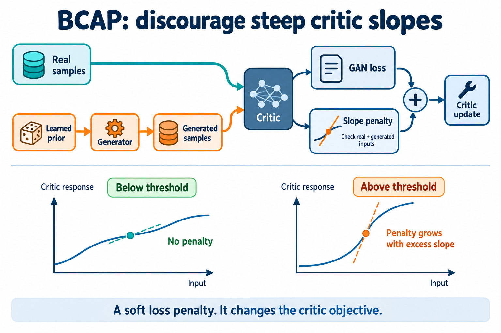

<!-- Generated Forge family report -->

# BCAP

[← Family leaderboard](../technique-inventory.md)

**Tags:** [adversarial-training](../technique-inventory.md#tag-adversarial-training) · [capped-input-gradients](../technique-inventory.md#tag-capped-input-gradients) · [critic-gradient-penalty](../technique-inventory.md#tag-critic-gradient-penalty) · [selectable-loss](../technique-inventory.md#tag-selectable-loss)

## Technique overview

BCAP adds a fixed critic penalty whenever the input-gradient norm exceeds a threshold, evaluated separately on real and generated data. This high-level formulation defines the family. Adam, normalized-gradient and dualnorm optimizers, learning rates, momentum and loss settings are configuration choices. The best recorded whole configuration and its exact settings appear below; BCAP with K3P remains a separate formulation with its additional training mechanisms.



Conceptual illustration of the BCAP critic-loss mechanism, not measured training results. Generator/prior updates are described below.

## Mathematical formulation

$G$ is the generator, $D$ the raw-score critic, $P$ the task prior, $x$ a real batch, $z\sim P$ a latent batch and $y$ the generated batch, including any declared output noise. $C$ is the critic actually evaluated: $C=D$ without input noise; otherwise every forward evaluates $D(u+\epsilon_{\mathrm{in}})$ with a fresh draw. $\mathbb E$ means a sample mean, $\lVert\cdot\rVert_2$ is the Euclidean norm, $(a)_+=\max(a,0)$ and $\operatorname{softplus}(a)=\log(1+e^a)$. The scalar sketch detaches $y$ during the critic update and resamples differentiable $y$ after that update; joint and auxiliary hosts retain task-owned objectives. $g_r=\nabla_x C(x)$ and $g_f=\nabla_y C(y)$ are per-sample input gradients; $d$ counts critic-input coordinates. $\lambda$ is penalty strength and $\kappa$ the cap threshold. $\eta_0$ is the global base LR, $m_D$ and $m_P$ the role multipliers. A joint host also has an encoder $E$, whose adversarial objective must train both joint critic streams.

**Default paired adversarial loss**

$$
\begin{aligned}\ell_D&=\mathbb E\!\left[\operatorname{softplus}(C(y)-C(x))\right],\\\ell_G&=\mathbb E\!\left[\operatorname{softplus}(C(x)-C(y))\right].\end{aligned}
$$

These scalar losses are minimized. The critic objective is $\ell_D+R$; the generator adds only its declared auxiliary objectives. Critic fakes are detached, and generator fakes and both scores are recomputed after the critic step. $C$ includes any declared fresh input noise. This equation is the canonical paired-loss example; non-saturating, hinge, Wasserstein and least-squares options keep their own loss formulas, and joint hosts use their explicit generator/encoder objective.

**Fixed capped input-gradient penalty**

$$
R_{\mathrm{BCAP}}=\frac{\lambda}{2}\left\{\mathbb E\!\left[(\lVert g_r\rVert_2-\kappa)_+^2\right]+\mathbb E\!\left[(\lVert g_f\rVert_2-\kappa)_+^2\right]\right\}.
$$

The cap is a soft loss penalty on real and fake critic input-gradient norms, without division by input dimension. It does not directly clip critic parameter gradients or weights. The canonical BCAP cards use $\lambda=1$ and $\kappa=1$; source-bound selected recipes may differ.

## Simplified pseudocode

```text
Choose an adversarial loss, optimizer and its configuration.
For each task-owned training update:
  Sample real x and latent z from the task prior P; compute y=G(z).
  Critic objective = adversarial_D(D(x), D(stop_gradient(y))) + fixed BCAP penalty.
  Compute BCAP from real and fake input-gradient norms; the penalty updates D only.
  Backpropagate the critic objective and step D using the configured optimizer.
  With D fixed, recompute differentiable fake samples and scores.
  Backpropagate adversarial_G plus task-owned auxiliary objectives.
  Step G, trainable prior P and encoder E when present using their configured rates.
  Joint encoder/generator hosts reverse labels on both critic streams.
```


## Configuration differences

- The fixed capped input-gradient penalty defines BCAP. Optimizer choice, learning rates, momentum, numerical floors and adversarial-loss settings stay within this solution family.
- The selected configuration table reports the executed trainer recipe. Task-owned architecture, initialization, prior, sampling, update budget and auxiliary objectives remain bound to each experiment.
- One whole recorded configuration supplies every displayed result. Passing cells from different recipes or sources are never combined.
- The cap is a soft loss penalty on critic input gradients, not a hard bound on parameter gradients. The L2 norm is not divided by input dimension.
- Corrected joint-host candidates use both generator and encoder adversarial terms. Earlier incompatible receipts preserve their original source and verdicts.
- BCAP with K3P retains its additional K3P training mechanisms and is reported as a separate formulation.

<details>
<summary>Implementation and recipe sources</summary>

These links support the explanation. Recorded results below remain bound to their own executed source.

- [particlegan/recipes.py](../../../particlegan/recipes.py)
- [particlegan/gan_loss.py](../../../particlegan/gan_loss.py)
- [particlegan/grad_regularizers.py](../../../particlegan/grad_regularizers.py)
- [particlegan/recipe_schedules.py](../../../particlegan/recipe_schedules.py)
- [configs/forge/ideas/bcap-pure-adam-v2.json](../../../configs/forge/ideas/bcap-pure-adam-v2.json)
- [reports/forge/pure-bcap/README.md](../pure-bcap/README.md)
- [particlegan/optim/dualnorm.py](../../../particlegan/optim/dualnorm.py)

</details>

Generated from one selected configuration per runtime. Recorded verdicts retain their original scientific contracts; grouping them under current views grants no new qualification.

<a name="cohort-cuda-1bf9d7d34422"></a>

## CUDA results

Runtime: **cuda**. Selected configuration: [bcap-ada-nsgda · 2e9b7b3ea44f](../../../configs/forge/configurations/bcap-ada-nsgda--2e9b7b3ea44f23cc2de35a6961d36b523b9043553970dac855544434c4595675.json).

Recorded qualification: **tier 0**, discriminator_stability revision 7. Other view rows below are navigation over recorded task evidence, not recomputed qualification.

<details>
<summary>Configuration, source and runtime provenance</summary>

Source digest: `6269a18ac4f82564cb16ba19afa4b3dd2f836a2b4085fbe5aeb81a35a453e895`. Candidate revision: `3205c7f0bd717837c6220827046bc0d548adb8680bef50ef1291b2459aa6b5ac`. Runtime cohort: `f539a56fa9daca4c8e1fef4a3374f48ad60d128764c85a8d8ac07b732da9bb21`.

[Frozen numerical evidence](../technique-evidence/7c4e188f1ee495526c2decf6f02a45f392123aaf4f33f1f6fb9a398fe3ac05e7.json) · [Complete recipe, prior, initialization and sampling bindings](../technique-inventory.json)

Selection: current_measurement. Preserve the round's pre-run whole candidate choice in its freshly measured CUDA source cohort; no task pooling, outcome-based recipe reselection, calibration or default adoption.

</details>

Complete current Tier 1 measurement in: discriminator_stability. PASS and FAIL are both measured outcomes; other cohorts retain their own required cells.

## Best recorded configuration

Selected by recorded required passes, then completed measurements. Each count comes from this one complete configuration. Source differences preserve separate evidence contracts; the selection does not establish a controlled win or default adoption.

Recorded trainer recipe; task-owned architecture, prior, initialization, budget and sampling remain in the experiment receipts below. Null role overrides inherit the shared value. Optimizer parameters only apply to optimizers that consume them.

| Setting | Selected value |
| --- | --- |
| Adversarial loss | loss=relativistic; loss_labels=[0.0, 1.0, 1.0] |
| Optimizer | optimizer_family=ada_nsgda; optimizer_momentum=0.0; optimizer_adam_lr=None; adam_variant=pytorch |
| Adam parameters (when used) | betas=[0.0, 0.999]; d_betas=None; prior_betas=None; eps=1e-08; d_eps=None; prior_eps=None |
| Learning rates | lr=0.016; d_lr_mult=1.0; prior_lr_mult=2.0 |
| Rate schedule | lr_schedule=cosine; lr_floor=1.0; network_lr_floor=1.0; network_lr_horizon_cap=None |
| Critic penalty | reg_arm=b_cap; reg_coeff=1.0; reg_kappa=1.0; reg_every=1; reg_anchor_weight=0.0 |
| Damping and guards | d_guard_ratio=0.0; latent_damping_max_rate=0.0; direct_particle_gain=False |
| Training noise | input_noise_std=0.0; output_noise_std=0.0; output_noise_mode=fixed |
| Averaging | ema_decay=0.0; serve_average=0.0 |

Base network rate: **0.016**; critic rate: **0.016**; prior rate: **0.032** before any declared schedule or host adaptation.

Selected optimizer rule: Magnitude graft: compute the unit-LR beta1-zero Adam update A for each tensor, then step W -= eta_P * norm(A) * g / (norm(g) + epsilon). The direction remains the raw gradient, and eta is applied exactly once. Adam second-moment history is retained.

<details>
<summary>Other recorded configurations in this family</summary>

These are whole configurations under their original sources. Their individual passing cells do not contribute to the selected result.

| Configuration | Required passes | Executed source | Display selection |
| --- | ---: | --- | --- |
| [bcap-ada-nsgda · 2e9b7b3ea44f](bcap-ada-nsgda.md) | 20(*)/151 | `6269a18ac4f8` | Selected |
| [bcap-dualnorm · 7beb7378d81d](bcap-dualnorm.md) | 20(*)/151 | `6269a18ac4f8` | Alternative |
| [bcap-nsgda-global · 4d46c3064ad2](bcap-nsgda-global.md) | 20(*)/151 | `6269a18ac4f8` | Alternative |
| [bcap-particle-rownorm-only · 4c8ddce0b214](bcap-particle-rownorm-only.md) | 20(*)/151 | `6269a18ac4f8` | Alternative |
| [bcap-dualnorm-d-only · 3305345f128e](bcap-dualnorm-d-only.md) | 13(*)/151 | `6269a18ac4f8` | Alternative |
| [bcap-nsgda-layer · 3cca4c69f248](bcap-nsgda-layer.md) | 13(*)/151 | `6269a18ac4f8` | Alternative |
| [bcap-sgda · d6bc8507ebb1](bcap-sgda.md) | 8(*)/151 | `6269a18ac4f8` | Alternative |
| [bcap-pure-adam-v2](bcap-pure-configuration.md) | 0(*)/151 | `6269a18ac4f8` | Alternative |

</details>

| Family / view | Tier 1 | Tier 2 | Tier 3 | Total |
| --- | ---: | ---: | ---: | ---: |
| [adaptation](bcap-pure.md#cohort-cuda-1bf9d7d34422-adaptation) | [3/3](bcap-pure.md#cohort-cuda-1bf9d7d34422-adaptation-tier-1) | [0(*)/19](bcap-pure.md#cohort-cuda-1bf9d7d34422-adaptation-tier-2) | [0(*)/1](bcap-pure.md#cohort-cuda-1bf9d7d34422-adaptation-tier-3) | [3(*)/23](bcap-pure.md#cohort-cuda-1bf9d7d34422-adaptation) |
| [clockfree_continuous](bcap-pure.md#cohort-cuda-1bf9d7d34422-clockfree_continuous) | [4/4](bcap-pure.md#cohort-cuda-1bf9d7d34422-clockfree_continuous-tier-1) | [0(*)/19](bcap-pure.md#cohort-cuda-1bf9d7d34422-clockfree_continuous-tier-2) | [0(*)/7](bcap-pure.md#cohort-cuda-1bf9d7d34422-clockfree_continuous-tier-3) | [4(*)/30](bcap-pure.md#cohort-cuda-1bf9d7d34422-clockfree_continuous) |
| [discriminator_stability](bcap-pure.md#cohort-cuda-1bf9d7d34422-discriminator_stability) | [4/6](bcap-pure.md#cohort-cuda-1bf9d7d34422-discriminator_stability-tier-1) | [0(*)/20](bcap-pure.md#cohort-cuda-1bf9d7d34422-discriminator_stability-tier-2) | [0(*)/2](bcap-pure.md#cohort-cuda-1bf9d7d34422-discriminator_stability-tier-3) | [4(*)/28](bcap-pure.md#cohort-cuda-1bf9d7d34422-discriminator_stability) |
| [formulation_comparison](bcap-pure.md#cohort-cuda-1bf9d7d34422-formulation_comparison) | [3/3](bcap-pure.md#cohort-cuda-1bf9d7d34422-formulation_comparison-tier-1) | [0(*)/19](bcap-pure.md#cohort-cuda-1bf9d7d34422-formulation_comparison-tier-2) | [0(*)/2](bcap-pure.md#cohort-cuda-1bf9d7d34422-formulation_comparison-tier-3) | [3(*)/24](bcap-pure.md#cohort-cuda-1bf9d7d34422-formulation_comparison) |
| [host_profile_transfer](bcap-pure.md#cohort-cuda-1bf9d7d34422-host_profile_transfer) | [3/3](bcap-pure.md#cohort-cuda-1bf9d7d34422-host_profile_transfer-tier-1) | [0(*)/19](bcap-pure.md#cohort-cuda-1bf9d7d34422-host_profile_transfer-tier-2) | [0(*)/2](bcap-pure.md#cohort-cuda-1bf9d7d34422-host_profile_transfer-tier-3) | [3(*)/24](bcap-pure.md#cohort-cuda-1bf9d7d34422-host_profile_transfer) |
| [quality_coverage](bcap-pure.md#cohort-cuda-1bf9d7d34422-quality_coverage) | [3/3](bcap-pure.md#cohort-cuda-1bf9d7d34422-quality_coverage-tier-1) | [0(*)/19](bcap-pure.md#cohort-cuda-1bf9d7d34422-quality_coverage-tier-2) | [0/0](bcap-pure.md#cohort-cuda-1bf9d7d34422-quality_coverage-tier-3) | [3(*)/22](bcap-pure.md#cohort-cuda-1bf9d7d34422-quality_coverage) |

Separate cohort coverage (excluded from family totals):

| Family / view | Tier 1 | Tier 2 | Tier 3 | Total |
| --- | ---: | ---: | ---: | ---: |
| [tier1_policy_coverage](bcap-pure.md#cohort-cuda-1bf9d7d34422-tier1_policy_coverage) | [0(*)/7](bcap-pure.md#cohort-cuda-1bf9d7d34422-tier1_policy_coverage-tier-1) | [0/0](bcap-pure.md#cohort-cuda-1bf9d7d34422-tier1_policy_coverage-tier-2) | [0/0](bcap-pure.md#cohort-cuda-1bf9d7d34422-tier1_policy_coverage-tier-3) | [0(*)/7](bcap-pure.md#cohort-cuda-1bf9d7d34422-tier1_policy_coverage) |

(*) means at least one required experiment has no recorded execution, including preflight blockers. PASS and FAIL both count as executed. Attempted errors retain their status and cause; test-definition compatibility is shown separately and does not add (*).

<a name="cohort-cuda-1bf9d7d34422-tier-1"></a>

### Tier 1 across views

Shared experiments appear once in this list; the family numerator/denominator count their view requirements.

| Experiment | Required by | Recorded result | Test definition |
| --- | --- | --- | --- |
| [ae_gan_hold](bcap-pure.md#cohort-cuda-1bf9d7d34422-experiment-ae_gan_hold) | [adaptation](bcap-pure.md#cohort-cuda-1bf9d7d34422-adaptation-tier-1), [clockfree_continuous](bcap-pure.md#cohort-cuda-1bf9d7d34422-clockfree_continuous-tier-1), [discriminator_stability](bcap-pure.md#cohort-cuda-1bf9d7d34422-discriminator_stability-tier-1), [formulation_comparison](bcap-pure.md#cohort-cuda-1bf9d7d34422-formulation_comparison-tier-1), [host_profile_transfer](bcap-pure.md#cohort-cuda-1bf9d7d34422-host_profile_transfer-tier-1), [quality_coverage](bcap-pure.md#cohort-cuda-1bf9d7d34422-quality_coverage-tier-1) | PASS | matches recorded run |
| [clockfree_audit_measurement_v1](bcap-pure.md#cohort-cuda-1bf9d7d34422-experiment-clockfree_audit_measurement_v1) | [clockfree_continuous](bcap-pure.md#cohort-cuda-1bf9d7d34422-clockfree_continuous-tier-1) | PASS | matches recorded run |
| [five_word_joint_acquisition](bcap-pure.md#cohort-cuda-1bf9d7d34422-experiment-five_word_joint_acquisition) | [discriminator_stability](bcap-pure.md#cohort-cuda-1bf9d7d34422-discriminator_stability-tier-1) | FAIL | matches recorded run |
| [gaussian1d_smoke](bcap-pure.md#cohort-cuda-1bf9d7d34422-experiment-gaussian1d_smoke) | [discriminator_stability](bcap-pure.md#cohort-cuda-1bf9d7d34422-discriminator_stability-tier-1) | PASS | matches recorded run |
| [ring16_acquisition](bcap-pure.md#cohort-cuda-1bf9d7d34422-experiment-ring16_acquisition) | [discriminator_stability](bcap-pure.md#cohort-cuda-1bf9d7d34422-discriminator_stability-tier-1) | FAIL | matches recorded run |
| [two_pole](bcap-pure.md#cohort-cuda-1bf9d7d34422-experiment-two_pole) | [adaptation](bcap-pure.md#cohort-cuda-1bf9d7d34422-adaptation-tier-1), [clockfree_continuous](bcap-pure.md#cohort-cuda-1bf9d7d34422-clockfree_continuous-tier-1), [discriminator_stability](bcap-pure.md#cohort-cuda-1bf9d7d34422-discriminator_stability-tier-1), [formulation_comparison](bcap-pure.md#cohort-cuda-1bf9d7d34422-formulation_comparison-tier-1), [host_profile_transfer](bcap-pure.md#cohort-cuda-1bf9d7d34422-host_profile_transfer-tier-1), [quality_coverage](bcap-pure.md#cohort-cuda-1bf9d7d34422-quality_coverage-tier-1) | PASS | matches recorded run |
| [unused_token_hold](bcap-pure.md#cohort-cuda-1bf9d7d34422-experiment-unused_token_hold) | [adaptation](bcap-pure.md#cohort-cuda-1bf9d7d34422-adaptation-tier-1), [clockfree_continuous](bcap-pure.md#cohort-cuda-1bf9d7d34422-clockfree_continuous-tier-1), [discriminator_stability](bcap-pure.md#cohort-cuda-1bf9d7d34422-discriminator_stability-tier-1), [formulation_comparison](bcap-pure.md#cohort-cuda-1bf9d7d34422-formulation_comparison-tier-1), [host_profile_transfer](bcap-pure.md#cohort-cuda-1bf9d7d34422-host_profile_transfer-tier-1), [quality_coverage](bcap-pure.md#cohort-cuda-1bf9d7d34422-quality_coverage-tier-1) | PASS | matches recorded run |

<a name="cohort-cuda-1bf9d7d34422-tier-2"></a>

### Tier 2 across views

Shared experiments appear once in this list; the family numerator/denominator count their view requirements.

| Experiment | Required by | Recorded result | Test definition |
| --- | --- | --- | --- |
| [cover_leftover](bcap-pure.md#cohort-cuda-1bf9d7d34422-experiment-cover_leftover) | [adaptation](bcap-pure.md#cohort-cuda-1bf9d7d34422-adaptation-tier-2), [clockfree_continuous](bcap-pure.md#cohort-cuda-1bf9d7d34422-clockfree_continuous-tier-2), [discriminator_stability](bcap-pure.md#cohort-cuda-1bf9d7d34422-discriminator_stability-tier-2), [formulation_comparison](bcap-pure.md#cohort-cuda-1bf9d7d34422-formulation_comparison-tier-2), [host_profile_transfer](bcap-pure.md#cohort-cuda-1bf9d7d34422-host_profile_transfer-tier-2), [quality_coverage](bcap-pure.md#cohort-cuda-1bf9d7d34422-quality_coverage-tier-2) | UNKNOWN | matches recorded run |
| [gaussian1d_stability](bcap-pure.md#cohort-cuda-1bf9d7d34422-experiment-gaussian1d_stability) | [discriminator_stability](bcap-pure.md#cohort-cuda-1bf9d7d34422-discriminator_stability-tier-2) | UNKNOWN | matches recorded run |
| [grid100](bcap-pure.md#cohort-cuda-1bf9d7d34422-experiment-grid100) | [adaptation](bcap-pure.md#cohort-cuda-1bf9d7d34422-adaptation-tier-2), [clockfree_continuous](bcap-pure.md#cohort-cuda-1bf9d7d34422-clockfree_continuous-tier-2), [discriminator_stability](bcap-pure.md#cohort-cuda-1bf9d7d34422-discriminator_stability-tier-2), [formulation_comparison](bcap-pure.md#cohort-cuda-1bf9d7d34422-formulation_comparison-tier-2), [host_profile_transfer](bcap-pure.md#cohort-cuda-1bf9d7d34422-host_profile_transfer-tier-2), [quality_coverage](bcap-pure.md#cohort-cuda-1bf9d7d34422-quality_coverage-tier-2) | UNKNOWN | matches recorded run |
| [img_bars4](bcap-pure.md#cohort-cuda-1bf9d7d34422-experiment-img_bars4) | [adaptation](bcap-pure.md#cohort-cuda-1bf9d7d34422-adaptation-tier-2), [clockfree_continuous](bcap-pure.md#cohort-cuda-1bf9d7d34422-clockfree_continuous-tier-2), [discriminator_stability](bcap-pure.md#cohort-cuda-1bf9d7d34422-discriminator_stability-tier-2), [formulation_comparison](bcap-pure.md#cohort-cuda-1bf9d7d34422-formulation_comparison-tier-2), [host_profile_transfer](bcap-pure.md#cohort-cuda-1bf9d7d34422-host_profile_transfer-tier-2), [quality_coverage](bcap-pure.md#cohort-cuda-1bf9d7d34422-quality_coverage-tier-2) | UNKNOWN | matches recorded run |
| [img_blobs4](bcap-pure.md#cohort-cuda-1bf9d7d34422-experiment-img_blobs4) | [adaptation](bcap-pure.md#cohort-cuda-1bf9d7d34422-adaptation-tier-2), [clockfree_continuous](bcap-pure.md#cohort-cuda-1bf9d7d34422-clockfree_continuous-tier-2), [discriminator_stability](bcap-pure.md#cohort-cuda-1bf9d7d34422-discriminator_stability-tier-2), [formulation_comparison](bcap-pure.md#cohort-cuda-1bf9d7d34422-formulation_comparison-tier-2), [host_profile_transfer](bcap-pure.md#cohort-cuda-1bf9d7d34422-host_profile_transfer-tier-2), [quality_coverage](bcap-pure.md#cohort-cuda-1bf9d7d34422-quality_coverage-tier-2) | UNKNOWN | matches recorded run |
| [img_intensity2](bcap-pure.md#cohort-cuda-1bf9d7d34422-experiment-img_intensity2) | [adaptation](bcap-pure.md#cohort-cuda-1bf9d7d34422-adaptation-tier-2), [clockfree_continuous](bcap-pure.md#cohort-cuda-1bf9d7d34422-clockfree_continuous-tier-2), [discriminator_stability](bcap-pure.md#cohort-cuda-1bf9d7d34422-discriminator_stability-tier-2), [formulation_comparison](bcap-pure.md#cohort-cuda-1bf9d7d34422-formulation_comparison-tier-2), [host_profile_transfer](bcap-pure.md#cohort-cuda-1bf9d7d34422-host_profile_transfer-tier-2), [quality_coverage](bcap-pure.md#cohort-cuda-1bf9d7d34422-quality_coverage-tier-2) | UNKNOWN | matches recorded run |
| [img_stripes2](bcap-pure.md#cohort-cuda-1bf9d7d34422-experiment-img_stripes2) | [adaptation](bcap-pure.md#cohort-cuda-1bf9d7d34422-adaptation-tier-2), [clockfree_continuous](bcap-pure.md#cohort-cuda-1bf9d7d34422-clockfree_continuous-tier-2), [discriminator_stability](bcap-pure.md#cohort-cuda-1bf9d7d34422-discriminator_stability-tier-2), [formulation_comparison](bcap-pure.md#cohort-cuda-1bf9d7d34422-formulation_comparison-tier-2), [host_profile_transfer](bcap-pure.md#cohort-cuda-1bf9d7d34422-host_profile_transfer-tier-2), [quality_coverage](bcap-pure.md#cohort-cuda-1bf9d7d34422-quality_coverage-tier-2) | UNKNOWN | matches recorded run |
| [mid_scale_identity](bcap-pure.md#cohort-cuda-1bf9d7d34422-experiment-mid_scale_identity) | [adaptation](bcap-pure.md#cohort-cuda-1bf9d7d34422-adaptation-tier-2), [clockfree_continuous](bcap-pure.md#cohort-cuda-1bf9d7d34422-clockfree_continuous-tier-2), [discriminator_stability](bcap-pure.md#cohort-cuda-1bf9d7d34422-discriminator_stability-tier-2), [formulation_comparison](bcap-pure.md#cohort-cuda-1bf9d7d34422-formulation_comparison-tier-2), [host_profile_transfer](bcap-pure.md#cohort-cuda-1bf9d7d34422-host_profile_transfer-tier-2), [quality_coverage](bcap-pure.md#cohort-cuda-1bf9d7d34422-quality_coverage-tier-2) | UNKNOWN | matches recorded run |
| [mode_hold](bcap-pure.md#cohort-cuda-1bf9d7d34422-experiment-mode_hold) | [adaptation](bcap-pure.md#cohort-cuda-1bf9d7d34422-adaptation-tier-2), [clockfree_continuous](bcap-pure.md#cohort-cuda-1bf9d7d34422-clockfree_continuous-tier-2), [discriminator_stability](bcap-pure.md#cohort-cuda-1bf9d7d34422-discriminator_stability-tier-2), [formulation_comparison](bcap-pure.md#cohort-cuda-1bf9d7d34422-formulation_comparison-tier-2), [host_profile_transfer](bcap-pure.md#cohort-cuda-1bf9d7d34422-host_profile_transfer-tier-2), [quality_coverage](bcap-pure.md#cohort-cuda-1bf9d7d34422-quality_coverage-tier-2) | UNKNOWN | matches recorded run |
| [residual_student](bcap-pure.md#cohort-cuda-1bf9d7d34422-experiment-residual_student) | [adaptation](bcap-pure.md#cohort-cuda-1bf9d7d34422-adaptation-tier-2), [clockfree_continuous](bcap-pure.md#cohort-cuda-1bf9d7d34422-clockfree_continuous-tier-2), [discriminator_stability](bcap-pure.md#cohort-cuda-1bf9d7d34422-discriminator_stability-tier-2), [formulation_comparison](bcap-pure.md#cohort-cuda-1bf9d7d34422-formulation_comparison-tier-2), [host_profile_transfer](bcap-pure.md#cohort-cuda-1bf9d7d34422-host_profile_transfer-tier-2), [quality_coverage](bcap-pure.md#cohort-cuda-1bf9d7d34422-quality_coverage-tier-2) | UNKNOWN | matches recorded run |
| [rotated100](bcap-pure.md#cohort-cuda-1bf9d7d34422-experiment-rotated100) | [adaptation](bcap-pure.md#cohort-cuda-1bf9d7d34422-adaptation-tier-2), [clockfree_continuous](bcap-pure.md#cohort-cuda-1bf9d7d34422-clockfree_continuous-tier-2), [discriminator_stability](bcap-pure.md#cohort-cuda-1bf9d7d34422-discriminator_stability-tier-2), [formulation_comparison](bcap-pure.md#cohort-cuda-1bf9d7d34422-formulation_comparison-tier-2), [host_profile_transfer](bcap-pure.md#cohort-cuda-1bf9d7d34422-host_profile_transfer-tier-2), [quality_coverage](bcap-pure.md#cohort-cuda-1bf9d7d34422-quality_coverage-tier-2) | UNKNOWN | matches recorded run |
| [staggered100](bcap-pure.md#cohort-cuda-1bf9d7d34422-experiment-staggered100) | [adaptation](bcap-pure.md#cohort-cuda-1bf9d7d34422-adaptation-tier-2), [clockfree_continuous](bcap-pure.md#cohort-cuda-1bf9d7d34422-clockfree_continuous-tier-2), [discriminator_stability](bcap-pure.md#cohort-cuda-1bf9d7d34422-discriminator_stability-tier-2), [formulation_comparison](bcap-pure.md#cohort-cuda-1bf9d7d34422-formulation_comparison-tier-2), [host_profile_transfer](bcap-pure.md#cohort-cuda-1bf9d7d34422-host_profile_transfer-tier-2), [quality_coverage](bcap-pure.md#cohort-cuda-1bf9d7d34422-quality_coverage-tier-2) | UNKNOWN | matches recorded run |
| [trajectory](bcap-pure.md#cohort-cuda-1bf9d7d34422-experiment-trajectory) | [adaptation](bcap-pure.md#cohort-cuda-1bf9d7d34422-adaptation-tier-2), [clockfree_continuous](bcap-pure.md#cohort-cuda-1bf9d7d34422-clockfree_continuous-tier-2), [discriminator_stability](bcap-pure.md#cohort-cuda-1bf9d7d34422-discriminator_stability-tier-2), [formulation_comparison](bcap-pure.md#cohort-cuda-1bf9d7d34422-formulation_comparison-tier-2), [host_profile_transfer](bcap-pure.md#cohort-cuda-1bf9d7d34422-host_profile_transfer-tier-2), [quality_coverage](bcap-pure.md#cohort-cuda-1bf9d7d34422-quality_coverage-tier-2) | UNKNOWN | matches recorded run |
| [unipolar](bcap-pure.md#cohort-cuda-1bf9d7d34422-experiment-unipolar) | [adaptation](bcap-pure.md#cohort-cuda-1bf9d7d34422-adaptation-tier-2), [clockfree_continuous](bcap-pure.md#cohort-cuda-1bf9d7d34422-clockfree_continuous-tier-2), [discriminator_stability](bcap-pure.md#cohort-cuda-1bf9d7d34422-discriminator_stability-tier-2), [formulation_comparison](bcap-pure.md#cohort-cuda-1bf9d7d34422-formulation_comparison-tier-2), [host_profile_transfer](bcap-pure.md#cohort-cuda-1bf9d7d34422-host_profile_transfer-tier-2), [quality_coverage](bcap-pure.md#cohort-cuda-1bf9d7d34422-quality_coverage-tier-2) | UNKNOWN | matches recorded run |
| [vector_anisotropic](bcap-pure.md#cohort-cuda-1bf9d7d34422-experiment-vector_anisotropic) | [adaptation](bcap-pure.md#cohort-cuda-1bf9d7d34422-adaptation-tier-2), [clockfree_continuous](bcap-pure.md#cohort-cuda-1bf9d7d34422-clockfree_continuous-tier-2), [discriminator_stability](bcap-pure.md#cohort-cuda-1bf9d7d34422-discriminator_stability-tier-2), [formulation_comparison](bcap-pure.md#cohort-cuda-1bf9d7d34422-formulation_comparison-tier-2), [host_profile_transfer](bcap-pure.md#cohort-cuda-1bf9d7d34422-host_profile_transfer-tier-2), [quality_coverage](bcap-pure.md#cohort-cuda-1bf9d7d34422-quality_coverage-tier-2) | UNKNOWN | matches recorded run |
| [vector_overlap](bcap-pure.md#cohort-cuda-1bf9d7d34422-experiment-vector_overlap) | [adaptation](bcap-pure.md#cohort-cuda-1bf9d7d34422-adaptation-tier-2), [clockfree_continuous](bcap-pure.md#cohort-cuda-1bf9d7d34422-clockfree_continuous-tier-2), [discriminator_stability](bcap-pure.md#cohort-cuda-1bf9d7d34422-discriminator_stability-tier-2), [formulation_comparison](bcap-pure.md#cohort-cuda-1bf9d7d34422-formulation_comparison-tier-2), [host_profile_transfer](bcap-pure.md#cohort-cuda-1bf9d7d34422-host_profile_transfer-tier-2), [quality_coverage](bcap-pure.md#cohort-cuda-1bf9d7d34422-quality_coverage-tier-2) | UNKNOWN | matches recorded run |
| [vector_spiral](bcap-pure.md#cohort-cuda-1bf9d7d34422-experiment-vector_spiral) | [adaptation](bcap-pure.md#cohort-cuda-1bf9d7d34422-adaptation-tier-2), [clockfree_continuous](bcap-pure.md#cohort-cuda-1bf9d7d34422-clockfree_continuous-tier-2), [discriminator_stability](bcap-pure.md#cohort-cuda-1bf9d7d34422-discriminator_stability-tier-2), [formulation_comparison](bcap-pure.md#cohort-cuda-1bf9d7d34422-formulation_comparison-tier-2), [host_profile_transfer](bcap-pure.md#cohort-cuda-1bf9d7d34422-host_profile_transfer-tier-2), [quality_coverage](bcap-pure.md#cohort-cuda-1bf9d7d34422-quality_coverage-tier-2) | UNKNOWN | matches recorded run |
| [vector_two_broad](bcap-pure.md#cohort-cuda-1bf9d7d34422-experiment-vector_two_broad) | [adaptation](bcap-pure.md#cohort-cuda-1bf9d7d34422-adaptation-tier-2), [clockfree_continuous](bcap-pure.md#cohort-cuda-1bf9d7d34422-clockfree_continuous-tier-2), [discriminator_stability](bcap-pure.md#cohort-cuda-1bf9d7d34422-discriminator_stability-tier-2), [formulation_comparison](bcap-pure.md#cohort-cuda-1bf9d7d34422-formulation_comparison-tier-2), [host_profile_transfer](bcap-pure.md#cohort-cuda-1bf9d7d34422-host_profile_transfer-tier-2), [quality_coverage](bcap-pure.md#cohort-cuda-1bf9d7d34422-quality_coverage-tier-2) | UNKNOWN | matches recorded run |
| [vector_unequal_mass](bcap-pure.md#cohort-cuda-1bf9d7d34422-experiment-vector_unequal_mass) | [adaptation](bcap-pure.md#cohort-cuda-1bf9d7d34422-adaptation-tier-2), [clockfree_continuous](bcap-pure.md#cohort-cuda-1bf9d7d34422-clockfree_continuous-tier-2), [discriminator_stability](bcap-pure.md#cohort-cuda-1bf9d7d34422-discriminator_stability-tier-2), [formulation_comparison](bcap-pure.md#cohort-cuda-1bf9d7d34422-formulation_comparison-tier-2), [host_profile_transfer](bcap-pure.md#cohort-cuda-1bf9d7d34422-host_profile_transfer-tier-2), [quality_coverage](bcap-pure.md#cohort-cuda-1bf9d7d34422-quality_coverage-tier-2) | UNKNOWN | matches recorded run |
| [vector_unequal_width](bcap-pure.md#cohort-cuda-1bf9d7d34422-experiment-vector_unequal_width) | [adaptation](bcap-pure.md#cohort-cuda-1bf9d7d34422-adaptation-tier-2), [clockfree_continuous](bcap-pure.md#cohort-cuda-1bf9d7d34422-clockfree_continuous-tier-2), [discriminator_stability](bcap-pure.md#cohort-cuda-1bf9d7d34422-discriminator_stability-tier-2), [formulation_comparison](bcap-pure.md#cohort-cuda-1bf9d7d34422-formulation_comparison-tier-2), [host_profile_transfer](bcap-pure.md#cohort-cuda-1bf9d7d34422-host_profile_transfer-tier-2), [quality_coverage](bcap-pure.md#cohort-cuda-1bf9d7d34422-quality_coverage-tier-2) | UNKNOWN | matches recorded run |

<a name="cohort-cuda-1bf9d7d34422-tier-3"></a>

### Tier 3 across views

Shared experiments appear once in this list; the family numerator/denominator count their view requirements.

| Experiment | Required by | Recorded result | Test definition |
| --- | --- | --- | --- |
| [clockfree_audit](bcap-pure.md#cohort-cuda-1bf9d7d34422-experiment-clockfree_audit) | [clockfree_continuous](bcap-pure.md#cohort-cuda-1bf9d7d34422-clockfree_continuous-tier-3) | UNKNOWN | recorded definition unavailable |
| [grid100_14k](bcap-pure.md#cohort-cuda-1bf9d7d34422-experiment-grid100_14k) | [clockfree_continuous](bcap-pure.md#cohort-cuda-1bf9d7d34422-clockfree_continuous-tier-3) | UNKNOWN | recorded definition unavailable |
| [ring_extension](bcap-pure.md#cohort-cuda-1bf9d7d34422-experiment-ring_extension) | [clockfree_continuous](bcap-pure.md#cohort-cuda-1bf9d7d34422-clockfree_continuous-tier-3), [discriminator_stability](bcap-pure.md#cohort-cuda-1bf9d7d34422-discriminator_stability-tier-3), [formulation_comparison](bcap-pure.md#cohort-cuda-1bf9d7d34422-formulation_comparison-tier-3), [host_profile_transfer](bcap-pure.md#cohort-cuda-1bf9d7d34422-host_profile_transfer-tier-3) | UNKNOWN | matches recorded run |
| [ring_hold](bcap-pure.md#cohort-cuda-1bf9d7d34422-experiment-ring_hold) | [clockfree_continuous](bcap-pure.md#cohort-cuda-1bf9d7d34422-clockfree_continuous-tier-3), [discriminator_stability](bcap-pure.md#cohort-cuda-1bf9d7d34422-discriminator_stability-tier-3), [formulation_comparison](bcap-pure.md#cohort-cuda-1bf9d7d34422-formulation_comparison-tier-3), [host_profile_transfer](bcap-pure.md#cohort-cuda-1bf9d7d34422-host_profile_transfer-tier-3) | UNKNOWN | matches recorded run |
| [rotated100_14k](bcap-pure.md#cohort-cuda-1bf9d7d34422-experiment-rotated100_14k) | [clockfree_continuous](bcap-pure.md#cohort-cuda-1bf9d7d34422-clockfree_continuous-tier-3) | UNKNOWN | recorded definition unavailable |
| [staggered100_14k](bcap-pure.md#cohort-cuda-1bf9d7d34422-experiment-staggered100_14k) | [clockfree_continuous](bcap-pure.md#cohort-cuda-1bf9d7d34422-clockfree_continuous-tier-3) | UNKNOWN | recorded definition unavailable |
| [target_shift_recovery](bcap-pure.md#cohort-cuda-1bf9d7d34422-experiment-target_shift_recovery) | [adaptation](bcap-pure.md#cohort-cuda-1bf9d7d34422-adaptation-tier-3), [clockfree_continuous](bcap-pure.md#cohort-cuda-1bf9d7d34422-clockfree_continuous-tier-3) | UNKNOWN | recorded definition unavailable |

<a name="cohort-cuda-1bf9d7d34422-adaptation"></a>

## adaptation

**adaptation — revision 2**. [View declaration](../../../configs/forge/views/adaptation.json).

Qualification requires every required experiment to pass, with all lower tiers and task dependencies passed first. Required counts (Tier 1 / 2 / 3): **3 / 19 / 1**.

Calibration: **provisional**. Phase D historical calibration remains required

<a name="cohort-cuda-1bf9d7d34422-adaptation-tier-1"></a>

### Tier 1

| Experiment | Role | Recorded result | Test definition |
| --- | --- | --- | --- |
| [two_pole](bcap-pure.md#cohort-cuda-1bf9d7d34422-experiment-two_pole) | required | PASS | matches recorded run |
| [unused_token_hold](bcap-pure.md#cohort-cuda-1bf9d7d34422-experiment-unused_token_hold) | required | PASS | matches recorded run |
| [ae_gan_hold](bcap-pure.md#cohort-cuda-1bf9d7d34422-experiment-ae_gan_hold) | required | PASS | matches recorded run |

<a name="cohort-cuda-1bf9d7d34422-adaptation-tier-2"></a>

### Tier 2

| Experiment | Role | Recorded result | Test definition |
| --- | --- | --- | --- |
| [trajectory](bcap-pure.md#cohort-cuda-1bf9d7d34422-experiment-trajectory) | required | UNKNOWN | matches recorded run |
| [residual_student](bcap-pure.md#cohort-cuda-1bf9d7d34422-experiment-residual_student) | required | UNKNOWN | matches recorded run |
| [unipolar](bcap-pure.md#cohort-cuda-1bf9d7d34422-experiment-unipolar) | required | UNKNOWN | matches recorded run |
| [cover_leftover](bcap-pure.md#cohort-cuda-1bf9d7d34422-experiment-cover_leftover) | required | UNKNOWN | matches recorded run |
| [mid_scale_identity](bcap-pure.md#cohort-cuda-1bf9d7d34422-experiment-mid_scale_identity) | required | UNKNOWN | matches recorded run |
| [mode_hold](bcap-pure.md#cohort-cuda-1bf9d7d34422-experiment-mode_hold) | required | UNKNOWN | matches recorded run |
| [vector_two_broad](bcap-pure.md#cohort-cuda-1bf9d7d34422-experiment-vector_two_broad) | required | UNKNOWN | matches recorded run |
| [vector_unequal_mass](bcap-pure.md#cohort-cuda-1bf9d7d34422-experiment-vector_unequal_mass) | required | UNKNOWN | matches recorded run |
| [vector_unequal_width](bcap-pure.md#cohort-cuda-1bf9d7d34422-experiment-vector_unequal_width) | required | UNKNOWN | matches recorded run |
| [vector_anisotropic](bcap-pure.md#cohort-cuda-1bf9d7d34422-experiment-vector_anisotropic) | required | UNKNOWN | matches recorded run |
| [vector_overlap](bcap-pure.md#cohort-cuda-1bf9d7d34422-experiment-vector_overlap) | required | UNKNOWN | matches recorded run |
| [vector_spiral](bcap-pure.md#cohort-cuda-1bf9d7d34422-experiment-vector_spiral) | required | UNKNOWN | matches recorded run |
| [img_stripes2](bcap-pure.md#cohort-cuda-1bf9d7d34422-experiment-img_stripes2) | required | UNKNOWN | matches recorded run |
| [img_bars4](bcap-pure.md#cohort-cuda-1bf9d7d34422-experiment-img_bars4) | required | UNKNOWN | matches recorded run |
| [img_blobs4](bcap-pure.md#cohort-cuda-1bf9d7d34422-experiment-img_blobs4) | required | UNKNOWN | matches recorded run |
| [img_intensity2](bcap-pure.md#cohort-cuda-1bf9d7d34422-experiment-img_intensity2) | required | UNKNOWN | matches recorded run |
| [grid100](bcap-pure.md#cohort-cuda-1bf9d7d34422-experiment-grid100) | required | UNKNOWN | matches recorded run |
| [rotated100](bcap-pure.md#cohort-cuda-1bf9d7d34422-experiment-rotated100) | required | UNKNOWN | matches recorded run |
| [staggered100](bcap-pure.md#cohort-cuda-1bf9d7d34422-experiment-staggered100) | required | UNKNOWN | matches recorded run |

<a name="cohort-cuda-1bf9d7d34422-adaptation-tier-3"></a>

### Tier 3

| Experiment | Role | Recorded result | Test definition |
| --- | --- | --- | --- |
| [target_shift_recovery](bcap-pure.md#cohort-cuda-1bf9d7d34422-experiment-target_shift_recovery) | required | UNKNOWN | recorded definition unavailable |

<a name="cohort-cuda-1bf9d7d34422-clockfree_continuous"></a>

## clockfree_continuous

**clockfree_continuous — revision 3**. [View declaration](../../../configs/forge/views/clockfree_continuous.json).

Qualification requires every required experiment to pass, with all lower tiers and task dependencies passed first. Required counts (Tier 1 / 2 / 3): **4 / 19 / 7**.

Calibration: **provisional**. Phase D historical calibration remains required

Additional eligibility requirements:

- Capability: named_rng
- Capability: checkpoint
- Claim learning: clockfree
- Claim shared_settings: True

<a name="cohort-cuda-1bf9d7d34422-clockfree_continuous-tier-1"></a>

### Tier 1

| Experiment | Role | Recorded result | Test definition |
| --- | --- | --- | --- |
| [two_pole](bcap-pure.md#cohort-cuda-1bf9d7d34422-experiment-two_pole) | required | PASS | matches recorded run |
| [unused_token_hold](bcap-pure.md#cohort-cuda-1bf9d7d34422-experiment-unused_token_hold) | required | PASS | matches recorded run |
| [ae_gan_hold](bcap-pure.md#cohort-cuda-1bf9d7d34422-experiment-ae_gan_hold) | required | PASS | matches recorded run |
| [clockfree_audit_measurement_v1](bcap-pure.md#cohort-cuda-1bf9d7d34422-experiment-clockfree_audit_measurement_v1) | required | PASS | matches recorded run |

<a name="cohort-cuda-1bf9d7d34422-clockfree_continuous-tier-2"></a>

### Tier 2

| Experiment | Role | Recorded result | Test definition |
| --- | --- | --- | --- |
| [trajectory](bcap-pure.md#cohort-cuda-1bf9d7d34422-experiment-trajectory) | required | UNKNOWN | matches recorded run |
| [residual_student](bcap-pure.md#cohort-cuda-1bf9d7d34422-experiment-residual_student) | required | UNKNOWN | matches recorded run |
| [unipolar](bcap-pure.md#cohort-cuda-1bf9d7d34422-experiment-unipolar) | required | UNKNOWN | matches recorded run |
| [cover_leftover](bcap-pure.md#cohort-cuda-1bf9d7d34422-experiment-cover_leftover) | required | UNKNOWN | matches recorded run |
| [mid_scale_identity](bcap-pure.md#cohort-cuda-1bf9d7d34422-experiment-mid_scale_identity) | required | UNKNOWN | matches recorded run |
| [mode_hold](bcap-pure.md#cohort-cuda-1bf9d7d34422-experiment-mode_hold) | required | UNKNOWN | matches recorded run |
| [vector_two_broad](bcap-pure.md#cohort-cuda-1bf9d7d34422-experiment-vector_two_broad) | required | UNKNOWN | matches recorded run |
| [vector_unequal_mass](bcap-pure.md#cohort-cuda-1bf9d7d34422-experiment-vector_unequal_mass) | required | UNKNOWN | matches recorded run |
| [vector_unequal_width](bcap-pure.md#cohort-cuda-1bf9d7d34422-experiment-vector_unequal_width) | required | UNKNOWN | matches recorded run |
| [vector_anisotropic](bcap-pure.md#cohort-cuda-1bf9d7d34422-experiment-vector_anisotropic) | required | UNKNOWN | matches recorded run |
| [vector_overlap](bcap-pure.md#cohort-cuda-1bf9d7d34422-experiment-vector_overlap) | required | UNKNOWN | matches recorded run |
| [vector_spiral](bcap-pure.md#cohort-cuda-1bf9d7d34422-experiment-vector_spiral) | required | UNKNOWN | matches recorded run |
| [img_stripes2](bcap-pure.md#cohort-cuda-1bf9d7d34422-experiment-img_stripes2) | required | UNKNOWN | matches recorded run |
| [img_bars4](bcap-pure.md#cohort-cuda-1bf9d7d34422-experiment-img_bars4) | required | UNKNOWN | matches recorded run |
| [img_blobs4](bcap-pure.md#cohort-cuda-1bf9d7d34422-experiment-img_blobs4) | required | UNKNOWN | matches recorded run |
| [img_intensity2](bcap-pure.md#cohort-cuda-1bf9d7d34422-experiment-img_intensity2) | required | UNKNOWN | matches recorded run |
| [grid100](bcap-pure.md#cohort-cuda-1bf9d7d34422-experiment-grid100) | required | UNKNOWN | matches recorded run |
| [rotated100](bcap-pure.md#cohort-cuda-1bf9d7d34422-experiment-rotated100) | required | UNKNOWN | matches recorded run |
| [staggered100](bcap-pure.md#cohort-cuda-1bf9d7d34422-experiment-staggered100) | required | UNKNOWN | matches recorded run |

<a name="cohort-cuda-1bf9d7d34422-clockfree_continuous-tier-3"></a>

### Tier 3

| Experiment | Role | Recorded result | Test definition |
| --- | --- | --- | --- |
| [clockfree_audit](bcap-pure.md#cohort-cuda-1bf9d7d34422-experiment-clockfree_audit) | required | UNKNOWN | recorded definition unavailable |
| [ring_hold](bcap-pure.md#cohort-cuda-1bf9d7d34422-experiment-ring_hold) | required | UNKNOWN | matches recorded run |
| [ring_extension](bcap-pure.md#cohort-cuda-1bf9d7d34422-experiment-ring_extension) | required | UNKNOWN | matches recorded run |
| [grid100_14k](bcap-pure.md#cohort-cuda-1bf9d7d34422-experiment-grid100_14k) | required | UNKNOWN | recorded definition unavailable |
| [rotated100_14k](bcap-pure.md#cohort-cuda-1bf9d7d34422-experiment-rotated100_14k) | required | UNKNOWN | recorded definition unavailable |
| [staggered100_14k](bcap-pure.md#cohort-cuda-1bf9d7d34422-experiment-staggered100_14k) | required | UNKNOWN | recorded definition unavailable |
| [target_shift_recovery](bcap-pure.md#cohort-cuda-1bf9d7d34422-experiment-target_shift_recovery) | required | UNKNOWN | recorded definition unavailable |

<a name="cohort-cuda-1bf9d7d34422-discriminator_stability"></a>

## discriminator_stability

**discriminator_stability — revision 7**. [View declaration](../../../configs/forge/views/discriminator_stability.json).

Qualification requires every required experiment to pass, with all lower tiers and task dependencies passed first. Required counts (Tier 1 / 2 / 3): **6 / 20 / 2**.

Calibration: **provisional**. Revision7 smoke/stability separation is provisional and requires bounded calibration before default adoption. Historical Gaussian acquisition evidence retains its original sigma.025 cohort and five-terminal gate.

<a name="cohort-cuda-1bf9d7d34422-discriminator_stability-tier-1"></a>

### Tier 1

| Experiment | Role | Recorded result | Test definition |
| --- | --- | --- | --- |
| [gaussian1d_smoke](bcap-pure.md#cohort-cuda-1bf9d7d34422-experiment-gaussian1d_smoke) | required | PASS | matches recorded run |
| [two_pole](bcap-pure.md#cohort-cuda-1bf9d7d34422-experiment-two_pole) | required | PASS | matches recorded run |
| [unused_token_hold](bcap-pure.md#cohort-cuda-1bf9d7d34422-experiment-unused_token_hold) | required | PASS | matches recorded run |
| [ae_gan_hold](bcap-pure.md#cohort-cuda-1bf9d7d34422-experiment-ae_gan_hold) | required | PASS | matches recorded run |
| [ring16_acquisition](bcap-pure.md#cohort-cuda-1bf9d7d34422-experiment-ring16_acquisition) | required | FAIL | matches recorded run |
| [five_word_joint_acquisition](bcap-pure.md#cohort-cuda-1bf9d7d34422-experiment-five_word_joint_acquisition) | required | FAIL | matches recorded run |
| [clockfree_audit_measurement_v1](bcap-pure.md#cohort-cuda-1bf9d7d34422-experiment-clockfree_audit_measurement_v1) | diagnostic | PASS | matches recorded run |

<a name="cohort-cuda-1bf9d7d34422-discriminator_stability-tier-2"></a>

### Tier 2

| Experiment | Role | Recorded result | Test definition |
| --- | --- | --- | --- |
| [gaussian1d_stability](bcap-pure.md#cohort-cuda-1bf9d7d34422-experiment-gaussian1d_stability) | required | UNKNOWN | matches recorded run |
| [trajectory](bcap-pure.md#cohort-cuda-1bf9d7d34422-experiment-trajectory) | required | UNKNOWN | matches recorded run |
| [residual_student](bcap-pure.md#cohort-cuda-1bf9d7d34422-experiment-residual_student) | required | UNKNOWN | matches recorded run |
| [unipolar](bcap-pure.md#cohort-cuda-1bf9d7d34422-experiment-unipolar) | required | UNKNOWN | matches recorded run |
| [cover_leftover](bcap-pure.md#cohort-cuda-1bf9d7d34422-experiment-cover_leftover) | required | UNKNOWN | matches recorded run |
| [mid_scale_identity](bcap-pure.md#cohort-cuda-1bf9d7d34422-experiment-mid_scale_identity) | required | UNKNOWN | matches recorded run |
| [mode_hold](bcap-pure.md#cohort-cuda-1bf9d7d34422-experiment-mode_hold) | required | UNKNOWN | matches recorded run |
| [vector_two_broad](bcap-pure.md#cohort-cuda-1bf9d7d34422-experiment-vector_two_broad) | required | UNKNOWN | matches recorded run |
| [vector_unequal_mass](bcap-pure.md#cohort-cuda-1bf9d7d34422-experiment-vector_unequal_mass) | required | UNKNOWN | matches recorded run |
| [vector_unequal_width](bcap-pure.md#cohort-cuda-1bf9d7d34422-experiment-vector_unequal_width) | required | UNKNOWN | matches recorded run |
| [vector_anisotropic](bcap-pure.md#cohort-cuda-1bf9d7d34422-experiment-vector_anisotropic) | required | UNKNOWN | matches recorded run |
| [vector_overlap](bcap-pure.md#cohort-cuda-1bf9d7d34422-experiment-vector_overlap) | required | UNKNOWN | matches recorded run |
| [vector_spiral](bcap-pure.md#cohort-cuda-1bf9d7d34422-experiment-vector_spiral) | required | UNKNOWN | matches recorded run |
| [img_stripes2](bcap-pure.md#cohort-cuda-1bf9d7d34422-experiment-img_stripes2) | required | UNKNOWN | matches recorded run |
| [img_bars4](bcap-pure.md#cohort-cuda-1bf9d7d34422-experiment-img_bars4) | required | UNKNOWN | matches recorded run |
| [img_blobs4](bcap-pure.md#cohort-cuda-1bf9d7d34422-experiment-img_blobs4) | required | UNKNOWN | matches recorded run |
| [img_intensity2](bcap-pure.md#cohort-cuda-1bf9d7d34422-experiment-img_intensity2) | required | UNKNOWN | matches recorded run |
| [grid100](bcap-pure.md#cohort-cuda-1bf9d7d34422-experiment-grid100) | required | UNKNOWN | matches recorded run |
| [rotated100](bcap-pure.md#cohort-cuda-1bf9d7d34422-experiment-rotated100) | required | UNKNOWN | matches recorded run |
| [staggered100](bcap-pure.md#cohort-cuda-1bf9d7d34422-experiment-staggered100) | required | UNKNOWN | matches recorded run |

<a name="cohort-cuda-1bf9d7d34422-discriminator_stability-tier-3"></a>

### Tier 3

| Experiment | Role | Recorded result | Test definition |
| --- | --- | --- | --- |
| [ring_hold](bcap-pure.md#cohort-cuda-1bf9d7d34422-experiment-ring_hold) | required | UNKNOWN | matches recorded run |
| [ring_extension](bcap-pure.md#cohort-cuda-1bf9d7d34422-experiment-ring_extension) | required | UNKNOWN | matches recorded run |

<a name="cohort-cuda-1bf9d7d34422-formulation_comparison"></a>

## formulation_comparison

**formulation_comparison — revision 1**. [View declaration](../../../configs/forge/views/formulation_comparison.json).

Qualification requires every required experiment to pass, with all lower tiers and task dependencies passed first. Required counts (Tier 1 / 2 / 3): **3 / 19 / 2**.

Calibration: **provisional**. Host-profile transfer and full current-cohort positive/negative reference calibration remain required; no archived pass is imported.

<a name="cohort-cuda-1bf9d7d34422-formulation_comparison-tier-1"></a>

### Tier 1

| Experiment | Role | Recorded result | Test definition |
| --- | --- | --- | --- |
| [two_pole](bcap-pure.md#cohort-cuda-1bf9d7d34422-experiment-two_pole) | required | PASS | matches recorded run |
| [unused_token_hold](bcap-pure.md#cohort-cuda-1bf9d7d34422-experiment-unused_token_hold) | required | PASS | matches recorded run |
| [ae_gan_hold](bcap-pure.md#cohort-cuda-1bf9d7d34422-experiment-ae_gan_hold) | required | PASS | matches recorded run |

<a name="cohort-cuda-1bf9d7d34422-formulation_comparison-tier-2"></a>

### Tier 2

| Experiment | Role | Recorded result | Test definition |
| --- | --- | --- | --- |
| [trajectory](bcap-pure.md#cohort-cuda-1bf9d7d34422-experiment-trajectory) | required | UNKNOWN | matches recorded run |
| [residual_student](bcap-pure.md#cohort-cuda-1bf9d7d34422-experiment-residual_student) | required | UNKNOWN | matches recorded run |
| [unipolar](bcap-pure.md#cohort-cuda-1bf9d7d34422-experiment-unipolar) | required | UNKNOWN | matches recorded run |
| [cover_leftover](bcap-pure.md#cohort-cuda-1bf9d7d34422-experiment-cover_leftover) | required | UNKNOWN | matches recorded run |
| [mid_scale_identity](bcap-pure.md#cohort-cuda-1bf9d7d34422-experiment-mid_scale_identity) | required | UNKNOWN | matches recorded run |
| [mode_hold](bcap-pure.md#cohort-cuda-1bf9d7d34422-experiment-mode_hold) | required | UNKNOWN | matches recorded run |
| [vector_two_broad](bcap-pure.md#cohort-cuda-1bf9d7d34422-experiment-vector_two_broad) | required | UNKNOWN | matches recorded run |
| [vector_unequal_mass](bcap-pure.md#cohort-cuda-1bf9d7d34422-experiment-vector_unequal_mass) | required | UNKNOWN | matches recorded run |
| [vector_unequal_width](bcap-pure.md#cohort-cuda-1bf9d7d34422-experiment-vector_unequal_width) | required | UNKNOWN | matches recorded run |
| [vector_anisotropic](bcap-pure.md#cohort-cuda-1bf9d7d34422-experiment-vector_anisotropic) | required | UNKNOWN | matches recorded run |
| [vector_overlap](bcap-pure.md#cohort-cuda-1bf9d7d34422-experiment-vector_overlap) | required | UNKNOWN | matches recorded run |
| [vector_spiral](bcap-pure.md#cohort-cuda-1bf9d7d34422-experiment-vector_spiral) | required | UNKNOWN | matches recorded run |
| [img_stripes2](bcap-pure.md#cohort-cuda-1bf9d7d34422-experiment-img_stripes2) | required | UNKNOWN | matches recorded run |
| [img_bars4](bcap-pure.md#cohort-cuda-1bf9d7d34422-experiment-img_bars4) | required | UNKNOWN | matches recorded run |
| [img_blobs4](bcap-pure.md#cohort-cuda-1bf9d7d34422-experiment-img_blobs4) | required | UNKNOWN | matches recorded run |
| [img_intensity2](bcap-pure.md#cohort-cuda-1bf9d7d34422-experiment-img_intensity2) | required | UNKNOWN | matches recorded run |
| [grid100](bcap-pure.md#cohort-cuda-1bf9d7d34422-experiment-grid100) | required | UNKNOWN | matches recorded run |
| [rotated100](bcap-pure.md#cohort-cuda-1bf9d7d34422-experiment-rotated100) | required | UNKNOWN | matches recorded run |
| [staggered100](bcap-pure.md#cohort-cuda-1bf9d7d34422-experiment-staggered100) | required | UNKNOWN | matches recorded run |
| [img_intensity2_residual16](bcap-pure.md#cohort-cuda-1bf9d7d34422-experiment-img_intensity2_residual16) | diagnostic | UNKNOWN | recorded definition unavailable |
| [vector_two_broad_published](bcap-pure.md#cohort-cuda-1bf9d7d34422-experiment-vector_two_broad_published) | diagnostic | UNKNOWN | recorded definition unavailable |
| [vector_unequal_mass_published](bcap-pure.md#cohort-cuda-1bf9d7d34422-experiment-vector_unequal_mass_published) | diagnostic | UNKNOWN | recorded definition unavailable |
| [vector_unequal_width_published](bcap-pure.md#cohort-cuda-1bf9d7d34422-experiment-vector_unequal_width_published) | diagnostic | UNKNOWN | recorded definition unavailable |
| [vector_anisotropic_published](bcap-pure.md#cohort-cuda-1bf9d7d34422-experiment-vector_anisotropic_published) | diagnostic | UNKNOWN | recorded definition unavailable |
| [vector_overlap_published](bcap-pure.md#cohort-cuda-1bf9d7d34422-experiment-vector_overlap_published) | diagnostic | UNKNOWN | recorded definition unavailable |
| [vector_spiral_published](bcap-pure.md#cohort-cuda-1bf9d7d34422-experiment-vector_spiral_published) | diagnostic | UNKNOWN | recorded definition unavailable |
| [img_stripes2_residual16](bcap-pure.md#cohort-cuda-1bf9d7d34422-experiment-img_stripes2_residual16) | diagnostic | UNKNOWN | recorded definition unavailable |
| [img_bars4_residual16](bcap-pure.md#cohort-cuda-1bf9d7d34422-experiment-img_bars4_residual16) | diagnostic | UNKNOWN | recorded definition unavailable |
| [img_blobs4_residual16](bcap-pure.md#cohort-cuda-1bf9d7d34422-experiment-img_blobs4_residual16) | diagnostic | UNKNOWN | recorded definition unavailable |
| [grid100_affine_square_named_v1](bcap-pure.md#cohort-cuda-1bf9d7d34422-experiment-grid100_affine_square_named_v1) | diagnostic | UNKNOWN | recorded definition unavailable |
| [rotated100_affine_square_named_v1](bcap-pure.md#cohort-cuda-1bf9d7d34422-experiment-rotated100_affine_square_named_v1) | diagnostic | UNKNOWN | recorded definition unavailable |
| [staggered100_affine_square_named_v1](bcap-pure.md#cohort-cuda-1bf9d7d34422-experiment-staggered100_affine_square_named_v1) | diagnostic | UNKNOWN | recorded definition unavailable |
| [grid100_affine_paired_laws_v1](bcap-pure.md#cohort-cuda-1bf9d7d34422-experiment-grid100_affine_paired_laws_v1) | diagnostic | UNKNOWN | recorded definition unavailable |
| [grid100_release07_cloud_named_v1](bcap-pure.md#cohort-cuda-1bf9d7d34422-experiment-grid100_release07_cloud_named_v1) | diagnostic | UNKNOWN | recorded definition unavailable |

<a name="cohort-cuda-1bf9d7d34422-formulation_comparison-tier-3"></a>

### Tier 3

| Experiment | Role | Recorded result | Test definition |
| --- | --- | --- | --- |
| [ring_hold](bcap-pure.md#cohort-cuda-1bf9d7d34422-experiment-ring_hold) | required | UNKNOWN | matches recorded run |
| [ring_extension](bcap-pure.md#cohort-cuda-1bf9d7d34422-experiment-ring_extension) | required | UNKNOWN | matches recorded run |

<a name="cohort-cuda-1bf9d7d34422-host_profile_transfer"></a>

## host_profile_transfer

**host_profile_transfer — revision 4**. [View declaration](../../../configs/forge/views/host_profile_transfer.json).

Qualification requires every required experiment to pass, with all lower tiers and task dependencies passed first. Required counts (Tier 1 / 2 / 3): **3 / 19 / 2**.

Calibration: **provisional**. Host-profile transfer and full current-cohort positive/negative reference calibration remain required; no archived pass is imported.

<a name="cohort-cuda-1bf9d7d34422-host_profile_transfer-tier-1"></a>

### Tier 1

| Experiment | Role | Recorded result | Test definition |
| --- | --- | --- | --- |
| [two_pole](bcap-pure.md#cohort-cuda-1bf9d7d34422-experiment-two_pole) | required | PASS | matches recorded run |
| [unused_token_hold](bcap-pure.md#cohort-cuda-1bf9d7d34422-experiment-unused_token_hold) | required | PASS | matches recorded run |
| [ae_gan_hold](bcap-pure.md#cohort-cuda-1bf9d7d34422-experiment-ae_gan_hold) | required | PASS | matches recorded run |

<a name="cohort-cuda-1bf9d7d34422-host_profile_transfer-tier-2"></a>

### Tier 2

| Experiment | Role | Recorded result | Test definition |
| --- | --- | --- | --- |
| [trajectory](bcap-pure.md#cohort-cuda-1bf9d7d34422-experiment-trajectory) | required | UNKNOWN | matches recorded run |
| [residual_student](bcap-pure.md#cohort-cuda-1bf9d7d34422-experiment-residual_student) | required | UNKNOWN | matches recorded run |
| [unipolar](bcap-pure.md#cohort-cuda-1bf9d7d34422-experiment-unipolar) | required | UNKNOWN | matches recorded run |
| [cover_leftover](bcap-pure.md#cohort-cuda-1bf9d7d34422-experiment-cover_leftover) | required | UNKNOWN | matches recorded run |
| [mid_scale_identity](bcap-pure.md#cohort-cuda-1bf9d7d34422-experiment-mid_scale_identity) | required | UNKNOWN | matches recorded run |
| [mode_hold](bcap-pure.md#cohort-cuda-1bf9d7d34422-experiment-mode_hold) | required | UNKNOWN | matches recorded run |
| [vector_two_broad](bcap-pure.md#cohort-cuda-1bf9d7d34422-experiment-vector_two_broad) | required | UNKNOWN | matches recorded run |
| [vector_unequal_mass](bcap-pure.md#cohort-cuda-1bf9d7d34422-experiment-vector_unequal_mass) | required | UNKNOWN | matches recorded run |
| [vector_unequal_width](bcap-pure.md#cohort-cuda-1bf9d7d34422-experiment-vector_unequal_width) | required | UNKNOWN | matches recorded run |
| [vector_anisotropic](bcap-pure.md#cohort-cuda-1bf9d7d34422-experiment-vector_anisotropic) | required | UNKNOWN | matches recorded run |
| [vector_overlap](bcap-pure.md#cohort-cuda-1bf9d7d34422-experiment-vector_overlap) | required | UNKNOWN | matches recorded run |
| [vector_spiral](bcap-pure.md#cohort-cuda-1bf9d7d34422-experiment-vector_spiral) | required | UNKNOWN | matches recorded run |
| [img_stripes2](bcap-pure.md#cohort-cuda-1bf9d7d34422-experiment-img_stripes2) | required | UNKNOWN | matches recorded run |
| [img_bars4](bcap-pure.md#cohort-cuda-1bf9d7d34422-experiment-img_bars4) | required | UNKNOWN | matches recorded run |
| [img_blobs4](bcap-pure.md#cohort-cuda-1bf9d7d34422-experiment-img_blobs4) | required | UNKNOWN | matches recorded run |
| [img_intensity2](bcap-pure.md#cohort-cuda-1bf9d7d34422-experiment-img_intensity2) | required | UNKNOWN | matches recorded run |
| [grid100](bcap-pure.md#cohort-cuda-1bf9d7d34422-experiment-grid100) | required | UNKNOWN | matches recorded run |
| [rotated100](bcap-pure.md#cohort-cuda-1bf9d7d34422-experiment-rotated100) | required | UNKNOWN | matches recorded run |
| [staggered100](bcap-pure.md#cohort-cuda-1bf9d7d34422-experiment-staggered100) | required | UNKNOWN | matches recorded run |
| [img_intensity2_residual16](bcap-pure.md#cohort-cuda-1bf9d7d34422-experiment-img_intensity2_residual16) | diagnostic | UNKNOWN | recorded definition unavailable |
| [vector_two_broad_published](bcap-pure.md#cohort-cuda-1bf9d7d34422-experiment-vector_two_broad_published) | diagnostic | UNKNOWN | recorded definition unavailable |
| [vector_unequal_mass_published](bcap-pure.md#cohort-cuda-1bf9d7d34422-experiment-vector_unequal_mass_published) | diagnostic | UNKNOWN | recorded definition unavailable |
| [vector_unequal_width_published](bcap-pure.md#cohort-cuda-1bf9d7d34422-experiment-vector_unequal_width_published) | diagnostic | UNKNOWN | recorded definition unavailable |
| [vector_anisotropic_published](bcap-pure.md#cohort-cuda-1bf9d7d34422-experiment-vector_anisotropic_published) | diagnostic | UNKNOWN | recorded definition unavailable |
| [vector_overlap_published](bcap-pure.md#cohort-cuda-1bf9d7d34422-experiment-vector_overlap_published) | diagnostic | UNKNOWN | recorded definition unavailable |
| [vector_spiral_published](bcap-pure.md#cohort-cuda-1bf9d7d34422-experiment-vector_spiral_published) | diagnostic | UNKNOWN | recorded definition unavailable |
| [img_stripes2_residual16](bcap-pure.md#cohort-cuda-1bf9d7d34422-experiment-img_stripes2_residual16) | diagnostic | UNKNOWN | recorded definition unavailable |
| [img_bars4_residual16](bcap-pure.md#cohort-cuda-1bf9d7d34422-experiment-img_bars4_residual16) | diagnostic | UNKNOWN | recorded definition unavailable |
| [img_blobs4_residual16](bcap-pure.md#cohort-cuda-1bf9d7d34422-experiment-img_blobs4_residual16) | diagnostic | UNKNOWN | recorded definition unavailable |
| [grid100_affine_square_named_v1](bcap-pure.md#cohort-cuda-1bf9d7d34422-experiment-grid100_affine_square_named_v1) | diagnostic | UNKNOWN | recorded definition unavailable |
| [rotated100_affine_square_named_v1](bcap-pure.md#cohort-cuda-1bf9d7d34422-experiment-rotated100_affine_square_named_v1) | diagnostic | UNKNOWN | recorded definition unavailable |
| [staggered100_affine_square_named_v1](bcap-pure.md#cohort-cuda-1bf9d7d34422-experiment-staggered100_affine_square_named_v1) | diagnostic | UNKNOWN | recorded definition unavailable |

<a name="cohort-cuda-1bf9d7d34422-host_profile_transfer-tier-3"></a>

### Tier 3

| Experiment | Role | Recorded result | Test definition |
| --- | --- | --- | --- |
| [ring_hold](bcap-pure.md#cohort-cuda-1bf9d7d34422-experiment-ring_hold) | required | UNKNOWN | matches recorded run |
| [ring_extension](bcap-pure.md#cohort-cuda-1bf9d7d34422-experiment-ring_extension) | required | UNKNOWN | matches recorded run |

<a name="cohort-cuda-1bf9d7d34422-k3p_two_pole_horizon"></a>

## k3p_two_pole_horizon

**k3p_two_pole_horizon — revision 1**. [View declaration](../../../configs/forge/views/k3p_two_pole_horizon.json).

Diagnostic-only view; its outcomes are excluded from the family totals and grant no qualification.

Calibration: **provisional**. Bounded budget/schedule diagnostic supplies no ordinary qualification, screen calibration or default adoption.

<a name="cohort-cuda-1bf9d7d34422-k3p_two_pole_horizon-tier-1"></a>

### Tier 1

| Experiment | Role | Recorded result | Test definition |
| --- | --- | --- | --- |
| [two_pole_800_schedule80_diagnostic_v1](bcap-pure.md#cohort-cuda-1bf9d7d34422-experiment-two_pole_800_schedule80_diagnostic_v1) | diagnostic | UNKNOWN | recorded definition unavailable |
| [two_pole_800_schedule800_diagnostic_v1](bcap-pure.md#cohort-cuda-1bf9d7d34422-experiment-two_pole_800_schedule800_diagnostic_v1) | diagnostic | UNKNOWN | recorded definition unavailable |

<a name="cohort-cuda-1bf9d7d34422-k3p_two_pole_horizon-tier-2"></a>

### Tier 2

No experiments assigned.

<a name="cohort-cuda-1bf9d7d34422-k3p_two_pole_horizon-tier-3"></a>

### Tier 3

No experiments assigned.

<a name="cohort-cuda-1bf9d7d34422-quality_coverage"></a>

## quality_coverage

**quality_coverage — revision 2**. [View declaration](../../../configs/forge/views/quality_coverage.json).

Qualification requires every required experiment to pass, with all lower tiers and task dependencies passed first. Required counts (Tier 1 / 2 / 3): **3 / 19 / 0**.

Calibration: **provisional**. Phase D historical calibration remains required

<a name="cohort-cuda-1bf9d7d34422-quality_coverage-tier-1"></a>

### Tier 1

| Experiment | Role | Recorded result | Test definition |
| --- | --- | --- | --- |
| [two_pole](bcap-pure.md#cohort-cuda-1bf9d7d34422-experiment-two_pole) | required | PASS | matches recorded run |
| [unused_token_hold](bcap-pure.md#cohort-cuda-1bf9d7d34422-experiment-unused_token_hold) | required | PASS | matches recorded run |
| [ae_gan_hold](bcap-pure.md#cohort-cuda-1bf9d7d34422-experiment-ae_gan_hold) | required | PASS | matches recorded run |

<a name="cohort-cuda-1bf9d7d34422-quality_coverage-tier-2"></a>

### Tier 2

| Experiment | Role | Recorded result | Test definition |
| --- | --- | --- | --- |
| [trajectory](bcap-pure.md#cohort-cuda-1bf9d7d34422-experiment-trajectory) | required | UNKNOWN | matches recorded run |
| [residual_student](bcap-pure.md#cohort-cuda-1bf9d7d34422-experiment-residual_student) | required | UNKNOWN | matches recorded run |
| [unipolar](bcap-pure.md#cohort-cuda-1bf9d7d34422-experiment-unipolar) | required | UNKNOWN | matches recorded run |
| [cover_leftover](bcap-pure.md#cohort-cuda-1bf9d7d34422-experiment-cover_leftover) | required | UNKNOWN | matches recorded run |
| [mid_scale_identity](bcap-pure.md#cohort-cuda-1bf9d7d34422-experiment-mid_scale_identity) | required | UNKNOWN | matches recorded run |
| [mode_hold](bcap-pure.md#cohort-cuda-1bf9d7d34422-experiment-mode_hold) | required | UNKNOWN | matches recorded run |
| [vector_two_broad](bcap-pure.md#cohort-cuda-1bf9d7d34422-experiment-vector_two_broad) | required | UNKNOWN | matches recorded run |
| [vector_unequal_mass](bcap-pure.md#cohort-cuda-1bf9d7d34422-experiment-vector_unequal_mass) | required | UNKNOWN | matches recorded run |
| [vector_unequal_width](bcap-pure.md#cohort-cuda-1bf9d7d34422-experiment-vector_unequal_width) | required | UNKNOWN | matches recorded run |
| [vector_anisotropic](bcap-pure.md#cohort-cuda-1bf9d7d34422-experiment-vector_anisotropic) | required | UNKNOWN | matches recorded run |
| [vector_overlap](bcap-pure.md#cohort-cuda-1bf9d7d34422-experiment-vector_overlap) | required | UNKNOWN | matches recorded run |
| [vector_spiral](bcap-pure.md#cohort-cuda-1bf9d7d34422-experiment-vector_spiral) | required | UNKNOWN | matches recorded run |
| [img_stripes2](bcap-pure.md#cohort-cuda-1bf9d7d34422-experiment-img_stripes2) | required | UNKNOWN | matches recorded run |
| [img_bars4](bcap-pure.md#cohort-cuda-1bf9d7d34422-experiment-img_bars4) | required | UNKNOWN | matches recorded run |
| [img_blobs4](bcap-pure.md#cohort-cuda-1bf9d7d34422-experiment-img_blobs4) | required | UNKNOWN | matches recorded run |
| [img_intensity2](bcap-pure.md#cohort-cuda-1bf9d7d34422-experiment-img_intensity2) | required | UNKNOWN | matches recorded run |
| [grid100](bcap-pure.md#cohort-cuda-1bf9d7d34422-experiment-grid100) | required | UNKNOWN | matches recorded run |
| [rotated100](bcap-pure.md#cohort-cuda-1bf9d7d34422-experiment-rotated100) | required | UNKNOWN | matches recorded run |
| [staggered100](bcap-pure.md#cohort-cuda-1bf9d7d34422-experiment-staggered100) | required | UNKNOWN | matches recorded run |

<a name="cohort-cuda-1bf9d7d34422-quality_coverage-tier-3"></a>

### Tier 3

No experiments assigned.

<a name="cohort-cuda-1bf9d7d34422-tier1_policy_coverage"></a>

## tier1_policy_coverage

**tier1_policy_coverage — revision 1**. [View declaration](../../../configs/forge/views/tier1_policy_coverage.json).

Separately scoped cohort. This ordinary lane retains its own required gates and execution policy; its measurements are excluded from family totals and give no parent-cohort credit.

Qualification requires every required experiment to pass, with all lower tiers and task dependencies passed first. Required counts (Tier 1 / 2 / 3): **7 / 0 / 0**.

Calibration: **undeclared**. Calibration and robustness are separate from recorded task passes.

<a name="cohort-cuda-1bf9d7d34422-tier1_policy_coverage-tier-1"></a>

### Tier 1

| Experiment | Role | Recorded result | Test definition |
| --- | --- | --- | --- |
| [gaussian1d_acquisition_tier1_policy_selected_cloud_v1](bcap-pure.md#cohort-cuda-1bf9d7d34422-experiment-gaussian1d_acquisition_tier1_policy_selected_cloud_v1) | required | UNKNOWN | recorded definition unavailable |
| [two_pole_tier1_policy_selected_cloud_v1](bcap-pure.md#cohort-cuda-1bf9d7d34422-experiment-two_pole_tier1_policy_selected_cloud_v1) | required | UNKNOWN | recorded definition unavailable |
| [unused_token_hold_tier1_policy_selected_cloud_v1](bcap-pure.md#cohort-cuda-1bf9d7d34422-experiment-unused_token_hold_tier1_policy_selected_cloud_v1) | required | UNKNOWN | recorded definition unavailable |
| [ae_gan_hold_tier1_policy_selected_cloud_v1](bcap-pure.md#cohort-cuda-1bf9d7d34422-experiment-ae_gan_hold_tier1_policy_selected_cloud_v1) | required | UNKNOWN | recorded definition unavailable |
| [ring16_acquisition_tier1_policy_selected_cloud_v1](bcap-pure.md#cohort-cuda-1bf9d7d34422-experiment-ring16_acquisition_tier1_policy_selected_cloud_v1) | required | UNKNOWN | recorded definition unavailable |
| [five_word_joint_acquisition_tier1_policy_selected_cloud_v1](bcap-pure.md#cohort-cuda-1bf9d7d34422-experiment-five_word_joint_acquisition_tier1_policy_selected_cloud_v1) | required | UNKNOWN | recorded definition unavailable |
| [clockfree_audit_tier1_policy_selected_cloud_v1](bcap-pure.md#cohort-cuda-1bf9d7d34422-experiment-clockfree_audit_tier1_policy_selected_cloud_v1) | required | UNKNOWN | recorded definition unavailable |

<a name="cohort-cuda-1bf9d7d34422-tier1_policy_coverage-tier-2"></a>

### Tier 2

No experiments assigned.

<a name="cohort-cuda-1bf9d7d34422-tier1_policy_coverage-tier-3"></a>

### Tier 3

No experiments assigned.

<a name="cohort-cuda-1bf9d7d34422-experiments"></a>

## Experiment metrics and pass criteria

One evidence entry per experiment is shared by its view rows. Test-definition changes describe differences from the recorded run, independently of whether it was executed. Earlier verdicts are preserved.

<a name="cohort-cuda-1bf9d7d34422-experiment-ae_gan_hold"></a>

### ae_gan_hold

**ae_gan_hold: PASS**. [Current experiment declaration](../../../configs/forge/tasks/ae_gan_hold.json).

Test definition: **matches recorded run**. Test definition matches the recorded conditions. recomputed complete live curve and terminal suffix

Actual task device: `cuda:0` (recorded execution receipt).

Used by: [adaptation / Tier 1](bcap-pure.md#cohort-cuda-1bf9d7d34422-adaptation-tier-1) · [clockfree_continuous / Tier 1](bcap-pure.md#cohort-cuda-1bf9d7d34422-clockfree_continuous-tier-1) · [discriminator_stability / Tier 1](bcap-pure.md#cohort-cuda-1bf9d7d34422-discriminator_stability-tier-1) · [formulation_comparison / Tier 1](bcap-pure.md#cohort-cuda-1bf9d7d34422-formulation_comparison-tier-1) · [host_profile_transfer / Tier 1](bcap-pure.md#cohort-cuda-1bf9d7d34422-host_profile_transfer-tier-1) · [quality_coverage / Tier 1](bcap-pure.md#cohort-cuda-1bf9d7d34422-quality_coverage-tier-1).

Recorded final metric checks:

| Metric | Measured | Recorded bound | Recorded check |
| --- | ---: | --- | --- |
| hold | 0.0787658 | <= 0.35 | PASS |
| recon_mse | 0.0197622 | <= 0.05 | PASS |

Recorded terminal passing observations: **8**; required: 5.

[Compact metrics and receipt provenance](../technique-receipts/933a8e23db8d45789a657e6b0bacc86b.json)

Recorded conditions: mog prior (sigma 0.025); generated_and_reconstructed_prior_with_scheduled_output_noise; weights live; output noise public_recipe_schedule.

Current pass criteria:

| Metric | Required bound |
| --- | --- |
| recon_mse | <= 0.05 |
| hold | <= 0.35 |

At least 5 consecutive passing terminal observations.
All 24 declared observations and final live metrics are required.
Execution guards: finite state = True; optimizer roles = encoder, generator, prior, discriminator; mechanism exercised = True; rng isolation = True.

Declared budget: 250 updates; timeout 300 seconds.

Current measurement: mog prior (sigma 0.025); generated_and_reconstructed_prior_with_scheduled_output_noise; weights live; output noise public_recipe_schedule.

<a name="cohort-cuda-1bf9d7d34422-experiment-ae_gan_hold_tier1_policy_selected_cloud_v1"></a>

### ae_gan_hold_tier1_policy_selected_cloud_v1

**ae_gan_hold_tier1_policy_selected_cloud_v1: UNKNOWN**. [Current experiment declaration](../../../configs/forge/task-variants/tier1_policy_selected_cloud_v1/ae_gan_hold_tier1_policy_selected_cloud_v1.json).

Test definition: **recorded definition unavailable**. Recorded test definition unavailable; compatibility with today's declaration cannot be checked. No recorded result for this selected configuration and source.

Execution: **no recorded execution (*)**.

Policy-cohort variant of [ae_gan_hold](../../../configs/forge/tasks/ae_gan_hold.json); parent task SHA256 `53a400c3f2b27ef347076f3cc603345e1442d2d8f97f8052f0b9496ba35bae79`. This measurement supplies no cells to the parent clean cohort.

Used by: [tier1_policy_coverage / Tier 1](bcap-pure.md#cohort-cuda-1bf9d7d34422-tier1_policy_coverage-tier-1).

Current pass criteria:

| Metric | Required bound |
| --- | --- |
| recon_mse | <= 0.05 |
| hold | <= 0.35 |

At least 5 consecutive passing terminal observations.
All 24 declared observations and final live metrics are required.
Execution guards: finite state = True; mechanism exercised = True; optimizer roles = encoder, generator, prior, discriminator; rng isolation = True.

Declared budget: 250 updates; timeout 300 seconds.

Current measurement: particle_cloud prior (sigma 0); tier1_selected_generated_and_reconstructed_prior_with_scheduled_output_noise; weights state_selected; output noise public_recipe_schedule.

<a name="cohort-cuda-1bf9d7d34422-experiment-clockfree_audit"></a>

### clockfree_audit

**clockfree_audit: UNKNOWN**. [Current experiment declaration](../../../configs/forge/tasks/clockfree_audit.json).

Test definition: **recorded definition unavailable**. Recorded test definition unavailable; compatibility with today's declaration cannot be checked. No recorded result for this selected configuration and source.

Execution: **no recorded execution (*)**.

Used by: [clockfree_continuous / Tier 3](bcap-pure.md#cohort-cuda-1bf9d7d34422-clockfree_continuous-tier-3).

Current pass criteria:

Exact state/output parity for: step_label, horizon, evaluation_cadence, restart; bound source audit required.

Declared budget: 24 updates; timeout 300 seconds.

Current measurement: mog prior (sigma 0.025); public_prior_without_output_noise; weights live; output noise clean.

<a name="cohort-cuda-1bf9d7d34422-experiment-clockfree_audit_measurement_v1"></a>

### clockfree_audit_measurement_v1

**clockfree_audit_measurement_v1: PASS**. [Current experiment declaration](../../../configs/forge/tasks/clockfree_audit_measurement_v1.json).

Test definition: **matches recorded run**. Test definition matches the recorded conditions. declared state/horizon/cadence/restart comparisons agree; source audit bound

Actual task device: `1` (recorded execution receipt).

Used by: [clockfree_continuous / Tier 1](bcap-pure.md#cohort-cuda-1bf9d7d34422-clockfree_continuous-tier-1) · [discriminator_stability / Tier 1](bcap-pure.md#cohort-cuda-1bf9d7d34422-discriminator_stability-tier-1).

Recorded final metrics:

| Metric | Measured |
| --- | ---: |
| parity_comparisons | 4 |

[Compact metrics and receipt provenance](../technique-receipts/2fb01ab6c06949b99966fc96942278fc.json)

Recorded conditions: mog prior (sigma 0.025); public_prior_without_output_noise; weights live; output noise clean.

Current pass criteria:

Exact state/output parity for: step_label, horizon, evaluation_cadence, restart; bound source audit required.

Declared budget: 24 updates; timeout 300 seconds.

Current measurement: mog prior (sigma 0.025); public_prior_without_output_noise; weights live; output noise clean.

<a name="cohort-cuda-1bf9d7d34422-experiment-clockfree_audit_tier1_policy_selected_cloud_v1"></a>

### clockfree_audit_tier1_policy_selected_cloud_v1

**clockfree_audit_tier1_policy_selected_cloud_v1: UNKNOWN**. [Current experiment declaration](../../../configs/forge/task-variants/tier1_policy_selected_cloud_v1/clockfree_audit_tier1_policy_selected_cloud_v1.json).

Test definition: **recorded definition unavailable**. Recorded test definition unavailable; compatibility with today's declaration cannot be checked. No recorded result for this selected configuration and source.

Execution: **no recorded execution (*)**.

Policy-cohort variant of [clockfree_audit](../../../configs/forge/tasks/clockfree_audit.json); parent task SHA256 `d7748d04db85633e5c678622486b94b2a44f0e462ffb9c4b0179216db7840258`. This measurement supplies no cells to the parent clean cohort.

Used by: [tier1_policy_coverage / Tier 1](bcap-pure.md#cohort-cuda-1bf9d7d34422-tier1_policy_coverage-tier-1).

Current pass criteria:

Exact state/output parity for: step_label, horizon, evaluation_cadence, restart; bound source audit required.

Declared budget: 24 updates; timeout 300 seconds.

Current measurement: particle_cloud prior (sigma 0); tier1_selected_public_prior_without_output_noise; weights state_selected; output noise clean.

<a name="cohort-cuda-1bf9d7d34422-experiment-cover_leftover"></a>

### cover_leftover

**cover_leftover: UNKNOWN**. [Current experiment declaration](../../../configs/forge/tasks/cover_leftover.json).

Test definition: **matches recorded run**. Test definition matches the recorded conditions. no compatible result

Execution: **no recorded execution (*)**.

Used by: [adaptation / Tier 2](bcap-pure.md#cohort-cuda-1bf9d7d34422-adaptation-tier-2) · [clockfree_continuous / Tier 2](bcap-pure.md#cohort-cuda-1bf9d7d34422-clockfree_continuous-tier-2) · [discriminator_stability / Tier 2](bcap-pure.md#cohort-cuda-1bf9d7d34422-discriminator_stability-tier-2) · [formulation_comparison / Tier 2](bcap-pure.md#cohort-cuda-1bf9d7d34422-formulation_comparison-tier-2) · [host_profile_transfer / Tier 2](bcap-pure.md#cohort-cuda-1bf9d7d34422-host_profile_transfer-tier-2) · [quality_coverage / Tier 2](bcap-pure.md#cohort-cuda-1bf9d7d34422-quality_coverage-tier-2).

Recorded conditions: particle_cloud prior (sigma 0); learned_parameter_measurement; weights live; output noise not_applied_to_measurement.

Current pass criteria:

| Metric | Required bound |
| --- | --- |
| u_kept | >= 0.85 |
| content_kept | >= 0.75 |
| leak_ratio | <= 0.2 |
| pole_rel_err_plus | <= 0.2 |
| pole_rel_err_minus | <= 0.2 |
| same_dir | <= 0.25 |

At least 5 consecutive passing terminal observations.
All 24 declared observations and final live metrics are required.

Declared budget: 800 updates; timeout 1800 seconds.

Current measurement: particle_cloud prior (sigma 0); learned_parameter_measurement; weights live; output noise not_applied_to_measurement.

<a name="cohort-cuda-1bf9d7d34422-experiment-five_word_joint_acquisition"></a>

### five_word_joint_acquisition

**five_word_joint_acquisition: FAIL**. [Current experiment declaration](../../../configs/forge/tasks/five_word_joint_acquisition.json).

Test definition: **matches recorded run**. Test definition matches the recorded conditions. recomputed complete live curve and terminal suffix

Actual task device: `0` (recorded execution receipt).

Used by: [discriminator_stability / Tier 1](bcap-pure.md#cohort-cuda-1bf9d7d34422-discriminator_stability-tier-1).

Recorded final metric checks:

| Metric | Measured | Recorded bound | Recorded check |
| --- | ---: | --- | --- |
| mass_tv | 1 | <= 0.1 | FAIL |
| minimum_reconstruction_token_probability | 0 | >= 0.9 | FAIL |
| modes | 0 | == 5 | FAIL |
| quality_fraction | 0 | >= 0.95 | FAIL |
| reconstruction_exact | 0 | == 1 | FAIL |
| sample_count | 1024 | >= 1024 | PASS |

Recorded terminal passing observations: **0**; required: 5.

[Compact metrics and receipt provenance](../technique-receipts/ab3d3a0775d34e609a990867b819fc21.json)

Recorded conditions: particle_cloud prior (sigma 0); generated_and_paired_reconstructed_prior_without_output_noise; weights live; output noise clean.

Current pass criteria:

| Metric | Required bound |
| --- | --- |
| sample_count | >= 1024 |
| quality_fraction | >= 0.95 |
| modes | == 5 |
| mass_tv | <= 0.1 |
| reconstruction_exact | == 1 |
| minimum_reconstruction_token_probability | >= 0.9 |

At least 5 consecutive passing terminal observations.
All 24 declared observations and final live metrics are required.
Execution guards: finite state = True; optimizer roles = generator, encoder, prior, discriminator; mechanism exercised = True; rng isolation = True; exact optimizer updates = True.

Declared budget: 20001 updates; timeout 900 seconds.

Current measurement: particle_cloud prior (sigma 0); generated_and_paired_reconstructed_prior_without_output_noise; weights live; output noise clean.

[Explanation and existing training artifacts](../five-word-joint/README.md)

<a name="cohort-cuda-1bf9d7d34422-experiment-five_word_joint_acquisition_tier1_policy_selected_cloud_v1"></a>

### five_word_joint_acquisition_tier1_policy_selected_cloud_v1

**five_word_joint_acquisition_tier1_policy_selected_cloud_v1: UNKNOWN**. [Current experiment declaration](../../../configs/forge/task-variants/tier1_policy_selected_cloud_v1/five_word_joint_acquisition_tier1_policy_selected_cloud_v1.json).

Test definition: **recorded definition unavailable**. Recorded test definition unavailable; compatibility with today's declaration cannot be checked. No recorded result for this selected configuration and source.

Execution: **no recorded execution (*)**.

Policy-cohort variant of [five_word_joint_acquisition](../../../configs/forge/tasks/five_word_joint_acquisition.json); parent task SHA256 `26875d18d2d8572a479fe8170894bb8cde0798de38e639514fb077c88344d1f8`. This measurement supplies no cells to the parent clean cohort.

Used by: [tier1_policy_coverage / Tier 1](bcap-pure.md#cohort-cuda-1bf9d7d34422-tier1_policy_coverage-tier-1).

Current pass criteria:

| Metric | Required bound |
| --- | --- |
| sample_count | >= 1024 |
| quality_fraction | >= 0.95 |
| modes | == 5 |
| mass_tv | <= 0.1 |
| reconstruction_exact | == 1 |
| minimum_reconstruction_token_probability | >= 0.9 |

At least 5 consecutive passing terminal observations.
All 24 declared observations and final live metrics are required.
Execution guards: exact optimizer updates = True; finite state = True; mechanism exercised = True; optimizer roles = generator, encoder, prior, discriminator; rng isolation = True.

Declared budget: 20001 updates; timeout 900 seconds.

Current measurement: particle_cloud prior (sigma 0); tier1_selected_generated_and_paired_reconstructed_prior_without_output_noise; weights state_selected; output noise clean.

[Explanation and existing training artifacts](../five-word-joint/README.md)

<a name="cohort-cuda-1bf9d7d34422-experiment-gaussian1d_acquisition_tier1_policy_selected_cloud_v1"></a>

### gaussian1d_acquisition_tier1_policy_selected_cloud_v1

**gaussian1d_acquisition_tier1_policy_selected_cloud_v1: UNKNOWN**. [Current experiment declaration](../../../configs/forge/task-variants/tier1_policy_selected_cloud_v1/gaussian1d_acquisition_tier1_policy_selected_cloud_v1.json).

Test definition: **recorded definition unavailable**. Recorded test definition unavailable; compatibility with today's declaration cannot be checked. No recorded result for this selected configuration and source.

Execution: **no recorded execution (*)**.

Policy-cohort variant of [gaussian1d_acquisition](../../../configs/forge/tasks/gaussian1d_acquisition.json); parent task SHA256 `b31df784dbe09357810a191247bbb0b17d3bb67918595334d16ff728fd5c2d13`. This measurement supplies no cells to the parent clean cohort.

Used by: [tier1_policy_coverage / Tier 1](bcap-pure.md#cohort-cuda-1bf9d7d34422-tier1_policy_coverage-tier-1).

Current pass criteria:

| Metric | Required bound |
| --- | --- |
| sample_count | >= 4096 |
| finite_fraction | == 1 |
| mean_error_sigma | <= 0.2 |
| std_ratio | >= 0.8 |
| std_ratio | <= 1.2 |
| cdf_ks | <= 0.05 |

At least 5 consecutive passing terminal observations.
All 24 declared observations and final live metrics are required.

Declared budget: 1000 updates; timeout 120 seconds.

Current measurement: particle_cloud prior (sigma 0); tier1_selected_public_prior_without_output_noise; weights state_selected; output noise clean.

[Explanation and existing training artifacts](../../toy_audit/api_contract/gaussian1d/README.md)

<a name="cohort-cuda-1bf9d7d34422-experiment-gaussian1d_smoke"></a>

### gaussian1d_smoke

**gaussian1d_smoke: PASS**. [Current experiment declaration](../../../configs/forge/tasks/gaussian1d_smoke.json).

Test definition: **matches recorded run**. Test definition matches the recorded conditions. any scheduled full pass with independent same-state confirmation

Actual task device: `0` (recorded execution receipt).

Used by: [discriminator_stability / Tier 1](bcap-pure.md#cohort-cuda-1bf9d7d34422-discriminator_stability-tier-1).

Recorded final metrics:

| Metric | Measured |
| --- | ---: |
| cdf_ks | 0.0827422 |
| finite_fraction | 1 |
| mean | 2.00693 |
| mean_error_sigma | 0.013868 |
| sample_count | 4096 |
| std | 0.454166 |
| std_ratio | 0.908333 |
| step | 1000 |

[Compact metrics and receipt provenance](../technique-receipts/12cfdc8f254b4913a21191304125b77f.json)

Recorded conditions: mog prior (sigma 0.1); public_prior_without_output_noise; weights live; output noise clean.

Current pass criteria:

| Metric | Required bound |
| --- | --- |
| sample_count | >= 4096 |
| finite_fraction | == 1 |
| mean_error_sigma | <= 0.2 |
| std_ratio | >= 0.8 |
| std_ratio | <= 1.2 |
| cdf_ks | <= 0.05 |

Execution guards: finite state = True; rng isolation = True; mechanism exercised = True; optimizer roles = generator, discriminator, prior.

Declared budget: 1000 updates; timeout 120 seconds.

Current measurement: mog prior (sigma 0.1); public_prior_without_output_noise; weights live; output noise clean.

[Explanation and existing training artifacts](../gaussian-smoke-tier-split/README.md)

<a name="cohort-cuda-1bf9d7d34422-experiment-gaussian1d_stability"></a>

### gaussian1d_stability

**gaussian1d_stability: UNKNOWN**. [Current experiment declaration](../../../configs/forge/tasks/gaussian1d_stability.json).

Test definition: **matches recorded run**. Test definition matches the recorded conditions. no compatible result

Execution: **no recorded execution (*)**.

Used by: [discriminator_stability / Tier 2](bcap-pure.md#cohort-cuda-1bf9d7d34422-discriminator_stability-tier-2).

Recorded conditions: mog prior (sigma 0.1); public_prior_without_output_noise; weights live; output noise clean.

Current pass criteria:

| Metric | Required bound |
| --- | --- |
| sample_count | >= 4096 |
| finite_fraction | == 1 |
| mean_error_sigma | <= 0.2 |
| std_ratio | >= 0.8 |
| std_ratio | <= 1.2 |
| cdf_ks | <= 0.05 |

At least 5 consecutive passing terminal observations.
Execution guards: finite state = True; rng isolation = True; mechanism exercised = True; optimizer roles = generator, discriminator, prior.

Declared budget: 6000 updates; timeout 600 seconds.

Current measurement: mog prior (sigma 0.1); public_prior_without_output_noise; weights live; output noise clean.

Dependencies: gaussian1d_smoke (checkpoint).

[Explanation and existing training artifacts](../gaussian-smoke-tier-split/README.md)

<a name="cohort-cuda-1bf9d7d34422-experiment-grid100"></a>

### grid100

**grid100: UNKNOWN**. [Current experiment declaration](../../../configs/forge/tasks/grid100.json).

Test definition: **matches recorded run**. Test definition matches the recorded conditions. no compatible result

Execution: **no recorded execution (*)**.

Used by: [adaptation / Tier 2](bcap-pure.md#cohort-cuda-1bf9d7d34422-adaptation-tier-2) · [clockfree_continuous / Tier 2](bcap-pure.md#cohort-cuda-1bf9d7d34422-clockfree_continuous-tier-2) · [discriminator_stability / Tier 2](bcap-pure.md#cohort-cuda-1bf9d7d34422-discriminator_stability-tier-2) · [formulation_comparison / Tier 2](bcap-pure.md#cohort-cuda-1bf9d7d34422-formulation_comparison-tier-2) · [host_profile_transfer / Tier 2](bcap-pure.md#cohort-cuda-1bf9d7d34422-host_profile_transfer-tier-2) · [quality_coverage / Tier 2](bcap-pure.md#cohort-cuda-1bf9d7d34422-quality_coverage-tier-2).

Recorded conditions: mog prior (sigma 0.025); public_prior_without_output_noise; weights live; output noise clean.

Current pass criteria:

| Metric | Required bound |
| --- | --- |
| coverage.min_samples | >= 20000 |
| coverage.min_modes | >= 100 |
| coverage.min_hq_mode_mass | >= 0.005 |
| coverage.min_precision | >= 0.97 |
| coverage.max_mass_tv | <= 0.1 |
| coverage.max_mode_mass | <= 0.02 |
| coverage.min_cov_eig_ratio | >= 0.4 |
| coverage.max_cov_eig_ratio | <= 1.7 |
| coverage.min_radial_median_ratio | >= 0.65 |
| coverage.max_radial_median_ratio | <= 1.4 |
| coverage.all_finite | == True |
| accuracy.mass_tv | <= 0.06 |
| accuracy.center_rms_sigma | <= 0.2 |
| accuracy.abs_cov_trace_bias | <= 0.1 |
| accuracy.radial_ks | <= 0.04 |

At least 5 consecutive passing terminal observations.
Both sustained coverage and independent holdout accuracy must pass.

Declared budget: 7000 updates; timeout 3600 seconds.

Current measurement: mog prior (sigma 0.025); public_prior_without_output_noise; weights live; output noise clean.

<a name="cohort-cuda-1bf9d7d34422-experiment-grid100_14k"></a>

### grid100_14k

**grid100_14k: UNKNOWN**. [Current experiment declaration](../../../configs/forge/tasks/grid100_14k.json).

Test definition: **recorded definition unavailable**. Recorded test definition unavailable; compatibility with today's declaration cannot be checked. No recorded result for this selected configuration and source.

Execution: **no recorded execution (*)**.

Used by: [clockfree_continuous / Tier 3](bcap-pure.md#cohort-cuda-1bf9d7d34422-clockfree_continuous-tier-3).

Current pass criteria:

| Metric | Required bound |
| --- | --- |
| coverage.min_samples | >= 20000 |
| coverage.min_modes | >= 100 |
| coverage.min_hq_mode_mass | >= 0.005 |
| coverage.min_precision | >= 0.97 |
| coverage.max_mass_tv | <= 0.1 |
| coverage.max_mode_mass | <= 0.02 |
| coverage.min_cov_eig_ratio | >= 0.4 |
| coverage.max_cov_eig_ratio | <= 1.7 |
| coverage.min_radial_median_ratio | >= 0.65 |
| coverage.max_radial_median_ratio | <= 1.4 |
| coverage.all_finite | == True |
| accuracy.mass_tv | <= 0.06 |
| accuracy.center_rms_sigma | <= 0.2 |
| accuracy.abs_cov_trace_bias | <= 0.1 |
| accuracy.radial_ks | <= 0.04 |

At least 5 consecutive passing terminal observations.
Both sustained coverage and independent holdout accuracy must pass.

Declared budget: 14000 updates; timeout 7200 seconds.

Current measurement: mog prior (sigma 0.025); public_prior_without_output_noise; weights live; output noise clean.

Dependencies: grid100 (checkpoint), clockfree_audit (gate).

<a name="cohort-cuda-1bf9d7d34422-experiment-grid100_affine_paired_laws_v1"></a>

### grid100_affine_paired_laws_v1

**grid100_affine_paired_laws_v1: UNKNOWN**. [Current experiment declaration](../../../configs/forge/tasks/grid100_affine_paired_laws_v1.json).

Test definition: **recorded definition unavailable**. Recorded test definition unavailable; compatibility with today's declaration cannot be checked. No recorded result for this selected configuration and source.

Execution: **no recorded execution (*)**.

Used by: [formulation_comparison / Tier 2](bcap-pure.md#cohort-cuda-1bf9d7d34422-formulation_comparison-tier-2).

Current pass criteria:

| Metric | Required bound |
| --- | --- |
| coverage.min_samples | >= 20000 |
| coverage.min_modes | >= 100 |
| coverage.min_hq_mode_mass | >= 0.005 |
| coverage.min_precision | >= 0.97 |
| coverage.max_mass_tv | <= 0.1 |
| coverage.max_mode_mass | <= 0.02 |
| coverage.min_cov_eig_ratio | >= 0.4 |
| coverage.max_cov_eig_ratio | <= 1.7 |
| coverage.min_radial_median_ratio | >= 0.65 |
| coverage.max_radial_median_ratio | <= 1.4 |
| coverage.all_finite | == True |
| accuracy.mass_tv | <= 0.06 |
| accuracy.center_rms_sigma | <= 0.2 |
| accuracy.abs_cov_trace_bias | <= 0.1 |
| accuracy.radial_ks | <= 0.04 |

At least 5 consecutive passing terminal observations.
Both sustained coverage and independent holdout accuracy must pass.

Declared budget: 7000 updates; timeout 3600 seconds.

Current measurement: mog prior (sigma 0.025); public_prior_without_output_noise; weights live; output noise clean.

<a name="cohort-cuda-1bf9d7d34422-experiment-grid100_affine_square_named_v1"></a>

### grid100_affine_square_named_v1

**grid100_affine_square_named_v1: UNKNOWN**. [Current experiment declaration](../../../configs/forge/tasks/grid100_affine_square_named_v1.json).

Test definition: **recorded definition unavailable**. Recorded test definition unavailable; compatibility with today's declaration cannot be checked. No recorded result for this selected configuration and source.

Execution: **no recorded execution (*)**.

Used by: [formulation_comparison / Tier 2](bcap-pure.md#cohort-cuda-1bf9d7d34422-formulation_comparison-tier-2) · [host_profile_transfer / Tier 2](bcap-pure.md#cohort-cuda-1bf9d7d34422-host_profile_transfer-tier-2).

Current pass criteria:

| Metric | Required bound |
| --- | --- |
| coverage.min_samples | >= 20000 |
| coverage.min_modes | >= 100 |
| coverage.min_hq_mode_mass | >= 0.005 |
| coverage.min_precision | >= 0.97 |
| coverage.max_mass_tv | <= 0.1 |
| coverage.max_mode_mass | <= 0.02 |
| coverage.min_cov_eig_ratio | >= 0.4 |
| coverage.max_cov_eig_ratio | <= 1.7 |
| coverage.min_radial_median_ratio | >= 0.65 |
| coverage.max_radial_median_ratio | <= 1.4 |
| coverage.all_finite | == True |
| accuracy.mass_tv | <= 0.06 |
| accuracy.center_rms_sigma | <= 0.2 |
| accuracy.abs_cov_trace_bias | <= 0.1 |
| accuracy.radial_ks | <= 0.04 |

At least 5 consecutive passing terminal observations.
Both sustained coverage and independent holdout accuracy must pass.

Declared budget: 7000 updates; timeout 3600 seconds.

Current measurement: mog prior (sigma 0.025); public_prior_without_output_noise; weights live; output noise clean.

<a name="cohort-cuda-1bf9d7d34422-experiment-grid100_release07_cloud_named_v1"></a>

### grid100_release07_cloud_named_v1

**grid100_release07_cloud_named_v1: UNKNOWN**. [Current experiment declaration](../../../configs/forge/tasks/grid100_release07_cloud_named_v1.json).

Test definition: **recorded definition unavailable**. Recorded test definition unavailable; compatibility with today's declaration cannot be checked. No recorded result for this selected configuration and source.

Execution: **no recorded execution (*)**.

Used by: [formulation_comparison / Tier 2](bcap-pure.md#cohort-cuda-1bf9d7d34422-formulation_comparison-tier-2).

Current pass criteria:

| Metric | Required bound |
| --- | --- |
| coverage.min_samples | >= 20000 |
| coverage.min_modes | >= 100 |
| coverage.min_hq_mode_mass | >= 0.005 |
| coverage.min_precision | >= 0.97 |
| coverage.max_mass_tv | <= 0.1 |
| coverage.max_mode_mass | <= 0.02 |
| coverage.min_cov_eig_ratio | >= 0.4 |
| coverage.max_cov_eig_ratio | <= 1.7 |
| coverage.min_radial_median_ratio | >= 0.65 |
| coverage.max_radial_median_ratio | <= 1.4 |
| coverage.all_finite | == True |
| accuracy.mass_tv | <= 0.06 |
| accuracy.center_rms_sigma | <= 0.2 |
| accuracy.abs_cov_trace_bias | <= 0.1 |
| accuracy.radial_ks | <= 0.04 |

At least 5 consecutive passing terminal observations.
Both sustained coverage and independent holdout accuracy must pass.

Declared budget: 7000 updates; timeout 3600 seconds.

Current measurement: particle_cloud prior (sigma 0); public_prior_without_output_noise; weights live; output noise clean.

<a name="cohort-cuda-1bf9d7d34422-experiment-img_bars4"></a>

### img_bars4

**img_bars4: UNKNOWN**. [Current experiment declaration](../../../configs/forge/tasks/img_bars4.json).

Test definition: **matches recorded run**. Test definition matches the recorded conditions. no compatible result

Execution: **no recorded execution (*)**.

Used by: [adaptation / Tier 2](bcap-pure.md#cohort-cuda-1bf9d7d34422-adaptation-tier-2) · [clockfree_continuous / Tier 2](bcap-pure.md#cohort-cuda-1bf9d7d34422-clockfree_continuous-tier-2) · [discriminator_stability / Tier 2](bcap-pure.md#cohort-cuda-1bf9d7d34422-discriminator_stability-tier-2) · [formulation_comparison / Tier 2](bcap-pure.md#cohort-cuda-1bf9d7d34422-formulation_comparison-tier-2) · [host_profile_transfer / Tier 2](bcap-pure.md#cohort-cuda-1bf9d7d34422-host_profile_transfer-tier-2) · [quality_coverage / Tier 2](bcap-pure.md#cohort-cuda-1bf9d7d34422-quality_coverage-tier-2).

Recorded conditions: particle_cloud prior (sigma 0); enumerated_prior_without_output_noise; weights live; output noise clean.

Current pass criteria:

| Metric | Required bound |
| --- | --- |
| modes | >= 4 |
| hq | >= 0.9 |

At least 5 consecutive passing terminal observations.
All 24 declared observations and final live metrics are required.

Declared budget: 600 updates; timeout 1800 seconds.

Current measurement: particle_cloud prior (sigma 0); enumerated_prior_without_output_noise; weights live; output noise clean.

<a name="cohort-cuda-1bf9d7d34422-experiment-img_bars4_residual16"></a>

### img_bars4_residual16

**img_bars4_residual16: UNKNOWN**. [Current experiment declaration](../../../configs/forge/tasks/img_bars4_residual16.json).

Test definition: **recorded definition unavailable**. Recorded test definition unavailable; compatibility with today's declaration cannot be checked. No recorded result for this selected configuration and source.

Execution: **no recorded execution (*)**.

Used by: [formulation_comparison / Tier 2](bcap-pure.md#cohort-cuda-1bf9d7d34422-formulation_comparison-tier-2) · [host_profile_transfer / Tier 2](bcap-pure.md#cohort-cuda-1bf9d7d34422-host_profile_transfer-tier-2).

Current pass criteria:

| Metric | Required bound |
| --- | --- |
| modes | >= 4 |
| hq | >= 0.9 |

At least 5 consecutive passing terminal observations.
All 24 declared observations and final live metrics are required.

Declared budget: 600 updates; timeout 1800 seconds.

Current measurement: particle_cloud prior (sigma 0); enumerated_prior_without_output_noise; weights live; output noise clean.

<a name="cohort-cuda-1bf9d7d34422-experiment-img_blobs4"></a>

### img_blobs4

**img_blobs4: UNKNOWN**. [Current experiment declaration](../../../configs/forge/tasks/img_blobs4.json).

Test definition: **matches recorded run**. Test definition matches the recorded conditions. no compatible result

Execution: **no recorded execution (*)**.

Used by: [adaptation / Tier 2](bcap-pure.md#cohort-cuda-1bf9d7d34422-adaptation-tier-2) · [clockfree_continuous / Tier 2](bcap-pure.md#cohort-cuda-1bf9d7d34422-clockfree_continuous-tier-2) · [discriminator_stability / Tier 2](bcap-pure.md#cohort-cuda-1bf9d7d34422-discriminator_stability-tier-2) · [formulation_comparison / Tier 2](bcap-pure.md#cohort-cuda-1bf9d7d34422-formulation_comparison-tier-2) · [host_profile_transfer / Tier 2](bcap-pure.md#cohort-cuda-1bf9d7d34422-host_profile_transfer-tier-2) · [quality_coverage / Tier 2](bcap-pure.md#cohort-cuda-1bf9d7d34422-quality_coverage-tier-2).

Recorded conditions: particle_cloud prior (sigma 0); enumerated_prior_without_output_noise; weights live; output noise clean.

Current pass criteria:

| Metric | Required bound |
| --- | --- |
| modes | >= 4 |
| hq | >= 0.9 |

At least 5 consecutive passing terminal observations.
All 24 declared observations and final live metrics are required.

Declared budget: 600 updates; timeout 1800 seconds.

Current measurement: particle_cloud prior (sigma 0); enumerated_prior_without_output_noise; weights live; output noise clean.

<a name="cohort-cuda-1bf9d7d34422-experiment-img_blobs4_residual16"></a>

### img_blobs4_residual16

**img_blobs4_residual16: UNKNOWN**. [Current experiment declaration](../../../configs/forge/tasks/img_blobs4_residual16.json).

Test definition: **recorded definition unavailable**. Recorded test definition unavailable; compatibility with today's declaration cannot be checked. No recorded result for this selected configuration and source.

Execution: **no recorded execution (*)**.

Used by: [formulation_comparison / Tier 2](bcap-pure.md#cohort-cuda-1bf9d7d34422-formulation_comparison-tier-2) · [host_profile_transfer / Tier 2](bcap-pure.md#cohort-cuda-1bf9d7d34422-host_profile_transfer-tier-2).

Current pass criteria:

| Metric | Required bound |
| --- | --- |
| modes | >= 4 |
| hq | >= 0.9 |

At least 5 consecutive passing terminal observations.
All 24 declared observations and final live metrics are required.

Declared budget: 600 updates; timeout 1800 seconds.

Current measurement: particle_cloud prior (sigma 0); enumerated_prior_without_output_noise; weights live; output noise clean.

<a name="cohort-cuda-1bf9d7d34422-experiment-img_intensity2"></a>

### img_intensity2

**img_intensity2: UNKNOWN**. [Current experiment declaration](../../../configs/forge/tasks/img_intensity2.json).

Test definition: **matches recorded run**. Test definition matches the recorded conditions. no compatible result

Execution: **no recorded execution (*)**.

Used by: [adaptation / Tier 2](bcap-pure.md#cohort-cuda-1bf9d7d34422-adaptation-tier-2) · [clockfree_continuous / Tier 2](bcap-pure.md#cohort-cuda-1bf9d7d34422-clockfree_continuous-tier-2) · [discriminator_stability / Tier 2](bcap-pure.md#cohort-cuda-1bf9d7d34422-discriminator_stability-tier-2) · [formulation_comparison / Tier 2](bcap-pure.md#cohort-cuda-1bf9d7d34422-formulation_comparison-tier-2) · [host_profile_transfer / Tier 2](bcap-pure.md#cohort-cuda-1bf9d7d34422-host_profile_transfer-tier-2) · [quality_coverage / Tier 2](bcap-pure.md#cohort-cuda-1bf9d7d34422-quality_coverage-tier-2).

Recorded conditions: particle_cloud prior (sigma 0); enumerated_prior_without_output_noise; weights live; output noise clean.

Current pass criteria:

| Metric | Required bound |
| --- | --- |
| modes | >= 2 |
| hq | >= 0.9 |

At least 5 consecutive passing terminal observations.
All 24 declared observations and final live metrics are required.

Declared budget: 600 updates; timeout 1800 seconds.

Current measurement: particle_cloud prior (sigma 0); enumerated_prior_without_output_noise; weights live; output noise clean.

<a name="cohort-cuda-1bf9d7d34422-experiment-img_intensity2_residual16"></a>

### img_intensity2_residual16

**img_intensity2_residual16: UNKNOWN**. [Current experiment declaration](../../../configs/forge/tasks/img_intensity2_residual16.json).

Test definition: **recorded definition unavailable**. Recorded test definition unavailable; compatibility with today's declaration cannot be checked. No recorded result for this selected configuration and source.

Execution: **no recorded execution (*)**.

Used by: [formulation_comparison / Tier 2](bcap-pure.md#cohort-cuda-1bf9d7d34422-formulation_comparison-tier-2) · [host_profile_transfer / Tier 2](bcap-pure.md#cohort-cuda-1bf9d7d34422-host_profile_transfer-tier-2).

Current pass criteria:

| Metric | Required bound |
| --- | --- |
| modes | >= 2 |
| hq | >= 0.9 |

At least 5 consecutive passing terminal observations.
All 24 declared observations and final live metrics are required.

Declared budget: 600 updates; timeout 1800 seconds.

Current measurement: particle_cloud prior (sigma 0); enumerated_prior_without_output_noise; weights live; output noise clean.

<a name="cohort-cuda-1bf9d7d34422-experiment-img_stripes2"></a>

### img_stripes2

**img_stripes2: UNKNOWN**. [Current experiment declaration](../../../configs/forge/tasks/img_stripes2.json).

Test definition: **matches recorded run**. Test definition matches the recorded conditions. no compatible result

Execution: **no recorded execution (*)**.

Used by: [adaptation / Tier 2](bcap-pure.md#cohort-cuda-1bf9d7d34422-adaptation-tier-2) · [clockfree_continuous / Tier 2](bcap-pure.md#cohort-cuda-1bf9d7d34422-clockfree_continuous-tier-2) · [discriminator_stability / Tier 2](bcap-pure.md#cohort-cuda-1bf9d7d34422-discriminator_stability-tier-2) · [formulation_comparison / Tier 2](bcap-pure.md#cohort-cuda-1bf9d7d34422-formulation_comparison-tier-2) · [host_profile_transfer / Tier 2](bcap-pure.md#cohort-cuda-1bf9d7d34422-host_profile_transfer-tier-2) · [quality_coverage / Tier 2](bcap-pure.md#cohort-cuda-1bf9d7d34422-quality_coverage-tier-2).

Recorded conditions: particle_cloud prior (sigma 0); enumerated_prior_without_output_noise; weights live; output noise clean.

Current pass criteria:

| Metric | Required bound |
| --- | --- |
| modes | >= 2 |
| hq | >= 0.9 |

At least 5 consecutive passing terminal observations.
All 24 declared observations and final live metrics are required.

Declared budget: 600 updates; timeout 1800 seconds.

Current measurement: particle_cloud prior (sigma 0); enumerated_prior_without_output_noise; weights live; output noise clean.

<a name="cohort-cuda-1bf9d7d34422-experiment-img_stripes2_residual16"></a>

### img_stripes2_residual16

**img_stripes2_residual16: UNKNOWN**. [Current experiment declaration](../../../configs/forge/tasks/img_stripes2_residual16.json).

Test definition: **recorded definition unavailable**. Recorded test definition unavailable; compatibility with today's declaration cannot be checked. No recorded result for this selected configuration and source.

Execution: **no recorded execution (*)**.

Used by: [formulation_comparison / Tier 2](bcap-pure.md#cohort-cuda-1bf9d7d34422-formulation_comparison-tier-2) · [host_profile_transfer / Tier 2](bcap-pure.md#cohort-cuda-1bf9d7d34422-host_profile_transfer-tier-2).

Current pass criteria:

| Metric | Required bound |
| --- | --- |
| modes | >= 2 |
| hq | >= 0.9 |

At least 5 consecutive passing terminal observations.
All 24 declared observations and final live metrics are required.

Declared budget: 600 updates; timeout 1800 seconds.

Current measurement: particle_cloud prior (sigma 0); enumerated_prior_without_output_noise; weights live; output noise clean.

<a name="cohort-cuda-1bf9d7d34422-experiment-mid_scale_identity"></a>

### mid_scale_identity

**mid_scale_identity: UNKNOWN**. [Current experiment declaration](../../../configs/forge/tasks/mid_scale_identity.json).

Test definition: **matches recorded run**. Test definition matches the recorded conditions. no compatible result

Execution: **no recorded execution (*)**.

Used by: [adaptation / Tier 2](bcap-pure.md#cohort-cuda-1bf9d7d34422-adaptation-tier-2) · [clockfree_continuous / Tier 2](bcap-pure.md#cohort-cuda-1bf9d7d34422-clockfree_continuous-tier-2) · [discriminator_stability / Tier 2](bcap-pure.md#cohort-cuda-1bf9d7d34422-discriminator_stability-tier-2) · [formulation_comparison / Tier 2](bcap-pure.md#cohort-cuda-1bf9d7d34422-formulation_comparison-tier-2) · [host_profile_transfer / Tier 2](bcap-pure.md#cohort-cuda-1bf9d7d34422-host_profile_transfer-tier-2) · [quality_coverage / Tier 2](bcap-pure.md#cohort-cuda-1bf9d7d34422-quality_coverage-tier-2).

Recorded conditions: particle_cloud prior (sigma 0); learned_parameter_measurement; weights live; output noise not_applied_to_measurement.

Current pass criteria:

| Metric | Required bound |
| --- | --- |
| concept_cos_plus | >= 0.85 |
| concept_cos_minus | >= 0.85 |
| concept_mag_plus | >= 0.75 |
| concept_mag_plus | <= 1.25 |
| concept_mag_minus | >= 0.75 |
| concept_mag_minus | <= 1.25 |
| identity_at_0 | >= 0.85 |
| identity_at_mid | >= 0.85 |

At least 5 consecutive passing terminal observations.
All 24 declared observations and final live metrics are required.

Declared budget: 800 updates; timeout 1800 seconds.

Current measurement: particle_cloud prior (sigma 0); learned_parameter_measurement; weights live; output noise not_applied_to_measurement.

<a name="cohort-cuda-1bf9d7d34422-experiment-mode_hold"></a>

### mode_hold

**mode_hold: UNKNOWN**. [Current experiment declaration](../../../configs/forge/tasks/mode_hold.json).

Test definition: **matches recorded run**. Test definition matches the recorded conditions. no compatible result

Execution: **no recorded execution (*)**.

Used by: [adaptation / Tier 2](bcap-pure.md#cohort-cuda-1bf9d7d34422-adaptation-tier-2) · [clockfree_continuous / Tier 2](bcap-pure.md#cohort-cuda-1bf9d7d34422-clockfree_continuous-tier-2) · [discriminator_stability / Tier 2](bcap-pure.md#cohort-cuda-1bf9d7d34422-discriminator_stability-tier-2) · [formulation_comparison / Tier 2](bcap-pure.md#cohort-cuda-1bf9d7d34422-formulation_comparison-tier-2) · [host_profile_transfer / Tier 2](bcap-pure.md#cohort-cuda-1bf9d7d34422-host_profile_transfer-tier-2) · [quality_coverage / Tier 2](bcap-pure.md#cohort-cuda-1bf9d7d34422-quality_coverage-tier-2).

Recorded conditions: mog prior (sigma 0.025); public_prior_without_output_noise; weights live; output noise clean.

Current pass criteria:

| Metric | Required bound |
| --- | --- |
| modes | >= 8 |
| hq | >= 0.9 |

At least 5 consecutive passing terminal observations.
All 24 declared observations and final live metrics are required.

Declared budget: 1200 updates; timeout 1800 seconds.

Current measurement: mog prior (sigma 0.025); public_prior_without_output_noise; weights live; output noise clean.

<a name="cohort-cuda-1bf9d7d34422-experiment-residual_student"></a>

### residual_student

**residual_student: UNKNOWN**. [Current experiment declaration](../../../configs/forge/tasks/residual_student.json).

Test definition: **matches recorded run**. Test definition matches the recorded conditions. no compatible result

Execution: **no recorded execution (*)**.

Used by: [adaptation / Tier 2](bcap-pure.md#cohort-cuda-1bf9d7d34422-adaptation-tier-2) · [clockfree_continuous / Tier 2](bcap-pure.md#cohort-cuda-1bf9d7d34422-clockfree_continuous-tier-2) · [discriminator_stability / Tier 2](bcap-pure.md#cohort-cuda-1bf9d7d34422-discriminator_stability-tier-2) · [formulation_comparison / Tier 2](bcap-pure.md#cohort-cuda-1bf9d7d34422-formulation_comparison-tier-2) · [host_profile_transfer / Tier 2](bcap-pure.md#cohort-cuda-1bf9d7d34422-host_profile_transfer-tier-2) · [quality_coverage / Tier 2](bcap-pure.md#cohort-cuda-1bf9d7d34422-quality_coverage-tier-2).

Recorded conditions: particle_cloud prior (sigma 0); conditional_prior_centers_with_scheduled_output_noise; weights live; output noise public_recipe_schedule.

Current pass criteria:

| Metric | Required bound |
| --- | --- |
| identity_mse | <= 0.02 |
| success_rate | >= 1 |
| wrong_pad_rate | <= 0 |

At least 5 consecutive passing terminal observations.
All 24 declared observations and final live metrics are required.

Declared budget: 400 updates; timeout 1800 seconds.

Current measurement: particle_cloud prior (sigma 0); conditional_prior_centers_with_scheduled_output_noise; weights live; output noise public_recipe_schedule.

<a name="cohort-cuda-1bf9d7d34422-experiment-ring16_acquisition"></a>

### ring16_acquisition

**ring16_acquisition: FAIL**. [Current experiment declaration](../../../configs/forge/tasks/ring16_acquisition.json).

Test definition: **matches recorded run**. Test definition matches the recorded conditions. recomputed complete live curve and terminal suffix

Actual task device: `1` (recorded execution receipt).

Used by: [discriminator_stability / Tier 1](bcap-pure.md#cohort-cuda-1bf9d7d34422-discriminator_stability-tier-1).

Recorded final metric checks:

| Metric | Measured | Recorded bound | Recorded check |
| --- | ---: | --- | --- |
| component_covariance_error | 10.8446 | <= 0.85 | FAIL |
| component_min_eigen_ratio | 1.75785 | >= 0.15 | PASS |
| hq | 0.248535 | >= 0.85 | FAIL |
| mass_tv | 0.138916 | <= 0.15 | PASS |
| modes | 5 | >= 16 | FAIL |
| sample_count | 4096 | >= 4096 | PASS |

Recorded terminal passing observations: **0**; required: 5.

[Compact metrics and receipt provenance](../technique-receipts/d41e6155e15148429414bcaa1577d377.json)

Recorded conditions: mog prior (sigma 0.1); public_prior_without_output_noise; weights live; output noise clean.

Current pass criteria:

| Metric | Required bound |
| --- | --- |
| sample_count | >= 4096 |
| modes | >= 16 |
| mass_tv | <= 0.15 |
| hq | >= 0.85 |
| component_covariance_error | <= 0.85 |
| component_min_eigen_ratio | >= 0.15 |

At least 5 consecutive passing terminal observations.
All 96 declared observations and final live metrics are required.

Declared budget: 1600 updates; timeout 300 seconds.

Current measurement: mog prior (sigma 0.1); public_prior_without_output_noise; weights live; output noise clean.

<a name="cohort-cuda-1bf9d7d34422-experiment-ring16_acquisition_tier1_policy_selected_cloud_v1"></a>

### ring16_acquisition_tier1_policy_selected_cloud_v1

**ring16_acquisition_tier1_policy_selected_cloud_v1: UNKNOWN**. [Current experiment declaration](../../../configs/forge/task-variants/tier1_policy_selected_cloud_v1/ring16_acquisition_tier1_policy_selected_cloud_v1.json).

Test definition: **recorded definition unavailable**. Recorded test definition unavailable; compatibility with today's declaration cannot be checked. No recorded result for this selected configuration and source.

Execution: **no recorded execution (*)**.

Policy-cohort variant of [ring16_acquisition](../../../configs/forge/tasks/ring16_acquisition.json); parent task SHA256 `e6b53ba29fbe9ead47e842cfa01e40ba57821bd1b4e6aa5b297631fa0f6525c1`. This measurement supplies no cells to the parent clean cohort.

Used by: [tier1_policy_coverage / Tier 1](bcap-pure.md#cohort-cuda-1bf9d7d34422-tier1_policy_coverage-tier-1).

Current pass criteria:

| Metric | Required bound |
| --- | --- |
| sample_count | >= 4096 |
| modes | >= 16 |
| mass_tv | <= 0.15 |
| hq | >= 0.85 |
| component_covariance_error | <= 0.85 |
| component_min_eigen_ratio | >= 0.15 |

At least 5 consecutive passing terminal observations.
All 24 declared observations and final live metrics are required.

Declared budget: 400 updates; timeout 300 seconds.

Current measurement: particle_cloud prior (sigma 0); tier1_selected_public_prior_without_output_noise; weights state_selected; output noise clean.

<a name="cohort-cuda-1bf9d7d34422-experiment-ring_extension"></a>

### ring_extension

**ring_extension: UNKNOWN**. [Current experiment declaration](../../../configs/forge/tasks/ring_extension.json).

Test definition: **matches recorded run**. Test definition matches the recorded conditions. no compatible result

Execution: **no recorded execution (*)**.

Used by: [clockfree_continuous / Tier 3](bcap-pure.md#cohort-cuda-1bf9d7d34422-clockfree_continuous-tier-3) · [discriminator_stability / Tier 3](bcap-pure.md#cohort-cuda-1bf9d7d34422-discriminator_stability-tier-3) · [formulation_comparison / Tier 3](bcap-pure.md#cohort-cuda-1bf9d7d34422-formulation_comparison-tier-3) · [host_profile_transfer / Tier 3](bcap-pure.md#cohort-cuda-1bf9d7d34422-host_profile_transfer-tier-3).

Recorded conditions: mog prior (sigma 0.025); public_prior_without_output_noise; weights live; output noise clean.

Current pass criteria:

| Metric | Required bound |
| --- | --- |
| modes | == 8 |
| hq | >= 0.9 |
| hq | <= 1 |

Confirmation checks: 200.
Hold updates: 1200.
Extension updates: 300.

Declared budget: 7500 updates; timeout 3600 seconds.

Current measurement: mog prior (sigma 0.025); public_prior_without_output_noise; weights live; output noise clean.

Dependencies: ring_hold (checkpoint).

<a name="cohort-cuda-1bf9d7d34422-experiment-ring_hold"></a>

### ring_hold

**ring_hold: UNKNOWN**. [Current experiment declaration](../../../configs/forge/tasks/ring_hold.json).

Test definition: **matches recorded run**. Test definition matches the recorded conditions. no compatible result

Execution: **no recorded execution (*)**.

Used by: [clockfree_continuous / Tier 3](bcap-pure.md#cohort-cuda-1bf9d7d34422-clockfree_continuous-tier-3) · [discriminator_stability / Tier 3](bcap-pure.md#cohort-cuda-1bf9d7d34422-discriminator_stability-tier-3) · [formulation_comparison / Tier 3](bcap-pure.md#cohort-cuda-1bf9d7d34422-formulation_comparison-tier-3) · [host_profile_transfer / Tier 3](bcap-pure.md#cohort-cuda-1bf9d7d34422-host_profile_transfer-tier-3).

Recorded conditions: mog prior (sigma 0.025); public_prior_without_output_noise; weights live; output noise clean.

Current pass criteria:

| Metric | Required bound |
| --- | --- |
| modes | == 8 |
| hq | >= 0.9 |
| hq | <= 1 |

Confirmation checks: 200.
Hold updates: 1200.
Extension updates: 300.

Declared budget: 7500 updates; timeout 3600 seconds.

Current measurement: mog prior (sigma 0.025); public_prior_without_output_noise; weights live; output noise clean.

Dependencies: mode_hold (gate).

<a name="cohort-cuda-1bf9d7d34422-experiment-rotated100"></a>

### rotated100

**rotated100: UNKNOWN**. [Current experiment declaration](../../../configs/forge/tasks/rotated100.json).

Test definition: **matches recorded run**. Test definition matches the recorded conditions. no compatible result

Execution: **no recorded execution (*)**.

Used by: [adaptation / Tier 2](bcap-pure.md#cohort-cuda-1bf9d7d34422-adaptation-tier-2) · [clockfree_continuous / Tier 2](bcap-pure.md#cohort-cuda-1bf9d7d34422-clockfree_continuous-tier-2) · [discriminator_stability / Tier 2](bcap-pure.md#cohort-cuda-1bf9d7d34422-discriminator_stability-tier-2) · [formulation_comparison / Tier 2](bcap-pure.md#cohort-cuda-1bf9d7d34422-formulation_comparison-tier-2) · [host_profile_transfer / Tier 2](bcap-pure.md#cohort-cuda-1bf9d7d34422-host_profile_transfer-tier-2) · [quality_coverage / Tier 2](bcap-pure.md#cohort-cuda-1bf9d7d34422-quality_coverage-tier-2).

Recorded conditions: mog prior (sigma 0.025); public_prior_without_output_noise; weights live; output noise clean.

Current pass criteria:

| Metric | Required bound |
| --- | --- |
| coverage.min_samples | >= 20000 |
| coverage.min_modes | >= 100 |
| coverage.min_hq_mode_mass | >= 0.005 |
| coverage.min_precision | >= 0.97 |
| coverage.max_mass_tv | <= 0.1 |
| coverage.max_mode_mass | <= 0.02 |
| coverage.min_cov_eig_ratio | >= 0.4 |
| coverage.max_cov_eig_ratio | <= 1.7 |
| coverage.min_radial_median_ratio | >= 0.65 |
| coverage.max_radial_median_ratio | <= 1.4 |
| coverage.all_finite | == True |
| accuracy.mass_tv | <= 0.06 |
| accuracy.center_rms_sigma | <= 0.2 |
| accuracy.abs_cov_trace_bias | <= 0.1 |
| accuracy.radial_ks | <= 0.04 |

At least 5 consecutive passing terminal observations.
Both sustained coverage and independent holdout accuracy must pass.

Declared budget: 7000 updates; timeout 3600 seconds.

Current measurement: mog prior (sigma 0.025); public_prior_without_output_noise; weights live; output noise clean.

<a name="cohort-cuda-1bf9d7d34422-experiment-rotated100_14k"></a>

### rotated100_14k

**rotated100_14k: UNKNOWN**. [Current experiment declaration](../../../configs/forge/tasks/rotated100_14k.json).

Test definition: **recorded definition unavailable**. Recorded test definition unavailable; compatibility with today's declaration cannot be checked. No recorded result for this selected configuration and source.

Execution: **no recorded execution (*)**.

Used by: [clockfree_continuous / Tier 3](bcap-pure.md#cohort-cuda-1bf9d7d34422-clockfree_continuous-tier-3).

Current pass criteria:

| Metric | Required bound |
| --- | --- |
| coverage.min_samples | >= 20000 |
| coverage.min_modes | >= 100 |
| coverage.min_hq_mode_mass | >= 0.005 |
| coverage.min_precision | >= 0.97 |
| coverage.max_mass_tv | <= 0.1 |
| coverage.max_mode_mass | <= 0.02 |
| coverage.min_cov_eig_ratio | >= 0.4 |
| coverage.max_cov_eig_ratio | <= 1.7 |
| coverage.min_radial_median_ratio | >= 0.65 |
| coverage.max_radial_median_ratio | <= 1.4 |
| coverage.all_finite | == True |
| accuracy.mass_tv | <= 0.06 |
| accuracy.center_rms_sigma | <= 0.2 |
| accuracy.abs_cov_trace_bias | <= 0.1 |
| accuracy.radial_ks | <= 0.04 |

At least 5 consecutive passing terminal observations.
Both sustained coverage and independent holdout accuracy must pass.

Declared budget: 14000 updates; timeout 7200 seconds.

Current measurement: mog prior (sigma 0.025); public_prior_without_output_noise; weights live; output noise clean.

Dependencies: rotated100 (checkpoint), clockfree_audit (gate).

<a name="cohort-cuda-1bf9d7d34422-experiment-rotated100_affine_square_named_v1"></a>

### rotated100_affine_square_named_v1

**rotated100_affine_square_named_v1: UNKNOWN**. [Current experiment declaration](../../../configs/forge/tasks/rotated100_affine_square_named_v1.json).

Test definition: **recorded definition unavailable**. Recorded test definition unavailable; compatibility with today's declaration cannot be checked. No recorded result for this selected configuration and source.

Execution: **no recorded execution (*)**.

Used by: [formulation_comparison / Tier 2](bcap-pure.md#cohort-cuda-1bf9d7d34422-formulation_comparison-tier-2) · [host_profile_transfer / Tier 2](bcap-pure.md#cohort-cuda-1bf9d7d34422-host_profile_transfer-tier-2).

Current pass criteria:

| Metric | Required bound |
| --- | --- |
| coverage.min_samples | >= 20000 |
| coverage.min_modes | >= 100 |
| coverage.min_hq_mode_mass | >= 0.005 |
| coverage.min_precision | >= 0.97 |
| coverage.max_mass_tv | <= 0.1 |
| coverage.max_mode_mass | <= 0.02 |
| coverage.min_cov_eig_ratio | >= 0.4 |
| coverage.max_cov_eig_ratio | <= 1.7 |
| coverage.min_radial_median_ratio | >= 0.65 |
| coverage.max_radial_median_ratio | <= 1.4 |
| coverage.all_finite | == True |
| accuracy.mass_tv | <= 0.06 |
| accuracy.center_rms_sigma | <= 0.2 |
| accuracy.abs_cov_trace_bias | <= 0.1 |
| accuracy.radial_ks | <= 0.04 |

At least 5 consecutive passing terminal observations.
Both sustained coverage and independent holdout accuracy must pass.

Declared budget: 7000 updates; timeout 3600 seconds.

Current measurement: mog prior (sigma 0.025); public_prior_without_output_noise; weights live; output noise clean.

<a name="cohort-cuda-1bf9d7d34422-experiment-staggered100"></a>

### staggered100

**staggered100: UNKNOWN**. [Current experiment declaration](../../../configs/forge/tasks/staggered100.json).

Test definition: **matches recorded run**. Test definition matches the recorded conditions. no compatible result

Execution: **no recorded execution (*)**.

Used by: [adaptation / Tier 2](bcap-pure.md#cohort-cuda-1bf9d7d34422-adaptation-tier-2) · [clockfree_continuous / Tier 2](bcap-pure.md#cohort-cuda-1bf9d7d34422-clockfree_continuous-tier-2) · [discriminator_stability / Tier 2](bcap-pure.md#cohort-cuda-1bf9d7d34422-discriminator_stability-tier-2) · [formulation_comparison / Tier 2](bcap-pure.md#cohort-cuda-1bf9d7d34422-formulation_comparison-tier-2) · [host_profile_transfer / Tier 2](bcap-pure.md#cohort-cuda-1bf9d7d34422-host_profile_transfer-tier-2) · [quality_coverage / Tier 2](bcap-pure.md#cohort-cuda-1bf9d7d34422-quality_coverage-tier-2).

Recorded conditions: mog prior (sigma 0.025); public_prior_without_output_noise; weights live; output noise clean.

Current pass criteria:

| Metric | Required bound |
| --- | --- |
| coverage.min_samples | >= 20000 |
| coverage.min_modes | >= 100 |
| coverage.min_hq_mode_mass | >= 0.005 |
| coverage.min_precision | >= 0.97 |
| coverage.max_mass_tv | <= 0.1 |
| coverage.max_mode_mass | <= 0.02 |
| coverage.min_cov_eig_ratio | >= 0.4 |
| coverage.max_cov_eig_ratio | <= 1.7 |
| coverage.min_radial_median_ratio | >= 0.65 |
| coverage.max_radial_median_ratio | <= 1.4 |
| coverage.all_finite | == True |
| accuracy.mass_tv | <= 0.06 |
| accuracy.center_rms_sigma | <= 0.2 |
| accuracy.abs_cov_trace_bias | <= 0.1 |
| accuracy.radial_ks | <= 0.04 |

At least 5 consecutive passing terminal observations.
Both sustained coverage and independent holdout accuracy must pass.

Declared budget: 7000 updates; timeout 3600 seconds.

Current measurement: mog prior (sigma 0.025); public_prior_without_output_noise; weights live; output noise clean.

<a name="cohort-cuda-1bf9d7d34422-experiment-staggered100_14k"></a>

### staggered100_14k

**staggered100_14k: UNKNOWN**. [Current experiment declaration](../../../configs/forge/tasks/staggered100_14k.json).

Test definition: **recorded definition unavailable**. Recorded test definition unavailable; compatibility with today's declaration cannot be checked. No recorded result for this selected configuration and source.

Execution: **no recorded execution (*)**.

Used by: [clockfree_continuous / Tier 3](bcap-pure.md#cohort-cuda-1bf9d7d34422-clockfree_continuous-tier-3).

Current pass criteria:

| Metric | Required bound |
| --- | --- |
| coverage.min_samples | >= 20000 |
| coverage.min_modes | >= 100 |
| coverage.min_hq_mode_mass | >= 0.005 |
| coverage.min_precision | >= 0.97 |
| coverage.max_mass_tv | <= 0.1 |
| coverage.max_mode_mass | <= 0.02 |
| coverage.min_cov_eig_ratio | >= 0.4 |
| coverage.max_cov_eig_ratio | <= 1.7 |
| coverage.min_radial_median_ratio | >= 0.65 |
| coverage.max_radial_median_ratio | <= 1.4 |
| coverage.all_finite | == True |
| accuracy.mass_tv | <= 0.06 |
| accuracy.center_rms_sigma | <= 0.2 |
| accuracy.abs_cov_trace_bias | <= 0.1 |
| accuracy.radial_ks | <= 0.04 |

At least 5 consecutive passing terminal observations.
Both sustained coverage and independent holdout accuracy must pass.

Declared budget: 14000 updates; timeout 7200 seconds.

Current measurement: mog prior (sigma 0.025); public_prior_without_output_noise; weights live; output noise clean.

Dependencies: staggered100 (checkpoint), clockfree_audit (gate).

<a name="cohort-cuda-1bf9d7d34422-experiment-staggered100_affine_square_named_v1"></a>

### staggered100_affine_square_named_v1

**staggered100_affine_square_named_v1: UNKNOWN**. [Current experiment declaration](../../../configs/forge/tasks/staggered100_affine_square_named_v1.json).

Test definition: **recorded definition unavailable**. Recorded test definition unavailable; compatibility with today's declaration cannot be checked. No recorded result for this selected configuration and source.

Execution: **no recorded execution (*)**.

Used by: [formulation_comparison / Tier 2](bcap-pure.md#cohort-cuda-1bf9d7d34422-formulation_comparison-tier-2) · [host_profile_transfer / Tier 2](bcap-pure.md#cohort-cuda-1bf9d7d34422-host_profile_transfer-tier-2).

Current pass criteria:

| Metric | Required bound |
| --- | --- |
| coverage.min_samples | >= 20000 |
| coverage.min_modes | >= 100 |
| coverage.min_hq_mode_mass | >= 0.005 |
| coverage.min_precision | >= 0.97 |
| coverage.max_mass_tv | <= 0.1 |
| coverage.max_mode_mass | <= 0.02 |
| coverage.min_cov_eig_ratio | >= 0.4 |
| coverage.max_cov_eig_ratio | <= 1.7 |
| coverage.min_radial_median_ratio | >= 0.65 |
| coverage.max_radial_median_ratio | <= 1.4 |
| coverage.all_finite | == True |
| accuracy.mass_tv | <= 0.06 |
| accuracy.center_rms_sigma | <= 0.2 |
| accuracy.abs_cov_trace_bias | <= 0.1 |
| accuracy.radial_ks | <= 0.04 |

At least 5 consecutive passing terminal observations.
Both sustained coverage and independent holdout accuracy must pass.

Declared budget: 7000 updates; timeout 3600 seconds.

Current measurement: mog prior (sigma 0.025); public_prior_without_output_noise; weights live; output noise clean.

<a name="cohort-cuda-1bf9d7d34422-experiment-target_shift_recovery"></a>

### target_shift_recovery

**target_shift_recovery: UNKNOWN**. [Current experiment declaration](../../../configs/forge/tasks/target_shift_recovery.json).

Test definition: **recorded definition unavailable**. Recorded test definition unavailable; compatibility with today's declaration cannot be checked. No recorded result for this selected configuration and source.

Execution: **no recorded execution (*)**.

Used by: [adaptation / Tier 3](bcap-pure.md#cohort-cuda-1bf9d7d34422-adaptation-tier-3) · [clockfree_continuous / Tier 3](bcap-pure.md#cohort-cuda-1bf9d7d34422-clockfree_continuous-tier-3).

Current pass criteria:

Recovery deadline in updates: 400.
Active quality must hold before the shift and throughout the post-deadline window; the matched frozen control must have zero passing post-deadline checks.

Declared budget: 3600 updates; timeout 3600 seconds.

Current measurement: mog prior (sigma 0.025); public_prior_without_output_noise; weights live; output noise clean.

Dependencies: mode_hold (gate).

<a name="cohort-cuda-1bf9d7d34422-experiment-trajectory"></a>

### trajectory

**trajectory: UNKNOWN**. [Current experiment declaration](../../../configs/forge/tasks/trajectory.json).

Test definition: **matches recorded run**. Test definition matches the recorded conditions. no compatible result

Execution: **no recorded execution (*)**.

Used by: [adaptation / Tier 2](bcap-pure.md#cohort-cuda-1bf9d7d34422-adaptation-tier-2) · [clockfree_continuous / Tier 2](bcap-pure.md#cohort-cuda-1bf9d7d34422-clockfree_continuous-tier-2) · [discriminator_stability / Tier 2](bcap-pure.md#cohort-cuda-1bf9d7d34422-discriminator_stability-tier-2) · [formulation_comparison / Tier 2](bcap-pure.md#cohort-cuda-1bf9d7d34422-formulation_comparison-tier-2) · [host_profile_transfer / Tier 2](bcap-pure.md#cohort-cuda-1bf9d7d34422-host_profile_transfer-tier-2) · [quality_coverage / Tier 2](bcap-pure.md#cohort-cuda-1bf9d7d34422-quality_coverage-tier-2).

Recorded conditions: particle_cloud prior (sigma 0); conditional_prior_centers_with_scheduled_output_noise; weights live; output noise public_recipe_schedule.

Current pass criteria:

| Metric | Required bound |
| --- | --- |
| identity_mse | <= 0.02 |

At least 5 consecutive passing terminal observations.
All 24 declared observations and final live metrics are required.

Declared budget: 400 updates; timeout 1800 seconds.

Current measurement: particle_cloud prior (sigma 0); conditional_prior_centers_with_scheduled_output_noise; weights live; output noise public_recipe_schedule.

<a name="cohort-cuda-1bf9d7d34422-experiment-two_pole"></a>

### two_pole

**two_pole: PASS**. [Current experiment declaration](../../../configs/forge/tasks/two_pole.json).

Test definition: **matches recorded run**. Test definition matches the recorded conditions. recomputed complete live curve and terminal suffix

Actual task device: `cuda:0` (recorded execution receipt).

Used by: [adaptation / Tier 1](bcap-pure.md#cohort-cuda-1bf9d7d34422-adaptation-tier-1) · [clockfree_continuous / Tier 1](bcap-pure.md#cohort-cuda-1bf9d7d34422-clockfree_continuous-tier-1) · [discriminator_stability / Tier 1](bcap-pure.md#cohort-cuda-1bf9d7d34422-discriminator_stability-tier-1) · [formulation_comparison / Tier 1](bcap-pure.md#cohort-cuda-1bf9d7d34422-formulation_comparison-tier-1) · [host_profile_transfer / Tier 1](bcap-pure.md#cohort-cuda-1bf9d7d34422-host_profile_transfer-tier-1) · [quality_coverage / Tier 1](bcap-pure.md#cohort-cuda-1bf9d7d34422-quality_coverage-tier-1).

Recorded final metric checks:

| Metric | Measured | Recorded bound | Recorded check |
| --- | ---: | --- | --- |
| grad_med | 0.6741 | <= 1 | PASS |
| mean_abs | 0.963491 | >= 0.3 | PASS |

Recorded terminal passing observations: **16**; required: 5.

[Compact metrics and receipt provenance](../technique-receipts/3c3693cb30b846ffba2060ffffde72c9.json)

Recorded conditions: particle_cloud prior (sigma 0); learned_particles_and_critic_gradient; weights live; output noise not_applied_to_measurement.

Current pass criteria:

| Metric | Required bound |
| --- | --- |
| mean_abs | >= 0.3 |
| grad_med | <= 1 |

At least 5 consecutive passing terminal observations.
All 24 declared observations and final live metrics are required.
Execution guards: finite state = True; optimizer roles = prior, discriminator; mechanism exercised = True; rng isolation = True.

Declared budget: 80 updates; timeout 300 seconds.

Current measurement: particle_cloud prior (sigma 0); learned_particles_and_critic_gradient; weights live; output noise not_applied_to_measurement.

<a name="cohort-cuda-1bf9d7d34422-experiment-two_pole_800_schedule800_diagnostic_v1"></a>

### two_pole_800_schedule800_diagnostic_v1

**two_pole_800_schedule800_diagnostic_v1: UNKNOWN**. [Current experiment declaration](../../../configs/forge/tasks/two_pole_800_schedule800_diagnostic_v1.json).

Test definition: **recorded definition unavailable**. Recorded test definition unavailable; compatibility with today's declaration cannot be checked. No recorded result for this selected configuration and source.

Execution: **no recorded execution (*)**.

Used by: [k3p_two_pole_horizon / Tier 1](bcap-pure.md#cohort-cuda-1bf9d7d34422-k3p_two_pole_horizon-tier-1).

Current pass criteria:

| Metric | Required bound |
| --- | --- |
| mean_abs | >= 0.3 |
| grad_med | <= 1 |

At least 5 consecutive passing terminal observations.
All 24 declared observations and final live metrics are required.
Execution guards: finite state = True; mechanism exercised = True; optimizer roles = prior, discriminator; rng isolation = True.

Declared budget: 800 updates; timeout 300 seconds.

Current measurement: particle_cloud prior (sigma 0); learned_particles_and_critic_gradient; weights live; output noise not_applied_to_measurement.

[Explanation and existing training artifacts](../k3p-two-pole-horizon-v1/README.md)

<a name="cohort-cuda-1bf9d7d34422-experiment-two_pole_800_schedule80_diagnostic_v1"></a>

### two_pole_800_schedule80_diagnostic_v1

**two_pole_800_schedule80_diagnostic_v1: UNKNOWN**. [Current experiment declaration](../../../configs/forge/tasks/two_pole_800_schedule80_diagnostic_v1.json).

Test definition: **recorded definition unavailable**. Recorded test definition unavailable; compatibility with today's declaration cannot be checked. No recorded result for this selected configuration and source.

Execution: **no recorded execution (*)**.

Used by: [k3p_two_pole_horizon / Tier 1](bcap-pure.md#cohort-cuda-1bf9d7d34422-k3p_two_pole_horizon-tier-1).

Current pass criteria:

| Metric | Required bound |
| --- | --- |
| mean_abs | >= 0.3 |
| grad_med | <= 1 |

At least 5 consecutive passing terminal observations.
All 24 declared observations and final live metrics are required.
Execution guards: finite state = True; mechanism exercised = True; optimizer roles = prior, discriminator; rng isolation = True.

Declared budget: 800 updates; timeout 300 seconds.

Current measurement: particle_cloud prior (sigma 0); learned_particles_and_critic_gradient; weights live; output noise not_applied_to_measurement.

[Explanation and existing training artifacts](../k3p-two-pole-horizon-v1/README.md)

<a name="cohort-cuda-1bf9d7d34422-experiment-two_pole_tier1_policy_selected_cloud_v1"></a>

### two_pole_tier1_policy_selected_cloud_v1

**two_pole_tier1_policy_selected_cloud_v1: UNKNOWN**. [Current experiment declaration](../../../configs/forge/task-variants/tier1_policy_selected_cloud_v1/two_pole_tier1_policy_selected_cloud_v1.json).

Test definition: **recorded definition unavailable**. Recorded test definition unavailable; compatibility with today's declaration cannot be checked. No recorded result for this selected configuration and source.

Execution: **no recorded execution (*)**.

Policy-cohort variant of [two_pole](../../../configs/forge/tasks/two_pole.json); parent task SHA256 `55ac2d3883ba6c173da304fa7f10648a0b559c202fc35b451b1d0c8870f61cf5`. This measurement supplies no cells to the parent clean cohort.

Used by: [tier1_policy_coverage / Tier 1](bcap-pure.md#cohort-cuda-1bf9d7d34422-tier1_policy_coverage-tier-1).

Current pass criteria:

| Metric | Required bound |
| --- | --- |
| mean_abs | >= 0.3 |
| grad_med | <= 1 |

At least 5 consecutive passing terminal observations.
All 24 declared observations and final live metrics are required.
Execution guards: finite state = True; mechanism exercised = True; optimizer roles = prior, discriminator; rng isolation = True.

Declared budget: 80 updates; timeout 300 seconds.

Current measurement: particle_cloud prior (sigma 0); tier1_selected_learned_particles_and_critic_gradient; weights state_selected; output noise not_applied_to_measurement.

<a name="cohort-cuda-1bf9d7d34422-experiment-unipolar"></a>

### unipolar

**unipolar: UNKNOWN**. [Current experiment declaration](../../../configs/forge/tasks/unipolar.json).

Test definition: **matches recorded run**. Test definition matches the recorded conditions. no compatible result

Execution: **no recorded execution (*)**.

Used by: [adaptation / Tier 2](bcap-pure.md#cohort-cuda-1bf9d7d34422-adaptation-tier-2) · [clockfree_continuous / Tier 2](bcap-pure.md#cohort-cuda-1bf9d7d34422-clockfree_continuous-tier-2) · [discriminator_stability / Tier 2](bcap-pure.md#cohort-cuda-1bf9d7d34422-discriminator_stability-tier-2) · [formulation_comparison / Tier 2](bcap-pure.md#cohort-cuda-1bf9d7d34422-formulation_comparison-tier-2) · [host_profile_transfer / Tier 2](bcap-pure.md#cohort-cuda-1bf9d7d34422-host_profile_transfer-tier-2) · [quality_coverage / Tier 2](bcap-pure.md#cohort-cuda-1bf9d7d34422-quality_coverage-tier-2).

Recorded conditions: particle_cloud prior (sigma 0); learned_parameter_measurement; weights live; output noise not_applied_to_measurement.

Current pass criteria:

| Metric | Required bound |
| --- | --- |
| cover | >= 0.85 |
| off_caption | <= 0.05 |
| neu_hold | >= 0.85 |

At least 5 consecutive passing terminal observations.
All 24 declared observations and final live metrics are required.

Declared budget: 400 updates; timeout 1800 seconds.

Current measurement: particle_cloud prior (sigma 0); learned_parameter_measurement; weights live; output noise not_applied_to_measurement.

<a name="cohort-cuda-1bf9d7d34422-experiment-unused_token_hold"></a>

### unused_token_hold

**unused_token_hold: PASS**. [Current experiment declaration](../../../configs/forge/tasks/unused_token_hold.json).

Test definition: **matches recorded run**. Test definition matches the recorded conditions. recomputed complete live curve and terminal suffix

Actual task device: `cuda:0` (recorded execution receipt).

Used by: [adaptation / Tier 1](bcap-pure.md#cohort-cuda-1bf9d7d34422-adaptation-tier-1) · [clockfree_continuous / Tier 1](bcap-pure.md#cohort-cuda-1bf9d7d34422-clockfree_continuous-tier-1) · [discriminator_stability / Tier 1](bcap-pure.md#cohort-cuda-1bf9d7d34422-discriminator_stability-tier-1) · [formulation_comparison / Tier 1](bcap-pure.md#cohort-cuda-1bf9d7d34422-formulation_comparison-tier-1) · [host_profile_transfer / Tier 1](bcap-pure.md#cohort-cuda-1bf9d7d34422-host_profile_transfer-tier-1) · [quality_coverage / Tier 1](bcap-pure.md#cohort-cuda-1bf9d7d34422-quality_coverage-tier-1).

Recorded final metric checks:

| Metric | Measured | Recorded bound | Recorded check |
| --- | ---: | --- | --- |
| concept_move | 0.966355 | >= 0.85 | PASS |
| unused_hold | 0.990129 | >= 0.85 | PASS |

Recorded terminal passing observations: **21**; required: 5.

[Compact metrics and receipt provenance](../technique-receipts/04348f26785a4f76bf5fc25d1016cf8e.json)

Recorded conditions: particle_cloud prior (sigma 0); learned_parameter_measurement; weights live; output noise not_applied_to_measurement.

Current pass criteria:

| Metric | Required bound |
| --- | --- |
| unused_hold | >= 0.85 |
| concept_move | >= 0.85 |

At least 5 consecutive passing terminal observations.
All 24 declared observations and final live metrics are required.
Execution guards: finite state = True; optimizer roles = generator, discriminator; mechanism exercised = True; rng isolation = True.

Declared budget: 200 updates; timeout 300 seconds.

Current measurement: particle_cloud prior (sigma 0); learned_parameter_measurement; weights live; output noise not_applied_to_measurement.

<a name="cohort-cuda-1bf9d7d34422-experiment-unused_token_hold_tier1_policy_selected_cloud_v1"></a>

### unused_token_hold_tier1_policy_selected_cloud_v1

**unused_token_hold_tier1_policy_selected_cloud_v1: UNKNOWN**. [Current experiment declaration](../../../configs/forge/task-variants/tier1_policy_selected_cloud_v1/unused_token_hold_tier1_policy_selected_cloud_v1.json).

Test definition: **recorded definition unavailable**. Recorded test definition unavailable; compatibility with today's declaration cannot be checked. No recorded result for this selected configuration and source.

Execution: **no recorded execution (*)**.

Policy-cohort variant of [unused_token_hold](../../../configs/forge/tasks/unused_token_hold.json); parent task SHA256 `ef8ccde8d1fa54af8bfce01c044e3671de8131c980eb4e8022d12ffc8caf51d8`. This measurement supplies no cells to the parent clean cohort.

Used by: [tier1_policy_coverage / Tier 1](bcap-pure.md#cohort-cuda-1bf9d7d34422-tier1_policy_coverage-tier-1).

Current pass criteria:

| Metric | Required bound |
| --- | --- |
| unused_hold | >= 0.85 |
| concept_move | >= 0.85 |

At least 5 consecutive passing terminal observations.
All 24 declared observations and final live metrics are required.
Execution guards: finite state = True; mechanism exercised = True; optimizer roles = generator, discriminator; rng isolation = True.

Declared budget: 200 updates; timeout 300 seconds.

Current measurement: particle_cloud prior (sigma 0); tier1_selected_learned_parameter_measurement; weights state_selected; output noise not_applied_to_measurement.

<a name="cohort-cuda-1bf9d7d34422-experiment-vector_anisotropic"></a>

### vector_anisotropic

**vector_anisotropic: UNKNOWN**. [Current experiment declaration](../../../configs/forge/tasks/vector_anisotropic.json).

Test definition: **matches recorded run**. Test definition matches the recorded conditions. no compatible result

Execution: **no recorded execution (*)**.

Used by: [adaptation / Tier 2](bcap-pure.md#cohort-cuda-1bf9d7d34422-adaptation-tier-2) · [clockfree_continuous / Tier 2](bcap-pure.md#cohort-cuda-1bf9d7d34422-clockfree_continuous-tier-2) · [discriminator_stability / Tier 2](bcap-pure.md#cohort-cuda-1bf9d7d34422-discriminator_stability-tier-2) · [formulation_comparison / Tier 2](bcap-pure.md#cohort-cuda-1bf9d7d34422-formulation_comparison-tier-2) · [host_profile_transfer / Tier 2](bcap-pure.md#cohort-cuda-1bf9d7d34422-host_profile_transfer-tier-2) · [quality_coverage / Tier 2](bcap-pure.md#cohort-cuda-1bf9d7d34422-quality_coverage-tier-2).

Recorded conditions: mog prior (sigma 0.025); public_prior_without_output_noise; weights live; output noise clean.

Current pass criteria:

| Metric | Required bound |
| --- | --- |
| sw1_normalized | <= 0.18 |
| mass_tv | <= 0.15 |
| hq | >= 0.85 |
| component_covariance_error | <= 0.85 |
| component_min_eigen_ratio | >= 0.15 |

At least 5 consecutive passing terminal observations.
All 24 declared observations and final live metrics are required.

Declared budget: 1200 updates; timeout 1800 seconds.

Current measurement: mog prior (sigma 0.025); public_prior_without_output_noise; weights live; output noise clean.

<a name="cohort-cuda-1bf9d7d34422-experiment-vector_anisotropic_published"></a>

### vector_anisotropic_published

**vector_anisotropic_published: UNKNOWN**. [Current experiment declaration](../../../configs/forge/tasks/vector_anisotropic_published.json).

Test definition: **recorded definition unavailable**. Recorded test definition unavailable; compatibility with today's declaration cannot be checked. No recorded result for this selected configuration and source.

Execution: **no recorded execution (*)**.

Used by: [formulation_comparison / Tier 2](bcap-pure.md#cohort-cuda-1bf9d7d34422-formulation_comparison-tier-2) · [host_profile_transfer / Tier 2](bcap-pure.md#cohort-cuda-1bf9d7d34422-host_profile_transfer-tier-2).

Current pass criteria:

| Metric | Required bound |
| --- | --- |
| sw1_normalized | <= 0.18 |
| mass_tv | <= 0.15 |
| hq | >= 0.85 |
| component_covariance_error | <= 0.85 |
| component_min_eigen_ratio | >= 0.15 |

At least 5 consecutive passing terminal observations.
All 24 declared observations and final live metrics are required.

Declared budget: 1200 updates; timeout 1800 seconds.

Current measurement: mog prior (sigma 0.025); public_prior_without_output_noise; weights live; output noise clean.

<a name="cohort-cuda-1bf9d7d34422-experiment-vector_overlap"></a>

### vector_overlap

**vector_overlap: UNKNOWN**. [Current experiment declaration](../../../configs/forge/tasks/vector_overlap.json).

Test definition: **matches recorded run**. Test definition matches the recorded conditions. no compatible result

Execution: **no recorded execution (*)**.

Used by: [adaptation / Tier 2](bcap-pure.md#cohort-cuda-1bf9d7d34422-adaptation-tier-2) · [clockfree_continuous / Tier 2](bcap-pure.md#cohort-cuda-1bf9d7d34422-clockfree_continuous-tier-2) · [discriminator_stability / Tier 2](bcap-pure.md#cohort-cuda-1bf9d7d34422-discriminator_stability-tier-2) · [formulation_comparison / Tier 2](bcap-pure.md#cohort-cuda-1bf9d7d34422-formulation_comparison-tier-2) · [host_profile_transfer / Tier 2](bcap-pure.md#cohort-cuda-1bf9d7d34422-host_profile_transfer-tier-2) · [quality_coverage / Tier 2](bcap-pure.md#cohort-cuda-1bf9d7d34422-quality_coverage-tier-2).

Recorded conditions: mog prior (sigma 0.025); public_prior_without_output_noise; weights live; output noise clean.

Current pass criteria:

| Metric | Required bound |
| --- | --- |
| sw1_normalized | <= 0.18 |
| mean_error | <= 0.15 |
| covariance_error | <= 0.45 |

At least 5 consecutive passing terminal observations.
All 24 declared observations and final live metrics are required.

Declared budget: 1200 updates; timeout 1800 seconds.

Current measurement: mog prior (sigma 0.025); public_prior_without_output_noise; weights live; output noise clean.

<a name="cohort-cuda-1bf9d7d34422-experiment-vector_overlap_published"></a>

### vector_overlap_published

**vector_overlap_published: UNKNOWN**. [Current experiment declaration](../../../configs/forge/tasks/vector_overlap_published.json).

Test definition: **recorded definition unavailable**. Recorded test definition unavailable; compatibility with today's declaration cannot be checked. No recorded result for this selected configuration and source.

Execution: **no recorded execution (*)**.

Used by: [formulation_comparison / Tier 2](bcap-pure.md#cohort-cuda-1bf9d7d34422-formulation_comparison-tier-2) · [host_profile_transfer / Tier 2](bcap-pure.md#cohort-cuda-1bf9d7d34422-host_profile_transfer-tier-2).

Current pass criteria:

| Metric | Required bound |
| --- | --- |
| sw1_normalized | <= 0.18 |
| mean_error | <= 0.15 |
| covariance_error | <= 0.45 |

At least 5 consecutive passing terminal observations.
All 24 declared observations and final live metrics are required.

Declared budget: 1200 updates; timeout 1800 seconds.

Current measurement: mog prior (sigma 0.025); public_prior_without_output_noise; weights live; output noise clean.

<a name="cohort-cuda-1bf9d7d34422-experiment-vector_spiral"></a>

### vector_spiral

**vector_spiral: UNKNOWN**. [Current experiment declaration](../../../configs/forge/tasks/vector_spiral.json).

Test definition: **matches recorded run**. Test definition matches the recorded conditions. no compatible result

Execution: **no recorded execution (*)**.

Used by: [adaptation / Tier 2](bcap-pure.md#cohort-cuda-1bf9d7d34422-adaptation-tier-2) · [clockfree_continuous / Tier 2](bcap-pure.md#cohort-cuda-1bf9d7d34422-clockfree_continuous-tier-2) · [discriminator_stability / Tier 2](bcap-pure.md#cohort-cuda-1bf9d7d34422-discriminator_stability-tier-2) · [formulation_comparison / Tier 2](bcap-pure.md#cohort-cuda-1bf9d7d34422-formulation_comparison-tier-2) · [host_profile_transfer / Tier 2](bcap-pure.md#cohort-cuda-1bf9d7d34422-host_profile_transfer-tier-2) · [quality_coverage / Tier 2](bcap-pure.md#cohort-cuda-1bf9d7d34422-quality_coverage-tier-2).

Recorded conditions: mog prior (sigma 0.025); public_prior_without_output_noise; weights live; output noise clean.

Current pass criteria:

| Metric | Required bound |
| --- | --- |
| sw1_normalized | <= 0.18 |
| mean_error | <= 0.15 |
| covariance_error | <= 0.45 |

At least 5 consecutive passing terminal observations.
All 24 declared observations and final live metrics are required.

Declared budget: 1600 updates; timeout 1800 seconds.

Current measurement: mog prior (sigma 0.025); public_prior_without_output_noise; weights live; output noise clean.

<a name="cohort-cuda-1bf9d7d34422-experiment-vector_spiral_published"></a>

### vector_spiral_published

**vector_spiral_published: UNKNOWN**. [Current experiment declaration](../../../configs/forge/tasks/vector_spiral_published.json).

Test definition: **recorded definition unavailable**. Recorded test definition unavailable; compatibility with today's declaration cannot be checked. No recorded result for this selected configuration and source.

Execution: **no recorded execution (*)**.

Used by: [formulation_comparison / Tier 2](bcap-pure.md#cohort-cuda-1bf9d7d34422-formulation_comparison-tier-2) · [host_profile_transfer / Tier 2](bcap-pure.md#cohort-cuda-1bf9d7d34422-host_profile_transfer-tier-2).

Current pass criteria:

| Metric | Required bound |
| --- | --- |
| sw1_normalized | <= 0.18 |
| mean_error | <= 0.15 |
| covariance_error | <= 0.45 |

At least 5 consecutive passing terminal observations.
All 24 declared observations and final live metrics are required.

Declared budget: 1600 updates; timeout 1800 seconds.

Current measurement: mog prior (sigma 0.025); public_prior_without_output_noise; weights live; output noise clean.

<a name="cohort-cuda-1bf9d7d34422-experiment-vector_two_broad"></a>

### vector_two_broad

**vector_two_broad: UNKNOWN**. [Current experiment declaration](../../../configs/forge/tasks/vector_two_broad.json).

Test definition: **matches recorded run**. Test definition matches the recorded conditions. no compatible result

Execution: **no recorded execution (*)**.

Used by: [adaptation / Tier 2](bcap-pure.md#cohort-cuda-1bf9d7d34422-adaptation-tier-2) · [clockfree_continuous / Tier 2](bcap-pure.md#cohort-cuda-1bf9d7d34422-clockfree_continuous-tier-2) · [discriminator_stability / Tier 2](bcap-pure.md#cohort-cuda-1bf9d7d34422-discriminator_stability-tier-2) · [formulation_comparison / Tier 2](bcap-pure.md#cohort-cuda-1bf9d7d34422-formulation_comparison-tier-2) · [host_profile_transfer / Tier 2](bcap-pure.md#cohort-cuda-1bf9d7d34422-host_profile_transfer-tier-2) · [quality_coverage / Tier 2](bcap-pure.md#cohort-cuda-1bf9d7d34422-quality_coverage-tier-2).

Recorded conditions: mog prior (sigma 0.025); public_prior_without_output_noise; weights live; output noise clean.

Current pass criteria:

| Metric | Required bound |
| --- | --- |
| sw1_normalized | <= 0.18 |
| mass_tv | <= 0.15 |
| hq | >= 0.85 |
| component_covariance_error | <= 0.85 |
| component_min_eigen_ratio | >= 0.15 |

At least 5 consecutive passing terminal observations.
All 24 declared observations and final live metrics are required.

Declared budget: 1200 updates; timeout 1800 seconds.

Current measurement: mog prior (sigma 0.025); public_prior_without_output_noise; weights live; output noise clean.

<a name="cohort-cuda-1bf9d7d34422-experiment-vector_two_broad_published"></a>

### vector_two_broad_published

**vector_two_broad_published: UNKNOWN**. [Current experiment declaration](../../../configs/forge/tasks/vector_two_broad_published.json).

Test definition: **recorded definition unavailable**. Recorded test definition unavailable; compatibility with today's declaration cannot be checked. No recorded result for this selected configuration and source.

Execution: **no recorded execution (*)**.

Used by: [formulation_comparison / Tier 2](bcap-pure.md#cohort-cuda-1bf9d7d34422-formulation_comparison-tier-2) · [host_profile_transfer / Tier 2](bcap-pure.md#cohort-cuda-1bf9d7d34422-host_profile_transfer-tier-2).

Current pass criteria:

| Metric | Required bound |
| --- | --- |
| sw1_normalized | <= 0.18 |
| mass_tv | <= 0.15 |
| hq | >= 0.85 |
| component_covariance_error | <= 0.85 |
| component_min_eigen_ratio | >= 0.15 |

At least 5 consecutive passing terminal observations.
All 24 declared observations and final live metrics are required.

Declared budget: 1200 updates; timeout 1800 seconds.

Current measurement: mog prior (sigma 0.025); public_prior_without_output_noise; weights live; output noise clean.

<a name="cohort-cuda-1bf9d7d34422-experiment-vector_unequal_mass"></a>

### vector_unequal_mass

**vector_unequal_mass: UNKNOWN**. [Current experiment declaration](../../../configs/forge/tasks/vector_unequal_mass.json).

Test definition: **matches recorded run**. Test definition matches the recorded conditions. no compatible result

Execution: **no recorded execution (*)**.

Used by: [adaptation / Tier 2](bcap-pure.md#cohort-cuda-1bf9d7d34422-adaptation-tier-2) · [clockfree_continuous / Tier 2](bcap-pure.md#cohort-cuda-1bf9d7d34422-clockfree_continuous-tier-2) · [discriminator_stability / Tier 2](bcap-pure.md#cohort-cuda-1bf9d7d34422-discriminator_stability-tier-2) · [formulation_comparison / Tier 2](bcap-pure.md#cohort-cuda-1bf9d7d34422-formulation_comparison-tier-2) · [host_profile_transfer / Tier 2](bcap-pure.md#cohort-cuda-1bf9d7d34422-host_profile_transfer-tier-2) · [quality_coverage / Tier 2](bcap-pure.md#cohort-cuda-1bf9d7d34422-quality_coverage-tier-2).

Recorded conditions: mog prior (sigma 0.025); public_prior_without_output_noise; weights live; output noise clean.

Current pass criteria:

| Metric | Required bound |
| --- | --- |
| sw1_normalized | <= 0.18 |
| mass_tv | <= 0.15 |
| hq | >= 0.85 |
| component_covariance_error | <= 0.85 |
| component_min_eigen_ratio | >= 0.15 |
| min_mass_ratio | >= 0.25 |

At least 5 consecutive passing terminal observations.
All 24 declared observations and final live metrics are required.

Declared budget: 1200 updates; timeout 1800 seconds.

Current measurement: mog prior (sigma 0.025); public_prior_without_output_noise; weights live; output noise clean.

<a name="cohort-cuda-1bf9d7d34422-experiment-vector_unequal_mass_published"></a>

### vector_unequal_mass_published

**vector_unequal_mass_published: UNKNOWN**. [Current experiment declaration](../../../configs/forge/tasks/vector_unequal_mass_published.json).

Test definition: **recorded definition unavailable**. Recorded test definition unavailable; compatibility with today's declaration cannot be checked. No recorded result for this selected configuration and source.

Execution: **no recorded execution (*)**.

Used by: [formulation_comparison / Tier 2](bcap-pure.md#cohort-cuda-1bf9d7d34422-formulation_comparison-tier-2) · [host_profile_transfer / Tier 2](bcap-pure.md#cohort-cuda-1bf9d7d34422-host_profile_transfer-tier-2).

Current pass criteria:

| Metric | Required bound |
| --- | --- |
| sw1_normalized | <= 0.18 |
| mass_tv | <= 0.15 |
| hq | >= 0.85 |
| component_covariance_error | <= 0.85 |
| component_min_eigen_ratio | >= 0.15 |
| min_mass_ratio | >= 0.25 |

At least 5 consecutive passing terminal observations.
All 24 declared observations and final live metrics are required.

Declared budget: 1200 updates; timeout 1800 seconds.

Current measurement: mog prior (sigma 0.025); public_prior_without_output_noise; weights live; output noise clean.

<a name="cohort-cuda-1bf9d7d34422-experiment-vector_unequal_width"></a>

### vector_unequal_width

**vector_unequal_width: UNKNOWN**. [Current experiment declaration](../../../configs/forge/tasks/vector_unequal_width.json).

Test definition: **matches recorded run**. Test definition matches the recorded conditions. no compatible result

Execution: **no recorded execution (*)**.

Used by: [adaptation / Tier 2](bcap-pure.md#cohort-cuda-1bf9d7d34422-adaptation-tier-2) · [clockfree_continuous / Tier 2](bcap-pure.md#cohort-cuda-1bf9d7d34422-clockfree_continuous-tier-2) · [discriminator_stability / Tier 2](bcap-pure.md#cohort-cuda-1bf9d7d34422-discriminator_stability-tier-2) · [formulation_comparison / Tier 2](bcap-pure.md#cohort-cuda-1bf9d7d34422-formulation_comparison-tier-2) · [host_profile_transfer / Tier 2](bcap-pure.md#cohort-cuda-1bf9d7d34422-host_profile_transfer-tier-2) · [quality_coverage / Tier 2](bcap-pure.md#cohort-cuda-1bf9d7d34422-quality_coverage-tier-2).

Recorded conditions: mog prior (sigma 0.025); public_prior_without_output_noise; weights live; output noise clean.

Current pass criteria:

| Metric | Required bound |
| --- | --- |
| sw1_normalized | <= 0.18 |
| mass_tv | <= 0.15 |
| hq | >= 0.85 |
| component_covariance_error | <= 0.85 |
| component_min_eigen_ratio | >= 0.15 |

At least 5 consecutive passing terminal observations.
All 24 declared observations and final live metrics are required.

Declared budget: 1200 updates; timeout 1800 seconds.

Current measurement: mog prior (sigma 0.025); public_prior_without_output_noise; weights live; output noise clean.

<a name="cohort-cuda-1bf9d7d34422-experiment-vector_unequal_width_published"></a>

### vector_unequal_width_published

**vector_unequal_width_published: UNKNOWN**. [Current experiment declaration](../../../configs/forge/tasks/vector_unequal_width_published.json).

Test definition: **recorded definition unavailable**. Recorded test definition unavailable; compatibility with today's declaration cannot be checked. No recorded result for this selected configuration and source.

Execution: **no recorded execution (*)**.

Used by: [formulation_comparison / Tier 2](bcap-pure.md#cohort-cuda-1bf9d7d34422-formulation_comparison-tier-2) · [host_profile_transfer / Tier 2](bcap-pure.md#cohort-cuda-1bf9d7d34422-host_profile_transfer-tier-2).

Current pass criteria:

| Metric | Required bound |
| --- | --- |
| sw1_normalized | <= 0.18 |
| mass_tv | <= 0.15 |
| hq | >= 0.85 |
| component_covariance_error | <= 0.85 |
| component_min_eigen_ratio | >= 0.15 |

At least 5 consecutive passing terminal observations.
All 24 declared observations and final live metrics are required.

Declared budget: 1200 updates; timeout 1800 seconds.

Current measurement: mog prior (sigma 0.025); public_prior_without_output_noise; weights live; output noise clean.

<a name="cohort-cuda-0d83d78027c5"></a>

## CUDA results

Runtime: **cuda**. Selected configuration: [bcap-dualnorm · 7beb7378d81d](../../../configs/forge/configurations/bcap-dualnorm--7beb7378d81dc3be2c648438661e0376fe2805298232f5c2398be835ddaad6f9.json).

Recorded qualification: **tier 0**, discriminator_stability revision 7. Other view rows below are navigation over recorded task evidence, not recomputed qualification.

<details>
<summary>Configuration, source and runtime provenance</summary>

Source digest: `f1755b1b5538901ffd4882f196bfd475030b06df16fd940c9b839eff86dc8226`. Candidate revision: `6430011183321a16041366052d5b572f377c402230cd76804ca14634296b81db`. Runtime cohort: `379559f2c6894ee7dba43bfd13b755a3f963dd4be2f479b538a5e2ad2da2f0be`.

[Frozen numerical evidence](../technique-evidence/e09c650155820e13454549d67238e1ea27df10061265a297c3311087afbcf921.json) · [Complete recipe, prior, initialization and sampling bindings](../technique-inventory.json)

Selection: historical_incumbent. Preserve the exact archived revision-5 measurement and its original policy qualification; no current-policy measurement or default-adoption credit.

</details>

## Best recorded configuration

Selected by recorded required passes, then completed measurements. Each count comes from this one complete configuration. Source differences preserve separate evidence contracts; the selection does not establish a controlled win or default adoption.

Recorded trainer recipe; task-owned architecture, prior, initialization, budget and sampling remain in the experiment receipts below. Null role overrides inherit the shared value. Optimizer parameters only apply to optimizers that consume them.

| Setting | Selected value |
| --- | --- |
| Adversarial loss | loss=relativistic; loss_labels=[0.0, 1.0, 1.0] |
| Optimizer | optimizer_family=dualnorm; optimizer_momentum=0.0 |
| Learning rates | lr=0.012; d_lr_mult=1.5; prior_lr_mult=2.5 |
| Rate schedule | lr_schedule=cosine; lr_floor=1.0; network_lr_floor=1.0; network_lr_horizon_cap=None |
| Critic penalty | reg_arm=b_cap; reg_coeff=1.0; reg_kappa=1.0; reg_every=1; reg_anchor_weight=0.0 |
| Damping and guards | d_guard_ratio=0.0; latent_damping_max_rate=0.0; direct_particle_gain=False |
| Training noise | input_noise_std=0.0; output_noise_std=0.0; output_noise_mode=fixed |
| Averaging | ema_decay=0.0; serve_average=0.0 |

Base network rate: **0.012**; critic rate: **0.018**; prior rate: **0.03** before any declared schedule or host adaptation.

Selected optimizer rule: For matrix weights, use momentum m=mu*m+g and the polar update sqrt(max(1, fan_out/fan_in))*polar(m). Normalize bias/vector momentum per tensor. Skip matrix gradients below epsilon. Sampled prior rows receive independent normalized-gradient steps with no momentum; unsampled rows do not move. No Adam components.

<details>
<summary>Other recorded configurations in this family</summary>

These are whole configurations under their original sources. Their individual passing cells do not contribute to the selected result.

| Configuration | Required passes | Executed source | Display selection |
| --- | ---: | --- | --- |
| [bcap-dualnorm · 7beb7378d81d](bcap-dualnorm.md) | 20(*)/151 | `f1755b1b5538` | Selected |
| [bcap-pure · 5ea5bdbb2d71](bcap-pure-configuration.md) | 19(*)/151 | `eede2a3a5780` | Alternative |
| [bcap-nsgda-global · 4d46c3064ad2](bcap-nsgda-global.md) | 19(*)/151 | `c5c60a8018e1` | Alternative |
| [bcap-nsgda-layer · 3cca4c69f248](bcap-nsgda-layer.md) | 19(*)/151 | `c5c60a8018e1` | Alternative |
| [bcap-particle-rownorm-only · 4c8ddce0b214](bcap-particle-rownorm-only.md) | 19(*)/151 | `c5c60a8018e1` | Alternative |
| [bcap-ada-nsgda · 2e9b7b3ea44f](bcap-ada-nsgda.md) | 13(*)/151 | `c5c60a8018e1` | Alternative |
| [bcap-dualnorm-d-only · 3305345f128e](bcap-dualnorm-d-only.md) | 13(*)/151 | `c5c60a8018e1` | Alternative |
| [bcap-sgda · d6bc8507ebb1](bcap-sgda.md) | 13(*)/151 | `c5c60a8018e1` | Alternative |

</details>

| Family / view | Tier 1 | Tier 2 | Tier 3 | Total |
| --- | ---: | ---: | ---: | ---: |
| [adaptation](bcap-pure.md#cohort-cuda-0d83d78027c5-adaptation) | [3/3](bcap-pure.md#cohort-cuda-0d83d78027c5-adaptation-tier-1) | [0(*)/19](bcap-pure.md#cohort-cuda-0d83d78027c5-adaptation-tier-2) | [0(*)/1](bcap-pure.md#cohort-cuda-0d83d78027c5-adaptation-tier-3) | [3(*)/23](bcap-pure.md#cohort-cuda-0d83d78027c5-adaptation) |
| [clockfree_continuous](bcap-pure.md#cohort-cuda-0d83d78027c5-clockfree_continuous) | [4/4](bcap-pure.md#cohort-cuda-0d83d78027c5-clockfree_continuous-tier-1) | [0(*)/19](bcap-pure.md#cohort-cuda-0d83d78027c5-clockfree_continuous-tier-2) | [0(*)/7](bcap-pure.md#cohort-cuda-0d83d78027c5-clockfree_continuous-tier-3) | [4(*)/30](bcap-pure.md#cohort-cuda-0d83d78027c5-clockfree_continuous) |
| [discriminator_stability](bcap-pure.md#cohort-cuda-0d83d78027c5-discriminator_stability) | [4(*)/6](bcap-pure.md#cohort-cuda-0d83d78027c5-discriminator_stability-tier-1) | [0(*)/20](bcap-pure.md#cohort-cuda-0d83d78027c5-discriminator_stability-tier-2) | [0(*)/2](bcap-pure.md#cohort-cuda-0d83d78027c5-discriminator_stability-tier-3) | [4(*)/28](bcap-pure.md#cohort-cuda-0d83d78027c5-discriminator_stability) |
| [formulation_comparison](bcap-pure.md#cohort-cuda-0d83d78027c5-formulation_comparison) | [3/3](bcap-pure.md#cohort-cuda-0d83d78027c5-formulation_comparison-tier-1) | [0(*)/19](bcap-pure.md#cohort-cuda-0d83d78027c5-formulation_comparison-tier-2) | [0(*)/2](bcap-pure.md#cohort-cuda-0d83d78027c5-formulation_comparison-tier-3) | [3(*)/24](bcap-pure.md#cohort-cuda-0d83d78027c5-formulation_comparison) |
| [host_profile_transfer](bcap-pure.md#cohort-cuda-0d83d78027c5-host_profile_transfer) | [3/3](bcap-pure.md#cohort-cuda-0d83d78027c5-host_profile_transfer-tier-1) | [0(*)/19](bcap-pure.md#cohort-cuda-0d83d78027c5-host_profile_transfer-tier-2) | [0(*)/2](bcap-pure.md#cohort-cuda-0d83d78027c5-host_profile_transfer-tier-3) | [3(*)/24](bcap-pure.md#cohort-cuda-0d83d78027c5-host_profile_transfer) |
| [quality_coverage](bcap-pure.md#cohort-cuda-0d83d78027c5-quality_coverage) | [3/3](bcap-pure.md#cohort-cuda-0d83d78027c5-quality_coverage-tier-1) | [0(*)/19](bcap-pure.md#cohort-cuda-0d83d78027c5-quality_coverage-tier-2) | [0/0](bcap-pure.md#cohort-cuda-0d83d78027c5-quality_coverage-tier-3) | [3(*)/22](bcap-pure.md#cohort-cuda-0d83d78027c5-quality_coverage) |

Separate cohort coverage (excluded from family totals):

| Family / view | Tier 1 | Tier 2 | Tier 3 | Total |
| --- | ---: | ---: | ---: | ---: |
| [tier1_policy_coverage](bcap-pure.md#cohort-cuda-0d83d78027c5-tier1_policy_coverage) | [0(*)/7](bcap-pure.md#cohort-cuda-0d83d78027c5-tier1_policy_coverage-tier-1) | [0/0](bcap-pure.md#cohort-cuda-0d83d78027c5-tier1_policy_coverage-tier-2) | [0/0](bcap-pure.md#cohort-cuda-0d83d78027c5-tier1_policy_coverage-tier-3) | [0(*)/7](bcap-pure.md#cohort-cuda-0d83d78027c5-tier1_policy_coverage) |

(*) means at least one required experiment has no recorded execution, including preflight blockers. PASS and FAIL both count as executed. Attempted errors retain their status and cause; test-definition compatibility is shown separately and does not add (*).

<a name="cohort-cuda-0d83d78027c5-tier-1"></a>

### Tier 1 across views

Shared experiments appear once in this list; the family numerator/denominator count their view requirements.

| Experiment | Required by | Recorded result | Test definition |
| --- | --- | --- | --- |
| [ae_gan_hold](bcap-pure.md#cohort-cuda-0d83d78027c5-experiment-ae_gan_hold) | [adaptation](bcap-pure.md#cohort-cuda-0d83d78027c5-adaptation-tier-1), [clockfree_continuous](bcap-pure.md#cohort-cuda-0d83d78027c5-clockfree_continuous-tier-1), [discriminator_stability](bcap-pure.md#cohort-cuda-0d83d78027c5-discriminator_stability-tier-1), [formulation_comparison](bcap-pure.md#cohort-cuda-0d83d78027c5-formulation_comparison-tier-1), [host_profile_transfer](bcap-pure.md#cohort-cuda-0d83d78027c5-host_profile_transfer-tier-1), [quality_coverage](bcap-pure.md#cohort-cuda-0d83d78027c5-quality_coverage-tier-1) | PASS | changed since run |
| [clockfree_audit_measurement_v1](bcap-pure.md#cohort-cuda-0d83d78027c5-experiment-clockfree_audit_measurement_v1) | [clockfree_continuous](bcap-pure.md#cohort-cuda-0d83d78027c5-clockfree_continuous-tier-1) | PASS | matches recorded run |
| [five_word_joint_acquisition](bcap-pure.md#cohort-cuda-0d83d78027c5-experiment-five_word_joint_acquisition) | [discriminator_stability](bcap-pure.md#cohort-cuda-0d83d78027c5-discriminator_stability-tier-1) | PASS | changed since run |
| [gaussian1d_smoke](bcap-pure.md#cohort-cuda-0d83d78027c5-experiment-gaussian1d_smoke) | [discriminator_stability](bcap-pure.md#cohort-cuda-0d83d78027c5-discriminator_stability-tier-1) | UNKNOWN | recorded definition unavailable |
| [ring16_acquisition](bcap-pure.md#cohort-cuda-0d83d78027c5-experiment-ring16_acquisition) | [discriminator_stability](bcap-pure.md#cohort-cuda-0d83d78027c5-discriminator_stability-tier-1) | FAIL | changed since run |
| [two_pole](bcap-pure.md#cohort-cuda-0d83d78027c5-experiment-two_pole) | [adaptation](bcap-pure.md#cohort-cuda-0d83d78027c5-adaptation-tier-1), [clockfree_continuous](bcap-pure.md#cohort-cuda-0d83d78027c5-clockfree_continuous-tier-1), [discriminator_stability](bcap-pure.md#cohort-cuda-0d83d78027c5-discriminator_stability-tier-1), [formulation_comparison](bcap-pure.md#cohort-cuda-0d83d78027c5-formulation_comparison-tier-1), [host_profile_transfer](bcap-pure.md#cohort-cuda-0d83d78027c5-host_profile_transfer-tier-1), [quality_coverage](bcap-pure.md#cohort-cuda-0d83d78027c5-quality_coverage-tier-1) | PASS | changed since run |
| [unused_token_hold](bcap-pure.md#cohort-cuda-0d83d78027c5-experiment-unused_token_hold) | [adaptation](bcap-pure.md#cohort-cuda-0d83d78027c5-adaptation-tier-1), [clockfree_continuous](bcap-pure.md#cohort-cuda-0d83d78027c5-clockfree_continuous-tier-1), [discriminator_stability](bcap-pure.md#cohort-cuda-0d83d78027c5-discriminator_stability-tier-1), [formulation_comparison](bcap-pure.md#cohort-cuda-0d83d78027c5-formulation_comparison-tier-1), [host_profile_transfer](bcap-pure.md#cohort-cuda-0d83d78027c5-host_profile_transfer-tier-1), [quality_coverage](bcap-pure.md#cohort-cuda-0d83d78027c5-quality_coverage-tier-1) | PASS | changed since run |

<a name="cohort-cuda-0d83d78027c5-tier-2"></a>

### Tier 2 across views

Shared experiments appear once in this list; the family numerator/denominator count their view requirements.

| Experiment | Required by | Recorded result | Test definition |
| --- | --- | --- | --- |
| [cover_leftover](bcap-pure.md#cohort-cuda-0d83d78027c5-experiment-cover_leftover) | [adaptation](bcap-pure.md#cohort-cuda-0d83d78027c5-adaptation-tier-2), [clockfree_continuous](bcap-pure.md#cohort-cuda-0d83d78027c5-clockfree_continuous-tier-2), [discriminator_stability](bcap-pure.md#cohort-cuda-0d83d78027c5-discriminator_stability-tier-2), [formulation_comparison](bcap-pure.md#cohort-cuda-0d83d78027c5-formulation_comparison-tier-2), [host_profile_transfer](bcap-pure.md#cohort-cuda-0d83d78027c5-host_profile_transfer-tier-2), [quality_coverage](bcap-pure.md#cohort-cuda-0d83d78027c5-quality_coverage-tier-2) | UNKNOWN | changed since run |
| [gaussian1d_stability](bcap-pure.md#cohort-cuda-0d83d78027c5-experiment-gaussian1d_stability) | [discriminator_stability](bcap-pure.md#cohort-cuda-0d83d78027c5-discriminator_stability-tier-2) | UNKNOWN | recorded definition unavailable |
| [grid100](bcap-pure.md#cohort-cuda-0d83d78027c5-experiment-grid100) | [adaptation](bcap-pure.md#cohort-cuda-0d83d78027c5-adaptation-tier-2), [clockfree_continuous](bcap-pure.md#cohort-cuda-0d83d78027c5-clockfree_continuous-tier-2), [discriminator_stability](bcap-pure.md#cohort-cuda-0d83d78027c5-discriminator_stability-tier-2), [formulation_comparison](bcap-pure.md#cohort-cuda-0d83d78027c5-formulation_comparison-tier-2), [host_profile_transfer](bcap-pure.md#cohort-cuda-0d83d78027c5-host_profile_transfer-tier-2), [quality_coverage](bcap-pure.md#cohort-cuda-0d83d78027c5-quality_coverage-tier-2) | UNKNOWN | matches recorded run |
| [img_bars4](bcap-pure.md#cohort-cuda-0d83d78027c5-experiment-img_bars4) | [adaptation](bcap-pure.md#cohort-cuda-0d83d78027c5-adaptation-tier-2), [clockfree_continuous](bcap-pure.md#cohort-cuda-0d83d78027c5-clockfree_continuous-tier-2), [discriminator_stability](bcap-pure.md#cohort-cuda-0d83d78027c5-discriminator_stability-tier-2), [formulation_comparison](bcap-pure.md#cohort-cuda-0d83d78027c5-formulation_comparison-tier-2), [host_profile_transfer](bcap-pure.md#cohort-cuda-0d83d78027c5-host_profile_transfer-tier-2), [quality_coverage](bcap-pure.md#cohort-cuda-0d83d78027c5-quality_coverage-tier-2) | UNKNOWN | matches recorded run |
| [img_blobs4](bcap-pure.md#cohort-cuda-0d83d78027c5-experiment-img_blobs4) | [adaptation](bcap-pure.md#cohort-cuda-0d83d78027c5-adaptation-tier-2), [clockfree_continuous](bcap-pure.md#cohort-cuda-0d83d78027c5-clockfree_continuous-tier-2), [discriminator_stability](bcap-pure.md#cohort-cuda-0d83d78027c5-discriminator_stability-tier-2), [formulation_comparison](bcap-pure.md#cohort-cuda-0d83d78027c5-formulation_comparison-tier-2), [host_profile_transfer](bcap-pure.md#cohort-cuda-0d83d78027c5-host_profile_transfer-tier-2), [quality_coverage](bcap-pure.md#cohort-cuda-0d83d78027c5-quality_coverage-tier-2) | UNKNOWN | matches recorded run |
| [img_intensity2](bcap-pure.md#cohort-cuda-0d83d78027c5-experiment-img_intensity2) | [adaptation](bcap-pure.md#cohort-cuda-0d83d78027c5-adaptation-tier-2), [clockfree_continuous](bcap-pure.md#cohort-cuda-0d83d78027c5-clockfree_continuous-tier-2), [discriminator_stability](bcap-pure.md#cohort-cuda-0d83d78027c5-discriminator_stability-tier-2), [formulation_comparison](bcap-pure.md#cohort-cuda-0d83d78027c5-formulation_comparison-tier-2), [host_profile_transfer](bcap-pure.md#cohort-cuda-0d83d78027c5-host_profile_transfer-tier-2), [quality_coverage](bcap-pure.md#cohort-cuda-0d83d78027c5-quality_coverage-tier-2) | UNKNOWN | matches recorded run |
| [img_stripes2](bcap-pure.md#cohort-cuda-0d83d78027c5-experiment-img_stripes2) | [adaptation](bcap-pure.md#cohort-cuda-0d83d78027c5-adaptation-tier-2), [clockfree_continuous](bcap-pure.md#cohort-cuda-0d83d78027c5-clockfree_continuous-tier-2), [discriminator_stability](bcap-pure.md#cohort-cuda-0d83d78027c5-discriminator_stability-tier-2), [formulation_comparison](bcap-pure.md#cohort-cuda-0d83d78027c5-formulation_comparison-tier-2), [host_profile_transfer](bcap-pure.md#cohort-cuda-0d83d78027c5-host_profile_transfer-tier-2), [quality_coverage](bcap-pure.md#cohort-cuda-0d83d78027c5-quality_coverage-tier-2) | UNKNOWN | matches recorded run |
| [mid_scale_identity](bcap-pure.md#cohort-cuda-0d83d78027c5-experiment-mid_scale_identity) | [adaptation](bcap-pure.md#cohort-cuda-0d83d78027c5-adaptation-tier-2), [clockfree_continuous](bcap-pure.md#cohort-cuda-0d83d78027c5-clockfree_continuous-tier-2), [discriminator_stability](bcap-pure.md#cohort-cuda-0d83d78027c5-discriminator_stability-tier-2), [formulation_comparison](bcap-pure.md#cohort-cuda-0d83d78027c5-formulation_comparison-tier-2), [host_profile_transfer](bcap-pure.md#cohort-cuda-0d83d78027c5-host_profile_transfer-tier-2), [quality_coverage](bcap-pure.md#cohort-cuda-0d83d78027c5-quality_coverage-tier-2) | UNKNOWN | changed since run |
| [mode_hold](bcap-pure.md#cohort-cuda-0d83d78027c5-experiment-mode_hold) | [adaptation](bcap-pure.md#cohort-cuda-0d83d78027c5-adaptation-tier-2), [clockfree_continuous](bcap-pure.md#cohort-cuda-0d83d78027c5-clockfree_continuous-tier-2), [discriminator_stability](bcap-pure.md#cohort-cuda-0d83d78027c5-discriminator_stability-tier-2), [formulation_comparison](bcap-pure.md#cohort-cuda-0d83d78027c5-formulation_comparison-tier-2), [host_profile_transfer](bcap-pure.md#cohort-cuda-0d83d78027c5-host_profile_transfer-tier-2), [quality_coverage](bcap-pure.md#cohort-cuda-0d83d78027c5-quality_coverage-tier-2) | UNKNOWN | matches recorded run |
| [residual_student](bcap-pure.md#cohort-cuda-0d83d78027c5-experiment-residual_student) | [adaptation](bcap-pure.md#cohort-cuda-0d83d78027c5-adaptation-tier-2), [clockfree_continuous](bcap-pure.md#cohort-cuda-0d83d78027c5-clockfree_continuous-tier-2), [discriminator_stability](bcap-pure.md#cohort-cuda-0d83d78027c5-discriminator_stability-tier-2), [formulation_comparison](bcap-pure.md#cohort-cuda-0d83d78027c5-formulation_comparison-tier-2), [host_profile_transfer](bcap-pure.md#cohort-cuda-0d83d78027c5-host_profile_transfer-tier-2), [quality_coverage](bcap-pure.md#cohort-cuda-0d83d78027c5-quality_coverage-tier-2) | UNKNOWN | changed since run |
| [rotated100](bcap-pure.md#cohort-cuda-0d83d78027c5-experiment-rotated100) | [adaptation](bcap-pure.md#cohort-cuda-0d83d78027c5-adaptation-tier-2), [clockfree_continuous](bcap-pure.md#cohort-cuda-0d83d78027c5-clockfree_continuous-tier-2), [discriminator_stability](bcap-pure.md#cohort-cuda-0d83d78027c5-discriminator_stability-tier-2), [formulation_comparison](bcap-pure.md#cohort-cuda-0d83d78027c5-formulation_comparison-tier-2), [host_profile_transfer](bcap-pure.md#cohort-cuda-0d83d78027c5-host_profile_transfer-tier-2), [quality_coverage](bcap-pure.md#cohort-cuda-0d83d78027c5-quality_coverage-tier-2) | UNKNOWN | matches recorded run |
| [staggered100](bcap-pure.md#cohort-cuda-0d83d78027c5-experiment-staggered100) | [adaptation](bcap-pure.md#cohort-cuda-0d83d78027c5-adaptation-tier-2), [clockfree_continuous](bcap-pure.md#cohort-cuda-0d83d78027c5-clockfree_continuous-tier-2), [discriminator_stability](bcap-pure.md#cohort-cuda-0d83d78027c5-discriminator_stability-tier-2), [formulation_comparison](bcap-pure.md#cohort-cuda-0d83d78027c5-formulation_comparison-tier-2), [host_profile_transfer](bcap-pure.md#cohort-cuda-0d83d78027c5-host_profile_transfer-tier-2), [quality_coverage](bcap-pure.md#cohort-cuda-0d83d78027c5-quality_coverage-tier-2) | UNKNOWN | matches recorded run |
| [trajectory](bcap-pure.md#cohort-cuda-0d83d78027c5-experiment-trajectory) | [adaptation](bcap-pure.md#cohort-cuda-0d83d78027c5-adaptation-tier-2), [clockfree_continuous](bcap-pure.md#cohort-cuda-0d83d78027c5-clockfree_continuous-tier-2), [discriminator_stability](bcap-pure.md#cohort-cuda-0d83d78027c5-discriminator_stability-tier-2), [formulation_comparison](bcap-pure.md#cohort-cuda-0d83d78027c5-formulation_comparison-tier-2), [host_profile_transfer](bcap-pure.md#cohort-cuda-0d83d78027c5-host_profile_transfer-tier-2), [quality_coverage](bcap-pure.md#cohort-cuda-0d83d78027c5-quality_coverage-tier-2) | UNKNOWN | changed since run |
| [unipolar](bcap-pure.md#cohort-cuda-0d83d78027c5-experiment-unipolar) | [adaptation](bcap-pure.md#cohort-cuda-0d83d78027c5-adaptation-tier-2), [clockfree_continuous](bcap-pure.md#cohort-cuda-0d83d78027c5-clockfree_continuous-tier-2), [discriminator_stability](bcap-pure.md#cohort-cuda-0d83d78027c5-discriminator_stability-tier-2), [formulation_comparison](bcap-pure.md#cohort-cuda-0d83d78027c5-formulation_comparison-tier-2), [host_profile_transfer](bcap-pure.md#cohort-cuda-0d83d78027c5-host_profile_transfer-tier-2), [quality_coverage](bcap-pure.md#cohort-cuda-0d83d78027c5-quality_coverage-tier-2) | UNKNOWN | changed since run |
| [vector_anisotropic](bcap-pure.md#cohort-cuda-0d83d78027c5-experiment-vector_anisotropic) | [adaptation](bcap-pure.md#cohort-cuda-0d83d78027c5-adaptation-tier-2), [clockfree_continuous](bcap-pure.md#cohort-cuda-0d83d78027c5-clockfree_continuous-tier-2), [discriminator_stability](bcap-pure.md#cohort-cuda-0d83d78027c5-discriminator_stability-tier-2), [formulation_comparison](bcap-pure.md#cohort-cuda-0d83d78027c5-formulation_comparison-tier-2), [host_profile_transfer](bcap-pure.md#cohort-cuda-0d83d78027c5-host_profile_transfer-tier-2), [quality_coverage](bcap-pure.md#cohort-cuda-0d83d78027c5-quality_coverage-tier-2) | UNKNOWN | matches recorded run |
| [vector_overlap](bcap-pure.md#cohort-cuda-0d83d78027c5-experiment-vector_overlap) | [adaptation](bcap-pure.md#cohort-cuda-0d83d78027c5-adaptation-tier-2), [clockfree_continuous](bcap-pure.md#cohort-cuda-0d83d78027c5-clockfree_continuous-tier-2), [discriminator_stability](bcap-pure.md#cohort-cuda-0d83d78027c5-discriminator_stability-tier-2), [formulation_comparison](bcap-pure.md#cohort-cuda-0d83d78027c5-formulation_comparison-tier-2), [host_profile_transfer](bcap-pure.md#cohort-cuda-0d83d78027c5-host_profile_transfer-tier-2), [quality_coverage](bcap-pure.md#cohort-cuda-0d83d78027c5-quality_coverage-tier-2) | UNKNOWN | matches recorded run |
| [vector_spiral](bcap-pure.md#cohort-cuda-0d83d78027c5-experiment-vector_spiral) | [adaptation](bcap-pure.md#cohort-cuda-0d83d78027c5-adaptation-tier-2), [clockfree_continuous](bcap-pure.md#cohort-cuda-0d83d78027c5-clockfree_continuous-tier-2), [discriminator_stability](bcap-pure.md#cohort-cuda-0d83d78027c5-discriminator_stability-tier-2), [formulation_comparison](bcap-pure.md#cohort-cuda-0d83d78027c5-formulation_comparison-tier-2), [host_profile_transfer](bcap-pure.md#cohort-cuda-0d83d78027c5-host_profile_transfer-tier-2), [quality_coverage](bcap-pure.md#cohort-cuda-0d83d78027c5-quality_coverage-tier-2) | UNKNOWN | matches recorded run |
| [vector_two_broad](bcap-pure.md#cohort-cuda-0d83d78027c5-experiment-vector_two_broad) | [adaptation](bcap-pure.md#cohort-cuda-0d83d78027c5-adaptation-tier-2), [clockfree_continuous](bcap-pure.md#cohort-cuda-0d83d78027c5-clockfree_continuous-tier-2), [discriminator_stability](bcap-pure.md#cohort-cuda-0d83d78027c5-discriminator_stability-tier-2), [formulation_comparison](bcap-pure.md#cohort-cuda-0d83d78027c5-formulation_comparison-tier-2), [host_profile_transfer](bcap-pure.md#cohort-cuda-0d83d78027c5-host_profile_transfer-tier-2), [quality_coverage](bcap-pure.md#cohort-cuda-0d83d78027c5-quality_coverage-tier-2) | UNKNOWN | matches recorded run |
| [vector_unequal_mass](bcap-pure.md#cohort-cuda-0d83d78027c5-experiment-vector_unequal_mass) | [adaptation](bcap-pure.md#cohort-cuda-0d83d78027c5-adaptation-tier-2), [clockfree_continuous](bcap-pure.md#cohort-cuda-0d83d78027c5-clockfree_continuous-tier-2), [discriminator_stability](bcap-pure.md#cohort-cuda-0d83d78027c5-discriminator_stability-tier-2), [formulation_comparison](bcap-pure.md#cohort-cuda-0d83d78027c5-formulation_comparison-tier-2), [host_profile_transfer](bcap-pure.md#cohort-cuda-0d83d78027c5-host_profile_transfer-tier-2), [quality_coverage](bcap-pure.md#cohort-cuda-0d83d78027c5-quality_coverage-tier-2) | UNKNOWN | matches recorded run |
| [vector_unequal_width](bcap-pure.md#cohort-cuda-0d83d78027c5-experiment-vector_unequal_width) | [adaptation](bcap-pure.md#cohort-cuda-0d83d78027c5-adaptation-tier-2), [clockfree_continuous](bcap-pure.md#cohort-cuda-0d83d78027c5-clockfree_continuous-tier-2), [discriminator_stability](bcap-pure.md#cohort-cuda-0d83d78027c5-discriminator_stability-tier-2), [formulation_comparison](bcap-pure.md#cohort-cuda-0d83d78027c5-formulation_comparison-tier-2), [host_profile_transfer](bcap-pure.md#cohort-cuda-0d83d78027c5-host_profile_transfer-tier-2), [quality_coverage](bcap-pure.md#cohort-cuda-0d83d78027c5-quality_coverage-tier-2) | UNKNOWN | matches recorded run |

<a name="cohort-cuda-0d83d78027c5-tier-3"></a>

### Tier 3 across views

Shared experiments appear once in this list; the family numerator/denominator count their view requirements.

| Experiment | Required by | Recorded result | Test definition |
| --- | --- | --- | --- |
| [clockfree_audit](bcap-pure.md#cohort-cuda-0d83d78027c5-experiment-clockfree_audit) | [clockfree_continuous](bcap-pure.md#cohort-cuda-0d83d78027c5-clockfree_continuous-tier-3) | UNKNOWN | recorded definition unavailable |
| [grid100_14k](bcap-pure.md#cohort-cuda-0d83d78027c5-experiment-grid100_14k) | [clockfree_continuous](bcap-pure.md#cohort-cuda-0d83d78027c5-clockfree_continuous-tier-3) | UNKNOWN | recorded definition unavailable |
| [ring_extension](bcap-pure.md#cohort-cuda-0d83d78027c5-experiment-ring_extension) | [clockfree_continuous](bcap-pure.md#cohort-cuda-0d83d78027c5-clockfree_continuous-tier-3), [discriminator_stability](bcap-pure.md#cohort-cuda-0d83d78027c5-discriminator_stability-tier-3), [formulation_comparison](bcap-pure.md#cohort-cuda-0d83d78027c5-formulation_comparison-tier-3), [host_profile_transfer](bcap-pure.md#cohort-cuda-0d83d78027c5-host_profile_transfer-tier-3) | UNKNOWN | matches recorded run |
| [ring_hold](bcap-pure.md#cohort-cuda-0d83d78027c5-experiment-ring_hold) | [clockfree_continuous](bcap-pure.md#cohort-cuda-0d83d78027c5-clockfree_continuous-tier-3), [discriminator_stability](bcap-pure.md#cohort-cuda-0d83d78027c5-discriminator_stability-tier-3), [formulation_comparison](bcap-pure.md#cohort-cuda-0d83d78027c5-formulation_comparison-tier-3), [host_profile_transfer](bcap-pure.md#cohort-cuda-0d83d78027c5-host_profile_transfer-tier-3) | UNKNOWN | matches recorded run |
| [rotated100_14k](bcap-pure.md#cohort-cuda-0d83d78027c5-experiment-rotated100_14k) | [clockfree_continuous](bcap-pure.md#cohort-cuda-0d83d78027c5-clockfree_continuous-tier-3) | UNKNOWN | recorded definition unavailable |
| [staggered100_14k](bcap-pure.md#cohort-cuda-0d83d78027c5-experiment-staggered100_14k) | [clockfree_continuous](bcap-pure.md#cohort-cuda-0d83d78027c5-clockfree_continuous-tier-3) | UNKNOWN | recorded definition unavailable |
| [target_shift_recovery](bcap-pure.md#cohort-cuda-0d83d78027c5-experiment-target_shift_recovery) | [adaptation](bcap-pure.md#cohort-cuda-0d83d78027c5-adaptation-tier-3), [clockfree_continuous](bcap-pure.md#cohort-cuda-0d83d78027c5-clockfree_continuous-tier-3) | UNKNOWN | recorded definition unavailable |

<a name="cohort-cuda-0d83d78027c5-adaptation"></a>

## adaptation

**adaptation — revision 2**. [View declaration](../../../configs/forge/views/adaptation.json).

Qualification requires every required experiment to pass, with all lower tiers and task dependencies passed first. Required counts (Tier 1 / 2 / 3): **3 / 19 / 1**.

Calibration: **provisional**. Phase D historical calibration remains required

<a name="cohort-cuda-0d83d78027c5-adaptation-tier-1"></a>

### Tier 1

| Experiment | Role | Recorded result | Test definition |
| --- | --- | --- | --- |
| [two_pole](bcap-pure.md#cohort-cuda-0d83d78027c5-experiment-two_pole) | required | PASS | changed since run |
| [unused_token_hold](bcap-pure.md#cohort-cuda-0d83d78027c5-experiment-unused_token_hold) | required | PASS | changed since run |
| [ae_gan_hold](bcap-pure.md#cohort-cuda-0d83d78027c5-experiment-ae_gan_hold) | required | PASS | changed since run |

<a name="cohort-cuda-0d83d78027c5-adaptation-tier-2"></a>

### Tier 2

| Experiment | Role | Recorded result | Test definition |
| --- | --- | --- | --- |
| [trajectory](bcap-pure.md#cohort-cuda-0d83d78027c5-experiment-trajectory) | required | UNKNOWN | changed since run |
| [residual_student](bcap-pure.md#cohort-cuda-0d83d78027c5-experiment-residual_student) | required | UNKNOWN | changed since run |
| [unipolar](bcap-pure.md#cohort-cuda-0d83d78027c5-experiment-unipolar) | required | UNKNOWN | changed since run |
| [cover_leftover](bcap-pure.md#cohort-cuda-0d83d78027c5-experiment-cover_leftover) | required | UNKNOWN | changed since run |
| [mid_scale_identity](bcap-pure.md#cohort-cuda-0d83d78027c5-experiment-mid_scale_identity) | required | UNKNOWN | changed since run |
| [mode_hold](bcap-pure.md#cohort-cuda-0d83d78027c5-experiment-mode_hold) | required | UNKNOWN | matches recorded run |
| [vector_two_broad](bcap-pure.md#cohort-cuda-0d83d78027c5-experiment-vector_two_broad) | required | UNKNOWN | matches recorded run |
| [vector_unequal_mass](bcap-pure.md#cohort-cuda-0d83d78027c5-experiment-vector_unequal_mass) | required | UNKNOWN | matches recorded run |
| [vector_unequal_width](bcap-pure.md#cohort-cuda-0d83d78027c5-experiment-vector_unequal_width) | required | UNKNOWN | matches recorded run |
| [vector_anisotropic](bcap-pure.md#cohort-cuda-0d83d78027c5-experiment-vector_anisotropic) | required | UNKNOWN | matches recorded run |
| [vector_overlap](bcap-pure.md#cohort-cuda-0d83d78027c5-experiment-vector_overlap) | required | UNKNOWN | matches recorded run |
| [vector_spiral](bcap-pure.md#cohort-cuda-0d83d78027c5-experiment-vector_spiral) | required | UNKNOWN | matches recorded run |
| [img_stripes2](bcap-pure.md#cohort-cuda-0d83d78027c5-experiment-img_stripes2) | required | UNKNOWN | matches recorded run |
| [img_bars4](bcap-pure.md#cohort-cuda-0d83d78027c5-experiment-img_bars4) | required | UNKNOWN | matches recorded run |
| [img_blobs4](bcap-pure.md#cohort-cuda-0d83d78027c5-experiment-img_blobs4) | required | UNKNOWN | matches recorded run |
| [img_intensity2](bcap-pure.md#cohort-cuda-0d83d78027c5-experiment-img_intensity2) | required | UNKNOWN | matches recorded run |
| [grid100](bcap-pure.md#cohort-cuda-0d83d78027c5-experiment-grid100) | required | UNKNOWN | matches recorded run |
| [rotated100](bcap-pure.md#cohort-cuda-0d83d78027c5-experiment-rotated100) | required | UNKNOWN | matches recorded run |
| [staggered100](bcap-pure.md#cohort-cuda-0d83d78027c5-experiment-staggered100) | required | UNKNOWN | matches recorded run |

<a name="cohort-cuda-0d83d78027c5-adaptation-tier-3"></a>

### Tier 3

| Experiment | Role | Recorded result | Test definition |
| --- | --- | --- | --- |
| [target_shift_recovery](bcap-pure.md#cohort-cuda-0d83d78027c5-experiment-target_shift_recovery) | required | UNKNOWN | recorded definition unavailable |

<a name="cohort-cuda-0d83d78027c5-clockfree_continuous"></a>

## clockfree_continuous

**clockfree_continuous — revision 3**. [View declaration](../../../configs/forge/views/clockfree_continuous.json).

Qualification requires every required experiment to pass, with all lower tiers and task dependencies passed first. Required counts (Tier 1 / 2 / 3): **4 / 19 / 7**.

Calibration: **provisional**. Phase D historical calibration remains required

Additional eligibility requirements:

- Capability: named_rng
- Capability: checkpoint
- Claim learning: clockfree
- Claim shared_settings: True

<a name="cohort-cuda-0d83d78027c5-clockfree_continuous-tier-1"></a>

### Tier 1

| Experiment | Role | Recorded result | Test definition |
| --- | --- | --- | --- |
| [two_pole](bcap-pure.md#cohort-cuda-0d83d78027c5-experiment-two_pole) | required | PASS | changed since run |
| [unused_token_hold](bcap-pure.md#cohort-cuda-0d83d78027c5-experiment-unused_token_hold) | required | PASS | changed since run |
| [ae_gan_hold](bcap-pure.md#cohort-cuda-0d83d78027c5-experiment-ae_gan_hold) | required | PASS | changed since run |
| [clockfree_audit_measurement_v1](bcap-pure.md#cohort-cuda-0d83d78027c5-experiment-clockfree_audit_measurement_v1) | required | PASS | matches recorded run |

<a name="cohort-cuda-0d83d78027c5-clockfree_continuous-tier-2"></a>

### Tier 2

| Experiment | Role | Recorded result | Test definition |
| --- | --- | --- | --- |
| [trajectory](bcap-pure.md#cohort-cuda-0d83d78027c5-experiment-trajectory) | required | UNKNOWN | changed since run |
| [residual_student](bcap-pure.md#cohort-cuda-0d83d78027c5-experiment-residual_student) | required | UNKNOWN | changed since run |
| [unipolar](bcap-pure.md#cohort-cuda-0d83d78027c5-experiment-unipolar) | required | UNKNOWN | changed since run |
| [cover_leftover](bcap-pure.md#cohort-cuda-0d83d78027c5-experiment-cover_leftover) | required | UNKNOWN | changed since run |
| [mid_scale_identity](bcap-pure.md#cohort-cuda-0d83d78027c5-experiment-mid_scale_identity) | required | UNKNOWN | changed since run |
| [mode_hold](bcap-pure.md#cohort-cuda-0d83d78027c5-experiment-mode_hold) | required | UNKNOWN | matches recorded run |
| [vector_two_broad](bcap-pure.md#cohort-cuda-0d83d78027c5-experiment-vector_two_broad) | required | UNKNOWN | matches recorded run |
| [vector_unequal_mass](bcap-pure.md#cohort-cuda-0d83d78027c5-experiment-vector_unequal_mass) | required | UNKNOWN | matches recorded run |
| [vector_unequal_width](bcap-pure.md#cohort-cuda-0d83d78027c5-experiment-vector_unequal_width) | required | UNKNOWN | matches recorded run |
| [vector_anisotropic](bcap-pure.md#cohort-cuda-0d83d78027c5-experiment-vector_anisotropic) | required | UNKNOWN | matches recorded run |
| [vector_overlap](bcap-pure.md#cohort-cuda-0d83d78027c5-experiment-vector_overlap) | required | UNKNOWN | matches recorded run |
| [vector_spiral](bcap-pure.md#cohort-cuda-0d83d78027c5-experiment-vector_spiral) | required | UNKNOWN | matches recorded run |
| [img_stripes2](bcap-pure.md#cohort-cuda-0d83d78027c5-experiment-img_stripes2) | required | UNKNOWN | matches recorded run |
| [img_bars4](bcap-pure.md#cohort-cuda-0d83d78027c5-experiment-img_bars4) | required | UNKNOWN | matches recorded run |
| [img_blobs4](bcap-pure.md#cohort-cuda-0d83d78027c5-experiment-img_blobs4) | required | UNKNOWN | matches recorded run |
| [img_intensity2](bcap-pure.md#cohort-cuda-0d83d78027c5-experiment-img_intensity2) | required | UNKNOWN | matches recorded run |
| [grid100](bcap-pure.md#cohort-cuda-0d83d78027c5-experiment-grid100) | required | UNKNOWN | matches recorded run |
| [rotated100](bcap-pure.md#cohort-cuda-0d83d78027c5-experiment-rotated100) | required | UNKNOWN | matches recorded run |
| [staggered100](bcap-pure.md#cohort-cuda-0d83d78027c5-experiment-staggered100) | required | UNKNOWN | matches recorded run |

<a name="cohort-cuda-0d83d78027c5-clockfree_continuous-tier-3"></a>

### Tier 3

| Experiment | Role | Recorded result | Test definition |
| --- | --- | --- | --- |
| [clockfree_audit](bcap-pure.md#cohort-cuda-0d83d78027c5-experiment-clockfree_audit) | required | UNKNOWN | recorded definition unavailable |
| [ring_hold](bcap-pure.md#cohort-cuda-0d83d78027c5-experiment-ring_hold) | required | UNKNOWN | matches recorded run |
| [ring_extension](bcap-pure.md#cohort-cuda-0d83d78027c5-experiment-ring_extension) | required | UNKNOWN | matches recorded run |
| [grid100_14k](bcap-pure.md#cohort-cuda-0d83d78027c5-experiment-grid100_14k) | required | UNKNOWN | recorded definition unavailable |
| [rotated100_14k](bcap-pure.md#cohort-cuda-0d83d78027c5-experiment-rotated100_14k) | required | UNKNOWN | recorded definition unavailable |
| [staggered100_14k](bcap-pure.md#cohort-cuda-0d83d78027c5-experiment-staggered100_14k) | required | UNKNOWN | recorded definition unavailable |
| [target_shift_recovery](bcap-pure.md#cohort-cuda-0d83d78027c5-experiment-target_shift_recovery) | required | UNKNOWN | recorded definition unavailable |

<a name="cohort-cuda-0d83d78027c5-discriminator_stability"></a>

## discriminator_stability

**discriminator_stability — revision 7**. [View declaration](../../../configs/forge/views/discriminator_stability.json).

Qualification requires every required experiment to pass, with all lower tiers and task dependencies passed first. Required counts (Tier 1 / 2 / 3): **6 / 20 / 2**.

Calibration: **provisional**. Revision7 smoke/stability separation is provisional and requires bounded calibration before default adoption. Historical Gaussian acquisition evidence retains its original sigma.025 cohort and five-terminal gate.

<a name="cohort-cuda-0d83d78027c5-discriminator_stability-tier-1"></a>

### Tier 1

| Experiment | Role | Recorded result | Test definition |
| --- | --- | --- | --- |
| [gaussian1d_smoke](bcap-pure.md#cohort-cuda-0d83d78027c5-experiment-gaussian1d_smoke) | required | UNKNOWN | recorded definition unavailable |
| [two_pole](bcap-pure.md#cohort-cuda-0d83d78027c5-experiment-two_pole) | required | PASS | changed since run |
| [unused_token_hold](bcap-pure.md#cohort-cuda-0d83d78027c5-experiment-unused_token_hold) | required | PASS | changed since run |
| [ae_gan_hold](bcap-pure.md#cohort-cuda-0d83d78027c5-experiment-ae_gan_hold) | required | PASS | changed since run |
| [ring16_acquisition](bcap-pure.md#cohort-cuda-0d83d78027c5-experiment-ring16_acquisition) | required | FAIL | changed since run |
| [five_word_joint_acquisition](bcap-pure.md#cohort-cuda-0d83d78027c5-experiment-five_word_joint_acquisition) | required | PASS | changed since run |
| [clockfree_audit_measurement_v1](bcap-pure.md#cohort-cuda-0d83d78027c5-experiment-clockfree_audit_measurement_v1) | diagnostic | PASS | matches recorded run |

<a name="cohort-cuda-0d83d78027c5-discriminator_stability-tier-2"></a>

### Tier 2

| Experiment | Role | Recorded result | Test definition |
| --- | --- | --- | --- |
| [gaussian1d_stability](bcap-pure.md#cohort-cuda-0d83d78027c5-experiment-gaussian1d_stability) | required | UNKNOWN | recorded definition unavailable |
| [trajectory](bcap-pure.md#cohort-cuda-0d83d78027c5-experiment-trajectory) | required | UNKNOWN | changed since run |
| [residual_student](bcap-pure.md#cohort-cuda-0d83d78027c5-experiment-residual_student) | required | UNKNOWN | changed since run |
| [unipolar](bcap-pure.md#cohort-cuda-0d83d78027c5-experiment-unipolar) | required | UNKNOWN | changed since run |
| [cover_leftover](bcap-pure.md#cohort-cuda-0d83d78027c5-experiment-cover_leftover) | required | UNKNOWN | changed since run |
| [mid_scale_identity](bcap-pure.md#cohort-cuda-0d83d78027c5-experiment-mid_scale_identity) | required | UNKNOWN | changed since run |
| [mode_hold](bcap-pure.md#cohort-cuda-0d83d78027c5-experiment-mode_hold) | required | UNKNOWN | matches recorded run |
| [vector_two_broad](bcap-pure.md#cohort-cuda-0d83d78027c5-experiment-vector_two_broad) | required | UNKNOWN | matches recorded run |
| [vector_unequal_mass](bcap-pure.md#cohort-cuda-0d83d78027c5-experiment-vector_unequal_mass) | required | UNKNOWN | matches recorded run |
| [vector_unequal_width](bcap-pure.md#cohort-cuda-0d83d78027c5-experiment-vector_unequal_width) | required | UNKNOWN | matches recorded run |
| [vector_anisotropic](bcap-pure.md#cohort-cuda-0d83d78027c5-experiment-vector_anisotropic) | required | UNKNOWN | matches recorded run |
| [vector_overlap](bcap-pure.md#cohort-cuda-0d83d78027c5-experiment-vector_overlap) | required | UNKNOWN | matches recorded run |
| [vector_spiral](bcap-pure.md#cohort-cuda-0d83d78027c5-experiment-vector_spiral) | required | UNKNOWN | matches recorded run |
| [img_stripes2](bcap-pure.md#cohort-cuda-0d83d78027c5-experiment-img_stripes2) | required | UNKNOWN | matches recorded run |
| [img_bars4](bcap-pure.md#cohort-cuda-0d83d78027c5-experiment-img_bars4) | required | UNKNOWN | matches recorded run |
| [img_blobs4](bcap-pure.md#cohort-cuda-0d83d78027c5-experiment-img_blobs4) | required | UNKNOWN | matches recorded run |
| [img_intensity2](bcap-pure.md#cohort-cuda-0d83d78027c5-experiment-img_intensity2) | required | UNKNOWN | matches recorded run |
| [grid100](bcap-pure.md#cohort-cuda-0d83d78027c5-experiment-grid100) | required | UNKNOWN | matches recorded run |
| [rotated100](bcap-pure.md#cohort-cuda-0d83d78027c5-experiment-rotated100) | required | UNKNOWN | matches recorded run |
| [staggered100](bcap-pure.md#cohort-cuda-0d83d78027c5-experiment-staggered100) | required | UNKNOWN | matches recorded run |

<a name="cohort-cuda-0d83d78027c5-discriminator_stability-tier-3"></a>

### Tier 3

| Experiment | Role | Recorded result | Test definition |
| --- | --- | --- | --- |
| [ring_hold](bcap-pure.md#cohort-cuda-0d83d78027c5-experiment-ring_hold) | required | UNKNOWN | matches recorded run |
| [ring_extension](bcap-pure.md#cohort-cuda-0d83d78027c5-experiment-ring_extension) | required | UNKNOWN | matches recorded run |

<a name="cohort-cuda-0d83d78027c5-formulation_comparison"></a>

## formulation_comparison

**formulation_comparison — revision 1**. [View declaration](../../../configs/forge/views/formulation_comparison.json).

Qualification requires every required experiment to pass, with all lower tiers and task dependencies passed first. Required counts (Tier 1 / 2 / 3): **3 / 19 / 2**.

Calibration: **provisional**. Host-profile transfer and full current-cohort positive/negative reference calibration remain required; no archived pass is imported.

<a name="cohort-cuda-0d83d78027c5-formulation_comparison-tier-1"></a>

### Tier 1

| Experiment | Role | Recorded result | Test definition |
| --- | --- | --- | --- |
| [two_pole](bcap-pure.md#cohort-cuda-0d83d78027c5-experiment-two_pole) | required | PASS | changed since run |
| [unused_token_hold](bcap-pure.md#cohort-cuda-0d83d78027c5-experiment-unused_token_hold) | required | PASS | changed since run |
| [ae_gan_hold](bcap-pure.md#cohort-cuda-0d83d78027c5-experiment-ae_gan_hold) | required | PASS | changed since run |

<a name="cohort-cuda-0d83d78027c5-formulation_comparison-tier-2"></a>

### Tier 2

| Experiment | Role | Recorded result | Test definition |
| --- | --- | --- | --- |
| [trajectory](bcap-pure.md#cohort-cuda-0d83d78027c5-experiment-trajectory) | required | UNKNOWN | changed since run |
| [residual_student](bcap-pure.md#cohort-cuda-0d83d78027c5-experiment-residual_student) | required | UNKNOWN | changed since run |
| [unipolar](bcap-pure.md#cohort-cuda-0d83d78027c5-experiment-unipolar) | required | UNKNOWN | changed since run |
| [cover_leftover](bcap-pure.md#cohort-cuda-0d83d78027c5-experiment-cover_leftover) | required | UNKNOWN | changed since run |
| [mid_scale_identity](bcap-pure.md#cohort-cuda-0d83d78027c5-experiment-mid_scale_identity) | required | UNKNOWN | changed since run |
| [mode_hold](bcap-pure.md#cohort-cuda-0d83d78027c5-experiment-mode_hold) | required | UNKNOWN | matches recorded run |
| [vector_two_broad](bcap-pure.md#cohort-cuda-0d83d78027c5-experiment-vector_two_broad) | required | UNKNOWN | matches recorded run |
| [vector_unequal_mass](bcap-pure.md#cohort-cuda-0d83d78027c5-experiment-vector_unequal_mass) | required | UNKNOWN | matches recorded run |
| [vector_unequal_width](bcap-pure.md#cohort-cuda-0d83d78027c5-experiment-vector_unequal_width) | required | UNKNOWN | matches recorded run |
| [vector_anisotropic](bcap-pure.md#cohort-cuda-0d83d78027c5-experiment-vector_anisotropic) | required | UNKNOWN | matches recorded run |
| [vector_overlap](bcap-pure.md#cohort-cuda-0d83d78027c5-experiment-vector_overlap) | required | UNKNOWN | matches recorded run |
| [vector_spiral](bcap-pure.md#cohort-cuda-0d83d78027c5-experiment-vector_spiral) | required | UNKNOWN | matches recorded run |
| [img_stripes2](bcap-pure.md#cohort-cuda-0d83d78027c5-experiment-img_stripes2) | required | UNKNOWN | matches recorded run |
| [img_bars4](bcap-pure.md#cohort-cuda-0d83d78027c5-experiment-img_bars4) | required | UNKNOWN | matches recorded run |
| [img_blobs4](bcap-pure.md#cohort-cuda-0d83d78027c5-experiment-img_blobs4) | required | UNKNOWN | matches recorded run |
| [img_intensity2](bcap-pure.md#cohort-cuda-0d83d78027c5-experiment-img_intensity2) | required | UNKNOWN | matches recorded run |
| [grid100](bcap-pure.md#cohort-cuda-0d83d78027c5-experiment-grid100) | required | UNKNOWN | matches recorded run |
| [rotated100](bcap-pure.md#cohort-cuda-0d83d78027c5-experiment-rotated100) | required | UNKNOWN | matches recorded run |
| [staggered100](bcap-pure.md#cohort-cuda-0d83d78027c5-experiment-staggered100) | required | UNKNOWN | matches recorded run |
| [img_intensity2_residual16](bcap-pure.md#cohort-cuda-0d83d78027c5-experiment-img_intensity2_residual16) | diagnostic | UNKNOWN | recorded definition unavailable |
| [vector_two_broad_published](bcap-pure.md#cohort-cuda-0d83d78027c5-experiment-vector_two_broad_published) | diagnostic | UNKNOWN | recorded definition unavailable |
| [vector_unequal_mass_published](bcap-pure.md#cohort-cuda-0d83d78027c5-experiment-vector_unequal_mass_published) | diagnostic | UNKNOWN | recorded definition unavailable |
| [vector_unequal_width_published](bcap-pure.md#cohort-cuda-0d83d78027c5-experiment-vector_unequal_width_published) | diagnostic | UNKNOWN | recorded definition unavailable |
| [vector_anisotropic_published](bcap-pure.md#cohort-cuda-0d83d78027c5-experiment-vector_anisotropic_published) | diagnostic | UNKNOWN | recorded definition unavailable |
| [vector_overlap_published](bcap-pure.md#cohort-cuda-0d83d78027c5-experiment-vector_overlap_published) | diagnostic | UNKNOWN | recorded definition unavailable |
| [vector_spiral_published](bcap-pure.md#cohort-cuda-0d83d78027c5-experiment-vector_spiral_published) | diagnostic | UNKNOWN | recorded definition unavailable |
| [img_stripes2_residual16](bcap-pure.md#cohort-cuda-0d83d78027c5-experiment-img_stripes2_residual16) | diagnostic | UNKNOWN | recorded definition unavailable |
| [img_bars4_residual16](bcap-pure.md#cohort-cuda-0d83d78027c5-experiment-img_bars4_residual16) | diagnostic | UNKNOWN | recorded definition unavailable |
| [img_blobs4_residual16](bcap-pure.md#cohort-cuda-0d83d78027c5-experiment-img_blobs4_residual16) | diagnostic | UNKNOWN | recorded definition unavailable |
| [grid100_affine_square_named_v1](bcap-pure.md#cohort-cuda-0d83d78027c5-experiment-grid100_affine_square_named_v1) | diagnostic | UNKNOWN | recorded definition unavailable |
| [rotated100_affine_square_named_v1](bcap-pure.md#cohort-cuda-0d83d78027c5-experiment-rotated100_affine_square_named_v1) | diagnostic | UNKNOWN | recorded definition unavailable |
| [staggered100_affine_square_named_v1](bcap-pure.md#cohort-cuda-0d83d78027c5-experiment-staggered100_affine_square_named_v1) | diagnostic | UNKNOWN | recorded definition unavailable |
| [grid100_affine_paired_laws_v1](bcap-pure.md#cohort-cuda-0d83d78027c5-experiment-grid100_affine_paired_laws_v1) | diagnostic | UNKNOWN | recorded definition unavailable |
| [grid100_release07_cloud_named_v1](bcap-pure.md#cohort-cuda-0d83d78027c5-experiment-grid100_release07_cloud_named_v1) | diagnostic | UNKNOWN | recorded definition unavailable |

<a name="cohort-cuda-0d83d78027c5-formulation_comparison-tier-3"></a>

### Tier 3

| Experiment | Role | Recorded result | Test definition |
| --- | --- | --- | --- |
| [ring_hold](bcap-pure.md#cohort-cuda-0d83d78027c5-experiment-ring_hold) | required | UNKNOWN | matches recorded run |
| [ring_extension](bcap-pure.md#cohort-cuda-0d83d78027c5-experiment-ring_extension) | required | UNKNOWN | matches recorded run |

<a name="cohort-cuda-0d83d78027c5-host_profile_transfer"></a>

## host_profile_transfer

**host_profile_transfer — revision 4**. [View declaration](../../../configs/forge/views/host_profile_transfer.json).

Qualification requires every required experiment to pass, with all lower tiers and task dependencies passed first. Required counts (Tier 1 / 2 / 3): **3 / 19 / 2**.

Calibration: **provisional**. Host-profile transfer and full current-cohort positive/negative reference calibration remain required; no archived pass is imported.

<a name="cohort-cuda-0d83d78027c5-host_profile_transfer-tier-1"></a>

### Tier 1

| Experiment | Role | Recorded result | Test definition |
| --- | --- | --- | --- |
| [two_pole](bcap-pure.md#cohort-cuda-0d83d78027c5-experiment-two_pole) | required | PASS | changed since run |
| [unused_token_hold](bcap-pure.md#cohort-cuda-0d83d78027c5-experiment-unused_token_hold) | required | PASS | changed since run |
| [ae_gan_hold](bcap-pure.md#cohort-cuda-0d83d78027c5-experiment-ae_gan_hold) | required | PASS | changed since run |

<a name="cohort-cuda-0d83d78027c5-host_profile_transfer-tier-2"></a>

### Tier 2

| Experiment | Role | Recorded result | Test definition |
| --- | --- | --- | --- |
| [trajectory](bcap-pure.md#cohort-cuda-0d83d78027c5-experiment-trajectory) | required | UNKNOWN | changed since run |
| [residual_student](bcap-pure.md#cohort-cuda-0d83d78027c5-experiment-residual_student) | required | UNKNOWN | changed since run |
| [unipolar](bcap-pure.md#cohort-cuda-0d83d78027c5-experiment-unipolar) | required | UNKNOWN | changed since run |
| [cover_leftover](bcap-pure.md#cohort-cuda-0d83d78027c5-experiment-cover_leftover) | required | UNKNOWN | changed since run |
| [mid_scale_identity](bcap-pure.md#cohort-cuda-0d83d78027c5-experiment-mid_scale_identity) | required | UNKNOWN | changed since run |
| [mode_hold](bcap-pure.md#cohort-cuda-0d83d78027c5-experiment-mode_hold) | required | UNKNOWN | matches recorded run |
| [vector_two_broad](bcap-pure.md#cohort-cuda-0d83d78027c5-experiment-vector_two_broad) | required | UNKNOWN | matches recorded run |
| [vector_unequal_mass](bcap-pure.md#cohort-cuda-0d83d78027c5-experiment-vector_unequal_mass) | required | UNKNOWN | matches recorded run |
| [vector_unequal_width](bcap-pure.md#cohort-cuda-0d83d78027c5-experiment-vector_unequal_width) | required | UNKNOWN | matches recorded run |
| [vector_anisotropic](bcap-pure.md#cohort-cuda-0d83d78027c5-experiment-vector_anisotropic) | required | UNKNOWN | matches recorded run |
| [vector_overlap](bcap-pure.md#cohort-cuda-0d83d78027c5-experiment-vector_overlap) | required | UNKNOWN | matches recorded run |
| [vector_spiral](bcap-pure.md#cohort-cuda-0d83d78027c5-experiment-vector_spiral) | required | UNKNOWN | matches recorded run |
| [img_stripes2](bcap-pure.md#cohort-cuda-0d83d78027c5-experiment-img_stripes2) | required | UNKNOWN | matches recorded run |
| [img_bars4](bcap-pure.md#cohort-cuda-0d83d78027c5-experiment-img_bars4) | required | UNKNOWN | matches recorded run |
| [img_blobs4](bcap-pure.md#cohort-cuda-0d83d78027c5-experiment-img_blobs4) | required | UNKNOWN | matches recorded run |
| [img_intensity2](bcap-pure.md#cohort-cuda-0d83d78027c5-experiment-img_intensity2) | required | UNKNOWN | matches recorded run |
| [grid100](bcap-pure.md#cohort-cuda-0d83d78027c5-experiment-grid100) | required | UNKNOWN | matches recorded run |
| [rotated100](bcap-pure.md#cohort-cuda-0d83d78027c5-experiment-rotated100) | required | UNKNOWN | matches recorded run |
| [staggered100](bcap-pure.md#cohort-cuda-0d83d78027c5-experiment-staggered100) | required | UNKNOWN | matches recorded run |
| [img_intensity2_residual16](bcap-pure.md#cohort-cuda-0d83d78027c5-experiment-img_intensity2_residual16) | diagnostic | UNKNOWN | recorded definition unavailable |
| [vector_two_broad_published](bcap-pure.md#cohort-cuda-0d83d78027c5-experiment-vector_two_broad_published) | diagnostic | UNKNOWN | recorded definition unavailable |
| [vector_unequal_mass_published](bcap-pure.md#cohort-cuda-0d83d78027c5-experiment-vector_unequal_mass_published) | diagnostic | UNKNOWN | recorded definition unavailable |
| [vector_unequal_width_published](bcap-pure.md#cohort-cuda-0d83d78027c5-experiment-vector_unequal_width_published) | diagnostic | UNKNOWN | recorded definition unavailable |
| [vector_anisotropic_published](bcap-pure.md#cohort-cuda-0d83d78027c5-experiment-vector_anisotropic_published) | diagnostic | UNKNOWN | recorded definition unavailable |
| [vector_overlap_published](bcap-pure.md#cohort-cuda-0d83d78027c5-experiment-vector_overlap_published) | diagnostic | UNKNOWN | recorded definition unavailable |
| [vector_spiral_published](bcap-pure.md#cohort-cuda-0d83d78027c5-experiment-vector_spiral_published) | diagnostic | UNKNOWN | recorded definition unavailable |
| [img_stripes2_residual16](bcap-pure.md#cohort-cuda-0d83d78027c5-experiment-img_stripes2_residual16) | diagnostic | UNKNOWN | recorded definition unavailable |
| [img_bars4_residual16](bcap-pure.md#cohort-cuda-0d83d78027c5-experiment-img_bars4_residual16) | diagnostic | UNKNOWN | recorded definition unavailable |
| [img_blobs4_residual16](bcap-pure.md#cohort-cuda-0d83d78027c5-experiment-img_blobs4_residual16) | diagnostic | UNKNOWN | recorded definition unavailable |
| [grid100_affine_square_named_v1](bcap-pure.md#cohort-cuda-0d83d78027c5-experiment-grid100_affine_square_named_v1) | diagnostic | UNKNOWN | recorded definition unavailable |
| [rotated100_affine_square_named_v1](bcap-pure.md#cohort-cuda-0d83d78027c5-experiment-rotated100_affine_square_named_v1) | diagnostic | UNKNOWN | recorded definition unavailable |
| [staggered100_affine_square_named_v1](bcap-pure.md#cohort-cuda-0d83d78027c5-experiment-staggered100_affine_square_named_v1) | diagnostic | UNKNOWN | recorded definition unavailable |

<a name="cohort-cuda-0d83d78027c5-host_profile_transfer-tier-3"></a>

### Tier 3

| Experiment | Role | Recorded result | Test definition |
| --- | --- | --- | --- |
| [ring_hold](bcap-pure.md#cohort-cuda-0d83d78027c5-experiment-ring_hold) | required | UNKNOWN | matches recorded run |
| [ring_extension](bcap-pure.md#cohort-cuda-0d83d78027c5-experiment-ring_extension) | required | UNKNOWN | matches recorded run |

<a name="cohort-cuda-0d83d78027c5-k3p_two_pole_horizon"></a>

## k3p_two_pole_horizon

**k3p_two_pole_horizon — revision 1**. [View declaration](../../../configs/forge/views/k3p_two_pole_horizon.json).

Diagnostic-only view; its outcomes are excluded from the family totals and grant no qualification.

Calibration: **provisional**. Bounded budget/schedule diagnostic supplies no ordinary qualification, screen calibration or default adoption.

<a name="cohort-cuda-0d83d78027c5-k3p_two_pole_horizon-tier-1"></a>

### Tier 1

| Experiment | Role | Recorded result | Test definition |
| --- | --- | --- | --- |
| [two_pole_800_schedule80_diagnostic_v1](bcap-pure.md#cohort-cuda-0d83d78027c5-experiment-two_pole_800_schedule80_diagnostic_v1) | diagnostic | UNKNOWN | recorded definition unavailable |
| [two_pole_800_schedule800_diagnostic_v1](bcap-pure.md#cohort-cuda-0d83d78027c5-experiment-two_pole_800_schedule800_diagnostic_v1) | diagnostic | UNKNOWN | recorded definition unavailable |

<a name="cohort-cuda-0d83d78027c5-k3p_two_pole_horizon-tier-2"></a>

### Tier 2

No experiments assigned.

<a name="cohort-cuda-0d83d78027c5-k3p_two_pole_horizon-tier-3"></a>

### Tier 3

No experiments assigned.

<a name="cohort-cuda-0d83d78027c5-quality_coverage"></a>

## quality_coverage

**quality_coverage — revision 2**. [View declaration](../../../configs/forge/views/quality_coverage.json).

Qualification requires every required experiment to pass, with all lower tiers and task dependencies passed first. Required counts (Tier 1 / 2 / 3): **3 / 19 / 0**.

Calibration: **provisional**. Phase D historical calibration remains required

<a name="cohort-cuda-0d83d78027c5-quality_coverage-tier-1"></a>

### Tier 1

| Experiment | Role | Recorded result | Test definition |
| --- | --- | --- | --- |
| [two_pole](bcap-pure.md#cohort-cuda-0d83d78027c5-experiment-two_pole) | required | PASS | changed since run |
| [unused_token_hold](bcap-pure.md#cohort-cuda-0d83d78027c5-experiment-unused_token_hold) | required | PASS | changed since run |
| [ae_gan_hold](bcap-pure.md#cohort-cuda-0d83d78027c5-experiment-ae_gan_hold) | required | PASS | changed since run |

<a name="cohort-cuda-0d83d78027c5-quality_coverage-tier-2"></a>

### Tier 2

| Experiment | Role | Recorded result | Test definition |
| --- | --- | --- | --- |
| [trajectory](bcap-pure.md#cohort-cuda-0d83d78027c5-experiment-trajectory) | required | UNKNOWN | changed since run |
| [residual_student](bcap-pure.md#cohort-cuda-0d83d78027c5-experiment-residual_student) | required | UNKNOWN | changed since run |
| [unipolar](bcap-pure.md#cohort-cuda-0d83d78027c5-experiment-unipolar) | required | UNKNOWN | changed since run |
| [cover_leftover](bcap-pure.md#cohort-cuda-0d83d78027c5-experiment-cover_leftover) | required | UNKNOWN | changed since run |
| [mid_scale_identity](bcap-pure.md#cohort-cuda-0d83d78027c5-experiment-mid_scale_identity) | required | UNKNOWN | changed since run |
| [mode_hold](bcap-pure.md#cohort-cuda-0d83d78027c5-experiment-mode_hold) | required | UNKNOWN | matches recorded run |
| [vector_two_broad](bcap-pure.md#cohort-cuda-0d83d78027c5-experiment-vector_two_broad) | required | UNKNOWN | matches recorded run |
| [vector_unequal_mass](bcap-pure.md#cohort-cuda-0d83d78027c5-experiment-vector_unequal_mass) | required | UNKNOWN | matches recorded run |
| [vector_unequal_width](bcap-pure.md#cohort-cuda-0d83d78027c5-experiment-vector_unequal_width) | required | UNKNOWN | matches recorded run |
| [vector_anisotropic](bcap-pure.md#cohort-cuda-0d83d78027c5-experiment-vector_anisotropic) | required | UNKNOWN | matches recorded run |
| [vector_overlap](bcap-pure.md#cohort-cuda-0d83d78027c5-experiment-vector_overlap) | required | UNKNOWN | matches recorded run |
| [vector_spiral](bcap-pure.md#cohort-cuda-0d83d78027c5-experiment-vector_spiral) | required | UNKNOWN | matches recorded run |
| [img_stripes2](bcap-pure.md#cohort-cuda-0d83d78027c5-experiment-img_stripes2) | required | UNKNOWN | matches recorded run |
| [img_bars4](bcap-pure.md#cohort-cuda-0d83d78027c5-experiment-img_bars4) | required | UNKNOWN | matches recorded run |
| [img_blobs4](bcap-pure.md#cohort-cuda-0d83d78027c5-experiment-img_blobs4) | required | UNKNOWN | matches recorded run |
| [img_intensity2](bcap-pure.md#cohort-cuda-0d83d78027c5-experiment-img_intensity2) | required | UNKNOWN | matches recorded run |
| [grid100](bcap-pure.md#cohort-cuda-0d83d78027c5-experiment-grid100) | required | UNKNOWN | matches recorded run |
| [rotated100](bcap-pure.md#cohort-cuda-0d83d78027c5-experiment-rotated100) | required | UNKNOWN | matches recorded run |
| [staggered100](bcap-pure.md#cohort-cuda-0d83d78027c5-experiment-staggered100) | required | UNKNOWN | matches recorded run |

<a name="cohort-cuda-0d83d78027c5-quality_coverage-tier-3"></a>

### Tier 3

No experiments assigned.

<a name="cohort-cuda-0d83d78027c5-tier1_policy_coverage"></a>

## tier1_policy_coverage

**tier1_policy_coverage — revision 1**. [View declaration](../../../configs/forge/views/tier1_policy_coverage.json).

Separately scoped cohort. This ordinary lane retains its own required gates and execution policy; its measurements are excluded from family totals and give no parent-cohort credit.

Qualification requires every required experiment to pass, with all lower tiers and task dependencies passed first. Required counts (Tier 1 / 2 / 3): **7 / 0 / 0**.

Calibration: **undeclared**. Calibration and robustness are separate from recorded task passes.

<a name="cohort-cuda-0d83d78027c5-tier1_policy_coverage-tier-1"></a>

### Tier 1

| Experiment | Role | Recorded result | Test definition |
| --- | --- | --- | --- |
| [gaussian1d_acquisition_tier1_policy_selected_cloud_v1](bcap-pure.md#cohort-cuda-0d83d78027c5-experiment-gaussian1d_acquisition_tier1_policy_selected_cloud_v1) | required | UNKNOWN | recorded definition unavailable |
| [two_pole_tier1_policy_selected_cloud_v1](bcap-pure.md#cohort-cuda-0d83d78027c5-experiment-two_pole_tier1_policy_selected_cloud_v1) | required | UNKNOWN | recorded definition unavailable |
| [unused_token_hold_tier1_policy_selected_cloud_v1](bcap-pure.md#cohort-cuda-0d83d78027c5-experiment-unused_token_hold_tier1_policy_selected_cloud_v1) | required | UNKNOWN | recorded definition unavailable |
| [ae_gan_hold_tier1_policy_selected_cloud_v1](bcap-pure.md#cohort-cuda-0d83d78027c5-experiment-ae_gan_hold_tier1_policy_selected_cloud_v1) | required | UNKNOWN | recorded definition unavailable |
| [ring16_acquisition_tier1_policy_selected_cloud_v1](bcap-pure.md#cohort-cuda-0d83d78027c5-experiment-ring16_acquisition_tier1_policy_selected_cloud_v1) | required | UNKNOWN | recorded definition unavailable |
| [five_word_joint_acquisition_tier1_policy_selected_cloud_v1](bcap-pure.md#cohort-cuda-0d83d78027c5-experiment-five_word_joint_acquisition_tier1_policy_selected_cloud_v1) | required | UNKNOWN | recorded definition unavailable |
| [clockfree_audit_tier1_policy_selected_cloud_v1](bcap-pure.md#cohort-cuda-0d83d78027c5-experiment-clockfree_audit_tier1_policy_selected_cloud_v1) | required | UNKNOWN | recorded definition unavailable |

<a name="cohort-cuda-0d83d78027c5-tier1_policy_coverage-tier-2"></a>

### Tier 2

No experiments assigned.

<a name="cohort-cuda-0d83d78027c5-tier1_policy_coverage-tier-3"></a>

### Tier 3

No experiments assigned.

<a name="cohort-cuda-0d83d78027c5-experiments"></a>

## Experiment metrics and pass criteria

One evidence entry per experiment is shared by its view rows. Test-definition changes describe differences from the recorded run, independently of whether it was executed. Earlier verdicts are preserved.

<a name="cohort-cuda-0d83d78027c5-experiment-ae_gan_hold"></a>

### ae_gan_hold

**ae_gan_hold: PASS**. [Current experiment declaration](../../../configs/forge/tasks/ae_gan_hold.json).

Test definition: **changed since run**. Test definition changed since this run: execution (host, recipe binding, prior, initialization or budget). Earlier verdict preserved. recomputed complete live curve and terminal suffix

Actual task device: `cpu` (recorded execution receipt).

Used by: [adaptation / Tier 1](bcap-pure.md#cohort-cuda-0d83d78027c5-adaptation-tier-1) · [clockfree_continuous / Tier 1](bcap-pure.md#cohort-cuda-0d83d78027c5-clockfree_continuous-tier-1) · [discriminator_stability / Tier 1](bcap-pure.md#cohort-cuda-0d83d78027c5-discriminator_stability-tier-1) · [formulation_comparison / Tier 1](bcap-pure.md#cohort-cuda-0d83d78027c5-formulation_comparison-tier-1) · [host_profile_transfer / Tier 1](bcap-pure.md#cohort-cuda-0d83d78027c5-host_profile_transfer-tier-1) · [quality_coverage / Tier 1](bcap-pure.md#cohort-cuda-0d83d78027c5-quality_coverage-tier-1).

Recorded final metric checks:

| Metric | Measured | Recorded bound | Recorded check |
| --- | ---: | --- | --- |
| hold | 0.00100662 | <= 0.35 | PASS |
| recon_mse | 0.00306545 | <= 0.05 | PASS |

Recorded terminal passing observations: **22**; required: 5.

[Compact metrics and receipt provenance](../technique-receipts/e9b6596bb3bb445e96bf212dc1c31880.json)

Recorded conditions: mog prior (sigma 0.025); generated_and_reconstructed_prior_with_scheduled_output_noise; weights live; output noise public_recipe_schedule.

Current pass criteria:

| Metric | Required bound |
| --- | --- |
| recon_mse | <= 0.05 |
| hold | <= 0.35 |

At least 5 consecutive passing terminal observations.
All 24 declared observations and final live metrics are required.
Execution guards: finite state = True; optimizer roles = encoder, generator, prior, discriminator; mechanism exercised = True; rng isolation = True.

Declared budget: 250 updates; timeout 300 seconds.

Current measurement: mog prior (sigma 0.025); generated_and_reconstructed_prior_with_scheduled_output_noise; weights live; output noise public_recipe_schedule.

<a name="cohort-cuda-0d83d78027c5-experiment-ae_gan_hold_tier1_policy_selected_cloud_v1"></a>

### ae_gan_hold_tier1_policy_selected_cloud_v1

**ae_gan_hold_tier1_policy_selected_cloud_v1: UNKNOWN**. [Current experiment declaration](../../../configs/forge/task-variants/tier1_policy_selected_cloud_v1/ae_gan_hold_tier1_policy_selected_cloud_v1.json).

Test definition: **recorded definition unavailable**. Recorded test definition unavailable; compatibility with today's declaration cannot be checked. No recorded result for this selected configuration and source.

Execution: **no recorded execution (*)**.

Policy-cohort variant of [ae_gan_hold](../../../configs/forge/tasks/ae_gan_hold.json); parent task SHA256 `53a400c3f2b27ef347076f3cc603345e1442d2d8f97f8052f0b9496ba35bae79`. This measurement supplies no cells to the parent clean cohort.

Used by: [tier1_policy_coverage / Tier 1](bcap-pure.md#cohort-cuda-0d83d78027c5-tier1_policy_coverage-tier-1).

Current pass criteria:

| Metric | Required bound |
| --- | --- |
| recon_mse | <= 0.05 |
| hold | <= 0.35 |

At least 5 consecutive passing terminal observations.
All 24 declared observations and final live metrics are required.
Execution guards: finite state = True; mechanism exercised = True; optimizer roles = encoder, generator, prior, discriminator; rng isolation = True.

Declared budget: 250 updates; timeout 300 seconds.

Current measurement: particle_cloud prior (sigma 0); tier1_selected_generated_and_reconstructed_prior_with_scheduled_output_noise; weights state_selected; output noise public_recipe_schedule.

<a name="cohort-cuda-0d83d78027c5-experiment-clockfree_audit"></a>

### clockfree_audit

**clockfree_audit: UNKNOWN**. [Current experiment declaration](../../../configs/forge/tasks/clockfree_audit.json).

Test definition: **recorded definition unavailable**. Recorded test definition unavailable; compatibility with today's declaration cannot be checked. No recorded result for this selected configuration and source.

Execution: **no recorded execution (*)**.

Used by: [clockfree_continuous / Tier 3](bcap-pure.md#cohort-cuda-0d83d78027c5-clockfree_continuous-tier-3).

Current pass criteria:

Exact state/output parity for: step_label, horizon, evaluation_cadence, restart; bound source audit required.

Declared budget: 24 updates; timeout 300 seconds.

Current measurement: mog prior (sigma 0.025); public_prior_without_output_noise; weights live; output noise clean.

<a name="cohort-cuda-0d83d78027c5-experiment-clockfree_audit_measurement_v1"></a>

### clockfree_audit_measurement_v1

**clockfree_audit_measurement_v1: PASS**. [Current experiment declaration](../../../configs/forge/tasks/clockfree_audit_measurement_v1.json).

Test definition: **matches recorded run**. Test definition matches the recorded conditions. declared state/horizon/cadence/restart comparisons agree; source audit bound

Actual task device: `0` (recorded execution receipt).

Used by: [clockfree_continuous / Tier 1](bcap-pure.md#cohort-cuda-0d83d78027c5-clockfree_continuous-tier-1) · [discriminator_stability / Tier 1](bcap-pure.md#cohort-cuda-0d83d78027c5-discriminator_stability-tier-1).

Recorded final metrics:

| Metric | Measured |
| --- | ---: |
| parity_comparisons | 4 |

[Compact metrics and receipt provenance](../technique-receipts/d65c42ebe0954685a2fa89b10da95364.json)

Recorded conditions: mog prior (sigma 0.025); public_prior_without_output_noise; weights live; output noise clean.

Current pass criteria:

Exact state/output parity for: step_label, horizon, evaluation_cadence, restart; bound source audit required.

Declared budget: 24 updates; timeout 300 seconds.

Current measurement: mog prior (sigma 0.025); public_prior_without_output_noise; weights live; output noise clean.

<a name="cohort-cuda-0d83d78027c5-experiment-clockfree_audit_tier1_policy_selected_cloud_v1"></a>

### clockfree_audit_tier1_policy_selected_cloud_v1

**clockfree_audit_tier1_policy_selected_cloud_v1: UNKNOWN**. [Current experiment declaration](../../../configs/forge/task-variants/tier1_policy_selected_cloud_v1/clockfree_audit_tier1_policy_selected_cloud_v1.json).

Test definition: **recorded definition unavailable**. Recorded test definition unavailable; compatibility with today's declaration cannot be checked. No recorded result for this selected configuration and source.

Execution: **no recorded execution (*)**.

Policy-cohort variant of [clockfree_audit](../../../configs/forge/tasks/clockfree_audit.json); parent task SHA256 `d7748d04db85633e5c678622486b94b2a44f0e462ffb9c4b0179216db7840258`. This measurement supplies no cells to the parent clean cohort.

Used by: [tier1_policy_coverage / Tier 1](bcap-pure.md#cohort-cuda-0d83d78027c5-tier1_policy_coverage-tier-1).

Current pass criteria:

Exact state/output parity for: step_label, horizon, evaluation_cadence, restart; bound source audit required.

Declared budget: 24 updates; timeout 300 seconds.

Current measurement: particle_cloud prior (sigma 0); tier1_selected_public_prior_without_output_noise; weights state_selected; output noise clean.

<a name="cohort-cuda-0d83d78027c5-experiment-cover_leftover"></a>

### cover_leftover

**cover_leftover: UNKNOWN**. [Current experiment declaration](../../../configs/forge/tasks/cover_leftover.json).

Test definition: **changed since run**. Test definition changed since this run: execution (host, recipe binding, prior, initialization or budget). Earlier verdict preserved. no compatible result

Execution: **no recorded execution (*)**.

Used by: [adaptation / Tier 2](bcap-pure.md#cohort-cuda-0d83d78027c5-adaptation-tier-2) · [clockfree_continuous / Tier 2](bcap-pure.md#cohort-cuda-0d83d78027c5-clockfree_continuous-tier-2) · [discriminator_stability / Tier 2](bcap-pure.md#cohort-cuda-0d83d78027c5-discriminator_stability-tier-2) · [formulation_comparison / Tier 2](bcap-pure.md#cohort-cuda-0d83d78027c5-formulation_comparison-tier-2) · [host_profile_transfer / Tier 2](bcap-pure.md#cohort-cuda-0d83d78027c5-host_profile_transfer-tier-2) · [quality_coverage / Tier 2](bcap-pure.md#cohort-cuda-0d83d78027c5-quality_coverage-tier-2).

Recorded conditions: particle_cloud prior (sigma 0); learned_parameter_measurement; weights live; output noise not_applied_to_measurement.

Current pass criteria:

| Metric | Required bound |
| --- | --- |
| u_kept | >= 0.85 |
| content_kept | >= 0.75 |
| leak_ratio | <= 0.2 |
| pole_rel_err_plus | <= 0.2 |
| pole_rel_err_minus | <= 0.2 |
| same_dir | <= 0.25 |

At least 5 consecutive passing terminal observations.
All 24 declared observations and final live metrics are required.

Declared budget: 800 updates; timeout 1800 seconds.

Current measurement: particle_cloud prior (sigma 0); learned_parameter_measurement; weights live; output noise not_applied_to_measurement.

<a name="cohort-cuda-0d83d78027c5-experiment-five_word_joint_acquisition"></a>

### five_word_joint_acquisition

**five_word_joint_acquisition: PASS**. [Current experiment declaration](../../../configs/forge/tasks/five_word_joint_acquisition.json).

Test definition: **changed since run**. Test definition changed since this run: evaluation (gates or sampling law). Earlier verdict preserved. recomputed complete live curve and terminal suffix

Actual task device: `1` (recorded execution receipt).

Used by: [discriminator_stability / Tier 1](bcap-pure.md#cohort-cuda-0d83d78027c5-discriminator_stability-tier-1).

Recorded final metric checks:

| Metric | Measured | Recorded bound | Recorded check |
| --- | ---: | --- | --- |
| mass_tv | 0.0189453 | <= 0.1 | PASS |
| minimum_reconstruction_token_probability | 1 | >= 0.9 | PASS |
| modes | 5 | == 5 | PASS |
| quality_fraction | 1 | >= 0.95 | PASS |
| reconstruction_exact | 1 | == 1 | PASS |
| sample_count | 1024 | >= 1024 | PASS |

Recorded terminal passing observations: **6**; required: 5.

[Compact metrics and receipt provenance](../technique-receipts/01624588dc934e43838a8ed061b88128.json)

Recorded conditions: particle_cloud prior (sigma 0); generated_and_paired_reconstructed_prior_without_output_noise; weights live; output noise clean.

Current pass criteria:

| Metric | Required bound |
| --- | --- |
| sample_count | >= 1024 |
| quality_fraction | >= 0.95 |
| modes | == 5 |
| mass_tv | <= 0.1 |
| reconstruction_exact | == 1 |
| minimum_reconstruction_token_probability | >= 0.9 |

At least 5 consecutive passing terminal observations.
All 24 declared observations and final live metrics are required.
Execution guards: finite state = True; optimizer roles = generator, encoder, prior, discriminator; mechanism exercised = True; rng isolation = True; exact optimizer updates = True.

Declared budget: 20001 updates; timeout 900 seconds.

Current measurement: particle_cloud prior (sigma 0); generated_and_paired_reconstructed_prior_without_output_noise; weights live; output noise clean.

[Explanation and existing training artifacts](../five-word-joint/README.md)

<a name="cohort-cuda-0d83d78027c5-experiment-five_word_joint_acquisition_tier1_policy_selected_cloud_v1"></a>

### five_word_joint_acquisition_tier1_policy_selected_cloud_v1

**five_word_joint_acquisition_tier1_policy_selected_cloud_v1: UNKNOWN**. [Current experiment declaration](../../../configs/forge/task-variants/tier1_policy_selected_cloud_v1/five_word_joint_acquisition_tier1_policy_selected_cloud_v1.json).

Test definition: **recorded definition unavailable**. Recorded test definition unavailable; compatibility with today's declaration cannot be checked. No recorded result for this selected configuration and source.

Execution: **no recorded execution (*)**.

Policy-cohort variant of [five_word_joint_acquisition](../../../configs/forge/tasks/five_word_joint_acquisition.json); parent task SHA256 `26875d18d2d8572a479fe8170894bb8cde0798de38e639514fb077c88344d1f8`. This measurement supplies no cells to the parent clean cohort.

Used by: [tier1_policy_coverage / Tier 1](bcap-pure.md#cohort-cuda-0d83d78027c5-tier1_policy_coverage-tier-1).

Current pass criteria:

| Metric | Required bound |
| --- | --- |
| sample_count | >= 1024 |
| quality_fraction | >= 0.95 |
| modes | == 5 |
| mass_tv | <= 0.1 |
| reconstruction_exact | == 1 |
| minimum_reconstruction_token_probability | >= 0.9 |

At least 5 consecutive passing terminal observations.
All 24 declared observations and final live metrics are required.
Execution guards: exact optimizer updates = True; finite state = True; mechanism exercised = True; optimizer roles = generator, encoder, prior, discriminator; rng isolation = True.

Declared budget: 20001 updates; timeout 900 seconds.

Current measurement: particle_cloud prior (sigma 0); tier1_selected_generated_and_paired_reconstructed_prior_without_output_noise; weights state_selected; output noise clean.

[Explanation and existing training artifacts](../five-word-joint/README.md)

<a name="cohort-cuda-0d83d78027c5-experiment-gaussian1d_acquisition_tier1_policy_selected_cloud_v1"></a>

### gaussian1d_acquisition_tier1_policy_selected_cloud_v1

**gaussian1d_acquisition_tier1_policy_selected_cloud_v1: UNKNOWN**. [Current experiment declaration](../../../configs/forge/task-variants/tier1_policy_selected_cloud_v1/gaussian1d_acquisition_tier1_policy_selected_cloud_v1.json).

Test definition: **recorded definition unavailable**. Recorded test definition unavailable; compatibility with today's declaration cannot be checked. No recorded result for this selected configuration and source.

Execution: **no recorded execution (*)**.

Policy-cohort variant of [gaussian1d_acquisition](../../../configs/forge/tasks/gaussian1d_acquisition.json); parent task SHA256 `b31df784dbe09357810a191247bbb0b17d3bb67918595334d16ff728fd5c2d13`. This measurement supplies no cells to the parent clean cohort.

Used by: [tier1_policy_coverage / Tier 1](bcap-pure.md#cohort-cuda-0d83d78027c5-tier1_policy_coverage-tier-1).

Current pass criteria:

| Metric | Required bound |
| --- | --- |
| sample_count | >= 4096 |
| finite_fraction | == 1 |
| mean_error_sigma | <= 0.2 |
| std_ratio | >= 0.8 |
| std_ratio | <= 1.2 |
| cdf_ks | <= 0.05 |

At least 5 consecutive passing terminal observations.
All 24 declared observations and final live metrics are required.

Declared budget: 1000 updates; timeout 120 seconds.

Current measurement: particle_cloud prior (sigma 0); tier1_selected_public_prior_without_output_noise; weights state_selected; output noise clean.

[Explanation and existing training artifacts](../../toy_audit/api_contract/gaussian1d/README.md)

<a name="cohort-cuda-0d83d78027c5-experiment-gaussian1d_smoke"></a>

### gaussian1d_smoke

**gaussian1d_smoke: UNKNOWN**. [Current experiment declaration](../../../configs/forge/tasks/gaussian1d_smoke.json).

Test definition: **recorded definition unavailable**. Recorded test definition unavailable; compatibility with today's declaration cannot be checked. No recorded result for this selected configuration and source.

Execution: **no recorded execution (*)**.

Used by: [discriminator_stability / Tier 1](bcap-pure.md#cohort-cuda-0d83d78027c5-discriminator_stability-tier-1).

Current pass criteria:

| Metric | Required bound |
| --- | --- |
| sample_count | >= 4096 |
| finite_fraction | == 1 |
| mean_error_sigma | <= 0.2 |
| std_ratio | >= 0.8 |
| std_ratio | <= 1.2 |
| cdf_ks | <= 0.05 |

Execution guards: finite state = True; rng isolation = True; mechanism exercised = True; optimizer roles = generator, discriminator, prior.

Declared budget: 1000 updates; timeout 120 seconds.

Current measurement: mog prior (sigma 0.1); public_prior_without_output_noise; weights live; output noise clean.

[Explanation and existing training artifacts](../gaussian-smoke-tier-split/README.md)

<a name="cohort-cuda-0d83d78027c5-experiment-gaussian1d_stability"></a>

### gaussian1d_stability

**gaussian1d_stability: UNKNOWN**. [Current experiment declaration](../../../configs/forge/tasks/gaussian1d_stability.json).

Test definition: **recorded definition unavailable**. Recorded test definition unavailable; compatibility with today's declaration cannot be checked. No recorded result for this selected configuration and source.

Execution: **no recorded execution (*)**.

Used by: [discriminator_stability / Tier 2](bcap-pure.md#cohort-cuda-0d83d78027c5-discriminator_stability-tier-2).

Current pass criteria:

| Metric | Required bound |
| --- | --- |
| sample_count | >= 4096 |
| finite_fraction | == 1 |
| mean_error_sigma | <= 0.2 |
| std_ratio | >= 0.8 |
| std_ratio | <= 1.2 |
| cdf_ks | <= 0.05 |

At least 5 consecutive passing terminal observations.
Execution guards: finite state = True; rng isolation = True; mechanism exercised = True; optimizer roles = generator, discriminator, prior.

Declared budget: 6000 updates; timeout 600 seconds.

Current measurement: mog prior (sigma 0.1); public_prior_without_output_noise; weights live; output noise clean.

Dependencies: gaussian1d_smoke (checkpoint).

[Explanation and existing training artifacts](../gaussian-smoke-tier-split/README.md)

<a name="cohort-cuda-0d83d78027c5-experiment-grid100"></a>

### grid100

**grid100: UNKNOWN**. [Current experiment declaration](../../../configs/forge/tasks/grid100.json).

Test definition: **matches recorded run**. Test definition matches the recorded conditions. no compatible result

Execution: **no recorded execution (*)**.

Used by: [adaptation / Tier 2](bcap-pure.md#cohort-cuda-0d83d78027c5-adaptation-tier-2) · [clockfree_continuous / Tier 2](bcap-pure.md#cohort-cuda-0d83d78027c5-clockfree_continuous-tier-2) · [discriminator_stability / Tier 2](bcap-pure.md#cohort-cuda-0d83d78027c5-discriminator_stability-tier-2) · [formulation_comparison / Tier 2](bcap-pure.md#cohort-cuda-0d83d78027c5-formulation_comparison-tier-2) · [host_profile_transfer / Tier 2](bcap-pure.md#cohort-cuda-0d83d78027c5-host_profile_transfer-tier-2) · [quality_coverage / Tier 2](bcap-pure.md#cohort-cuda-0d83d78027c5-quality_coverage-tier-2).

Recorded conditions: mog prior (sigma 0.025); public_prior_without_output_noise; weights live; output noise clean.

Current pass criteria:

| Metric | Required bound |
| --- | --- |
| coverage.min_samples | >= 20000 |
| coverage.min_modes | >= 100 |
| coverage.min_hq_mode_mass | >= 0.005 |
| coverage.min_precision | >= 0.97 |
| coverage.max_mass_tv | <= 0.1 |
| coverage.max_mode_mass | <= 0.02 |
| coverage.min_cov_eig_ratio | >= 0.4 |
| coverage.max_cov_eig_ratio | <= 1.7 |
| coverage.min_radial_median_ratio | >= 0.65 |
| coverage.max_radial_median_ratio | <= 1.4 |
| coverage.all_finite | == True |
| accuracy.mass_tv | <= 0.06 |
| accuracy.center_rms_sigma | <= 0.2 |
| accuracy.abs_cov_trace_bias | <= 0.1 |
| accuracy.radial_ks | <= 0.04 |

At least 5 consecutive passing terminal observations.
Both sustained coverage and independent holdout accuracy must pass.

Declared budget: 7000 updates; timeout 3600 seconds.

Current measurement: mog prior (sigma 0.025); public_prior_without_output_noise; weights live; output noise clean.

<a name="cohort-cuda-0d83d78027c5-experiment-grid100_14k"></a>

### grid100_14k

**grid100_14k: UNKNOWN**. [Current experiment declaration](../../../configs/forge/tasks/grid100_14k.json).

Test definition: **recorded definition unavailable**. Recorded test definition unavailable; compatibility with today's declaration cannot be checked. No recorded result for this selected configuration and source.

Execution: **no recorded execution (*)**.

Used by: [clockfree_continuous / Tier 3](bcap-pure.md#cohort-cuda-0d83d78027c5-clockfree_continuous-tier-3).

Current pass criteria:

| Metric | Required bound |
| --- | --- |
| coverage.min_samples | >= 20000 |
| coverage.min_modes | >= 100 |
| coverage.min_hq_mode_mass | >= 0.005 |
| coverage.min_precision | >= 0.97 |
| coverage.max_mass_tv | <= 0.1 |
| coverage.max_mode_mass | <= 0.02 |
| coverage.min_cov_eig_ratio | >= 0.4 |
| coverage.max_cov_eig_ratio | <= 1.7 |
| coverage.min_radial_median_ratio | >= 0.65 |
| coverage.max_radial_median_ratio | <= 1.4 |
| coverage.all_finite | == True |
| accuracy.mass_tv | <= 0.06 |
| accuracy.center_rms_sigma | <= 0.2 |
| accuracy.abs_cov_trace_bias | <= 0.1 |
| accuracy.radial_ks | <= 0.04 |

At least 5 consecutive passing terminal observations.
Both sustained coverage and independent holdout accuracy must pass.

Declared budget: 14000 updates; timeout 7200 seconds.

Current measurement: mog prior (sigma 0.025); public_prior_without_output_noise; weights live; output noise clean.

Dependencies: grid100 (checkpoint), clockfree_audit (gate).

<a name="cohort-cuda-0d83d78027c5-experiment-grid100_affine_paired_laws_v1"></a>

### grid100_affine_paired_laws_v1

**grid100_affine_paired_laws_v1: UNKNOWN**. [Current experiment declaration](../../../configs/forge/tasks/grid100_affine_paired_laws_v1.json).

Test definition: **recorded definition unavailable**. Recorded test definition unavailable; compatibility with today's declaration cannot be checked. No recorded result for this selected configuration and source.

Execution: **no recorded execution (*)**.

Used by: [formulation_comparison / Tier 2](bcap-pure.md#cohort-cuda-0d83d78027c5-formulation_comparison-tier-2).

Current pass criteria:

| Metric | Required bound |
| --- | --- |
| coverage.min_samples | >= 20000 |
| coverage.min_modes | >= 100 |
| coverage.min_hq_mode_mass | >= 0.005 |
| coverage.min_precision | >= 0.97 |
| coverage.max_mass_tv | <= 0.1 |
| coverage.max_mode_mass | <= 0.02 |
| coverage.min_cov_eig_ratio | >= 0.4 |
| coverage.max_cov_eig_ratio | <= 1.7 |
| coverage.min_radial_median_ratio | >= 0.65 |
| coverage.max_radial_median_ratio | <= 1.4 |
| coverage.all_finite | == True |
| accuracy.mass_tv | <= 0.06 |
| accuracy.center_rms_sigma | <= 0.2 |
| accuracy.abs_cov_trace_bias | <= 0.1 |
| accuracy.radial_ks | <= 0.04 |

At least 5 consecutive passing terminal observations.
Both sustained coverage and independent holdout accuracy must pass.

Declared budget: 7000 updates; timeout 3600 seconds.

Current measurement: mog prior (sigma 0.025); public_prior_without_output_noise; weights live; output noise clean.

<a name="cohort-cuda-0d83d78027c5-experiment-grid100_affine_square_named_v1"></a>

### grid100_affine_square_named_v1

**grid100_affine_square_named_v1: UNKNOWN**. [Current experiment declaration](../../../configs/forge/tasks/grid100_affine_square_named_v1.json).

Test definition: **recorded definition unavailable**. Recorded test definition unavailable; compatibility with today's declaration cannot be checked. No recorded result for this selected configuration and source.

Execution: **no recorded execution (*)**.

Used by: [formulation_comparison / Tier 2](bcap-pure.md#cohort-cuda-0d83d78027c5-formulation_comparison-tier-2) · [host_profile_transfer / Tier 2](bcap-pure.md#cohort-cuda-0d83d78027c5-host_profile_transfer-tier-2).

Current pass criteria:

| Metric | Required bound |
| --- | --- |
| coverage.min_samples | >= 20000 |
| coverage.min_modes | >= 100 |
| coverage.min_hq_mode_mass | >= 0.005 |
| coverage.min_precision | >= 0.97 |
| coverage.max_mass_tv | <= 0.1 |
| coverage.max_mode_mass | <= 0.02 |
| coverage.min_cov_eig_ratio | >= 0.4 |
| coverage.max_cov_eig_ratio | <= 1.7 |
| coverage.min_radial_median_ratio | >= 0.65 |
| coverage.max_radial_median_ratio | <= 1.4 |
| coverage.all_finite | == True |
| accuracy.mass_tv | <= 0.06 |
| accuracy.center_rms_sigma | <= 0.2 |
| accuracy.abs_cov_trace_bias | <= 0.1 |
| accuracy.radial_ks | <= 0.04 |

At least 5 consecutive passing terminal observations.
Both sustained coverage and independent holdout accuracy must pass.

Declared budget: 7000 updates; timeout 3600 seconds.

Current measurement: mog prior (sigma 0.025); public_prior_without_output_noise; weights live; output noise clean.

<a name="cohort-cuda-0d83d78027c5-experiment-grid100_release07_cloud_named_v1"></a>

### grid100_release07_cloud_named_v1

**grid100_release07_cloud_named_v1: UNKNOWN**. [Current experiment declaration](../../../configs/forge/tasks/grid100_release07_cloud_named_v1.json).

Test definition: **recorded definition unavailable**. Recorded test definition unavailable; compatibility with today's declaration cannot be checked. No recorded result for this selected configuration and source.

Execution: **no recorded execution (*)**.

Used by: [formulation_comparison / Tier 2](bcap-pure.md#cohort-cuda-0d83d78027c5-formulation_comparison-tier-2).

Current pass criteria:

| Metric | Required bound |
| --- | --- |
| coverage.min_samples | >= 20000 |
| coverage.min_modes | >= 100 |
| coverage.min_hq_mode_mass | >= 0.005 |
| coverage.min_precision | >= 0.97 |
| coverage.max_mass_tv | <= 0.1 |
| coverage.max_mode_mass | <= 0.02 |
| coverage.min_cov_eig_ratio | >= 0.4 |
| coverage.max_cov_eig_ratio | <= 1.7 |
| coverage.min_radial_median_ratio | >= 0.65 |
| coverage.max_radial_median_ratio | <= 1.4 |
| coverage.all_finite | == True |
| accuracy.mass_tv | <= 0.06 |
| accuracy.center_rms_sigma | <= 0.2 |
| accuracy.abs_cov_trace_bias | <= 0.1 |
| accuracy.radial_ks | <= 0.04 |

At least 5 consecutive passing terminal observations.
Both sustained coverage and independent holdout accuracy must pass.

Declared budget: 7000 updates; timeout 3600 seconds.

Current measurement: particle_cloud prior (sigma 0); public_prior_without_output_noise; weights live; output noise clean.

<a name="cohort-cuda-0d83d78027c5-experiment-img_bars4"></a>

### img_bars4

**img_bars4: UNKNOWN**. [Current experiment declaration](../../../configs/forge/tasks/img_bars4.json).

Test definition: **matches recorded run**. Test definition matches the recorded conditions. no compatible result

Execution: **no recorded execution (*)**.

Used by: [adaptation / Tier 2](bcap-pure.md#cohort-cuda-0d83d78027c5-adaptation-tier-2) · [clockfree_continuous / Tier 2](bcap-pure.md#cohort-cuda-0d83d78027c5-clockfree_continuous-tier-2) · [discriminator_stability / Tier 2](bcap-pure.md#cohort-cuda-0d83d78027c5-discriminator_stability-tier-2) · [formulation_comparison / Tier 2](bcap-pure.md#cohort-cuda-0d83d78027c5-formulation_comparison-tier-2) · [host_profile_transfer / Tier 2](bcap-pure.md#cohort-cuda-0d83d78027c5-host_profile_transfer-tier-2) · [quality_coverage / Tier 2](bcap-pure.md#cohort-cuda-0d83d78027c5-quality_coverage-tier-2).

Recorded conditions: particle_cloud prior (sigma 0); enumerated_prior_without_output_noise; weights live; output noise clean.

Current pass criteria:

| Metric | Required bound |
| --- | --- |
| modes | >= 4 |
| hq | >= 0.9 |

At least 5 consecutive passing terminal observations.
All 24 declared observations and final live metrics are required.

Declared budget: 600 updates; timeout 1800 seconds.

Current measurement: particle_cloud prior (sigma 0); enumerated_prior_without_output_noise; weights live; output noise clean.

<a name="cohort-cuda-0d83d78027c5-experiment-img_bars4_residual16"></a>

### img_bars4_residual16

**img_bars4_residual16: UNKNOWN**. [Current experiment declaration](../../../configs/forge/tasks/img_bars4_residual16.json).

Test definition: **recorded definition unavailable**. Recorded test definition unavailable; compatibility with today's declaration cannot be checked. No recorded result for this selected configuration and source.

Execution: **no recorded execution (*)**.

Used by: [formulation_comparison / Tier 2](bcap-pure.md#cohort-cuda-0d83d78027c5-formulation_comparison-tier-2) · [host_profile_transfer / Tier 2](bcap-pure.md#cohort-cuda-0d83d78027c5-host_profile_transfer-tier-2).

Current pass criteria:

| Metric | Required bound |
| --- | --- |
| modes | >= 4 |
| hq | >= 0.9 |

At least 5 consecutive passing terminal observations.
All 24 declared observations and final live metrics are required.

Declared budget: 600 updates; timeout 1800 seconds.

Current measurement: particle_cloud prior (sigma 0); enumerated_prior_without_output_noise; weights live; output noise clean.

<a name="cohort-cuda-0d83d78027c5-experiment-img_blobs4"></a>

### img_blobs4

**img_blobs4: UNKNOWN**. [Current experiment declaration](../../../configs/forge/tasks/img_blobs4.json).

Test definition: **matches recorded run**. Test definition matches the recorded conditions. no compatible result

Execution: **no recorded execution (*)**.

Used by: [adaptation / Tier 2](bcap-pure.md#cohort-cuda-0d83d78027c5-adaptation-tier-2) · [clockfree_continuous / Tier 2](bcap-pure.md#cohort-cuda-0d83d78027c5-clockfree_continuous-tier-2) · [discriminator_stability / Tier 2](bcap-pure.md#cohort-cuda-0d83d78027c5-discriminator_stability-tier-2) · [formulation_comparison / Tier 2](bcap-pure.md#cohort-cuda-0d83d78027c5-formulation_comparison-tier-2) · [host_profile_transfer / Tier 2](bcap-pure.md#cohort-cuda-0d83d78027c5-host_profile_transfer-tier-2) · [quality_coverage / Tier 2](bcap-pure.md#cohort-cuda-0d83d78027c5-quality_coverage-tier-2).

Recorded conditions: particle_cloud prior (sigma 0); enumerated_prior_without_output_noise; weights live; output noise clean.

Current pass criteria:

| Metric | Required bound |
| --- | --- |
| modes | >= 4 |
| hq | >= 0.9 |

At least 5 consecutive passing terminal observations.
All 24 declared observations and final live metrics are required.

Declared budget: 600 updates; timeout 1800 seconds.

Current measurement: particle_cloud prior (sigma 0); enumerated_prior_without_output_noise; weights live; output noise clean.

<a name="cohort-cuda-0d83d78027c5-experiment-img_blobs4_residual16"></a>

### img_blobs4_residual16

**img_blobs4_residual16: UNKNOWN**. [Current experiment declaration](../../../configs/forge/tasks/img_blobs4_residual16.json).

Test definition: **recorded definition unavailable**. Recorded test definition unavailable; compatibility with today's declaration cannot be checked. No recorded result for this selected configuration and source.

Execution: **no recorded execution (*)**.

Used by: [formulation_comparison / Tier 2](bcap-pure.md#cohort-cuda-0d83d78027c5-formulation_comparison-tier-2) · [host_profile_transfer / Tier 2](bcap-pure.md#cohort-cuda-0d83d78027c5-host_profile_transfer-tier-2).

Current pass criteria:

| Metric | Required bound |
| --- | --- |
| modes | >= 4 |
| hq | >= 0.9 |

At least 5 consecutive passing terminal observations.
All 24 declared observations and final live metrics are required.

Declared budget: 600 updates; timeout 1800 seconds.

Current measurement: particle_cloud prior (sigma 0); enumerated_prior_without_output_noise; weights live; output noise clean.

<a name="cohort-cuda-0d83d78027c5-experiment-img_intensity2"></a>

### img_intensity2

**img_intensity2: UNKNOWN**. [Current experiment declaration](../../../configs/forge/tasks/img_intensity2.json).

Test definition: **matches recorded run**. Test definition matches the recorded conditions. no compatible result

Execution: **no recorded execution (*)**.

Used by: [adaptation / Tier 2](bcap-pure.md#cohort-cuda-0d83d78027c5-adaptation-tier-2) · [clockfree_continuous / Tier 2](bcap-pure.md#cohort-cuda-0d83d78027c5-clockfree_continuous-tier-2) · [discriminator_stability / Tier 2](bcap-pure.md#cohort-cuda-0d83d78027c5-discriminator_stability-tier-2) · [formulation_comparison / Tier 2](bcap-pure.md#cohort-cuda-0d83d78027c5-formulation_comparison-tier-2) · [host_profile_transfer / Tier 2](bcap-pure.md#cohort-cuda-0d83d78027c5-host_profile_transfer-tier-2) · [quality_coverage / Tier 2](bcap-pure.md#cohort-cuda-0d83d78027c5-quality_coverage-tier-2).

Recorded conditions: particle_cloud prior (sigma 0); enumerated_prior_without_output_noise; weights live; output noise clean.

Current pass criteria:

| Metric | Required bound |
| --- | --- |
| modes | >= 2 |
| hq | >= 0.9 |

At least 5 consecutive passing terminal observations.
All 24 declared observations and final live metrics are required.

Declared budget: 600 updates; timeout 1800 seconds.

Current measurement: particle_cloud prior (sigma 0); enumerated_prior_without_output_noise; weights live; output noise clean.

<a name="cohort-cuda-0d83d78027c5-experiment-img_intensity2_residual16"></a>

### img_intensity2_residual16

**img_intensity2_residual16: UNKNOWN**. [Current experiment declaration](../../../configs/forge/tasks/img_intensity2_residual16.json).

Test definition: **recorded definition unavailable**. Recorded test definition unavailable; compatibility with today's declaration cannot be checked. No recorded result for this selected configuration and source.

Execution: **no recorded execution (*)**.

Used by: [formulation_comparison / Tier 2](bcap-pure.md#cohort-cuda-0d83d78027c5-formulation_comparison-tier-2) · [host_profile_transfer / Tier 2](bcap-pure.md#cohort-cuda-0d83d78027c5-host_profile_transfer-tier-2).

Current pass criteria:

| Metric | Required bound |
| --- | --- |
| modes | >= 2 |
| hq | >= 0.9 |

At least 5 consecutive passing terminal observations.
All 24 declared observations and final live metrics are required.

Declared budget: 600 updates; timeout 1800 seconds.

Current measurement: particle_cloud prior (sigma 0); enumerated_prior_without_output_noise; weights live; output noise clean.

<a name="cohort-cuda-0d83d78027c5-experiment-img_stripes2"></a>

### img_stripes2

**img_stripes2: UNKNOWN**. [Current experiment declaration](../../../configs/forge/tasks/img_stripes2.json).

Test definition: **matches recorded run**. Test definition matches the recorded conditions. no compatible result

Execution: **no recorded execution (*)**.

Used by: [adaptation / Tier 2](bcap-pure.md#cohort-cuda-0d83d78027c5-adaptation-tier-2) · [clockfree_continuous / Tier 2](bcap-pure.md#cohort-cuda-0d83d78027c5-clockfree_continuous-tier-2) · [discriminator_stability / Tier 2](bcap-pure.md#cohort-cuda-0d83d78027c5-discriminator_stability-tier-2) · [formulation_comparison / Tier 2](bcap-pure.md#cohort-cuda-0d83d78027c5-formulation_comparison-tier-2) · [host_profile_transfer / Tier 2](bcap-pure.md#cohort-cuda-0d83d78027c5-host_profile_transfer-tier-2) · [quality_coverage / Tier 2](bcap-pure.md#cohort-cuda-0d83d78027c5-quality_coverage-tier-2).

Recorded conditions: particle_cloud prior (sigma 0); enumerated_prior_without_output_noise; weights live; output noise clean.

Current pass criteria:

| Metric | Required bound |
| --- | --- |
| modes | >= 2 |
| hq | >= 0.9 |

At least 5 consecutive passing terminal observations.
All 24 declared observations and final live metrics are required.

Declared budget: 600 updates; timeout 1800 seconds.

Current measurement: particle_cloud prior (sigma 0); enumerated_prior_without_output_noise; weights live; output noise clean.

<a name="cohort-cuda-0d83d78027c5-experiment-img_stripes2_residual16"></a>

### img_stripes2_residual16

**img_stripes2_residual16: UNKNOWN**. [Current experiment declaration](../../../configs/forge/tasks/img_stripes2_residual16.json).

Test definition: **recorded definition unavailable**. Recorded test definition unavailable; compatibility with today's declaration cannot be checked. No recorded result for this selected configuration and source.

Execution: **no recorded execution (*)**.

Used by: [formulation_comparison / Tier 2](bcap-pure.md#cohort-cuda-0d83d78027c5-formulation_comparison-tier-2) · [host_profile_transfer / Tier 2](bcap-pure.md#cohort-cuda-0d83d78027c5-host_profile_transfer-tier-2).

Current pass criteria:

| Metric | Required bound |
| --- | --- |
| modes | >= 2 |
| hq | >= 0.9 |

At least 5 consecutive passing terminal observations.
All 24 declared observations and final live metrics are required.

Declared budget: 600 updates; timeout 1800 seconds.

Current measurement: particle_cloud prior (sigma 0); enumerated_prior_without_output_noise; weights live; output noise clean.

<a name="cohort-cuda-0d83d78027c5-experiment-mid_scale_identity"></a>

### mid_scale_identity

**mid_scale_identity: UNKNOWN**. [Current experiment declaration](../../../configs/forge/tasks/mid_scale_identity.json).

Test definition: **changed since run**. Test definition changed since this run: execution (host, recipe binding, prior, initialization or budget). Earlier verdict preserved. no compatible result

Execution: **no recorded execution (*)**.

Used by: [adaptation / Tier 2](bcap-pure.md#cohort-cuda-0d83d78027c5-adaptation-tier-2) · [clockfree_continuous / Tier 2](bcap-pure.md#cohort-cuda-0d83d78027c5-clockfree_continuous-tier-2) · [discriminator_stability / Tier 2](bcap-pure.md#cohort-cuda-0d83d78027c5-discriminator_stability-tier-2) · [formulation_comparison / Tier 2](bcap-pure.md#cohort-cuda-0d83d78027c5-formulation_comparison-tier-2) · [host_profile_transfer / Tier 2](bcap-pure.md#cohort-cuda-0d83d78027c5-host_profile_transfer-tier-2) · [quality_coverage / Tier 2](bcap-pure.md#cohort-cuda-0d83d78027c5-quality_coverage-tier-2).

Recorded conditions: particle_cloud prior (sigma 0); learned_parameter_measurement; weights live; output noise not_applied_to_measurement.

Current pass criteria:

| Metric | Required bound |
| --- | --- |
| concept_cos_plus | >= 0.85 |
| concept_cos_minus | >= 0.85 |
| concept_mag_plus | >= 0.75 |
| concept_mag_plus | <= 1.25 |
| concept_mag_minus | >= 0.75 |
| concept_mag_minus | <= 1.25 |
| identity_at_0 | >= 0.85 |
| identity_at_mid | >= 0.85 |

At least 5 consecutive passing terminal observations.
All 24 declared observations and final live metrics are required.

Declared budget: 800 updates; timeout 1800 seconds.

Current measurement: particle_cloud prior (sigma 0); learned_parameter_measurement; weights live; output noise not_applied_to_measurement.

<a name="cohort-cuda-0d83d78027c5-experiment-mode_hold"></a>

### mode_hold

**mode_hold: UNKNOWN**. [Current experiment declaration](../../../configs/forge/tasks/mode_hold.json).

Test definition: **matches recorded run**. Test definition matches the recorded conditions. no compatible result

Execution: **no recorded execution (*)**.

Used by: [adaptation / Tier 2](bcap-pure.md#cohort-cuda-0d83d78027c5-adaptation-tier-2) · [clockfree_continuous / Tier 2](bcap-pure.md#cohort-cuda-0d83d78027c5-clockfree_continuous-tier-2) · [discriminator_stability / Tier 2](bcap-pure.md#cohort-cuda-0d83d78027c5-discriminator_stability-tier-2) · [formulation_comparison / Tier 2](bcap-pure.md#cohort-cuda-0d83d78027c5-formulation_comparison-tier-2) · [host_profile_transfer / Tier 2](bcap-pure.md#cohort-cuda-0d83d78027c5-host_profile_transfer-tier-2) · [quality_coverage / Tier 2](bcap-pure.md#cohort-cuda-0d83d78027c5-quality_coverage-tier-2).

Recorded conditions: mog prior (sigma 0.025); public_prior_without_output_noise; weights live; output noise clean.

Current pass criteria:

| Metric | Required bound |
| --- | --- |
| modes | >= 8 |
| hq | >= 0.9 |

At least 5 consecutive passing terminal observations.
All 24 declared observations and final live metrics are required.

Declared budget: 1200 updates; timeout 1800 seconds.

Current measurement: mog prior (sigma 0.025); public_prior_without_output_noise; weights live; output noise clean.

<a name="cohort-cuda-0d83d78027c5-experiment-residual_student"></a>

### residual_student

**residual_student: UNKNOWN**. [Current experiment declaration](../../../configs/forge/tasks/residual_student.json).

Test definition: **changed since run**. Test definition changed since this run: execution (host, recipe binding, prior, initialization or budget). Earlier verdict preserved. no compatible result

Execution: **no recorded execution (*)**.

Used by: [adaptation / Tier 2](bcap-pure.md#cohort-cuda-0d83d78027c5-adaptation-tier-2) · [clockfree_continuous / Tier 2](bcap-pure.md#cohort-cuda-0d83d78027c5-clockfree_continuous-tier-2) · [discriminator_stability / Tier 2](bcap-pure.md#cohort-cuda-0d83d78027c5-discriminator_stability-tier-2) · [formulation_comparison / Tier 2](bcap-pure.md#cohort-cuda-0d83d78027c5-formulation_comparison-tier-2) · [host_profile_transfer / Tier 2](bcap-pure.md#cohort-cuda-0d83d78027c5-host_profile_transfer-tier-2) · [quality_coverage / Tier 2](bcap-pure.md#cohort-cuda-0d83d78027c5-quality_coverage-tier-2).

Recorded conditions: particle_cloud prior (sigma 0); conditional_prior_centers_with_scheduled_output_noise; weights live; output noise public_recipe_schedule.

Current pass criteria:

| Metric | Required bound |
| --- | --- |
| identity_mse | <= 0.02 |
| success_rate | >= 1 |
| wrong_pad_rate | <= 0 |

At least 5 consecutive passing terminal observations.
All 24 declared observations and final live metrics are required.

Declared budget: 400 updates; timeout 1800 seconds.

Current measurement: particle_cloud prior (sigma 0); conditional_prior_centers_with_scheduled_output_noise; weights live; output noise public_recipe_schedule.

<a name="cohort-cuda-0d83d78027c5-experiment-ring16_acquisition"></a>

### ring16_acquisition

**ring16_acquisition: FAIL**. [Current experiment declaration](../../../configs/forge/tasks/ring16_acquisition.json).

Test definition: **changed since run**. Test definition changed since this run: execution (host, recipe binding, prior, initialization or budget); evaluation (gates or sampling law). Earlier verdict preserved. recomputed complete live curve and terminal suffix

Actual task device: `1` (recorded execution receipt).

Used by: [discriminator_stability / Tier 1](bcap-pure.md#cohort-cuda-0d83d78027c5-discriminator_stability-tier-1).

Recorded final metric checks:

| Metric | Measured | Recorded bound | Recorded check |
| --- | ---: | --- | --- |
| component_covariance_error | 9.61552 | <= 0.85 | FAIL |
| component_min_eigen_ratio | 0.291073 | >= 0.15 | PASS |
| hq | 0.943848 | >= 0.85 | PASS |
| mass_tv | 0.0930176 | <= 0.15 | PASS |
| modes | 16 | >= 16 | PASS |
| sample_count | 4096 | >= 4096 | PASS |

Recorded terminal passing observations: **0**; required: 5.

[Compact metrics and receipt provenance](../technique-receipts/e7a839160d7a4095990c034557ec1d24.json)

Recorded conditions: mog prior (sigma 0.025); public_prior_without_output_noise; weights live; output noise clean.

Current pass criteria:

| Metric | Required bound |
| --- | --- |
| sample_count | >= 4096 |
| modes | >= 16 |
| mass_tv | <= 0.15 |
| hq | >= 0.85 |
| component_covariance_error | <= 0.85 |
| component_min_eigen_ratio | >= 0.15 |

At least 5 consecutive passing terminal observations.
All 96 declared observations and final live metrics are required.

Declared budget: 1600 updates; timeout 300 seconds.

Current measurement: mog prior (sigma 0.1); public_prior_without_output_noise; weights live; output noise clean.

<a name="cohort-cuda-0d83d78027c5-experiment-ring16_acquisition_tier1_policy_selected_cloud_v1"></a>

### ring16_acquisition_tier1_policy_selected_cloud_v1

**ring16_acquisition_tier1_policy_selected_cloud_v1: UNKNOWN**. [Current experiment declaration](../../../configs/forge/task-variants/tier1_policy_selected_cloud_v1/ring16_acquisition_tier1_policy_selected_cloud_v1.json).

Test definition: **recorded definition unavailable**. Recorded test definition unavailable; compatibility with today's declaration cannot be checked. No recorded result for this selected configuration and source.

Execution: **no recorded execution (*)**.

Policy-cohort variant of [ring16_acquisition](../../../configs/forge/tasks/ring16_acquisition.json); parent task SHA256 `e6b53ba29fbe9ead47e842cfa01e40ba57821bd1b4e6aa5b297631fa0f6525c1`. This measurement supplies no cells to the parent clean cohort.

Used by: [tier1_policy_coverage / Tier 1](bcap-pure.md#cohort-cuda-0d83d78027c5-tier1_policy_coverage-tier-1).

Current pass criteria:

| Metric | Required bound |
| --- | --- |
| sample_count | >= 4096 |
| modes | >= 16 |
| mass_tv | <= 0.15 |
| hq | >= 0.85 |
| component_covariance_error | <= 0.85 |
| component_min_eigen_ratio | >= 0.15 |

At least 5 consecutive passing terminal observations.
All 24 declared observations and final live metrics are required.

Declared budget: 400 updates; timeout 300 seconds.

Current measurement: particle_cloud prior (sigma 0); tier1_selected_public_prior_without_output_noise; weights state_selected; output noise clean.

<a name="cohort-cuda-0d83d78027c5-experiment-ring_extension"></a>

### ring_extension

**ring_extension: UNKNOWN**. [Current experiment declaration](../../../configs/forge/tasks/ring_extension.json).

Test definition: **matches recorded run**. Test definition matches the recorded conditions. no compatible result

Execution: **no recorded execution (*)**.

Used by: [clockfree_continuous / Tier 3](bcap-pure.md#cohort-cuda-0d83d78027c5-clockfree_continuous-tier-3) · [discriminator_stability / Tier 3](bcap-pure.md#cohort-cuda-0d83d78027c5-discriminator_stability-tier-3) · [formulation_comparison / Tier 3](bcap-pure.md#cohort-cuda-0d83d78027c5-formulation_comparison-tier-3) · [host_profile_transfer / Tier 3](bcap-pure.md#cohort-cuda-0d83d78027c5-host_profile_transfer-tier-3).

Recorded conditions: mog prior (sigma 0.025); public_prior_without_output_noise; weights live; output noise clean.

Current pass criteria:

| Metric | Required bound |
| --- | --- |
| modes | == 8 |
| hq | >= 0.9 |
| hq | <= 1 |

Confirmation checks: 200.
Hold updates: 1200.
Extension updates: 300.

Declared budget: 7500 updates; timeout 3600 seconds.

Current measurement: mog prior (sigma 0.025); public_prior_without_output_noise; weights live; output noise clean.

Dependencies: ring_hold (checkpoint).

<a name="cohort-cuda-0d83d78027c5-experiment-ring_hold"></a>

### ring_hold

**ring_hold: UNKNOWN**. [Current experiment declaration](../../../configs/forge/tasks/ring_hold.json).

Test definition: **matches recorded run**. Test definition matches the recorded conditions. no compatible result

Execution: **no recorded execution (*)**.

Used by: [clockfree_continuous / Tier 3](bcap-pure.md#cohort-cuda-0d83d78027c5-clockfree_continuous-tier-3) · [discriminator_stability / Tier 3](bcap-pure.md#cohort-cuda-0d83d78027c5-discriminator_stability-tier-3) · [formulation_comparison / Tier 3](bcap-pure.md#cohort-cuda-0d83d78027c5-formulation_comparison-tier-3) · [host_profile_transfer / Tier 3](bcap-pure.md#cohort-cuda-0d83d78027c5-host_profile_transfer-tier-3).

Recorded conditions: mog prior (sigma 0.025); public_prior_without_output_noise; weights live; output noise clean.

Current pass criteria:

| Metric | Required bound |
| --- | --- |
| modes | == 8 |
| hq | >= 0.9 |
| hq | <= 1 |

Confirmation checks: 200.
Hold updates: 1200.
Extension updates: 300.

Declared budget: 7500 updates; timeout 3600 seconds.

Current measurement: mog prior (sigma 0.025); public_prior_without_output_noise; weights live; output noise clean.

Dependencies: mode_hold (gate).

<a name="cohort-cuda-0d83d78027c5-experiment-rotated100"></a>

### rotated100

**rotated100: UNKNOWN**. [Current experiment declaration](../../../configs/forge/tasks/rotated100.json).

Test definition: **matches recorded run**. Test definition matches the recorded conditions. no compatible result

Execution: **no recorded execution (*)**.

Used by: [adaptation / Tier 2](bcap-pure.md#cohort-cuda-0d83d78027c5-adaptation-tier-2) · [clockfree_continuous / Tier 2](bcap-pure.md#cohort-cuda-0d83d78027c5-clockfree_continuous-tier-2) · [discriminator_stability / Tier 2](bcap-pure.md#cohort-cuda-0d83d78027c5-discriminator_stability-tier-2) · [formulation_comparison / Tier 2](bcap-pure.md#cohort-cuda-0d83d78027c5-formulation_comparison-tier-2) · [host_profile_transfer / Tier 2](bcap-pure.md#cohort-cuda-0d83d78027c5-host_profile_transfer-tier-2) · [quality_coverage / Tier 2](bcap-pure.md#cohort-cuda-0d83d78027c5-quality_coverage-tier-2).

Recorded conditions: mog prior (sigma 0.025); public_prior_without_output_noise; weights live; output noise clean.

Current pass criteria:

| Metric | Required bound |
| --- | --- |
| coverage.min_samples | >= 20000 |
| coverage.min_modes | >= 100 |
| coverage.min_hq_mode_mass | >= 0.005 |
| coverage.min_precision | >= 0.97 |
| coverage.max_mass_tv | <= 0.1 |
| coverage.max_mode_mass | <= 0.02 |
| coverage.min_cov_eig_ratio | >= 0.4 |
| coverage.max_cov_eig_ratio | <= 1.7 |
| coverage.min_radial_median_ratio | >= 0.65 |
| coverage.max_radial_median_ratio | <= 1.4 |
| coverage.all_finite | == True |
| accuracy.mass_tv | <= 0.06 |
| accuracy.center_rms_sigma | <= 0.2 |
| accuracy.abs_cov_trace_bias | <= 0.1 |
| accuracy.radial_ks | <= 0.04 |

At least 5 consecutive passing terminal observations.
Both sustained coverage and independent holdout accuracy must pass.

Declared budget: 7000 updates; timeout 3600 seconds.

Current measurement: mog prior (sigma 0.025); public_prior_without_output_noise; weights live; output noise clean.

<a name="cohort-cuda-0d83d78027c5-experiment-rotated100_14k"></a>

### rotated100_14k

**rotated100_14k: UNKNOWN**. [Current experiment declaration](../../../configs/forge/tasks/rotated100_14k.json).

Test definition: **recorded definition unavailable**. Recorded test definition unavailable; compatibility with today's declaration cannot be checked. No recorded result for this selected configuration and source.

Execution: **no recorded execution (*)**.

Used by: [clockfree_continuous / Tier 3](bcap-pure.md#cohort-cuda-0d83d78027c5-clockfree_continuous-tier-3).

Current pass criteria:

| Metric | Required bound |
| --- | --- |
| coverage.min_samples | >= 20000 |
| coverage.min_modes | >= 100 |
| coverage.min_hq_mode_mass | >= 0.005 |
| coverage.min_precision | >= 0.97 |
| coverage.max_mass_tv | <= 0.1 |
| coverage.max_mode_mass | <= 0.02 |
| coverage.min_cov_eig_ratio | >= 0.4 |
| coverage.max_cov_eig_ratio | <= 1.7 |
| coverage.min_radial_median_ratio | >= 0.65 |
| coverage.max_radial_median_ratio | <= 1.4 |
| coverage.all_finite | == True |
| accuracy.mass_tv | <= 0.06 |
| accuracy.center_rms_sigma | <= 0.2 |
| accuracy.abs_cov_trace_bias | <= 0.1 |
| accuracy.radial_ks | <= 0.04 |

At least 5 consecutive passing terminal observations.
Both sustained coverage and independent holdout accuracy must pass.

Declared budget: 14000 updates; timeout 7200 seconds.

Current measurement: mog prior (sigma 0.025); public_prior_without_output_noise; weights live; output noise clean.

Dependencies: rotated100 (checkpoint), clockfree_audit (gate).

<a name="cohort-cuda-0d83d78027c5-experiment-rotated100_affine_square_named_v1"></a>

### rotated100_affine_square_named_v1

**rotated100_affine_square_named_v1: UNKNOWN**. [Current experiment declaration](../../../configs/forge/tasks/rotated100_affine_square_named_v1.json).

Test definition: **recorded definition unavailable**. Recorded test definition unavailable; compatibility with today's declaration cannot be checked. No recorded result for this selected configuration and source.

Execution: **no recorded execution (*)**.

Used by: [formulation_comparison / Tier 2](bcap-pure.md#cohort-cuda-0d83d78027c5-formulation_comparison-tier-2) · [host_profile_transfer / Tier 2](bcap-pure.md#cohort-cuda-0d83d78027c5-host_profile_transfer-tier-2).

Current pass criteria:

| Metric | Required bound |
| --- | --- |
| coverage.min_samples | >= 20000 |
| coverage.min_modes | >= 100 |
| coverage.min_hq_mode_mass | >= 0.005 |
| coverage.min_precision | >= 0.97 |
| coverage.max_mass_tv | <= 0.1 |
| coverage.max_mode_mass | <= 0.02 |
| coverage.min_cov_eig_ratio | >= 0.4 |
| coverage.max_cov_eig_ratio | <= 1.7 |
| coverage.min_radial_median_ratio | >= 0.65 |
| coverage.max_radial_median_ratio | <= 1.4 |
| coverage.all_finite | == True |
| accuracy.mass_tv | <= 0.06 |
| accuracy.center_rms_sigma | <= 0.2 |
| accuracy.abs_cov_trace_bias | <= 0.1 |
| accuracy.radial_ks | <= 0.04 |

At least 5 consecutive passing terminal observations.
Both sustained coverage and independent holdout accuracy must pass.

Declared budget: 7000 updates; timeout 3600 seconds.

Current measurement: mog prior (sigma 0.025); public_prior_without_output_noise; weights live; output noise clean.

<a name="cohort-cuda-0d83d78027c5-experiment-staggered100"></a>

### staggered100

**staggered100: UNKNOWN**. [Current experiment declaration](../../../configs/forge/tasks/staggered100.json).

Test definition: **matches recorded run**. Test definition matches the recorded conditions. no compatible result

Execution: **no recorded execution (*)**.

Used by: [adaptation / Tier 2](bcap-pure.md#cohort-cuda-0d83d78027c5-adaptation-tier-2) · [clockfree_continuous / Tier 2](bcap-pure.md#cohort-cuda-0d83d78027c5-clockfree_continuous-tier-2) · [discriminator_stability / Tier 2](bcap-pure.md#cohort-cuda-0d83d78027c5-discriminator_stability-tier-2) · [formulation_comparison / Tier 2](bcap-pure.md#cohort-cuda-0d83d78027c5-formulation_comparison-tier-2) · [host_profile_transfer / Tier 2](bcap-pure.md#cohort-cuda-0d83d78027c5-host_profile_transfer-tier-2) · [quality_coverage / Tier 2](bcap-pure.md#cohort-cuda-0d83d78027c5-quality_coverage-tier-2).

Recorded conditions: mog prior (sigma 0.025); public_prior_without_output_noise; weights live; output noise clean.

Current pass criteria:

| Metric | Required bound |
| --- | --- |
| coverage.min_samples | >= 20000 |
| coverage.min_modes | >= 100 |
| coverage.min_hq_mode_mass | >= 0.005 |
| coverage.min_precision | >= 0.97 |
| coverage.max_mass_tv | <= 0.1 |
| coverage.max_mode_mass | <= 0.02 |
| coverage.min_cov_eig_ratio | >= 0.4 |
| coverage.max_cov_eig_ratio | <= 1.7 |
| coverage.min_radial_median_ratio | >= 0.65 |
| coverage.max_radial_median_ratio | <= 1.4 |
| coverage.all_finite | == True |
| accuracy.mass_tv | <= 0.06 |
| accuracy.center_rms_sigma | <= 0.2 |
| accuracy.abs_cov_trace_bias | <= 0.1 |
| accuracy.radial_ks | <= 0.04 |

At least 5 consecutive passing terminal observations.
Both sustained coverage and independent holdout accuracy must pass.

Declared budget: 7000 updates; timeout 3600 seconds.

Current measurement: mog prior (sigma 0.025); public_prior_without_output_noise; weights live; output noise clean.

<a name="cohort-cuda-0d83d78027c5-experiment-staggered100_14k"></a>

### staggered100_14k

**staggered100_14k: UNKNOWN**. [Current experiment declaration](../../../configs/forge/tasks/staggered100_14k.json).

Test definition: **recorded definition unavailable**. Recorded test definition unavailable; compatibility with today's declaration cannot be checked. No recorded result for this selected configuration and source.

Execution: **no recorded execution (*)**.

Used by: [clockfree_continuous / Tier 3](bcap-pure.md#cohort-cuda-0d83d78027c5-clockfree_continuous-tier-3).

Current pass criteria:

| Metric | Required bound |
| --- | --- |
| coverage.min_samples | >= 20000 |
| coverage.min_modes | >= 100 |
| coverage.min_hq_mode_mass | >= 0.005 |
| coverage.min_precision | >= 0.97 |
| coverage.max_mass_tv | <= 0.1 |
| coverage.max_mode_mass | <= 0.02 |
| coverage.min_cov_eig_ratio | >= 0.4 |
| coverage.max_cov_eig_ratio | <= 1.7 |
| coverage.min_radial_median_ratio | >= 0.65 |
| coverage.max_radial_median_ratio | <= 1.4 |
| coverage.all_finite | == True |
| accuracy.mass_tv | <= 0.06 |
| accuracy.center_rms_sigma | <= 0.2 |
| accuracy.abs_cov_trace_bias | <= 0.1 |
| accuracy.radial_ks | <= 0.04 |

At least 5 consecutive passing terminal observations.
Both sustained coverage and independent holdout accuracy must pass.

Declared budget: 14000 updates; timeout 7200 seconds.

Current measurement: mog prior (sigma 0.025); public_prior_without_output_noise; weights live; output noise clean.

Dependencies: staggered100 (checkpoint), clockfree_audit (gate).

<a name="cohort-cuda-0d83d78027c5-experiment-staggered100_affine_square_named_v1"></a>

### staggered100_affine_square_named_v1

**staggered100_affine_square_named_v1: UNKNOWN**. [Current experiment declaration](../../../configs/forge/tasks/staggered100_affine_square_named_v1.json).

Test definition: **recorded definition unavailable**. Recorded test definition unavailable; compatibility with today's declaration cannot be checked. No recorded result for this selected configuration and source.

Execution: **no recorded execution (*)**.

Used by: [formulation_comparison / Tier 2](bcap-pure.md#cohort-cuda-0d83d78027c5-formulation_comparison-tier-2) · [host_profile_transfer / Tier 2](bcap-pure.md#cohort-cuda-0d83d78027c5-host_profile_transfer-tier-2).

Current pass criteria:

| Metric | Required bound |
| --- | --- |
| coverage.min_samples | >= 20000 |
| coverage.min_modes | >= 100 |
| coverage.min_hq_mode_mass | >= 0.005 |
| coverage.min_precision | >= 0.97 |
| coverage.max_mass_tv | <= 0.1 |
| coverage.max_mode_mass | <= 0.02 |
| coverage.min_cov_eig_ratio | >= 0.4 |
| coverage.max_cov_eig_ratio | <= 1.7 |
| coverage.min_radial_median_ratio | >= 0.65 |
| coverage.max_radial_median_ratio | <= 1.4 |
| coverage.all_finite | == True |
| accuracy.mass_tv | <= 0.06 |
| accuracy.center_rms_sigma | <= 0.2 |
| accuracy.abs_cov_trace_bias | <= 0.1 |
| accuracy.radial_ks | <= 0.04 |

At least 5 consecutive passing terminal observations.
Both sustained coverage and independent holdout accuracy must pass.

Declared budget: 7000 updates; timeout 3600 seconds.

Current measurement: mog prior (sigma 0.025); public_prior_without_output_noise; weights live; output noise clean.

<a name="cohort-cuda-0d83d78027c5-experiment-target_shift_recovery"></a>

### target_shift_recovery

**target_shift_recovery: UNKNOWN**. [Current experiment declaration](../../../configs/forge/tasks/target_shift_recovery.json).

Test definition: **recorded definition unavailable**. Recorded test definition unavailable; compatibility with today's declaration cannot be checked. No recorded result for this selected configuration and source.

Execution: **no recorded execution (*)**.

Used by: [adaptation / Tier 3](bcap-pure.md#cohort-cuda-0d83d78027c5-adaptation-tier-3) · [clockfree_continuous / Tier 3](bcap-pure.md#cohort-cuda-0d83d78027c5-clockfree_continuous-tier-3).

Current pass criteria:

Recovery deadline in updates: 400.
Active quality must hold before the shift and throughout the post-deadline window; the matched frozen control must have zero passing post-deadline checks.

Declared budget: 3600 updates; timeout 3600 seconds.

Current measurement: mog prior (sigma 0.025); public_prior_without_output_noise; weights live; output noise clean.

Dependencies: mode_hold (gate).

<a name="cohort-cuda-0d83d78027c5-experiment-trajectory"></a>

### trajectory

**trajectory: UNKNOWN**. [Current experiment declaration](../../../configs/forge/tasks/trajectory.json).

Test definition: **changed since run**. Test definition changed since this run: execution (host, recipe binding, prior, initialization or budget). Earlier verdict preserved. no compatible result

Execution: **no recorded execution (*)**.

Used by: [adaptation / Tier 2](bcap-pure.md#cohort-cuda-0d83d78027c5-adaptation-tier-2) · [clockfree_continuous / Tier 2](bcap-pure.md#cohort-cuda-0d83d78027c5-clockfree_continuous-tier-2) · [discriminator_stability / Tier 2](bcap-pure.md#cohort-cuda-0d83d78027c5-discriminator_stability-tier-2) · [formulation_comparison / Tier 2](bcap-pure.md#cohort-cuda-0d83d78027c5-formulation_comparison-tier-2) · [host_profile_transfer / Tier 2](bcap-pure.md#cohort-cuda-0d83d78027c5-host_profile_transfer-tier-2) · [quality_coverage / Tier 2](bcap-pure.md#cohort-cuda-0d83d78027c5-quality_coverage-tier-2).

Recorded conditions: particle_cloud prior (sigma 0); conditional_prior_centers_with_scheduled_output_noise; weights live; output noise public_recipe_schedule.

Current pass criteria:

| Metric | Required bound |
| --- | --- |
| identity_mse | <= 0.02 |

At least 5 consecutive passing terminal observations.
All 24 declared observations and final live metrics are required.

Declared budget: 400 updates; timeout 1800 seconds.

Current measurement: particle_cloud prior (sigma 0); conditional_prior_centers_with_scheduled_output_noise; weights live; output noise public_recipe_schedule.

<a name="cohort-cuda-0d83d78027c5-experiment-two_pole"></a>

### two_pole

**two_pole: PASS**. [Current experiment declaration](../../../configs/forge/tasks/two_pole.json).

Test definition: **changed since run**. Test definition changed since this run: execution (host, recipe binding, prior, initialization or budget). Earlier verdict preserved. recomputed complete live curve and terminal suffix

Actual task device: `cpu` (recorded execution receipt).

Used by: [adaptation / Tier 1](bcap-pure.md#cohort-cuda-0d83d78027c5-adaptation-tier-1) · [clockfree_continuous / Tier 1](bcap-pure.md#cohort-cuda-0d83d78027c5-clockfree_continuous-tier-1) · [discriminator_stability / Tier 1](bcap-pure.md#cohort-cuda-0d83d78027c5-discriminator_stability-tier-1) · [formulation_comparison / Tier 1](bcap-pure.md#cohort-cuda-0d83d78027c5-formulation_comparison-tier-1) · [host_profile_transfer / Tier 1](bcap-pure.md#cohort-cuda-0d83d78027c5-host_profile_transfer-tier-1) · [quality_coverage / Tier 1](bcap-pure.md#cohort-cuda-0d83d78027c5-quality_coverage-tier-1).

Recorded final metric checks:

| Metric | Measured | Recorded bound | Recorded check |
| --- | ---: | --- | --- |
| grad_med | 0.288464 | <= 1 | PASS |
| mean_abs | 0.943551 | >= 0.3 | PASS |

Recorded terminal passing observations: **17**; required: 5.

[Compact metrics and receipt provenance](../technique-receipts/ea1d3292ed8144e2839a6f09060dc914.json)

Recorded conditions: particle_cloud prior (sigma 0); learned_particles_and_critic_gradient; weights live; output noise not_applied_to_measurement.

Current pass criteria:

| Metric | Required bound |
| --- | --- |
| mean_abs | >= 0.3 |
| grad_med | <= 1 |

At least 5 consecutive passing terminal observations.
All 24 declared observations and final live metrics are required.
Execution guards: finite state = True; optimizer roles = prior, discriminator; mechanism exercised = True; rng isolation = True.

Declared budget: 80 updates; timeout 300 seconds.

Current measurement: particle_cloud prior (sigma 0); learned_particles_and_critic_gradient; weights live; output noise not_applied_to_measurement.

<a name="cohort-cuda-0d83d78027c5-experiment-two_pole_800_schedule800_diagnostic_v1"></a>

### two_pole_800_schedule800_diagnostic_v1

**two_pole_800_schedule800_diagnostic_v1: UNKNOWN**. [Current experiment declaration](../../../configs/forge/tasks/two_pole_800_schedule800_diagnostic_v1.json).

Test definition: **recorded definition unavailable**. Recorded test definition unavailable; compatibility with today's declaration cannot be checked. No recorded result for this selected configuration and source.

Execution: **no recorded execution (*)**.

Used by: [k3p_two_pole_horizon / Tier 1](bcap-pure.md#cohort-cuda-0d83d78027c5-k3p_two_pole_horizon-tier-1).

Current pass criteria:

| Metric | Required bound |
| --- | --- |
| mean_abs | >= 0.3 |
| grad_med | <= 1 |

At least 5 consecutive passing terminal observations.
All 24 declared observations and final live metrics are required.
Execution guards: finite state = True; mechanism exercised = True; optimizer roles = prior, discriminator; rng isolation = True.

Declared budget: 800 updates; timeout 300 seconds.

Current measurement: particle_cloud prior (sigma 0); learned_particles_and_critic_gradient; weights live; output noise not_applied_to_measurement.

[Explanation and existing training artifacts](../k3p-two-pole-horizon-v1/README.md)

<a name="cohort-cuda-0d83d78027c5-experiment-two_pole_800_schedule80_diagnostic_v1"></a>

### two_pole_800_schedule80_diagnostic_v1

**two_pole_800_schedule80_diagnostic_v1: UNKNOWN**. [Current experiment declaration](../../../configs/forge/tasks/two_pole_800_schedule80_diagnostic_v1.json).

Test definition: **recorded definition unavailable**. Recorded test definition unavailable; compatibility with today's declaration cannot be checked. No recorded result for this selected configuration and source.

Execution: **no recorded execution (*)**.

Used by: [k3p_two_pole_horizon / Tier 1](bcap-pure.md#cohort-cuda-0d83d78027c5-k3p_two_pole_horizon-tier-1).

Current pass criteria:

| Metric | Required bound |
| --- | --- |
| mean_abs | >= 0.3 |
| grad_med | <= 1 |

At least 5 consecutive passing terminal observations.
All 24 declared observations and final live metrics are required.
Execution guards: finite state = True; mechanism exercised = True; optimizer roles = prior, discriminator; rng isolation = True.

Declared budget: 800 updates; timeout 300 seconds.

Current measurement: particle_cloud prior (sigma 0); learned_particles_and_critic_gradient; weights live; output noise not_applied_to_measurement.

[Explanation and existing training artifacts](../k3p-two-pole-horizon-v1/README.md)

<a name="cohort-cuda-0d83d78027c5-experiment-two_pole_tier1_policy_selected_cloud_v1"></a>

### two_pole_tier1_policy_selected_cloud_v1

**two_pole_tier1_policy_selected_cloud_v1: UNKNOWN**. [Current experiment declaration](../../../configs/forge/task-variants/tier1_policy_selected_cloud_v1/two_pole_tier1_policy_selected_cloud_v1.json).

Test definition: **recorded definition unavailable**. Recorded test definition unavailable; compatibility with today's declaration cannot be checked. No recorded result for this selected configuration and source.

Execution: **no recorded execution (*)**.

Policy-cohort variant of [two_pole](../../../configs/forge/tasks/two_pole.json); parent task SHA256 `55ac2d3883ba6c173da304fa7f10648a0b559c202fc35b451b1d0c8870f61cf5`. This measurement supplies no cells to the parent clean cohort.

Used by: [tier1_policy_coverage / Tier 1](bcap-pure.md#cohort-cuda-0d83d78027c5-tier1_policy_coverage-tier-1).

Current pass criteria:

| Metric | Required bound |
| --- | --- |
| mean_abs | >= 0.3 |
| grad_med | <= 1 |

At least 5 consecutive passing terminal observations.
All 24 declared observations and final live metrics are required.
Execution guards: finite state = True; mechanism exercised = True; optimizer roles = prior, discriminator; rng isolation = True.

Declared budget: 80 updates; timeout 300 seconds.

Current measurement: particle_cloud prior (sigma 0); tier1_selected_learned_particles_and_critic_gradient; weights state_selected; output noise not_applied_to_measurement.

<a name="cohort-cuda-0d83d78027c5-experiment-unipolar"></a>

### unipolar

**unipolar: UNKNOWN**. [Current experiment declaration](../../../configs/forge/tasks/unipolar.json).

Test definition: **changed since run**. Test definition changed since this run: execution (host, recipe binding, prior, initialization or budget). Earlier verdict preserved. no compatible result

Execution: **no recorded execution (*)**.

Used by: [adaptation / Tier 2](bcap-pure.md#cohort-cuda-0d83d78027c5-adaptation-tier-2) · [clockfree_continuous / Tier 2](bcap-pure.md#cohort-cuda-0d83d78027c5-clockfree_continuous-tier-2) · [discriminator_stability / Tier 2](bcap-pure.md#cohort-cuda-0d83d78027c5-discriminator_stability-tier-2) · [formulation_comparison / Tier 2](bcap-pure.md#cohort-cuda-0d83d78027c5-formulation_comparison-tier-2) · [host_profile_transfer / Tier 2](bcap-pure.md#cohort-cuda-0d83d78027c5-host_profile_transfer-tier-2) · [quality_coverage / Tier 2](bcap-pure.md#cohort-cuda-0d83d78027c5-quality_coverage-tier-2).

Recorded conditions: particle_cloud prior (sigma 0); learned_parameter_measurement; weights live; output noise not_applied_to_measurement.

Current pass criteria:

| Metric | Required bound |
| --- | --- |
| cover | >= 0.85 |
| off_caption | <= 0.05 |
| neu_hold | >= 0.85 |

At least 5 consecutive passing terminal observations.
All 24 declared observations and final live metrics are required.

Declared budget: 400 updates; timeout 1800 seconds.

Current measurement: particle_cloud prior (sigma 0); learned_parameter_measurement; weights live; output noise not_applied_to_measurement.

<a name="cohort-cuda-0d83d78027c5-experiment-unused_token_hold"></a>

### unused_token_hold

**unused_token_hold: PASS**. [Current experiment declaration](../../../configs/forge/tasks/unused_token_hold.json).

Test definition: **changed since run**. Test definition changed since this run: execution (host, recipe binding, prior, initialization or budget). Earlier verdict preserved. recomputed complete live curve and terminal suffix

Actual task device: `cpu` (recorded execution receipt).

Used by: [adaptation / Tier 1](bcap-pure.md#cohort-cuda-0d83d78027c5-adaptation-tier-1) · [clockfree_continuous / Tier 1](bcap-pure.md#cohort-cuda-0d83d78027c5-clockfree_continuous-tier-1) · [discriminator_stability / Tier 1](bcap-pure.md#cohort-cuda-0d83d78027c5-discriminator_stability-tier-1) · [formulation_comparison / Tier 1](bcap-pure.md#cohort-cuda-0d83d78027c5-formulation_comparison-tier-1) · [host_profile_transfer / Tier 1](bcap-pure.md#cohort-cuda-0d83d78027c5-host_profile_transfer-tier-1) · [quality_coverage / Tier 1](bcap-pure.md#cohort-cuda-0d83d78027c5-quality_coverage-tier-1).

Recorded final metric checks:

| Metric | Measured | Recorded bound | Recorded check |
| --- | ---: | --- | --- |
| concept_move | 0.996813 | >= 0.85 | PASS |
| unused_hold | 0.98366 | >= 0.85 | PASS |

Recorded terminal passing observations: **18**; required: 5.

[Compact metrics and receipt provenance](../technique-receipts/41a60409175e4363bf9d89467f38a2fa.json)

Recorded conditions: particle_cloud prior (sigma 0); learned_parameter_measurement; weights live; output noise not_applied_to_measurement.

Current pass criteria:

| Metric | Required bound |
| --- | --- |
| unused_hold | >= 0.85 |
| concept_move | >= 0.85 |

At least 5 consecutive passing terminal observations.
All 24 declared observations and final live metrics are required.
Execution guards: finite state = True; optimizer roles = generator, discriminator; mechanism exercised = True; rng isolation = True.

Declared budget: 200 updates; timeout 300 seconds.

Current measurement: particle_cloud prior (sigma 0); learned_parameter_measurement; weights live; output noise not_applied_to_measurement.

<a name="cohort-cuda-0d83d78027c5-experiment-unused_token_hold_tier1_policy_selected_cloud_v1"></a>

### unused_token_hold_tier1_policy_selected_cloud_v1

**unused_token_hold_tier1_policy_selected_cloud_v1: UNKNOWN**. [Current experiment declaration](../../../configs/forge/task-variants/tier1_policy_selected_cloud_v1/unused_token_hold_tier1_policy_selected_cloud_v1.json).

Test definition: **recorded definition unavailable**. Recorded test definition unavailable; compatibility with today's declaration cannot be checked. No recorded result for this selected configuration and source.

Execution: **no recorded execution (*)**.

Policy-cohort variant of [unused_token_hold](../../../configs/forge/tasks/unused_token_hold.json); parent task SHA256 `ef8ccde8d1fa54af8bfce01c044e3671de8131c980eb4e8022d12ffc8caf51d8`. This measurement supplies no cells to the parent clean cohort.

Used by: [tier1_policy_coverage / Tier 1](bcap-pure.md#cohort-cuda-0d83d78027c5-tier1_policy_coverage-tier-1).

Current pass criteria:

| Metric | Required bound |
| --- | --- |
| unused_hold | >= 0.85 |
| concept_move | >= 0.85 |

At least 5 consecutive passing terminal observations.
All 24 declared observations and final live metrics are required.
Execution guards: finite state = True; mechanism exercised = True; optimizer roles = generator, discriminator; rng isolation = True.

Declared budget: 200 updates; timeout 300 seconds.

Current measurement: particle_cloud prior (sigma 0); tier1_selected_learned_parameter_measurement; weights state_selected; output noise not_applied_to_measurement.

<a name="cohort-cuda-0d83d78027c5-experiment-vector_anisotropic"></a>

### vector_anisotropic

**vector_anisotropic: UNKNOWN**. [Current experiment declaration](../../../configs/forge/tasks/vector_anisotropic.json).

Test definition: **matches recorded run**. Test definition matches the recorded conditions. no compatible result

Execution: **no recorded execution (*)**.

Used by: [adaptation / Tier 2](bcap-pure.md#cohort-cuda-0d83d78027c5-adaptation-tier-2) · [clockfree_continuous / Tier 2](bcap-pure.md#cohort-cuda-0d83d78027c5-clockfree_continuous-tier-2) · [discriminator_stability / Tier 2](bcap-pure.md#cohort-cuda-0d83d78027c5-discriminator_stability-tier-2) · [formulation_comparison / Tier 2](bcap-pure.md#cohort-cuda-0d83d78027c5-formulation_comparison-tier-2) · [host_profile_transfer / Tier 2](bcap-pure.md#cohort-cuda-0d83d78027c5-host_profile_transfer-tier-2) · [quality_coverage / Tier 2](bcap-pure.md#cohort-cuda-0d83d78027c5-quality_coverage-tier-2).

Recorded conditions: mog prior (sigma 0.025); public_prior_without_output_noise; weights live; output noise clean.

Current pass criteria:

| Metric | Required bound |
| --- | --- |
| sw1_normalized | <= 0.18 |
| mass_tv | <= 0.15 |
| hq | >= 0.85 |
| component_covariance_error | <= 0.85 |
| component_min_eigen_ratio | >= 0.15 |

At least 5 consecutive passing terminal observations.
All 24 declared observations and final live metrics are required.

Declared budget: 1200 updates; timeout 1800 seconds.

Current measurement: mog prior (sigma 0.025); public_prior_without_output_noise; weights live; output noise clean.

<a name="cohort-cuda-0d83d78027c5-experiment-vector_anisotropic_published"></a>

### vector_anisotropic_published

**vector_anisotropic_published: UNKNOWN**. [Current experiment declaration](../../../configs/forge/tasks/vector_anisotropic_published.json).

Test definition: **recorded definition unavailable**. Recorded test definition unavailable; compatibility with today's declaration cannot be checked. No recorded result for this selected configuration and source.

Execution: **no recorded execution (*)**.

Used by: [formulation_comparison / Tier 2](bcap-pure.md#cohort-cuda-0d83d78027c5-formulation_comparison-tier-2) · [host_profile_transfer / Tier 2](bcap-pure.md#cohort-cuda-0d83d78027c5-host_profile_transfer-tier-2).

Current pass criteria:

| Metric | Required bound |
| --- | --- |
| sw1_normalized | <= 0.18 |
| mass_tv | <= 0.15 |
| hq | >= 0.85 |
| component_covariance_error | <= 0.85 |
| component_min_eigen_ratio | >= 0.15 |

At least 5 consecutive passing terminal observations.
All 24 declared observations and final live metrics are required.

Declared budget: 1200 updates; timeout 1800 seconds.

Current measurement: mog prior (sigma 0.025); public_prior_without_output_noise; weights live; output noise clean.

<a name="cohort-cuda-0d83d78027c5-experiment-vector_overlap"></a>

### vector_overlap

**vector_overlap: UNKNOWN**. [Current experiment declaration](../../../configs/forge/tasks/vector_overlap.json).

Test definition: **matches recorded run**. Test definition matches the recorded conditions. no compatible result

Execution: **no recorded execution (*)**.

Used by: [adaptation / Tier 2](bcap-pure.md#cohort-cuda-0d83d78027c5-adaptation-tier-2) · [clockfree_continuous / Tier 2](bcap-pure.md#cohort-cuda-0d83d78027c5-clockfree_continuous-tier-2) · [discriminator_stability / Tier 2](bcap-pure.md#cohort-cuda-0d83d78027c5-discriminator_stability-tier-2) · [formulation_comparison / Tier 2](bcap-pure.md#cohort-cuda-0d83d78027c5-formulation_comparison-tier-2) · [host_profile_transfer / Tier 2](bcap-pure.md#cohort-cuda-0d83d78027c5-host_profile_transfer-tier-2) · [quality_coverage / Tier 2](bcap-pure.md#cohort-cuda-0d83d78027c5-quality_coverage-tier-2).

Recorded conditions: mog prior (sigma 0.025); public_prior_without_output_noise; weights live; output noise clean.

Current pass criteria:

| Metric | Required bound |
| --- | --- |
| sw1_normalized | <= 0.18 |
| mean_error | <= 0.15 |
| covariance_error | <= 0.45 |

At least 5 consecutive passing terminal observations.
All 24 declared observations and final live metrics are required.

Declared budget: 1200 updates; timeout 1800 seconds.

Current measurement: mog prior (sigma 0.025); public_prior_without_output_noise; weights live; output noise clean.

<a name="cohort-cuda-0d83d78027c5-experiment-vector_overlap_published"></a>

### vector_overlap_published

**vector_overlap_published: UNKNOWN**. [Current experiment declaration](../../../configs/forge/tasks/vector_overlap_published.json).

Test definition: **recorded definition unavailable**. Recorded test definition unavailable; compatibility with today's declaration cannot be checked. No recorded result for this selected configuration and source.

Execution: **no recorded execution (*)**.

Used by: [formulation_comparison / Tier 2](bcap-pure.md#cohort-cuda-0d83d78027c5-formulation_comparison-tier-2) · [host_profile_transfer / Tier 2](bcap-pure.md#cohort-cuda-0d83d78027c5-host_profile_transfer-tier-2).

Current pass criteria:

| Metric | Required bound |
| --- | --- |
| sw1_normalized | <= 0.18 |
| mean_error | <= 0.15 |
| covariance_error | <= 0.45 |

At least 5 consecutive passing terminal observations.
All 24 declared observations and final live metrics are required.

Declared budget: 1200 updates; timeout 1800 seconds.

Current measurement: mog prior (sigma 0.025); public_prior_without_output_noise; weights live; output noise clean.

<a name="cohort-cuda-0d83d78027c5-experiment-vector_spiral"></a>

### vector_spiral

**vector_spiral: UNKNOWN**. [Current experiment declaration](../../../configs/forge/tasks/vector_spiral.json).

Test definition: **matches recorded run**. Test definition matches the recorded conditions. no compatible result

Execution: **no recorded execution (*)**.

Used by: [adaptation / Tier 2](bcap-pure.md#cohort-cuda-0d83d78027c5-adaptation-tier-2) · [clockfree_continuous / Tier 2](bcap-pure.md#cohort-cuda-0d83d78027c5-clockfree_continuous-tier-2) · [discriminator_stability / Tier 2](bcap-pure.md#cohort-cuda-0d83d78027c5-discriminator_stability-tier-2) · [formulation_comparison / Tier 2](bcap-pure.md#cohort-cuda-0d83d78027c5-formulation_comparison-tier-2) · [host_profile_transfer / Tier 2](bcap-pure.md#cohort-cuda-0d83d78027c5-host_profile_transfer-tier-2) · [quality_coverage / Tier 2](bcap-pure.md#cohort-cuda-0d83d78027c5-quality_coverage-tier-2).

Recorded conditions: mog prior (sigma 0.025); public_prior_without_output_noise; weights live; output noise clean.

Current pass criteria:

| Metric | Required bound |
| --- | --- |
| sw1_normalized | <= 0.18 |
| mean_error | <= 0.15 |
| covariance_error | <= 0.45 |

At least 5 consecutive passing terminal observations.
All 24 declared observations and final live metrics are required.

Declared budget: 1600 updates; timeout 1800 seconds.

Current measurement: mog prior (sigma 0.025); public_prior_without_output_noise; weights live; output noise clean.

<a name="cohort-cuda-0d83d78027c5-experiment-vector_spiral_published"></a>

### vector_spiral_published

**vector_spiral_published: UNKNOWN**. [Current experiment declaration](../../../configs/forge/tasks/vector_spiral_published.json).

Test definition: **recorded definition unavailable**. Recorded test definition unavailable; compatibility with today's declaration cannot be checked. No recorded result for this selected configuration and source.

Execution: **no recorded execution (*)**.

Used by: [formulation_comparison / Tier 2](bcap-pure.md#cohort-cuda-0d83d78027c5-formulation_comparison-tier-2) · [host_profile_transfer / Tier 2](bcap-pure.md#cohort-cuda-0d83d78027c5-host_profile_transfer-tier-2).

Current pass criteria:

| Metric | Required bound |
| --- | --- |
| sw1_normalized | <= 0.18 |
| mean_error | <= 0.15 |
| covariance_error | <= 0.45 |

At least 5 consecutive passing terminal observations.
All 24 declared observations and final live metrics are required.

Declared budget: 1600 updates; timeout 1800 seconds.

Current measurement: mog prior (sigma 0.025); public_prior_without_output_noise; weights live; output noise clean.

<a name="cohort-cuda-0d83d78027c5-experiment-vector_two_broad"></a>

### vector_two_broad

**vector_two_broad: UNKNOWN**. [Current experiment declaration](../../../configs/forge/tasks/vector_two_broad.json).

Test definition: **matches recorded run**. Test definition matches the recorded conditions. no compatible result

Execution: **no recorded execution (*)**.

Used by: [adaptation / Tier 2](bcap-pure.md#cohort-cuda-0d83d78027c5-adaptation-tier-2) · [clockfree_continuous / Tier 2](bcap-pure.md#cohort-cuda-0d83d78027c5-clockfree_continuous-tier-2) · [discriminator_stability / Tier 2](bcap-pure.md#cohort-cuda-0d83d78027c5-discriminator_stability-tier-2) · [formulation_comparison / Tier 2](bcap-pure.md#cohort-cuda-0d83d78027c5-formulation_comparison-tier-2) · [host_profile_transfer / Tier 2](bcap-pure.md#cohort-cuda-0d83d78027c5-host_profile_transfer-tier-2) · [quality_coverage / Tier 2](bcap-pure.md#cohort-cuda-0d83d78027c5-quality_coverage-tier-2).

Recorded conditions: mog prior (sigma 0.025); public_prior_without_output_noise; weights live; output noise clean.

Current pass criteria:

| Metric | Required bound |
| --- | --- |
| sw1_normalized | <= 0.18 |
| mass_tv | <= 0.15 |
| hq | >= 0.85 |
| component_covariance_error | <= 0.85 |
| component_min_eigen_ratio | >= 0.15 |

At least 5 consecutive passing terminal observations.
All 24 declared observations and final live metrics are required.

Declared budget: 1200 updates; timeout 1800 seconds.

Current measurement: mog prior (sigma 0.025); public_prior_without_output_noise; weights live; output noise clean.

<a name="cohort-cuda-0d83d78027c5-experiment-vector_two_broad_published"></a>

### vector_two_broad_published

**vector_two_broad_published: UNKNOWN**. [Current experiment declaration](../../../configs/forge/tasks/vector_two_broad_published.json).

Test definition: **recorded definition unavailable**. Recorded test definition unavailable; compatibility with today's declaration cannot be checked. No recorded result for this selected configuration and source.

Execution: **no recorded execution (*)**.

Used by: [formulation_comparison / Tier 2](bcap-pure.md#cohort-cuda-0d83d78027c5-formulation_comparison-tier-2) · [host_profile_transfer / Tier 2](bcap-pure.md#cohort-cuda-0d83d78027c5-host_profile_transfer-tier-2).

Current pass criteria:

| Metric | Required bound |
| --- | --- |
| sw1_normalized | <= 0.18 |
| mass_tv | <= 0.15 |
| hq | >= 0.85 |
| component_covariance_error | <= 0.85 |
| component_min_eigen_ratio | >= 0.15 |

At least 5 consecutive passing terminal observations.
All 24 declared observations and final live metrics are required.

Declared budget: 1200 updates; timeout 1800 seconds.

Current measurement: mog prior (sigma 0.025); public_prior_without_output_noise; weights live; output noise clean.

<a name="cohort-cuda-0d83d78027c5-experiment-vector_unequal_mass"></a>

### vector_unequal_mass

**vector_unequal_mass: UNKNOWN**. [Current experiment declaration](../../../configs/forge/tasks/vector_unequal_mass.json).

Test definition: **matches recorded run**. Test definition matches the recorded conditions. no compatible result

Execution: **no recorded execution (*)**.

Used by: [adaptation / Tier 2](bcap-pure.md#cohort-cuda-0d83d78027c5-adaptation-tier-2) · [clockfree_continuous / Tier 2](bcap-pure.md#cohort-cuda-0d83d78027c5-clockfree_continuous-tier-2) · [discriminator_stability / Tier 2](bcap-pure.md#cohort-cuda-0d83d78027c5-discriminator_stability-tier-2) · [formulation_comparison / Tier 2](bcap-pure.md#cohort-cuda-0d83d78027c5-formulation_comparison-tier-2) · [host_profile_transfer / Tier 2](bcap-pure.md#cohort-cuda-0d83d78027c5-host_profile_transfer-tier-2) · [quality_coverage / Tier 2](bcap-pure.md#cohort-cuda-0d83d78027c5-quality_coverage-tier-2).

Recorded conditions: mog prior (sigma 0.025); public_prior_without_output_noise; weights live; output noise clean.

Current pass criteria:

| Metric | Required bound |
| --- | --- |
| sw1_normalized | <= 0.18 |
| mass_tv | <= 0.15 |
| hq | >= 0.85 |
| component_covariance_error | <= 0.85 |
| component_min_eigen_ratio | >= 0.15 |
| min_mass_ratio | >= 0.25 |

At least 5 consecutive passing terminal observations.
All 24 declared observations and final live metrics are required.

Declared budget: 1200 updates; timeout 1800 seconds.

Current measurement: mog prior (sigma 0.025); public_prior_without_output_noise; weights live; output noise clean.

<a name="cohort-cuda-0d83d78027c5-experiment-vector_unequal_mass_published"></a>

### vector_unequal_mass_published

**vector_unequal_mass_published: UNKNOWN**. [Current experiment declaration](../../../configs/forge/tasks/vector_unequal_mass_published.json).

Test definition: **recorded definition unavailable**. Recorded test definition unavailable; compatibility with today's declaration cannot be checked. No recorded result for this selected configuration and source.

Execution: **no recorded execution (*)**.

Used by: [formulation_comparison / Tier 2](bcap-pure.md#cohort-cuda-0d83d78027c5-formulation_comparison-tier-2) · [host_profile_transfer / Tier 2](bcap-pure.md#cohort-cuda-0d83d78027c5-host_profile_transfer-tier-2).

Current pass criteria:

| Metric | Required bound |
| --- | --- |
| sw1_normalized | <= 0.18 |
| mass_tv | <= 0.15 |
| hq | >= 0.85 |
| component_covariance_error | <= 0.85 |
| component_min_eigen_ratio | >= 0.15 |
| min_mass_ratio | >= 0.25 |

At least 5 consecutive passing terminal observations.
All 24 declared observations and final live metrics are required.

Declared budget: 1200 updates; timeout 1800 seconds.

Current measurement: mog prior (sigma 0.025); public_prior_without_output_noise; weights live; output noise clean.

<a name="cohort-cuda-0d83d78027c5-experiment-vector_unequal_width"></a>

### vector_unequal_width

**vector_unequal_width: UNKNOWN**. [Current experiment declaration](../../../configs/forge/tasks/vector_unequal_width.json).

Test definition: **matches recorded run**. Test definition matches the recorded conditions. no compatible result

Execution: **no recorded execution (*)**.

Used by: [adaptation / Tier 2](bcap-pure.md#cohort-cuda-0d83d78027c5-adaptation-tier-2) · [clockfree_continuous / Tier 2](bcap-pure.md#cohort-cuda-0d83d78027c5-clockfree_continuous-tier-2) · [discriminator_stability / Tier 2](bcap-pure.md#cohort-cuda-0d83d78027c5-discriminator_stability-tier-2) · [formulation_comparison / Tier 2](bcap-pure.md#cohort-cuda-0d83d78027c5-formulation_comparison-tier-2) · [host_profile_transfer / Tier 2](bcap-pure.md#cohort-cuda-0d83d78027c5-host_profile_transfer-tier-2) · [quality_coverage / Tier 2](bcap-pure.md#cohort-cuda-0d83d78027c5-quality_coverage-tier-2).

Recorded conditions: mog prior (sigma 0.025); public_prior_without_output_noise; weights live; output noise clean.

Current pass criteria:

| Metric | Required bound |
| --- | --- |
| sw1_normalized | <= 0.18 |
| mass_tv | <= 0.15 |
| hq | >= 0.85 |
| component_covariance_error | <= 0.85 |
| component_min_eigen_ratio | >= 0.15 |

At least 5 consecutive passing terminal observations.
All 24 declared observations and final live metrics are required.

Declared budget: 1200 updates; timeout 1800 seconds.

Current measurement: mog prior (sigma 0.025); public_prior_without_output_noise; weights live; output noise clean.

<a name="cohort-cuda-0d83d78027c5-experiment-vector_unequal_width_published"></a>

### vector_unequal_width_published

**vector_unequal_width_published: UNKNOWN**. [Current experiment declaration](../../../configs/forge/tasks/vector_unequal_width_published.json).

Test definition: **recorded definition unavailable**. Recorded test definition unavailable; compatibility with today's declaration cannot be checked. No recorded result for this selected configuration and source.

Execution: **no recorded execution (*)**.

Used by: [formulation_comparison / Tier 2](bcap-pure.md#cohort-cuda-0d83d78027c5-formulation_comparison-tier-2) · [host_profile_transfer / Tier 2](bcap-pure.md#cohort-cuda-0d83d78027c5-host_profile_transfer-tier-2).

Current pass criteria:

| Metric | Required bound |
| --- | --- |
| sw1_normalized | <= 0.18 |
| mass_tv | <= 0.15 |
| hq | >= 0.85 |
| component_covariance_error | <= 0.85 |
| component_min_eigen_ratio | >= 0.15 |

At least 5 consecutive passing terminal observations.
All 24 declared observations and final live metrics are required.

Declared budget: 1200 updates; timeout 1800 seconds.

Current measurement: mog prior (sigma 0.025); public_prior_without_output_noise; weights live; output noise clean.

<a name="cohort-cuda-c195899a64af"></a>

## CUDA results

Runtime: **cuda**. Selected configuration: [bcap-dualnorm · 7beb7378d81d](../../../configs/forge/configurations/bcap-dualnorm--7beb7378d81dc3be2c648438661e0376fe2805298232f5c2398be835ddaad6f9.json).

Recorded qualification: **tier 0**, discriminator_stability revision 7. Other view rows below are navigation over recorded task evidence, not recomputed qualification.

<details>
<summary>Configuration, source and runtime provenance</summary>

Source digest: `d276c5a7344fab6ec5de7b314d3982af5b0ef8027c8b89c01376ae366844a9cb`. Candidate revision: `e90fc925c996dccff3a054913a040cd4b3b76023972294062139fe5815d7db50`. Runtime cohort: `3d893da675b93bf5455b1e4cfce6a61ea5f6a4847613c80a985e1a2cfb497533`.

[Frozen numerical evidence](../technique-evidence/83f549889bf36b44bda98c8fe4c0f1600ef0cdd1d12c529f9e480ffcfdc93512.json) · [Complete recipe, prior, initialization and sampling bindings](../technique-inventory.json)

Selection: historical_incumbent. Preserve the exact archived revision-7 measurement and its original policy qualification; no current-policy measurement or default-adoption credit.

</details>

## Best recorded configuration

Selected by recorded required passes, then completed measurements. Each count comes from this one complete configuration. Source differences preserve separate evidence contracts; the selection does not establish a controlled win or default adoption.

Recorded trainer recipe; task-owned architecture, prior, initialization, budget and sampling remain in the experiment receipts below. Null role overrides inherit the shared value. Optimizer parameters only apply to optimizers that consume them.

| Setting | Selected value |
| --- | --- |
| Adversarial loss | loss=relativistic; loss_labels=[0.0, 1.0, 1.0] |
| Optimizer | optimizer_family=dualnorm; optimizer_momentum=0.0 |
| Learning rates | lr=0.012; d_lr_mult=1.5; prior_lr_mult=2.5 |
| Rate schedule | lr_schedule=cosine; lr_floor=1.0; network_lr_floor=1.0; network_lr_horizon_cap=None |
| Critic penalty | reg_arm=b_cap; reg_coeff=1.0; reg_kappa=1.0; reg_every=1; reg_anchor_weight=0.0 |
| Damping and guards | d_guard_ratio=0.0; latent_damping_max_rate=0.0; direct_particle_gain=False |
| Training noise | input_noise_std=0.0; output_noise_std=0.0; output_noise_mode=fixed |
| Averaging | ema_decay=0.0; serve_average=0.0 |

Base network rate: **0.012**; critic rate: **0.018**; prior rate: **0.03** before any declared schedule or host adaptation.

Selected optimizer rule: For matrix weights, use momentum m=mu*m+g and the polar update sqrt(max(1, fan_out/fan_in))*polar(m). Normalize bias/vector momentum per tensor. Skip matrix gradients below epsilon. Sampled prior rows receive independent normalized-gradient steps with no momentum; unsampled rows do not move. No Adam components.

<details>
<summary>Other recorded configurations in this family</summary>

These are whole configurations under their original sources. Their individual passing cells do not contribute to the selected result.

| Configuration | Required passes | Executed source | Display selection |
| --- | ---: | --- | --- |
| [bcap-dualnorm · 7beb7378d81d](bcap-dualnorm.md) | 21(*)/151 | `d276c5a7344f` | Selected |
| [bcap-ada-nsgda · 2e9b7b3ea44f](bcap-ada-nsgda.md) | 20(*)/151 | `d276c5a7344f` | Alternative |
| [bcap-nsgda-global · 4d46c3064ad2](bcap-nsgda-global.md) | 20(*)/151 | `d276c5a7344f` | Alternative |
| [bcap-particle-rownorm-only · 4c8ddce0b214](bcap-particle-rownorm-only.md) | 19(*)/151 | `d276c5a7344f` | Alternative |
| [bcap-dualnorm-d-only · 3305345f128e](bcap-dualnorm-d-only.md) | 14(*)/151 | `d276c5a7344f` | Alternative |
| [bcap-nsgda-layer · 3cca4c69f248](bcap-nsgda-layer.md) | 14(*)/151 | `d276c5a7344f` | Alternative |
| [bcap-sgda · d6bc8507ebb1](bcap-sgda.md) | 8(*)/151 | `d276c5a7344f` | Alternative |

</details>

| Family / view | Tier 1 | Tier 2 | Tier 3 | Total |
| --- | ---: | ---: | ---: | ---: |
| [adaptation](bcap-pure.md#cohort-cuda-c195899a64af-adaptation) | [3/3](bcap-pure.md#cohort-cuda-c195899a64af-adaptation-tier-1) | [0(*)/19](bcap-pure.md#cohort-cuda-c195899a64af-adaptation-tier-2) | [0(*)/1](bcap-pure.md#cohort-cuda-c195899a64af-adaptation-tier-3) | [3(*)/23](bcap-pure.md#cohort-cuda-c195899a64af-adaptation) |
| [clockfree_continuous](bcap-pure.md#cohort-cuda-c195899a64af-clockfree_continuous) | [4/4](bcap-pure.md#cohort-cuda-c195899a64af-clockfree_continuous-tier-1) | [0(*)/19](bcap-pure.md#cohort-cuda-c195899a64af-clockfree_continuous-tier-2) | [0(*)/7](bcap-pure.md#cohort-cuda-c195899a64af-clockfree_continuous-tier-3) | [4(*)/30](bcap-pure.md#cohort-cuda-c195899a64af-clockfree_continuous) |
| [discriminator_stability](bcap-pure.md#cohort-cuda-c195899a64af-discriminator_stability) | [5/6](bcap-pure.md#cohort-cuda-c195899a64af-discriminator_stability-tier-1) | [0(*)/20](bcap-pure.md#cohort-cuda-c195899a64af-discriminator_stability-tier-2) | [0(*)/2](bcap-pure.md#cohort-cuda-c195899a64af-discriminator_stability-tier-3) | [5(*)/28](bcap-pure.md#cohort-cuda-c195899a64af-discriminator_stability) |
| [formulation_comparison](bcap-pure.md#cohort-cuda-c195899a64af-formulation_comparison) | [3/3](bcap-pure.md#cohort-cuda-c195899a64af-formulation_comparison-tier-1) | [0(*)/19](bcap-pure.md#cohort-cuda-c195899a64af-formulation_comparison-tier-2) | [0(*)/2](bcap-pure.md#cohort-cuda-c195899a64af-formulation_comparison-tier-3) | [3(*)/24](bcap-pure.md#cohort-cuda-c195899a64af-formulation_comparison) |
| [host_profile_transfer](bcap-pure.md#cohort-cuda-c195899a64af-host_profile_transfer) | [3/3](bcap-pure.md#cohort-cuda-c195899a64af-host_profile_transfer-tier-1) | [0(*)/19](bcap-pure.md#cohort-cuda-c195899a64af-host_profile_transfer-tier-2) | [0(*)/2](bcap-pure.md#cohort-cuda-c195899a64af-host_profile_transfer-tier-3) | [3(*)/24](bcap-pure.md#cohort-cuda-c195899a64af-host_profile_transfer) |
| [quality_coverage](bcap-pure.md#cohort-cuda-c195899a64af-quality_coverage) | [3/3](bcap-pure.md#cohort-cuda-c195899a64af-quality_coverage-tier-1) | [0(*)/19](bcap-pure.md#cohort-cuda-c195899a64af-quality_coverage-tier-2) | [0/0](bcap-pure.md#cohort-cuda-c195899a64af-quality_coverage-tier-3) | [3(*)/22](bcap-pure.md#cohort-cuda-c195899a64af-quality_coverage) |

Separate cohort coverage (excluded from family totals):

| Family / view | Tier 1 | Tier 2 | Tier 3 | Total |
| --- | ---: | ---: | ---: | ---: |
| [tier1_policy_coverage](bcap-pure.md#cohort-cuda-c195899a64af-tier1_policy_coverage) | [0(*)/7](bcap-pure.md#cohort-cuda-c195899a64af-tier1_policy_coverage-tier-1) | [0/0](bcap-pure.md#cohort-cuda-c195899a64af-tier1_policy_coverage-tier-2) | [0/0](bcap-pure.md#cohort-cuda-c195899a64af-tier1_policy_coverage-tier-3) | [0(*)/7](bcap-pure.md#cohort-cuda-c195899a64af-tier1_policy_coverage) |

(*) means at least one required experiment has no recorded execution, including preflight blockers. PASS and FAIL both count as executed. Attempted errors retain their status and cause; test-definition compatibility is shown separately and does not add (*).

<a name="cohort-cuda-c195899a64af-tier-1"></a>

### Tier 1 across views

Shared experiments appear once in this list; the family numerator/denominator count their view requirements.

| Experiment | Required by | Recorded result | Test definition |
| --- | --- | --- | --- |
| [ae_gan_hold](bcap-pure.md#cohort-cuda-c195899a64af-experiment-ae_gan_hold) | [adaptation](bcap-pure.md#cohort-cuda-c195899a64af-adaptation-tier-1), [clockfree_continuous](bcap-pure.md#cohort-cuda-c195899a64af-clockfree_continuous-tier-1), [discriminator_stability](bcap-pure.md#cohort-cuda-c195899a64af-discriminator_stability-tier-1), [formulation_comparison](bcap-pure.md#cohort-cuda-c195899a64af-formulation_comparison-tier-1), [host_profile_transfer](bcap-pure.md#cohort-cuda-c195899a64af-host_profile_transfer-tier-1), [quality_coverage](bcap-pure.md#cohort-cuda-c195899a64af-quality_coverage-tier-1) | PASS | matches recorded run |
| [clockfree_audit_measurement_v1](bcap-pure.md#cohort-cuda-c195899a64af-experiment-clockfree_audit_measurement_v1) | [clockfree_continuous](bcap-pure.md#cohort-cuda-c195899a64af-clockfree_continuous-tier-1) | PASS | matches recorded run |
| [five_word_joint_acquisition](bcap-pure.md#cohort-cuda-c195899a64af-experiment-five_word_joint_acquisition) | [discriminator_stability](bcap-pure.md#cohort-cuda-c195899a64af-discriminator_stability-tier-1) | PASS | changed since run |
| [gaussian1d_smoke](bcap-pure.md#cohort-cuda-c195899a64af-experiment-gaussian1d_smoke) | [discriminator_stability](bcap-pure.md#cohort-cuda-c195899a64af-discriminator_stability-tier-1) | PASS | matches recorded run |
| [ring16_acquisition](bcap-pure.md#cohort-cuda-c195899a64af-experiment-ring16_acquisition) | [discriminator_stability](bcap-pure.md#cohort-cuda-c195899a64af-discriminator_stability-tier-1) | FAIL | matches recorded run |
| [two_pole](bcap-pure.md#cohort-cuda-c195899a64af-experiment-two_pole) | [adaptation](bcap-pure.md#cohort-cuda-c195899a64af-adaptation-tier-1), [clockfree_continuous](bcap-pure.md#cohort-cuda-c195899a64af-clockfree_continuous-tier-1), [discriminator_stability](bcap-pure.md#cohort-cuda-c195899a64af-discriminator_stability-tier-1), [formulation_comparison](bcap-pure.md#cohort-cuda-c195899a64af-formulation_comparison-tier-1), [host_profile_transfer](bcap-pure.md#cohort-cuda-c195899a64af-host_profile_transfer-tier-1), [quality_coverage](bcap-pure.md#cohort-cuda-c195899a64af-quality_coverage-tier-1) | PASS | matches recorded run |
| [unused_token_hold](bcap-pure.md#cohort-cuda-c195899a64af-experiment-unused_token_hold) | [adaptation](bcap-pure.md#cohort-cuda-c195899a64af-adaptation-tier-1), [clockfree_continuous](bcap-pure.md#cohort-cuda-c195899a64af-clockfree_continuous-tier-1), [discriminator_stability](bcap-pure.md#cohort-cuda-c195899a64af-discriminator_stability-tier-1), [formulation_comparison](bcap-pure.md#cohort-cuda-c195899a64af-formulation_comparison-tier-1), [host_profile_transfer](bcap-pure.md#cohort-cuda-c195899a64af-host_profile_transfer-tier-1), [quality_coverage](bcap-pure.md#cohort-cuda-c195899a64af-quality_coverage-tier-1) | PASS | matches recorded run |

<a name="cohort-cuda-c195899a64af-tier-2"></a>

### Tier 2 across views

Shared experiments appear once in this list; the family numerator/denominator count their view requirements.

| Experiment | Required by | Recorded result | Test definition |
| --- | --- | --- | --- |
| [cover_leftover](bcap-pure.md#cohort-cuda-c195899a64af-experiment-cover_leftover) | [adaptation](bcap-pure.md#cohort-cuda-c195899a64af-adaptation-tier-2), [clockfree_continuous](bcap-pure.md#cohort-cuda-c195899a64af-clockfree_continuous-tier-2), [discriminator_stability](bcap-pure.md#cohort-cuda-c195899a64af-discriminator_stability-tier-2), [formulation_comparison](bcap-pure.md#cohort-cuda-c195899a64af-formulation_comparison-tier-2), [host_profile_transfer](bcap-pure.md#cohort-cuda-c195899a64af-host_profile_transfer-tier-2), [quality_coverage](bcap-pure.md#cohort-cuda-c195899a64af-quality_coverage-tier-2) | UNKNOWN | matches recorded run |
| [gaussian1d_stability](bcap-pure.md#cohort-cuda-c195899a64af-experiment-gaussian1d_stability) | [discriminator_stability](bcap-pure.md#cohort-cuda-c195899a64af-discriminator_stability-tier-2) | UNKNOWN | matches recorded run |
| [grid100](bcap-pure.md#cohort-cuda-c195899a64af-experiment-grid100) | [adaptation](bcap-pure.md#cohort-cuda-c195899a64af-adaptation-tier-2), [clockfree_continuous](bcap-pure.md#cohort-cuda-c195899a64af-clockfree_continuous-tier-2), [discriminator_stability](bcap-pure.md#cohort-cuda-c195899a64af-discriminator_stability-tier-2), [formulation_comparison](bcap-pure.md#cohort-cuda-c195899a64af-formulation_comparison-tier-2), [host_profile_transfer](bcap-pure.md#cohort-cuda-c195899a64af-host_profile_transfer-tier-2), [quality_coverage](bcap-pure.md#cohort-cuda-c195899a64af-quality_coverage-tier-2) | UNKNOWN | matches recorded run |
| [img_bars4](bcap-pure.md#cohort-cuda-c195899a64af-experiment-img_bars4) | [adaptation](bcap-pure.md#cohort-cuda-c195899a64af-adaptation-tier-2), [clockfree_continuous](bcap-pure.md#cohort-cuda-c195899a64af-clockfree_continuous-tier-2), [discriminator_stability](bcap-pure.md#cohort-cuda-c195899a64af-discriminator_stability-tier-2), [formulation_comparison](bcap-pure.md#cohort-cuda-c195899a64af-formulation_comparison-tier-2), [host_profile_transfer](bcap-pure.md#cohort-cuda-c195899a64af-host_profile_transfer-tier-2), [quality_coverage](bcap-pure.md#cohort-cuda-c195899a64af-quality_coverage-tier-2) | UNKNOWN | matches recorded run |
| [img_blobs4](bcap-pure.md#cohort-cuda-c195899a64af-experiment-img_blobs4) | [adaptation](bcap-pure.md#cohort-cuda-c195899a64af-adaptation-tier-2), [clockfree_continuous](bcap-pure.md#cohort-cuda-c195899a64af-clockfree_continuous-tier-2), [discriminator_stability](bcap-pure.md#cohort-cuda-c195899a64af-discriminator_stability-tier-2), [formulation_comparison](bcap-pure.md#cohort-cuda-c195899a64af-formulation_comparison-tier-2), [host_profile_transfer](bcap-pure.md#cohort-cuda-c195899a64af-host_profile_transfer-tier-2), [quality_coverage](bcap-pure.md#cohort-cuda-c195899a64af-quality_coverage-tier-2) | UNKNOWN | matches recorded run |
| [img_intensity2](bcap-pure.md#cohort-cuda-c195899a64af-experiment-img_intensity2) | [adaptation](bcap-pure.md#cohort-cuda-c195899a64af-adaptation-tier-2), [clockfree_continuous](bcap-pure.md#cohort-cuda-c195899a64af-clockfree_continuous-tier-2), [discriminator_stability](bcap-pure.md#cohort-cuda-c195899a64af-discriminator_stability-tier-2), [formulation_comparison](bcap-pure.md#cohort-cuda-c195899a64af-formulation_comparison-tier-2), [host_profile_transfer](bcap-pure.md#cohort-cuda-c195899a64af-host_profile_transfer-tier-2), [quality_coverage](bcap-pure.md#cohort-cuda-c195899a64af-quality_coverage-tier-2) | UNKNOWN | matches recorded run |
| [img_stripes2](bcap-pure.md#cohort-cuda-c195899a64af-experiment-img_stripes2) | [adaptation](bcap-pure.md#cohort-cuda-c195899a64af-adaptation-tier-2), [clockfree_continuous](bcap-pure.md#cohort-cuda-c195899a64af-clockfree_continuous-tier-2), [discriminator_stability](bcap-pure.md#cohort-cuda-c195899a64af-discriminator_stability-tier-2), [formulation_comparison](bcap-pure.md#cohort-cuda-c195899a64af-formulation_comparison-tier-2), [host_profile_transfer](bcap-pure.md#cohort-cuda-c195899a64af-host_profile_transfer-tier-2), [quality_coverage](bcap-pure.md#cohort-cuda-c195899a64af-quality_coverage-tier-2) | UNKNOWN | matches recorded run |
| [mid_scale_identity](bcap-pure.md#cohort-cuda-c195899a64af-experiment-mid_scale_identity) | [adaptation](bcap-pure.md#cohort-cuda-c195899a64af-adaptation-tier-2), [clockfree_continuous](bcap-pure.md#cohort-cuda-c195899a64af-clockfree_continuous-tier-2), [discriminator_stability](bcap-pure.md#cohort-cuda-c195899a64af-discriminator_stability-tier-2), [formulation_comparison](bcap-pure.md#cohort-cuda-c195899a64af-formulation_comparison-tier-2), [host_profile_transfer](bcap-pure.md#cohort-cuda-c195899a64af-host_profile_transfer-tier-2), [quality_coverage](bcap-pure.md#cohort-cuda-c195899a64af-quality_coverage-tier-2) | UNKNOWN | matches recorded run |
| [mode_hold](bcap-pure.md#cohort-cuda-c195899a64af-experiment-mode_hold) | [adaptation](bcap-pure.md#cohort-cuda-c195899a64af-adaptation-tier-2), [clockfree_continuous](bcap-pure.md#cohort-cuda-c195899a64af-clockfree_continuous-tier-2), [discriminator_stability](bcap-pure.md#cohort-cuda-c195899a64af-discriminator_stability-tier-2), [formulation_comparison](bcap-pure.md#cohort-cuda-c195899a64af-formulation_comparison-tier-2), [host_profile_transfer](bcap-pure.md#cohort-cuda-c195899a64af-host_profile_transfer-tier-2), [quality_coverage](bcap-pure.md#cohort-cuda-c195899a64af-quality_coverage-tier-2) | UNKNOWN | matches recorded run |
| [residual_student](bcap-pure.md#cohort-cuda-c195899a64af-experiment-residual_student) | [adaptation](bcap-pure.md#cohort-cuda-c195899a64af-adaptation-tier-2), [clockfree_continuous](bcap-pure.md#cohort-cuda-c195899a64af-clockfree_continuous-tier-2), [discriminator_stability](bcap-pure.md#cohort-cuda-c195899a64af-discriminator_stability-tier-2), [formulation_comparison](bcap-pure.md#cohort-cuda-c195899a64af-formulation_comparison-tier-2), [host_profile_transfer](bcap-pure.md#cohort-cuda-c195899a64af-host_profile_transfer-tier-2), [quality_coverage](bcap-pure.md#cohort-cuda-c195899a64af-quality_coverage-tier-2) | UNKNOWN | matches recorded run |
| [rotated100](bcap-pure.md#cohort-cuda-c195899a64af-experiment-rotated100) | [adaptation](bcap-pure.md#cohort-cuda-c195899a64af-adaptation-tier-2), [clockfree_continuous](bcap-pure.md#cohort-cuda-c195899a64af-clockfree_continuous-tier-2), [discriminator_stability](bcap-pure.md#cohort-cuda-c195899a64af-discriminator_stability-tier-2), [formulation_comparison](bcap-pure.md#cohort-cuda-c195899a64af-formulation_comparison-tier-2), [host_profile_transfer](bcap-pure.md#cohort-cuda-c195899a64af-host_profile_transfer-tier-2), [quality_coverage](bcap-pure.md#cohort-cuda-c195899a64af-quality_coverage-tier-2) | UNKNOWN | matches recorded run |
| [staggered100](bcap-pure.md#cohort-cuda-c195899a64af-experiment-staggered100) | [adaptation](bcap-pure.md#cohort-cuda-c195899a64af-adaptation-tier-2), [clockfree_continuous](bcap-pure.md#cohort-cuda-c195899a64af-clockfree_continuous-tier-2), [discriminator_stability](bcap-pure.md#cohort-cuda-c195899a64af-discriminator_stability-tier-2), [formulation_comparison](bcap-pure.md#cohort-cuda-c195899a64af-formulation_comparison-tier-2), [host_profile_transfer](bcap-pure.md#cohort-cuda-c195899a64af-host_profile_transfer-tier-2), [quality_coverage](bcap-pure.md#cohort-cuda-c195899a64af-quality_coverage-tier-2) | UNKNOWN | matches recorded run |
| [trajectory](bcap-pure.md#cohort-cuda-c195899a64af-experiment-trajectory) | [adaptation](bcap-pure.md#cohort-cuda-c195899a64af-adaptation-tier-2), [clockfree_continuous](bcap-pure.md#cohort-cuda-c195899a64af-clockfree_continuous-tier-2), [discriminator_stability](bcap-pure.md#cohort-cuda-c195899a64af-discriminator_stability-tier-2), [formulation_comparison](bcap-pure.md#cohort-cuda-c195899a64af-formulation_comparison-tier-2), [host_profile_transfer](bcap-pure.md#cohort-cuda-c195899a64af-host_profile_transfer-tier-2), [quality_coverage](bcap-pure.md#cohort-cuda-c195899a64af-quality_coverage-tier-2) | UNKNOWN | matches recorded run |
| [unipolar](bcap-pure.md#cohort-cuda-c195899a64af-experiment-unipolar) | [adaptation](bcap-pure.md#cohort-cuda-c195899a64af-adaptation-tier-2), [clockfree_continuous](bcap-pure.md#cohort-cuda-c195899a64af-clockfree_continuous-tier-2), [discriminator_stability](bcap-pure.md#cohort-cuda-c195899a64af-discriminator_stability-tier-2), [formulation_comparison](bcap-pure.md#cohort-cuda-c195899a64af-formulation_comparison-tier-2), [host_profile_transfer](bcap-pure.md#cohort-cuda-c195899a64af-host_profile_transfer-tier-2), [quality_coverage](bcap-pure.md#cohort-cuda-c195899a64af-quality_coverage-tier-2) | UNKNOWN | matches recorded run |
| [vector_anisotropic](bcap-pure.md#cohort-cuda-c195899a64af-experiment-vector_anisotropic) | [adaptation](bcap-pure.md#cohort-cuda-c195899a64af-adaptation-tier-2), [clockfree_continuous](bcap-pure.md#cohort-cuda-c195899a64af-clockfree_continuous-tier-2), [discriminator_stability](bcap-pure.md#cohort-cuda-c195899a64af-discriminator_stability-tier-2), [formulation_comparison](bcap-pure.md#cohort-cuda-c195899a64af-formulation_comparison-tier-2), [host_profile_transfer](bcap-pure.md#cohort-cuda-c195899a64af-host_profile_transfer-tier-2), [quality_coverage](bcap-pure.md#cohort-cuda-c195899a64af-quality_coverage-tier-2) | UNKNOWN | matches recorded run |
| [vector_overlap](bcap-pure.md#cohort-cuda-c195899a64af-experiment-vector_overlap) | [adaptation](bcap-pure.md#cohort-cuda-c195899a64af-adaptation-tier-2), [clockfree_continuous](bcap-pure.md#cohort-cuda-c195899a64af-clockfree_continuous-tier-2), [discriminator_stability](bcap-pure.md#cohort-cuda-c195899a64af-discriminator_stability-tier-2), [formulation_comparison](bcap-pure.md#cohort-cuda-c195899a64af-formulation_comparison-tier-2), [host_profile_transfer](bcap-pure.md#cohort-cuda-c195899a64af-host_profile_transfer-tier-2), [quality_coverage](bcap-pure.md#cohort-cuda-c195899a64af-quality_coverage-tier-2) | UNKNOWN | matches recorded run |
| [vector_spiral](bcap-pure.md#cohort-cuda-c195899a64af-experiment-vector_spiral) | [adaptation](bcap-pure.md#cohort-cuda-c195899a64af-adaptation-tier-2), [clockfree_continuous](bcap-pure.md#cohort-cuda-c195899a64af-clockfree_continuous-tier-2), [discriminator_stability](bcap-pure.md#cohort-cuda-c195899a64af-discriminator_stability-tier-2), [formulation_comparison](bcap-pure.md#cohort-cuda-c195899a64af-formulation_comparison-tier-2), [host_profile_transfer](bcap-pure.md#cohort-cuda-c195899a64af-host_profile_transfer-tier-2), [quality_coverage](bcap-pure.md#cohort-cuda-c195899a64af-quality_coverage-tier-2) | UNKNOWN | matches recorded run |
| [vector_two_broad](bcap-pure.md#cohort-cuda-c195899a64af-experiment-vector_two_broad) | [adaptation](bcap-pure.md#cohort-cuda-c195899a64af-adaptation-tier-2), [clockfree_continuous](bcap-pure.md#cohort-cuda-c195899a64af-clockfree_continuous-tier-2), [discriminator_stability](bcap-pure.md#cohort-cuda-c195899a64af-discriminator_stability-tier-2), [formulation_comparison](bcap-pure.md#cohort-cuda-c195899a64af-formulation_comparison-tier-2), [host_profile_transfer](bcap-pure.md#cohort-cuda-c195899a64af-host_profile_transfer-tier-2), [quality_coverage](bcap-pure.md#cohort-cuda-c195899a64af-quality_coverage-tier-2) | UNKNOWN | matches recorded run |
| [vector_unequal_mass](bcap-pure.md#cohort-cuda-c195899a64af-experiment-vector_unequal_mass) | [adaptation](bcap-pure.md#cohort-cuda-c195899a64af-adaptation-tier-2), [clockfree_continuous](bcap-pure.md#cohort-cuda-c195899a64af-clockfree_continuous-tier-2), [discriminator_stability](bcap-pure.md#cohort-cuda-c195899a64af-discriminator_stability-tier-2), [formulation_comparison](bcap-pure.md#cohort-cuda-c195899a64af-formulation_comparison-tier-2), [host_profile_transfer](bcap-pure.md#cohort-cuda-c195899a64af-host_profile_transfer-tier-2), [quality_coverage](bcap-pure.md#cohort-cuda-c195899a64af-quality_coverage-tier-2) | UNKNOWN | matches recorded run |
| [vector_unequal_width](bcap-pure.md#cohort-cuda-c195899a64af-experiment-vector_unequal_width) | [adaptation](bcap-pure.md#cohort-cuda-c195899a64af-adaptation-tier-2), [clockfree_continuous](bcap-pure.md#cohort-cuda-c195899a64af-clockfree_continuous-tier-2), [discriminator_stability](bcap-pure.md#cohort-cuda-c195899a64af-discriminator_stability-tier-2), [formulation_comparison](bcap-pure.md#cohort-cuda-c195899a64af-formulation_comparison-tier-2), [host_profile_transfer](bcap-pure.md#cohort-cuda-c195899a64af-host_profile_transfer-tier-2), [quality_coverage](bcap-pure.md#cohort-cuda-c195899a64af-quality_coverage-tier-2) | UNKNOWN | matches recorded run |

<a name="cohort-cuda-c195899a64af-tier-3"></a>

### Tier 3 across views

Shared experiments appear once in this list; the family numerator/denominator count their view requirements.

| Experiment | Required by | Recorded result | Test definition |
| --- | --- | --- | --- |
| [clockfree_audit](bcap-pure.md#cohort-cuda-c195899a64af-experiment-clockfree_audit) | [clockfree_continuous](bcap-pure.md#cohort-cuda-c195899a64af-clockfree_continuous-tier-3) | UNKNOWN | recorded definition unavailable |
| [grid100_14k](bcap-pure.md#cohort-cuda-c195899a64af-experiment-grid100_14k) | [clockfree_continuous](bcap-pure.md#cohort-cuda-c195899a64af-clockfree_continuous-tier-3) | UNKNOWN | recorded definition unavailable |
| [ring_extension](bcap-pure.md#cohort-cuda-c195899a64af-experiment-ring_extension) | [clockfree_continuous](bcap-pure.md#cohort-cuda-c195899a64af-clockfree_continuous-tier-3), [discriminator_stability](bcap-pure.md#cohort-cuda-c195899a64af-discriminator_stability-tier-3), [formulation_comparison](bcap-pure.md#cohort-cuda-c195899a64af-formulation_comparison-tier-3), [host_profile_transfer](bcap-pure.md#cohort-cuda-c195899a64af-host_profile_transfer-tier-3) | UNKNOWN | matches recorded run |
| [ring_hold](bcap-pure.md#cohort-cuda-c195899a64af-experiment-ring_hold) | [clockfree_continuous](bcap-pure.md#cohort-cuda-c195899a64af-clockfree_continuous-tier-3), [discriminator_stability](bcap-pure.md#cohort-cuda-c195899a64af-discriminator_stability-tier-3), [formulation_comparison](bcap-pure.md#cohort-cuda-c195899a64af-formulation_comparison-tier-3), [host_profile_transfer](bcap-pure.md#cohort-cuda-c195899a64af-host_profile_transfer-tier-3) | UNKNOWN | matches recorded run |
| [rotated100_14k](bcap-pure.md#cohort-cuda-c195899a64af-experiment-rotated100_14k) | [clockfree_continuous](bcap-pure.md#cohort-cuda-c195899a64af-clockfree_continuous-tier-3) | UNKNOWN | recorded definition unavailable |
| [staggered100_14k](bcap-pure.md#cohort-cuda-c195899a64af-experiment-staggered100_14k) | [clockfree_continuous](bcap-pure.md#cohort-cuda-c195899a64af-clockfree_continuous-tier-3) | UNKNOWN | recorded definition unavailable |
| [target_shift_recovery](bcap-pure.md#cohort-cuda-c195899a64af-experiment-target_shift_recovery) | [adaptation](bcap-pure.md#cohort-cuda-c195899a64af-adaptation-tier-3), [clockfree_continuous](bcap-pure.md#cohort-cuda-c195899a64af-clockfree_continuous-tier-3) | UNKNOWN | recorded definition unavailable |

<a name="cohort-cuda-c195899a64af-adaptation"></a>

## adaptation

**adaptation — revision 2**. [View declaration](../../../configs/forge/views/adaptation.json).

Qualification requires every required experiment to pass, with all lower tiers and task dependencies passed first. Required counts (Tier 1 / 2 / 3): **3 / 19 / 1**.

Calibration: **provisional**. Phase D historical calibration remains required

<a name="cohort-cuda-c195899a64af-adaptation-tier-1"></a>

### Tier 1

| Experiment | Role | Recorded result | Test definition |
| --- | --- | --- | --- |
| [two_pole](bcap-pure.md#cohort-cuda-c195899a64af-experiment-two_pole) | required | PASS | matches recorded run |
| [unused_token_hold](bcap-pure.md#cohort-cuda-c195899a64af-experiment-unused_token_hold) | required | PASS | matches recorded run |
| [ae_gan_hold](bcap-pure.md#cohort-cuda-c195899a64af-experiment-ae_gan_hold) | required | PASS | matches recorded run |

<a name="cohort-cuda-c195899a64af-adaptation-tier-2"></a>

### Tier 2

| Experiment | Role | Recorded result | Test definition |
| --- | --- | --- | --- |
| [trajectory](bcap-pure.md#cohort-cuda-c195899a64af-experiment-trajectory) | required | UNKNOWN | matches recorded run |
| [residual_student](bcap-pure.md#cohort-cuda-c195899a64af-experiment-residual_student) | required | UNKNOWN | matches recorded run |
| [unipolar](bcap-pure.md#cohort-cuda-c195899a64af-experiment-unipolar) | required | UNKNOWN | matches recorded run |
| [cover_leftover](bcap-pure.md#cohort-cuda-c195899a64af-experiment-cover_leftover) | required | UNKNOWN | matches recorded run |
| [mid_scale_identity](bcap-pure.md#cohort-cuda-c195899a64af-experiment-mid_scale_identity) | required | UNKNOWN | matches recorded run |
| [mode_hold](bcap-pure.md#cohort-cuda-c195899a64af-experiment-mode_hold) | required | UNKNOWN | matches recorded run |
| [vector_two_broad](bcap-pure.md#cohort-cuda-c195899a64af-experiment-vector_two_broad) | required | UNKNOWN | matches recorded run |
| [vector_unequal_mass](bcap-pure.md#cohort-cuda-c195899a64af-experiment-vector_unequal_mass) | required | UNKNOWN | matches recorded run |
| [vector_unequal_width](bcap-pure.md#cohort-cuda-c195899a64af-experiment-vector_unequal_width) | required | UNKNOWN | matches recorded run |
| [vector_anisotropic](bcap-pure.md#cohort-cuda-c195899a64af-experiment-vector_anisotropic) | required | UNKNOWN | matches recorded run |
| [vector_overlap](bcap-pure.md#cohort-cuda-c195899a64af-experiment-vector_overlap) | required | UNKNOWN | matches recorded run |
| [vector_spiral](bcap-pure.md#cohort-cuda-c195899a64af-experiment-vector_spiral) | required | UNKNOWN | matches recorded run |
| [img_stripes2](bcap-pure.md#cohort-cuda-c195899a64af-experiment-img_stripes2) | required | UNKNOWN | matches recorded run |
| [img_bars4](bcap-pure.md#cohort-cuda-c195899a64af-experiment-img_bars4) | required | UNKNOWN | matches recorded run |
| [img_blobs4](bcap-pure.md#cohort-cuda-c195899a64af-experiment-img_blobs4) | required | UNKNOWN | matches recorded run |
| [img_intensity2](bcap-pure.md#cohort-cuda-c195899a64af-experiment-img_intensity2) | required | UNKNOWN | matches recorded run |
| [grid100](bcap-pure.md#cohort-cuda-c195899a64af-experiment-grid100) | required | UNKNOWN | matches recorded run |
| [rotated100](bcap-pure.md#cohort-cuda-c195899a64af-experiment-rotated100) | required | UNKNOWN | matches recorded run |
| [staggered100](bcap-pure.md#cohort-cuda-c195899a64af-experiment-staggered100) | required | UNKNOWN | matches recorded run |

<a name="cohort-cuda-c195899a64af-adaptation-tier-3"></a>

### Tier 3

| Experiment | Role | Recorded result | Test definition |
| --- | --- | --- | --- |
| [target_shift_recovery](bcap-pure.md#cohort-cuda-c195899a64af-experiment-target_shift_recovery) | required | UNKNOWN | recorded definition unavailable |

<a name="cohort-cuda-c195899a64af-clockfree_continuous"></a>

## clockfree_continuous

**clockfree_continuous — revision 3**. [View declaration](../../../configs/forge/views/clockfree_continuous.json).

Qualification requires every required experiment to pass, with all lower tiers and task dependencies passed first. Required counts (Tier 1 / 2 / 3): **4 / 19 / 7**.

Calibration: **provisional**. Phase D historical calibration remains required

Additional eligibility requirements:

- Capability: named_rng
- Capability: checkpoint
- Claim learning: clockfree
- Claim shared_settings: True

<a name="cohort-cuda-c195899a64af-clockfree_continuous-tier-1"></a>

### Tier 1

| Experiment | Role | Recorded result | Test definition |
| --- | --- | --- | --- |
| [two_pole](bcap-pure.md#cohort-cuda-c195899a64af-experiment-two_pole) | required | PASS | matches recorded run |
| [unused_token_hold](bcap-pure.md#cohort-cuda-c195899a64af-experiment-unused_token_hold) | required | PASS | matches recorded run |
| [ae_gan_hold](bcap-pure.md#cohort-cuda-c195899a64af-experiment-ae_gan_hold) | required | PASS | matches recorded run |
| [clockfree_audit_measurement_v1](bcap-pure.md#cohort-cuda-c195899a64af-experiment-clockfree_audit_measurement_v1) | required | PASS | matches recorded run |

<a name="cohort-cuda-c195899a64af-clockfree_continuous-tier-2"></a>

### Tier 2

| Experiment | Role | Recorded result | Test definition |
| --- | --- | --- | --- |
| [trajectory](bcap-pure.md#cohort-cuda-c195899a64af-experiment-trajectory) | required | UNKNOWN | matches recorded run |
| [residual_student](bcap-pure.md#cohort-cuda-c195899a64af-experiment-residual_student) | required | UNKNOWN | matches recorded run |
| [unipolar](bcap-pure.md#cohort-cuda-c195899a64af-experiment-unipolar) | required | UNKNOWN | matches recorded run |
| [cover_leftover](bcap-pure.md#cohort-cuda-c195899a64af-experiment-cover_leftover) | required | UNKNOWN | matches recorded run |
| [mid_scale_identity](bcap-pure.md#cohort-cuda-c195899a64af-experiment-mid_scale_identity) | required | UNKNOWN | matches recorded run |
| [mode_hold](bcap-pure.md#cohort-cuda-c195899a64af-experiment-mode_hold) | required | UNKNOWN | matches recorded run |
| [vector_two_broad](bcap-pure.md#cohort-cuda-c195899a64af-experiment-vector_two_broad) | required | UNKNOWN | matches recorded run |
| [vector_unequal_mass](bcap-pure.md#cohort-cuda-c195899a64af-experiment-vector_unequal_mass) | required | UNKNOWN | matches recorded run |
| [vector_unequal_width](bcap-pure.md#cohort-cuda-c195899a64af-experiment-vector_unequal_width) | required | UNKNOWN | matches recorded run |
| [vector_anisotropic](bcap-pure.md#cohort-cuda-c195899a64af-experiment-vector_anisotropic) | required | UNKNOWN | matches recorded run |
| [vector_overlap](bcap-pure.md#cohort-cuda-c195899a64af-experiment-vector_overlap) | required | UNKNOWN | matches recorded run |
| [vector_spiral](bcap-pure.md#cohort-cuda-c195899a64af-experiment-vector_spiral) | required | UNKNOWN | matches recorded run |
| [img_stripes2](bcap-pure.md#cohort-cuda-c195899a64af-experiment-img_stripes2) | required | UNKNOWN | matches recorded run |
| [img_bars4](bcap-pure.md#cohort-cuda-c195899a64af-experiment-img_bars4) | required | UNKNOWN | matches recorded run |
| [img_blobs4](bcap-pure.md#cohort-cuda-c195899a64af-experiment-img_blobs4) | required | UNKNOWN | matches recorded run |
| [img_intensity2](bcap-pure.md#cohort-cuda-c195899a64af-experiment-img_intensity2) | required | UNKNOWN | matches recorded run |
| [grid100](bcap-pure.md#cohort-cuda-c195899a64af-experiment-grid100) | required | UNKNOWN | matches recorded run |
| [rotated100](bcap-pure.md#cohort-cuda-c195899a64af-experiment-rotated100) | required | UNKNOWN | matches recorded run |
| [staggered100](bcap-pure.md#cohort-cuda-c195899a64af-experiment-staggered100) | required | UNKNOWN | matches recorded run |

<a name="cohort-cuda-c195899a64af-clockfree_continuous-tier-3"></a>

### Tier 3

| Experiment | Role | Recorded result | Test definition |
| --- | --- | --- | --- |
| [clockfree_audit](bcap-pure.md#cohort-cuda-c195899a64af-experiment-clockfree_audit) | required | UNKNOWN | recorded definition unavailable |
| [ring_hold](bcap-pure.md#cohort-cuda-c195899a64af-experiment-ring_hold) | required | UNKNOWN | matches recorded run |
| [ring_extension](bcap-pure.md#cohort-cuda-c195899a64af-experiment-ring_extension) | required | UNKNOWN | matches recorded run |
| [grid100_14k](bcap-pure.md#cohort-cuda-c195899a64af-experiment-grid100_14k) | required | UNKNOWN | recorded definition unavailable |
| [rotated100_14k](bcap-pure.md#cohort-cuda-c195899a64af-experiment-rotated100_14k) | required | UNKNOWN | recorded definition unavailable |
| [staggered100_14k](bcap-pure.md#cohort-cuda-c195899a64af-experiment-staggered100_14k) | required | UNKNOWN | recorded definition unavailable |
| [target_shift_recovery](bcap-pure.md#cohort-cuda-c195899a64af-experiment-target_shift_recovery) | required | UNKNOWN | recorded definition unavailable |

<a name="cohort-cuda-c195899a64af-discriminator_stability"></a>

## discriminator_stability

**discriminator_stability — revision 7**. [View declaration](../../../configs/forge/views/discriminator_stability.json).

Qualification requires every required experiment to pass, with all lower tiers and task dependencies passed first. Required counts (Tier 1 / 2 / 3): **6 / 20 / 2**.

Calibration: **provisional**. Revision7 smoke/stability separation is provisional and requires bounded calibration before default adoption. Historical Gaussian acquisition evidence retains its original sigma.025 cohort and five-terminal gate.

<a name="cohort-cuda-c195899a64af-discriminator_stability-tier-1"></a>

### Tier 1

| Experiment | Role | Recorded result | Test definition |
| --- | --- | --- | --- |
| [gaussian1d_smoke](bcap-pure.md#cohort-cuda-c195899a64af-experiment-gaussian1d_smoke) | required | PASS | matches recorded run |
| [two_pole](bcap-pure.md#cohort-cuda-c195899a64af-experiment-two_pole) | required | PASS | matches recorded run |
| [unused_token_hold](bcap-pure.md#cohort-cuda-c195899a64af-experiment-unused_token_hold) | required | PASS | matches recorded run |
| [ae_gan_hold](bcap-pure.md#cohort-cuda-c195899a64af-experiment-ae_gan_hold) | required | PASS | matches recorded run |
| [ring16_acquisition](bcap-pure.md#cohort-cuda-c195899a64af-experiment-ring16_acquisition) | required | FAIL | matches recorded run |
| [five_word_joint_acquisition](bcap-pure.md#cohort-cuda-c195899a64af-experiment-five_word_joint_acquisition) | required | PASS | changed since run |
| [clockfree_audit_measurement_v1](bcap-pure.md#cohort-cuda-c195899a64af-experiment-clockfree_audit_measurement_v1) | diagnostic | PASS | matches recorded run |

<a name="cohort-cuda-c195899a64af-discriminator_stability-tier-2"></a>

### Tier 2

| Experiment | Role | Recorded result | Test definition |
| --- | --- | --- | --- |
| [gaussian1d_stability](bcap-pure.md#cohort-cuda-c195899a64af-experiment-gaussian1d_stability) | required | UNKNOWN | matches recorded run |
| [trajectory](bcap-pure.md#cohort-cuda-c195899a64af-experiment-trajectory) | required | UNKNOWN | matches recorded run |
| [residual_student](bcap-pure.md#cohort-cuda-c195899a64af-experiment-residual_student) | required | UNKNOWN | matches recorded run |
| [unipolar](bcap-pure.md#cohort-cuda-c195899a64af-experiment-unipolar) | required | UNKNOWN | matches recorded run |
| [cover_leftover](bcap-pure.md#cohort-cuda-c195899a64af-experiment-cover_leftover) | required | UNKNOWN | matches recorded run |
| [mid_scale_identity](bcap-pure.md#cohort-cuda-c195899a64af-experiment-mid_scale_identity) | required | UNKNOWN | matches recorded run |
| [mode_hold](bcap-pure.md#cohort-cuda-c195899a64af-experiment-mode_hold) | required | UNKNOWN | matches recorded run |
| [vector_two_broad](bcap-pure.md#cohort-cuda-c195899a64af-experiment-vector_two_broad) | required | UNKNOWN | matches recorded run |
| [vector_unequal_mass](bcap-pure.md#cohort-cuda-c195899a64af-experiment-vector_unequal_mass) | required | UNKNOWN | matches recorded run |
| [vector_unequal_width](bcap-pure.md#cohort-cuda-c195899a64af-experiment-vector_unequal_width) | required | UNKNOWN | matches recorded run |
| [vector_anisotropic](bcap-pure.md#cohort-cuda-c195899a64af-experiment-vector_anisotropic) | required | UNKNOWN | matches recorded run |
| [vector_overlap](bcap-pure.md#cohort-cuda-c195899a64af-experiment-vector_overlap) | required | UNKNOWN | matches recorded run |
| [vector_spiral](bcap-pure.md#cohort-cuda-c195899a64af-experiment-vector_spiral) | required | UNKNOWN | matches recorded run |
| [img_stripes2](bcap-pure.md#cohort-cuda-c195899a64af-experiment-img_stripes2) | required | UNKNOWN | matches recorded run |
| [img_bars4](bcap-pure.md#cohort-cuda-c195899a64af-experiment-img_bars4) | required | UNKNOWN | matches recorded run |
| [img_blobs4](bcap-pure.md#cohort-cuda-c195899a64af-experiment-img_blobs4) | required | UNKNOWN | matches recorded run |
| [img_intensity2](bcap-pure.md#cohort-cuda-c195899a64af-experiment-img_intensity2) | required | UNKNOWN | matches recorded run |
| [grid100](bcap-pure.md#cohort-cuda-c195899a64af-experiment-grid100) | required | UNKNOWN | matches recorded run |
| [rotated100](bcap-pure.md#cohort-cuda-c195899a64af-experiment-rotated100) | required | UNKNOWN | matches recorded run |
| [staggered100](bcap-pure.md#cohort-cuda-c195899a64af-experiment-staggered100) | required | UNKNOWN | matches recorded run |

<a name="cohort-cuda-c195899a64af-discriminator_stability-tier-3"></a>

### Tier 3

| Experiment | Role | Recorded result | Test definition |
| --- | --- | --- | --- |
| [ring_hold](bcap-pure.md#cohort-cuda-c195899a64af-experiment-ring_hold) | required | UNKNOWN | matches recorded run |
| [ring_extension](bcap-pure.md#cohort-cuda-c195899a64af-experiment-ring_extension) | required | UNKNOWN | matches recorded run |

<a name="cohort-cuda-c195899a64af-formulation_comparison"></a>

## formulation_comparison

**formulation_comparison — revision 1**. [View declaration](../../../configs/forge/views/formulation_comparison.json).

Qualification requires every required experiment to pass, with all lower tiers and task dependencies passed first. Required counts (Tier 1 / 2 / 3): **3 / 19 / 2**.

Calibration: **provisional**. Host-profile transfer and full current-cohort positive/negative reference calibration remain required; no archived pass is imported.

<a name="cohort-cuda-c195899a64af-formulation_comparison-tier-1"></a>

### Tier 1

| Experiment | Role | Recorded result | Test definition |
| --- | --- | --- | --- |
| [two_pole](bcap-pure.md#cohort-cuda-c195899a64af-experiment-two_pole) | required | PASS | matches recorded run |
| [unused_token_hold](bcap-pure.md#cohort-cuda-c195899a64af-experiment-unused_token_hold) | required | PASS | matches recorded run |
| [ae_gan_hold](bcap-pure.md#cohort-cuda-c195899a64af-experiment-ae_gan_hold) | required | PASS | matches recorded run |

<a name="cohort-cuda-c195899a64af-formulation_comparison-tier-2"></a>

### Tier 2

| Experiment | Role | Recorded result | Test definition |
| --- | --- | --- | --- |
| [trajectory](bcap-pure.md#cohort-cuda-c195899a64af-experiment-trajectory) | required | UNKNOWN | matches recorded run |
| [residual_student](bcap-pure.md#cohort-cuda-c195899a64af-experiment-residual_student) | required | UNKNOWN | matches recorded run |
| [unipolar](bcap-pure.md#cohort-cuda-c195899a64af-experiment-unipolar) | required | UNKNOWN | matches recorded run |
| [cover_leftover](bcap-pure.md#cohort-cuda-c195899a64af-experiment-cover_leftover) | required | UNKNOWN | matches recorded run |
| [mid_scale_identity](bcap-pure.md#cohort-cuda-c195899a64af-experiment-mid_scale_identity) | required | UNKNOWN | matches recorded run |
| [mode_hold](bcap-pure.md#cohort-cuda-c195899a64af-experiment-mode_hold) | required | UNKNOWN | matches recorded run |
| [vector_two_broad](bcap-pure.md#cohort-cuda-c195899a64af-experiment-vector_two_broad) | required | UNKNOWN | matches recorded run |
| [vector_unequal_mass](bcap-pure.md#cohort-cuda-c195899a64af-experiment-vector_unequal_mass) | required | UNKNOWN | matches recorded run |
| [vector_unequal_width](bcap-pure.md#cohort-cuda-c195899a64af-experiment-vector_unequal_width) | required | UNKNOWN | matches recorded run |
| [vector_anisotropic](bcap-pure.md#cohort-cuda-c195899a64af-experiment-vector_anisotropic) | required | UNKNOWN | matches recorded run |
| [vector_overlap](bcap-pure.md#cohort-cuda-c195899a64af-experiment-vector_overlap) | required | UNKNOWN | matches recorded run |
| [vector_spiral](bcap-pure.md#cohort-cuda-c195899a64af-experiment-vector_spiral) | required | UNKNOWN | matches recorded run |
| [img_stripes2](bcap-pure.md#cohort-cuda-c195899a64af-experiment-img_stripes2) | required | UNKNOWN | matches recorded run |
| [img_bars4](bcap-pure.md#cohort-cuda-c195899a64af-experiment-img_bars4) | required | UNKNOWN | matches recorded run |
| [img_blobs4](bcap-pure.md#cohort-cuda-c195899a64af-experiment-img_blobs4) | required | UNKNOWN | matches recorded run |
| [img_intensity2](bcap-pure.md#cohort-cuda-c195899a64af-experiment-img_intensity2) | required | UNKNOWN | matches recorded run |
| [grid100](bcap-pure.md#cohort-cuda-c195899a64af-experiment-grid100) | required | UNKNOWN | matches recorded run |
| [rotated100](bcap-pure.md#cohort-cuda-c195899a64af-experiment-rotated100) | required | UNKNOWN | matches recorded run |
| [staggered100](bcap-pure.md#cohort-cuda-c195899a64af-experiment-staggered100) | required | UNKNOWN | matches recorded run |
| [img_intensity2_residual16](bcap-pure.md#cohort-cuda-c195899a64af-experiment-img_intensity2_residual16) | diagnostic | UNKNOWN | recorded definition unavailable |
| [vector_two_broad_published](bcap-pure.md#cohort-cuda-c195899a64af-experiment-vector_two_broad_published) | diagnostic | UNKNOWN | recorded definition unavailable |
| [vector_unequal_mass_published](bcap-pure.md#cohort-cuda-c195899a64af-experiment-vector_unequal_mass_published) | diagnostic | UNKNOWN | recorded definition unavailable |
| [vector_unequal_width_published](bcap-pure.md#cohort-cuda-c195899a64af-experiment-vector_unequal_width_published) | diagnostic | UNKNOWN | recorded definition unavailable |
| [vector_anisotropic_published](bcap-pure.md#cohort-cuda-c195899a64af-experiment-vector_anisotropic_published) | diagnostic | UNKNOWN | recorded definition unavailable |
| [vector_overlap_published](bcap-pure.md#cohort-cuda-c195899a64af-experiment-vector_overlap_published) | diagnostic | UNKNOWN | recorded definition unavailable |
| [vector_spiral_published](bcap-pure.md#cohort-cuda-c195899a64af-experiment-vector_spiral_published) | diagnostic | UNKNOWN | recorded definition unavailable |
| [img_stripes2_residual16](bcap-pure.md#cohort-cuda-c195899a64af-experiment-img_stripes2_residual16) | diagnostic | UNKNOWN | recorded definition unavailable |
| [img_bars4_residual16](bcap-pure.md#cohort-cuda-c195899a64af-experiment-img_bars4_residual16) | diagnostic | UNKNOWN | recorded definition unavailable |
| [img_blobs4_residual16](bcap-pure.md#cohort-cuda-c195899a64af-experiment-img_blobs4_residual16) | diagnostic | UNKNOWN | recorded definition unavailable |
| [grid100_affine_square_named_v1](bcap-pure.md#cohort-cuda-c195899a64af-experiment-grid100_affine_square_named_v1) | diagnostic | UNKNOWN | recorded definition unavailable |
| [rotated100_affine_square_named_v1](bcap-pure.md#cohort-cuda-c195899a64af-experiment-rotated100_affine_square_named_v1) | diagnostic | UNKNOWN | recorded definition unavailable |
| [staggered100_affine_square_named_v1](bcap-pure.md#cohort-cuda-c195899a64af-experiment-staggered100_affine_square_named_v1) | diagnostic | UNKNOWN | recorded definition unavailable |
| [grid100_affine_paired_laws_v1](bcap-pure.md#cohort-cuda-c195899a64af-experiment-grid100_affine_paired_laws_v1) | diagnostic | UNKNOWN | recorded definition unavailable |
| [grid100_release07_cloud_named_v1](bcap-pure.md#cohort-cuda-c195899a64af-experiment-grid100_release07_cloud_named_v1) | diagnostic | UNKNOWN | recorded definition unavailable |

<a name="cohort-cuda-c195899a64af-formulation_comparison-tier-3"></a>

### Tier 3

| Experiment | Role | Recorded result | Test definition |
| --- | --- | --- | --- |
| [ring_hold](bcap-pure.md#cohort-cuda-c195899a64af-experiment-ring_hold) | required | UNKNOWN | matches recorded run |
| [ring_extension](bcap-pure.md#cohort-cuda-c195899a64af-experiment-ring_extension) | required | UNKNOWN | matches recorded run |

<a name="cohort-cuda-c195899a64af-host_profile_transfer"></a>

## host_profile_transfer

**host_profile_transfer — revision 4**. [View declaration](../../../configs/forge/views/host_profile_transfer.json).

Qualification requires every required experiment to pass, with all lower tiers and task dependencies passed first. Required counts (Tier 1 / 2 / 3): **3 / 19 / 2**.

Calibration: **provisional**. Host-profile transfer and full current-cohort positive/negative reference calibration remain required; no archived pass is imported.

<a name="cohort-cuda-c195899a64af-host_profile_transfer-tier-1"></a>

### Tier 1

| Experiment | Role | Recorded result | Test definition |
| --- | --- | --- | --- |
| [two_pole](bcap-pure.md#cohort-cuda-c195899a64af-experiment-two_pole) | required | PASS | matches recorded run |
| [unused_token_hold](bcap-pure.md#cohort-cuda-c195899a64af-experiment-unused_token_hold) | required | PASS | matches recorded run |
| [ae_gan_hold](bcap-pure.md#cohort-cuda-c195899a64af-experiment-ae_gan_hold) | required | PASS | matches recorded run |

<a name="cohort-cuda-c195899a64af-host_profile_transfer-tier-2"></a>

### Tier 2

| Experiment | Role | Recorded result | Test definition |
| --- | --- | --- | --- |
| [trajectory](bcap-pure.md#cohort-cuda-c195899a64af-experiment-trajectory) | required | UNKNOWN | matches recorded run |
| [residual_student](bcap-pure.md#cohort-cuda-c195899a64af-experiment-residual_student) | required | UNKNOWN | matches recorded run |
| [unipolar](bcap-pure.md#cohort-cuda-c195899a64af-experiment-unipolar) | required | UNKNOWN | matches recorded run |
| [cover_leftover](bcap-pure.md#cohort-cuda-c195899a64af-experiment-cover_leftover) | required | UNKNOWN | matches recorded run |
| [mid_scale_identity](bcap-pure.md#cohort-cuda-c195899a64af-experiment-mid_scale_identity) | required | UNKNOWN | matches recorded run |
| [mode_hold](bcap-pure.md#cohort-cuda-c195899a64af-experiment-mode_hold) | required | UNKNOWN | matches recorded run |
| [vector_two_broad](bcap-pure.md#cohort-cuda-c195899a64af-experiment-vector_two_broad) | required | UNKNOWN | matches recorded run |
| [vector_unequal_mass](bcap-pure.md#cohort-cuda-c195899a64af-experiment-vector_unequal_mass) | required | UNKNOWN | matches recorded run |
| [vector_unequal_width](bcap-pure.md#cohort-cuda-c195899a64af-experiment-vector_unequal_width) | required | UNKNOWN | matches recorded run |
| [vector_anisotropic](bcap-pure.md#cohort-cuda-c195899a64af-experiment-vector_anisotropic) | required | UNKNOWN | matches recorded run |
| [vector_overlap](bcap-pure.md#cohort-cuda-c195899a64af-experiment-vector_overlap) | required | UNKNOWN | matches recorded run |
| [vector_spiral](bcap-pure.md#cohort-cuda-c195899a64af-experiment-vector_spiral) | required | UNKNOWN | matches recorded run |
| [img_stripes2](bcap-pure.md#cohort-cuda-c195899a64af-experiment-img_stripes2) | required | UNKNOWN | matches recorded run |
| [img_bars4](bcap-pure.md#cohort-cuda-c195899a64af-experiment-img_bars4) | required | UNKNOWN | matches recorded run |
| [img_blobs4](bcap-pure.md#cohort-cuda-c195899a64af-experiment-img_blobs4) | required | UNKNOWN | matches recorded run |
| [img_intensity2](bcap-pure.md#cohort-cuda-c195899a64af-experiment-img_intensity2) | required | UNKNOWN | matches recorded run |
| [grid100](bcap-pure.md#cohort-cuda-c195899a64af-experiment-grid100) | required | UNKNOWN | matches recorded run |
| [rotated100](bcap-pure.md#cohort-cuda-c195899a64af-experiment-rotated100) | required | UNKNOWN | matches recorded run |
| [staggered100](bcap-pure.md#cohort-cuda-c195899a64af-experiment-staggered100) | required | UNKNOWN | matches recorded run |
| [img_intensity2_residual16](bcap-pure.md#cohort-cuda-c195899a64af-experiment-img_intensity2_residual16) | diagnostic | UNKNOWN | recorded definition unavailable |
| [vector_two_broad_published](bcap-pure.md#cohort-cuda-c195899a64af-experiment-vector_two_broad_published) | diagnostic | UNKNOWN | recorded definition unavailable |
| [vector_unequal_mass_published](bcap-pure.md#cohort-cuda-c195899a64af-experiment-vector_unequal_mass_published) | diagnostic | UNKNOWN | recorded definition unavailable |
| [vector_unequal_width_published](bcap-pure.md#cohort-cuda-c195899a64af-experiment-vector_unequal_width_published) | diagnostic | UNKNOWN | recorded definition unavailable |
| [vector_anisotropic_published](bcap-pure.md#cohort-cuda-c195899a64af-experiment-vector_anisotropic_published) | diagnostic | UNKNOWN | recorded definition unavailable |
| [vector_overlap_published](bcap-pure.md#cohort-cuda-c195899a64af-experiment-vector_overlap_published) | diagnostic | UNKNOWN | recorded definition unavailable |
| [vector_spiral_published](bcap-pure.md#cohort-cuda-c195899a64af-experiment-vector_spiral_published) | diagnostic | UNKNOWN | recorded definition unavailable |
| [img_stripes2_residual16](bcap-pure.md#cohort-cuda-c195899a64af-experiment-img_stripes2_residual16) | diagnostic | UNKNOWN | recorded definition unavailable |
| [img_bars4_residual16](bcap-pure.md#cohort-cuda-c195899a64af-experiment-img_bars4_residual16) | diagnostic | UNKNOWN | recorded definition unavailable |
| [img_blobs4_residual16](bcap-pure.md#cohort-cuda-c195899a64af-experiment-img_blobs4_residual16) | diagnostic | UNKNOWN | recorded definition unavailable |
| [grid100_affine_square_named_v1](bcap-pure.md#cohort-cuda-c195899a64af-experiment-grid100_affine_square_named_v1) | diagnostic | UNKNOWN | recorded definition unavailable |
| [rotated100_affine_square_named_v1](bcap-pure.md#cohort-cuda-c195899a64af-experiment-rotated100_affine_square_named_v1) | diagnostic | UNKNOWN | recorded definition unavailable |
| [staggered100_affine_square_named_v1](bcap-pure.md#cohort-cuda-c195899a64af-experiment-staggered100_affine_square_named_v1) | diagnostic | UNKNOWN | recorded definition unavailable |

<a name="cohort-cuda-c195899a64af-host_profile_transfer-tier-3"></a>

### Tier 3

| Experiment | Role | Recorded result | Test definition |
| --- | --- | --- | --- |
| [ring_hold](bcap-pure.md#cohort-cuda-c195899a64af-experiment-ring_hold) | required | UNKNOWN | matches recorded run |
| [ring_extension](bcap-pure.md#cohort-cuda-c195899a64af-experiment-ring_extension) | required | UNKNOWN | matches recorded run |

<a name="cohort-cuda-c195899a64af-k3p_two_pole_horizon"></a>

## k3p_two_pole_horizon

**k3p_two_pole_horizon — revision 1**. [View declaration](../../../configs/forge/views/k3p_two_pole_horizon.json).

Diagnostic-only view; its outcomes are excluded from the family totals and grant no qualification.

Calibration: **provisional**. Bounded budget/schedule diagnostic supplies no ordinary qualification, screen calibration or default adoption.

<a name="cohort-cuda-c195899a64af-k3p_two_pole_horizon-tier-1"></a>

### Tier 1

| Experiment | Role | Recorded result | Test definition |
| --- | --- | --- | --- |
| [two_pole_800_schedule80_diagnostic_v1](bcap-pure.md#cohort-cuda-c195899a64af-experiment-two_pole_800_schedule80_diagnostic_v1) | diagnostic | UNKNOWN | recorded definition unavailable |
| [two_pole_800_schedule800_diagnostic_v1](bcap-pure.md#cohort-cuda-c195899a64af-experiment-two_pole_800_schedule800_diagnostic_v1) | diagnostic | UNKNOWN | recorded definition unavailable |

<a name="cohort-cuda-c195899a64af-k3p_two_pole_horizon-tier-2"></a>

### Tier 2

No experiments assigned.

<a name="cohort-cuda-c195899a64af-k3p_two_pole_horizon-tier-3"></a>

### Tier 3

No experiments assigned.

<a name="cohort-cuda-c195899a64af-quality_coverage"></a>

## quality_coverage

**quality_coverage — revision 2**. [View declaration](../../../configs/forge/views/quality_coverage.json).

Qualification requires every required experiment to pass, with all lower tiers and task dependencies passed first. Required counts (Tier 1 / 2 / 3): **3 / 19 / 0**.

Calibration: **provisional**. Phase D historical calibration remains required

<a name="cohort-cuda-c195899a64af-quality_coverage-tier-1"></a>

### Tier 1

| Experiment | Role | Recorded result | Test definition |
| --- | --- | --- | --- |
| [two_pole](bcap-pure.md#cohort-cuda-c195899a64af-experiment-two_pole) | required | PASS | matches recorded run |
| [unused_token_hold](bcap-pure.md#cohort-cuda-c195899a64af-experiment-unused_token_hold) | required | PASS | matches recorded run |
| [ae_gan_hold](bcap-pure.md#cohort-cuda-c195899a64af-experiment-ae_gan_hold) | required | PASS | matches recorded run |

<a name="cohort-cuda-c195899a64af-quality_coverage-tier-2"></a>

### Tier 2

| Experiment | Role | Recorded result | Test definition |
| --- | --- | --- | --- |
| [trajectory](bcap-pure.md#cohort-cuda-c195899a64af-experiment-trajectory) | required | UNKNOWN | matches recorded run |
| [residual_student](bcap-pure.md#cohort-cuda-c195899a64af-experiment-residual_student) | required | UNKNOWN | matches recorded run |
| [unipolar](bcap-pure.md#cohort-cuda-c195899a64af-experiment-unipolar) | required | UNKNOWN | matches recorded run |
| [cover_leftover](bcap-pure.md#cohort-cuda-c195899a64af-experiment-cover_leftover) | required | UNKNOWN | matches recorded run |
| [mid_scale_identity](bcap-pure.md#cohort-cuda-c195899a64af-experiment-mid_scale_identity) | required | UNKNOWN | matches recorded run |
| [mode_hold](bcap-pure.md#cohort-cuda-c195899a64af-experiment-mode_hold) | required | UNKNOWN | matches recorded run |
| [vector_two_broad](bcap-pure.md#cohort-cuda-c195899a64af-experiment-vector_two_broad) | required | UNKNOWN | matches recorded run |
| [vector_unequal_mass](bcap-pure.md#cohort-cuda-c195899a64af-experiment-vector_unequal_mass) | required | UNKNOWN | matches recorded run |
| [vector_unequal_width](bcap-pure.md#cohort-cuda-c195899a64af-experiment-vector_unequal_width) | required | UNKNOWN | matches recorded run |
| [vector_anisotropic](bcap-pure.md#cohort-cuda-c195899a64af-experiment-vector_anisotropic) | required | UNKNOWN | matches recorded run |
| [vector_overlap](bcap-pure.md#cohort-cuda-c195899a64af-experiment-vector_overlap) | required | UNKNOWN | matches recorded run |
| [vector_spiral](bcap-pure.md#cohort-cuda-c195899a64af-experiment-vector_spiral) | required | UNKNOWN | matches recorded run |
| [img_stripes2](bcap-pure.md#cohort-cuda-c195899a64af-experiment-img_stripes2) | required | UNKNOWN | matches recorded run |
| [img_bars4](bcap-pure.md#cohort-cuda-c195899a64af-experiment-img_bars4) | required | UNKNOWN | matches recorded run |
| [img_blobs4](bcap-pure.md#cohort-cuda-c195899a64af-experiment-img_blobs4) | required | UNKNOWN | matches recorded run |
| [img_intensity2](bcap-pure.md#cohort-cuda-c195899a64af-experiment-img_intensity2) | required | UNKNOWN | matches recorded run |
| [grid100](bcap-pure.md#cohort-cuda-c195899a64af-experiment-grid100) | required | UNKNOWN | matches recorded run |
| [rotated100](bcap-pure.md#cohort-cuda-c195899a64af-experiment-rotated100) | required | UNKNOWN | matches recorded run |
| [staggered100](bcap-pure.md#cohort-cuda-c195899a64af-experiment-staggered100) | required | UNKNOWN | matches recorded run |

<a name="cohort-cuda-c195899a64af-quality_coverage-tier-3"></a>

### Tier 3

No experiments assigned.

<a name="cohort-cuda-c195899a64af-tier1_policy_coverage"></a>

## tier1_policy_coverage

**tier1_policy_coverage — revision 1**. [View declaration](../../../configs/forge/views/tier1_policy_coverage.json).

Separately scoped cohort. This ordinary lane retains its own required gates and execution policy; its measurements are excluded from family totals and give no parent-cohort credit.

Qualification requires every required experiment to pass, with all lower tiers and task dependencies passed first. Required counts (Tier 1 / 2 / 3): **7 / 0 / 0**.

Calibration: **undeclared**. Calibration and robustness are separate from recorded task passes.

<a name="cohort-cuda-c195899a64af-tier1_policy_coverage-tier-1"></a>

### Tier 1

| Experiment | Role | Recorded result | Test definition |
| --- | --- | --- | --- |
| [gaussian1d_acquisition_tier1_policy_selected_cloud_v1](bcap-pure.md#cohort-cuda-c195899a64af-experiment-gaussian1d_acquisition_tier1_policy_selected_cloud_v1) | required | UNKNOWN | recorded definition unavailable |
| [two_pole_tier1_policy_selected_cloud_v1](bcap-pure.md#cohort-cuda-c195899a64af-experiment-two_pole_tier1_policy_selected_cloud_v1) | required | UNKNOWN | recorded definition unavailable |
| [unused_token_hold_tier1_policy_selected_cloud_v1](bcap-pure.md#cohort-cuda-c195899a64af-experiment-unused_token_hold_tier1_policy_selected_cloud_v1) | required | UNKNOWN | recorded definition unavailable |
| [ae_gan_hold_tier1_policy_selected_cloud_v1](bcap-pure.md#cohort-cuda-c195899a64af-experiment-ae_gan_hold_tier1_policy_selected_cloud_v1) | required | UNKNOWN | recorded definition unavailable |
| [ring16_acquisition_tier1_policy_selected_cloud_v1](bcap-pure.md#cohort-cuda-c195899a64af-experiment-ring16_acquisition_tier1_policy_selected_cloud_v1) | required | UNKNOWN | recorded definition unavailable |
| [five_word_joint_acquisition_tier1_policy_selected_cloud_v1](bcap-pure.md#cohort-cuda-c195899a64af-experiment-five_word_joint_acquisition_tier1_policy_selected_cloud_v1) | required | UNKNOWN | recorded definition unavailable |
| [clockfree_audit_tier1_policy_selected_cloud_v1](bcap-pure.md#cohort-cuda-c195899a64af-experiment-clockfree_audit_tier1_policy_selected_cloud_v1) | required | UNKNOWN | recorded definition unavailable |

<a name="cohort-cuda-c195899a64af-tier1_policy_coverage-tier-2"></a>

### Tier 2

No experiments assigned.

<a name="cohort-cuda-c195899a64af-tier1_policy_coverage-tier-3"></a>

### Tier 3

No experiments assigned.

<a name="cohort-cuda-c195899a64af-experiments"></a>

## Experiment metrics and pass criteria

One evidence entry per experiment is shared by its view rows. Test-definition changes describe differences from the recorded run, independently of whether it was executed. Earlier verdicts are preserved.

<a name="cohort-cuda-c195899a64af-experiment-ae_gan_hold"></a>

### ae_gan_hold

**ae_gan_hold: PASS**. [Current experiment declaration](../../../configs/forge/tasks/ae_gan_hold.json).

Test definition: **matches recorded run**. Test definition matches the recorded conditions. recomputed complete live curve and terminal suffix

Actual task device: `cuda:0` (recorded execution receipt).

Used by: [adaptation / Tier 1](bcap-pure.md#cohort-cuda-c195899a64af-adaptation-tier-1) · [clockfree_continuous / Tier 1](bcap-pure.md#cohort-cuda-c195899a64af-clockfree_continuous-tier-1) · [discriminator_stability / Tier 1](bcap-pure.md#cohort-cuda-c195899a64af-discriminator_stability-tier-1) · [formulation_comparison / Tier 1](bcap-pure.md#cohort-cuda-c195899a64af-formulation_comparison-tier-1) · [host_profile_transfer / Tier 1](bcap-pure.md#cohort-cuda-c195899a64af-host_profile_transfer-tier-1) · [quality_coverage / Tier 1](bcap-pure.md#cohort-cuda-c195899a64af-quality_coverage-tier-1).

Recorded final metric checks:

| Metric | Measured | Recorded bound | Recorded check |
| --- | ---: | --- | --- |
| hold | 0.00760492 | <= 0.35 | PASS |
| recon_mse | 0.00366686 | <= 0.05 | PASS |

Recorded terminal passing observations: **22**; required: 5.

[Compact metrics and receipt provenance](../technique-receipts/a8709a56a0644e1da28da27e7a92f0fc.json)

Recorded conditions: mog prior (sigma 0.025); generated_and_reconstructed_prior_with_scheduled_output_noise; weights live; output noise public_recipe_schedule.

Current pass criteria:

| Metric | Required bound |
| --- | --- |
| recon_mse | <= 0.05 |
| hold | <= 0.35 |

At least 5 consecutive passing terminal observations.
All 24 declared observations and final live metrics are required.
Execution guards: finite state = True; optimizer roles = encoder, generator, prior, discriminator; mechanism exercised = True; rng isolation = True.

Declared budget: 250 updates; timeout 300 seconds.

Current measurement: mog prior (sigma 0.025); generated_and_reconstructed_prior_with_scheduled_output_noise; weights live; output noise public_recipe_schedule.

<a name="cohort-cuda-c195899a64af-experiment-ae_gan_hold_tier1_policy_selected_cloud_v1"></a>

### ae_gan_hold_tier1_policy_selected_cloud_v1

**ae_gan_hold_tier1_policy_selected_cloud_v1: UNKNOWN**. [Current experiment declaration](../../../configs/forge/task-variants/tier1_policy_selected_cloud_v1/ae_gan_hold_tier1_policy_selected_cloud_v1.json).

Test definition: **recorded definition unavailable**. Recorded test definition unavailable; compatibility with today's declaration cannot be checked. No recorded result for this selected configuration and source.

Execution: **no recorded execution (*)**.

Policy-cohort variant of [ae_gan_hold](../../../configs/forge/tasks/ae_gan_hold.json); parent task SHA256 `53a400c3f2b27ef347076f3cc603345e1442d2d8f97f8052f0b9496ba35bae79`. This measurement supplies no cells to the parent clean cohort.

Used by: [tier1_policy_coverage / Tier 1](bcap-pure.md#cohort-cuda-c195899a64af-tier1_policy_coverage-tier-1).

Current pass criteria:

| Metric | Required bound |
| --- | --- |
| recon_mse | <= 0.05 |
| hold | <= 0.35 |

At least 5 consecutive passing terminal observations.
All 24 declared observations and final live metrics are required.
Execution guards: finite state = True; mechanism exercised = True; optimizer roles = encoder, generator, prior, discriminator; rng isolation = True.

Declared budget: 250 updates; timeout 300 seconds.

Current measurement: particle_cloud prior (sigma 0); tier1_selected_generated_and_reconstructed_prior_with_scheduled_output_noise; weights state_selected; output noise public_recipe_schedule.

<a name="cohort-cuda-c195899a64af-experiment-clockfree_audit"></a>

### clockfree_audit

**clockfree_audit: UNKNOWN**. [Current experiment declaration](../../../configs/forge/tasks/clockfree_audit.json).

Test definition: **recorded definition unavailable**. Recorded test definition unavailable; compatibility with today's declaration cannot be checked. No recorded result for this selected configuration and source.

Execution: **no recorded execution (*)**.

Used by: [clockfree_continuous / Tier 3](bcap-pure.md#cohort-cuda-c195899a64af-clockfree_continuous-tier-3).

Current pass criteria:

Exact state/output parity for: step_label, horizon, evaluation_cadence, restart; bound source audit required.

Declared budget: 24 updates; timeout 300 seconds.

Current measurement: mog prior (sigma 0.025); public_prior_without_output_noise; weights live; output noise clean.

<a name="cohort-cuda-c195899a64af-experiment-clockfree_audit_measurement_v1"></a>

### clockfree_audit_measurement_v1

**clockfree_audit_measurement_v1: PASS**. [Current experiment declaration](../../../configs/forge/tasks/clockfree_audit_measurement_v1.json).

Test definition: **matches recorded run**. Test definition matches the recorded conditions. declared state/horizon/cadence/restart comparisons agree; source audit bound

Actual task device: `1` (recorded execution receipt).

Used by: [clockfree_continuous / Tier 1](bcap-pure.md#cohort-cuda-c195899a64af-clockfree_continuous-tier-1) · [discriminator_stability / Tier 1](bcap-pure.md#cohort-cuda-c195899a64af-discriminator_stability-tier-1).

Recorded final metrics:

| Metric | Measured |
| --- | ---: |
| parity_comparisons | 4 |

[Compact metrics and receipt provenance](../technique-receipts/5025a283230e4a99b5cf862b2dae9973.json)

Recorded conditions: mog prior (sigma 0.025); public_prior_without_output_noise; weights live; output noise clean.

Current pass criteria:

Exact state/output parity for: step_label, horizon, evaluation_cadence, restart; bound source audit required.

Declared budget: 24 updates; timeout 300 seconds.

Current measurement: mog prior (sigma 0.025); public_prior_without_output_noise; weights live; output noise clean.

<a name="cohort-cuda-c195899a64af-experiment-clockfree_audit_tier1_policy_selected_cloud_v1"></a>

### clockfree_audit_tier1_policy_selected_cloud_v1

**clockfree_audit_tier1_policy_selected_cloud_v1: UNKNOWN**. [Current experiment declaration](../../../configs/forge/task-variants/tier1_policy_selected_cloud_v1/clockfree_audit_tier1_policy_selected_cloud_v1.json).

Test definition: **recorded definition unavailable**. Recorded test definition unavailable; compatibility with today's declaration cannot be checked. No recorded result for this selected configuration and source.

Execution: **no recorded execution (*)**.

Policy-cohort variant of [clockfree_audit](../../../configs/forge/tasks/clockfree_audit.json); parent task SHA256 `d7748d04db85633e5c678622486b94b2a44f0e462ffb9c4b0179216db7840258`. This measurement supplies no cells to the parent clean cohort.

Used by: [tier1_policy_coverage / Tier 1](bcap-pure.md#cohort-cuda-c195899a64af-tier1_policy_coverage-tier-1).

Current pass criteria:

Exact state/output parity for: step_label, horizon, evaluation_cadence, restart; bound source audit required.

Declared budget: 24 updates; timeout 300 seconds.

Current measurement: particle_cloud prior (sigma 0); tier1_selected_public_prior_without_output_noise; weights state_selected; output noise clean.

<a name="cohort-cuda-c195899a64af-experiment-cover_leftover"></a>

### cover_leftover

**cover_leftover: UNKNOWN**. [Current experiment declaration](../../../configs/forge/tasks/cover_leftover.json).

Test definition: **matches recorded run**. Test definition matches the recorded conditions. no compatible result

Execution: **no recorded execution (*)**.

Used by: [adaptation / Tier 2](bcap-pure.md#cohort-cuda-c195899a64af-adaptation-tier-2) · [clockfree_continuous / Tier 2](bcap-pure.md#cohort-cuda-c195899a64af-clockfree_continuous-tier-2) · [discriminator_stability / Tier 2](bcap-pure.md#cohort-cuda-c195899a64af-discriminator_stability-tier-2) · [formulation_comparison / Tier 2](bcap-pure.md#cohort-cuda-c195899a64af-formulation_comparison-tier-2) · [host_profile_transfer / Tier 2](bcap-pure.md#cohort-cuda-c195899a64af-host_profile_transfer-tier-2) · [quality_coverage / Tier 2](bcap-pure.md#cohort-cuda-c195899a64af-quality_coverage-tier-2).

Recorded conditions: particle_cloud prior (sigma 0); learned_parameter_measurement; weights live; output noise not_applied_to_measurement.

Current pass criteria:

| Metric | Required bound |
| --- | --- |
| u_kept | >= 0.85 |
| content_kept | >= 0.75 |
| leak_ratio | <= 0.2 |
| pole_rel_err_plus | <= 0.2 |
| pole_rel_err_minus | <= 0.2 |
| same_dir | <= 0.25 |

At least 5 consecutive passing terminal observations.
All 24 declared observations and final live metrics are required.

Declared budget: 800 updates; timeout 1800 seconds.

Current measurement: particle_cloud prior (sigma 0); learned_parameter_measurement; weights live; output noise not_applied_to_measurement.

<a name="cohort-cuda-c195899a64af-experiment-five_word_joint_acquisition"></a>

### five_word_joint_acquisition

**five_word_joint_acquisition: PASS**. [Current experiment declaration](../../../configs/forge/tasks/five_word_joint_acquisition.json).

Test definition: **changed since run**. Test definition changed since this run: evaluation (gates or sampling law). Earlier verdict preserved. recomputed complete live curve and terminal suffix

Actual task device: `0` (recorded execution receipt).

Used by: [discriminator_stability / Tier 1](bcap-pure.md#cohort-cuda-c195899a64af-discriminator_stability-tier-1).

Recorded final metric checks:

| Metric | Measured | Recorded bound | Recorded check |
| --- | ---: | --- | --- |
| mass_tv | 0.0189453 | <= 0.1 | PASS |
| minimum_reconstruction_token_probability | 1 | >= 0.9 | PASS |
| modes | 5 | == 5 | PASS |
| quality_fraction | 1 | >= 0.95 | PASS |
| reconstruction_exact | 1 | == 1 | PASS |
| sample_count | 1024 | >= 1024 | PASS |

Recorded terminal passing observations: **6**; required: 5.

[Compact metrics and receipt provenance](../technique-receipts/1e7e6e136ff8496490b15318e7a5f04f.json)

Recorded conditions: particle_cloud prior (sigma 0); generated_and_paired_reconstructed_prior_without_output_noise; weights live; output noise clean.

Current pass criteria:

| Metric | Required bound |
| --- | --- |
| sample_count | >= 1024 |
| quality_fraction | >= 0.95 |
| modes | == 5 |
| mass_tv | <= 0.1 |
| reconstruction_exact | == 1 |
| minimum_reconstruction_token_probability | >= 0.9 |

At least 5 consecutive passing terminal observations.
All 24 declared observations and final live metrics are required.
Execution guards: finite state = True; optimizer roles = generator, encoder, prior, discriminator; mechanism exercised = True; rng isolation = True; exact optimizer updates = True.

Declared budget: 20001 updates; timeout 900 seconds.

Current measurement: particle_cloud prior (sigma 0); generated_and_paired_reconstructed_prior_without_output_noise; weights live; output noise clean.

[Explanation and existing training artifacts](../five-word-joint/README.md)

<a name="cohort-cuda-c195899a64af-experiment-five_word_joint_acquisition_tier1_policy_selected_cloud_v1"></a>

### five_word_joint_acquisition_tier1_policy_selected_cloud_v1

**five_word_joint_acquisition_tier1_policy_selected_cloud_v1: UNKNOWN**. [Current experiment declaration](../../../configs/forge/task-variants/tier1_policy_selected_cloud_v1/five_word_joint_acquisition_tier1_policy_selected_cloud_v1.json).

Test definition: **recorded definition unavailable**. Recorded test definition unavailable; compatibility with today's declaration cannot be checked. No recorded result for this selected configuration and source.

Execution: **no recorded execution (*)**.

Policy-cohort variant of [five_word_joint_acquisition](../../../configs/forge/tasks/five_word_joint_acquisition.json); parent task SHA256 `26875d18d2d8572a479fe8170894bb8cde0798de38e639514fb077c88344d1f8`. This measurement supplies no cells to the parent clean cohort.

Used by: [tier1_policy_coverage / Tier 1](bcap-pure.md#cohort-cuda-c195899a64af-tier1_policy_coverage-tier-1).

Current pass criteria:

| Metric | Required bound |
| --- | --- |
| sample_count | >= 1024 |
| quality_fraction | >= 0.95 |
| modes | == 5 |
| mass_tv | <= 0.1 |
| reconstruction_exact | == 1 |
| minimum_reconstruction_token_probability | >= 0.9 |

At least 5 consecutive passing terminal observations.
All 24 declared observations and final live metrics are required.
Execution guards: exact optimizer updates = True; finite state = True; mechanism exercised = True; optimizer roles = generator, encoder, prior, discriminator; rng isolation = True.

Declared budget: 20001 updates; timeout 900 seconds.

Current measurement: particle_cloud prior (sigma 0); tier1_selected_generated_and_paired_reconstructed_prior_without_output_noise; weights state_selected; output noise clean.

[Explanation and existing training artifacts](../five-word-joint/README.md)

<a name="cohort-cuda-c195899a64af-experiment-gaussian1d_acquisition_tier1_policy_selected_cloud_v1"></a>

### gaussian1d_acquisition_tier1_policy_selected_cloud_v1

**gaussian1d_acquisition_tier1_policy_selected_cloud_v1: UNKNOWN**. [Current experiment declaration](../../../configs/forge/task-variants/tier1_policy_selected_cloud_v1/gaussian1d_acquisition_tier1_policy_selected_cloud_v1.json).

Test definition: **recorded definition unavailable**. Recorded test definition unavailable; compatibility with today's declaration cannot be checked. No recorded result for this selected configuration and source.

Execution: **no recorded execution (*)**.

Policy-cohort variant of [gaussian1d_acquisition](../../../configs/forge/tasks/gaussian1d_acquisition.json); parent task SHA256 `b31df784dbe09357810a191247bbb0b17d3bb67918595334d16ff728fd5c2d13`. This measurement supplies no cells to the parent clean cohort.

Used by: [tier1_policy_coverage / Tier 1](bcap-pure.md#cohort-cuda-c195899a64af-tier1_policy_coverage-tier-1).

Current pass criteria:

| Metric | Required bound |
| --- | --- |
| sample_count | >= 4096 |
| finite_fraction | == 1 |
| mean_error_sigma | <= 0.2 |
| std_ratio | >= 0.8 |
| std_ratio | <= 1.2 |
| cdf_ks | <= 0.05 |

At least 5 consecutive passing terminal observations.
All 24 declared observations and final live metrics are required.

Declared budget: 1000 updates; timeout 120 seconds.

Current measurement: particle_cloud prior (sigma 0); tier1_selected_public_prior_without_output_noise; weights state_selected; output noise clean.

[Explanation and existing training artifacts](../../toy_audit/api_contract/gaussian1d/README.md)

<a name="cohort-cuda-c195899a64af-experiment-gaussian1d_smoke"></a>

### gaussian1d_smoke

**gaussian1d_smoke: PASS**. [Current experiment declaration](../../../configs/forge/tasks/gaussian1d_smoke.json).

Test definition: **matches recorded run**. Test definition matches the recorded conditions. any scheduled full pass with independent same-state confirmation

Actual task device: `0` (recorded execution receipt).

Used by: [discriminator_stability / Tier 1](bcap-pure.md#cohort-cuda-c195899a64af-discriminator_stability-tier-1).

Recorded final metrics:

| Metric | Measured |
| --- | ---: |
| cdf_ks | 0.0429741 |
| finite_fraction | 1 |
| mean | 2.00652 |
| mean_error_sigma | 0.0130365 |
| sample_count | 4096 |
| std | 0.478694 |
| std_ratio | 0.957388 |
| step | 1000 |

[Compact metrics and receipt provenance](../technique-receipts/b7f7a4e5ebf44f33843568885600118f.json)

Recorded conditions: mog prior (sigma 0.1); public_prior_without_output_noise; weights live; output noise clean.

Current pass criteria:

| Metric | Required bound |
| --- | --- |
| sample_count | >= 4096 |
| finite_fraction | == 1 |
| mean_error_sigma | <= 0.2 |
| std_ratio | >= 0.8 |
| std_ratio | <= 1.2 |
| cdf_ks | <= 0.05 |

Execution guards: finite state = True; rng isolation = True; mechanism exercised = True; optimizer roles = generator, discriminator, prior.

Declared budget: 1000 updates; timeout 120 seconds.

Current measurement: mog prior (sigma 0.1); public_prior_without_output_noise; weights live; output noise clean.

[Explanation and existing training artifacts](../gaussian-smoke-tier-split/README.md)

<a name="cohort-cuda-c195899a64af-experiment-gaussian1d_stability"></a>

### gaussian1d_stability

**gaussian1d_stability: UNKNOWN**. [Current experiment declaration](../../../configs/forge/tasks/gaussian1d_stability.json).

Test definition: **matches recorded run**. Test definition matches the recorded conditions. no compatible result

Execution: **no recorded execution (*)**.

Used by: [discriminator_stability / Tier 2](bcap-pure.md#cohort-cuda-c195899a64af-discriminator_stability-tier-2).

Recorded conditions: mog prior (sigma 0.1); public_prior_without_output_noise; weights live; output noise clean.

Current pass criteria:

| Metric | Required bound |
| --- | --- |
| sample_count | >= 4096 |
| finite_fraction | == 1 |
| mean_error_sigma | <= 0.2 |
| std_ratio | >= 0.8 |
| std_ratio | <= 1.2 |
| cdf_ks | <= 0.05 |

At least 5 consecutive passing terminal observations.
Execution guards: finite state = True; rng isolation = True; mechanism exercised = True; optimizer roles = generator, discriminator, prior.

Declared budget: 6000 updates; timeout 600 seconds.

Current measurement: mog prior (sigma 0.1); public_prior_without_output_noise; weights live; output noise clean.

Dependencies: gaussian1d_smoke (checkpoint).

[Explanation and existing training artifacts](../gaussian-smoke-tier-split/README.md)

<a name="cohort-cuda-c195899a64af-experiment-grid100"></a>

### grid100

**grid100: UNKNOWN**. [Current experiment declaration](../../../configs/forge/tasks/grid100.json).

Test definition: **matches recorded run**. Test definition matches the recorded conditions. no compatible result

Execution: **no recorded execution (*)**.

Used by: [adaptation / Tier 2](bcap-pure.md#cohort-cuda-c195899a64af-adaptation-tier-2) · [clockfree_continuous / Tier 2](bcap-pure.md#cohort-cuda-c195899a64af-clockfree_continuous-tier-2) · [discriminator_stability / Tier 2](bcap-pure.md#cohort-cuda-c195899a64af-discriminator_stability-tier-2) · [formulation_comparison / Tier 2](bcap-pure.md#cohort-cuda-c195899a64af-formulation_comparison-tier-2) · [host_profile_transfer / Tier 2](bcap-pure.md#cohort-cuda-c195899a64af-host_profile_transfer-tier-2) · [quality_coverage / Tier 2](bcap-pure.md#cohort-cuda-c195899a64af-quality_coverage-tier-2).

Recorded conditions: mog prior (sigma 0.025); public_prior_without_output_noise; weights live; output noise clean.

Current pass criteria:

| Metric | Required bound |
| --- | --- |
| coverage.min_samples | >= 20000 |
| coverage.min_modes | >= 100 |
| coverage.min_hq_mode_mass | >= 0.005 |
| coverage.min_precision | >= 0.97 |
| coverage.max_mass_tv | <= 0.1 |
| coverage.max_mode_mass | <= 0.02 |
| coverage.min_cov_eig_ratio | >= 0.4 |
| coverage.max_cov_eig_ratio | <= 1.7 |
| coverage.min_radial_median_ratio | >= 0.65 |
| coverage.max_radial_median_ratio | <= 1.4 |
| coverage.all_finite | == True |
| accuracy.mass_tv | <= 0.06 |
| accuracy.center_rms_sigma | <= 0.2 |
| accuracy.abs_cov_trace_bias | <= 0.1 |
| accuracy.radial_ks | <= 0.04 |

At least 5 consecutive passing terminal observations.
Both sustained coverage and independent holdout accuracy must pass.

Declared budget: 7000 updates; timeout 3600 seconds.

Current measurement: mog prior (sigma 0.025); public_prior_without_output_noise; weights live; output noise clean.

<a name="cohort-cuda-c195899a64af-experiment-grid100_14k"></a>

### grid100_14k

**grid100_14k: UNKNOWN**. [Current experiment declaration](../../../configs/forge/tasks/grid100_14k.json).

Test definition: **recorded definition unavailable**. Recorded test definition unavailable; compatibility with today's declaration cannot be checked. No recorded result for this selected configuration and source.

Execution: **no recorded execution (*)**.

Used by: [clockfree_continuous / Tier 3](bcap-pure.md#cohort-cuda-c195899a64af-clockfree_continuous-tier-3).

Current pass criteria:

| Metric | Required bound |
| --- | --- |
| coverage.min_samples | >= 20000 |
| coverage.min_modes | >= 100 |
| coverage.min_hq_mode_mass | >= 0.005 |
| coverage.min_precision | >= 0.97 |
| coverage.max_mass_tv | <= 0.1 |
| coverage.max_mode_mass | <= 0.02 |
| coverage.min_cov_eig_ratio | >= 0.4 |
| coverage.max_cov_eig_ratio | <= 1.7 |
| coverage.min_radial_median_ratio | >= 0.65 |
| coverage.max_radial_median_ratio | <= 1.4 |
| coverage.all_finite | == True |
| accuracy.mass_tv | <= 0.06 |
| accuracy.center_rms_sigma | <= 0.2 |
| accuracy.abs_cov_trace_bias | <= 0.1 |
| accuracy.radial_ks | <= 0.04 |

At least 5 consecutive passing terminal observations.
Both sustained coverage and independent holdout accuracy must pass.

Declared budget: 14000 updates; timeout 7200 seconds.

Current measurement: mog prior (sigma 0.025); public_prior_without_output_noise; weights live; output noise clean.

Dependencies: grid100 (checkpoint), clockfree_audit (gate).

<a name="cohort-cuda-c195899a64af-experiment-grid100_affine_paired_laws_v1"></a>

### grid100_affine_paired_laws_v1

**grid100_affine_paired_laws_v1: UNKNOWN**. [Current experiment declaration](../../../configs/forge/tasks/grid100_affine_paired_laws_v1.json).

Test definition: **recorded definition unavailable**. Recorded test definition unavailable; compatibility with today's declaration cannot be checked. No recorded result for this selected configuration and source.

Execution: **no recorded execution (*)**.

Used by: [formulation_comparison / Tier 2](bcap-pure.md#cohort-cuda-c195899a64af-formulation_comparison-tier-2).

Current pass criteria:

| Metric | Required bound |
| --- | --- |
| coverage.min_samples | >= 20000 |
| coverage.min_modes | >= 100 |
| coverage.min_hq_mode_mass | >= 0.005 |
| coverage.min_precision | >= 0.97 |
| coverage.max_mass_tv | <= 0.1 |
| coverage.max_mode_mass | <= 0.02 |
| coverage.min_cov_eig_ratio | >= 0.4 |
| coverage.max_cov_eig_ratio | <= 1.7 |
| coverage.min_radial_median_ratio | >= 0.65 |
| coverage.max_radial_median_ratio | <= 1.4 |
| coverage.all_finite | == True |
| accuracy.mass_tv | <= 0.06 |
| accuracy.center_rms_sigma | <= 0.2 |
| accuracy.abs_cov_trace_bias | <= 0.1 |
| accuracy.radial_ks | <= 0.04 |

At least 5 consecutive passing terminal observations.
Both sustained coverage and independent holdout accuracy must pass.

Declared budget: 7000 updates; timeout 3600 seconds.

Current measurement: mog prior (sigma 0.025); public_prior_without_output_noise; weights live; output noise clean.

<a name="cohort-cuda-c195899a64af-experiment-grid100_affine_square_named_v1"></a>

### grid100_affine_square_named_v1

**grid100_affine_square_named_v1: UNKNOWN**. [Current experiment declaration](../../../configs/forge/tasks/grid100_affine_square_named_v1.json).

Test definition: **recorded definition unavailable**. Recorded test definition unavailable; compatibility with today's declaration cannot be checked. No recorded result for this selected configuration and source.

Execution: **no recorded execution (*)**.

Used by: [formulation_comparison / Tier 2](bcap-pure.md#cohort-cuda-c195899a64af-formulation_comparison-tier-2) · [host_profile_transfer / Tier 2](bcap-pure.md#cohort-cuda-c195899a64af-host_profile_transfer-tier-2).

Current pass criteria:

| Metric | Required bound |
| --- | --- |
| coverage.min_samples | >= 20000 |
| coverage.min_modes | >= 100 |
| coverage.min_hq_mode_mass | >= 0.005 |
| coverage.min_precision | >= 0.97 |
| coverage.max_mass_tv | <= 0.1 |
| coverage.max_mode_mass | <= 0.02 |
| coverage.min_cov_eig_ratio | >= 0.4 |
| coverage.max_cov_eig_ratio | <= 1.7 |
| coverage.min_radial_median_ratio | >= 0.65 |
| coverage.max_radial_median_ratio | <= 1.4 |
| coverage.all_finite | == True |
| accuracy.mass_tv | <= 0.06 |
| accuracy.center_rms_sigma | <= 0.2 |
| accuracy.abs_cov_trace_bias | <= 0.1 |
| accuracy.radial_ks | <= 0.04 |

At least 5 consecutive passing terminal observations.
Both sustained coverage and independent holdout accuracy must pass.

Declared budget: 7000 updates; timeout 3600 seconds.

Current measurement: mog prior (sigma 0.025); public_prior_without_output_noise; weights live; output noise clean.

<a name="cohort-cuda-c195899a64af-experiment-grid100_release07_cloud_named_v1"></a>

### grid100_release07_cloud_named_v1

**grid100_release07_cloud_named_v1: UNKNOWN**. [Current experiment declaration](../../../configs/forge/tasks/grid100_release07_cloud_named_v1.json).

Test definition: **recorded definition unavailable**. Recorded test definition unavailable; compatibility with today's declaration cannot be checked. No recorded result for this selected configuration and source.

Execution: **no recorded execution (*)**.

Used by: [formulation_comparison / Tier 2](bcap-pure.md#cohort-cuda-c195899a64af-formulation_comparison-tier-2).

Current pass criteria:

| Metric | Required bound |
| --- | --- |
| coverage.min_samples | >= 20000 |
| coverage.min_modes | >= 100 |
| coverage.min_hq_mode_mass | >= 0.005 |
| coverage.min_precision | >= 0.97 |
| coverage.max_mass_tv | <= 0.1 |
| coverage.max_mode_mass | <= 0.02 |
| coverage.min_cov_eig_ratio | >= 0.4 |
| coverage.max_cov_eig_ratio | <= 1.7 |
| coverage.min_radial_median_ratio | >= 0.65 |
| coverage.max_radial_median_ratio | <= 1.4 |
| coverage.all_finite | == True |
| accuracy.mass_tv | <= 0.06 |
| accuracy.center_rms_sigma | <= 0.2 |
| accuracy.abs_cov_trace_bias | <= 0.1 |
| accuracy.radial_ks | <= 0.04 |

At least 5 consecutive passing terminal observations.
Both sustained coverage and independent holdout accuracy must pass.

Declared budget: 7000 updates; timeout 3600 seconds.

Current measurement: particle_cloud prior (sigma 0); public_prior_without_output_noise; weights live; output noise clean.

<a name="cohort-cuda-c195899a64af-experiment-img_bars4"></a>

### img_bars4

**img_bars4: UNKNOWN**. [Current experiment declaration](../../../configs/forge/tasks/img_bars4.json).

Test definition: **matches recorded run**. Test definition matches the recorded conditions. no compatible result

Execution: **no recorded execution (*)**.

Used by: [adaptation / Tier 2](bcap-pure.md#cohort-cuda-c195899a64af-adaptation-tier-2) · [clockfree_continuous / Tier 2](bcap-pure.md#cohort-cuda-c195899a64af-clockfree_continuous-tier-2) · [discriminator_stability / Tier 2](bcap-pure.md#cohort-cuda-c195899a64af-discriminator_stability-tier-2) · [formulation_comparison / Tier 2](bcap-pure.md#cohort-cuda-c195899a64af-formulation_comparison-tier-2) · [host_profile_transfer / Tier 2](bcap-pure.md#cohort-cuda-c195899a64af-host_profile_transfer-tier-2) · [quality_coverage / Tier 2](bcap-pure.md#cohort-cuda-c195899a64af-quality_coverage-tier-2).

Recorded conditions: particle_cloud prior (sigma 0); enumerated_prior_without_output_noise; weights live; output noise clean.

Current pass criteria:

| Metric | Required bound |
| --- | --- |
| modes | >= 4 |
| hq | >= 0.9 |

At least 5 consecutive passing terminal observations.
All 24 declared observations and final live metrics are required.

Declared budget: 600 updates; timeout 1800 seconds.

Current measurement: particle_cloud prior (sigma 0); enumerated_prior_without_output_noise; weights live; output noise clean.

<a name="cohort-cuda-c195899a64af-experiment-img_bars4_residual16"></a>

### img_bars4_residual16

**img_bars4_residual16: UNKNOWN**. [Current experiment declaration](../../../configs/forge/tasks/img_bars4_residual16.json).

Test definition: **recorded definition unavailable**. Recorded test definition unavailable; compatibility with today's declaration cannot be checked. No recorded result for this selected configuration and source.

Execution: **no recorded execution (*)**.

Used by: [formulation_comparison / Tier 2](bcap-pure.md#cohort-cuda-c195899a64af-formulation_comparison-tier-2) · [host_profile_transfer / Tier 2](bcap-pure.md#cohort-cuda-c195899a64af-host_profile_transfer-tier-2).

Current pass criteria:

| Metric | Required bound |
| --- | --- |
| modes | >= 4 |
| hq | >= 0.9 |

At least 5 consecutive passing terminal observations.
All 24 declared observations and final live metrics are required.

Declared budget: 600 updates; timeout 1800 seconds.

Current measurement: particle_cloud prior (sigma 0); enumerated_prior_without_output_noise; weights live; output noise clean.

<a name="cohort-cuda-c195899a64af-experiment-img_blobs4"></a>

### img_blobs4

**img_blobs4: UNKNOWN**. [Current experiment declaration](../../../configs/forge/tasks/img_blobs4.json).

Test definition: **matches recorded run**. Test definition matches the recorded conditions. no compatible result

Execution: **no recorded execution (*)**.

Used by: [adaptation / Tier 2](bcap-pure.md#cohort-cuda-c195899a64af-adaptation-tier-2) · [clockfree_continuous / Tier 2](bcap-pure.md#cohort-cuda-c195899a64af-clockfree_continuous-tier-2) · [discriminator_stability / Tier 2](bcap-pure.md#cohort-cuda-c195899a64af-discriminator_stability-tier-2) · [formulation_comparison / Tier 2](bcap-pure.md#cohort-cuda-c195899a64af-formulation_comparison-tier-2) · [host_profile_transfer / Tier 2](bcap-pure.md#cohort-cuda-c195899a64af-host_profile_transfer-tier-2) · [quality_coverage / Tier 2](bcap-pure.md#cohort-cuda-c195899a64af-quality_coverage-tier-2).

Recorded conditions: particle_cloud prior (sigma 0); enumerated_prior_without_output_noise; weights live; output noise clean.

Current pass criteria:

| Metric | Required bound |
| --- | --- |
| modes | >= 4 |
| hq | >= 0.9 |

At least 5 consecutive passing terminal observations.
All 24 declared observations and final live metrics are required.

Declared budget: 600 updates; timeout 1800 seconds.

Current measurement: particle_cloud prior (sigma 0); enumerated_prior_without_output_noise; weights live; output noise clean.

<a name="cohort-cuda-c195899a64af-experiment-img_blobs4_residual16"></a>

### img_blobs4_residual16

**img_blobs4_residual16: UNKNOWN**. [Current experiment declaration](../../../configs/forge/tasks/img_blobs4_residual16.json).

Test definition: **recorded definition unavailable**. Recorded test definition unavailable; compatibility with today's declaration cannot be checked. No recorded result for this selected configuration and source.

Execution: **no recorded execution (*)**.

Used by: [formulation_comparison / Tier 2](bcap-pure.md#cohort-cuda-c195899a64af-formulation_comparison-tier-2) · [host_profile_transfer / Tier 2](bcap-pure.md#cohort-cuda-c195899a64af-host_profile_transfer-tier-2).

Current pass criteria:

| Metric | Required bound |
| --- | --- |
| modes | >= 4 |
| hq | >= 0.9 |

At least 5 consecutive passing terminal observations.
All 24 declared observations and final live metrics are required.

Declared budget: 600 updates; timeout 1800 seconds.

Current measurement: particle_cloud prior (sigma 0); enumerated_prior_without_output_noise; weights live; output noise clean.

<a name="cohort-cuda-c195899a64af-experiment-img_intensity2"></a>

### img_intensity2

**img_intensity2: UNKNOWN**. [Current experiment declaration](../../../configs/forge/tasks/img_intensity2.json).

Test definition: **matches recorded run**. Test definition matches the recorded conditions. no compatible result

Execution: **no recorded execution (*)**.

Used by: [adaptation / Tier 2](bcap-pure.md#cohort-cuda-c195899a64af-adaptation-tier-2) · [clockfree_continuous / Tier 2](bcap-pure.md#cohort-cuda-c195899a64af-clockfree_continuous-tier-2) · [discriminator_stability / Tier 2](bcap-pure.md#cohort-cuda-c195899a64af-discriminator_stability-tier-2) · [formulation_comparison / Tier 2](bcap-pure.md#cohort-cuda-c195899a64af-formulation_comparison-tier-2) · [host_profile_transfer / Tier 2](bcap-pure.md#cohort-cuda-c195899a64af-host_profile_transfer-tier-2) · [quality_coverage / Tier 2](bcap-pure.md#cohort-cuda-c195899a64af-quality_coverage-tier-2).

Recorded conditions: particle_cloud prior (sigma 0); enumerated_prior_without_output_noise; weights live; output noise clean.

Current pass criteria:

| Metric | Required bound |
| --- | --- |
| modes | >= 2 |
| hq | >= 0.9 |

At least 5 consecutive passing terminal observations.
All 24 declared observations and final live metrics are required.

Declared budget: 600 updates; timeout 1800 seconds.

Current measurement: particle_cloud prior (sigma 0); enumerated_prior_without_output_noise; weights live; output noise clean.

<a name="cohort-cuda-c195899a64af-experiment-img_intensity2_residual16"></a>

### img_intensity2_residual16

**img_intensity2_residual16: UNKNOWN**. [Current experiment declaration](../../../configs/forge/tasks/img_intensity2_residual16.json).

Test definition: **recorded definition unavailable**. Recorded test definition unavailable; compatibility with today's declaration cannot be checked. No recorded result for this selected configuration and source.

Execution: **no recorded execution (*)**.

Used by: [formulation_comparison / Tier 2](bcap-pure.md#cohort-cuda-c195899a64af-formulation_comparison-tier-2) · [host_profile_transfer / Tier 2](bcap-pure.md#cohort-cuda-c195899a64af-host_profile_transfer-tier-2).

Current pass criteria:

| Metric | Required bound |
| --- | --- |
| modes | >= 2 |
| hq | >= 0.9 |

At least 5 consecutive passing terminal observations.
All 24 declared observations and final live metrics are required.

Declared budget: 600 updates; timeout 1800 seconds.

Current measurement: particle_cloud prior (sigma 0); enumerated_prior_without_output_noise; weights live; output noise clean.

<a name="cohort-cuda-c195899a64af-experiment-img_stripes2"></a>

### img_stripes2

**img_stripes2: UNKNOWN**. [Current experiment declaration](../../../configs/forge/tasks/img_stripes2.json).

Test definition: **matches recorded run**. Test definition matches the recorded conditions. no compatible result

Execution: **no recorded execution (*)**.

Used by: [adaptation / Tier 2](bcap-pure.md#cohort-cuda-c195899a64af-adaptation-tier-2) · [clockfree_continuous / Tier 2](bcap-pure.md#cohort-cuda-c195899a64af-clockfree_continuous-tier-2) · [discriminator_stability / Tier 2](bcap-pure.md#cohort-cuda-c195899a64af-discriminator_stability-tier-2) · [formulation_comparison / Tier 2](bcap-pure.md#cohort-cuda-c195899a64af-formulation_comparison-tier-2) · [host_profile_transfer / Tier 2](bcap-pure.md#cohort-cuda-c195899a64af-host_profile_transfer-tier-2) · [quality_coverage / Tier 2](bcap-pure.md#cohort-cuda-c195899a64af-quality_coverage-tier-2).

Recorded conditions: particle_cloud prior (sigma 0); enumerated_prior_without_output_noise; weights live; output noise clean.

Current pass criteria:

| Metric | Required bound |
| --- | --- |
| modes | >= 2 |
| hq | >= 0.9 |

At least 5 consecutive passing terminal observations.
All 24 declared observations and final live metrics are required.

Declared budget: 600 updates; timeout 1800 seconds.

Current measurement: particle_cloud prior (sigma 0); enumerated_prior_without_output_noise; weights live; output noise clean.

<a name="cohort-cuda-c195899a64af-experiment-img_stripes2_residual16"></a>

### img_stripes2_residual16

**img_stripes2_residual16: UNKNOWN**. [Current experiment declaration](../../../configs/forge/tasks/img_stripes2_residual16.json).

Test definition: **recorded definition unavailable**. Recorded test definition unavailable; compatibility with today's declaration cannot be checked. No recorded result for this selected configuration and source.

Execution: **no recorded execution (*)**.

Used by: [formulation_comparison / Tier 2](bcap-pure.md#cohort-cuda-c195899a64af-formulation_comparison-tier-2) · [host_profile_transfer / Tier 2](bcap-pure.md#cohort-cuda-c195899a64af-host_profile_transfer-tier-2).

Current pass criteria:

| Metric | Required bound |
| --- | --- |
| modes | >= 2 |
| hq | >= 0.9 |

At least 5 consecutive passing terminal observations.
All 24 declared observations and final live metrics are required.

Declared budget: 600 updates; timeout 1800 seconds.

Current measurement: particle_cloud prior (sigma 0); enumerated_prior_without_output_noise; weights live; output noise clean.

<a name="cohort-cuda-c195899a64af-experiment-mid_scale_identity"></a>

### mid_scale_identity

**mid_scale_identity: UNKNOWN**. [Current experiment declaration](../../../configs/forge/tasks/mid_scale_identity.json).

Test definition: **matches recorded run**. Test definition matches the recorded conditions. no compatible result

Execution: **no recorded execution (*)**.

Used by: [adaptation / Tier 2](bcap-pure.md#cohort-cuda-c195899a64af-adaptation-tier-2) · [clockfree_continuous / Tier 2](bcap-pure.md#cohort-cuda-c195899a64af-clockfree_continuous-tier-2) · [discriminator_stability / Tier 2](bcap-pure.md#cohort-cuda-c195899a64af-discriminator_stability-tier-2) · [formulation_comparison / Tier 2](bcap-pure.md#cohort-cuda-c195899a64af-formulation_comparison-tier-2) · [host_profile_transfer / Tier 2](bcap-pure.md#cohort-cuda-c195899a64af-host_profile_transfer-tier-2) · [quality_coverage / Tier 2](bcap-pure.md#cohort-cuda-c195899a64af-quality_coverage-tier-2).

Recorded conditions: particle_cloud prior (sigma 0); learned_parameter_measurement; weights live; output noise not_applied_to_measurement.

Current pass criteria:

| Metric | Required bound |
| --- | --- |
| concept_cos_plus | >= 0.85 |
| concept_cos_minus | >= 0.85 |
| concept_mag_plus | >= 0.75 |
| concept_mag_plus | <= 1.25 |
| concept_mag_minus | >= 0.75 |
| concept_mag_minus | <= 1.25 |
| identity_at_0 | >= 0.85 |
| identity_at_mid | >= 0.85 |

At least 5 consecutive passing terminal observations.
All 24 declared observations and final live metrics are required.

Declared budget: 800 updates; timeout 1800 seconds.

Current measurement: particle_cloud prior (sigma 0); learned_parameter_measurement; weights live; output noise not_applied_to_measurement.

<a name="cohort-cuda-c195899a64af-experiment-mode_hold"></a>

### mode_hold

**mode_hold: UNKNOWN**. [Current experiment declaration](../../../configs/forge/tasks/mode_hold.json).

Test definition: **matches recorded run**. Test definition matches the recorded conditions. no compatible result

Execution: **no recorded execution (*)**.

Used by: [adaptation / Tier 2](bcap-pure.md#cohort-cuda-c195899a64af-adaptation-tier-2) · [clockfree_continuous / Tier 2](bcap-pure.md#cohort-cuda-c195899a64af-clockfree_continuous-tier-2) · [discriminator_stability / Tier 2](bcap-pure.md#cohort-cuda-c195899a64af-discriminator_stability-tier-2) · [formulation_comparison / Tier 2](bcap-pure.md#cohort-cuda-c195899a64af-formulation_comparison-tier-2) · [host_profile_transfer / Tier 2](bcap-pure.md#cohort-cuda-c195899a64af-host_profile_transfer-tier-2) · [quality_coverage / Tier 2](bcap-pure.md#cohort-cuda-c195899a64af-quality_coverage-tier-2).

Recorded conditions: mog prior (sigma 0.025); public_prior_without_output_noise; weights live; output noise clean.

Current pass criteria:

| Metric | Required bound |
| --- | --- |
| modes | >= 8 |
| hq | >= 0.9 |

At least 5 consecutive passing terminal observations.
All 24 declared observations and final live metrics are required.

Declared budget: 1200 updates; timeout 1800 seconds.

Current measurement: mog prior (sigma 0.025); public_prior_without_output_noise; weights live; output noise clean.

<a name="cohort-cuda-c195899a64af-experiment-residual_student"></a>

### residual_student

**residual_student: UNKNOWN**. [Current experiment declaration](../../../configs/forge/tasks/residual_student.json).

Test definition: **matches recorded run**. Test definition matches the recorded conditions. no compatible result

Execution: **no recorded execution (*)**.

Used by: [adaptation / Tier 2](bcap-pure.md#cohort-cuda-c195899a64af-adaptation-tier-2) · [clockfree_continuous / Tier 2](bcap-pure.md#cohort-cuda-c195899a64af-clockfree_continuous-tier-2) · [discriminator_stability / Tier 2](bcap-pure.md#cohort-cuda-c195899a64af-discriminator_stability-tier-2) · [formulation_comparison / Tier 2](bcap-pure.md#cohort-cuda-c195899a64af-formulation_comparison-tier-2) · [host_profile_transfer / Tier 2](bcap-pure.md#cohort-cuda-c195899a64af-host_profile_transfer-tier-2) · [quality_coverage / Tier 2](bcap-pure.md#cohort-cuda-c195899a64af-quality_coverage-tier-2).

Recorded conditions: particle_cloud prior (sigma 0); conditional_prior_centers_with_scheduled_output_noise; weights live; output noise public_recipe_schedule.

Current pass criteria:

| Metric | Required bound |
| --- | --- |
| identity_mse | <= 0.02 |
| success_rate | >= 1 |
| wrong_pad_rate | <= 0 |

At least 5 consecutive passing terminal observations.
All 24 declared observations and final live metrics are required.

Declared budget: 400 updates; timeout 1800 seconds.

Current measurement: particle_cloud prior (sigma 0); conditional_prior_centers_with_scheduled_output_noise; weights live; output noise public_recipe_schedule.

<a name="cohort-cuda-c195899a64af-experiment-ring16_acquisition"></a>

### ring16_acquisition

**ring16_acquisition: FAIL**. [Current experiment declaration](../../../configs/forge/tasks/ring16_acquisition.json).

Test definition: **matches recorded run**. Test definition matches the recorded conditions. recomputed complete live curve and terminal suffix

Actual task device: `0` (recorded execution receipt).

Used by: [discriminator_stability / Tier 1](bcap-pure.md#cohort-cuda-c195899a64af-discriminator_stability-tier-1).

Recorded final metric checks:

| Metric | Measured | Recorded bound | Recorded check |
| --- | ---: | --- | --- |
| component_covariance_error | 2.22027 | <= 0.85 | FAIL |
| component_min_eigen_ratio | 0.337657 | >= 0.15 | PASS |
| hq | 0.936035 | >= 0.85 | PASS |
| mass_tv | 0.0571289 | <= 0.15 | PASS |
| modes | 16 | >= 16 | PASS |
| sample_count | 4096 | >= 4096 | PASS |

Recorded terminal passing observations: **0**; required: 5.

[Compact metrics and receipt provenance](../technique-receipts/b2d55fb3d5434002aa2b443522a83b79.json)

Recorded conditions: mog prior (sigma 0.1); public_prior_without_output_noise; weights live; output noise clean.

Current pass criteria:

| Metric | Required bound |
| --- | --- |
| sample_count | >= 4096 |
| modes | >= 16 |
| mass_tv | <= 0.15 |
| hq | >= 0.85 |
| component_covariance_error | <= 0.85 |
| component_min_eigen_ratio | >= 0.15 |

At least 5 consecutive passing terminal observations.
All 96 declared observations and final live metrics are required.

Declared budget: 1600 updates; timeout 300 seconds.

Current measurement: mog prior (sigma 0.1); public_prior_without_output_noise; weights live; output noise clean.

<a name="cohort-cuda-c195899a64af-experiment-ring16_acquisition_tier1_policy_selected_cloud_v1"></a>

### ring16_acquisition_tier1_policy_selected_cloud_v1

**ring16_acquisition_tier1_policy_selected_cloud_v1: UNKNOWN**. [Current experiment declaration](../../../configs/forge/task-variants/tier1_policy_selected_cloud_v1/ring16_acquisition_tier1_policy_selected_cloud_v1.json).

Test definition: **recorded definition unavailable**. Recorded test definition unavailable; compatibility with today's declaration cannot be checked. No recorded result for this selected configuration and source.

Execution: **no recorded execution (*)**.

Policy-cohort variant of [ring16_acquisition](../../../configs/forge/tasks/ring16_acquisition.json); parent task SHA256 `e6b53ba29fbe9ead47e842cfa01e40ba57821bd1b4e6aa5b297631fa0f6525c1`. This measurement supplies no cells to the parent clean cohort.

Used by: [tier1_policy_coverage / Tier 1](bcap-pure.md#cohort-cuda-c195899a64af-tier1_policy_coverage-tier-1).

Current pass criteria:

| Metric | Required bound |
| --- | --- |
| sample_count | >= 4096 |
| modes | >= 16 |
| mass_tv | <= 0.15 |
| hq | >= 0.85 |
| component_covariance_error | <= 0.85 |
| component_min_eigen_ratio | >= 0.15 |

At least 5 consecutive passing terminal observations.
All 24 declared observations and final live metrics are required.

Declared budget: 400 updates; timeout 300 seconds.

Current measurement: particle_cloud prior (sigma 0); tier1_selected_public_prior_without_output_noise; weights state_selected; output noise clean.

<a name="cohort-cuda-c195899a64af-experiment-ring_extension"></a>

### ring_extension

**ring_extension: UNKNOWN**. [Current experiment declaration](../../../configs/forge/tasks/ring_extension.json).

Test definition: **matches recorded run**. Test definition matches the recorded conditions. no compatible result

Execution: **no recorded execution (*)**.

Used by: [clockfree_continuous / Tier 3](bcap-pure.md#cohort-cuda-c195899a64af-clockfree_continuous-tier-3) · [discriminator_stability / Tier 3](bcap-pure.md#cohort-cuda-c195899a64af-discriminator_stability-tier-3) · [formulation_comparison / Tier 3](bcap-pure.md#cohort-cuda-c195899a64af-formulation_comparison-tier-3) · [host_profile_transfer / Tier 3](bcap-pure.md#cohort-cuda-c195899a64af-host_profile_transfer-tier-3).

Recorded conditions: mog prior (sigma 0.025); public_prior_without_output_noise; weights live; output noise clean.

Current pass criteria:

| Metric | Required bound |
| --- | --- |
| modes | == 8 |
| hq | >= 0.9 |
| hq | <= 1 |

Confirmation checks: 200.
Hold updates: 1200.
Extension updates: 300.

Declared budget: 7500 updates; timeout 3600 seconds.

Current measurement: mog prior (sigma 0.025); public_prior_without_output_noise; weights live; output noise clean.

Dependencies: ring_hold (checkpoint).

<a name="cohort-cuda-c195899a64af-experiment-ring_hold"></a>

### ring_hold

**ring_hold: UNKNOWN**. [Current experiment declaration](../../../configs/forge/tasks/ring_hold.json).

Test definition: **matches recorded run**. Test definition matches the recorded conditions. no compatible result

Execution: **no recorded execution (*)**.

Used by: [clockfree_continuous / Tier 3](bcap-pure.md#cohort-cuda-c195899a64af-clockfree_continuous-tier-3) · [discriminator_stability / Tier 3](bcap-pure.md#cohort-cuda-c195899a64af-discriminator_stability-tier-3) · [formulation_comparison / Tier 3](bcap-pure.md#cohort-cuda-c195899a64af-formulation_comparison-tier-3) · [host_profile_transfer / Tier 3](bcap-pure.md#cohort-cuda-c195899a64af-host_profile_transfer-tier-3).

Recorded conditions: mog prior (sigma 0.025); public_prior_without_output_noise; weights live; output noise clean.

Current pass criteria:

| Metric | Required bound |
| --- | --- |
| modes | == 8 |
| hq | >= 0.9 |
| hq | <= 1 |

Confirmation checks: 200.
Hold updates: 1200.
Extension updates: 300.

Declared budget: 7500 updates; timeout 3600 seconds.

Current measurement: mog prior (sigma 0.025); public_prior_without_output_noise; weights live; output noise clean.

Dependencies: mode_hold (gate).

<a name="cohort-cuda-c195899a64af-experiment-rotated100"></a>

### rotated100

**rotated100: UNKNOWN**. [Current experiment declaration](../../../configs/forge/tasks/rotated100.json).

Test definition: **matches recorded run**. Test definition matches the recorded conditions. no compatible result

Execution: **no recorded execution (*)**.

Used by: [adaptation / Tier 2](bcap-pure.md#cohort-cuda-c195899a64af-adaptation-tier-2) · [clockfree_continuous / Tier 2](bcap-pure.md#cohort-cuda-c195899a64af-clockfree_continuous-tier-2) · [discriminator_stability / Tier 2](bcap-pure.md#cohort-cuda-c195899a64af-discriminator_stability-tier-2) · [formulation_comparison / Tier 2](bcap-pure.md#cohort-cuda-c195899a64af-formulation_comparison-tier-2) · [host_profile_transfer / Tier 2](bcap-pure.md#cohort-cuda-c195899a64af-host_profile_transfer-tier-2) · [quality_coverage / Tier 2](bcap-pure.md#cohort-cuda-c195899a64af-quality_coverage-tier-2).

Recorded conditions: mog prior (sigma 0.025); public_prior_without_output_noise; weights live; output noise clean.

Current pass criteria:

| Metric | Required bound |
| --- | --- |
| coverage.min_samples | >= 20000 |
| coverage.min_modes | >= 100 |
| coverage.min_hq_mode_mass | >= 0.005 |
| coverage.min_precision | >= 0.97 |
| coverage.max_mass_tv | <= 0.1 |
| coverage.max_mode_mass | <= 0.02 |
| coverage.min_cov_eig_ratio | >= 0.4 |
| coverage.max_cov_eig_ratio | <= 1.7 |
| coverage.min_radial_median_ratio | >= 0.65 |
| coverage.max_radial_median_ratio | <= 1.4 |
| coverage.all_finite | == True |
| accuracy.mass_tv | <= 0.06 |
| accuracy.center_rms_sigma | <= 0.2 |
| accuracy.abs_cov_trace_bias | <= 0.1 |
| accuracy.radial_ks | <= 0.04 |

At least 5 consecutive passing terminal observations.
Both sustained coverage and independent holdout accuracy must pass.

Declared budget: 7000 updates; timeout 3600 seconds.

Current measurement: mog prior (sigma 0.025); public_prior_without_output_noise; weights live; output noise clean.

<a name="cohort-cuda-c195899a64af-experiment-rotated100_14k"></a>

### rotated100_14k

**rotated100_14k: UNKNOWN**. [Current experiment declaration](../../../configs/forge/tasks/rotated100_14k.json).

Test definition: **recorded definition unavailable**. Recorded test definition unavailable; compatibility with today's declaration cannot be checked. No recorded result for this selected configuration and source.

Execution: **no recorded execution (*)**.

Used by: [clockfree_continuous / Tier 3](bcap-pure.md#cohort-cuda-c195899a64af-clockfree_continuous-tier-3).

Current pass criteria:

| Metric | Required bound |
| --- | --- |
| coverage.min_samples | >= 20000 |
| coverage.min_modes | >= 100 |
| coverage.min_hq_mode_mass | >= 0.005 |
| coverage.min_precision | >= 0.97 |
| coverage.max_mass_tv | <= 0.1 |
| coverage.max_mode_mass | <= 0.02 |
| coverage.min_cov_eig_ratio | >= 0.4 |
| coverage.max_cov_eig_ratio | <= 1.7 |
| coverage.min_radial_median_ratio | >= 0.65 |
| coverage.max_radial_median_ratio | <= 1.4 |
| coverage.all_finite | == True |
| accuracy.mass_tv | <= 0.06 |
| accuracy.center_rms_sigma | <= 0.2 |
| accuracy.abs_cov_trace_bias | <= 0.1 |
| accuracy.radial_ks | <= 0.04 |

At least 5 consecutive passing terminal observations.
Both sustained coverage and independent holdout accuracy must pass.

Declared budget: 14000 updates; timeout 7200 seconds.

Current measurement: mog prior (sigma 0.025); public_prior_without_output_noise; weights live; output noise clean.

Dependencies: rotated100 (checkpoint), clockfree_audit (gate).

<a name="cohort-cuda-c195899a64af-experiment-rotated100_affine_square_named_v1"></a>

### rotated100_affine_square_named_v1

**rotated100_affine_square_named_v1: UNKNOWN**. [Current experiment declaration](../../../configs/forge/tasks/rotated100_affine_square_named_v1.json).

Test definition: **recorded definition unavailable**. Recorded test definition unavailable; compatibility with today's declaration cannot be checked. No recorded result for this selected configuration and source.

Execution: **no recorded execution (*)**.

Used by: [formulation_comparison / Tier 2](bcap-pure.md#cohort-cuda-c195899a64af-formulation_comparison-tier-2) · [host_profile_transfer / Tier 2](bcap-pure.md#cohort-cuda-c195899a64af-host_profile_transfer-tier-2).

Current pass criteria:

| Metric | Required bound |
| --- | --- |
| coverage.min_samples | >= 20000 |
| coverage.min_modes | >= 100 |
| coverage.min_hq_mode_mass | >= 0.005 |
| coverage.min_precision | >= 0.97 |
| coverage.max_mass_tv | <= 0.1 |
| coverage.max_mode_mass | <= 0.02 |
| coverage.min_cov_eig_ratio | >= 0.4 |
| coverage.max_cov_eig_ratio | <= 1.7 |
| coverage.min_radial_median_ratio | >= 0.65 |
| coverage.max_radial_median_ratio | <= 1.4 |
| coverage.all_finite | == True |
| accuracy.mass_tv | <= 0.06 |
| accuracy.center_rms_sigma | <= 0.2 |
| accuracy.abs_cov_trace_bias | <= 0.1 |
| accuracy.radial_ks | <= 0.04 |

At least 5 consecutive passing terminal observations.
Both sustained coverage and independent holdout accuracy must pass.

Declared budget: 7000 updates; timeout 3600 seconds.

Current measurement: mog prior (sigma 0.025); public_prior_without_output_noise; weights live; output noise clean.

<a name="cohort-cuda-c195899a64af-experiment-staggered100"></a>

### staggered100

**staggered100: UNKNOWN**. [Current experiment declaration](../../../configs/forge/tasks/staggered100.json).

Test definition: **matches recorded run**. Test definition matches the recorded conditions. no compatible result

Execution: **no recorded execution (*)**.

Used by: [adaptation / Tier 2](bcap-pure.md#cohort-cuda-c195899a64af-adaptation-tier-2) · [clockfree_continuous / Tier 2](bcap-pure.md#cohort-cuda-c195899a64af-clockfree_continuous-tier-2) · [discriminator_stability / Tier 2](bcap-pure.md#cohort-cuda-c195899a64af-discriminator_stability-tier-2) · [formulation_comparison / Tier 2](bcap-pure.md#cohort-cuda-c195899a64af-formulation_comparison-tier-2) · [host_profile_transfer / Tier 2](bcap-pure.md#cohort-cuda-c195899a64af-host_profile_transfer-tier-2) · [quality_coverage / Tier 2](bcap-pure.md#cohort-cuda-c195899a64af-quality_coverage-tier-2).

Recorded conditions: mog prior (sigma 0.025); public_prior_without_output_noise; weights live; output noise clean.

Current pass criteria:

| Metric | Required bound |
| --- | --- |
| coverage.min_samples | >= 20000 |
| coverage.min_modes | >= 100 |
| coverage.min_hq_mode_mass | >= 0.005 |
| coverage.min_precision | >= 0.97 |
| coverage.max_mass_tv | <= 0.1 |
| coverage.max_mode_mass | <= 0.02 |
| coverage.min_cov_eig_ratio | >= 0.4 |
| coverage.max_cov_eig_ratio | <= 1.7 |
| coverage.min_radial_median_ratio | >= 0.65 |
| coverage.max_radial_median_ratio | <= 1.4 |
| coverage.all_finite | == True |
| accuracy.mass_tv | <= 0.06 |
| accuracy.center_rms_sigma | <= 0.2 |
| accuracy.abs_cov_trace_bias | <= 0.1 |
| accuracy.radial_ks | <= 0.04 |

At least 5 consecutive passing terminal observations.
Both sustained coverage and independent holdout accuracy must pass.

Declared budget: 7000 updates; timeout 3600 seconds.

Current measurement: mog prior (sigma 0.025); public_prior_without_output_noise; weights live; output noise clean.

<a name="cohort-cuda-c195899a64af-experiment-staggered100_14k"></a>

### staggered100_14k

**staggered100_14k: UNKNOWN**. [Current experiment declaration](../../../configs/forge/tasks/staggered100_14k.json).

Test definition: **recorded definition unavailable**. Recorded test definition unavailable; compatibility with today's declaration cannot be checked. No recorded result for this selected configuration and source.

Execution: **no recorded execution (*)**.

Used by: [clockfree_continuous / Tier 3](bcap-pure.md#cohort-cuda-c195899a64af-clockfree_continuous-tier-3).

Current pass criteria:

| Metric | Required bound |
| --- | --- |
| coverage.min_samples | >= 20000 |
| coverage.min_modes | >= 100 |
| coverage.min_hq_mode_mass | >= 0.005 |
| coverage.min_precision | >= 0.97 |
| coverage.max_mass_tv | <= 0.1 |
| coverage.max_mode_mass | <= 0.02 |
| coverage.min_cov_eig_ratio | >= 0.4 |
| coverage.max_cov_eig_ratio | <= 1.7 |
| coverage.min_radial_median_ratio | >= 0.65 |
| coverage.max_radial_median_ratio | <= 1.4 |
| coverage.all_finite | == True |
| accuracy.mass_tv | <= 0.06 |
| accuracy.center_rms_sigma | <= 0.2 |
| accuracy.abs_cov_trace_bias | <= 0.1 |
| accuracy.radial_ks | <= 0.04 |

At least 5 consecutive passing terminal observations.
Both sustained coverage and independent holdout accuracy must pass.

Declared budget: 14000 updates; timeout 7200 seconds.

Current measurement: mog prior (sigma 0.025); public_prior_without_output_noise; weights live; output noise clean.

Dependencies: staggered100 (checkpoint), clockfree_audit (gate).

<a name="cohort-cuda-c195899a64af-experiment-staggered100_affine_square_named_v1"></a>

### staggered100_affine_square_named_v1

**staggered100_affine_square_named_v1: UNKNOWN**. [Current experiment declaration](../../../configs/forge/tasks/staggered100_affine_square_named_v1.json).

Test definition: **recorded definition unavailable**. Recorded test definition unavailable; compatibility with today's declaration cannot be checked. No recorded result for this selected configuration and source.

Execution: **no recorded execution (*)**.

Used by: [formulation_comparison / Tier 2](bcap-pure.md#cohort-cuda-c195899a64af-formulation_comparison-tier-2) · [host_profile_transfer / Tier 2](bcap-pure.md#cohort-cuda-c195899a64af-host_profile_transfer-tier-2).

Current pass criteria:

| Metric | Required bound |
| --- | --- |
| coverage.min_samples | >= 20000 |
| coverage.min_modes | >= 100 |
| coverage.min_hq_mode_mass | >= 0.005 |
| coverage.min_precision | >= 0.97 |
| coverage.max_mass_tv | <= 0.1 |
| coverage.max_mode_mass | <= 0.02 |
| coverage.min_cov_eig_ratio | >= 0.4 |
| coverage.max_cov_eig_ratio | <= 1.7 |
| coverage.min_radial_median_ratio | >= 0.65 |
| coverage.max_radial_median_ratio | <= 1.4 |
| coverage.all_finite | == True |
| accuracy.mass_tv | <= 0.06 |
| accuracy.center_rms_sigma | <= 0.2 |
| accuracy.abs_cov_trace_bias | <= 0.1 |
| accuracy.radial_ks | <= 0.04 |

At least 5 consecutive passing terminal observations.
Both sustained coverage and independent holdout accuracy must pass.

Declared budget: 7000 updates; timeout 3600 seconds.

Current measurement: mog prior (sigma 0.025); public_prior_without_output_noise; weights live; output noise clean.

<a name="cohort-cuda-c195899a64af-experiment-target_shift_recovery"></a>

### target_shift_recovery

**target_shift_recovery: UNKNOWN**. [Current experiment declaration](../../../configs/forge/tasks/target_shift_recovery.json).

Test definition: **recorded definition unavailable**. Recorded test definition unavailable; compatibility with today's declaration cannot be checked. No recorded result for this selected configuration and source.

Execution: **no recorded execution (*)**.

Used by: [adaptation / Tier 3](bcap-pure.md#cohort-cuda-c195899a64af-adaptation-tier-3) · [clockfree_continuous / Tier 3](bcap-pure.md#cohort-cuda-c195899a64af-clockfree_continuous-tier-3).

Current pass criteria:

Recovery deadline in updates: 400.
Active quality must hold before the shift and throughout the post-deadline window; the matched frozen control must have zero passing post-deadline checks.

Declared budget: 3600 updates; timeout 3600 seconds.

Current measurement: mog prior (sigma 0.025); public_prior_without_output_noise; weights live; output noise clean.

Dependencies: mode_hold (gate).

<a name="cohort-cuda-c195899a64af-experiment-trajectory"></a>

### trajectory

**trajectory: UNKNOWN**. [Current experiment declaration](../../../configs/forge/tasks/trajectory.json).

Test definition: **matches recorded run**. Test definition matches the recorded conditions. no compatible result

Execution: **no recorded execution (*)**.

Used by: [adaptation / Tier 2](bcap-pure.md#cohort-cuda-c195899a64af-adaptation-tier-2) · [clockfree_continuous / Tier 2](bcap-pure.md#cohort-cuda-c195899a64af-clockfree_continuous-tier-2) · [discriminator_stability / Tier 2](bcap-pure.md#cohort-cuda-c195899a64af-discriminator_stability-tier-2) · [formulation_comparison / Tier 2](bcap-pure.md#cohort-cuda-c195899a64af-formulation_comparison-tier-2) · [host_profile_transfer / Tier 2](bcap-pure.md#cohort-cuda-c195899a64af-host_profile_transfer-tier-2) · [quality_coverage / Tier 2](bcap-pure.md#cohort-cuda-c195899a64af-quality_coverage-tier-2).

Recorded conditions: particle_cloud prior (sigma 0); conditional_prior_centers_with_scheduled_output_noise; weights live; output noise public_recipe_schedule.

Current pass criteria:

| Metric | Required bound |
| --- | --- |
| identity_mse | <= 0.02 |

At least 5 consecutive passing terminal observations.
All 24 declared observations and final live metrics are required.

Declared budget: 400 updates; timeout 1800 seconds.

Current measurement: particle_cloud prior (sigma 0); conditional_prior_centers_with_scheduled_output_noise; weights live; output noise public_recipe_schedule.

<a name="cohort-cuda-c195899a64af-experiment-two_pole"></a>

### two_pole

**two_pole: PASS**. [Current experiment declaration](../../../configs/forge/tasks/two_pole.json).

Test definition: **matches recorded run**. Test definition matches the recorded conditions. recomputed complete live curve and terminal suffix

Actual task device: `cuda:0` (recorded execution receipt).

Used by: [adaptation / Tier 1](bcap-pure.md#cohort-cuda-c195899a64af-adaptation-tier-1) · [clockfree_continuous / Tier 1](bcap-pure.md#cohort-cuda-c195899a64af-clockfree_continuous-tier-1) · [discriminator_stability / Tier 1](bcap-pure.md#cohort-cuda-c195899a64af-discriminator_stability-tier-1) · [formulation_comparison / Tier 1](bcap-pure.md#cohort-cuda-c195899a64af-formulation_comparison-tier-1) · [host_profile_transfer / Tier 1](bcap-pure.md#cohort-cuda-c195899a64af-host_profile_transfer-tier-1) · [quality_coverage / Tier 1](bcap-pure.md#cohort-cuda-c195899a64af-quality_coverage-tier-1).

Recorded final metric checks:

| Metric | Measured | Recorded bound | Recorded check |
| --- | ---: | --- | --- |
| grad_med | 0.288465 | <= 1 | PASS |
| mean_abs | 0.943551 | >= 0.3 | PASS |

Recorded terminal passing observations: **17**; required: 5.

[Compact metrics and receipt provenance](../technique-receipts/5f945d92d9824a578161fcc2f972c270.json)

Recorded conditions: particle_cloud prior (sigma 0); learned_particles_and_critic_gradient; weights live; output noise not_applied_to_measurement.

Current pass criteria:

| Metric | Required bound |
| --- | --- |
| mean_abs | >= 0.3 |
| grad_med | <= 1 |

At least 5 consecutive passing terminal observations.
All 24 declared observations and final live metrics are required.
Execution guards: finite state = True; optimizer roles = prior, discriminator; mechanism exercised = True; rng isolation = True.

Declared budget: 80 updates; timeout 300 seconds.

Current measurement: particle_cloud prior (sigma 0); learned_particles_and_critic_gradient; weights live; output noise not_applied_to_measurement.

<a name="cohort-cuda-c195899a64af-experiment-two_pole_800_schedule800_diagnostic_v1"></a>

### two_pole_800_schedule800_diagnostic_v1

**two_pole_800_schedule800_diagnostic_v1: UNKNOWN**. [Current experiment declaration](../../../configs/forge/tasks/two_pole_800_schedule800_diagnostic_v1.json).

Test definition: **recorded definition unavailable**. Recorded test definition unavailable; compatibility with today's declaration cannot be checked. No recorded result for this selected configuration and source.

Execution: **no recorded execution (*)**.

Used by: [k3p_two_pole_horizon / Tier 1](bcap-pure.md#cohort-cuda-c195899a64af-k3p_two_pole_horizon-tier-1).

Current pass criteria:

| Metric | Required bound |
| --- | --- |
| mean_abs | >= 0.3 |
| grad_med | <= 1 |

At least 5 consecutive passing terminal observations.
All 24 declared observations and final live metrics are required.
Execution guards: finite state = True; mechanism exercised = True; optimizer roles = prior, discriminator; rng isolation = True.

Declared budget: 800 updates; timeout 300 seconds.

Current measurement: particle_cloud prior (sigma 0); learned_particles_and_critic_gradient; weights live; output noise not_applied_to_measurement.

[Explanation and existing training artifacts](../k3p-two-pole-horizon-v1/README.md)

<a name="cohort-cuda-c195899a64af-experiment-two_pole_800_schedule80_diagnostic_v1"></a>

### two_pole_800_schedule80_diagnostic_v1

**two_pole_800_schedule80_diagnostic_v1: UNKNOWN**. [Current experiment declaration](../../../configs/forge/tasks/two_pole_800_schedule80_diagnostic_v1.json).

Test definition: **recorded definition unavailable**. Recorded test definition unavailable; compatibility with today's declaration cannot be checked. No recorded result for this selected configuration and source.

Execution: **no recorded execution (*)**.

Used by: [k3p_two_pole_horizon / Tier 1](bcap-pure.md#cohort-cuda-c195899a64af-k3p_two_pole_horizon-tier-1).

Current pass criteria:

| Metric | Required bound |
| --- | --- |
| mean_abs | >= 0.3 |
| grad_med | <= 1 |

At least 5 consecutive passing terminal observations.
All 24 declared observations and final live metrics are required.
Execution guards: finite state = True; mechanism exercised = True; optimizer roles = prior, discriminator; rng isolation = True.

Declared budget: 800 updates; timeout 300 seconds.

Current measurement: particle_cloud prior (sigma 0); learned_particles_and_critic_gradient; weights live; output noise not_applied_to_measurement.

[Explanation and existing training artifacts](../k3p-two-pole-horizon-v1/README.md)

<a name="cohort-cuda-c195899a64af-experiment-two_pole_tier1_policy_selected_cloud_v1"></a>

### two_pole_tier1_policy_selected_cloud_v1

**two_pole_tier1_policy_selected_cloud_v1: UNKNOWN**. [Current experiment declaration](../../../configs/forge/task-variants/tier1_policy_selected_cloud_v1/two_pole_tier1_policy_selected_cloud_v1.json).

Test definition: **recorded definition unavailable**. Recorded test definition unavailable; compatibility with today's declaration cannot be checked. No recorded result for this selected configuration and source.

Execution: **no recorded execution (*)**.

Policy-cohort variant of [two_pole](../../../configs/forge/tasks/two_pole.json); parent task SHA256 `55ac2d3883ba6c173da304fa7f10648a0b559c202fc35b451b1d0c8870f61cf5`. This measurement supplies no cells to the parent clean cohort.

Used by: [tier1_policy_coverage / Tier 1](bcap-pure.md#cohort-cuda-c195899a64af-tier1_policy_coverage-tier-1).

Current pass criteria:

| Metric | Required bound |
| --- | --- |
| mean_abs | >= 0.3 |
| grad_med | <= 1 |

At least 5 consecutive passing terminal observations.
All 24 declared observations and final live metrics are required.
Execution guards: finite state = True; mechanism exercised = True; optimizer roles = prior, discriminator; rng isolation = True.

Declared budget: 80 updates; timeout 300 seconds.

Current measurement: particle_cloud prior (sigma 0); tier1_selected_learned_particles_and_critic_gradient; weights state_selected; output noise not_applied_to_measurement.

<a name="cohort-cuda-c195899a64af-experiment-unipolar"></a>

### unipolar

**unipolar: UNKNOWN**. [Current experiment declaration](../../../configs/forge/tasks/unipolar.json).

Test definition: **matches recorded run**. Test definition matches the recorded conditions. no compatible result

Execution: **no recorded execution (*)**.

Used by: [adaptation / Tier 2](bcap-pure.md#cohort-cuda-c195899a64af-adaptation-tier-2) · [clockfree_continuous / Tier 2](bcap-pure.md#cohort-cuda-c195899a64af-clockfree_continuous-tier-2) · [discriminator_stability / Tier 2](bcap-pure.md#cohort-cuda-c195899a64af-discriminator_stability-tier-2) · [formulation_comparison / Tier 2](bcap-pure.md#cohort-cuda-c195899a64af-formulation_comparison-tier-2) · [host_profile_transfer / Tier 2](bcap-pure.md#cohort-cuda-c195899a64af-host_profile_transfer-tier-2) · [quality_coverage / Tier 2](bcap-pure.md#cohort-cuda-c195899a64af-quality_coverage-tier-2).

Recorded conditions: particle_cloud prior (sigma 0); learned_parameter_measurement; weights live; output noise not_applied_to_measurement.

Current pass criteria:

| Metric | Required bound |
| --- | --- |
| cover | >= 0.85 |
| off_caption | <= 0.05 |
| neu_hold | >= 0.85 |

At least 5 consecutive passing terminal observations.
All 24 declared observations and final live metrics are required.

Declared budget: 400 updates; timeout 1800 seconds.

Current measurement: particle_cloud prior (sigma 0); learned_parameter_measurement; weights live; output noise not_applied_to_measurement.

<a name="cohort-cuda-c195899a64af-experiment-unused_token_hold"></a>

### unused_token_hold

**unused_token_hold: PASS**. [Current experiment declaration](../../../configs/forge/tasks/unused_token_hold.json).

Test definition: **matches recorded run**. Test definition matches the recorded conditions. recomputed complete live curve and terminal suffix

Actual task device: `cuda:0` (recorded execution receipt).

Used by: [adaptation / Tier 1](bcap-pure.md#cohort-cuda-c195899a64af-adaptation-tier-1) · [clockfree_continuous / Tier 1](bcap-pure.md#cohort-cuda-c195899a64af-clockfree_continuous-tier-1) · [discriminator_stability / Tier 1](bcap-pure.md#cohort-cuda-c195899a64af-discriminator_stability-tier-1) · [formulation_comparison / Tier 1](bcap-pure.md#cohort-cuda-c195899a64af-formulation_comparison-tier-1) · [host_profile_transfer / Tier 1](bcap-pure.md#cohort-cuda-c195899a64af-host_profile_transfer-tier-1) · [quality_coverage / Tier 1](bcap-pure.md#cohort-cuda-c195899a64af-quality_coverage-tier-1).

Recorded final metric checks:

| Metric | Measured | Recorded bound | Recorded check |
| --- | ---: | --- | --- |
| concept_move | 0.989629 | >= 0.85 | PASS |
| unused_hold | 0.986483 | >= 0.85 | PASS |

Recorded terminal passing observations: **18**; required: 5.

[Compact metrics and receipt provenance](../technique-receipts/a6bc71255d9b44a4b69a54d90c7bedd8.json)

Recorded conditions: particle_cloud prior (sigma 0); learned_parameter_measurement; weights live; output noise not_applied_to_measurement.

Current pass criteria:

| Metric | Required bound |
| --- | --- |
| unused_hold | >= 0.85 |
| concept_move | >= 0.85 |

At least 5 consecutive passing terminal observations.
All 24 declared observations and final live metrics are required.
Execution guards: finite state = True; optimizer roles = generator, discriminator; mechanism exercised = True; rng isolation = True.

Declared budget: 200 updates; timeout 300 seconds.

Current measurement: particle_cloud prior (sigma 0); learned_parameter_measurement; weights live; output noise not_applied_to_measurement.

<a name="cohort-cuda-c195899a64af-experiment-unused_token_hold_tier1_policy_selected_cloud_v1"></a>

### unused_token_hold_tier1_policy_selected_cloud_v1

**unused_token_hold_tier1_policy_selected_cloud_v1: UNKNOWN**. [Current experiment declaration](../../../configs/forge/task-variants/tier1_policy_selected_cloud_v1/unused_token_hold_tier1_policy_selected_cloud_v1.json).

Test definition: **recorded definition unavailable**. Recorded test definition unavailable; compatibility with today's declaration cannot be checked. No recorded result for this selected configuration and source.

Execution: **no recorded execution (*)**.

Policy-cohort variant of [unused_token_hold](../../../configs/forge/tasks/unused_token_hold.json); parent task SHA256 `ef8ccde8d1fa54af8bfce01c044e3671de8131c980eb4e8022d12ffc8caf51d8`. This measurement supplies no cells to the parent clean cohort.

Used by: [tier1_policy_coverage / Tier 1](bcap-pure.md#cohort-cuda-c195899a64af-tier1_policy_coverage-tier-1).

Current pass criteria:

| Metric | Required bound |
| --- | --- |
| unused_hold | >= 0.85 |
| concept_move | >= 0.85 |

At least 5 consecutive passing terminal observations.
All 24 declared observations and final live metrics are required.
Execution guards: finite state = True; mechanism exercised = True; optimizer roles = generator, discriminator; rng isolation = True.

Declared budget: 200 updates; timeout 300 seconds.

Current measurement: particle_cloud prior (sigma 0); tier1_selected_learned_parameter_measurement; weights state_selected; output noise not_applied_to_measurement.

<a name="cohort-cuda-c195899a64af-experiment-vector_anisotropic"></a>

### vector_anisotropic

**vector_anisotropic: UNKNOWN**. [Current experiment declaration](../../../configs/forge/tasks/vector_anisotropic.json).

Test definition: **matches recorded run**. Test definition matches the recorded conditions. no compatible result

Execution: **no recorded execution (*)**.

Used by: [adaptation / Tier 2](bcap-pure.md#cohort-cuda-c195899a64af-adaptation-tier-2) · [clockfree_continuous / Tier 2](bcap-pure.md#cohort-cuda-c195899a64af-clockfree_continuous-tier-2) · [discriminator_stability / Tier 2](bcap-pure.md#cohort-cuda-c195899a64af-discriminator_stability-tier-2) · [formulation_comparison / Tier 2](bcap-pure.md#cohort-cuda-c195899a64af-formulation_comparison-tier-2) · [host_profile_transfer / Tier 2](bcap-pure.md#cohort-cuda-c195899a64af-host_profile_transfer-tier-2) · [quality_coverage / Tier 2](bcap-pure.md#cohort-cuda-c195899a64af-quality_coverage-tier-2).

Recorded conditions: mog prior (sigma 0.025); public_prior_without_output_noise; weights live; output noise clean.

Current pass criteria:

| Metric | Required bound |
| --- | --- |
| sw1_normalized | <= 0.18 |
| mass_tv | <= 0.15 |
| hq | >= 0.85 |
| component_covariance_error | <= 0.85 |
| component_min_eigen_ratio | >= 0.15 |

At least 5 consecutive passing terminal observations.
All 24 declared observations and final live metrics are required.

Declared budget: 1200 updates; timeout 1800 seconds.

Current measurement: mog prior (sigma 0.025); public_prior_without_output_noise; weights live; output noise clean.

<a name="cohort-cuda-c195899a64af-experiment-vector_anisotropic_published"></a>

### vector_anisotropic_published

**vector_anisotropic_published: UNKNOWN**. [Current experiment declaration](../../../configs/forge/tasks/vector_anisotropic_published.json).

Test definition: **recorded definition unavailable**. Recorded test definition unavailable; compatibility with today's declaration cannot be checked. No recorded result for this selected configuration and source.

Execution: **no recorded execution (*)**.

Used by: [formulation_comparison / Tier 2](bcap-pure.md#cohort-cuda-c195899a64af-formulation_comparison-tier-2) · [host_profile_transfer / Tier 2](bcap-pure.md#cohort-cuda-c195899a64af-host_profile_transfer-tier-2).

Current pass criteria:

| Metric | Required bound |
| --- | --- |
| sw1_normalized | <= 0.18 |
| mass_tv | <= 0.15 |
| hq | >= 0.85 |
| component_covariance_error | <= 0.85 |
| component_min_eigen_ratio | >= 0.15 |

At least 5 consecutive passing terminal observations.
All 24 declared observations and final live metrics are required.

Declared budget: 1200 updates; timeout 1800 seconds.

Current measurement: mog prior (sigma 0.025); public_prior_without_output_noise; weights live; output noise clean.

<a name="cohort-cuda-c195899a64af-experiment-vector_overlap"></a>

### vector_overlap

**vector_overlap: UNKNOWN**. [Current experiment declaration](../../../configs/forge/tasks/vector_overlap.json).

Test definition: **matches recorded run**. Test definition matches the recorded conditions. no compatible result

Execution: **no recorded execution (*)**.

Used by: [adaptation / Tier 2](bcap-pure.md#cohort-cuda-c195899a64af-adaptation-tier-2) · [clockfree_continuous / Tier 2](bcap-pure.md#cohort-cuda-c195899a64af-clockfree_continuous-tier-2) · [discriminator_stability / Tier 2](bcap-pure.md#cohort-cuda-c195899a64af-discriminator_stability-tier-2) · [formulation_comparison / Tier 2](bcap-pure.md#cohort-cuda-c195899a64af-formulation_comparison-tier-2) · [host_profile_transfer / Tier 2](bcap-pure.md#cohort-cuda-c195899a64af-host_profile_transfer-tier-2) · [quality_coverage / Tier 2](bcap-pure.md#cohort-cuda-c195899a64af-quality_coverage-tier-2).

Recorded conditions: mog prior (sigma 0.025); public_prior_without_output_noise; weights live; output noise clean.

Current pass criteria:

| Metric | Required bound |
| --- | --- |
| sw1_normalized | <= 0.18 |
| mean_error | <= 0.15 |
| covariance_error | <= 0.45 |

At least 5 consecutive passing terminal observations.
All 24 declared observations and final live metrics are required.

Declared budget: 1200 updates; timeout 1800 seconds.

Current measurement: mog prior (sigma 0.025); public_prior_without_output_noise; weights live; output noise clean.

<a name="cohort-cuda-c195899a64af-experiment-vector_overlap_published"></a>

### vector_overlap_published

**vector_overlap_published: UNKNOWN**. [Current experiment declaration](../../../configs/forge/tasks/vector_overlap_published.json).

Test definition: **recorded definition unavailable**. Recorded test definition unavailable; compatibility with today's declaration cannot be checked. No recorded result for this selected configuration and source.

Execution: **no recorded execution (*)**.

Used by: [formulation_comparison / Tier 2](bcap-pure.md#cohort-cuda-c195899a64af-formulation_comparison-tier-2) · [host_profile_transfer / Tier 2](bcap-pure.md#cohort-cuda-c195899a64af-host_profile_transfer-tier-2).

Current pass criteria:

| Metric | Required bound |
| --- | --- |
| sw1_normalized | <= 0.18 |
| mean_error | <= 0.15 |
| covariance_error | <= 0.45 |

At least 5 consecutive passing terminal observations.
All 24 declared observations and final live metrics are required.

Declared budget: 1200 updates; timeout 1800 seconds.

Current measurement: mog prior (sigma 0.025); public_prior_without_output_noise; weights live; output noise clean.

<a name="cohort-cuda-c195899a64af-experiment-vector_spiral"></a>

### vector_spiral

**vector_spiral: UNKNOWN**. [Current experiment declaration](../../../configs/forge/tasks/vector_spiral.json).

Test definition: **matches recorded run**. Test definition matches the recorded conditions. no compatible result

Execution: **no recorded execution (*)**.

Used by: [adaptation / Tier 2](bcap-pure.md#cohort-cuda-c195899a64af-adaptation-tier-2) · [clockfree_continuous / Tier 2](bcap-pure.md#cohort-cuda-c195899a64af-clockfree_continuous-tier-2) · [discriminator_stability / Tier 2](bcap-pure.md#cohort-cuda-c195899a64af-discriminator_stability-tier-2) · [formulation_comparison / Tier 2](bcap-pure.md#cohort-cuda-c195899a64af-formulation_comparison-tier-2) · [host_profile_transfer / Tier 2](bcap-pure.md#cohort-cuda-c195899a64af-host_profile_transfer-tier-2) · [quality_coverage / Tier 2](bcap-pure.md#cohort-cuda-c195899a64af-quality_coverage-tier-2).

Recorded conditions: mog prior (sigma 0.025); public_prior_without_output_noise; weights live; output noise clean.

Current pass criteria:

| Metric | Required bound |
| --- | --- |
| sw1_normalized | <= 0.18 |
| mean_error | <= 0.15 |
| covariance_error | <= 0.45 |

At least 5 consecutive passing terminal observations.
All 24 declared observations and final live metrics are required.

Declared budget: 1600 updates; timeout 1800 seconds.

Current measurement: mog prior (sigma 0.025); public_prior_without_output_noise; weights live; output noise clean.

<a name="cohort-cuda-c195899a64af-experiment-vector_spiral_published"></a>

### vector_spiral_published

**vector_spiral_published: UNKNOWN**. [Current experiment declaration](../../../configs/forge/tasks/vector_spiral_published.json).

Test definition: **recorded definition unavailable**. Recorded test definition unavailable; compatibility with today's declaration cannot be checked. No recorded result for this selected configuration and source.

Execution: **no recorded execution (*)**.

Used by: [formulation_comparison / Tier 2](bcap-pure.md#cohort-cuda-c195899a64af-formulation_comparison-tier-2) · [host_profile_transfer / Tier 2](bcap-pure.md#cohort-cuda-c195899a64af-host_profile_transfer-tier-2).

Current pass criteria:

| Metric | Required bound |
| --- | --- |
| sw1_normalized | <= 0.18 |
| mean_error | <= 0.15 |
| covariance_error | <= 0.45 |

At least 5 consecutive passing terminal observations.
All 24 declared observations and final live metrics are required.

Declared budget: 1600 updates; timeout 1800 seconds.

Current measurement: mog prior (sigma 0.025); public_prior_without_output_noise; weights live; output noise clean.

<a name="cohort-cuda-c195899a64af-experiment-vector_two_broad"></a>

### vector_two_broad

**vector_two_broad: UNKNOWN**. [Current experiment declaration](../../../configs/forge/tasks/vector_two_broad.json).

Test definition: **matches recorded run**. Test definition matches the recorded conditions. no compatible result

Execution: **no recorded execution (*)**.

Used by: [adaptation / Tier 2](bcap-pure.md#cohort-cuda-c195899a64af-adaptation-tier-2) · [clockfree_continuous / Tier 2](bcap-pure.md#cohort-cuda-c195899a64af-clockfree_continuous-tier-2) · [discriminator_stability / Tier 2](bcap-pure.md#cohort-cuda-c195899a64af-discriminator_stability-tier-2) · [formulation_comparison / Tier 2](bcap-pure.md#cohort-cuda-c195899a64af-formulation_comparison-tier-2) · [host_profile_transfer / Tier 2](bcap-pure.md#cohort-cuda-c195899a64af-host_profile_transfer-tier-2) · [quality_coverage / Tier 2](bcap-pure.md#cohort-cuda-c195899a64af-quality_coverage-tier-2).

Recorded conditions: mog prior (sigma 0.025); public_prior_without_output_noise; weights live; output noise clean.

Current pass criteria:

| Metric | Required bound |
| --- | --- |
| sw1_normalized | <= 0.18 |
| mass_tv | <= 0.15 |
| hq | >= 0.85 |
| component_covariance_error | <= 0.85 |
| component_min_eigen_ratio | >= 0.15 |

At least 5 consecutive passing terminal observations.
All 24 declared observations and final live metrics are required.

Declared budget: 1200 updates; timeout 1800 seconds.

Current measurement: mog prior (sigma 0.025); public_prior_without_output_noise; weights live; output noise clean.

<a name="cohort-cuda-c195899a64af-experiment-vector_two_broad_published"></a>

### vector_two_broad_published

**vector_two_broad_published: UNKNOWN**. [Current experiment declaration](../../../configs/forge/tasks/vector_two_broad_published.json).

Test definition: **recorded definition unavailable**. Recorded test definition unavailable; compatibility with today's declaration cannot be checked. No recorded result for this selected configuration and source.

Execution: **no recorded execution (*)**.

Used by: [formulation_comparison / Tier 2](bcap-pure.md#cohort-cuda-c195899a64af-formulation_comparison-tier-2) · [host_profile_transfer / Tier 2](bcap-pure.md#cohort-cuda-c195899a64af-host_profile_transfer-tier-2).

Current pass criteria:

| Metric | Required bound |
| --- | --- |
| sw1_normalized | <= 0.18 |
| mass_tv | <= 0.15 |
| hq | >= 0.85 |
| component_covariance_error | <= 0.85 |
| component_min_eigen_ratio | >= 0.15 |

At least 5 consecutive passing terminal observations.
All 24 declared observations and final live metrics are required.

Declared budget: 1200 updates; timeout 1800 seconds.

Current measurement: mog prior (sigma 0.025); public_prior_without_output_noise; weights live; output noise clean.

<a name="cohort-cuda-c195899a64af-experiment-vector_unequal_mass"></a>

### vector_unequal_mass

**vector_unequal_mass: UNKNOWN**. [Current experiment declaration](../../../configs/forge/tasks/vector_unequal_mass.json).

Test definition: **matches recorded run**. Test definition matches the recorded conditions. no compatible result

Execution: **no recorded execution (*)**.

Used by: [adaptation / Tier 2](bcap-pure.md#cohort-cuda-c195899a64af-adaptation-tier-2) · [clockfree_continuous / Tier 2](bcap-pure.md#cohort-cuda-c195899a64af-clockfree_continuous-tier-2) · [discriminator_stability / Tier 2](bcap-pure.md#cohort-cuda-c195899a64af-discriminator_stability-tier-2) · [formulation_comparison / Tier 2](bcap-pure.md#cohort-cuda-c195899a64af-formulation_comparison-tier-2) · [host_profile_transfer / Tier 2](bcap-pure.md#cohort-cuda-c195899a64af-host_profile_transfer-tier-2) · [quality_coverage / Tier 2](bcap-pure.md#cohort-cuda-c195899a64af-quality_coverage-tier-2).

Recorded conditions: mog prior (sigma 0.025); public_prior_without_output_noise; weights live; output noise clean.

Current pass criteria:

| Metric | Required bound |
| --- | --- |
| sw1_normalized | <= 0.18 |
| mass_tv | <= 0.15 |
| hq | >= 0.85 |
| component_covariance_error | <= 0.85 |
| component_min_eigen_ratio | >= 0.15 |
| min_mass_ratio | >= 0.25 |

At least 5 consecutive passing terminal observations.
All 24 declared observations and final live metrics are required.

Declared budget: 1200 updates; timeout 1800 seconds.

Current measurement: mog prior (sigma 0.025); public_prior_without_output_noise; weights live; output noise clean.

<a name="cohort-cuda-c195899a64af-experiment-vector_unequal_mass_published"></a>

### vector_unequal_mass_published

**vector_unequal_mass_published: UNKNOWN**. [Current experiment declaration](../../../configs/forge/tasks/vector_unequal_mass_published.json).

Test definition: **recorded definition unavailable**. Recorded test definition unavailable; compatibility with today's declaration cannot be checked. No recorded result for this selected configuration and source.

Execution: **no recorded execution (*)**.

Used by: [formulation_comparison / Tier 2](bcap-pure.md#cohort-cuda-c195899a64af-formulation_comparison-tier-2) · [host_profile_transfer / Tier 2](bcap-pure.md#cohort-cuda-c195899a64af-host_profile_transfer-tier-2).

Current pass criteria:

| Metric | Required bound |
| --- | --- |
| sw1_normalized | <= 0.18 |
| mass_tv | <= 0.15 |
| hq | >= 0.85 |
| component_covariance_error | <= 0.85 |
| component_min_eigen_ratio | >= 0.15 |
| min_mass_ratio | >= 0.25 |

At least 5 consecutive passing terminal observations.
All 24 declared observations and final live metrics are required.

Declared budget: 1200 updates; timeout 1800 seconds.

Current measurement: mog prior (sigma 0.025); public_prior_without_output_noise; weights live; output noise clean.

<a name="cohort-cuda-c195899a64af-experiment-vector_unequal_width"></a>

### vector_unequal_width

**vector_unequal_width: UNKNOWN**. [Current experiment declaration](../../../configs/forge/tasks/vector_unequal_width.json).

Test definition: **matches recorded run**. Test definition matches the recorded conditions. no compatible result

Execution: **no recorded execution (*)**.

Used by: [adaptation / Tier 2](bcap-pure.md#cohort-cuda-c195899a64af-adaptation-tier-2) · [clockfree_continuous / Tier 2](bcap-pure.md#cohort-cuda-c195899a64af-clockfree_continuous-tier-2) · [discriminator_stability / Tier 2](bcap-pure.md#cohort-cuda-c195899a64af-discriminator_stability-tier-2) · [formulation_comparison / Tier 2](bcap-pure.md#cohort-cuda-c195899a64af-formulation_comparison-tier-2) · [host_profile_transfer / Tier 2](bcap-pure.md#cohort-cuda-c195899a64af-host_profile_transfer-tier-2) · [quality_coverage / Tier 2](bcap-pure.md#cohort-cuda-c195899a64af-quality_coverage-tier-2).

Recorded conditions: mog prior (sigma 0.025); public_prior_without_output_noise; weights live; output noise clean.

Current pass criteria:

| Metric | Required bound |
| --- | --- |
| sw1_normalized | <= 0.18 |
| mass_tv | <= 0.15 |
| hq | >= 0.85 |
| component_covariance_error | <= 0.85 |
| component_min_eigen_ratio | >= 0.15 |

At least 5 consecutive passing terminal observations.
All 24 declared observations and final live metrics are required.

Declared budget: 1200 updates; timeout 1800 seconds.

Current measurement: mog prior (sigma 0.025); public_prior_without_output_noise; weights live; output noise clean.

<a name="cohort-cuda-c195899a64af-experiment-vector_unequal_width_published"></a>

### vector_unequal_width_published

**vector_unequal_width_published: UNKNOWN**. [Current experiment declaration](../../../configs/forge/tasks/vector_unequal_width_published.json).

Test definition: **recorded definition unavailable**. Recorded test definition unavailable; compatibility with today's declaration cannot be checked. No recorded result for this selected configuration and source.

Execution: **no recorded execution (*)**.

Used by: [formulation_comparison / Tier 2](bcap-pure.md#cohort-cuda-c195899a64af-formulation_comparison-tier-2) · [host_profile_transfer / Tier 2](bcap-pure.md#cohort-cuda-c195899a64af-host_profile_transfer-tier-2).

Current pass criteria:

| Metric | Required bound |
| --- | --- |
| sw1_normalized | <= 0.18 |
| mass_tv | <= 0.15 |
| hq | >= 0.85 |
| component_covariance_error | <= 0.85 |
| component_min_eigen_ratio | >= 0.15 |

At least 5 consecutive passing terminal observations.
All 24 declared observations and final live metrics are required.

Declared budget: 1200 updates; timeout 1800 seconds.

Current measurement: mog prior (sigma 0.025); public_prior_without_output_noise; weights live; output noise clean.

## Historical and diagnostic evidence

Separate configurations, API variants and serving laws retain their own scopes and supply no cells above.

- [Other configurations and original evidence bindings](../technique-inventory.json)
- [Compiled experiment memory](../EXPERIMENT_MEMORY.md)

## Refresh

```sh
python reports/forge/regenerate_technique_inventory.py
```

This page is generated alongside the leaderboard. Register new source evidence before refreshing; editing a page cannot change a verdict or earn qualification.

## References

- [Adam: A Method for Stochastic Optimization](https://arxiv.org/abs/1412.6980). Base optimizer. Repository-specific guards and damping are separate mechanisms.
- [The relativistic discriminator: a key element missing from standard GAN](https://arxiv.org/abs/1807.00734). Paired relativistic logistic objective; this implementation pairs scores, rather than subtracting batch-average scores.
- [On the regularization of Wasserstein GANs](https://arxiv.org/abs/1709.08894). Related work on one-sided gradient penalties. The repository BCAP kernel uses real/fake inputs directly and is not a reproduction of this paper or its sampling scheme.
- [Generative Adversarial Networks](https://arxiv.org/abs/1406.2661). Non-saturating logistic loss option.
- [Wasserstein GAN](https://arxiv.org/abs/1701.07875). Wasserstein score-loss option. This BCAP recipe does not adopt the paper’s weight clipping or full training algorithm.
- [Least Squares Generative Adversarial Networks](https://arxiv.org/abs/1611.04076). Least-squares loss option; repository targets are real=1, fake=0 and generator=1.
- [Spectral Normalization for Generative Adversarial Networks](https://arxiv.org/abs/1802.05957). Reference for the hinge adversarial objective option; selecting hinge does not itself enable spectral normalization.
