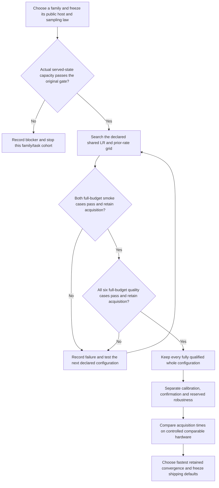

# Public-policy family search preparation

The Atlas/E22 study answers two separate questions. First, can the actual
public family/host/prior/served sampler express the target at its original
numerical tolerance? Second, can ordinary training with one shared set of
knobs reach and retain all required passes? A capacity witness answers only
the first question. It grants no trained pass, convergence time or default
promotion.

The current round stops at scoped screening. Timing is diagnostic while
other GPU services are active; speed ranking and public-default adoption are
disabled. The separate Forge MoG study remains on its own 24-case board.

The [frozen specification](policy-search.json) declares four configurations
per family: LR `.006375` or `.0085`, crossed with prior rate `1` or `2`.
Each configuration uses those same two knobs on all eight cases. The original
host-specific Recipe adaptations are recorded rather than silently removed.
The [coordinator contract](../../../docs/forge-policy-family-search.md)
describes full horizons, original gates, first acquisition and uninterrupted
hold, early stops, exact receipt verification and cost accounting.

That first grid concluded with no fully qualified configuration. Each family
has one smoke PASS, three configurations with numerical FAIL, and one original
image PASS that acquired too late for the study's five hold checks. No quality
case was reached. Atlas and E22 produced identical numerical results on these
small-population reference hosts; the distinct large-population Atlas backend
remains untested by this sweep. Failure is a property of these bound settings
and hosts, rather than proof that either family cannot represent the targets.
The [checked first-grid archive](policy-round1-archive.json) retains all ten
complete original runs, including late original passes, with 268.791232 paid
seconds and their exact executed source.

The [second specification](policy-search-round2.json) tests the actual public
preset LR .00425 and half that rate .002125, crossed with the same prior rates
1 and 2. It changes no original gate, horizon, host or protocol seed. This
stabilization hypothesis follows the first grid's image-fidelity, projected
shape and retention failures. No old failed knob pair is repeated. Its new
source cohort records PR252 ownership integration and stronger archive guards;
the public trainer, cases and capacity proof bindings remain unchanged. Old
trained passes cannot fill this new cohort's denominator.

The [joined capacity card](policy-representation.json) contains all sixteen
family/case witnesses. Every record binds the current case, preset, sampler,
source files, complete zero-update CPU public checkpoint and observed arrays.
Planning restores the checkpoint and verifies actual draws against their
original scorers. Vector and image constructions use actual public hosts;
native constructions also demonstrate the local support geometry required
by their real selected density backend. These analytic parameter states do
not establish that the initializer or optimizer can reach them. The
[checked capacity archive](policy-capacity-archive.json) binds all selected
state/sample bytes and the current proof/scorer sources. Git shares its compact
manifest; the raw archive must be transferred or accessed on the shared machine.

The [vector](POLICY_VECTOR_REPRESENTATION.md),
[image](POLICY_IMAGE_REPRESENTATION.md) and
[native CPU admission](POLICY_NATIVE_CPU_ADMISSION.md) readouts retain the
original failures, source compatibility checks, destructive controls and
construction limits. PR251's WordFixture integration changed the image
provider file identity. Replaying its four retained image states reproduced
the original samples, targets and metrics bitwise without training. The live
word-task source binding now matches that integrated provider; its archived
publication keeps its original source and verdict.

The first admission diagnostic exposed a coordinator comparison bug: native
capacity cards retained all original primary scoring metrics, while the public
observer also returned separate clean-output diagnostics. The new coordinator
now checks exact served arrays, every original primary metric and the unchanged
pass/failure bounds. Its negative controls reject changed samples and corrupted
primary metrics. The initial diagnostic stays in the local archive; it launched
no ordinary training and supplies no qualification.

The initial C2 Atlas launch stopped in argument parsing: its new coordinator
passed an unsupported `--seed` flag. All four setup attempts, their logs and
6.165411 paid seconds are retained in the
[initial launch readout](policy-atlas-initial-launch/README.md). They performed
zero optimizer updates and produced no scientific result. The linked v2 study
uses supported arguments and checks each case's actual fixed protocol seed in
preflight. Real public-CLI parser controls cover both families and all eight
cases. Protected API/provider bytes and capacity bindings are unchanged.

The total paid round cap including that setup remains 10,800 seconds. The v2
Atlas allowance is 5,393.834589 seconds and E22's is 5,400; candidate ceilings
remain 5,400. Full task reservations are separate: 2,100 seconds
for each native case and 180 seconds for each selected vector/image case,
plus 120 seconds of export grace. Worst-case reservation is 8,160 seconds per
configuration and 65,280 for the complete matrix; those figures do not imply
that the round may exceed its actual paid cap. Unused reservation returns to
the family after measured completion. Remaining budget must cover the entire
next task allowance before admission.

After debiting the completed first grid, the second grid can spend at most
10,525.043357 further paid seconds: Atlas 5,256.986966 and E22 5,268.056391.
The original setup, first grid and second grid together stay within the same
10,800-second cap. A fresh study ID or source commit grants no extra budget.

The second grid concluded with seven original image passes and one original
failure; the additional study has five failures and three late acquisitions,
with no pass. The original full 600-update horizon was completed in all eight
runs. One Atlas/E22 setting diverged after E22's recorded reopen event; sharing
a density backend does not establish that their full policy states or outcomes
are equivalent. The [checked second archive](policy-round2-archive.json) retains
all eight runs and their source for 189.031428 paid seconds.

The [third specification](policy-search-round3.json) declares one further
finite intermediate-rate grid: .0031875 or .0053125, crossed with prior rate
1 or 2. It brackets observed late acquisition and loss of retention rather
than assuming a monotonic learning-rate effect. Gates, horizons, denominator,
seed, candidate ceilings and task allowances stay fixed. Its 10,336.011929
seconds are the exact remaining original allowance, split into Atlas
5,163.721507 and E22 5,172.290422. Previous errors and results remain debited
and cannot fill the new source cohort's trained gates.

Root admits at most one serial experiment worker per GPU, with at least
12 GiB free and one Torch/BLAS CPU thread. GPU0 remains excluded while the
external graphics workload is hot. Both family lanes can run serially on
GPU1 with separate archives. Other users' processes remain untouched.

Each admitted execution cohort stays at one committed source throughout its
lanes. A linked engineering repair starts a new explicit cohort and archive;
it never overwrites a failed or interrupted attempt. Partial
publications use a separate worktree so the execution HEAD cannot change
between children. Bulk raw logs, arrays and checkpoints stay outside Git;
compact certified metrics and illustrative actual-training GIFs are published
with exact archive identities. Failed or interrupted attempts remain visible
and are never automatically repeated.
