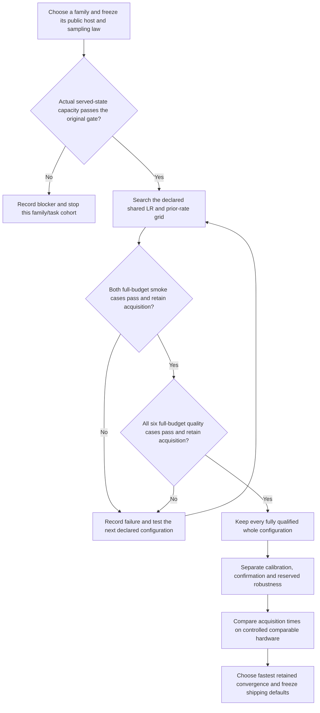

# Public-policy family search preparation

The Atlas/E22 study answers two separate questions. First, can the actual
public family/host/prior/served sampler express the target at its original
numerical tolerance? Second, can ordinary training with one shared set of
knobs reach and retain all required passes? A capacity witness answers only
the first question. It grants no trained pass, convergence time or default
promotion.

The current round stops at scoped screening. Timing is diagnostic while
other GPU services are active; speed ranking and public-default adoption are
disabled. The separate Forge MoG study remains on its own 24-case board.

The [frozen specification](policy-search.json) declares four configurations
per family: LR `.006375` or `.0085`, crossed with prior rate `1` or `2`.
Each configuration uses those same two knobs on all eight cases. The original
host-specific Recipe adaptations are recorded rather than silently removed.
The [coordinator contract](../../../docs/forge-policy-family-search.md)
describes full horizons, original gates, first acquisition and uninterrupted
hold, early stops, exact receipt verification and cost accounting.

The [joined capacity card](policy-representation.json) contains all sixteen
family/case witnesses. Every record binds the current case, preset, sampler,
source files, complete zero-update CPU public checkpoint and observed arrays.
Planning restores the checkpoint and verifies actual draws against their
original scorers. Vector and image constructions use actual public hosts;
native constructions also demonstrate the local support geometry required
by their real selected density backend. These analytic parameter states do
not establish that the initializer or optimizer can reach them. The
[checked capacity archive](policy-capacity-archive.json) binds all selected
state/sample bytes and the current proof/scorer sources. Git shares its compact
manifest; the raw archive must be transferred or accessed on the shared machine.

The [vector](POLICY_VECTOR_REPRESENTATION.md),
[image](POLICY_IMAGE_REPRESENTATION.md) and
[native CPU admission](POLICY_NATIVE_CPU_ADMISSION.md) readouts retain the
original failures, source compatibility checks, destructive controls and
construction limits. PR251's WordFixture integration changed the image
provider file identity. Replaying its four retained image states reproduced
the original samples, targets and metrics bitwise without training. The live
word-task source binding now matches that integrated provider; its archived
publication keeps its original source and verdict.

The first admission diagnostic exposed a coordinator comparison bug: native
capacity cards retained all original primary scoring metrics, while the public
observer also returned separate clean-output diagnostics. The new coordinator
now checks exact served arrays, every original primary metric and the unchanged
pass/failure bounds. Its negative controls reject changed samples and corrupted
primary metrics. The initial diagnostic stays in the local archive; it launched
no ordinary training and supplies no qualification.

The paid round cap is 10,800 seconds, with independent 5,400-second family
and candidate ceilings. Full task reservations are separate: 2,100 seconds
for each native case and 180 seconds for each selected vector/image case,
plus 120 seconds of export grace. Worst-case reservation is 8,160 seconds per
configuration and 65,280 for the complete matrix; those figures do not imply
that the round may exceed its actual paid cap. Unused reservation returns to
the family after measured completion. Remaining budget must cover the entire
next task allowance before admission.

Root admits at most one serial experiment worker per GPU, with at least
12 GiB free and one Torch/BLAS CPU thread. GPU0 remains excluded while the
external graphics workload is hot. Both family lanes can run serially on
GPU1 with separate archives. Other users' processes remain untouched.

Execution stays at one committed source throughout both lanes. Partial
publications use a separate worktree so the execution HEAD cannot change
between children. Bulk raw logs, arrays and checkpoints stay outside Git;
compact certified metrics and illustrative actual-training GIFs are published
with exact archive identities. Failed or interrupted attempts remain visible
and are never automatically repeated.
