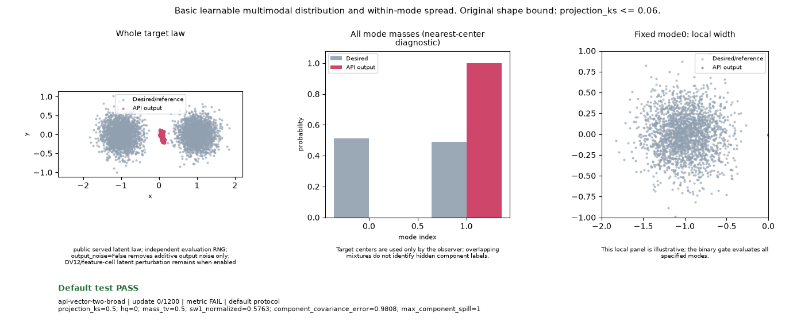

# Family defaults search: completed bounded campaign

This campaign tested **60 whole configurations across seven families**: 28
Forge MoG configurations and 32 public-API Atlas/E22 configurations. It found
**no fully qualified winner and no shipping default**. Early gates stopped
failing or incompletely confirmed candidates; all unreached requirements remain
UNKNOWN. The two suites have different priors, serving laws and denominators,
so their scores stay on their respective primary boards.

One public-policy balance, LR `.0053125` and prior multiplier
`1.5`, passes both original smoke toys for Atlas and E22. It retains the added
intensity hold but confirms broad-mixture acquisition only at update 1100 of
1200, leaving two later passing observations instead of five. Its study score
is therefore **1/8**, with broad persistence INCOMPLETE and all six quality
requirements UNKNOWN. This is a concrete improved candidate, not a selected
default. The strongest observed MoG candidate is KA2 at **10/24** below.

This actual E22 broad-mixture run illustrates the original target and its
original PASS. Its separate study verdict is **INCOMPLETE: two of five required
later hold checks were available**. Atlas's matched run and every other observed
configuration are linked on the primary policy board.

The [completion receipt](campaign-completion.json) records exact costs, source
cohorts, unknown denominators and archived evidence. The
[open-toy review](OPEN_TOY_PR_REVIEW.md) explains the distinct questions in
PRs #245, #246 and #253 and the source-bound GIF follow-up #254.

The first frozen search completed **28 complete configurations across five
families**. None passed every required gate. The best observed KA2 configuration
passed **10/24** before failing unequal mode mass. These results identify next
research candidates; they authorize no public-default promotion.

All candidates retained the same **3 smoke / 19 quality / 2 endurance**
denominators. Failed prerequisites stopped subsequent training. Unreached tasks
remain UNKNOWN. The table is sorted by the number of passed required gates in
this one source/runtime cohort; equal scores use alphabetical display order.

| Family | Best observed configuration | Smoke | Quality | Endurance | First required failure | Family trials |
| --- | --- | ---: | ---: | ---: | --- | ---: |
| KA2 | `093c6f2bd417` — LR .006375, prior rate1 | 3/3 | 7/19 | 0/2 | Unequal-mass mixture: rare component and component shape | 4 |
| BCap | `08689a73c551` — D rate2, prior rate4, penalty .5 | 3/3 | 5/19 | 0/2 | Mode hold:7/8 modes | 8 |
| GAN v3 release0.7 (MoG) | `1e266b5a2986` — LR .006375, prior rate1 | 3/3 | 5/19 | 0/2 | Mode hold:3/8 modes | 4 |
| K3P | `00b69f56de29` — LR .0085, prior rate2 | 3/3 | 5/19 | 0/2 | Mode hold:2/8 modes | 4 |
| R1/R2 | `302b6baa44f6` — LR .0085, D rate1, cosine start .2/floor .1 | 3/3 | 1/19 | 0/2 | Residual correspondence: MSE .148376 | 8 |

Selection is one entire configuration per family. It never combines successful
tasks from different configurations. The hash is a deterministic tie breaker,
not evidence that one failed configuration learns faster than another.

KA2's unequal-mass failure is more informative than its aggregate quality:
97.6% of samples are high quality and total mass TV is .0421, yet the least
represented component has only .598 of its target mass. The full-component
covariance eigenvalue ratio is .198, indicating insufficient local width in a
component. The distribution gate catches omissions that aggregate appearance
can hide. See the certified task metrics rather than interpreting HQ alone as
convergence.

The two strongest BCap trials retain7 of8 ring modes with HQ1/.99976. Four
half-rate critics fail the earlier movement gate; two other full-rate critics
fail trajectory identity. R1/R2's best config learns trajectory identity
(MSE1.31e-6) but loses residual correspondence. Another R1/R2 trial passes its
final movement bounds while having only a two-observation passing suffix,
short of the required five. These are measured numerical failure signatures and failed
bounds, not causal claims about an isolated optimizer knob.

The round consumed **1,587.149 paid task seconds** in156 certified attempts.
The worker used one task per GPU and one bounded CPU lane. Smoke/behavioral
tasks ran on CPU; reached vector/mode-hold tasks used the admitted CUDA lane.
No image, native100 or endurance task was reached in this round. The declared
worst-case reservation covered all configurations, while the execution stop
was10,800 paid seconds. Early failures saved that later work.

The executed source commit is
`05a2b3c021155fa72471b2293c3fd6d41d1e58a0`, digest
`9f89fa7cc7af552ef7e41405fab415abbd00acf3d3c6e4af8e4435fb2423142e`.
This runtime used Python3.12.13, Torch2.13.0+cu126 and RTX A6000 devices with
driver580.173.02. Historical results used a different runtime and cannot
supply missing passes or a causal before/after comparison. Other GPU services
were active, and full acquisition-time contracts are absent on some legacy
adapters, so there is no fastest-convergence ranking.

The provisional screen is useful for finding failures. Accepted calibration
and separately registered confirmation/robustness are still prerequisites for
shipping a family default. Exact parameter-capacity witnesses establish the
limited representability question; they perform no ordinary training and
provide no convergence credit.

Use the [single shared family leaderboard](../technique-inventory.md) for the
current selected rows. Each search report preserves every complete candidate,
gate, original receipt binding, unknown task and paid cost:

- [KA2](../configuration-search/ka2-family-defaults-round1-v1.json)
- [BCap](../configuration-search/bcap-family-defaults-round1-v1.json) and [failure readout](BCAP_ROUND1.md)
- [GAN v3 release0.7 (MoG)](../configuration-search/release07-gan-v3-mog-family-defaults-round1-v1.json)
- [K3P](../configuration-search/k3p-family-defaults-round1-v1.json)
- [R1/R2](../configuration-search/r1r2-modern-family-round1-v1.json) and [failure readout](R1R2_READOUT.md)

[The checked archive and restoration manifest](phase1-archive.json) bind the
original request/evidence/result bytes, source and queue logs. Compact proof
receipts and immutable numerical snapshots are committed for team review.
Bulk artifacts live on this machine at the manifest's path; sharing Git alone
does not transfer that archive. Independent regrading requires its original
receipts, not the compact display summaries.

The public-API Atlas/E22 searches use the actual selected public sampler, full
unchanged budgets and an additional first-acquisition/hold requirement. Their
eight-case results stay separate from this 24-case MoG cohort. Use the
[single policy-family goal board](../policy-family-inventory.md) and its
[compact JSON](../policy-family-inventory.json) for every whole configuration,
required denominator, original/study verdict and actual training GIF.

All four policy grids completed **32 configurations and 42 full original case
runs**, comprising 27 original PASS and 15 original FAIL verdicts. The additional
study gate records 10 PASS, 21 FAIL and 11 INCOMPLETE runs. Every candidate stops
before quality: none passes both smoke study gates. The primary board retains
all **256 required cells**, including **214 UNKNOWN**, plus all 42 original
training GIFs and ten separate reviewed broad-mixture GIFs. These counts describe
the completed screen and supply no pooled cross-cohort family score.

Independent [binding checks](policy-board-binding-review.json) verified all 42
complete receipts, 168 bound raw files, 586 committed source blobs, 52 GIFs and
69 primary-board links. The [visual review](policy-board-visual-review.json)
checked readable goals and the distinct original, instantaneous and study
verdicts. Publication performed zero model updates, draws or rescoring.

Seven second-grid runs pass the original image test without passing the extra
retention rule. The [failure diagnosis](POLICY_FAILURE_DIAGNOSIS.md)
explains the measured fidelity, Gaussian-CDF and hold failures, including a
real Atlas/E22 policy-event divergence. The [E22 readout](E22_POLICY_READOUT.md)
and [Atlas readout](policy-atlas-execution-readout/README.md) keep the original
high-rate cases and their full provenance. The [third-grid diagnosis](C5_DIAGNOSIS.md)
and [final-grid diagnosis](C6_DIAGNOSIS.md) explain the later balances and why
a good endpoint or late original PASS cannot fill the persistence requirement.

The [preparation and process diagram](POLICY_PREPARATION.md) links all sixteen
supported capacity witnesses, source freezes, four checked archives and bounded
specifications. The policy screen spent **1,134.327 paid child/setup seconds**
from its original 10,800-second cap, including the preserved zero-update CLI
failure. It completed **31,200 ordinary API updates**; no native quality run
was admitted. The unused allowance does not automatically add another grid.
No original verdict, horizon or threshold changed, no failed setting repeated,
and no historical pass filled a new source cohort.

The next justified research question is acquisition and uninterrupted retention
under the actual public sampler, followed by calibration of the screening rule
and a separately registered confirmation/robustness cohort. Atlas's large native
feature-cell behavior remains unmeasured by ordinary training here. With no whole
positive, comparing speed or promoting a family default would overstate the
evidence. Public trainer/default files were not modified by this campaign.
