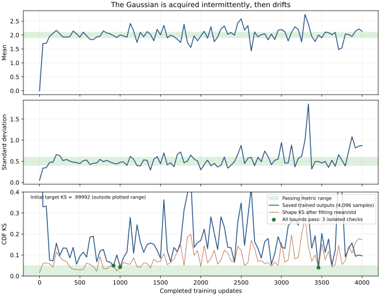

# Why the scalar Gaussian still fails

**The target is easy and the present architecture/prior can represent it. The
saved BCAP trajectory learns a close fit, then loses it.** A CUDA representation
control using the same network and unchanged initial prior passes 24/24 numerical
checks. Saved-state probes instead show moving particle centers and an increasingly
skewed output law. This supports a training-stability investigation; it does not
yet isolate the critic, generator or prior update as the cause.

This report extends PR [#316](https://github.com/255BITS/ParticleGAN/pull/316).
It adds **zero training updates**, changes no Gaussian task or numerical bound,
and leaves the [single technique leaderboard](../technique-inventory.md) and
historical qualifications intact. The ring16 repair remains in place.

## The actual problem and architecture

These values were checked against the task, resolved recipe and tensor shapes in
the saved initial/1,000/4,000-update checkpoints—not constructor defaults.

| Part | Effective setting |
| --- | --- |
| Target | One scalar Gaussian, mean 2, standard deviation .5 |
| Latent z | **2 coordinates**; each sampled batch has shape `(128, 2)` |
| Generator | Linear 2→32, LeakyReLU(.2), Linear 32→32, LeakyReLU(.2), Linear 32→1; **1,185 parameters** |
| Critic | Five input features: x, sin(πx), sin(2πx), cos(πx), cos(2πx); Linear 5→32→32→1 with LeakyReLU(.2) between layers; **1,281 parameters** |
| Prior | 256 uniform, learned MoG locations, each in R²; **512 learned coordinates**; fixed isotropic latent width |
| Initialization | Public deterministic orthogonal named-parameter initializer; prior R2 normal table at init_std=1 |
| Training | Batch 128; one D update and one joint G/prior update per host update; seed 0 and isolated checkpointed streams |
| Serving | Clean, live `GANTrainer.sample`; latent MoG noise remains present; no EMA or output noise |

There is no output sigmoid/tanh, batch normalization, encoder, extra reconstruction
objective or need to discover several target modes. The earlier Gaussian handoff
incorrectly said z_dim=4 and width 64; those are **not** this scalar host's settings.
It is corrected in this PR.

The current task uses latent MoG sigma **.025**. The closest prior-grid run and
the saved continuation analyzed here explicitly use **.1**, with every other
condition held fixed. This diagnostic has not silently changed the current task.
The standalone scalar API K3P publication uses init_std=.5 and another
initialization/RNG cohort; its result cannot replace this BCAP baseline.

The selected whole BCAP configuration uses paired relativistic logistic loss,
real/fake BCAP coefficient and gradient cap 1, dualnorm network updates and
sampled-row normalized prior updates. G/D/prior steps are **.012/.018/.03**, with
zero momentum, no prior regularizer and no additive training noise. Both schedule
floors are 1, so all three rates stay constant. The recipe horizon stays 1,000
even when the external execution cap extends to 4,000.

## What is failing

The full gate requires 4,096 finite clean/live samples, mean within .1 of 2,
standard deviation in [.4,.6], and analytic Gaussian CDF KS <=.05. All conditions
must pass together at five consecutive terminal checks. The original 1,000-update
task has 24 checks; the duration study preserves that spacing for 96 checks.

| Saved update | Mean | Std | KS <=.05 | Full instantaneous check |
| ---: | ---: | ---: | ---: | --- |
| 0 | -.00274 | .04766 | .99992 | FAIL |
| 917 | 1.97495 | .45474 | .04941 | PASS |
| 1,000 | 2.00652 | .47869 | .04297 | PASS |
| 2,000 | 1.96531 | .29812 | .16982 | FAIL |
| 3,000 | 2.19474 | .94244 | .13952 | FAIL |
| 3,334 | 2.38971 | 1.85645 | .29491 | FAIL |
| 3,459 | 1.99803 | .49568 | .04023 | PASS |
| 4,000 | 2.13768 | .87398 | .09594 | FAIL |

Only **3/96** trained checks pass all bounds, and none are consecutive. KS fails
93 checks; mean fails 51; width is too small at 16 and too large at 24. These
counts overlap. The model acquires the law intermittently, rather than converging
slowly toward a stable fit. The near-point initial output also explains why it
must initially learn both a large location shift and roughly tenfold width growth.

All 97 saved sample sets reproduce their original metrics exactly. Three full
contexts restore exactly, including models, optimizer and RNG state. Fresh,
separately streamed **32,768-sample GPU** observations agree: KS .04160 at 1,000
and .09307 at 4,000. The latter has std .86395 and skewness 1.602. After fitting
away mean and width, its Gaussian shape KS is still **.16831**, versus .03613 at
1,000. Merely checking moments or drawing more evaluation samples will not repair
that shape.

## The same model can pass

A separately declared, **target-informed fixed representation control** installs
an affine map in the existing two-layer LeakyReLU network. Two signed channels
carry z₀ through both activations. The untouched initial 256-location R2/MoG prior
at sigma .1 maps to the required mean and width with
`G(z) = 1.9943537 + .4970637*z[0]`.

It passes **24/24** draws of 4,096 samples through the public `GANTrainer.sample`:
KS .00654–.02675, mean error .00114–.04148 target sigma, std ratio .97325–1.01804.
Its exact mixture CDF has grid error .004008; the conservative between-grid
Lipschitz bound is .005086, with negligible tails outside [-2,6]. The implemented
network agrees with the affine map within 4.8e-7 over z₀ in [-10,10].

This is a capacity/scorer control, **not a learned pass** or substitute initializer.
It rules out insufficient width/depth, too few latent coordinates, or a necessary
increase in particle count for this initial-prior representation. The previous
[prior grid](../tier1-prior-smoke/README.md) also shows larger tables regress
acquisition at the fixed budget.

## What makes the optimization harder than the target

**The input distribution moves while G learns.** Relative to initialization,
mean particle displacement is .719 latent units at 1,000 and 1.403 at 4,000;
coordinate standard deviations grow from about 1 to 1.69/1.79. Equal-weight
per-component GPU probes decompose the output variance as follows:

| Saved model | Within-component variance | Between-component variance | Fraction within components |
| --- | ---: | ---: | ---: |
| Initial | .0000305 | .00217 | 1.39% |
| 1,000 updates | .00476 | .22279 | 2.09% |
| 4,000 updates | .00351 | .74808 | .47% |

At 4,000, the center-only law has std .86750 and KS .09375, close to the fully
sampled law. The excess spread is primarily between particle components; it is
not explained by within-component latent jitter. Both G and the locations can
change these centers, so this decomposition alone does not assign causality to
the prior optimizer. Component probes use exactly 128 draws per component and
are separate from uniform-random gate sampling.

**Small gradients do not ordinarily imply small updates.** Dualnorm replaces a
matrix gradient with its polar factor; biases use normalized directions. Prior
rows move by up to .03 when sampled, versus MoG widths .1 here and .025 in the
current task. For 256 rows and batch 128, about 101 unique rows are expected per
G update. There is no late reduction in these movement scales. At a nearly
correct distribution, finite-batch adversarial gradients can still produce
substantial movement. Constant normalized steps are therefore a specific
stability hypothesis, not a measured root cause.

**The critic contains oscillatory features and a soft gradient cap.** Fourier
features are useful for narrow multimodal targets but unnecessary for a single
Gaussian. The raw x feature remains present, so periodic features do not make
the target unidentifiable. The measured maximum |D′(x)| on [0,4] increases from
1.059 at 1,000 to 2.208 at 4,000; about 19.4% of that grid exceeds cap 1 at the
last checkpoint. BCAP penalizes excess slope rather than clipping it. These
saved functions show nonzero, spatially varying gradients; they do not prove
that Fourier features or BCAP caused the failure.

## Continuous learning: options and next comparison

The required behavior is to acquire a stationary law, retain its numerical
quality while training continues, and respond again when the data law changes.
Use constant base rates and mechanisms driven by the current state or gradient
evidence. An elapsed-step learning-rate schedule, selected checkpoint or
permanent shutdown after acquisition does not answer this question. With
finite-batch stochastic gradients, quality should remain within declared bounds;
exactly motionless parameters are not required.

**The existing prior regularizer is not a position anchor.** Its current weight
is zero and the public recipe rejects negative weights. The implementation in
[`vicreg_loss.py`](../../../particlegan/vicreg_loss.py) penalizes coordinate
standard deviations below 1 and off-diagonal covariance. It permits expansion
above 1 and arbitrary topology. The saved marginal standard deviations already
exceed 1 at both 1,000 and 4,000, so its variance-floor term is inactive there.
Increasing the coefficient can decorrelate the prior, but does not provide the
missing upper-spread or positional restraint. It could help another failure;
that has not been tested in this scalar cohort.

| Option | Intended behavior | Limitation / implementation status |
| --- | --- | --- |
| Smaller constant prior step | Reduce how far locations move each time, with full ability to keep learning | Existing knob. Prior rates .003/.01/.03/.1 already appeared in the older whole pacing search at sigma .025/G=.01; smaller rates alone are not an established fix. The present sigma-.1 cohort differs. |
| Two-sided spread restraint | Penalize both contraction and expansion around a declared latent spread, leaving positions free to rearrange | New objective; preserves no particular output variance because G can rescale. Must be distinguished from the existing lower-bound VICReg term. |
| Fixed position spring | Penalize displacement from the initial prior, e.g. λ meanᵢ ‖zᵢ−zᵢ,initial‖² | Clock-independent. Biases latent representation and may resist useful prior motion on other tasks; a strong initial anchor leaves G responsible for more transport. |
| Gradient-evidence damping | Reduce response when row forces cancel or are inconsistent; increase it again when persistent change appears | Best match to settle-and-adapt behavior, but requires an explicit response rule and checkpointed history for this BCAP optimizer. Existing A2/DV12 controls are not switch-compatible with full dualnorm. |
| Extragradient / optimistic game update | Use a predictor/corrector or previous-gradient correction to address coupled G/D/prior oscillation | New optimizer comparison, with additional compute/state. Does not assume the prior alone is responsible. |
| Zero-centered critic gradient restraint | Encourage the critic to flatten near matching data rather than only penalizing slopes above cap 1 | A loss/penalty change, not prior stabilization. Prior R1/R2 failures remain relevant; theoretical local convergence results do not establish convergence of this stochastic normalized implementation. |

**Do not expect a spring added before row normalization to make steps small.**
The current prior update is approximately
`Δzᵢ = −η * gᵢ / (‖gᵢ‖ + eps)` for sampled rows. Replacing `gᵢ` with
`g_advᵢ + g_springᵢ` normally changes direction while preserving a near-η step.
Opposing forces and minibatch noise can still produce oscillation. A restoring
operator whose correction scales with displacement, applied outside that
normalization, or a response that retains force magnitude can supply a different
damping mechanism. Its units, sampled-row ownership and state must be explicit.
Anchoring to a moving average requires its own checkpointed reference; it can
follow drift and is not equivalent to a fixed initial anchor.

There is relevant prior art for game updates:
[Gidel et al.](https://arxiv.org/abs/1802.10551) investigate extrapolation and
extrapolation from the past for stochastic GAN optimization.
[Mescheder et al.](https://arxiv.org/abs/1801.04406) analyze local convergence
under suitable assumptions with zero-centered gradient penalties. Neither paper
proves that any proposed change repairs this particular BCAP/dualnorm run.
Compiled memory also records that disabling A2 worsened a different native
learned-MoG host; that is context, not a matched scalar result.

**Recommended order:** first isolate the moving input law with a separately
declared **frozen-prior-from-initialization control**, alongside the learned-prior
baseline. Keep both networks learning throughout. This is a causal diagnostic
with a different declared prior-learnability cohort, not a proposed final
particle learner and not a freeze triggered at update 1,000. A stable frozen
control would support investigating prior response; continued drift would show
that stabilizing the prior alone is insufficient.
Bind the frozen control to the exact baseline-initialized R2 coordinates before
freezing: changing `learnable` must not silently replace those coordinates with
constructor Gaussian draws or change the sampling streams.

For an eventual repair, prefer a bounded comparison of **prior force-response
damping** against the unchanged row-normalized update. An initial-position spring
is a useful alternative if its representational bias is acceptable. These are
unexecuted proposals, not admitted Forge studies or promises of convergence.
Plain-optimizer validation currently requires latent damping disabled and rejects
continuous update policies; exposing a supported BCAP response rule is necessary
before testing that structural candidate. Do not label it a working Recipe flag.

Use seed 0, public initialization, matched target batches and isolated/checkpointed
streams. Hold architecture, sampling, budgets and cadence fixed within each
declared cohort; compare one complete trainer configuration across Gaussian and
ring. Assess live output quality through a prespecified continued stationary hold,
then a separate prespecified target shift and reacquisition test with the same
update rule. Preserving the Gaussian gate and ring pass remains necessary; no
task-specific winner splicing or relaxed CDF bound supplies a repair.

## Evidence and reproduction

[Protocol](protocol.json), [compact results](results.json) and
[artifact receipt](provenance.json) bind all consumed evidence hashes and the
analysis source. The [duration report](../tier1-prior-duration/README.md) retains
its original failed verdict and [actual-training GIF](../tier1-prior-duration/mog100-n256-gaussian1d_acquisition.gif).
No new GIF is manufactured for this zero-update analysis. The graph below is
derived solely from the saved numerical observations.



Hydrate the original archives described in the prior/duration reports, then run:

```sh
CUBLAS_WORKSPACE_CONFIG=:4096:8 OMP_NUM_THREADS=1 MKL_NUM_THREADS=1 OPENBLAS_NUM_THREADS=1 \
python -m benchmarks.toy_audit.gaussian1d_diagnosis --device cuda:0 \
  --output runs/api/gaussian1d-diagnosis-reproduction \
  > runs/api/gaussian1d-diagnosis-reproduction.log 2>&1
tail -F runs/api/gaussian1d-diagnosis-reproduction.log
```

All new network forwards, prior/model sampling and derivative probes use CUDA.
Frozen reference scoring and exact analytic CDF calculations use CPU. Every
consumed diagnostic RNG stream is named and checkpointed; the probes leave
restored training state unchanged. Raw per-check diagnostics, RNG dumps and the
execution log stay in the ignored artifact archive. No additional qualification,
calibration result or leaderboard is created.

Validation: 97 exact metric recomputations, three exact checkpoint restorations,
24 passing capacity checks, unchanged-state assertions and CPU-fallback rejection
pass. The numerical analysis loop takes 1.143 seconds, excluding setup, rendering
and archival work. The 89 focused PR checks also pass; Forge validation, memory
freshness, catalog coverage and whitespace checks pass.
