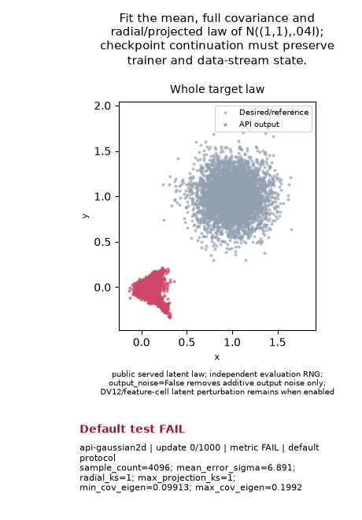

# Gaussian mean, covariance and distribution recovery

Supervised status: **BUDGET_EXCEEDED**. Accepted numerical verdict: **UNAVAILABLE**.
This is one existing additional question (`api-gaussian2d`, source-family-16),
separate from the original 26-slot suite and the named 10,500-second diagnostics.
It gives no historical, default or fair-speed credit. Owner evidence is separate
from density recovery. Checkpoint persistence is retained; no new continuation
test or checkpoint-resume claim is made.

The target is `N((1, 1), .04 I)`. The unchanged full protocol requires 1,000
updates, 20,000 prior rows, batch 2,048 and 25 actual reads of 4,096 samples.
The original last five post-update checks are updates 834, 875, 917, 959 and
1,000. Gates are sample count >= 1,024; mean error <= .10 sigma; covariance
eigenvalues in [.85, 1.15]; radial KS <= .075; maximum projected KS <= .06.
The GIF's nine actual states show the target and selected generated distribution
at updates 0, 125, 250, 375, 500, 625, 750, 875 and 1,000. **BUDGET_EXCEEDED / accepted numeric UNAVAILABLE. Byte-original raw FAIL badge is unaccepted; retained illustration only.**

[Bound media context](gifs/goal-context.json).

C6 requests LR .0053125 / prior multiplier 1.5. The complete original Recipe is
in [results.json](results.json); nominal multipliers do not imply measured
displacements. The primary sampler is the public selected policy with output
noise off and actual DV12 latent perturbation retained. Averaged parameters may
be selected; this is neither forced EMA nor unperturbed-atom sampling.

One inclusive 180-second allowance covers startup, construction, training,
observations, original export and attestation, with zero grace and no retry.
Paid: 180.213874641 s; unmeasured interruption
reserve: 0 s;
charged: 180.213874641 s; overrun:
0.213874640875 s. These costs belong only to
this additional Gaussian attempt. Full numeric FAIL remains FAIL; software or
source INVALID and partial evidence receive no numerical or fabricated-media credit.
If the final attestation is absent after the deadline, a separately bound full
raw illustration can be shown with its unaccepted raw FAIL badge; it does not
substitute for the missing attestation or an accepted numerical result.

Frozen source `b1c33b79efaea16fe8c705af0f5c3af31d369fdf`, digest `889fcdb097e3ed6e45296faf83b92364b41441d28cd3030c5eb8ce2fd127a2bd`. The root's explicit terminal
card, all current source bytes, imported-source/observer/lease/cost joins and
original artifact hashes are verified. This publisher uses only standard library
and Pillow; it draws no samples, restores no model or tensor and calls no scorer.
Raw source/checkpoint/arrays/logs remain **LOCAL_ONLY**; hashes in
[input-index.json](input-index.json) do not claim an uploaded archive.
[Verification](verification.json) binds the copied media and compact report.
