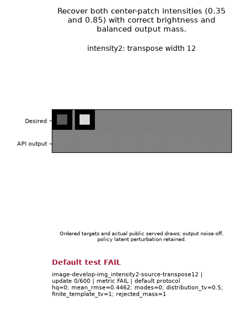

# Generator-step contrast: no candidate advances

Both Atlas and E22 failed the complete 600-update brightness test after all sixteen fresh capacity witnesses were supported. The smaller generator/output-noise step changes the sampled values, but it produces zero qualified modes at every recorded check. **Capacity: 16 SUPPORTED. Learning: 2 FAIL, 14 UNKNOWN.** Neither configuration advances to quality tests or qualifies as a default.

One whole tuple is shared across all eight cases for each family: `lr=.00265625`, `prior_lr_mult=3.0`, `d_lr_mult=4.5`. Relative to [the preceding contrast](https://github.com/255BITS/ParticleGAN/pull/267), nominal generator/output-noise steps halve, while nominal prior and critic rates remain .00796875 and .011953125. Actual role rates remain endogenous. Both families retain their original mechanisms, initialization, target, host, sampling law, seed, gates, horizons and scoring cadence.

| Required question | Capacity, both families | Atlas learning | E22 learning |
| --- | --- | --- | --- |
| Recover equal mass at center-patch brightness .35/.85 | SUPPORTED | FAIL, full 600 | FAIL, full 600 |
| Recover two broad Gaussian modes and their spread | SUPPORTED | UNKNOWN | UNKNOWN |
| Recover all 100 grid modes, occupancy and local width | SUPPORTED | UNKNOWN | UNKNOWN |
| Recover the stationary law under a fixed 25° rotation | SUPPORTED | UNKNOWN | UNKNOWN |
| Recover all modes of a staggered lattice | SUPPORTED | UNKNOWN | UNKNOWN |
| Preserve 55/30/13/2% occupancy and the rare component | SUPPORTED | UNKNOWN | UNKNOWN |
| Recover oriented covariance ellipses and narrow-axis spread | SUPPORTED | UNKNOWN | UNKNOWN |
| Recover four bar positions, orientations and pixel fidelity | SUPPORTED | UNKNOWN | UNKNOWN |

[Exact test questions and numerical goals](QUESTIONS_AND_MEDIA.md) explain why each requirement exists. [Machine results](results.json) retain both complete eight-case denominators, all capacity records, both original and added study grades, source/Recipe/runtime identities and costs. UNKNOWN records are unreached after the failed smoke prerequisite.

## Original training GIFs

Both show the .35/.85 reference patches, actual generated tiles and fixed grayscale at nine retained training checkpoints. All 25 recorded metric checks fail; neither run acquires the first five-pass window. Original full-protocol gate **FAIL** and added first-window hold **FAIL** are paired explicitly; later-hold confirmation is unavailable.

Atlas:

E22:

The final HQ and valid-mode counts are zero, assignment TV is .5 and rejected-mass-aware template TV is 1, above the .1 limits. All retained images are rejected by the per-image RMSE quality cutoff. The [media QA](MEDIA_QA.md) checked original bytes, first/middle/final frames, all finite sample arrays and ordered target banks. These two GIFs and NPZs are byte-identical; complete policy checkpoint files differ. This small host uses Atlas's reference backend; unreached native cases still test distinct family behavior.

[Retained-state diagnosis](PAIR_INTENSITY_ANALYSIS.md) separates measured output/gradient/controller signatures from unrecorded early forces. Smaller steps alone did not resolve brightness collapse. Different complete policies and earlier scientific cohorts retain separate identities.

[Original finite declaration and runnable commands](PLAN.md) are retained beside the completed readout. The prospective plan assigns no result.

## Verification and qualification

Scientific source: `488b792e2fb875894f017cf7043420f2bb66190f`; frozen execution snapshot: `ac779e01f99f725951778c5000443ae9c5c215f0fd17e74e9c6be53e6c929bd9`, 3,400 files. All 177 public definitions and all eight original case hashes loaded in a fresh copied-source process before GPU admission. The new runner, binder, unchanged delegated orchestration helper and original discovery JSON are explicitly bound. No package/configuration, original grader or existing result is modified.

Root separately replayed CPU capacity and certified retained traces at that frozen source; [execution receipt](certification-execution.json) records the actual successful combine. The [publisher](PUBLICATION.md), frozen separately at `e78ab3607d68216f26410f7b2025895fe2909f7f`, consumed that SHA-bound certification and verified **10,466 inputs**. Publication constructs/restores no model, draws no samples, rescales no images, performs no scoring and makes no optimizer update. [Independent publisher review](PUBLISHER_REVIEW.md) records the scope.

The original AND gates remain unchanged. Added persistence requires the first five consecutive post-update primary PASS checks, at least five later checks, and every later check passing. Images run 600 updates; vectors 1,200; native cases 7,000. Native primaries use the actual noisy served law, with clean outputs only diagnostic, 24 post-update 20,000-output checks and the final five. This supplies no historical Atlas19 independent 100,000-output credit. First smoke failure stops the whole candidate.

## Cost and shared evidence

| Charge | Seconds |
| --- | ---: |
| New Atlas scientific FAIL | 28.03618986881338 |
| New E22 scientific FAIL | 26.841381517937407 |
| Previous two scientific FAILs, counted once | 54.3587717928458 |
| Previous pre-training engineering ERROR, counted once | 4.757908704923466 |
| Cumulative campaign paid | **113.99425188452005** |
| Interruption reserve | **0** |
| Original shared campaign ceiling | **15,360** |

The remaining shared campaign allowance is 15,246.00574811548 seconds. Neither a new tuple nor a new source/output directory resets paid work. Supervised child intervals provide the paid clock; CPU capacity, queue wait and parent certification are separate. External contention prevents a fair convergence-speed comparison, and no fully passing candidate exists here.

Compact scores, questions and original GIFs are committed for review. [Raw archive and resolver instructions](ARCHIVE.md) disclose hash-bound bulk evidence, currently LOCAL_ONLY with no remote copy or retention assignment. The [bounded new-PR inventory](inventory-review.md) confirms develop remains source `4749b278`; no merged source/config/gate change intervened. Its latest-100 coverage limit is explicit.

This follows [PR #247's representation and shared-default process](https://github.com/255BITS/ParticleGAN/pull/247), the faithful historical/hold evidence in [#266](https://github.com/255BITS/ParticleGAN/pull/266), and the preceding critic-rate failure in [#267](https://github.com/255BITS/ParticleGAN/pull/267). Historical positives and capacity witnesses provide no new learned-default credit. A distinct family-owned next hypothesis must supply fresh representation, learning, persistence and applicable matched confirmation/calibration evidence before shipping.

The next accepted finite declaration is [KA2/K3P at shared .006375/1/1](KA2_K3P_NEXT_COHORT.md). It is unexecuted at this publication boundary. It keeps the eight target/gate questions but declares each public family's own fast/no-DV12/fixed-noise/scheduled serving law, with exact existing per-host horizon adaptations. The separate ordinary-board 4/5 results motivate the tuple and transfer no success. Fresh analytic no-fit capacity constructions remain unmeasured; all sixteen outcomes and the cumulative campaign debit are required before any learning admission.
