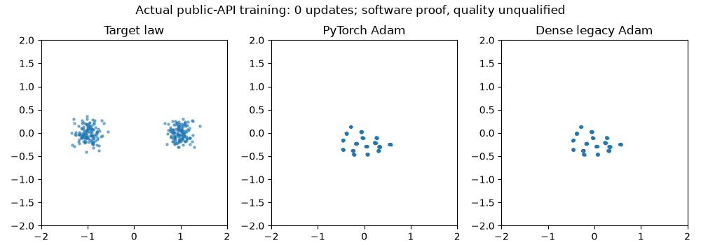

# Implemented search and optimizer/loss transfer

All four recommendations from the [original audit](README.md) are implemented
on `research/forge-hypergan-search-audit`, based on develop
`0115a92f68dbf9bdcdf9e4f7bfea0fff8606e752`. Original audit and extraction receipts
retain their source and conclusions. The
[operating guide](../../../docs/forge-search-spaces.md) describes the interfaces
and commands.

| Audit recommendation | Delivered behavior |
| --- | --- |
| Explicit role settings | Public `d_betas`, `d_eps`, `prior_eps`; inherited defaults, factories/schedules, Forge ownership/activity/signatures and checkpoint compatibility |
| Historical loss/update variant | Least-squares labels including the joint real stream; dense `TensorFlowV1Adam` with application clocks, beta powers and moments; constant/exponential schedules with a declared whole-update clock |
| Bounded compiler | Tagged literal/choice/logspace values, coupled dictionaries, lazy mixed-radix indexing, isolated versioned RNG, sampling without replacement and immutable draw/source manifests |
| Declared categories | Registered structural bases, conditional numerical domains, one matched cohort/campaign budget, freezing all categories before admission and whole-configuration selection |

`get_recipe("halloween")` represents the extracted G/D rates, moments and
epsilon plus least-squares labels `(-1,1,1)` through the public trainer. It
declares dense legacy Adam, constant rates, zero critic penalty and explicit
learned-prior settings. Historical architecture, AlphaGAN auxiliary loss,
original runtime, decay clock and trained outcome remain outside the bound
evidence. This transfers the requested optimizer/loss.

Default-valued additions stay implicit in archived configuration identities and
Recipe packets. Nondefault values are explicit. Backend mismatches, invalid
role clocks/powers/moments and unsupported dense-Adam modes fail before updating
live state. Existing qualifications retain their recipes and source cohorts.

## Public-API software proof

[implementation_probe.py](implementation_probe.py) asks whether the public
trainer consumes the named update variant and resumes its full trajectory
exactly. It freezes seed 0, a two-Gaussian target, G `2-16-tanh-2`, D
`2-16-tanh-1`, 16 learned MoG components with sigma `.025`, unstandardized
prior, float64 CPU execution, batch 16, eight updates and clean/live evaluation
at updates 0/4/8. Both arms use Halloween; only `adam_variant` differs.
Constructor, data, prior, training-noise and evaluation streams are isolated
and checkpointed; the public deterministic initializer is shared.

Acceptance requires identical initial model states and consumed batches,
finite changed models, positive numerical displacement between variants, and
exact full-state/sample continuation from update 4. Analytic scalar fixtures
and corrupted-state controls separately test the formula and rejection
behavior. Distribution fidelity is unqualified; target scatters provide
context for actual training states, not an acquisition verdict.

Reproduce in the project Python environment with Matplotlib and Pillow:

```sh
CUDA_VISIBLE_DEVICES='' python -u \
  reports/forge/hypergan-search-audit/implementation_probe.py \
  --output runs/forge/hypergan-search-audit/api-proof \
  > runs/forge/hypergan-search-audit/api-proof.log 2>&1
tail -F runs/forge/hypergan-search-audit/api-proof.log
```

The output directory is exclusive. A 60-second ceiling covers 8 updates per
variant and the explicit four-update replay. The
[source-bound receipt](implementation-proof.json) passes every declared gate:
initial states/batches match, full checkpoint continuation and samples are
exact, and the maximum final G difference between Adam variants is
`0.0006936814655116308`. The training/checkpoint checks took `.157` seconds on
the recorded CPU environment. Raw checkpoints and observations stay local.



## Validation

The final Forge/core sweep passed **2,025 tests and 113 subtests**, with one
CUDA-only test skipped, on Python 3.12.13 / Torch 2.14.0. It covers every
`test_forge*.py` module plus Halloween, plain BCAP, adversarial losses, recipe
schedules and the public trainer. A separate overlapping integration run passed
318 tests, including publication preservation, archived identities and memory
freshness. The larger CPU run exercised 5,386 passing tests; its seven
archive/generated-output checks were corrected and passed in those final runs.

`forge validate`, `forge compile --check`, example compilation/planning,
relative-link checks and `git diff --check` passed. The source catalog retains
its pinned historical sources. Publication refresh and memory compilation
preserve every scientific row, score and selection from develop. They add no
qualification or second leaderboard.

Raw test output stays in `runs/forge/hypergan-search-audit/`; tail
`final-forge-core-tests.log` or `api-proof-5dafb438.log` for the corresponding
software checks. Reproduce the final sweep with:

```sh
CUDA_VISIBLE_DEVICES='' OMP_NUM_THREADS=1 MKL_NUM_THREADS=1 python -m pytest \
  tests/test_forge*.py tests/test_halloween_recipe.py \
  tests/test_pure_bcap_recipe.py tests/test_adversarial_losses.py \
  tests/test_recipe_schedules.py tests/test_training.py -q
```

## Research use

The [example search](../../../configs/forge/search-spaces/halloween-transfer-v1.json)
is unexecuted. Compilation/planning launch no training and declare four
complete trials under a shared 10,080-second ceiling (2,520 per configuration).
The current view has six required Tier 1 tasks and a separate clock diagnostic.
Whole-configuration gate selection remains provisional.

Use the [existing current leaderboard](../technique-inventory.md) for scientific
results; this software proof supplies no ranked family score or public default.
A future comparison should preserve task architectures, target/batch laws,
initialization, prior, sampling, budgets and cadence. Test the frozen bundle
first; causal attribution requires separate declared factor groups. Do not
infer a decay clock from the unbound JSON or add seed-only studies.
