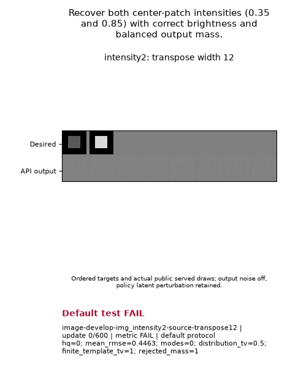

# KA2/K3P recover brightness modes but fail finite-template fidelity

Both shared `.006375 / 1 / 1` configurations completed the original 600-update intensity test and failed its original and added first-window gates. They recover both target brightness modes, but their generated images and frequencies miss the unchanged fidelity bounds. The first failure stops each family: **2 learning FAIL, 14 UNKNOWN, 16 cold capacity SUPPORTED**. Neither configuration is eligible for a public default or a speed ranking.

| Family | Modes / required | HQ / minimum | Finite-template TV / maximum | Original | Added hold | Later required cases |
| --- | --- | --- | --- | --- | --- | --- |
| KA2 | 2 / 2 | .969727 / .90 | .128906 / .10 | FAIL | FAIL | 7 UNKNOWN |
| K3P | 2 / 2 | .896484 / .90 | .202148 / .10 | FAIL | FAIL | 7 UNKNOWN |

Both retain 19 dim and 13 bright distinct row outputs. The frozen 1,024-output draw contains 613 dim and 411 bright outputs; its nearest-template frequency TV is .098633. KA2 rejects one overshooting bright output (31 draws); K3P rejects three (106 draws). Their finite-template TV includes this rejected mass. KA2 passes mode coverage and HQ but fails the combined fidelity bound; K3P also falls below HQ .90. This is partial photometric recovery, with no passing five-check acquisition window in any of the 25 recorded checks.

## Actual goal GIFs

Targets are the original .35 and .85 center patches. These are nine original training frames, copied byte for byte. Their FAIL labels remain visible. The inherited generic caption mentions latent perturbation; the actual named-family image law is **fast-only, no DV12, no added primary output noise**, as confirmed by the retained flags. The adjacent grades above are authoritative for the unchanged original and added study gates.

**KA2 — original FAIL; added hold FAIL.**

**K3P — original FAIL; added hold FAIL.**

## What each required problem verifies

Both family tuples stay unchanged across these eight questions. All original targets, host architectures, numeric gates, full horizons, seed 24002, evaluation seed 34002 and observation cadence remain fixed. The [full source-bound explanation](SOURCE_QUESTIONS_AND_OBSERVABLES.md) lists exact thresholds, distinct purposes, GIF goals and limitations.

| Required order | Original problem | Intended check | Full updates / evaluation count | KA2 learning | K3P learning | Cold Q1 |
| --- | --- | --- | --- | --- | --- | --- |
| 1 | intensity2 | Accurate .35/.85 pixels, both modes and balanced template probabilities | 600 / 1,024 | FAIL | FAIL | Both SUPPORTED |
| 2 | two-broad | Two equal Gaussian modes with continuous within-mode spread and analytic CDF fidelity | 1,200 / 4,096 | UNKNOWN | UNKNOWN | Both SUPPORTED |
| 3 | grid100 | All 100 narrow modes, uniform mass, local width and density-fidelity bounds | 7,000 / 20,000 | UNKNOWN | UNKNOWN | Both SUPPORTED |
| 4 | rotated100 | The same 100-mode requirements under a fixed 25-degree orientation change | 7,000 / 20,000 | UNKNOWN | UNKNOWN | Both SUPPORTED |
| 5 | staggered100 | Narrow-mode fidelity on a compressed, row-offset lattice | 7,000 / 20,000 | UNKNOWN | UNKNOWN | Both SUPPORTED |
| 6 | unequal-mass | Correct .55/.30/.13/.02 probabilities, including rare-mode occupancy and resolved shape | 1,200 / 4,096 | UNKNOWN | UNKNOWN | Both SUPPORTED |
| 7 | anisotropic | Three oriented ellipses with correct signed covariance, narrow eigen-directions and spill | 1,200 / 4,096 | UNKNOWN | UNKNOWN | Both SUPPORTED |
| 8 | bars4 | Four spatial bar templates with sharp pixels and balanced probabilities | 600 / 1,024 | UNKNOWN | UNKNOWN | Both SUPPORTED |

Cold capacity is a necessary constructive witness with fresh public owners, zero optimizer updates and the real original first-data prelude. It uses the actual full-count public sampler and unchanged gates. Native noisy requests have sigma zero at that legitimate clock; this grants no terminal-noise solvability or learned convergence credit. The three native learning cases remain unmeasured. Rotated and staggered targets are stationary questions; none is credited as a moving-target test.

## Diagnosis and next declared candidate

[Retained pair diagnosis](PAIR_INTENSITY_ANALYSIS.md) establishes bitwise sample equality through step475 and differences at500–600. Final fast/EMA/prior weights and optimizer states differ. KA2's penalty is still in its 800-call pure-A period; K3P's anchor has started under its public rate-driven handover. Those family laws are retained. Missing intermediate weights and row-to-output IDs limit causal attribution; endpoint recovery is not a root-cause proof.

The next [prior-rate contrast](NEXT_PRIOR_RATE.md) uses `.006375 / 2 / 1` for both families and all eight questions. It doubles the nominal prior learning-rate multiplier while leaving nominal G/D rates fixed; endogenous parameter movement need not double. It is an accepted, separate candidate under preparation, with no new capacity or learning credit at this publication boundary. It must acquire fresh candidate-bound proofs, preserve every original horizon/gate/seed, and charge the prior campaign once. It is a hypothesis, with no predicted repair.

## Source, verification and accounting

Scientific source: `26ff278c3796d775969391adc0bde52e3af11149`; publisher source: `5a74fc240f496164ef6ce6da7245145a60e489a8`. The original scientific package/configuration bytes remain at protected base `4749b2780add539df4bd8d2dd1d3cc9f002f77ad`. Family laws are fast-only, no DV12, AMSGrad false, fixed sigma warmed to .029 and the unchanged full-host cosine schedules. Image/vector primary samples omit output noise; native primary samples would include it. The original [plan and runnable API commands](PLAN.md), [capacity contract](CAPACITY.md) and [publication procedure](PUBLICATION.md) remain available.

Root's 192 combined software controls and 78 publisher controls pass. Copied-source preflight checks 3,404 files, 177 discovered definitions, eight original case hashes and 16 resolved Recipes with zero model/sample/update/CUDA calls. The actual CPU capacity capture, capacity-sampler replay and retained numeric recertification are separate diagnostics. [Certification](certification.json) and [its actual execution record](certification-execution.json) bind the completed combine; draw-free publication checks **13,945 input identities**, copies the two GIFs and performs no model restores, samples, rescoring or optimizer updates.

New science costs **27.193673191126436 seconds**; interruption reserve **0**. Prior science **109.23634317959659** plus startup ERROR **4.757908704923466** is charged once, yielding **141.1879250756465 / 15,360 seconds** for this campaign. CPU proof/verification, queue wait and historical Atlas19 replay belong to separate scopes. Failed time does not rank convergence speed. The later candidate inherits only paid costs, with 15,218.812075 seconds unspent; no earlier grades or capacity are transferred.

The [machine-readable results](results.json) retain all 16 cells, both verdicts, source/law/Recipe/runtime identities, original requirements, durable supervision, cost distinctions and copied media hashes. The [shared score index V2](../shared-score-index-20261003-v2/README.md) links compatible rankings and separate historical cohorts; its [JSON projection](../shared-score-index-20261003-v2/index.json) pins all nine reports. The [verified raw archive](ARCHIVE.md) contains all 13,945 consumed inputs and 20,897 members; the [archive card](archive.json) records LOCAL_ONLY availability and undeclared retention, with no remote replication claim.
