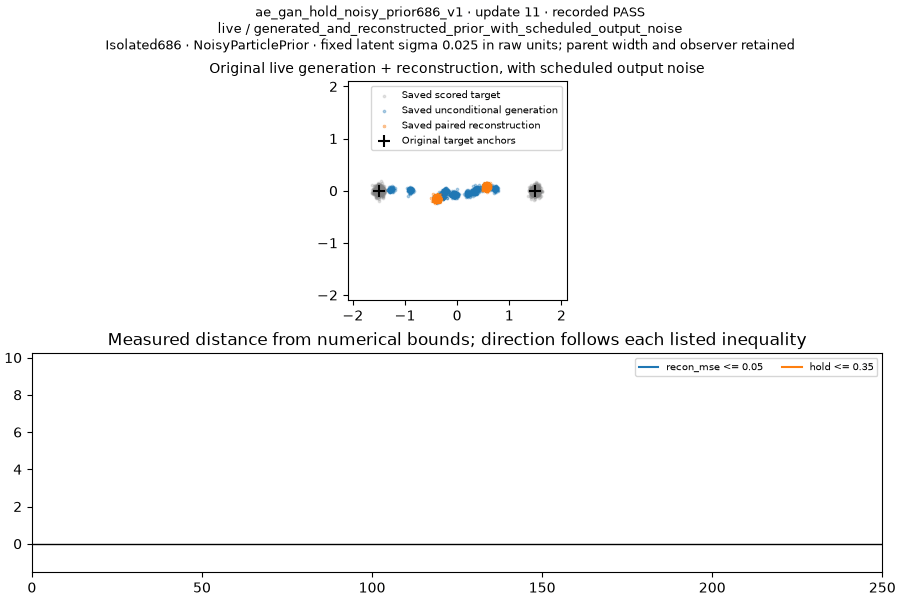
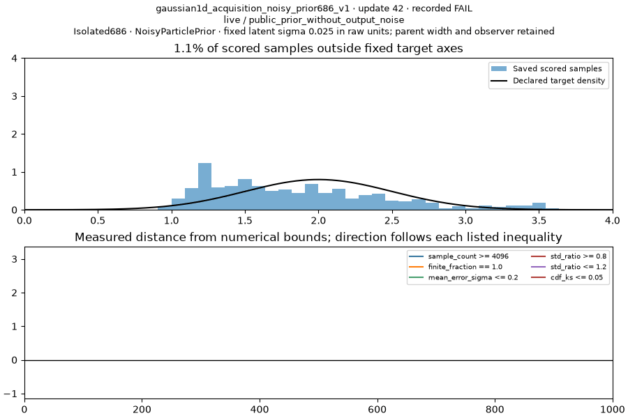
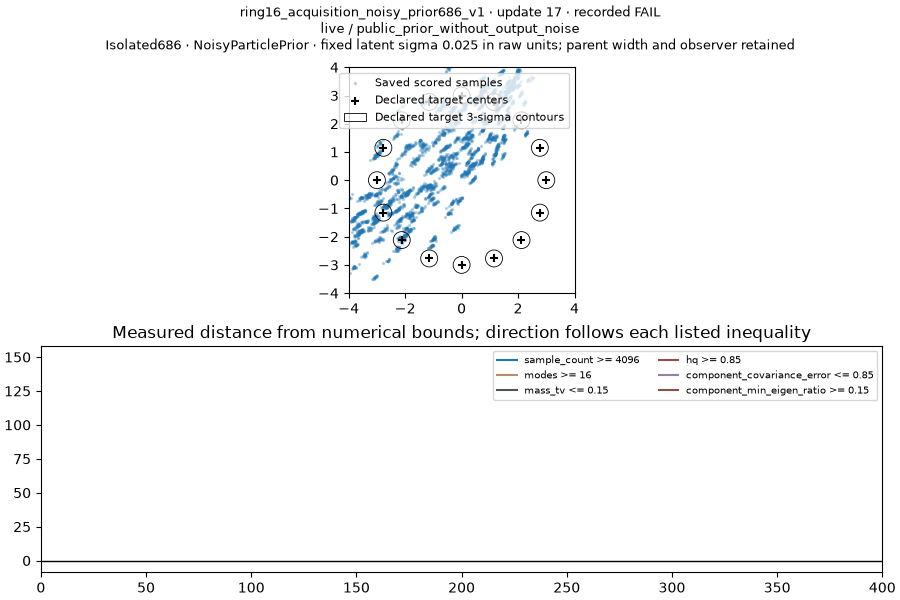
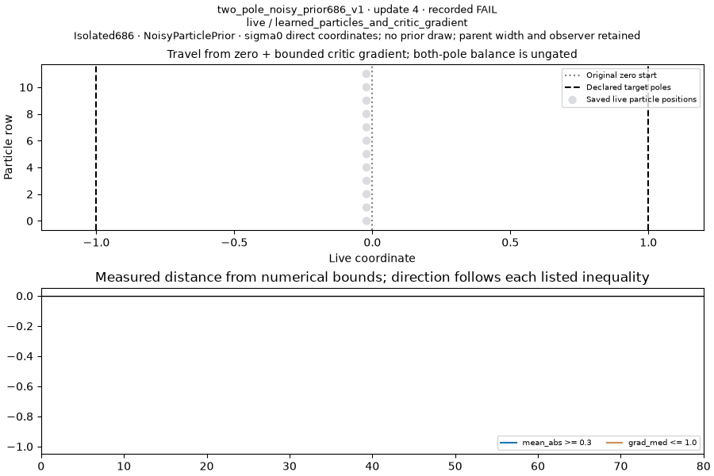

# Preserved Atlas type-only NoisyParticlePrior checkpoint

This completed pre717 cohort has **1 PASS, 3 FAIL, 2 BLOCKED** on six original Tier1 questions. It preserves the earlier type-only experiment and does not supply results for the separately frozen positive-noise or existing-MoG tracks authorized in message717.

Each parent keeps its original network, data, seed0, updates, gates and measurement law. Gaussian/AE/ring retain their existing absolute latent sigma0.025; two-pole/unused-token/word retain sigma0. No new latent sampler is invented for direct-coordinate controls. This tests prior type and row-control compatibility; it cannot establish an effect from adding noise or family-wide representational limits.

| Problem | Verdict | Recorded reason | Passing reads / terminal suffix | Full run seconds |
| --- | --- | --- | --- | --- |
| AE reconstruction + generation | PASS | MSE0.004398<=0.05; anchor-to-generated distance0.003760<=0.35 | 20/24; suffix20>=5 | 254.811 |
| Gaussian acquisition | FAIL | Final scalar gates pass; KS fails at updates834(0.058566) and959(0.057996), bound0.05 | 16/24; suffix1<5 | 39.140 |
| Ring16 acquisition | FAIL | All16 modes; TV0.0625; HQ0.88135; component covariance error4.24219>0.85 | 0/24; suffix0 | 21.271 |
| Two-pole movement | FAIL | mean_abs0.002446<0.30; gradient0.010897<=1 passes | 0/24; suffix0 | 10.288 |
| Unused-token hold | BLOCKED | Original shared2/slot2x2 owner has no sampled N12 latent bank; independent Atlas birth minimum incompatible | No numerical attempt | 0 |
| Five-word joint generation | BLOCKED | Original conditionalN5 rows conflict with independent Atlas controls and birth k>=4 while N5 permitsk<=3 | No numerical attempt | 0 |

The gates and each problem’s purpose are in [PLAN.md](PLAN.md); machine-readable scores, original grading, terminal-five measurements and provenance are in [results.json](results.json). All four executed cases completed the full horizon with 24 scored observations and frozen evaluator certificates. PASS requires a terminal passing suffix of at least five; a completed FAIL remains valid evidence.

AE asks whether the free encoder reconstructs the original data while unconditional generation reaches the original anchors. Its accepted streak begins at update53, is confirmed at update94, and continues through250. Hold is a mean anchor-to-nearest-generated distance. This is one task pass, not a default or winner qualification.

Gaussian’s KS breaks the required terminal streak twice. The final histogram and moments look good, but they do not replace the full curve. These observations alone do not distinguish changing model quality from finite4096-sample measurement fluctuations.

Ring reaches all16 clusters and adequate mass/HQ, but nearest-component covariance remains wrong; the preserved covariance gate applies to all assigned samples, including spill. Core-only covariance0.48631 is diagnostic and does not replace the required4.24219 value. The target contours and actual spill are visible in the GIF.

Two-pole completes80 updates of the exact live table, critic and noise optimizers and all five public lifecycle hooks. Coordinates initially move slightly negative, then return near zero. Direct-particle gain applies46/80 times; critic penalty80/80. Critic anchor and spike guard do not activate; A2 is inapplicable to this direct-coordinate owner. A bounded critic input slope does not measure the particle-loss gradient. Existing receipts do not identify a unique cause among weak/cancelling forces and controller dynamics. Both-pole balance is explicitly ungated.

The two BLOCKED rows retain their original owner layouts and have no numerical verdict, manufactured GIF or charged scientific attempt. No N11 extension, replaced sampler, disabled controls or relaxed threshold is used.

Each GIF contains nine original saved scored observations from the24-clock curve, with the recorded final verdict and numerical bounds. Targets are declared analytic geometry; samples/reconstructions/coordinates are retained measured data. Rendering adds zero updates and zero draws. First and last frames were visually checked.

Frozen scientific source commit: d15e7b25db987c3f6d514217e1c9610f0fbaad44; source digest e9c826aeabb75de0a79ba63a027d888b8889654446ff7ba931a485ea960beb12; candidate revision b2cd5612ac9359744ecc4b8819d936ee45c22eca3cd8d5e613bedae26728a10a. PyTorch2.13.0+cu126; Python3.12.13; original six TaskSpec bytes unchanged. Focused checks:10 prior tests+2 subtests and52 Forge/owner/probe/media tests+64 subtests passed.

Admission limitation: an ordinary worktree submit cached an AE copied-source path error. Its existing submission was repaired under the Queue lock through an append-only copied-module preflight lineage, full newly-runnable sampling/host validation, and an actual CPU1/CUDA-hidden zero-operation initializer proof. The original request ID/JSON, scientific fields, jobs, attempts and costs remained intact. The probe constructs no owner and grants no numeric credit. This archive does not claim the ordinary command alone reproduces all four admitted paths; TrackA717 is addressing metadata preflight separately without weakening scientific source guards.

Cost checkpoint after media visual-file reads, before this publication: historical inclusive prefix12467.918105772s + unique completed physical attempts325.510300972s + cumulative686 paid metadata61.118271722s = 12854.546678466s of41288. Remaining28433.453321534s. Later publication and communication metadata are excluded from this stated checkpoint and remain charged in the durable ledger. Full2220s campaign allowance is not another debit; each executed case kept its original cap (120/300/300/300/300/900 across six).

Original ordinary request/result/evidence, model/initialization/source receipts and scored tensors remain local. Public compact JSON/media are shareable, but are not a portable complete raw evidence bundle. Earlier metadata failures and the AE7.53MB receipt-size recovery remain recorded; no training attempt was replayed or reset.

This isolated archive changes no main-family score, original-problem grade, default, speed ranking or adoption decision. Message717 starts separate branches/cohorts and separate agents for sampled NoisyParticlePrior sigma0.025 and existing task-declared MoG support.
