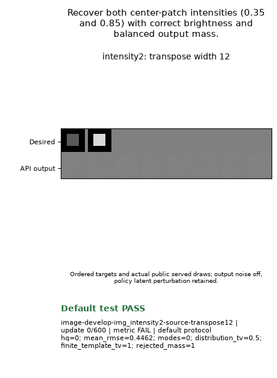
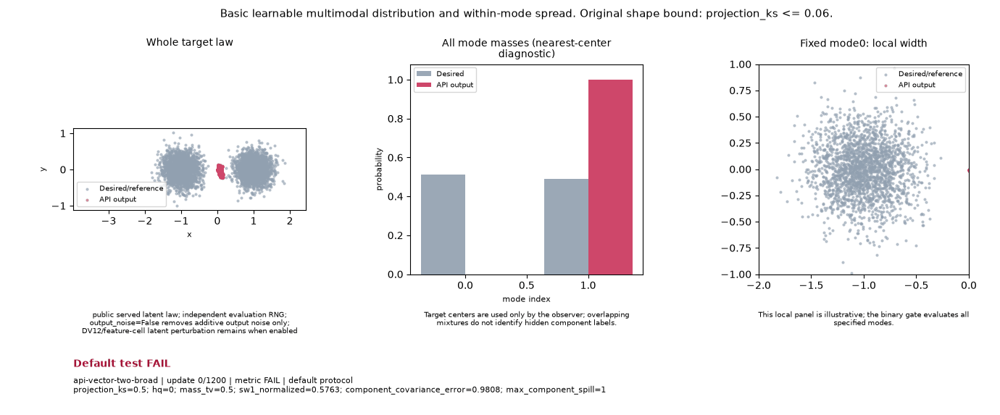

# Policy-family goal board

This is the primary leaderboard for **policy-family-defaults**. It ranks whole shared-knob configurations within each frozen family/source/spec/runtime lane. The public selected/served particle-cloud questions retain their original host adaptations; this is separate from the Forge clean-MoG inventory.

Current cohort: `policy-family-defaults-round2-v1--0335ecf024ea`. Source cohorts remain separate; individual passing cases never combine into a configuration. UNKNOWN stays unmeasured. This screen supplies **no shipping-default adoption or speed winner**.

The original toy gate requires its terminal passing suffix. The added study gate uses the first five consecutive primary successes, then at least five uninterrupted hold checks and every subsequent primary check. An original PASS may therefore have a FAIL or INCOMPLETE study verdict. GIF badges display the original toy verdict.

Matching small-host numerical traces do not establish Atlas/E22 algorithmic or complete policy-state equivalence. Reference-kNN smoke results do not qualify Atlas feature-cell behavior; unmeasured native quality cases remain in the denominator.

## Current cohort `policy-family-defaults-round2-v1--0335ecf024ea`

8 declared configurations; each retains 8 required cases. Paid child execution 189.031s. Whole-config outcome: **incomplete_comparison**; fully qualified: **0**. Partial or interrupted evidence supplies no additional qualification.

| Family / config | LR / prior rate | Study smoke | Study quality | Original passes | Measured / required | Whole-config status | First non-pass |
| --- | --- | ---: | ---: | ---: | ---: | --- | --- |
| atlas / `1c9d2a067ff2` | 0.002125 / 1.0 | 0/2 | 0/6 | 1 | 1/8 | INCOMPLETE | image-develop-img_intensity2-source-transpose12: fewer than five post-confirmation hold observations |
| atlas / `916ab8dff81a` | 0.002125 / 2.0 | 0/2 | 0/6 | 0 | 1/8 | FAIL | image-develop-img_intensity2-source-transpose12: finite_template_tv; hq; modes; last 5 post-update metric observations do not all pass |
| atlas / `9723217ce64d` | 0.00425 / 2.0 | 0/2 | 0/6 | 1 | 1/8 | FAIL | image-develop-img_intensity2-source-transpose12: hold break at 425: finite_template_tv; hq |
| atlas / `d04d2c7e0c56` | 0.00425 / 1.0 | 0/2 | 0/6 | 1 | 1/8 | FAIL | image-develop-img_intensity2-source-transpose12: hold break at 475: finite_template_tv; hq; modes |
| e22 / `4a3ce5cf0e28` | 0.002125 / 2.0 | 0/2 | 0/6 | 1 | 1/8 | INCOMPLETE | image-develop-img_intensity2-source-transpose12: fewer than five post-confirmation hold observations |
| e22 / `88a864cb691e` | 0.00425 / 1.0 | 0/2 | 0/6 | 1 | 1/8 | FAIL | image-develop-img_intensity2-source-transpose12: hold break at 475: finite_template_tv; hq; modes |
| e22 / `ab19c4f54e43` | 0.002125 / 1.0 | 0/2 | 0/6 | 1 | 1/8 | INCOMPLETE | image-develop-img_intensity2-source-transpose12: fewer than five post-confirmation hold observations |
| e22 / `cb221ca2bd30` | 0.00425 / 2.0 | 0/2 | 0/6 | 1 | 1/8 | FAIL | image-develop-img_intensity2-source-transpose12: hold break at 425: finite_template_tv; hq |

Per-family best observed display (pass counts, then content ID; not a default or speed selection): atlas `1c9d2a067ff2`; e22 `4a3ce5cf0e28`.

Pass-count ties: atlas `1c9d2a067ff2`, `916ab8dff81a`, `9723217ce64d`, `d04d2c7e0c56`; e22 `4a3ce5cf0e28`, `88a864cb691e`, `ab19c4f54e43`, `cb221ca2bd30`. The displayed content ID only breaks a presentation tie; it supplies no measured quality advantage.

| Observed case / config | Original gate | Study gate | Acquisition / hold passed | Terminal metrics | Actual GIF |
| --- | --- | --- | --- | --- | --- |
| atlas `1c9d2a067ff2` / image-develop-img_intensity2-source-transpose12 | PASS | INCOMPLETE | 525 / 3/3 | hq=0.995117; modes=2; finite_template_tv=0.0224609; distribution_tv=0.0175781 | [actual 9-frame GIF](policy-family-media/policy-family-defaults-round2-v1--0335ecf024ea/atlas/1c9d2a067ff2--image-develop-img_intensity2-source-transpose12.gif) |
| atlas `916ab8dff81a` / image-develop-img_intensity2-source-transpose12 | FAIL | FAIL | none / 0/0 | hq=0.625; modes=1; finite_template_tv=0.430664; distribution_tv=0.0556641 | [actual 9-frame GIF](policy-family-media/policy-family-defaults-round2-v1--0335ecf024ea/atlas/916ab8dff81a--image-develop-img_intensity2-source-transpose12.gif) |
| atlas `9723217ce64d` / image-develop-img_intensity2-source-transpose12 | PASS | FAIL | 375 / 8/9 | hq=0.99707; modes=2; finite_template_tv=0.00390625; distribution_tv=0.000976562 | [actual 9-frame GIF](policy-family-media/policy-family-defaults-round2-v1--0335ecf024ea/atlas/9723217ce64d--image-develop-img_intensity2-source-transpose12.gif) |
| atlas `d04d2c7e0c56` / image-develop-img_intensity2-source-transpose12 | PASS | FAIL | 375 / 8/9 | hq=1; modes=2; finite_template_tv=0.0898438; distribution_tv=0.0898438 | [actual 9-frame GIF](policy-family-media/policy-family-defaults-round2-v1--0335ecf024ea/atlas/d04d2c7e0c56--image-develop-img_intensity2-source-transpose12.gif) |
| e22 `4a3ce5cf0e28` / image-develop-img_intensity2-source-transpose12 | PASS | INCOMPLETE | 600 / 0/0 | hq=0.987305; modes=2; finite_template_tv=0.0625; distribution_tv=0.0615234 | [actual 9-frame GIF](policy-family-media/policy-family-defaults-round2-v1--0335ecf024ea/e22/4a3ce5cf0e28--image-develop-img_intensity2-source-transpose12.gif) |
| e22 `88a864cb691e` / image-develop-img_intensity2-source-transpose12 | PASS | FAIL | 375 / 8/9 | hq=1; modes=2; finite_template_tv=0.0898438; distribution_tv=0.0898438 | [actual 9-frame GIF](policy-family-media/policy-family-defaults-round2-v1--0335ecf024ea/e22/88a864cb691e--image-develop-img_intensity2-source-transpose12.gif) |
| e22 `ab19c4f54e43` / image-develop-img_intensity2-source-transpose12 | PASS | INCOMPLETE | 525 / 3/3 | hq=0.995117; modes=2; finite_template_tv=0.0224609; distribution_tv=0.0175781 | [actual 9-frame GIF](policy-family-media/policy-family-defaults-round2-v1--0335ecf024ea/e22/ab19c4f54e43--image-develop-img_intensity2-source-transpose12.gif) |
| e22 `cb221ca2bd30` / image-develop-img_intensity2-source-transpose12 | PASS | FAIL | 375 / 8/9 | hq=0.99707; modes=2; finite_template_tv=0.00390625; distribution_tv=0.000976562 | [actual 9-frame GIF](policy-family-media/policy-family-defaults-round2-v1--0335ecf024ea/e22/cb221ca2bd30--image-develop-img_intensity2-source-transpose12.gif) |

atlas `1c9d2a067ff2` / `image-develop-img_intensity2-source-transpose12`: original **PASS**, study **INCOMPLETE**. Copied unchanged from actual retained observations.

e22 `4a3ce5cf0e28` / `image-develop-img_intensity2-source-transpose12`: original **PASS**, study **INCOMPLETE**. Copied unchanged from actual retained observations.

Frozen source `0335ecf024ea8a6b337a216345f444abd41e3a6c`; spec SHA256 `279bca3b3c3555ae11fd4fce9cedd2899efcf671a7d12dc278f86d51bca8f790`; combined archive SHA256 `52b9b85f9c6e4139c6a51ad7dfa5641c241fa822ea2bd70877543616ebf8351c`. Exact recipes, priors/serving law, runtimes, source manifests, case receipts, artifact hashes and all unknown required cells are retained in the JSON.

## Retained cohort `policy-family-defaults-round1-cli-recovery-v2--eb2d77fbd776`

8 declared configurations; each retains 8 required cases. Paid child execution 268.791s. Whole-config outcome: **incomplete_comparison**; fully qualified: **0**. Partial or interrupted evidence supplies no additional qualification.

| Family / config | LR / prior rate | Study smoke | Study quality | Original passes | Measured / required | Whole-config status | First non-pass |
| --- | --- | ---: | ---: | ---: | ---: | --- | --- |
| atlas / `ca0901b6679b` | 0.006375 / 2.0 | 1/2 | 0/6 | 1 | 2/8 | FAIL | api-vector-two-broad: hold break at 1000: projection_ks <= 0.06 |
| atlas / `9cf9647fdc66` | 0.0085 / 2.0 | 0/2 | 0/6 | 0 | 1/8 | FAIL | image-develop-img_intensity2-source-transpose12: hold break at 525: finite_template_tv; hq; modes |
| atlas / `e6f3c9f400a4` | 0.006375 / 1.0 | 0/2 | 0/6 | 1 | 1/8 | INCOMPLETE | image-develop-img_intensity2-source-transpose12: fewer than five post-confirmation hold observations |
| atlas / `fc4e6516e79a` | 0.0085 / 1.0 | 0/2 | 0/6 | 0 | 1/8 | FAIL | image-develop-img_intensity2-source-transpose12: finite_template_tv; hq; last 5 post-update metric observations do not all pass |
| e22 / `0acab20ca12f` | 0.006375 / 2.0 | 1/2 | 0/6 | 1 | 2/8 | FAIL | api-vector-two-broad: hold break at 1000: projection_ks <= 0.06 |
| e22 / `5d4d276493d6` | 0.0085 / 1.0 | 0/2 | 0/6 | 0 | 1/8 | FAIL | image-develop-img_intensity2-source-transpose12: finite_template_tv; hq; last 5 post-update metric observations do not all pass |
| e22 / `65e42a03035e` | 0.0085 / 2.0 | 0/2 | 0/6 | 0 | 1/8 | FAIL | image-develop-img_intensity2-source-transpose12: hold break at 525: finite_template_tv; hq; modes |
| e22 / `da7513723838` | 0.006375 / 1.0 | 0/2 | 0/6 | 1 | 1/8 | INCOMPLETE | image-develop-img_intensity2-source-transpose12: fewer than five post-confirmation hold observations |

Per-family best observed display (pass counts, then content ID; not a default or speed selection): atlas `ca0901b6679b`; e22 `0acab20ca12f`.

| Observed case / config | Original gate | Study gate | Acquisition / hold passed | Terminal metrics | Actual GIF |
| --- | --- | --- | --- | --- | --- |
| atlas `ca0901b6679b` / image-develop-img_intensity2-source-transpose12 | PASS | PASS | 350 / 10/10 | hq=1; modes=2; finite_template_tv=0.0146484; distribution_tv=0.0146484 | [actual 9-frame GIF](policy-family-media/policy-family-defaults-round1-cli-recovery-v2--eb2d77fbd776/atlas/ca0901b6679b--image-develop-img_intensity2-source-transpose12.gif) |
| atlas `ca0901b6679b` / api-vector-two-broad | FAIL | FAIL | 950 / 2/5 | hq=0.970703; mass_tv=0.010498; projection_ks=0.0721952 | [actual 9-frame GIF](policy-family-media/policy-family-defaults-round1-cli-recovery-v2--eb2d77fbd776/atlas/ca0901b6679b--api-vector-two-broad-reviewed.gif) |
| atlas `9cf9647fdc66` / image-develop-img_intensity2-source-transpose12 | FAIL | FAIL | 450 / 5/6 | hq=0.999023; modes=2; finite_template_tv=0.00976562; distribution_tv=0.00976562 | [actual 9-frame GIF](policy-family-media/policy-family-defaults-round1-cli-recovery-v2--eb2d77fbd776/atlas/9cf9647fdc66--image-develop-img_intensity2-source-transpose12.gif) |
| atlas `e6f3c9f400a4` / image-develop-img_intensity2-source-transpose12 | PASS | INCOMPLETE | 500 / 4/4 | hq=1; modes=2; finite_template_tv=0.0273438; distribution_tv=0.0273438 | [actual 9-frame GIF](policy-family-media/policy-family-defaults-round1-cli-recovery-v2--eb2d77fbd776/atlas/e6f3c9f400a4--image-develop-img_intensity2-source-transpose12.gif) |
| atlas `fc4e6516e79a` / image-develop-img_intensity2-source-transpose12 | FAIL | FAIL | none / 0/0 | hq=0.736328; modes=2; finite_template_tv=0.263672; distribution_tv=0.0664062 | [actual 9-frame GIF](policy-family-media/policy-family-defaults-round1-cli-recovery-v2--eb2d77fbd776/atlas/fc4e6516e79a--image-develop-img_intensity2-source-transpose12.gif) |
| e22 `0acab20ca12f` / image-develop-img_intensity2-source-transpose12 | PASS | PASS | 350 / 10/10 | hq=1; modes=2; finite_template_tv=0.0146484; distribution_tv=0.0146484 | [actual 9-frame GIF](policy-family-media/policy-family-defaults-round1-cli-recovery-v2--eb2d77fbd776/e22/0acab20ca12f--image-develop-img_intensity2-source-transpose12.gif) |
| e22 `0acab20ca12f` / api-vector-two-broad | FAIL | FAIL | 950 / 2/5 | hq=0.970703; mass_tv=0.010498; projection_ks=0.0721952 | [actual 9-frame GIF](policy-family-media/policy-family-defaults-round1-cli-recovery-v2--eb2d77fbd776/e22/0acab20ca12f--api-vector-two-broad-reviewed.gif) |
| e22 `5d4d276493d6` / image-develop-img_intensity2-source-transpose12 | FAIL | FAIL | none / 0/0 | hq=0.736328; modes=2; finite_template_tv=0.263672; distribution_tv=0.0664062 | [actual 9-frame GIF](policy-family-media/policy-family-defaults-round1-cli-recovery-v2--eb2d77fbd776/e22/5d4d276493d6--image-develop-img_intensity2-source-transpose12.gif) |
| e22 `65e42a03035e` / image-develop-img_intensity2-source-transpose12 | FAIL | FAIL | 450 / 5/6 | hq=0.999023; modes=2; finite_template_tv=0.00976562; distribution_tv=0.00976562 | [actual 9-frame GIF](policy-family-media/policy-family-defaults-round1-cli-recovery-v2--eb2d77fbd776/e22/65e42a03035e--image-develop-img_intensity2-source-transpose12.gif) |
| e22 `da7513723838` / image-develop-img_intensity2-source-transpose12 | PASS | INCOMPLETE | 500 / 4/4 | hq=1; modes=2; finite_template_tv=0.0273438; distribution_tv=0.0273438 | [actual 9-frame GIF](policy-family-media/policy-family-defaults-round1-cli-recovery-v2--eb2d77fbd776/e22/da7513723838--image-develop-img_intensity2-source-transpose12.gif) |

atlas `ca0901b6679b` / `image-develop-img_intensity2-source-transpose12`: original **PASS**, study **PASS**. Copied unchanged from actual retained observations.

atlas `ca0901b6679b` / `api-vector-two-broad`: original **FAIL**, study **FAIL**. Reviewed retained observations: original numeric values and verdict unchanged; projection KS and its original bound are visible.

[Unchanged original GIF](policy-family-media/policy-family-defaults-round1-cli-recovery-v2--eb2d77fbd776/atlas/ca0901b6679b--api-vector-two-broad.gif) · [Separate media-review provenance](policy-family-media/policy-family-defaults-round1-cli-recovery-v2--eb2d77fbd776/atlas/ca0901b6679b--api-vector-two-broad-reviewed.media-review.json).

e22 `0acab20ca12f` / `image-develop-img_intensity2-source-transpose12`: original **PASS**, study **PASS**. Copied unchanged from actual retained observations.

e22 `0acab20ca12f` / `api-vector-two-broad`: original **FAIL**, study **FAIL**. Reviewed retained observations: original numeric values and verdict unchanged; projection KS and its original bound are visible.

[Unchanged original GIF](policy-family-media/policy-family-defaults-round1-cli-recovery-v2--eb2d77fbd776/e22/0acab20ca12f--api-vector-two-broad.gif) · [Separate media-review provenance](policy-family-media/policy-family-defaults-round1-cli-recovery-v2--eb2d77fbd776/e22/0acab20ca12f--api-vector-two-broad-reviewed.media-review.json).

Frozen source `eb2d77fbd776eab0d2ce5e2550ab9cdfdb6c1162`; spec SHA256 `ade8ffc150b0ddd68cc9be4b1a71b7cf754185cb5aa76287e6ab8ec32938d438`; combined archive SHA256 `62079914653b9c27efec277c2ce4a57c50b42c856bb25f827a46af16b1f3cd3f`. Exact recipes, priors/serving law, runtimes, source manifests, case receipts, artifact hashes and all unknown required cells are retained in the JSON.

[Complete compact goal inventory](policy-family-inventory.json). Detailed case readouts are explanatory and do not create another primary leaderboard.
