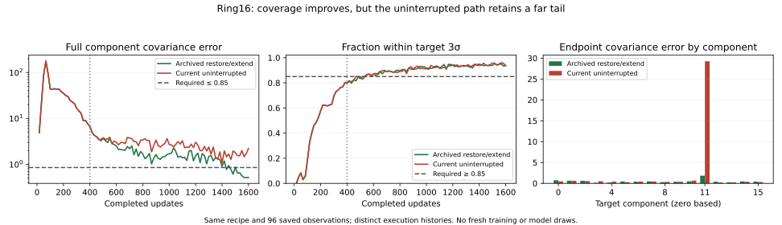

# Ring16: why the longer-training fix does not pass the current smoke

**Follow-up: [the CUDA restart reproduction](REPRODUCTION.md) now reproduces
both paths and locates the first divergence at update 401.** Matching draws
produce tiny backward gradient differences that the full SVD update amplifies.
The new diagnostic uses 4,064 updates; the original saved-only analysis below
retains its original source, results and qualification scope.

**The earlier fix produced a real PASS, but it has not reproduced in the current
uninterrupted run.** Both reach 1,600 updates with the selected DualNorm BCAP
recipe. The earlier run restores a 400-update checkpoint before extending;
the current run trains straight through. Their saved samples match exactly
through update 400 and first differ at observation 417. At 1,600, a small far
tail makes the current run fail local covariance despite good coverage.

This report starts from `origin/develop` at
`2859975707eb3ea4d31958ad1b03e9e69e148a53`, after merged PR329. It analyzes
existing CUDA evidence only in this initial analysis: **zero new training updates, model forwards or
sampling draws**. No recipe, prior, task, gate, tier policy or historical grade
changes. [Compact results and input hashes](results.json) and the
[saved-evidence analyzer](analyze_saved.py) make the findings reviewable.
The [technique inventory](../technique-inventory.md) remains the single current
leaderboard; the comparisons here are unranked diagnostics.

## What was fixed, and what actually ran

The original [prior grid](../tier1-prior-smoke/README.md) ran Ring16 for 400
updates. The selected 256-location MoG with sigma .1 failed that budget.
The [duration study](../tier1-prior-duration/README.md) restored its exact
checkpoint and added 1,200 updates. It passed all unchanged full-distribution
bounds at the last six observations, starting at 1,517. We then
[adopted its parameters](../ring16-smoke-v2/README.md): 256 locations, sigma .1,
1,600 updates, original recipe horizon 400 and the same 96-check cadence.

The adoption checks verified construction, restoration and saved grades. They
did **not** measure a fresh uninterrupted 1,600-update reproduction. Matching
conditions and a passing continuation were therefore insufficient evidence
that the new from-scratch execution would also pass. The current inventory
provides that measurement and records FAIL honestly.

| Evidence / execution history | Updates | Full result | Terminal full passes | Covariance error ≤ .85 | HQ ≥ .85 |
| --- | ---: | --- | ---: | ---: | ---: |
| Original prior-grid prefix | 400 | FAIL | 0 | 6.67240 | .79907 |
| Archived prefix restored and extended | 1,600 | PASS | 6 | .51431 | .93774 |
| Current selected recipe, uninterrupted | 1,600 | FAIL | 0 | 2.22027 | .93604 |
| Archived passing lineage restored and extended again | 4,000 | Diagnostic acquisition + hold PASS | 150 | .56385 | .97070 |

The final row is the [batch-size study's batch-128 continuation](../tier1-batch-size/README.md):
all 144 post-acquisition hold checks pass. It strengthens the historical
continuation result; it does not measure the current failing path after 1,600.
The batch-512 arm acquired faster but failed one strict hold check, and changed
both sampling grouping and examples per update. Neither result is a controlled
repair of the present failure.

The final inventory source is
`79fdf16d2ed880a9db1873245f150375e3be31b0`, digest
`d276c5a7344fab6ec5de7b314d3982af5b0ef8027c8b89c01376ae366844a9cb`.
Selected attempt `b2d55fb3d5434002aa2b443522a83b79` completes **1,600 G, D and
prior updates**, all 96 observations and a certified full context checkpoint.
The earlier 400-update execution-cap software error was repaired before this
run. A short-budget runner error does not explain this numerical failure.

## Problem, architecture and active settings

Ring16 is a uniform mixture of 16 two-dimensional Gaussians, on a radius-3
circle, each with covariance `.01 I` (target sigma .1). Adjacent centers are
about 1.171 apart: almost 11.7 target sigmas. The learner must acquire
separated modes, balance mass, generate within-mode spread and suppress distant
tails. That is a richer question than simply finding sixteen centers.

The [task card](../../../configs/forge/tasks/ring16_acquisition.json) and actual
saved model tensors bind:

| Item | Actual selected configuration |
| --- | --- |
| Latent dimension | **4** |
| Generator | `4 → 64 → 64 → 2`, LeakyReLU(.2), **4,610 parameters** |
| Critic | Raw x plus sin/cos at π and 2π; `10 → 64 → 64 → 1`, LeakyReLU(.2), **4,929 parameters** |
| Prior | **256 learned uniform MoG locations**, absolute latent sigma .1, no standardization, initial scale 1 |
| Batch | **128** |
| Trainer | BCAP penalty, DualNorm network updates, row-normalized sampled prior updates |
| Constant G / D / prior rates | **.012 / .018 / .03** |
| Momentum / prior regularizer | **0 / 0** |
| Served law | Clean live G with public MoG sampling; no additive output noise or served averaging |
| Execution cap / recipe horizon | **1,600 / 400**, LR floors 1, no annealing |
| Initialization / protocol | Public deterministic orthogonal named initialization; seed **0** |
| Scoring | **4,096** clean samples at each of **96** declared observations |

The inactive historical host settings in the card do not override the resolved
candidate recipe. Latent sigma .1 is not output sigma .1: the generator maps
the prior's local noise into output space. With 256 locations, an even allocation
would give 16 locations per target mode, but MoG is continuous and supplies
local noise. A finite-atom support exemption cannot silently replace its
full-component gate. The scorer's separate `resolved_core_*` fields are
vacuous when no component meets that diagnostic's resolution floor; they do
not qualify this task.

The [optimizer implementation](../../../particlegan/optim/dualnorm.py) normalizes
each sampled prior-row gradient before multiplying by .03. For gradients
large relative to epsilon, movement therefore need not shrink when the raw
gradient gets smaller. That is a plausible stability concern, not an isolated
cause of this failure. The matrix update also uses an SVD polar factor;
its handling of small singular directions is another candidate for a numerical
diagnostic. This report changes neither rule.

## What the current run fails

The full task requires sample count ≥4,096, all 16 meaningful modes, mass TV
≤.15, HQ ≥.85, mean all-component covariance error ≤.85 and minimum component
eigenvalue ratio ≥.15, at five terminal observations. At update 1,600,
**every bound except component covariance passes**:

| Metric | Archived 1,600 PASS | Current 1,600 FAIL |
| --- | ---: | ---: |
| Modes | 16 | 16 |
| Mass TV | .05859 | .05713 |
| HQ fraction within target 3σ | .93774 | .93604 |
| Mean component covariance error | .51431 | **2.22027** |
| Minimum component eigenvalue ratio | .38370 | .33766 |
| 4σ-core covariance error, diagnostic | .38451 | .38741 |
| Largest nearest-center distance | .60514 | **2.37374** |



The untrimmed covariance error improves from **6.6724 → 3.3818 → 3.0195 →
2.2203** at updates 400/800/1,200/1,600. Its best observed value is **1.05849
at 1,400**, still above .85. **None of the 96 observations passes the full gate.**
Changing five terminal checks to any one passing state would still leave FAIL.

Excluding only the upper covariance bound as an explicitly nonqualifying
diagnostic leaves **65 consecutive passing observations**, beginning at 534.
This shows that the blocker is local tail fidelity rather than sustained
coverage, balance or collapsed core spread. It does not authorize deleting
that bound or relabeling the result.

### A half-percent far tail dominates the covariance

Covariance is computed for **all samples assigned to each nearest center**,
then the relative Frobenius errors are averaged across the 16 components.
The diagnostic core calculation keeps samples within 4 target sigmas. The
full calculation correctly retains distant mistakes, which can overwhelm a
target variance as small as .01.

At the current endpoint, **21/4,096 outputs (0.513%) are more than distance 2,
or 20 target sigmas, from their nearest center**. All are assigned to component
11, whose target center is approximately `(-1.148, -2.772)`. Their centroid is
`(-1.200, -5.037)`. The historical endpoint has no output beyond distance 1.

| Component 11, zero based | Archived | Current |
| --- | ---: | ---: |
| Assigned samples | 175 | 211 |
| Samples beyond 4σ | 14 | 24 |
| Full covariance error | 1.83363 | **29.24311** |
| 4σ-core covariance error | .56616 | .40458 |
| Share of component variance from far spill + core/spill separation | 49.5% | **95.8%** |
| Mean covariance error of the other 15 components | .42636 | .41875 |

Component 11 contributes **82.3% of the current sum of component covariance
errors**. The other 15 components are slightly better on average than in the
archived PASS. The covariance decomposition reproduces the saved samples to
floating-point precision: distant spill and its separation from the core
explain the excess variance. This establishes the output-level failure;
it does not identify which prior rows, local generator branch or critic
gradient created those outputs. Retained observations contain no sampled row
IDs to make that attribution. Trimming or filtering them would change the
served law, not fix training.

## What matches, and what remains unresolved

The [previous binding audit](../gaussian-smoke-inventory/ring-binding-audit.md)
verified the identical recipe, prior, initializer, cadence and scientific
library/host/scorer sources. This analysis extends it to the completed v4
evidence:

- **91 relevant scientific source files match** between the historical
  continuation and current run. The resolved recipes and initialization
  records match exactly.
- All **24** scored sample tensors through update 400 match byte for byte.
  The first differing saved observation is 417; the exact first differing
  optimizer update is unobserved.
- All **96** v3/v4 scored tensors and metric dictionaries match exactly.
  The provenance repair did not change this Ring16 trajectory.
- At 1,600, **all 14 named RNG states and their manifest match exactly**
  between the historical PASS and current FAIL, including target data,
  prior indices, prior Gaussian noise and live evaluation. Their final
  random-stream cursors agree. The learned G, D and prior tensors differ.
- Ambient global CPU/CUDA RNG states differ. This alone does not establish
  relevance: the host has no dropout, and its intended consumed streams are
  explicitly named. Intermediate kernel inputs and learned-state parity were
  not retained, so a causal global-RNG claim would be unsupported.

Matching final cursors is stronger evidence against a simple shifted sampling
schedule, but it is not proof of intermediate state equality. The historical
restore receipt certifies the serialized state exactly and changes only the
execution cap. We have not demonstrated a reset, lost optimizer state, source
regression or restore bug. The main unresolved question is why the two paths
separate after the checkpoint boundary despite these matching contracts.

Across the final fixed CUDA roster, Ring16 has **0 PASS / 22 numerical FAIL /
1 API BLOCKED**. Every completed candidate has zero full passing observations.
The blocked component-only KA2 declaration does not support this scalar
GANTrainer host and is not a numerical failure. The
[whole-candidate readout](../gaussian-smoke-inventory/final-v4/readout.json)
and current inventory retain each recipe and denominator; this report does
not create a second ranking. Ring16 remains the sole required Tier 1 failure
for the selected BCAP and DualNorm rows, preventing ordinary Tier 2 admission.

## Recommended next work

**First isolate the checkpoint boundary before tuning another parameter.**
A proposed bounded CUDA diagnostic would train one shared 400-update prefix,
then compare continuing that live context with rebuilding/restoring its exact
checkpoint. Preserve target batches, all named streams, sampling cadence and
constant recipe. Compare state, raw gradients, SVD inputs/outputs and tensor
layout at the first post-boundary update. If needed, extend both branches to
1,600. A shared prefix plus two 1,200-update branches would cost at most
**2,800 host updates**; a separate declaration must freeze wall-time allowances,
diagnostic gates and stopping rules before execution. This proposed work is
not registered or run by this reporting PR.

Then trace the far outputs to sampled prior rows and local generator mappings
on a fixed saved state. That would separate a displaced location from excessive
local noise amplification or a generator branch problem. Use declared CUDA
probes and checkpoint their evaluation streams; the present saved outputs
cannot decide among those causes.

If runtime parity is established, the next training comparison should target
that measured mechanism. Candidate options include constant prior-step
magnitude or damping, prior regularization, and a different generator
architecture/local noise map. These would be separate declared deltas, with
the same public initialization and no LR annealing. Larger particle counts
already regressed fixed-budget acquisition in the prior grid; more particles
or another unchecked duration increase are not the first recommendation.

There is also a task-design decision: if Tier 1 asks only for acquisition of
balanced modes with useful core spread, full tail covariance can be a separate
Tier 2 fidelity question. That would need an explicit narrower task, validated
destructive controls, independently confirmed acquisition and preserved full
quality evidence. It would not explain the historical/current discrepancy.
Under the existing full bound, a pass-once reform alone accomplishes nothing.
All screening gates remain provisional until calibrated.

## Reproduce this report without training

The [v4 artifact receipt](../gaussian-smoke-inventory/archive-v4.json) binds
archive SHA256
`1531a5de3ee93e1bb216060eb25967010a2381c76ff0bc873267580851ba5c21`.
The [duration artifact receipt](../tier1-prior-duration/artifact-provenance.json)
binds historical archive
`18e339a2e78b73d95798b871914ac7a9301057e8b49a89c610f34dd7992d2480`.
The previous v3 audit preserves its original envelope/output hashes. These
originals remain available at the local paths recorded in `results.json`;
hydrate them at those paths for independent reanalysis. Bulk checkpoints,
sample tensors and curves remain ignored, not copied into Git.

```sh
mkdir -p runs/reports/ring16-failure
PYTHONPATH=. OMP_NUM_THREADS=1 MKL_NUM_THREADS=1 OPENBLAS_NUM_THREADS=1 \
  /usr/bin/python -u reports/forge/ring16-failure/analyze_saved.py \
  --prior-root /home/martyn/dev/ParticleGAN-tier1-prior-smoke \
  --inventory-root /home/martyn/dev/ParticleGAN-gaussian-smoke-inventory \
  --output reports/forge/ring16-failure/results.json \
  > runs/reports/ring16-failure/analysis.log 2>&1
tail -F runs/reports/ring16-failure/analysis.log
/home/martyn/dev/ParticleGAN/.venv/bin/python \
  reports/forge/ring16-failure/plot_saved.py \
  --results reports/forge/ring16-failure/results.json \
  --output reports/forge/ring16-failure/metrics.svg
```

The analyzer validates retained hashes, completion, source bindings, both
sample comparisons, final stream parity and covariance reconstruction. CPU is
used exclusively for saved-tensor math and metadata; no neural execution occurs.
The plot reads certified existing scalar observations and adds no scoring draw.
Actual public-API training is illustrated by the
[historical PASS GIF](../tier1-prior-duration/mog100-n256-ring16_acquisition.gif)
and [current FAIL GIF](../gaussian-smoke-inventory/media/ring16_acquisition.gif),
with their original provenance preserved.
