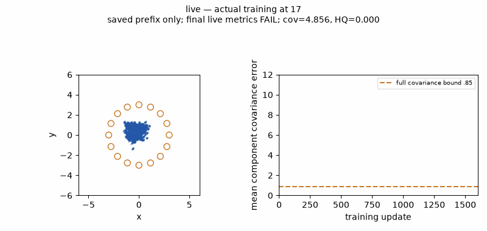
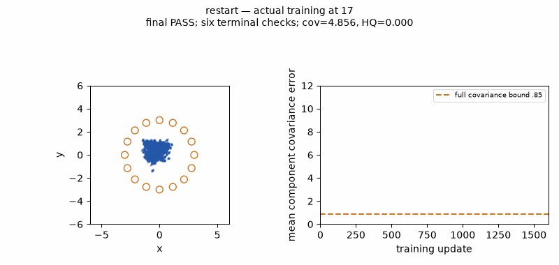

# Ring16 restart reproduction: numerical sensitivity in the normalized update

**We reproduced both paths at protocol seed 0. Restoring the same 400-update
state reproduces the historical PASS; continuing the live objects reproduces
the covariance failure.** No new seed, batch, subbatch, prior refresh or optimizer
reset explains the difference. At update **401**, otherwise identical critic
calculations produce weight gradients differing by a few billionths. The full
SVD normalization turns that rounding difference into a substantial update.

This is a third explanation alongside the user's seed-sensitivity and scheduled
randomization hypotheses: **numerical sensitivity to restarting the runtime
objects**. Seed sensitivity was not tested. The exact CUDA/autograd accumulation
mechanism behind the first rounding difference remains unresolved. The evidence
does establish where it enters and how the optimizer amplifies it.

## Controlled reproduction and results

The [pre-run declaration](protocol.json) freezes the selected recipe from the
[initial diagnosis](README.md), three full executions, four bounded controls and
their conditional triggers. All neural training used CUDA on one RTX A6000,
with the public ParticleGAN API and deterministic named initialization. Architecture,
target law, prior, batch 128, constant rates, recipe horizon 400, total execution
cap 1,600, clean sampling law and the 96-check cadence are fixed.

The fresh public initializer produces a 400-update checkpoint whose **entire
FormulationContext state is bit-exact to the original archived checkpoint**:
G, D, learned MoG prior, optimizer state, recipe, initialization, all named RNG
streams and ambient CPU/CUDA RNG state. Its canonical state digest is
`208e2d7b241ffeac11915972dbb90979dd686ad5285768282e2182d7da5ad2cd`.
All 24 scored prefix tensors match the archived prefix. No archived fixture was
substituted for the fresh initialization.

| Execution | New updates | Full quality result | Terminal passes | Final covariance error, bound .85 | Final HQ, bound .85 |
| --- | ---: | --- | ---: | ---: | ---: |
| Fresh prefix, then live continuation | 1,600 | Printed FAIL; receipt INCOMPLETE¹ | 0 | 2.220268 | .936035 |
| Fresh process restoring that exact prefix | 1,200 | PASS | 6 | .514315 | .937744 |
| Fresh process restoring original archived prefix | 1,200 | PASS | 6 | .514315 | .937744 |

Both restored executions reproduce **all 96 historical scored sample tensors
exactly**, including their retained 24 prefix observations. These are two
reproduction routes from the same seed/state, not independent successful seed
trials. The live run's printed covariance and HQ match the current v4 failure
at all 96 observations. Full quality uses every original numerical bound, not
only the two shown here; the historical five-terminal-check rule is also met
by each restored execution. These diagnostics confer no new qualification.

¹ All 1,600 live updates and 96 scoring observations completed before the final
receipt check rejected a stream registry recorded before data/evaluation stream
registration. We retained the original error, stdout, exact 400-state and
prefix samples, 416-state and the 16 traced updates. The final live model,
post-400 full sample tensors and exact elapsed time were not saved. Its original
receipt remains INCOMPLETE and its measured failure remains separately visible.
The [interruption receipt](restart-interruption.json) and
[continuation amendment](reproduction-continuation.json) document the bookkeeping
repair, which registers streams earlier without consuming a draw. No live
training was repeated or credited as a certified new FAIL.

## What changes at the restart boundary

Some runtime properties do change even though the public checkpoint values
match. The live objects retain gradient buffers for six G, six D and one prior
parameter; freshly restored objects have none. D's module flags change from
evaluation to training mode, while G and prior modes agree. Tensor version
counters also differ because these are newly constructed objects. Restoring
the buffers and flags does not change the restored trajectory. Recorded
shape, stride, contiguity, dtype and device agree; the version counters are
runtime bookkeeping, not evidence of a new sampled input or a proven cause.
The compact result records these differences explicitly.

At update 401, the before-update model weights, real batch, both actual sampled
latent batches, indices, tensor layouts and all first six model forwards agree
exactly. The first nonidentical arithmetic appears in the **critic backward
weight gradients**; all critic bias gradients still agree.

| Quantity at update 401 | Largest absolute difference |
| --- | ---: |
| Critic first weight gradient, 64 × 10 | 5.59 × 10⁻⁹ |
| Critic hidden weight gradient, 64 × 64 | 3.73 × 10⁻⁹ |
| Critic output weight gradient, 1 × 64 | 1.30 × 10⁻⁸ |
| Hidden gradient's normalized SVD direction | **.539588** |
| Hidden critic weights after the .018 update | **.009713** |

The next critic forward, during the generator phase, now differs. Generator
updates follow that changed critic and the learned prior begins to diverge.
After update 401, the same latent randomness can therefore produce different
latent values because the learned prior has moved differently.

Through all 16 traced updates, the real batches, sampled indices, named stream
states and ambient CPU/CUDA RNG states agree. At the first update the sampled
latent values agree as well. We found **no random draw change or repeated
subbatch** causing the initial divergence. The comparison does not claim that
learned latent values remain identical after the models separate.

## Why a tiny gradient difference matters

The current [polar-factor update](../../../particlegan/optim/dualnorm.py) computes
`U @ Vh` from a reduced SVD. It discards every singular value, including those
near zero, assigning all retained singular directions unit weight.

For the saved 64 × 64 critic gradient at update 401:

- The largest singular value is **.278172**; the smallest is **3.03 × 10⁻¹¹**
  in the live path and **7.00 × 10⁻¹¹** after restore, measured in float64 on CUDA.
- Four directions fall below `1e-6 * sigma_max`; six fall below the usual
  `64 * float32_epsilon * sigma_max` numerical rank threshold.
- A **1.03 × 10⁻⁷ relative Frobenius change in the raw gradient** becomes a
  **.252 relative change in the normalized direction**.
- Repeating SVD on either identical saved input gives an identical factor,
  which also matches its captured training factor. This does not demonstrate
  same-input SVD nondeterminism: the already-different inputs are sufficient.

The normalized direction is ill-conditioned near these almost-null directions.
This measured amplification explains why matching serialized tensors and draws
does not ensure that a tiny backward rounding change stays tiny. We have not
isolated which ordering, layout property beyond the recorded shape/stride, or
autograd runtime detail changes the backward sum. Deterministic execution flags
were enabled, but rebuilding runtime objects need not imply identical arithmetic
ordering across the two execution histories.

## Bounded controls

Each control restores the fresh 400-state and runs exactly 16 CUDA updates,
without additional scored draws. Every resulting model, optimizer, consumed
stream and ambient RNG state at 416 matches the ordinary restored path exactly;
the external execution cap is the sole serialized difference.

| Control | Declared change | Result at 416 |
| --- | --- | --- |
| Untraced restore | Remove all tensor tracing wrappers | Exact restored-path state |
| Statistics enabled | `collect_stats=True` | Exact restored-path state |
| Double load | Load the same checkpoint twice | Exact restored-path state |
| Restore runtime buffers | Restore live gradients and module training flags | Exact restored-path state |

These controls rule out a traced-versus-untraced difference on the tested
restored prefix, the statistics switch, an omitted second load, and the recorded
gradient buffers/module modes. They do not identify every uncheckpointed runtime
property or qualify a 416-update partial run.

## Recommendation

Investigate **damping or truncating the almost-null singular directions** as a
separately declared trainer change. That directly targets the measured
amplification while retaining constant learning rates and continuous learning.
It needs a matched comparison with the original rule and the unchanged full
distribution gate. No damping/truncation candidate was implemented or trained
in this reproduction, and it is not yet a proven Ring16 repair.

Periodic checkpoint reloads or subbatch repetition are not supported as a new
technique by this evidence. The reload introduces no deliberate randomization
here; it selects another numerical path whose ending is better in this one
fixed experiment. First make the update robust to this measured perturbation,
then evaluate stability under the declared tier-2 hold question.

## Artifacts, accounting and reproduction

The [compact numerical result](reproduction-results.json) binds inputs, exactness
checks, controls, final metrics, costs and limitations. The
[publication verification](reproduction-verification.json) checks source manifests,
input hashes, media, report links and preserved qualification snapshots. The
[byte-exact archive receipt](archive-reproduction.json) retains the raw tensors,
checkpoints, source manifests, original error and tail-friendly logs outside Git.
Executed sources are `74e5e1e5c0424d131066ed28bac911d3c32b6996` for the live
arm and `1de465e25252c10622965362cd593a899ce74f74` for the six restored arms.
The latter changes only early registration for the final receipt check.

**Cost: 4,064 new updates across seven arms, zero scientific retries.** The live
arm conservatively consumes its entire 300-second reservation because exact
elapsed time was lost; the six other receipts retain measured times. The total
conservative debit is **337.048 seconds**, inside the frozen 1,020-second allowance.
Saved-state analysis/rendering add zero neural forwards or sampling draws.
The saved-gradient algebra probe uses CUDA and zero training updates/draws.
No execution budget remains; publishing this report does not launch more arms.

[Actual-training GIF provenance](media-reproduction/index.json) binds the saved
observations. The live GIF covers only its retained 400-update prefix; it is not
a reconstruction of the missing later samples. The initial report links the
original full v4 failing GIF under that original evidence identity.





The [public-API driver](../../../benchmarks/toy_audit/ring16_restart.py) and frozen
protocol reproduce the prospective experiment in a new, empty output directory.
Do not relaunch it against this completed campaign. After hydrating the archive
at its original relative paths, the saved-only checks are:

```sh
OMP_NUM_THREADS=1 /usr/bin/python -u reports/forge/ring16-failure/summarize_restart.py
CUDA_VISIBLE_DEVICES=0 OMP_NUM_THREADS=1 /usr/bin/python -u \
  reports/forge/ring16-failure/svd_probe.py --check
```

The summarizer also needs the original archived parent/duration and v4 inventory
roots; its `--prior-root` and `--inventory-root` options allow relocated archives.
The [renderer](render_restart.py) uses only saved CPU tensors, and the
[archiver](archive_restart.py) verifies every original byte. Logs are under
`runs/reports/ring16-failure/restart-*.log` and can be tailed normally.
The [current technique inventory](../technique-inventory.md) remains the one
generated leaderboard. This unranked diagnostic does not alter any original
grade, task gate, recipe or tier eligibility.
