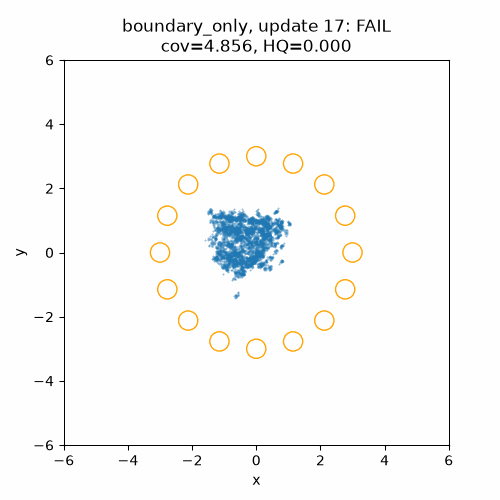
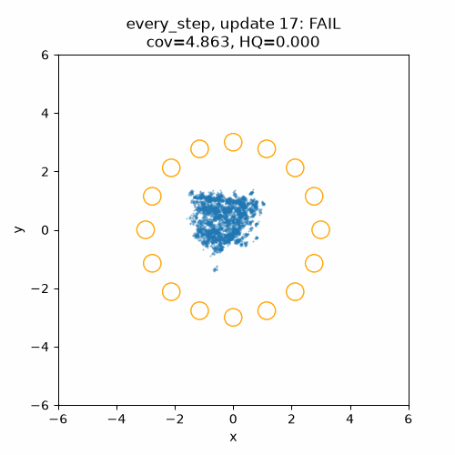

# Ring16 weak-direction truncation: CUDA results

**Every-step truncation passed confirmed acquisition and the five-terminal
diagnostic. The one-update intervention failed independent confirmation.** Both
frozen arms completed 1,600 fresh-live CUDA updates on an RTX A6000. The saved
gradient probe passed and reduced the live/reloaded direction discrepancy about
1,713-fold. Those historical runs used an experiment-only hook and left production
defaults unchanged. Their task gates and published qualification retain their
original identities. The earlier unavailable-CUDA [verification](verification.json) is
preserved as its original static preparation receipt.

## Public default adoption

At the user's request, PR332 now applies the every-update numerical-rank cutoff
in the public `particlegan.optim.polar_factor`, used by `dualnorm` and the critic
in `dualnorm_D_only`. The global rule is `U diag(s > tau) Vh`, with
`tau = max(rows, columns) * finfo(computation_dtype).eps * s_max`. Float32 and
float64 keep their dtype; half/bfloat16 use the existing float32 computation
policy and cast back. Vectors and sampled prior rows keep their update rules.
Every size now uses exact reduced SVD: the old >1024 Newton--Schulz fast path
could normalize directions below this cutoff, and is removed. Large full-rank
matrices may therefore cost more; the toy matrices already used SVD.

The [GPU integration receipt](default-adoption.json) records 103 passing
optimizer/software contracts and bit-exact parity with the frozen experiment
helper on both original saved update-401 critic matrices. Tests cover resolved
and null directions, zero/rectangular/large matrices, all four floating dtypes,
actual optimizer moves, sampled-row ownership and public checkpoint continuation.
The historical helper, protocols, result hashes and archived evidence remain
unchanged. Existing checkpoints use the new matrix rule when continued in the
new package; exact historical reproduction requires the original pinned source.

This is the user's selected implementation change, with new ordinary Tier 1 and
eligible Tier 2 evaluation still pending. The diagnostic results below are not
relabelled as qualification for the new default. The separate project-wide
backward-scheduling PR implements the user's later request to disable autograd
multithreading; that setting is not modified by this optimizer PR.

The [PR331 reproduction](https://github.com/255BITS/ParticleGAN/blob/49f041708931d06319213069be060f91f8ba9fb2/reports/forge/ring16-failure/REPRODUCTION.md)
located the first live-versus-restored difference in critic backward gradients
at update 401. A raw hidden-gradient relative difference of `1.03e-7` became a
`.252` relative difference after full SVD normalization. Six singular directions
lay below the usual float32 numerical rank threshold. The historical live arm
printed final covariance error `2.220268` and no full passing state; its original
receipt remains INCOMPLETE after a final metadata error. Restoring that same
400-state passed with covariance error `.514315` and six terminal passes. These
original results keep their source and runtime identities; no baseline is rerun.

## Measured results

These are unranked diagnostic outcomes under the [frozen protocol](protocol.json),
with [compact metrics and provenance](results.json), [CUDA algebra receipt](probe-results.json)
and [verified raw archive](archive.json). Execution source was
`ca69cabc2801744a7f99b8c601af98ba68a9e639`, based on develop `2859975`;
source digest `95dc4f10685943bd393a228540fde213924785d5be6a6e0e8c1ee827e167d940`.
The later publication commit is not the training source.

| Schedule | First full pass | Independent confirmation | Full passes / 96 | Longest / terminal streak | Final covariance error / HQ | Five terminal checks |
| --- | ---: | --- | ---: | ---: | --- | --- |
| Boundary only at 401 | 1,400 | **FAIL**, covariance 1.014798 | 2 | 1 / 0 | 1.372586 / .930664 | **FAIL** |
| Every step | 684 | **PASS**, covariance .835330 | 52 | 47 / 47 | .589678 / .963623 | **PASS** |

Both arms' initial contexts and all 1,600 seen target batches match exactly.
The boundary-only live 400-state matches the original archived context exactly
except for the two explicitly registered new streams. It was never restored
into the learner. Neither candidate resets its optimizer, changes learning
rates, or loads a checkpoint during training. All 96 scheduled observations per
arm are retained, with one independent confirmation at each first full pass.
The boundary confirmation failure is final under this protocol; later passing
states were not given another confirmation attempt. Covariance was the only
failed bound on its confirmation and final observation.

The saved CUDA hidden-gradient probe retained 58 directions and removed six on
both inputs. Relative Frobenius discrepancy fell from `.2519904673` with full
polar to `.00014707094` with truncation. Captured full factors matched exactly;
identical-input repeats were exact, outputs were finite, and ambient CPU/CUDA
RNG states were unchanged. This passes the declared tenfold mechanistic gate.
It establishes reduced amplification for this saved pair, independently of the
quality results.

Training consumed 3,200 updates, 194 evaluation draws and 45.94 measured training
seconds (50.80 controller child-wall seconds); the zero-update probe took 1.27
seconds. Reserved ceilings were 600 training seconds plus 30 probe seconds.
There were no retries, seed changes, additional training or retention runs.





The [media index](media-index.json) binds nine observed frames per arm to the
exact saved sample arrays and execution commit. Rendering used those saved CUDA
outputs on CPU with zero model forwards or new draws.

Every-step truncation is a promising constant-rate acquisition candidate in this
fixed Ring16 diagnostic. After its first confirmed pass at 684, it crossed
back into FAIL at updates **717, 734, 750 and 817**, solely because component
covariance error exceeded `.85` (.931106, .973897, .898984 and .893095). Of the
55 scheduled observations after the first pass, 51 passed and four failed;
all 47 observations from 834 through 1,600 passed. Thus it demonstrates
confirmed acquisition and later sustained quality within this budget, while
**failing the stronger requirement to stay within the gate after first reaching
it**. The terminal five-check result is not a continuous-learning retention
qualification. A separately declared retention
study is the next scientific question if this rule is pursued. The isolated
boundary intervention shows that removing weak directions once can change the
trajectory, but it did not meet the independent smoke requirement. Neither
outcome identifies the original restart's exact execution-order mechanism or
establishes a global default across tasks. Keep this report outside the current
technique inventory's qualification totals.

## Declared change and schedules

For a matrix gradient `A = U diag(s) Vh`, the experiment replaces `U @ Vh` with:

```text
tau = max(rows, columns) * float32_epsilon * max(s)
direction = U diag(1{s > tau}) Vh
```

The [helper](../../../benchmarks/toy_audit/ring16_spectral_truncation.py) requires
CUDA float32, performs no dtype conversion or random draws, and returns zero for
an entirely zero matrix. It applies to every G/D matrix weight. Ordinary bias
normalization, optimizer aspect-ratio factors and sampled prior row updates
stay unchanged. There is one threshold rule, with no grid or coefficient tuning.

| Schedule | Intervention | Question |
| --- | --- | --- |
| `boundary_only` | Original live updates 1–400; truncate G/D directions during update 401 only; full polar from 402 onward | Can a single spectral change at the known restart boundary select a better trajectory? |
| `every_step` | Truncate G/D directions on updates 1–1,600 | Does a continuous rule reduce repeated weak-direction amplification while preserving acquisition? |

The first intervention is **after completing update 400**, during update 401.
Changing update 400 would change the state we are trying to compare. Neither arm
loads a checkpoint into its learner: restoration itself changes the numerical
path. The boundary arm creates its prefix through the public initializer and
live training, then compares its saved values with PR331's fresh prefix. A saved
checkpoint is used only for that identity check. The every-step arm shares the
initialization and seen target batches but deliberately changes training from
update 1. `serial_backward` stays at the baseline setting.

The discontinuous cutoff is a tradeoff: it removes numerically null directions
entirely, but a singular value near `tau` can still switch between zero and unit
weight. The saved-gradient probe checks the actual pair; improved algebra alone
would not establish a distribution-quality repair. A successful boundary-only
arm would show path sensitivity, rather than continuous stability.

## Fixed task, gates and budget

The [protocol](protocol.json) binds the task, selected BCAP configuration and
execution sources before spending. Protocol seed 0 and the public named
deterministic orthogonal initializer/R2 prior initializer are mandatory. G is
`4→64→64→2`; D is the Fourier-2 `10→64→64→1` network, both with LeakyReLU `.2`.
The target is the uniform 16-component 2D Gaussian ring, radius 3 and sigma `.1`.
The learned prior is uniform MoG with 256 rows, sigma `.1` and no standardization.
Batch 128, BCAP penalty, zero momentum, zero prior regularizer, constant G/D/prior
rates `.012/.018/.03`, recipe horizon 400 and clean live public sampling are fixed.

Each arm completes 1,600 updates and 96 scheduled draws of 4,096 samples, using
the original 24-check cadence per 400 updates. A full state must satisfy every
original bound: 16 modes, mass TV ≤ `.15`, HQ ≥ `.85`, mean component covariance
error ≤ `.85`, minimum component eigenvalue ratio ≥ `.15`, and sample count ≥
4,096. The smoke question requires any scheduled full passing state and **one**
independent same-state confirmation using a separate checkpointed evaluation
stream. There is no second confirmation attempt. Report the original five
terminal checks and longest streak separately; no task reducer is rewritten.

The two training arms reserve **3,200 new updates and 600 seconds**, with at most
194 scoring draws, zero retries and no unchanged baseline replay. A separate
30-second CUDA algebra probe reserves zero updates/draws, for a combined ceiling
of **630 seconds**. It uses the exact saved live/restored hidden critic gradients
at 401, protected by their original trace hashes. Its mechanistic criterion is
finite outputs, exact identical-input repeats, and at least a tenfold reduction
in pair relative Frobenius difference against full polar on the same pair. The
full factors must also match the captured factors exactly, and ambient CPU/CUDA
RNG states must stay unchanged. This criterion is separate from the Ring16
quality gate.

All consumed constructor, data, prior, training-noise and evaluation streams
are isolated and checkpointed. The deterministic mechanism consumes no noise
draws. Both arms finish their budgets even if smoke passes. Nonfinite values,
source/stream mismatches, timeouts or exhausted budgets stop an arm and retain
the actual state/error/cost. A passing diagnostic does not qualify a family.
Retention requires a separately declared tier-2 task and budget; this protocol
does not launch it automatically.

## Reproduce the frozen execution

The shared [public-API runner](../../../benchmarks/toy_audit/ring16_interventions.py)
owns construction, training, scoring, checkpoint retention and saved-output GIF
rendering. Run these commands from this branch on a CUDA host. Hydrate the exact
PR331 fresh `live/prefix-state.pt` before training; `--baseline` accepts a relocated
archive with the same bytes.

```sh
python -m benchmarks.toy_audit.ring16_interventions plan \
  --protocol reports/forge/ring16-truncation/protocol.json \
  --output runs/api/ring16-spectral-truncation-v1

mkdir -p runs/api/ring16-truncation-logs
CUDA_VISIBLE_DEVICES=0 OMP_NUM_THREADS=1 python -u \
  -m benchmarks.toy_audit.ring16_interventions run \
  --protocol reports/forge/ring16-truncation/protocol.json \
  --output runs/api/ring16-spectral-truncation-v1 --device cuda:0 \
  > runs/api/ring16-truncation-logs/training.log 2>&1
tail -F runs/api/ring16-truncation-logs/training.log

timeout 30s env CUDA_VISIBLE_DEVICES=0 OMP_NUM_THREADS=1 python -u \
  -m benchmarks.toy_audit.ring16_spectral_truncation probe \
  --live-trace /path/to/PR331/live/trace.pt \
  --restart-trace /path/to/PR331/restart/trace.pt --device cuda:0 \
  --protocol reports/forge/ring16-truncation/protocol.json \
  --output runs/api/ring16-spectral-truncation-v1-algebra \
  > runs/api/ring16-truncation-logs/algebra.log 2>&1

python -m benchmarks.toy_audit.ring16_interventions render \
  --protocol reports/forge/ring16-truncation/protocol.json \
  --output runs/api/ring16-spectral-truncation-v1
```

These commands identify the completed execution. The local run and probe
directories are consumed and exclusive; do not rerun or replace them. Raw
stdout, checkpoints, tensors and metric streams remain ignored under `runs/api`.
The probe validates its frozen source bindings before starting and preserves an
INCOMPLETE receipt if a Python exception occurs after reserving its directory.
The completed receipts, provenance and actual-training GIFs above derive from
saved observations. The [verification receipt](verification.json) retains the
earlier static checks and unavailable GPU state; [results](results.json) records
the later restored-CUDA execution. Keep the [current technique inventory](../technique-inventory.md)
as the sole generated goal leaderboard; these diagnostic rows remain unranked.

Recommendation: preserve the boundary-only confirmation failure and pursue the
every-step rule only through a separately bounded retention comparison. Neither
schedule should become a production default from this single Ring16 diagnostic.
