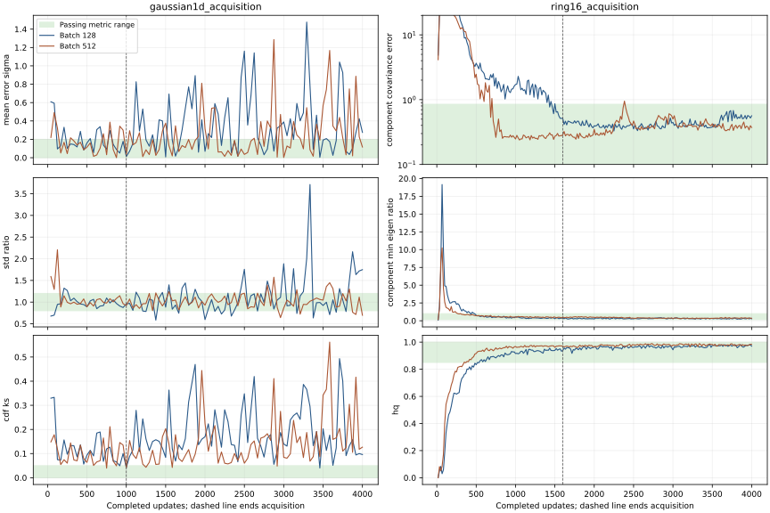

# Batch 128 versus 512: acquisition and continued stationary learning

**Increasing the batch to 512 does not repair the Gaussian. Keep batch 128 for
the adopted ring smoke.** Both Gaussian runs occasionally fit the target, but
neither achieves five consecutive passing checks. Ring acquisition is faster
at 512; its strict continued hold has one failed check, while batch 128 retains
quality at every hold check through 4,000 updates.

This user-requested GPU comparison extends PR
[#316](https://github.com/255BITS/ParticleGAN/pull/316). It changes no current task,
recipe default, historical qualification or numerical bound. The existing
[technique inventory](../technique-inventory.md) remains the only leaderboard.
The table below is a diagnostic readout, not a new ranking.

## Frozen question

[Protocol](protocol.json) freezes batches **128 and 512**, the exact selected
BCAP/dualnorm configuration, seed 0 and the public deterministic initializer.
Both tasks use **256 learned uniform MoG locations, sigma .1, init_std=1** and
no standardization. Gaussian's current ordinary task still uses sigma .025;
this study deliberately follows its closest sigma-.1 diagnostic, not a silent
change to that task. G/D/prior rates remain **.012/.018/.03**, with zero momentum,
no prior regularizer, noise, EMA, annealing or extragradient change.

Acquisition is scored at **1,000 updates for Gaussian** and **1,600 for ring**,
using the unchanged full numerical bounds and five terminal passes. Each run
continues to **4,000** under the same update rule. The separately declared
stationary hold requires **every** scheduled post-acquisition check to pass;
combined PASS requires both acquisition and hold. This stricter hold is a new
diagnostic question, not a rewrite of the ordinary acquisition gate.

The original recipe horizons remain 1,000/400; both learning-rate floors are 1.
Evaluation uses 4,096 clean/live samples, preserving 24 checks per original
1,000-update Gaussian block and per 400-update ring block. That gives 96/240
checks overall and 72/144 after acquisition. Evaluation consumes no training RNG.
Architectures and targets remain those in the
[Gaussian diagnosis](../gaussian1d-diagnosis/README.md) and
[adopted ring smoke](../ring16-smoke-v2/README.md).

The completed batch-128 Gaussian trajectory is reused. Ring batch 128 resumes
its exact 1,600 checkpoint, adding 2,400 updates; the two batch-512 runs start
from matching initial models and each train for 4,000. The finite budget permits
**three new trials, 10,400 new host updates, 2,100 reserved seconds and zero
retries**. All trials finish. Measured new training-loop cost is **122.683 seconds**
on cuda:0 / RTX A6000: ring continuation 32.352, Gaussian512 35.989 and ring512
54.342. Setup, source capture, real-data audit, verification and rendering are
excluded; original training costs stay in their original records. No unused
reservation is spent on additional batch sizes or another optimizer.

## Results

| Task | Batch | Acquisition / terminal suffix | Passing hold checks | Combined |
| --- | ---: | --- | ---: | --- |
| Gaussian | 128 | FAIL / 1 | 1/72 | FAIL |
| Gaussian | 512 | FAIL / 1 | 3/72 | FAIL |
| Ring16 | 128 | PASS / 6 | **144/144** | **PASS** |
| Ring16 | 512 | PASS / 54 | 143/144 | FAIL |

### Gaussian

| Batch | Update | Mean error in target sigma | Std ratio [.8,1.2] | KS <=.05 |
| ---: | ---: | ---: | ---: | ---: |
| 128 | 1,000 | .01304 | .95739 | .04297 |
| 512 | 1,000 | .03613 | .91984 | .04129 |
| 128 | 4,000 | .27536 | 1.74796 | .09594 |
| 512 | 4,000 | .11615 | .69579 | .12660 |

Both 1,000-update endpoints pass individually; neither has a passing five-check
terminal window. At batch 512, the last five acquisition KS values are
.06847, .04927, .14583, .13532 and .04129. The run has **6/96** full individual
passes versus 3/96 at 128, but the longest passing streak is **one** for both.
There is no sustained acquisition anywhere on either observed trajectory.

Batch 512 changes the late failure from excessive width to insufficient width:
the final std is .34790 rather than .87398, against target .5. KS is worse at
the endpoint despite improved centering. Its 2,000/3,000/4,000 KS values are
.22524/.08437/.12660. Larger batches therefore do not make this update rule
settle around the scalar solution.

### Ring

The first five-check window appears at update **784** for batch 512, compared
with **1,584** for batch 128. At 1,600, batch512 covariance error .28688,
minimum eigen ratio .52865 and HQ .96997 improve on batch128's
.51431/.38370/.93774. Both pass the acquisition gate.

The new ring128 hold is strong: **150 consecutive full passes** from the
original passing suffix through update 4,000. Final covariance error .56385,
minimum eigen ratio .27828, HQ .97070, mass TV .05737 and all 16 modes pass.
This supports the selected ring conditions beyond the original short window.

Ring512 has **one hold failure at update 2,384**: covariance error .94987
exceeds .85. Its modes, balance, HQ and eigenvalue floor pass at that check.
The run recovers and finishes with 97 consecutive passing checks; final
covariance error .37185, minimum eigen ratio .35286, HQ .98364 and mass TV
.08203 all pass. The predeclared all-check hold still fails. A passing endpoint
or recovery does not erase the failed check, nor does this result invalidate
its genuine 1,600-update acquisition pass.

## What the comparison isolates—and what it changes

Each batch512 real batch concatenates four successive 128-example draws from
the baseline target stream. CPU reference-law audits reproduce the exact old
prefix and continuation data hashes. The first 4,000 microbatches actually seen
by each new run also match that reconstructed stream. Initial G/D/prior tensors,
optimizer states/rates, named streams and initialization records match exactly;
only task-owned batch size changes the recipe. Latent/prior-noise draw grouping
necessarily changes with batch shape and is not claimed identical.

At a fixed update count, batch512 sees **four times as many real examples**.
The new trials consume 4,403,200 new real examples overall. Prespecified
equal-example cuts help separate data exposure from update count:

| Same real examples | Batch128 cut | Batch512 cut | Diagnostic endpoint comparison |
| --- | ---: | ---: | --- |
| Gaussian: 128,000 | 1,000 | 250 | KS .04297 versus .06048 |
| Gaussian: 512,000 | 4,000 | 1,000 | KS .09594 versus .04129 |
| Ring: 204,800 | 1,600 | 400 | Covariance error .51431 versus 8.45714 |
| Ring: 512,000 | 4,000 | 1,000 | Covariance error .56385 versus .24778 |

These are exploratory endpoint projections at predeclared cuts, not alternate
qualification budgets. The Gaussian128 baseline was already known; reusing it
does not provide an independent repeat or a variance estimate.

There is also a **prior-motion confound**. Expected unique rows sampled per G
batch increase from about 101 to 221 of 256, while each nonzero sampled-row
response remains approximately .03. The per-row update probability rises from
.394 to .865. Larger batches reduce Monte Carlo noise and increase the frequency
with which prior rows move; this is not a pure noise-removal intervention.
Equal-example cuts do not remove that confound. The negative result does not
prove gradient noise irrelevant or assign the failure solely to the prior.

## Recommendation

Stop this bounded round and retain the current batch128 ring repair. Batch512
is a faster ring acquisition variant, but does not improve the declared strict
hold or solve Gaussian; do not adopt it as the combined smoke repair.

The Gaussian needs a mechanism that changes how forces produce motion near a
match, or how the coupled game is updated. The
[continuous-learning options](../gaussian1d-diagnosis/README.md#continuous-learning-options-and-next-comparison)
remain relevant. A constant prior-rate compensation could isolate the increased
row-update frequency in a new batch study; evidence-dependent damping or an
extragradient comparison would ask different structural questions. None has
run here. Keep the batches fixed within any such trainer comparison and compare
one whole configuration across tasks, rather than combining task winners.

This study checks acquisition and a finite stationary hold. It does **not** test
reacquisition after a target shift or establish clock-free eligibility. Any claim
of a continuous learner needs those separately declared checks. No new seed,
larger batch, best-checkpoint substitution or automatic follow-up follows.

## Evidence, media and reproduction

[Compact results](results.json), [verification](verification.json),
[CUDA restore proof](restore-proof.json) and [provenance](provenance.json) retain
the exact protocol/source/receipt/archive identities. All **676 saved sample
sets** reproduce their metrics; all four final CUDA contexts restore exactly,
with unchanged .012/.018/.03 rates. The reader/publisher adds no model draws or
training updates. Training and model sampling use GPU; frozen real-data draws,
numerical scoring and rendering use CPU. Consumed scientific and publication
reference streams are checkpointed in the ignored archive.

Actual-training GIFs show the saved trajectories, including failures:
[Gaussian128](b128-gaussian1d_acquisition.gif),
[Gaussian512](b512-gaussian1d_acquisition.gif),
[Ring128](b128-ring16_acquisition.gif), [Ring512](b512-ring16_acquisition.gif).



The executed training source is commit `34871d41`; hydrate the two original
archives documented in [the prior](../tier1-prior-smoke/README.md) and
[duration](../tier1-prior-duration/README.md) reports before reproduction.

```sh
CUBLAS_WORKSPACE_CONFIG=:4096:8 OMP_NUM_THREADS=1 MKL_NUM_THREADS=1 OPENBLAS_NUM_THREADS=1 \
python -u -m benchmarks.toy_audit.tier1_batch_size run --device cuda:0 \
  --output runs/api/tier1-batch-size-reproduction \
  > runs/api/tier1-batch-size-reproduction.log 2>&1
tail -F runs/api/tier1-batch-size-reproduction.log
tail -F runs/api/tier1-batch-size-reproduction/b512-gaussian1d_acquisition.log
```

Render saved evidence with the repository's Python environment containing
Matplotlib/Pillow:

```sh
OMP_NUM_THREADS=1 MKL_NUM_THREADS=1 OPENBLAS_NUM_THREADS=1 \
python reports/forge/tier1-batch-size/publish.py --raw runs/api/tier1-batch-size-reproduction
```

Raw logs, full curves, checkpoints and RNG tensors stay outside Git. The compact
publication preserves original failures and the ordinary 4/6 whole-configuration
selection without granting task-diagnostic qualification or calibration credit.

Software validation: **95 focused checks pass**, including CUDA initial-state
matching, exact data grouping, strict-hold rejection and CPU-fallback rejection.
Forge validation, source/history coverage, compiled-memory freshness and Git
whitespace checks pass. These software checks grant no training qualification.
