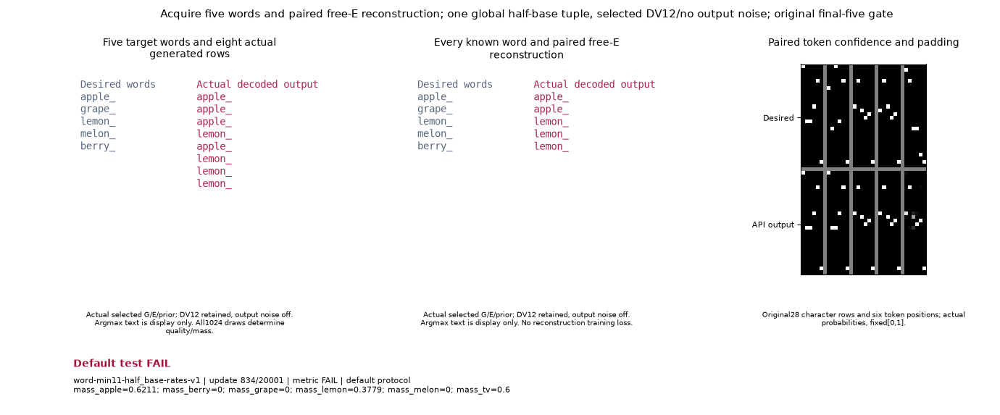

# One half-base joint-word result

**COMPLETE — accepted original word gate FAIL.**
This one tuple retains all 26 required slots (tiers 5/19/2): one word case and
25 NOT_RUN. Earlier passes stay in their own source cohorts and do not fill
this row. No default, ordinary-tier, speed or cross-variant qualification.

| Tuple | Word decision | Remaining slots |
|---|---|---|
| `word-min11-half_base-rates-v1` | FAIL (COMPLETE) | 25 NOT_RUN |

The global base LR is 0.00265625, prior multiplier 1.5 and critic multiplier 1.
All nominal role rates inherit that base; this is not a generator-only change.
Endogenous rates/displacements remain policy behavior. Actual resources are
11 learned raw 2D ParticlePrior rows, batch 256, original G/E/joint-D and free
continuous E. A generated atom is `(G(z_effective), z_effective)` with actual
DV12; training output noise affects only 168 word coordinates. Evaluation uses
actual policy-selected G/E/prior without output noise. There is no new
reconstruction loss, row-to-word teacher or unseen-word claim.

The target words are apple, grape, lemon, melon and berry. All 20,001 updates,
24 reads of 1,024 generated rows and five paired inputs, complete public-owner
clocks, and final five reads are required. Original bounds: sample count >=
1024; quality >= .95; all five modes; mass TV <= .1; exact paired reconstruction;
minimum paired token probability >= .9. Final reads are updates 16,668 / 17,501 /
18,335 / 19,168 / 20,001. No gates are weakened or new acquisition gate added.

The retained independent grader records 0 / 24
passing reads and a passing suffix of 0. Terminal
metrics: 2 / 5 modes, quality 0.546875,
mass TV 0.622265625, paired exact reconstruction
0, and minimum paired token probability
1.76242181e-12.

The byte-original nine-frame GIF shows actual generated rows, all five paired
free-E reconstructions, confidence and padding. Argmax words are display only;
quality and mode masses use the original probability/confidence test over all
1,024 samples. A displayed spelling such as apple can therefore have zero
qualified apple mass. The footer's Default test names the original full
protocol gate; it does not claim a shipped-family default.

The new attempt paid 556.430175316 seconds, reserved
0.000000000, charged 556.430175316, and overran
0.000000000. The 900-second allowance includes construction,
training, all reads, checkpoint, grading, original goal GIF and final attestation;
there is zero grace and no retry. Prior named-lane cost 910.239143159 is
included once, giving 1466.669318475 / 10,500 seconds.
GPU1 prior 675.413062383 plus this attempt gives
1231.843237699 / 3,000; GPU0 remains
234.826080776 / 7,500. Paid and interruption reserve stay separate.
Separate CUDA engineering controls and the Gaussian study are separate budgets.

The old f380 word attempt remains INVALID / numerical UNAVAILABLE, paid
558.573912713 seconds, already included in that prior debit. It
is not recertified under revised health guards. Cold representation evidence
and structural controls confer no learned credit.

Canonical origin `f9f7ed9d7a06c48d4ec56999107658983d7e8efc`; executed source digest `5995590d3c303207c664fe3b0ba7dc1e09dd3da7a90abf87086634c789175026`.
The exact full Recipe, source/cadence/provenance and cost joins are in
[results.json](results.json); consumed bytes are in [input-index.json](input-index.json),
and the passive checks/copies in [verification.json](verification.json).
Raw sources/states/arrays/traces are LOCAL_ONLY. This publisher hashes retained
inputs and copies accepted original media; it draws, restores, trains, renders
and rescores nothing.
