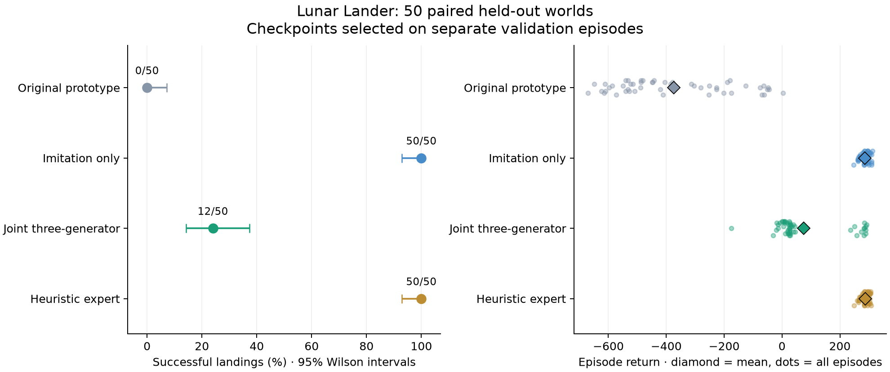
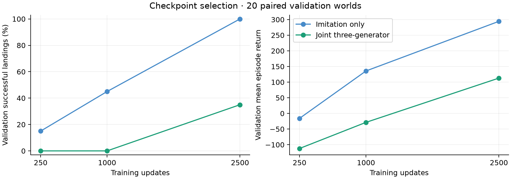

# Expert control baseline: imitation succeeds; joint training trails

The learned action-selection path now lands the real Lunar Lander. Joint
three-generator fine-tuning did **not** improve control in this comparison:
imitation-only landed 50/50 held-out episodes, versus 12/50 for joint training.
The original prototype landed none. Both learned arms used the same initialization,
9,297 expert transitions, and 2,500 optimizer updates.

| Controller | Selected update | Validation landings /20 | Test landings /50 | Test mean return | Test median return |
| --- | ---: | ---: | ---: | ---: | ---: |
| Heuristic reference | — | 18 | 50 | 287.29 | 287.53 |
| Imitation only | 2,500 | 20 | 50 | 286.76 | 286.80 |
| Joint three-generator | 2,500 | 7 | 12 | 74.87 | 26.48 |
| Original prototype | original 1,000 | 0 | 0 | −374.53 | −430.87 |



The 95% Wilson landing-rate intervals are 92.9–100% for imitation and the
expert, 14.3–37.4% for joint, and 0–7.1% for the original. These intervals describe
the finite evaluation sample, not variation across training initializations.
There were no seed-repeat training experiments. The expert's 18/20 validation
result also illustrates why 50/50 test landings are not a universal guarantee.

On the same test worlds, joint loses 38 landings and wins none against imitation;
the remaining 12 worlds are landing ties. Joint's return is lower in 45 worlds
and higher in five, with a mean difference of −211.88. Its failures are 37
crashes and one out-of-bounds episode. Original fails with 33 crashes and 17
out-of-bounds episodes. Neither learned selected checkpoint times out on test.

## What was trained

```text
Shared MoG latent + terrain:
G1 -> st
G2 -> at
G3 -> st+1

E_pair(st, current at, terrain) -> z -> G1/G2/G3
E_control(st, previous at, terrain) -> z -> G2 -> current at
actual simulator.step(current at) -> st+1
```

The two encoders are separate networks. E_control starts as a copy of the
original paired encoder. All three generators remain independent networks with
the shared MoG representation. Both learned arms start from the original
adversarial world-model checkpoint selected at update 1,000; scaler and every
expert-record array match exactly across arms.

Imitation updates E_control and G2 with standardized expert action MSE. Joint
adds real and synthetic reconstruction, joint/action/shared-state discriminators,
and MoG prior learning. It preserves the established Rp/bcap recipe and the
synthetic reconstruction's detached target/live encoder input. There is no
gradient through the physical simulator, reward training, planner, trajectory
unrolling, or new expert data collection in this round.

This compares the complete auxiliary training package. It does not isolate
individual generators, discriminators, prior movement, or loss interference.
The successful imitation controller retains its pretrained G1/G3, but those
branches do not participate in its control fine-tuning or choose live actions.

## Selection and learning progress

The protocol was frozen before full training: 20 fresh validation reset worlds,
50 fresh test worlds, all disjoint from the original collection. Checkpoint
selection uses validation landing rate, then mean return. Test data never select
a checkpoint or the viewer default. Final and selected checkpoints are identical
in both arms; their separate leaderboard rows reuse the same test evaluation.

| Updates | Imitation validation landings | Imitation return | Joint validation landings | Joint return |
| ---: | ---: | ---: | ---: | ---: |
| 250 | 3/20 | −15.80 | 0/20 | −112.12 |
| 1,000 | 9/20 | 135.70 | 0/20 | −28.58 |
| 2,500 | 20/20 | 294.32 | 7/20 | 112.88 |



The joint arm is still improving at the final checkpoint. This budget does not
establish its asymptotic performance. It does establish that, at matched updates,
the added training package did not help and took substantially longer.

## Action and world-model diagnostics

On 2,444 held-out expert records, imitation's standardized action MSE is 0.01740
and joint's is 0.02082. Their full engine-regime agreements are 93.58% and 92.18%.
That modest demonstration error gap accompanies a large control gap; averaged
action error alone is insufficient to judge a controller. The original has
80.48% engine-regime agreement yet no successful test landings.

Posthoc expert labels on the saved learner trajectories reveal a larger gap:

| Expert disagreement | Imitation | Joint |
| --- | ---: | ---: |
| All visited states: standardized action MSE | 0.1201 | 0.6122 |
| First 20 commands of each episode | 0.1409 | 0.1397 |
| Later commands | 0.1179 | 0.7092 |
| Flight: main engine off when expert would fire | 6/2,459 (0.2%) | 358/1,621 (22.1%) |

The later-step gap is consistent with disagreements growing along learner
trajectories. It also appears with equal episode weighting. This is descriptive:
controllers visit different states, and the expert was not rolled out from
those states to establish recoverability. Imitation itself frequently disagrees
with the heuristic near approach while landing successfully, so expert agreement
is not a substitute for the landing metric. These labels were **not** used to
train or select anything. See [the action diagnostic](on_policy_action_diagnostics.md).

The secondary world-model checks use the **original mixed-behavior test set**,
including counterfactual actions, while fine-tuning uses only expert behavior.
Their numbers measure retention/fit to that old mixture rather than control:

| Model | Next-state standardized MSE | Current-state reconstruction MSE | Prior joint SW1 ↓ | Prior coverage ↑ |
| --- | ---: | ---: | ---: | ---: |
| Original | 0.06382 | 0.06207 | 0.39067 | 34.49% |
| Imitation | 0.06382 | 0.06207 | 0.40051 | 31.86% |
| Joint | 0.25235 | 0.24534 | 0.45128 | 19.38% |

Imitation leaves E_pair, the prior, G1, and G3 fixed, preserving their predictions
exactly in this diagnostic. Its changed G2 affects joint generation and paired
action reconstruction. Joint loses old-mixture prediction accuracy and coverage;
its sample precision rises from 17.41% to 35.82%. The shift toward expert-only
training changes the distribution target, so these scores alone do not establish
collapse. All recorded training losses stayed finite.

## Cost and verification

| Arm | Trainable parameters | Inference parameters | Expert record draws | GPU 1 optimization time |
| --- | ---: | ---: | ---: | ---: |
| Imitation | 66,498 | 99,266 | 640,000 | 8.74 s |
| Joint | 400,021 | 99,266 | 1,280,000 | 109.35 s |

Joint has the same 640,000 control/generator record draws plus 640,000 discriminator
record draws. Training makes zero simulator calls. Both arms use batch256,
MoG1024, z32, width128, EMA, and the default MoG optimizer conventions. Optimizer
time excludes setup/checkpoint serialization. Joint costs about 12.5× as much
optimization time here. CPU inference, including offset/routing diagnostics,
is approximately 0.81 ms per command for both learned controllers.

The authoritative evaluation covers 360 episodes, 53,275 explicit simulator
steps, and 360 resets (53,635 steps including Gym's internal reset step).
This excludes correctness smokes and interactive viewer verification.
Per-episode traces, source/data/checkpoint hashes, archived training sources,
normalization, and optimizer logs are retained. The previous world-model
leaderboard remains unchanged.

The full CPU test suite passed 322 tests and 27 subtests, with four opt-in tests
skipped; subsequent evaluator provenance checks also passed. GPU 1 training
smokes verified matched starts and module updates. Chromium verification passed
Play/Pause/Step/Reset, all four controller switches, exact reset frame matching,
terminal auto-stop, and no JavaScript exceptions. The first validation world
(391000) landed in 236 steps, return 301.26, in the actual live simulator.

## Play and inspect

The viewer is at **http://localhost:8787**, starting paused with the
validation-selected imitation controller. Choose **Joint three-generator** to
inspect the actively joint-trained model, or the expert/original for comparison.
Every switch resets the same world; the simulator supplies all physical states
and native frames. The viewer's default comes from [controllers.json](controllers.json).

See [the leaderboard](README.md), [raw results](leaderboard.json),
[world-model diagnostics](world_model_diagnostics.json),
[frozen protocol](protocol.json), and [implementation guide](../../../docs/gym-control.md).

## Recommended next comparison

Keep imitation as the playable baseline. For the joint research model, the next
targeted comparison is **DAgger-style expert corrections on learner-visited
training states**. Keep the three generators, separate encoders, and joint losses,
and compare against an imitation arm with the same correction budget. This tests
whether the observed feedback-distribution gap is repairable without replacing
the architecture. Freeze the collection/training budget and use training worlds
for corrections; use a fresh held-out test set because this round's test traces
have now informed the research direction.

If that fails, separate the contribution of moving the shared prior from the
other auxiliary losses before expanding compute. The present comparison cannot
attribute the failure to a specific term. A later limited-data comparison could
test sample efficiency once joint control is competitive; the current full
demonstration imitation baseline already saturates this test's landing count.
No correction training, additional loss ablation, or RL run was launched here.
