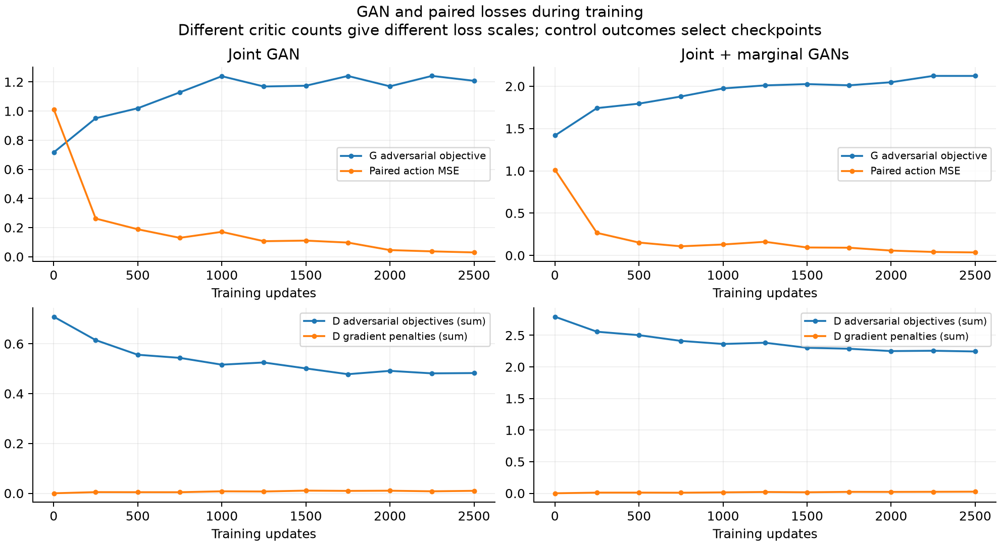
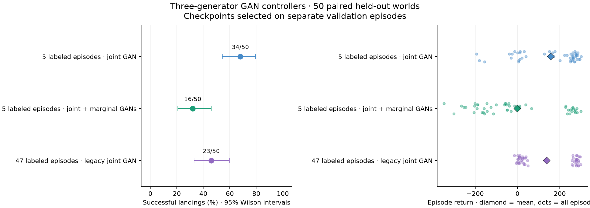
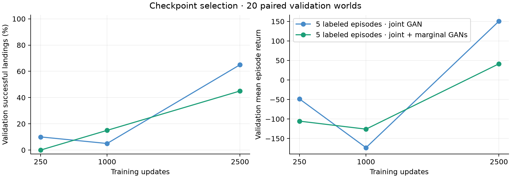
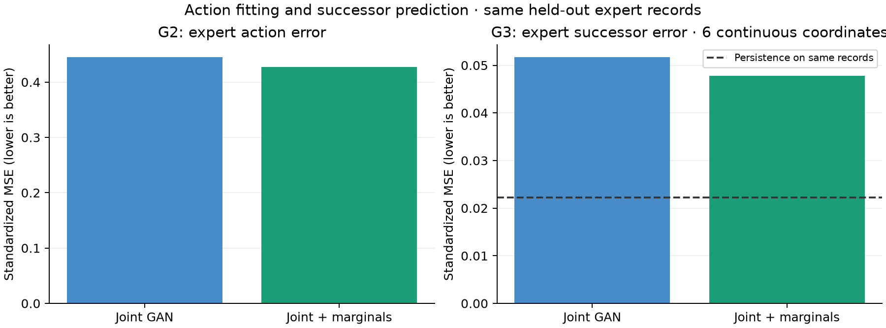

# GAN training throughout: joint versus marginal discriminators

The new joint GAN lands **34/50** fresh test worlds, compared with **23/50** for
the legacy joint GAN and **16/50** for the new joint-plus-marginals model. Both
new models train adversarially from the first update, using only five episodes'
action labels. The leaderboard contains GAN-trained controllers only.

Adding marginal discriminators improves several held-out prediction and joint
sample-distribution metrics, yet makes control worse. Matching these measured
distributions more closely does not establish a better landing policy.

The playable default is **gan_joint**, selected by validation. Open
http://localhost:8787; previous controllers remain clearly labeled GAN/non-GAN.

## Graph and training

```text
prior -> z -> G1 -> st
           -> G2 -> at
           -> G3 -> st+1

observed st -> E -> z -> G1 / G2 / G3
playback: st -> E -> z -> G2 -> at -> simulator.step(at)
```

Terrain enters E and all Gs. E receives only current state and terrain, with no
action, history, successor, or observation mask input. All Gs, E, and the MoG
prior are trained jointly from scratch, with adversarial losses active at every
one of the 2,500 updates. Paired action/state losses remain active alongside GAN
losses. There is no detached probe or imitation-only fine-tuning phase.

Both arms retain the same 1,010 action labels from fixed training episode IDs
3,15,53,5,22 and all 9,297 state/successor pairs from 47 expert episodes. Selection
is the previous fixed hash ordering, without subset search. State normalization
uses all available training observations; action normalization uses labeled
actions only. No pretrained parameters or scaler are loaded into the new models.

- **Joint:** one discriminator on masked joint triplets, with terrain and the
  observed-action mask as fixed context.
- **Joint + marginals:** the same joint discriminator, plus an action critic and
  one shared state critic with a current/successor role indicator.

Joint D receives complete triplets from a labeled batch and state/successor
pairs from an all-record batch with action coordinates masked to zero. Fake
records use the identical masks. Masking is applied inside the critic as well,
so gradient penalties cannot use hidden action coordinates. The mask function
is fixed; there is no learned missingness generator.

Both views use two fake paths: sampled prior codes and codes from E(real state).
Joint losses average the two views and two paths. Marginal action comparisons
use labeled records; state comparisons use all pairs. The generator objective
is joint adversarial loss plus weight 1 times the mean of three marginal roles
when present. D sums role objectives; each role averages its applicable paths.

Each G step also includes labeled standardized action MSE, current/successor
continuous-state MSE plus contact BCE (head weights 1), and the default prior
regularizer once. Reconstruction gradients remain live through E/prior. No
synthetic cycle loss, reward loss, trajectory unrolling, or simulator calls are
used during training. Binary sampled contacts use straight-through G gradients.

The MoG default recipe uses 1,024 particles, z32, width 128 independent Gs and
state encoder, bounded offsets, relativistic GAN loss, bcap, neural LR 0.0006,
prior LR 100×, and EMA 0.995. Joint D has width 256 and marginal critics width 128.
All sources, optimizer details, coefficients, scalers, and data hashes are frozen
in `protocol.json` and the archived training artifacts.



Loss scales differ with the number of critics. These curves show training
behavior; landing outcomes select checkpoints. Tests isolate GAN gradients to
verify that both fake paths train all Gs/prior and the encoded path also trains E.

## GAN-only leaderboard

New validation worlds are 991000–991019; test worlds are 1091000–1091049,
disjoint from original collection and all previous evaluations. Checkpoints
250/1,000/2,500 are selected by validation landing rate, then mean return, then
earlier update. Both new models select 2,500. Identical final checkpoints reuse
their selected test rollouts.

| GAN controller | Labeled episodes | Validation landings | Test landings | Wilson 95% | Mean test return | Crash / bounds / time limit |
| --- | ---: | ---: | ---: | --- | ---: | --- |
| New joint GAN | 5 | 13/20 | **34/50** | 54.2%–79.2% | **157.33** | 15 / 1 / 0 |
| Legacy joint GAN | 47 | 6/20 | 23/50 | 33.0%–59.6% | 137.35 | 27 / 0 / 0 |
| New joint + marginals | 5 | 9/20 | 16/50 | 20.8%–45.8% | -0.72 | 20 / 14 / 0 |

Against marginals, joint wins 20 paired landing outcomes, loses 2, and ties 28.
It wins 39/50 paired returns, with mean advantage 158.05. Against the legacy GAN,
it wins 18 landing outcomes and loses 7; mean return is 19.97 higher, although
it wins only 24/50 paired returns. The improvement is not uniform across worlds.

The legacy controller is reevaluated on these same worlds. It used GAN
pretraining and joint adversarial fine-tuning with 47 labeled episodes, and has
a separate encoder taking previous actions for control. It is an unmatched
reference; the two new models isolate the addition of marginal critics.
Neither the historical imitation-only fine-tune nor any non-GAN controller is
eligible for this leaderboard. Eligibility verifies trained discriminator
weights, actual source/checkpoint hashes, and GAN updates throughout controller
training. A boolean label alone cannot admit a checkpoint.

These intervals describe finite evaluation worlds, not training-run or label-
subset variation. There were no seed-only repetitions or post-result sweeps.



| Update | Joint validation landings | Joint return | Marginals validation landings | Marginals return |
| ---: | ---: | ---: | ---: | ---: |
| 250 | 2/20 | -48.68 | 0/20 | -105.49 |
| 1000 | 1/20 | -173.45 | 3/20 | -125.98 |
| 2500 | 13/20 | 150.59 | 9/20 | 41.40 |



## Prediction and sample quality

On the same 2,444 historical held-out expert transitions, using the common
sparse-training scaler:

| New GAN | Action MSE | G1 state MSE | G3 successor MSE | G3 contact Brier |
| --- | ---: | ---: | ---: | ---: |
| Joint | 0.445378 | 0.039990 | 0.051738 | 0.005835 |
| Joint + marginals | 0.426889 | 0.037114 | 0.047770 | 0.005822 |

Marginals slightly improve all these metrics, despite substantially worse
control. Persistence continuous successor MSE is 0.022230, better than either
G3; both learned contact Brier scores beat persistence 0.008183. Prediction
quality on expert states remains a secondary diagnostic.



Posthoc joint-distribution scoring generates one complete record per each of
those same 2,444 expert terrain contexts, with matched prior/contact RNG streams:

| GAN / path | Sliced W1 ↓ | Precision ↑ | Coverage ↑ | Contact-pattern TV ↓ |
| --- | ---: | ---: | ---: | ---: |
| Joint / prior | 0.19794 | 40.3% | 33.6% | 0.17635 |
| Marginals / prior | 0.17363 | 38.8% | 36.7% | 0.11702 |
| Joint / encoded state | 0.08721 | 55.8% | 43.7% | 0.00777 |
| Marginals / encoded state | 0.08209 | 58.5% | 48.1% | 0.00900 |

Marginals improve prior sliced W1, coverage, and contact distribution, though
prior precision slightly declines. The encoded path also improves W1 and
coverage. Thus the extra discriminators do improve several measured aspects
of joint sample quality; that benefit does not translate into better control.

These distances pool normalized joint records and exclude terrain coordinates.
They do not prove conditional physical consistency. Precision/coverage use the
95th percentile of real nearest-other-real distances as a common radius; W1
uses 128 fixed projections. Expert records are temporally correlated. Encoded
samples receive actual states, so they are not unconditional prior samples.
See [sample diagnostics](prior_sample_diagnostics.md) for definitions and hashes.

On fixed learner trace datasets, marginal critics slightly improve G1 while
worsening G3 compared with joint:

| Recorded controller | Evaluated GAN | G1 MSE | G3 MSE |
| --- | --- | ---: | ---: |
| Joint | Joint | 0.807278 | 0.856795 |
| Joint | Marginals | 0.785566 | 0.894471 |
| Marginals | Joint | 1.305579 | 1.372858 |
| Marginals | Marginals | 1.268438 | 1.443321 |

The new G3 models have no alternative-action input, and recorded successors
were caused by the source policy's actions. Cross-policy prediction errors are
descriptive, not a counterfactual physics test. Both models predict much worse
on learner states than on expert data. See [cross diagnostics](cross_diagnostics.md).

## Cost and verification

| New GAN | GPU 1 training seconds | Trainable parameters | D parameters | Action inference parameters | CPU inference ms/step |
| --- | ---: | ---: | ---: | ---: | ---: |
| Joint | 120.09 | 285139 | 139777 | 99010 | 0.814 |
| Marginals | 202.89 | 355925 | 210563 | 99010 | 0.736 |

Marginals take 1.69× as long here. Times include optimization, logging, and
batch hashing, exclude setup/checkpoint writes, and come from a shared machine.
Each arm uses 640,000 records in each of G-labeled, G-all, D-labeled, D-all
streams: 2.56 million real-record draws, with zero simulator training calls.
G1/G3/D are not required to choose live actions; inference runs E/G2/prior.

The full suite passed **350 tests and 27 subtests**, with 4 opt-in CUDA integration
tests skipped and 2 existing warnings. Focused tests and GPU 1 smokes preceded
the frozen full runs. Tests cover actual GAN gradient scopes, structural masking
including bcap, hidden-action deletion invariance, D-only update isolation,
matching initial weights/data/random streams, and non-GAN eligibility rejection.
Independent audits verify every checkpoint's finite trained D weights, update
counts, data/scaler/source archives, and paired rollout starts and traces.

Authoritative evaluation has 10 unique rollout sets, 290 episodes, 56,295
explicit simulator steps, and 56,585 including resets. Two final-score aliases
reuse identical selected rollouts. Cross and sample diagnostics add zero
simulator calls or training. These counts exclude correctness/browser checks.

Browser verification passed all ten controller switches, Step, Play/Pause,
exact reset frames, GAN-only default selection, discriminator diagrams, and
terminal auto-stop, without JavaScript exceptions. The winning GAN landed the
first validation world in 241 steps with return 284.99. Verification restored
gan_joint paused at step 0 on seed 991000; the live user may change it afterward.

## Recommendation and artifacts

Keep the joint GAN as the GAN-only baseline and playable default. A bounded
next test could reduce the marginal generator-loss weight from 1 to 0.1 while
keeping every discriminator and all adversarial updates active. That would test
whether weaker marginal pressure preserves distribution improvements without
the current control loss. Freeze that comparison before running it; no weight
sweep or additional training has been launched here.

- [Guide and reproduction commands](../../../docs/gym-gan-control.md)
- `protocol.json`, `leaderboard.json`, `selections/`, `evaluations/`, `traces/`.
- `training/{joint,marginals}/`: nine archived audit artifacts per arm.
- Checkpoints: `results/gym/lunar_lander_gan_control/{joint,marginals}/best.pt`.
- Progress: `tail -f results/gym/lunar_lander_gan_control/live.log`.
- `browser_verification.json`, `viewer.png`, `test_suite.log`: verification evidence.
