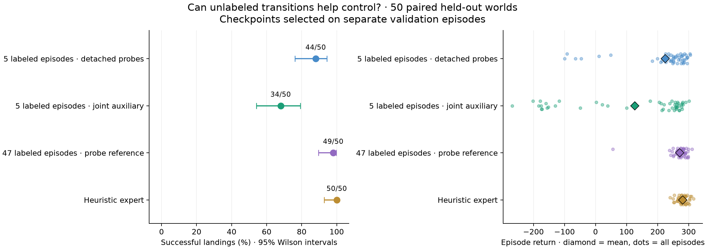
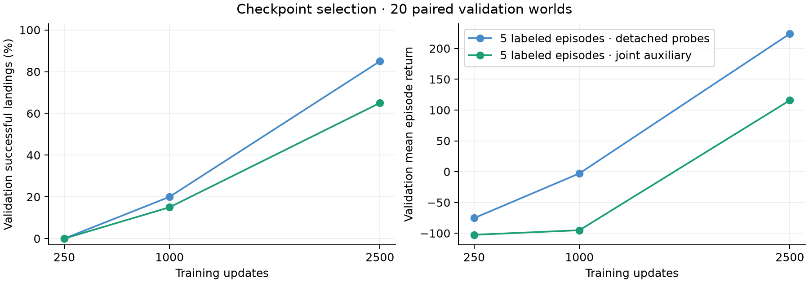
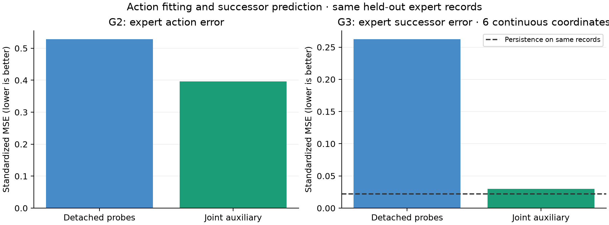

# Sparse action labels: better predictions, worse control

With actions labeled in only five expert episodes, detached probes land **44/50**
fresh test worlds and joint auxiliary training lands **34/50**. The interesting
result is that auxiliary training improves held-out expert action MSE by **25%**
and successor MSE by **8.8×**, yet lands less reliably. Average prediction quality
on expert observations does not determine closed-loop control quality.

The full-label reference lands 49/50 on these same worlds. It remains the live
default because it wins fresh validation. Both sparse controllers are available
at http://localhost:8787 alongside all earlier controllers.

## Graph and matched comparison

```text
                    +-- G1 -> reconstructed st
st -> E -> z -------+-- G2 -> at
                    +-- G3 -> predicted st+1

simulator.step(at) -> observed st+1 -> E -> ...
```

Terrain (11 values) enters E and all generators. The encoder has no current/previous action,
successor, episode ID, or label mask input. The real Box2D simulator advances the
lander during evaluation and playback. Training uses individual transitions,
without simulator calls, trajectory unrolling, reward optimization, or a
discriminator. All E/G1/G2/G3/prior weights start from scratch.

Both arms have MoG 1,024, z32, width128, independent generators, deterministic hard
particle routing with a soft straight-through gradient, and bounded offsets.
Both receive the same data, initialization, two sampling streams, and budget:

- **Probes:** action loss trains E/G2/prior; G1/G3 receive detached z and their
  losses train only their own head parameters.
- **Auxiliary:** G1/G3 losses also train E/prior.

We retain all 9,297 state/successor pairs from 47 heuristic training episodes.
Hash ordering selects episode IDs **3,15,53,5,22**, containing **1,010 action
labels** (10.86% of the original labels). Selection uses
SHA256(`lunar-sparse-actions-v1:<episode_id>`), independently of rewards, episode
lengths, or evaluation results. We run one fixed subset and no training-seed repeats.

Each update independently samples 256 labeled action records and 256 of all
state/successor records. Hidden actions are absent from the materialized training
arrays. State normalization uses all available training states/successors;
action normalization uses only the five labeled episodes. Both arms share the
exact same fitted statistics. The historical pretrained scaler is not reused.

Action loss is MSE averaged over the labeled batch and two standardized commands.
Each state head uses MSE over six standardized continuous coordinates plus BCE
over two contacts. Head weights are all 1; the default full-table MoG prior
variance/covariance regularizer is applied once per update. Adam uses neural
LR 0.0006, betas (0,0.999), prior LR 100×, prior betas (0.5,0.999), cosine decay after
60% to a 5% floor, and EMA 0.995. Both train for 2,500 updates on GPU 1.

This reduces **explicit action labels**, not action information: observed
successors can reveal what happened. All state pairs still come from expert
behavior. Sharing z connects the heads, but no objective forces G2's action to
produce G3's successor in simulation. G3 has no alternative-action input and
is not a general counterfactual dynamics model.

## Fresh paired leaderboard

Validation uses 791000–791019 and test uses 891000–891049. These reset seeds are
disjoint from collected data and previous control evaluations. Checkpoints
250/1,000/2,500 are selected by validation landing rate, then mean return, then
earlier update. Both sparse arms select 2,500; identical final checkpoints reuse
their selected test rollouts.

| Controller | Labeled episodes | Validation landings | Test landings | Wilson 95% | Mean test return | Crash / bounds / time limit |
| --- | ---: | ---: | ---: | --- | ---: | --- |
| Hand-written heuristic | — | 20/20 | 50/50 | 92.9%–100% | 280.97 | 0 / 0 / 0 |
| Full-label probe reference | 47 | 20/20 | 49/50 | 89.5%–99.6% | 271.11 | 1 / 0 / 0 |
| Sparse detached probes | 5 | 17/20 | 44/50 | 76.2%–94.4% | 224.47 | 2 / 0 / 4 |
| Sparse joint auxiliary | 5 | 13/20 | 34/50 | 54.2%–79.2% | 126.41 | 2 / 11 / 3 |

Probes win 11 paired landing outcomes, lose 1, and tie 38 against auxiliary. They
win 35/50 paired returns with mean advantage 98.06. Auxiliary failures are mostly
out of bounds; both sparse models crash twice. The full-label reference previously
landed 50/50 on another set, but 49/50 here: finite evaluation results are not a
guarantee of reliability. Intervals describe evaluation worlds, not variation
over training runs or label subsets.

The full-label reference is reevaluated, not retrained. Its scaler and sampling
procedure differ from this round, so the two sparse arms are the controlled
comparison. Do not directly compare their standardized prediction errors with
historical/full-label errors. Physical errors are retained in JSON.



| Update | Probe validation landings | Probe mean return | Auxiliary validation landings | Auxiliary mean return |
| ---: | ---: | ---: | ---: | ---: |
| 250 | 0/20 | -75.40 | 0/20 | -102.52 |
| 1000 | 4/20 | -2.88 | 3/20 | -95.16 |
| 2500 | 17/20 | 223.89 | 13/20 | 115.78 |

The default `state_probes` wins validation 20/20, return 287.96. Test scores do not
choose the default. No extra training or subset search followed these results.



## Auxiliary training helps every held-out prediction head

Both sparse models are scored on the same 2,444 historical held-out expert
behavior transitions. These are secondary diagnostics, separate from fresh
controller selection. The standardized metrics below share a scaler.

| Model | G2 action MSE | Physical action MSE | G1 state MSE | G3 successor MSE | G3 contact Brier |
| --- | ---: | ---: | ---: | ---: | ---: |
| Probes | 0.528687 | 0.075238 | 0.242103 | 0.262555 | 0.009599 |
| Auxiliary | 0.396769 | 0.056690 | 0.019120 | 0.029738 | 0.005874 |

Auxiliary reduces action MSE 24.95%, current-state MSE 12.7×, and successor MSE 8.8×.
It also improves main-engine regime agreement 96.85%→98.36% and lateral agreement
76.06%→80.73%. Unlike the previous full-label comparison, worse expert action
fitting does **not** explain the weaker controller in this round.

Expert persistence successor MSE is 0.022230, still better than either learned
G3. Auxiliary contact Brier does beat persistence 0.008183. Small-step continuous
prediction and contact prediction therefore tell different parts of the story.



## Prediction on actual learner states

| Own rollouts | Records | G1 state MSE | G3 successor MSE | Persistence MSE | G3 contact Brier |
| --- | ---: | ---: | ---: | ---: | ---: |
| Probes | 15027 | 1.440771 | 1.469513 | 0.015672 | 0.102561 |
| Auxiliary | 19374 | 0.730875 | 0.749776 | 0.014655 | 0.035319 |

Both models predict much worse on learner-visited states than on expert data.
Their rollout distributions differ, so the rows alone cannot establish a
same-input comparison. Cross-scoring both models on each fixed trace set gives:

| Recorded controller | Evaluated model | G1 state MSE | G3 successor MSE |
| --- | --- | ---: | ---: |
| Probes | Probes | 1.440771 | 1.469513 |
| Probes | Auxiliary | 0.308216 | 0.356844 |
| Auxiliary | Probes | 1.947802 | 1.889776 |
| Auxiliary | Auxiliary | 0.730875 | 0.749776 |

Auxiliary decodes states better on both identical-input datasets, yet controls
worse. G3 cross-policy scores remain descriptive because recorded successors
were caused by another policy's action, which G3 cannot receive. Own-rollout
action MSE near machine precision checks replay consistency, not expert agreement.
See [cross diagnostics](cross_diagnostics.md) for full metrics and hashes.

## The action-error ranking reverses during deployment

We queried the heuristic on already-recorded learner states, without resetting
or stepping a simulator. These commands are posthoc diagnostics, never training
labels or checkpoint-selection targets in this experiment.

| Controller | Expert-state physical action MSE | Own learner-state physical action MSE | Episode-mean learner MSE | Main regime agreement | Side regime agreement |
| --- | ---: | ---: | ---: | ---: | ---: |
| Probes | 0.07524 | 0.40936 | 0.31135 | 79.6% | 36.1% |
| Auxiliary | 0.05669 | 0.71665 | 0.55555 | 53.8% | 30.3% |

Auxiliary action error is about 75% higher on its own visited states, despite
being 25% lower on expert states. The episode-weighted result agrees, so longer
failed episodes are not the whole explanation. Auxiliary fires the main engine
on 59.8% of states where the heuristic would turn it off, versus 34.8% for probes.
Both miss many requested lateral corrections: 92.9% auxiliary, 90.8% probes,
conditional on the heuristic requesting side-engine firing.

On auxiliary episodes that eventually leave the bounds, lateral agreement is
9.5%, with 95.3% of requested lateral firings missed. These failures are consistent
with poor corrections during deployment. They do not prove which error caused
failure: the controllers visit different states, and the heuristic's suggested
commands are not demonstrated recoveries from those states. See the
[action diagnostics](on_policy_action_diagnostics.md) for phases, denominators,
episode weighting, outcome groups, and provenance.

## Costs, verification, and artifacts

| New arm | GPU 1 training seconds | Trainable parameters | Action inference parameters | CPU inference ms/step |
| --- | ---: | ---: | ---: | ---: |
| Probes | 14.54 | 145362 | 99010 | 0.738 |
| Auxiliary | 16.58 | 145362 | 99010 | 0.720 |

Each arm draws 640,000 labeled examples and 640,000 auxiliary examples. Training
makes zero simulator calls. Time includes optimization, logging, and minibatch
hashing, excludes setup/checkpoint writes, and is measured on a shared machine.
G1/G3 are not needed for action inference. Actual evaluation contains 12 unique
rollout sets, 360 episodes, 92,592 explicit steps, 92,952 including resets. Two reused
final-checkpoint aliases add JSON rows without extra rollouts. Cross diagnostics
use no additional simulator calls. Counts exclude correctness smokes/browser checks.

The full suite passed **340 tests and 27 subtests**, with 4 opt-in CUDA integration
tests skipped and 2 existing warnings. Three-step GPU 1 smokes preceded full runs.
One additional focused test passed for the posthoc lateral-action counts.
Tests remove hidden actions entirely and verify identical arrays, normalization,
losses, both draw streams, and learned weights for both arms. Gradient boundaries
and action-loss independence from auxiliary batch size are tested. Independent
review and actual artifact audits confirm matching initialization, data, label
subset, scaler, source archives, and both full training draw streams.

Browser verification passed all eight controller switches, exact reset frames,
Step, Play/Pause, and terminal auto-stop, with no JavaScript exceptions. The
validation-selected default landed the first validation world in 187 steps with
return 269.81. Verification restored it paused at step 0, seed 791000. The server is
live and the user may subsequently change its state.

- [Guide and reproduction commands](../../../docs/gym-sparse-action.md)
- `protocol.json`: frozen data, subset, preprocessing, sources, and evaluation.
- `leaderboard.json`, `selections/`, `evaluations/`, `traces/`: detailed outcomes.
- `training/{probes,auxiliary}/`: nine archived audit artifacts per arm.
- Checkpoints: `results/gym/lunar_lander_sparse_action/{probes,auxiliary}/best.pt`.
- Log: `tail -f results/gym/lunar_lander_sparse_action/live.log`.
- `browser_verification.json`, `viewer.png`, `test_suite.log`: validation evidence.

## Recommendation

Keep full-label probes as the playable default and sparse probes as the
five-episode baseline. The evidence supports an offline prediction benefit from
auxiliary learning, but not a control benefit under this recipe. Better average
expert-data action error can hide mistakes at states the learner reaches.

The next bounded experiment should test one round of heuristic corrections on
learner-visited states, using the same fixed correction set for both arms. This
targets the measured deployment errors directly. Count those extra action labels
explicitly: it would be a larger-label experiment, not a five-episode-label result.
Collect those corrections on new training-only rollout worlds; keep this round's
held-out diagnostic traces out of the correction training set.
Keep corrected action targets separate from old observed successors, which were
caused by the learner's original actions. Freeze the comparison before training
and evaluate on new paired worlds. No correction training has been launched.
