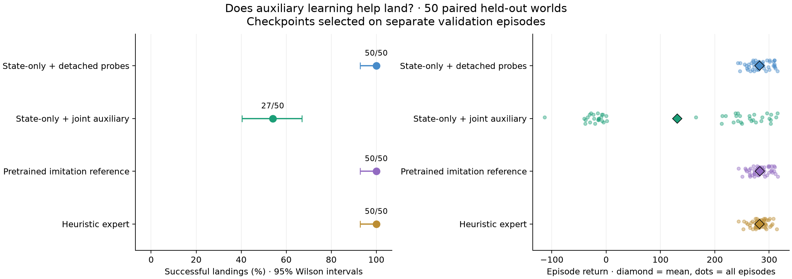
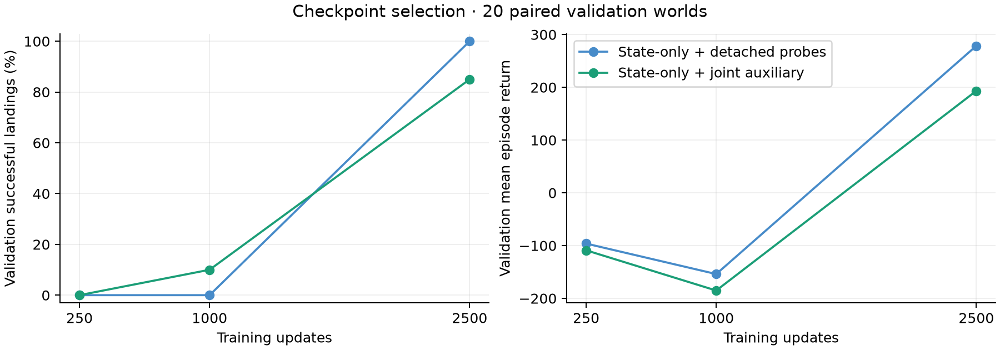
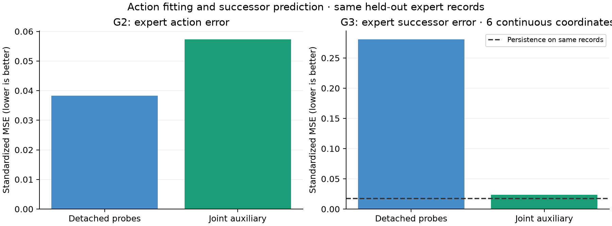

# State-only control: detached probes versus joint auxiliary learning

The state-only model with detached probes landed **50/50** fresh test worlds
from scratch. Joint auxiliary learning landed **27/50**, despite predicting
held-out expert successors about **12 times more accurately**. Under this recipe
and budget, improving the decoded world representation did not improve control.

The playable default is **state_probes**, chosen by fresh validation results.
All previous controllers remain available at http://localhost:8787.

## Question and graph

Does asking a shared latent to explain states and successors help it choose
expert-like actions that land in the actual simulator?

```text
                    +-- G1 -> reconstructed st
st -> E -> z -------+-- G2 -> at
                    +-- G3 -> predicted st+1

simulator.step(at) -> observed st+1 -> E -> ...
```

Terrain context (11 values) enters E and all generators. There is one state-only
encoder; no current action, previous action, or next-state target enters E.
The simulator advances the real Box2D state. Training shuffles individual
transitions and does not unroll trajectories or differentiate through simulation.

## Matched experiment

Both new arms start from scratch with the same initialization and minibatches:
MoG 1,024, z32, width128, independent G1/G2/G3, deterministic hard routing with a
soft straight-through gradient and bounded offsets. The old checkpoint supplies
only training-derived normalization statistics, never model weights.

- **Probes:** action loss trains E/G2/prior. G1/G3 train on detached z; their
  losses update only their own parameters.
- **Auxiliary:** the same three head losses also let G1/G3 shape E/prior.

Each uses 2,500 updates, batch 256 (640,000 record draws), and all 9,297 actual
behavior transitions from the same 47 training heuristic episodes. No alternative
branch actions, fresh data collection, simulator training calls, or seed repeats.

Action loss is mean squared error over the batch and two standardized action
coordinates. Each state head uses MSE over six standardized continuous
coordinates plus mean binary-contact BCE over two contacts. The three head
losses have weight 1 each. Both arms also apply the default full-table MoG prior
regularizer (variance/covariance, weight 1). There are no discriminators, GAN
losses, synthetic reconstruction losses, or reward optimization in this round.

Adam follows the MoG recipe: neural LR 0.0006, betas (0,0.999), prior LR 100x,
prior betas (0.5,0.999), cosine decay after 60% to a 5% floor, EMA 0.995. All Gs, E,
and prior train in both arms. This differs from the prior imitation fine-tune,
which froze G1/G3 and the prior.

## Evaluation protocol

Twenty fresh validation worlds (591000–591019) and fifty fresh test worlds
(691000–691049) are paired across methods and checked against prior collection
and evaluation provenance. Candidate updates 250/1,000/2,500 are selected by
validation landing rate, then mean return, then earlier update in an exact tie.
Test evaluates the selected and final checkpoints. Identical selected/final
checkpoints reuse the exact same rollout results.

The heuristic and previous imitation controller are re-evaluated on these new
worlds. Their historical 50/50 scores are not reused as this round's results.
Landing follows the pinned simulator's final sleep termination condition;
crash, bounds, and time-limit outcomes and raw flags are retained. Wilson 95%
intervals describe finite evaluation episodes, not variation over training runs.

Auxiliary metrics use held-out expert behavior records, and saved actual learner
rollouts. G3 has no alternative-action input: it learns expert-behavior successors.
Its physical consistency with its own G2 must be measured rather than assumed.
Persistence on the exact same states/successors provides a small-step baseline.
These diagnostic predictions are computed offline and excluded from controller
inference timing. Prediction quality is secondary to actual landing outcomes.

## Leaderboard: fifty paired test worlds

| Controller | Validation landings | Test landings | Wilson 95% | Mean test return | Median | Crash / bounds / time limit |
| --- | ---: | ---: | --- | ---: | ---: | --- |
| Previous pretrained imitation | 20/20 | 50/50 | 92.9%–100.0% | 283.16 | 281.84 | 0 / 0 / 0 |
| Hand-written heuristic | 20/20 | 50/50 | 92.9%–100.0% | 282.45 | 283.10 | 0 / 0 / 0 |
| Scratch state-only + detached probes | 20/20 | 50/50 | 92.9%–100.0% | 282.24 | 280.67 | 0 / 0 / 0 |
| Scratch state-only + joint auxiliary | 17/20 | 27/50 | 40.4%–67.0% | 130.92 | 213.13 | 22 / 0 / 1 |

The probe controller beats the auxiliary controller on 23 landing outcomes, loses
on none, and ties on 27. It wins 43/50 paired returns, with mean advantage 151.32.
Both new arms select update 2,500, identical to their final checkpoints. Test
scores are reused for those identical checkpoints rather than counted twice.

The old imitation reference has slightly higher test return than the new probe
model (283.16 versus282.24). The new probe model is the demo default because its
**validation** return is 278.59 versus 277.82, with both landing 20/20. The test
results did not choose the default. A 50/50 result is not universal reliability.
This comparison establishes that this state-only controller can learn from
scratch; it does not isolate the benefit of pretraining, because the old
reference also differs in encoder inputs and prior-training rules.



## Learning progression

| Update | Probes validation landings | Probes return | Auxiliary validation landings | Auxiliary return |
| ---: | ---: | ---: | ---: | ---: |
| 250 | 0/20 | -96.19 | 0/20 | -108.94 |
| 1000 | 0/20 | -153.97 | 2/20 | -185.19 |
| 2500 | 20/20 | 278.59 | 17/20 | 193.32 |

Early action fitting did not immediately translate into successful control. The
large improvement by update 2,500 also cautions against treating early-checkpoint
failure as architectural impossibility. No extra budget or seed reruns were used.



## Better expert predictions, worse control

These metrics use the **same 2,444 held-out expert behavior transitions** for both
new models, not the original counterfactual-action dataset. State/next MSE covers
six standardized continuous coordinates; action MSE covers two standardized commands.

| Model | Expert action MSE | G1 current-state MSE | G3 next-state MSE | G3 contact Brier |
| --- | ---: | ---: | ---: | ---: |
| probes | 0.038254 | 0.272477 | 0.280936 | 0.011134 |
| auxiliary | 0.057345 | 0.014623 | 0.023413 | 0.006569 |

G3 continuous error falls about 12x and G1 error about 18.6x, while expert action
error rises about 50%. These measurements support a tradeoff between fitting
auxiliary targets and choosing actions in this matched experiment; they do not
identify a unique optimization mechanism or show that auxiliary learning always
hurts. Main-engine regime agreement is nearly equal (98.81% probes,98.90%
auxiliary), while lateral regime agreement falls 91.90%→90.34%.

Persistence on those same expert transitions has next-state MSE**0.017384**, lower
than either G3. Auxiliary training improves the decoder substantially but does
not yet establish a useful physics predictor relative to that simple baseline.



## What G3 predicts during actual flight

| Controller's own rollouts | Transition count | G3 next MSE | Persistence next MSE | G3 contact Brier |
| --- | ---: | ---: | ---: | ---: |
| probes | 10095 | 0.267315 | 0.019207 | 0.017016 |
| auxiliary | 10692 | 0.377632 | 0.047972 | 0.058808 |

The auxiliary model's strong expert prediction score does not carry over to its
own rollouts. However, these rows visit different states and have different
crash/contact histories, so the cross-controller difference alone is not evidence
of worse prediction on identical inputs. G3 has no action input, and its training
targets are expert successors, so it also cannot guarantee consistency when G2
deviates from expert commands. The recorded on-policy action reconstruction
errors near machine precision are a replay check, not expert agreement.


A posthoc cross-check scores **both models on each fixed rollout dataset**:

| Recorded rollout source | Model | G1 current MSE | G3 observed-successor MSE |
| --- | --- | ---: | ---: |
| Probes controller | Probes | 0.257770 | 0.267315 |
| Probes controller | Auxiliary | 0.016088 | 0.028207 |
| Auxiliary controller | Probes | 1.026640 | 1.017716 |
| Auxiliary controller | Auxiliary | 0.338229 | 0.377632 |

Auxiliary training decodes current states better on **both identical-input
comparisons**, yet its controller lands less often. That makes the tradeoff
clearer than comparing only each model's own trajectories. Cross-policy G3 errors
are descriptive: each decoder predicts from state, while the recorded successor
was caused by the source controller's action. This is not a counterfactual
consistency test. See [cross diagnostics](cross_diagnostics.md) for action
mismatch measurements, persistence scores, and artifact hashes. No new simulator
calls or training were needed.

## Cost and validation

| New arm | GPU1 training seconds | Trainable parameters | Action inference parameters | CPU inference ms/step |
| --- | ---: | ---: | ---: | ---: |
| probes | 22.61 | 145,362 | 99,010 | 0.874 |
| auxiliary | 20.73 | 145,362 | 99,010 | 0.873 |

Training time includes optimization/logging/minibatch hashing, excludes setup
and checkpoint saves, and comes from a shared machine; the small timing difference
is not a controlled speed claim. Each arm draws 640,000 expert records and makes
zero simulator calls during training. Inference runs E/G2/prior diagnostics only;
G1/G3 are unnecessary to fly. Both are about 20x faster than simulator real time
in headless CPU evaluation, including stepping and evaluation bookkeeping.

The full suite passed: **332 tests, 27 subtests; 4 opt-in CUDA tests skipped**.
Two existing unrelated warnings remain. Gradient tests prove that action loss
reaches E/G2/prior, detached auxiliary losses reach G1/G3 only, and live auxiliary
losses reach E/prior. Tests also verify target exclusion, matched initialization
and data draws, scaler-only checkpoint use, checkpoint replay, real simulator
stepping, and independence from previous commands. Three-step GPU1 smokes passed
before full runs. Independent review and actual artifact hashes confirm matching
initialization, every minibatch draw, training records, and scaler values.

## Recommendation

Keep the state-only probe controller as the playable baseline. The next bounded
training comparison should reduce the auxiliary weights from 1 to 0.1 for both
G1/G3, retaining the same architecture/data/budget. This tests whether auxiliary
information can be retained without sacrificing as much action fitting. If that
still hurts control, investigate the auxiliary gradients or decouple them rather
than assuming a more accurate decoder will improve action selection. Use fresh
paired evaluation worlds for the next round; no additional experiment has been
launched here.

A separate future prediction experiment could make G3 predict a state increment
and explicitly check consistency with G2. That would address the persistence
baseline, but changes the question and should not be mixed into the loss-weight
comparison. Neither result requires returning to a previous-action encoder or
adding trajectory unrolling.

## Artifacts and reproduction

- `protocol.json`: frozen sources, simulator, reset seeds, selection rule.
- `leaderboard.json`, `selections/`, `evaluations/`, `traces/`: full metrics,
  selected/final decisions, per-episode outcomes, and hashed action traces.
- `training/{probes,auxiliary}/`: archived code, configs, data/initialization
  hashes, optimizer recipe, normalization, environment, losses, and costs.
- Checkpoints: `results/gym/lunar_lander_state_control/{probes,auxiliary}/best.pt`.
- Live log: `tail -f results/gym/lunar_lander_state_control/live.log`.
- Guide and commands: [state-control guide](../../../docs/gym-state-control.md).

The authoritative evaluation contains 12 unique rollout sets, 360 episodes,
69,341 explicit simulator steps, and 69,701 steps including resets. Selected/final
aliases account for two additional evaluation JSON files without additional
rollouts. These counts exclude correctness smokes and browser checks.

Browser verification passed all six controller switches, exact reset frames,
Step, Play/Pause, and terminal auto-stop. The default completed the first
validation world in 195 steps with return 244.83. The viewer was restored to
state_probes, paused at step 0 on seed 591000. See `browser_verification.json` and
`viewer.png`. No browser JavaScript exceptions occurred.
