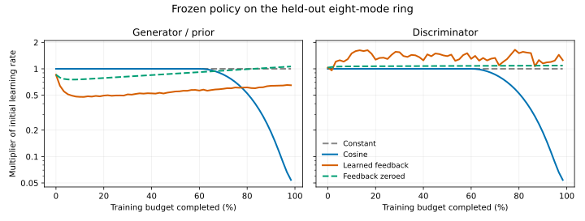

# Learned GAN LR controller — initial study

**Continuation:** the [expanded smart-descent study](../smart_descent/README.md)
fits gradient feedback on the full development suite, tests direct schedule
replacement and raw-gradient descent, and reserves new transfer cases. Its
cosine-backed candidate passes all 29 live bounds and sustains all nine toys.
The initial experiment below is preserved as originally measured.

This is a trained, runnable research controller. A 12-weight linear network was fitted on a four-mode ring and a nine-mode grid; all nine behavioral hosts and the evaluation tasks below were held out from fitting. Fitting and ring comparisons use 1,200 updates. The full suite preserves each host's original 80–1,200 update budget. All runs use seed 0 and live scoring; EMA is recorded separately.

The frozen controller improves the fitting objective by 10.4% relative to cosine, but fails all three held-out coverage/HQ tasks. Zeroing its feedback inputs slightly improves the fitting objective, so this experiment does not establish a benefit from feedback over a learned time schedule. Cosine remains the stronger ring baseline.

## Full behavioral leaderboard

| Controller | Live bounds | Sustained toys | Ring modes / HQ | Ring confirmation |
| --- | ---: | ---: | --- | ---: |
| Constant LR | 29/29 | 8/9 | 8/8 / 100% | Not reached |
| **Delayed cosine** | **29/29** | **9/9** | **8/8 / 100%** | **Step 1,050** |
| Learned feedback | 27/29 | 7/9 | 4/8 / 66.94% | Not reached |
| Learned, feedback zeroed | 27/29 | 6/9 | 2/8 / 33.76% | Not reached |

Both learned variants fail the ring and pass the other eight final toy targets.
All ten independent shared checks pass. The [full report](full_suite/README.md)
includes every host, EMA, timing and action traces. Cosine reproduces all nine
historical final measurements exactly ([parity](full_suite/parity.json)). No
held-out score was used to select or refit the policy.

On the held-out ring, the learned policy's last observed G multiplier is 0.650
and D multiplier is 1.253. Cosine reduces both to approximately 0.054 at that
observation. The learned trajectory does not achieve a full-coverage/HQ pass at
any of the 24 measurements. These observations describe its behavior; they do
not isolate which coefficient or signal causes the failure.



The plot connects recorded values at 20-update intervals. All actions scale the
original learning rates; the controller preserves ratios between parameter groups.

The full-suite research callbacks take 0.54 seconds across 21.64 seconds of
training/evaluation for the learned arm, versus 0.29 across 21.27 for cosine.
Timing is a single CPU observation, including the host integration bridge;
there is no demonstrated convergence-speed gain.

## Training selection

Lower objective is better: half the mean 24-checkpoint normalized sliced Wasserstein distance plus half its final-quarter mean, averaged across both training tasks. Neither mode/HQ gates nor EMA select the controller.

| Training control | Mean objective | Ring 4 final modes / HQ | Grid 9 final modes / HQ |
| --- | ---: | ---: | ---: |
| Constant | 0.256407 | 2/4 / 25.39% | 7/9 / 100.00% |
| Delayed cosine | 0.251317 | 4/4 / 83.64% | 7/9 / 100.00% |
| Learned feedback | 0.225247 | 4/4 / 100.00% | 8/9 / 100.00% |
| Learned, feedback zeroed | 0.225064 | 2/4 / 48.66% | 7/9 / 82.89% |

Selected attempt: `generation02_candidate05`. Selection role: `overall_winner`. All 32 attempted policies and all 64 fitting episodes are retained. Total fitting episode time: 440.1 CPU seconds; this is an observed runtime, not a repeated throughput estimate.

## Frozen held-out comparisons

Full coverage/HQ requires every mode and ≥90% HQ. Sustained success additionally requires the last five or more scheduled observations to pass through the full budget. SW1 remains a diagnostic here, not a new behavioral PASS gate.

| Task | Scheduler | Final modes | Live HQ | Normalized SW1 | Sustained from | Mean trajectory objective | Total / controller seconds |
| --- | --- | ---: | ---: | ---: | ---: | ---: | ---: |
| ring8 | constant | 8/8 | 100.00% | 0.1221 | — | 0.1710 | 8.13 / 0.00 |
| ring8 | cosine | 8/8 | 100.00% | 0.1133 | 850 | 0.1573 | 6.89 / 0.00 |
| ring8 | learned | 4/8 | 66.94% | 0.2317 | — | 0.2626 | 6.88 / 0.08 |
| ring8 | learned (feedback zeroed) | 2/8 | 33.76% | 0.2703 | — | 0.2757 | 6.96 / 0.08 |
| ring8_scale_half | constant | 5/8 | 73.44% | 0.2277 | — | 0.2419 | 6.96 / 0.00 |
| ring8_scale_half | cosine | 7/8 | 83.47% | 0.1626 | — | 0.1855 | 7.03 / 0.00 |
| ring8_scale_half | learned | 4/8 | 32.98% | 0.2644 | — | 0.2470 | 6.95 / 0.08 |
| ring8_scale_half | learned (feedback zeroed) | 4/8 | 40.65% | 0.1159 | — | 0.1461 | 6.99 / 0.08 |
| ring8_r1r2 | constant | 7/8 | 100.00% | 0.1402 | — | 0.1817 | 6.68 / 0.00 |
| ring8_r1r2 | cosine | 7/8 | 74.61% | 0.1959 | — | 0.1905 | 6.72 / 0.00 |
| ring8_r1r2 | learned | 6/8 | 74.39% | 0.2176 | — | 0.2790 | 6.76 / 0.08 |
| ring8_r1r2 | learned (feedback zeroed) | 2/8 | 24.02% | 0.1988 | — | 0.2453 | 6.85 / 0.08 |

The same policy is used in every held-out task. It was frozen before these results were observed; no held-out result affected controller selection. The feedback-zeroed ablation retains the learned bias/progress coefficients and smoothing while zeroing all four optimizer-state inputs. A better fitting objective does not certify any behavioral-suite PASS or faster convergence.

## Reproduction and artifacts

- [Controller implementation](../../benchmarks/learned_lr/controller.py) and [method / runnable commands](../../benchmarks/learned_lr/README.md).
- [Overall selected policy](policy.json), [feedback policy](adaptive_policy.json), and [selection record](selection.json) contain exact coefficients, roles, feature schema, source hashes, and training-only selection metadata.
- [All search attempts](training.json), [training controls](training_controls.json), [held-out curves and actions](heldout.json), and `episodes/` retain successful and unsuccessful trials.
- [Post-fit selection script](selection_script.py) and [full fit log](fit.log) record the freeze procedure and progress.

To rerun the frozen full-suite comparison:

```bash
python -u -m benchmarks.learned_lr_evaluation \
  --policy reports/learned_lr/policy.json --reference /path/to/conceptmod \
  --output /tmp/learned-lr-heldout > /tmp/learned-lr-heldout.log 2>&1
tail -f /tmp/learned-lr-heldout.log
# Optional figure, from the recorded action traces:
python -m benchmarks.plot_learned_lr
```

The controller sees normalized progress, gradient RMS change, gradient
alignment, Adam direction RMS change and parameter RMS change. It sees no
formulation name, task identity or evaluation metric. Only LR changes; Adam
betas, regularizer strengths and objectives remain fixed. The
[method and equation](../../benchmarks/learned_lr/README.md) explain the two
coefficient rows and how to call the controller before optimizer updates.

Keep cosine as the supported baseline. A next research phase should fit across
more architectures, horizons and formulations, and examine the mismatch between
distributional SW1 and coverage/HQ. The feedback-zeroed training row shows that
a lower SW1 objective can coexist with substantially worse mode/HQ outcomes.
Any further fitting should use a newly declared training/validation split;
these already-inspected tasks no longer constitute a fresh test set.

Limitations: one initialization, two synthetic fitting distributions, one
architecture family, one fitting formulation, 32 policy proposals, no online
policy checkpoint support, and CPU-only overhead measurements. The isolated
implementation commit is `b5b5b4dd96bc941fe2ea665f57b1bad708f94d89`; the recorded
source hashes also match the integrated implementation. The parent integration
adds three bridge tests to the three controller contract tests.
