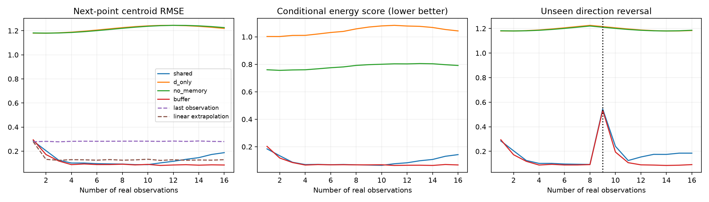
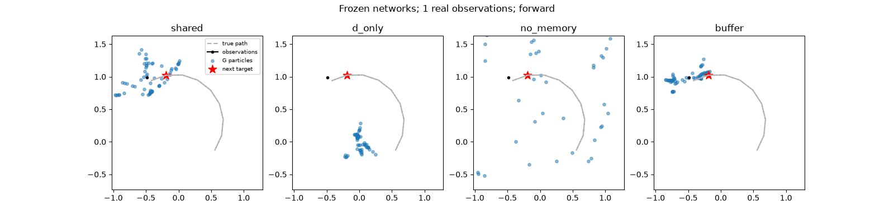

# Sequential shared-memory circle experiment

**Current target:** autonomous generation from noise and empty memory, with no
realtime expert or real starting prefix. See [continuation notes](NEXT.md) and
[the new GPU trainer](../../experiments/autonomous_memory.py). The results below
are the earlier observation-conditioned study.

The proposed communication channel works in this toy: a discriminator-trained
memory lets a read-only generator predict motion on new circles with frozen
network weights. Shuffling memory destroys prediction. The simple recent-point
buffer nevertheless beats the learned trace memory, especially beyond the
training sequence length. This is evidence for feasibility, not a fast-memory
advantage or a general claim about adversarial memory stability.

Implemented on branch `feat/sequential-memory-path` using the public ParticleGAN
API in [experiments/memory_path.py](../../experiments/memory_path.py).

## Leaderboard

Each mechanism received 7,000 updates with the same initialization seed, episode
schedule and latent sampling schedule. No seed experiments. Evaluation uses 256
fresh episodes, 64 fixed latent particle identities, and frozen network weights.
Numbers average the per-prefix metrics for 4–12 observed points; lower is better.

| Rank | Mechanism | Conditional energy score | Next-point centroid RMSE | Shuffled-memory RMSE | Held-out linear probe RMSE |
|---|---|---:|---:|---:|---:|
| 1 | Recent four-point buffer, D and G read | 0.0678 | 0.0882 | 1.7202 | 0.0976 |
| 2 | Learned memory, D and G read | 0.0713 | 0.0980 | 1.7143 | 0.1191 |
| 3 | No memory | 0.7868 | 1.2179 | 1.2179 | 1.2083 |
| 4 | Learned memory, only D reads | 1.0528 | 1.2215 | 1.2215 | 0.2337 |

Deterministic reference centroid RMSE: copying the last observation **0.2825**;
constant-velocity extrapolation **0.1280**. Shared memory improves on these by
65% and 23%, respectively. The buffer's RMSE is 10% below shared memory's.
These are single-run mechanism comparisons, not significance estimates.

The conditional energy score evaluates the whole particle cloud against the
next noisy observation: mean distance to the observation minus half the mean
distance between distinct particles. Centroid RMSE uses the noise-free next
position. A good marginal ring alone cannot pass these conditional metrics.



## What happened

- **G uses M.** Shared-memory RMSE rises from 0.0980 to 1.7143 when complete memory
  snapshots are cyclically shuffled between episodes, and to 1.2427 when zeroed.
  These interventions alter only G's inference input; no training occurs.
- **No complete memory collapse appeared.** A separate linear ridge probe
  predicts the next clean position from shared memory at 0.1191 RMSE. It fits
  on 128 evaluation episodes and tests on the other 128, with disjoint episodes.
  This demonstrates retained readable information; it does not establish that
  every feature is useful, nor that D could never learn to obscure information.
- **Uncertainty narrows with evidence.** The shared model's particle spread
  (square root of summed coordinate variances, averaged over episodes) falls
  from 0.294 after one observation to 0.058 after eight. This is descriptive;
  calibrated conditional uncertainty is not established by spread alone.
- **An unseen reversal causes a miss and then adaptation.** When the next
  transition reverses after observation nine, shared-memory RMSE is 0.544.
  After one and two reversed observations arrive, it falls to 0.241 and 0.125.
  An unannounced reversal cannot be predicted before evidence arrives.
- **Longer contexts expose a weakness.** Shared-memory normal-path RMSE grows
  to 0.188 at 16 observations, beyond the 1–12 training range. The buffer stays
  near 0.085. A plausible explanation is that the slower traces enter states
  not covered during training; this experiment does not isolate that cause.
- **D-only memory creates an information mismatch.** Its G has no episode
  information and cannot know the next location. Its narrower, misplaced cloud
  has worse energy score than the broad no-memory generator. These controls
  establish the importance of G's context access, not a unique benefit of
  learning that context adversarially.



The animation uses the first held-out episode without selection. Gray is the
underlying path, black points are observations already available, blue dots are
G's predictions, and the red star is the next clean target. All variants use
the same episode and fixed latent identities. Axis limits focus on the path;
some unconditional particles can fall outside the visible region.

## Exact experiment

An episode samples center coordinates uniformly in [-0.75, 0.75], radius in
[0.6, 1.4], starting phase in [0, 2π], and signed angular speed with magnitude
in [0.12, 0.40] radians per step. Observations have independent Gaussian noise
with standard deviation 0.03 per coordinate. Training samples independent
episodes and prefix lengths uniformly from 1 to 12. Evaluation observes 16
prefixes of fresh episodes from the same parameter distribution, plus a
direction-reversal stress test never seen during training.

The learned memory is an 8×4 matrix of feature traces:

```
v = tanh(Linear(tanh(Linear(x))))       # 2 -> 32 -> 8
decay = [0.0, 0.5, 0.8, 0.95]
M_next = M * decay + v[:, None] * (1 - decay)
```

Memory starts at zero per episode. Writes are rank-one feature updates to fixed
temporal keys; this is a simple trace-memory version of the idea, not a general
content-addressed fast-weight system. G and D read its flattened 32 values
through separate two-layer, width-64 MLPs. G additionally receives a four-value
learnable particle code; D additionally receives the candidate 2D point. G gets
no raw-point, velocity, circle-parameter, or target bypass. The buffer control
right-aligns the last four raw points in the same 32-dimensional interface.

For each update, replay only the observed prefix into M, score the unseen next
real point and a detached fake using the same M, and update D plus its writer.
Then rebuild M with the updated writer, freeze D, detach M, and update G plus
its particle prior. Only D's objective trains the writer; G's gradient cannot
reach it, and D's update cannot differentiate through fake generation. Neither
real nor fake candidate scoring writes memory. The target becomes an observation
only for later prefixes. Replaying a prefix during evaluation is equivalent to
streaming the recurrence because all network weights are frozen.

The loop uses `get_recipe`, its prior/loss/penalty/regularizer/optimizer factories,
and `learning_rate_scale`. Recipe GAN defaults supply relativistic logistic
loss, gradient cap, particle spread regularization and LR decay. Overrides are
128 episodes per batch and 512 particles. No reconstruction loss, supervised
prediction loss, or EMA is used. Training plus evaluation took about 92 seconds
on CPU with one Torch thread, excluding startup and plotting. Full resolved
recipes and curves are in [results.json](results.json).

## Recommended next experiments

1. **Train on longer, varying episode lengths**, then test substantially longer
   streams. Keep the buffer control. Resolve the observed duration failure
   before attributing it to memory collapse or moving to complicated shapes.
2. **Freeze the writer at initialization.** Compare its random feature traces
   with the learned writer. This directly tests whether D's writer training adds
   useful information beyond an ordinary history summary.
3. **Use a figure-eight with crossings.** Score branch choice near crossings,
   where the current position alone is ambiguous. Include a last-point-only
   conditional control to isolate the benefit of temporal history.
4. **Change writer gradient ownership** only after these controls: allow G's
   loss to train the writer, or allow D gradients through G into the writer.
   These are distinct mechanisms and should be separate comparisons.

## Reproduce and inspect

Run from the repository root with a fresh output directory:

```bash
.venv/bin/python -u experiments/memory_path.py \
  --out runs/memory_path/circle_7k_reproduce --steps 7000 --log-every 500
tail -f runs/memory_path/circle_7k_reproduce/experiment.log
```

The completed run is at `runs/memory_path/circle_7k/`. Each variant has flushed
`metrics.jsonl`, a resolved `config.json`, `summary.json`, inference checkpoint
`model.pt` (including the writer), and evaluation clouds in `particles.npz`.
The suite saves a source snapshot and provenance. Checkpoints are for inference,
not exact training resume; optimizer and training RNG states are not saved.
Bulky run files are ignored; this report preserves results and figures.

Validation: **33 tests passed** across `test_memory_path.py`,
`test_api_primitives.py` and `test_api_integration.py`. New checks cover streaming
equivalence, memory immutability, gradient ownership, future-target leakage,
and the timing of reversal evidence. All four variants also passed an end-to-end
smoke run, and `git diff --check` passed.
