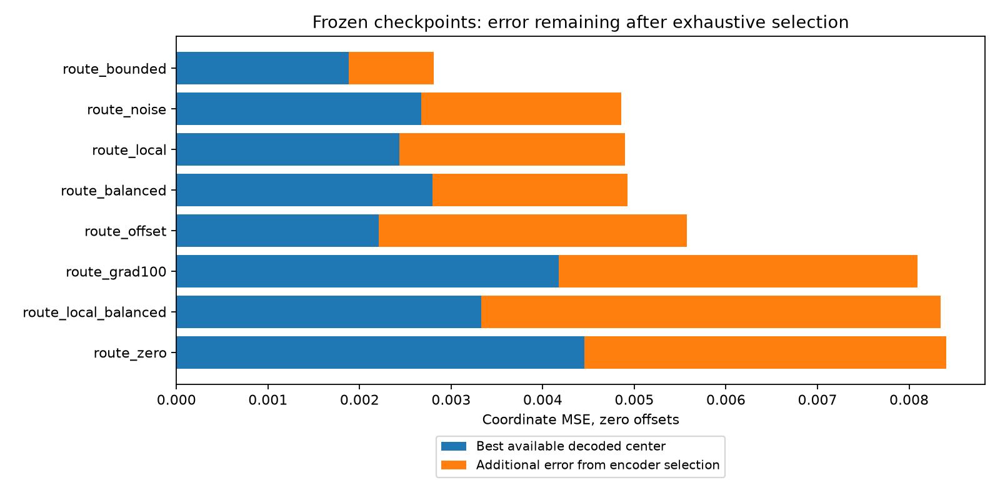

# Frozen-center reconstruction oracle

Same 100,000 held-out real examples for every final 6,000-update checkpoint. All offsets are zero; no model is trained or changed. Rank by oracle MSE, measuring the available decoded centers rather than generation quality.

```text
Encoder: E(X) -> k -> G(p[k])
Oracle:  try all k -> choose G(p[k]) closest to X
```

| Rank | Arm | Encoder MSE | Oracle MSE ↓ | Selection gap | Removable error % | ID agreement % |
|---|---|---:|---:|---:|---:|---:|
| 1 | route_bounded | 0.002808 | 0.001880 | 0.000928 | 33.05 | 48.21 |
| 2 | route_offset | 0.005574 | 0.002212 | 0.003362 | 60.32 | 28.64 |
| 3 | route_local | 0.004900 | 0.002433 | 0.002467 | 50.34 | 29.92 |
| 4 | route_noise | 0.004857 | 0.002672 | 0.002185 | 44.99 | 32.95 |
| 5 | route_balanced | 0.004929 | 0.002797 | 0.002131 | 43.24 | 35.59 |
| 6 | gan | — | 0.003098 | — | — | — |
| 7 | route_local_balanced | 0.008344 | 0.003327 | 0.005017 | 60.13 | 23.79 |
| 8 | route_grad100 | 0.008093 | 0.004176 | 0.003917 | 48.40 | 30.89 |
| 9 | route_zero | 0.008409 | 0.004451 | 0.003957 | 47.06 | 21.73 |

Selection gap = encoder center MSE − oracle center MSE. Removable error is this gap divided by encoder center MSE. Oracle MSE is an exhaustive minimum over the frozen decoder's 400 center outputs; it is not a lower bound for models with offsets or a different decoder.

The first 8,192 examples reproduce each saved zero-offset MSE and hard usage. Full raw metrics include per-example regret quantiles, selection counts, decoded centers, and checkpoint/source hashes. Checkpoint hashes are unchanged before/after the audit.

ID disagreement can involve nearly identical outputs; assess the error gap rather than disagreement alone. Oracle assignments do not impose uniform usage and depend on the observed X, so oracle reconstructions are not unconditional generated samples.

Nearest true grid-center reference MSE: 0.000902. This is a 100-center reference, not a lower bound for a 400-center quantizer.


