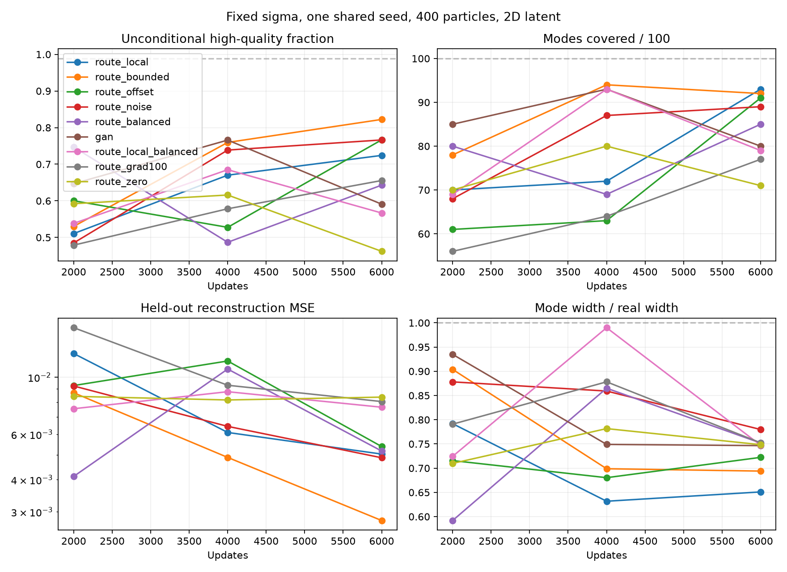

# Fixed-sigma particle routing on 100 Gaussians

This scout tests whether reconstruction through a selected MoG particle helps
generation, and whether predicting an offset helps beyond choosing a particle.
Sigma is a fixed buffer throughout every arm. No VAE KL term is used.

**Result:** local routing reaches 93 modes versus 92 for the original bounded
arm, taking first place under the coverage-first ranking. It loses on HQ
(72.41% versus 82.23%), reconstruction, width, balance, and SW1. Adding usage
balancing to local routing reduces coverage to 79 and effective hard particle
usage from 151 to 119, despite more uniform soft probabilities. Its SW1 of
0.1929 is the best of all arms, so there is no across-metric winner. Keep the
original bounded arm as the reference for HQ and reconstruction. All final
models generate overly narrow mode cores; neither tested surrogate makes
the usage-balancing loss achieve its hard-routing target.

**Frozen-checkpoint follow-up:** exhaustive selection among decoded particle
centers removes 33.1% of the bounded model's zero-offset reconstruction error,
50.3% for local routing, and 60.1% for local balancing. The original bounded
model also has the best available decoded centers. See the [oracle audit](ORACLE.md).

**Encoder fitting follow-up:** with that bounded decoder and prior frozen,
oracle-query supervision reduces zero-offset MSE by 25.42%, closing 76.94% of
the available selection gap. Matched reconstruction-only fine-tuning regresses,
with 6.247% wrong-grid reconstructions driving most of its error. Unconditional
generation stays unchanged. See the [two-arm fitting experiment](encoder-fit/README.md).

| Rank | Reconstruction path | Modes /100 | HQ % | Width /real | SW1 ↓ | Reconstruction MSE ↓ |
|---|---|---:|---:|---:|---:|---:|
| 1 | Bounded offset + local routing gradient | 93 | 72.41 | 0.651 | 0.4560 | 0.005028 |
| 2 | Chosen particle + bounded predicted offset | 92 | 82.23 | 0.694 | 0.3911 | 0.002775 |
| 3 | Chosen particle + unrestricted predicted offset | 91 | 76.66 | 0.722 | 0.4830 | 0.005378 |
| 4 | Chosen particle + random offset | 89 | 76.63 | 0.780 | 0.5109 | 0.004865 |
| 5 | Bounded offset + usage balancing | 85 | 64.29 | 0.752 | 0.4327 | 0.005167 |
| 6 | GAN control, no encoder | 80 | 59.09 | 0.747 | 0.2426 | — |
| 7 | Bounded offset + local routing + balancing | 79 | 56.68 | 0.747 | 0.1929 | 0.007645 |
| 8 | Chosen particle + predicted offset, 100× gradient | 77 | 65.55 | 0.752 | 0.4437 | 0.008043 |
| 9 | Chosen particle, zero offset | 71 | 46.21 | 0.748 | 0.3834 | 0.008368 |

Every row is the final 6,000-update model, evaluated on 100,000 unconditional
samples. Training took about 29 seconds for the control and 38–41 seconds per
routed arm on an RTX A6000 (41.15 seconds for local balancing); evaluations and setup are excluded.

## Interpretation and next experiments

1. **Routing works as an inference path.** Routed arms reconstruct the
   correct nearest grid mode for 100% of the 8,192 held-out examples, except
   local balancing, which misses one (99.988%). This is
   coarse classification success, not exact recovery of within-mode detail.
   The bounded model selects 347/400 particles, with entropy-effective usage
   about 225. Sampling remains uniform over all 400 particles.
2. **Offsets currently contribute little.** Zeroing the bounded model's offsets
   changes reconstruction MSE from 0.002775 to 0.002827 (about 1.9% higher).
   Replacing them with random generation noise gives 0.002864. Unrestricted
   offsets likewise improve MSE by only about 1.9% versus zero offsets. Offset
   RMS is 0.177/0.203 for bounded/unrestricted arms versus approximately 1 for
   Gaussian generation noise. Conditional offset mean RMS almost equals overall
   RMS, suggesting offsets mainly provide particle-specific biases rather than
   within-particle detail at this checkpoint. Tiny fixed sigma also attenuates
   gradients to the offset head; this does not demonstrate that offsets cannot help.
3. **Do not attribute the bounded arm's advantage to preventing huge offsets.** The unrestricted
   model has zero evaluated offset coordinates outside ±3. The smooth bounded
   parameterization changes optimization, but this run did not expose the feared
   unbounded-offset bypass. The nearest-query straight-through estimator is
   approximate, and the initialization includes a spatial query skip connection.
4. **Generation remains incomplete.** The original bounded arm misses 8 modes under the
   HQ coverage criterion, places 17.77% of samples outside the HQ radius, and
   has core width only 69.4% of the real reference. It improves HQ-mode balance
   TV from 0.360 to 0.263, but the GAN control's lower global SW1 prevents a claim
   of uniformly better distribution matching. The control reached 93 modes at
   4k before falling to 80 at 6k; training is not demonstrably converged.
5. **Fixed sigma does not fix relative neighborhood size.** All arms retain
   sigma=0.002356612589210272 exactly. In the bounded arm median nearest-particle
   spacing shrinks from 0.09426 initially to 0.009765, so sigma/spacing rises from
   0.025 to 0.241. Some particles cluster even though sigma never learns.

6. **Training with zero offsets is materially different from zeroing them at
   evaluation.** `E(X) -> k -> G(p[k])` gives 3.02× the bounded model's MSE,
   although it still reconstructs the correct nearest grid mode on every held-out
   example. Its MSE stays near 0.0082–0.0084 across the three evaluations;
   coverage reaches 80 at 4k then falls to 71. It selects 304 particles
   (entropy-effective usage 191), and 165/400 generative components produce no
   HQ samples. Adding Gaussian noise at evaluation barely changes its MSE
   (0.008368 to 0.008394), so immediate sensitivity to generation noise does not
   explain the whole gap. Its global SW1 is slightly better than bounded offsets
   (0.3834 versus 0.3911), again showing why one ranking cannot summarize everything.
   This single trajectory suggests an optimization effect; it does not prove
   offsets are necessary or identify the cause. Random offsets also outperform
   zero offsets here, without carrying example-specific detail.
7. **A stronger offset gradient is not sufficient in this setup.** The 100×
   control has 49.6% higher reconstruction MSE than ordinary unrestricted offsets,
   while its offset RMS is almost unchanged (0.210 versus 0.203). Zeroing its
   offsets increases MSE only 1.01%, to 0.008124; substituting Gaussian noise gives
   0.008164. Conditional offset mean RMS is 0.210148, nearly the overall 0.210158.
   The implied within-particle offset RMS is about 0.00210 (versus 0.00168 for
   ordinary offsets), computed as the square root of the difference of these
   squared RMS values. Offsets remain dominated by particle-specific means on
   this evaluation set; no strong detail channel has emerged. No coordinates
   exceed ±3. Global SW1 improves from 0.4830 to 0.4437 and width from 0.722 to
   0.752, but coverage, HQ, reconstruction, and balance TV worsen. This does not
   rule out optimization limits: Adam partly normalizes constant gradient scales,
   and the shared trunk couples routing to the offset gradient. See protocol.
8. **The tested balancing loss fails to balance hard routing.** On 100,000 held-out
   real examples, hard-usage TV rises from 0.4413 for bounded offsets to 0.5886
   with balancing (lower is better), while soft-usage TV falls from 0.1185 to
   0.1040. Used particles fall from 387 to 275; entropy-effective usage falls from
   227.7 to 156.2. These counts use a larger evaluation set than the leaderboard's
   8,192-example reconstruction set, so they should be compared within the
   [routing audit](ROUTING.md), not mixed with the leaderboard counts. Hard usage
   remains much less uniform than the soft surrogate suggests. Reconstruction
   MSE is 86.2% worse than bounded offsets, and unconditional balance TV also
   worsens (0.2631 to 0.3331). Width improves from 0.694 to 0.752 but remains too
   narrow. Offset RMS increases to 1.171, almost entirely explained by conditional
   means (RMS 1.17052); it does not establish a Gaussian detail channel. Zeroing
   offsets actually improves MSE slightly, from 0.005167 to 0.005026. The straight-
   through balancing gradient, finite-batch noise, shared encoder features, and
   single trajectory limit causal attribution; the result rejects this tested
   recipe, not particle balancing in general.
9. **Locality does not repair the balancing mechanism.** Compared with original
   bounded routing, the local arm gains one HQ-covered mode but loses 9.82
   percentage points of HQ and has 81.2% higher reconstruction MSE. On the 100k
   routing audit, its hard-usage TV worsens from 0.4413 to 0.6044 and effective
   usage falls from 227.7 to 150.7. The direct TV between hard and soft aggregate
   frequencies increases from 0.4082 to 0.5569. Although each query's surrogate
   covers only eight particles, those weights remain diffuse within that set;
   locality does not imply agreement with hard decisions.
   Adding balancing makes soft usage more uniform (TV 0.1860 to 0.1015) but hard
   usage less uniform (TV 0.6044 to 0.6872; effective count 150.7 to 119.3).
   Hard/soft TV grows further to 0.6740. Coverage falls from 93 to 79 and HQ from
   72.41% to 56.68%; reconstruction MSE rises 52.1%. Width improves from 0.651
   to 0.747, and global SW1 improves from 0.4560 to 0.1929, beating even the GAN
   control's 0.2426. This is a distributional tradeoff, not evidence that hard
   usage balancing succeeded. At 4k the balanced arm had 68.50% HQ and width
   0.990, then regressed by 6k; intermediate values do not select the final model.
10. **Local offsets still look like particle-specific corrections.** Local offset
    RMS is 0.40730 and conditional-mean RMS 0.40728. Zeroing offsets slightly
    improves MSE (0.005028 to 0.004951); replacing them with noise gives 0.004993.
    With local balancing these RMS values rise to 1.53567 and 1.53562. Zeroing
    offsets now increases MSE 7.8%, to 0.008241 (random offsets: 0.008284), but
    their variation is still dominated by conditional means. This does not show
    successful encoding of within-mode detail or matching to Gaussian noise.

11. **An exhaustive center oracle finds avoidable selection error.** The audit
    freezes all nine final checkpoints and evaluates the same 100k real examples.
    Both the encoder and oracle paths use zero offsets:
    `E(X) -> k -> G(p[k])` versus `argmin_k ||G(p[k])-X||^2` over all 400 centers.
    The bounded arm improves from MSE 0.002808 to 0.001880, a 33.05% reduction;
    local routing improves from 0.004900 to 0.002433 (50.34%); local balancing
    from 0.008344 to 0.003327 (60.13%). These 100k means differ slightly from
    the original 8,192-example metrics; the audit reproduces those smaller-set
    zero-offset errors and hard counts before reporting the full set.
    Bounded routing has both the lowest encoder center error and lowest oracle
    error. Its oracle error remains 2.08× the true-grid-center reference MSE
    0.000902, so improving selection alone cannot close that gap with these
    frozen centers. This reference uses 100 known grid centers and is not a
    theoretical lower bound for a learned 400-center model.
    Encoder/oracle ID agreement is only 48.21% for bounded routing, but its
    median error gap is just 0.000034 versus a 90th-percentile gap of 0.003144;
    many disagreements are inexpensive. Oracle choices also do not automatically
    balance usage: bounded effective usage falls from 227.7 to 217.7 and TV
    rises from 0.4413 to 0.4601. The audit identifies a zero-offset selection
    opportunity, not the cause of the gap or an unconditional generation gain.
    The trained encoder normally sees offsets, which can affect its preferred
    particle; the oracle is not a bound on reconstruction with learned offsets.

Recommended next mechanism comparisons, using the same seed:

- **Joint oracle supervision (first choice):** the completed frozen-encoder
  comparison closes 76.94% of the held-out selection gap using regression to
  oracle-selected particle positions. Test that supervision alongside the GAN
  and bounded-offset reconstruction objectives, against a matched continuation
  control. Choose its weight before running. Better inference does not by itself
  improve unconditional sampling; require generation metrics before promoting
  the new recipe. The targets will move once G and particles learn again.
- **Separate offset optimization:** if pursuing detail, isolate the offset branch
  from shared routing features and compare matched normal versus increased
  offset learning rates. This can distinguish Adam's gradient normalization
  and shared-trunk effects, but needs its own matched architecture control.
- **Training dynamics:** compare a prespecified longer budget for zero and
  bounded offsets together. Both coverage and HQ fluctuate, so the 6k result
  does not distinguish slow optimization from a persistent disadvantage.

This nine-arm result is not a statistical ranking across seeds, and no
seed-only experiments were performed. The final table uses the predetermined
budget rather than cherry-picking the best intermediate checkpoint.

```text
route_noise:   E(X) -> k       -> p[k] + sigma * fresh_noise -> G -> X_hat
route_offset:  E(X) -> (k, u)  -> p[k] + sigma * u           -> G -> X_hat
route_bounded:E(X) -> (k, u)  -> p[k] + sigma * 3*tanh(u/3) -> G -> X_hat
route_zero:    E(X) -> k       -> p[k]                      -> G -> X_hat
route_grad100: E(X) -> (k, u)  -> p[k] + sigma * u           -> G -> X_hat
              same forward as route_offset; 100x gradient into u
route_balanced: same forward as route_bounded; add aggregate hard-usage loss
route_local: same forward as route_bounded; use eight-neighbor routing gradient
route_local_balanced: same local gradient; add aggregate hard-usage loss

Every arm generates unconditionally with:
uniform k + fresh Gaussian noise -> p[k] + sigma * noise -> G -> new X
```

The `gan` control uses the same generator, discriminator, prior, initialization,
and unconditional GAN objective, with reconstruction disabled. This is a matched
scout control, not a reproduction of the published 28k-step MoG recipe.

## Protocol

- Data: freshly sampled 10×10 Gaussian grid, spacing 1, within-mode std 0.03.
- Prior: 400 standardized learned means in 2D; `sigma_rel=0.025`, calibrated once.
  A 2D latent avoids the 4D-to-2D invertibility issue discussed in the design note.
- Shared seed 24002; identical initialization verified by parameter hashes.
  Independent generators isolate data, unconditional prior, reconstruction noise,
  and evaluation. All arms receive the same data and prior random-number streams.
- G and D: existing 128-wide, three-hidden-layer toy networks; D uses two Fourier
  frequencies. E: two 128-wide hidden layers with a four-coordinate output.
- E predicts a 2D query and a separate 2D offset. Queries start at X divided by
  the known toy marginal standard deviation, plus a zero-initialized learned
  correction. No mode labels or component assignments supervise E.
- Choice: nearest particle to the query. The forward pass uses exactly one
  particle. A softmax of negative squared distances, temperature 0.25, supplies
  an approximate query gradient in the original arms. The two local arms use
  the rule below. Both surrogates detach particle means; actual
  reconstruction gradients reach selected means through the hard path and the
  prior's normal differentiable standardization.
- Loss: relativistic-paired logistic GAN + raw-particle spread regularizer,
  adding coordinate-averaged reconstruction MSE with weight 1 for routed arms.
  The two balanced arms add component-usage balancing, as described below.
  There is no continuous latent matching, commitment, or offset penalty.
  The bounded arm constrains each offset coordinate to (-3, 3); this is not a
  guarantee that its offset distribution matches Gaussian generation noise.
- Adam: G/E LR 0.0006, D LR 0.0009, particle LR 0.006. G/E/D beta1=0;
  particles beta1=0.5; beta2=0.999. L2 critic cap 1, coefficient 1, every four
  steps with lazy compensation. Batch size 256; 6,000 updates per arm; no EMA.
- Evaluate at 2k/4k on 20k samples and at 6k on 100k samples. Reconstruction
  uses 8,192 fresh examples. Final weights determine the final leaderboard;
  intermediate evaluations are not used to choose a checkpoint.
- Wall time in the table measures training and periodic logging, excluding
  evaluations and final checkpoint writing. Routed arms perform additional work.
- The zero-offset arm was added after the original four runs. Its only training
  source changes add the CLI arm and set its offset to zero; see the retained
  [source diff](route_zero_source.diff). Existing runs were not overwritten.
  The analyzer verifies every saved source hash, identical initialization and
  shared settings, complete budgets, and fixed sigma. Combining these reviewed
  source versions requires `--allow-source-differences`; original hashes remain
  in the exported configurations. The offset output remains in the architecture
  to preserve initialization, but receives no reconstruction gradient in this arm.
- The gradient control uses `u.detach() + 100*(u - u.detach())`: its forward
  value equals `u` exactly, while its backward derivative is 100. The multiplier
  was fixed before running; no scale sweep was performed. Sigma, learning rates,
  architecture, and direct gradients into the decoder, particles, and query
  output remain unchanged at identical parameters. The shared encoder trunk
  receives a different mixture of query and offset gradients. Adam normalizes
  gradients, so a 100× gradient is not a 100× parameter update; this experiment
  tests that altered mixture and optimizer behavior, not a pure learning-rate
  increase. The additive [source diff](route_grad100_source.diff) is retained.
- The balancing arm adds `0.01 * K * sum((q - 1/K)^2)`, K=400, where `q` is
  the current batch's hard particle frequency. Its derivative uses the mean
  soft probabilities at the unchanged temperature 0.25:
  `q = hard_counts/B + (mean_soft - stop_gradient(mean_soft))`.
  Thus the loss value detects hard collapse even when soft assignments look
  uniform. Means are detached in this routing surrogate, so balancing directly
  trains the query and shared encoder features; particles still learn through
  reconstruction and GAN gradients. Bounded offsets, sigma, and all other loss
  weights remain unchanged. There is no EMA of counts or per-example entropy
  penalty. With B=256<K, exact batch uniformity is impossible; independent uniform
  assignments have expected raw loss `(K-1)/B = 1.5586` from sampling noise alone.
  The hard forward expression's gradient is a biased surrogate. Weight 0.01 was
  chosen before training, with no weight sweep. See [source diff](route_balanced_source.diff).
- A separate checkpoint audit evaluates hard and soft particle frequencies on
  100k real examples per routed arm using the original evaluation seed. It
  reproduces the original 8,192-example used/effective counts before reporting
  the larger-set results. It changes neither checkpoints nor original metrics.
- The local pair uses eight nearest particles in the routing surrogate, with
  `temperature = stop_gradient(max(d8 - d1, 1e-6))` for sorted squared query
  distances. The fixed global temperature in the shared config is unused in
  these arms. Forward selection remains the global nearest particle, offsets
  remain bounded, and local balancing uses the same 0.01 loss weight. Support
  and bandwidth both change, so their effects are not separately identified.
  See the [prespecified protocol](local_protocol.md) and [source diff](route_local_source.diff).
  Both runs started after commit `40a55a7`; the older runs record base revision
  `47e504c`. The analyzer's explicit source-difference flag permits these reviewed
  revision differences while retaining all hashes and checking shared settings.

## Metrics and ranking

[Leaderboard](LEADERBOARD.md) · [full metrics](leaderboard.json) ·
[resolved configurations and hashes](configs.json)

[Hard/soft routing audit](ROUTING.md) · [routing counts and probabilities](routing_audit.json)

[Frozen-center oracle leaderboard](ORACLE.md) · [oracle metrics and checkpoint hashes](oracle_audit.json)

[Frozen encoder fitting experiment](encoder-fit/README.md) · [fitting leaderboard](encoder-fit/LEADERBOARD.md)



Sample/reconstruction/latent plots:
[bounded offset](route_bounded.png), [unrestricted offset](route_offset.png),
[random offset](route_noise.png), [zero offset](route_zero.png),
[100× offset gradient](route_grad100.png), [usage balancing](route_balanced.png),
[local routing](route_local.png), [local routing + balancing](route_local_balanced.png),
[GAN control](gan.png).

Rank is lexicographic: most modes covered, highest high-quality fraction, then
lowest sample sliced-Wasserstein-1. This privileges coverage and plausibility;
the full table also reports balance, width, and reconstruction tradeoffs.

- **Coverage:** number of modes receiving at least 10 generated samples within
  radius 0.09 of their center.
- **HQ:** fraction of all samples within that radius. A real 2D Gaussian has
  about 98.89% within radius 3σ; 100% HQ is not by itself the ideal distribution.
- **Width / real:** existing robust per-mode core-width metric divided by an
  independently drawn real reference. Around 1 is desirable; below 1 indicates
  narrow cores. It does not establish correct shape or isotropy by itself.
- **Balance TV:** total variation between uniform mode weights and observed
  weights among HQ samples; lower is better. Interpret alongside HQ.
- **Sample SW1:** sliced Wasserstein distance on 8,192 generated/real samples;
  lower is better. Provides a global distribution comparison.
- **Reconstruction MSE:** mean squared coordinate error on fresh real examples.
  Same-mode reconstruction fraction is also saved in JSON.
- **Particle usage:** count and entropy-effective count of encoder-selected
  particles on the reconstruction set. This measures encoder routing, not
  unconditional usage, which is uniform by construction.
- **Offset RMS:** Gaussian generation noise has expected coordinate RMS 1.
  Also save offset SW1 to Gaussian noise, conditional offset mean RMS, and
  reconstruction after zeroing or randomizing the predicted offset. These reveal
  when reconstruction depends on offsets absent from the generation distribution.
  Conditional means have finite-sample noise, especially for rarely used particles.

## Reproduce and follow logs

From the feature worktree, with the repository dependencies installed:

```bash
python -m pytest -q tests/test_mog_autoencoder.py tests/test_mog_oracle.py tests/test_mog.py tests/test_mog_api.py
mkdir -p runs/mog_autoencoder
python -u experiments/train_mog_autoencoder.py --steps 6000 \
  --out runs/mog_autoencoder/scout > runs/mog_autoencoder/scout.console.log 2>&1
tail -F runs/mog_autoencoder/scout.console.log
python experiments/analyze_mog_autoencoder.py runs/mog_autoencoder/scout
```

To append the zero-offset arm to an existing original four-arm scout:

```bash
python -u experiments/train_mog_autoencoder.py --arms route_zero --steps 6000 \
  --out runs/mog_autoencoder/scout > runs/mog_autoencoder/route_zero.console.log 2>&1
tail -F runs/mog_autoencoder/route_zero.console.log
python experiments/analyze_mog_autoencoder.py runs/mog_autoencoder/scout \
  --allow-source-differences
```

To append the gradient control:

```bash
python -u experiments/train_mog_autoencoder.py --arms route_grad100 --steps 6000 \
  --out runs/mog_autoencoder/scout > runs/mog_autoencoder/route_grad100.console.log 2>&1
tail -F runs/mog_autoencoder/route_grad100.console.log
python experiments/analyze_mog_autoencoder.py runs/mog_autoencoder/scout \
  --allow-source-differences
```

To append usage balancing and audit saved checkpoints:

```bash
python -u experiments/train_mog_autoencoder.py --arms route_balanced --steps 6000 \
  --out runs/mog_autoencoder/scout > runs/mog_autoencoder/route_balanced.console.log 2>&1
tail -F runs/mog_autoencoder/route_balanced.console.log
python experiments/analyze_mog_autoencoder.py runs/mog_autoencoder/scout \
  --allow-source-differences
python experiments/analyze_mog_routing.py runs/mog_autoencoder/scout
```

To append the local routing pair:

```bash
python -u experiments/train_mog_autoencoder.py --arms route_local route_local_balanced \
  --steps 6000 --out runs/mog_autoencoder/scout > runs/mog_autoencoder/route_local.console.log 2>&1
tail -F runs/mog_autoencoder/route_local.console.log
python experiments/analyze_mog_autoencoder.py runs/mog_autoencoder/scout \
  --allow-source-differences
python experiments/analyze_mog_routing.py runs/mog_autoencoder/scout
```

The default trainer now runs all nine arms, so a fresh run uses a single source
version and does not need that analyzer flag.

To audit exhaustive center selection without training:

```bash
python -u experiments/analyze_mog_oracle.py runs/mog_autoencoder/scout \
  > runs/mog_autoencoder/oracle_audit.log 2>&1
tail -F runs/mog_autoencoder/oracle_audit.log
```

The audit evaluates all saved final checkpoints, including the GAN control's
center-only oracle (it has no trained encoder). It decodes each center once,
computes coordinate MSE to every center in double precision in chunks, and
asserts the oracle never loses to the selected center. It records checkpoint
and source hashes, checks matching data/initialization/budget settings, and
verifies each checkpoint file is unchanged. It does not alter the generation
leaderboard. Known-answer tests cover global selection, coordinate averaging,
and distinct IDs with identical decoded outputs.

Use a new output directory for a rerun: the trainer refuses to overwrite existing
metric files. Each arm writes line-buffered `log.txt`, `history.jsonl`,
`metrics.json`, resolved config, a copy of its training source, `samples.png`, and
an optimizer/model/RNG checkpoint. The root leaderboard refreshes after each
evaluation; while runs are active, rows may have different step counts.

No seed sweep was performed. The 5-update smoke check validates execution only
and is excluded from the leaderboard. Tests verify hard forward routing, useful
gradient paths, offset bounds, and immutable sigma through an optimizer step.
The zero-offset contract additionally checks exact center reconstruction input,
zero offsets despite a nonzero offset-head bias, and retained routing/particle
gradients. The gradient-control test checks identical forward values, 100×
offset-output gradients, and unchanged direct query, particle, and decoder
gradients. Balancing tests check hard collapse despite uniform soft probabilities,
the direction of the balancing gradient, unchanged bounded forward values, and
the direct query-only gradient path. Local routing tests additionally verify
identical hard forward values, bounded offsets, routing and particle gradients,
eight-neighbor support, zero gradients to excluded distances, and finite
derivatives for tied distances. Including the two oracle tests, all 35 routing,
oracle, and MoG tests pass (`tests/test_mog_oracle.py` plus the files above).
The subsequent encoder-fitting experiment adds three tests, bringing the total
to 38 when `tests/test_mog_encoder_fit.py` is included.
