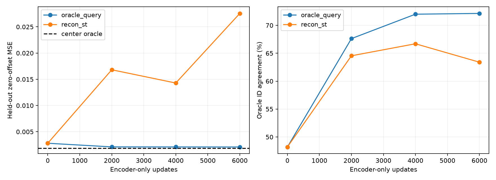

# Frozen encoder fitting leaderboard

Start: bounded scout checkpoint, zero-offset MSE 0.00280830; exhaustive center oracle 0.00188026. Same 100k held-out examples for every evaluation. Final weights only.

| Arm | Updates | Hard-choice MSE ↓ | MSE reduction % | Oracle gap closed % | Oracle ID agreement % | Effective particles | Train sec |
|---|---:|---:|---:|---:|---:|---:|---:|
| oracle_query | 6000 | 0.00209430 | 25.42 | 76.94 | 72.13 | 285.5 | 5.11 |
| recon_st | 6000 | 0.02755613 | -881.24 | -2666.70 | 63.40 | 133.7 | 7.64 |

Gap closed = (initial MSE − final MSE) / (initial MSE − oracle MSE); negative values mean regression. G, particle means, and sigma are unchanged, so unconditional generation is unchanged by construction.

