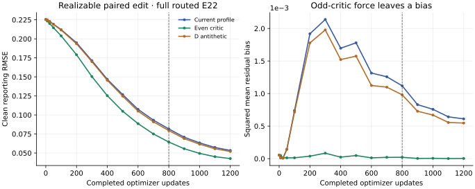

# Paired residual convergence diagnostic

This experiment isolates a possible cause of slow GAN-only conditional bridge
learning: a stale asymmetric critic can move an already correct generator.
It adds a small, reproducible diagnostic on ParticleGAN `develop`; it changes
no library default. The [protocol](protocol.json) freezes three profiles and
the external budget before training.

## The mechanism

The caller's paired game presents `z = sigma * epsilon` as real and
`z + prediction - target` as fake. Both paths share the same noise within each
half of an update. Generator references are detached. This retains the paired
error, even though the critic receives only a residual tensor.

For a scalar critic `D(x) = v*x - k*x*x`, let the residual be `r`. At `r = 0`,
the discriminator's paired adversarial loss is `log(2)` and its parameter
gradient is zero. The generator loss is also `log(2)`, but its residual
gradient averaged over `epsilon` and `-epsilon` is **`-v/2`**. The quadratic
noise terms cancel; the odd linear term remains. A flat critic is still needed
for equilibrium. This is a concrete lag mechanism, not a proof that the
adversarial formulation has the wrong optimum.

The analytic probe uses the public `GANLoss` and KA2 factories. For the
specified mean-pooled linear critic `D(x) = mean(x)` over `n` coordinates,
native coordinate-RMS R1 energy scales as `1/n²`. Its first-call KA2 penalty
at coefficient 3 is `1.5/n²`: `1.5` at one coordinate, `0.005859375` at 16,
and `0.000091552734375` at 128. This geometry law depends on mean pooling and
repeated-coordinate equivalence; it is not a general law for every CNN or
attention critic.

## The controlled training task

The target is a realizable affine edit of a frozen BF16 source transform.
An FP32 affine/FiLM adapter, encoder and cosine-routed 128-by-4 trainable
particle bank produce a 64-coordinate output. Fitting, structural guard and
reporting contexts are disjoint and held in memory. Target normalization uses
fitting data only. The critic has a learned odd channel-mean branch and a
zero-initialized, free-sign quadratic-energy branch.

All three profiles use the late integration settings: batch 16, learned output
noise initialized at 1.3, generator base LR 0.000204, applied G multiplier 0.5,
critic multiplier 1.5, table multiplier 10, and Adam betas `(0, 0.999)`. Public
deterministic orthogonal initialization, native KA2/DV12, routed row evidence,
birth/death, automatic backend selection and the settled reopening guard remain
active. The budget is external; the recipe retains `total_steps=None`.

| Profile | Single change from current |
| --- | --- |
| `current` | Antithetic G noise; one D Gaussian; odd plus quadratic critic |
| `even_critic` | Project the critic score and features onto the even branch |
| `d_antithetic` | Average D's adversarial loss over the same Gaussian and its negative |

The D-antithetic profile retains one primary pair observation, one unchanged
KA2 call on that pair, one D backward and one D optimizer step. It consumes no
extra Gaussian draw. Its first energy-head gradient removes the cross-noise
term, testing critic-learning variance independently of the G sampler. Changed
gradients can change private policy streams; only caller draws are matched.

Clean ordinary network forwards report normalized RMSE, residual bias, routing
statistics and actual role updates. Stock-selected served and live outputs
remain separate. RMSE/MSE is never a training objective or row acceptance
criterion. Analytic checks, software conformance and trained convergence are
separate evidence.

## Reproduce

From the repository root, using the project's existing Python environment:

```sh
PYTHONPATH=. python -m pytest -q \
  tests/test_paired_residual_oracle.py tests/test_e22_paired_residual_toy.py
PYTHONPATH=. python -m experiments.paired_residual_oracle \
  --out artifacts/paired-residual-toy/oracle.json
PYTHONPATH=. python -u examples/e22_paired_residual_toy.py --steps 1200 \
  --output artifacts/paired-residual-toy/convergence > /tmp/paired-residual-toy.log 2>&1
tail -F /tmp/paired-residual-toy.log
```

Use a fresh output directory for each invocation. The three-profile campaign
has a 300-second wall budget and a five-second update watchdog. Nonfinite
state, stalls or exhausted budgets stop execution with a failure receipt.
Per-update logs and checkpoints stay in ignored artifact storage.

## Measured comparison

All three 1,200-update CPU runs completed in **46.47 seconds** total on
Python 3.11.15 / PyTorch 2.11.0. Their initialized tensors and every caller
draw matched. All retained native generator/encoder/table rates matched, all
outputs were served from the fast model, and no structural move was accepted.
The [compact measurements](measurements.json) bind the exact source, resolved
recipe, raw artifacts and measured curves; the [oracle receipt](oracle.json)
records the separate component checks.

| Profile | Reporting RMSE at 100 | At 500 | At 1,200 | First recorded half-error point |
| --- | ---: | ---: | ---: | ---: |
| Current | 0.212038 | 0.126762 | 0.053377 | 600 |
| Even critic | 0.203943 | 0.104913 | **0.042724** | **500** |
| D antithetic | 0.211531 | 0.124789 | 0.052040 | 600 |

All start at reporting RMSE **0.225451**. The half-error marker uses recorded
100-update evaluations, rather than an interpolated threshold-crossing time.



Removing the odd branch lowers final reporting RMSE by **19.96%**, and lowers
error at every recorded nonzero reporting and protected-guard checkpoint.
About **59.4% of the reporting MSE reduction comes from reduced mean bias**;
the rest comes from centered error. Current's final bias is approximately
`[+0.02420, -0.02523]`, versus `[-0.00204, -0.00123]` with an even critic.
Current's bias aligns with its learned odd-score coefficients (cosine 0.99984).
Together with the exact zero-residual force calculation, this supports the
critic-lag mechanism in this reduced model. It is stronger evidence than a
learning-rate comparison alone.

D-antithetic sampling improves final reporting RMSE by **2.51%**. The oracle
proves cancellation of the initial energy-head cross-noise term; this small
trained advantage does not establish that D estimation variance dominates the
remaining error.

This toy **does not reproduce the large-run generator-controller delay**.
Every profile records 25 generator `drift` decisions, with `s=1`, `b=1` and
actual/base G ratio 0.5 during training. The three runs keep improving after
the native KA2 blend starts at update 800. The dashed plot lines mark that
transition. Learned energy weights are negative by the first sampled update
10 in all three runs; learned noise stays physically clamped at 1.3.

**Next investigation:** measure the symmetric and asymmetric input-gradient
components of the actual saved image critic, then compare a tiny frozen-checkpoint
GAN step through an even-score wrapper. This tests transfer of the measured
mechanism before another full dataset campaign. Keep real decoded validation
as the separate acceptance criterion; the real trainer's convergence target
has not been beaten by this toy.

Validation: **25 CPU tests passed**, including public loss identities, actual
KA2 dimension scaling, native hook/call counts, common public initialization,
fit/guard/report isolation, exact checkpoint replay across the penalty transition,
reporting purity, and honest setup/final-save failure receipts.

## Limits

This is a reduced linear/quadratic critic, not the bridge's spatial/attention
critic. It has 64 output coordinates, versus 65,536 in the bridge. The affine
skip can solve the task, so bank participation does not establish a routing or
particle advantage. The profile represents the late beta1=0 branch, not the
early beta1=0.9 branch. No result here establishes decoded Nova-to-Qwen image
quality, Forge qualification, or a new production default.
