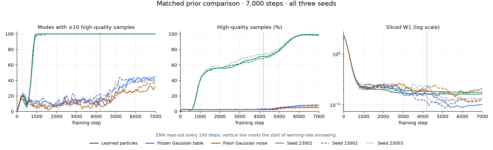

# Matched prior comparison: 100 Gaussians

All three particle runs reached 100 high-quality modes after 7,000 steps, with
mean HQ **98.61%**. Frozen and fresh Gaussian controls produced much broader
samples under this same recipe. This supports better concentration near target
modes and high-quality coverage in this experiment; it does not establish full
Gaussian calibration or a guarantee against collapse.

Particle core width averaged 0.857 times the target, but mean within-mode
covariance eigenvalue ratios were **2.09 / 42.37**, and **0.838%** of samples
were more than 10σ from their nearest center. Those unequal, inflated second
moments remain a substantial shape error. The finite particle table also
produced only about **19,869 distinct outputs** among 100,000 draws.

## Final results

Every run is included. “Modes” counts centers receiving at least ten samples
within 3σ; “recall” counts sufficiently populated nearest-center regions without
a distance cutoff. The Gaussian controls often have recall 1.0 despite low HQ,
so their broad output should not all be described as mode collapse.

| Prior | Seed | Modes | HQ (%) | Recall | Core | Cov min / max | Tail (%) | W1 | W2 | Unique |
|---|---:|---:|---:|---:|---:|---:|---:|---:|---:|---:|
| Particles | 23001 | 100 | 98.85 | 0.99 | 0.883 | 0.71 / 33.10 | 0.619 | 0.259 | 0.536 | 19,874 |
| Particles | 23002 | 100 | 98.04 | 1.00 | 0.868 | 1.46 / 54.32 | 1.184 | 0.328 | 0.612 | 19,860 |
| Particles | 23003 | 100 | 98.94 | 0.99 | 0.818 | 4.08 / 39.70 | 0.710 | 0.369 | 0.658 | 19,873 |
| Frozen Gaussian | 23001 | 45 | 8.48 | 1.00 | 9.689 | 58.75 / 91.56 | 58.088 | 0.371 | 0.443 | 19,874 |
| Frozen Gaussian | 23002 | 45 | 8.14 | 1.00 | 9.759 | 59.10 / 90.94 | 57.874 | 0.375 | 0.447 | 19,860 |
| Frozen Gaussian | 23003 | 41 | 7.58 | 1.00 | 9.796 | 60.38 / 91.98 | 59.011 | 0.379 | 0.446 | 19,873 |
| Fresh Gaussian | 23001 | 26 | 4.82 | 0.90 | 10.254 | 71.58 / 103.98 | 64.387 | 0.543 | 0.636 | 100,000 |
| Fresh Gaussian | 23002 | 34 | 5.95 | 1.00 | 10.192 | 66.60 / 92.91 | 62.140 | 0.414 | 0.479 | 100,000 |
| Fresh Gaussian | 23003 | 37 | 8.53 | 1.00 | 9.963 | 64.61 / 90.97 | 59.657 | 0.361 | 0.423 | 100,000 |

Means ± **sample standard deviations** across three seeds (`ddof=1`):

| Metric | Particles | Frozen Gaussian | Fresh Gaussian |
|---|---:|---:|---:|
| Modes | 100.0 ± 0.0 | 43.7 ± 2.3 | 32.3 ± 5.7 |
| HQ (%) | 98.61 ± 0.50 | 8.07 ± 0.45 | 6.44 ± 1.90 |
| Recall | 0.993 ± 0.006 | 1.000 ± 0.000 | 0.967 ± 0.058 |
| Core ratio | 0.857 ± 0.034 | 9.748 ± 0.054 | 10.136 ± 0.153 |
| Covariance min ratio | 2.09 ± 1.77 | 59.41 ± 0.86 | 67.60 ± 3.59 |
| Covariance max ratio | 42.37 ± 10.86 | 91.49 ± 0.53 | 95.95 ± 7.02 |
| Tail (%) | 0.838 ± 0.303 | 58.324 ± 0.604 | 62.061 ± 2.366 |
| Unique outputs | 19869.0 ± 7.8 | 19869.0 ± 7.8 | 100000.0 ± 0.0 |
| Exact W1 | 0.319 ± 0.056 | 0.375 ± 0.004 | 0.439 ± 0.094 |
| Exact W2 | 0.602 ± 0.062 | 0.445 ± 0.002 | 0.513 ± 0.110 |
| Sliced W1 | 0.157 ± 0.020 | 0.105 ± 0.008 | 0.132 ± 0.044 |

Transport metrics do not uniformly favor particles: frozen Gaussian has lower
mean W2 and sliced W1, while particles have lower mean exact W1. Coverage, tails,
shape, and transport need to be read together. Three seeds provide descriptive
replication, not significance or equivalence evidence. This recipe came from
particle experiments; the Gaussian controls were not separately tuned. The
learned table adds 80,000 trainable scalars, so total capacity is not matched.

## Training curves

Each color is a prior and each line style a seed. Coverage and HQ use 20,000
samples per checkpoint; periodic sliced W1 uses 4,096 samples and 128 projections.
Final sliced W1 in the table uses 100,000 samples and 512 projections, so it is
not the final plotted value.

## Protocol and provenance

The runs used clean source revision
[`f8b59bb647976b421afccdcb64fa2da583ddf992`](https://github.com/255BITS/ParticleGAN/commit/f8b59bb647976b421afccdcb64fa2da583ddf992),
paired seeds 23001–23003, and GPU 0, an NVIDIA RTX A6000, with three runs
concurrent. All nine processes exited successfully. Runtime: Python 3.12.13,
PyTorch 2.14.0 (CUDA build 13.0), NumPy 2.5.2, Matplotlib 3.11.1, PyYAML 6.0.3,
and POT 0.9.7.post1. This is a new comparison, separate from the historical GIFs
and regularizer-study results.

All arms share a 10×10 grid mixture with σ=0.03, three hidden layers of width
128 in G and D, four latent dimensions, Fourier-2 D, batch size 256, Rp logistic
loss, and the sample-point `b_cap` penalty (coefficient 1, κ=1, L2 norm). Adam
uses β=(0, 0.999), generator LR 6e-4, and discriminator LR ×1.5. LR remains full
for 60% of the run, then follows a cosine to a 5% floor; G uses EMA 0.995.
Particles use a 20,000-row learned table, prior LR ×10, VICReg weight 1, and
EMA of the table. Frozen Gaussian uses the same initial finite table without
learning; fresh Gaussian draws new N(0,I) latents. Both controls omit prior
optimization and VICReg. Training data, latent draws, and penalty draws use
separate RNG streams; real evaluation samples are also independent of latent
sampling, with the same real draws across paired priors. Spectral analysis was
disabled for this comparison.

## Metric definitions and artifacts

- **Modes / HQ:** on a separate 20,000-sample EMA draw, assign the nearest
  grid center. HQ means Euclidean distance ≤3σ=0.09; modes require ≥10 HQ
  samples per center. The target is 100 modes.
- **Recall:** fraction of centers assigned ≥500 of the 100,000 final samples
  (half the expected count under uniform mode mass), regardless of distance.
- **Core / covariance:** use the 100,000 final samples, grouped by nearest
  center, keeping modes with ≥50 samples. Core is the mean per-mode median
  radius around its coordinate-wise median, divided by σ√(2 ln 2). Cov min/max
  are the mean smallest/largest population covariance eigenvalues divided by
  σ². All 100 modes qualified in every run. Core is robust to tails; covariance
  is tail-sensitive. Neither alone establishes Gaussian shape.
- **Tail / unique:** percentage farther than 10σ=0.3 from the nearest center;
  number of exactly distinct output rows in the 100,000-sample final array.
- **W1 / W2:** exact empirical transport solutions on 4,096-point subsamples
  of the final real and fake clouds, using Euclidean / squared-Euclidean costs
  (square root for W2). They are not exact population distances.

[data.json](data.json) contains portable configs, provenance, execution status,
all final metrics, aggregates, and all checkpoint metric rows; no checkpoints,
raw sample arrays, or machine-specific paths are included. Initial undefined
losses are stored as JSON `null`. Original config hashes are retained as source
identifiers. Rebuild the figure with `python reports/prior-comparison/plot.py`.
Reproduce the training protocol using [the comparison entrypoint](../../experiments/compare_priors.py)
and [prior-control instructions](../../docs/prior-controls.md); exact source and
dependency versions above identify these reported runs.
