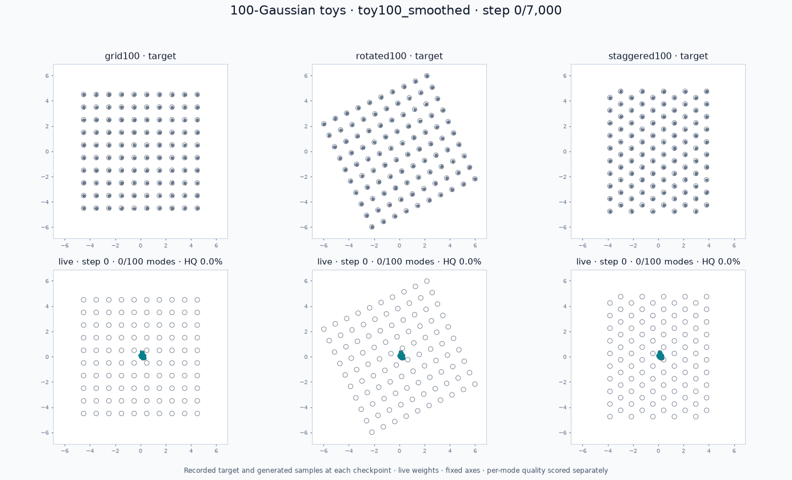
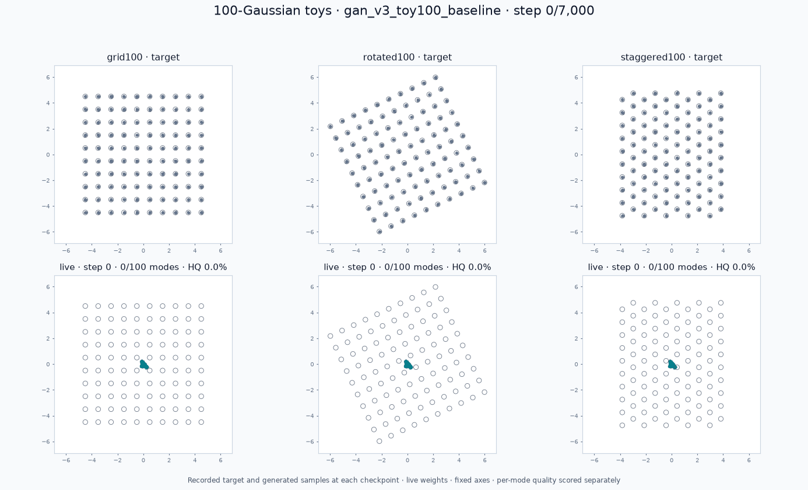

# 100-mode convergence: failures and shared-recipe search

The current [winning shared recipe](simpler22/README.md) passes **22/22** in a fresh production-runner replay and independent regrades. Compared with the previous 22/22 winner, it uses a unit discriminator cap and coefficient and removes the particle penalty. All three native problems first cover 100 modes at update 750 and pass all terminal accuracy checks plus independent 100k holdouts. The detailed report includes the exact settings, [new convergence GIF](simpler22/toy100/toy100-progress.gif), and [per-case combined gate](simpler22/compatibility.md). The [constraint-removal audit](constraint-removal.md) records successful simplifications and failed alternatives; constant-rate continuous learning remains unresolved. The [hosted workflow](https://github.com/255BITS/ParticleGAN/actions/workflows/toy100.yml) runs the same full gate on pull-request updates. The [previous winner](shared22/README.md) and its separate **19/19** installed-wheel control remain historical evidence.

The [fine κ search](shared-kappa-fine-v1.md), [failed 64-candidate search](shared-halton64-v1.md), [optimizer/formulation comparisons](optimizer-formulation-research.md), and [screening-cost audit](fail-fast-stage-order.md) retain both successes and failures. Follow the [combined gate commands](../../docs/toy100.md#one-shared-recipe-across-all-22-toys) to run all 22 together or one problem.

**Scope of the historical result below:** the original coverage gate passes
3/3, but the stricter distribution-fidelity audit records **0/3 passes**,
and this recipe does not pass all 19 older toys. It is not a common-22
recommendation. See the [accuracy audit](accuracy-diagnostics.md),
[new search ledger](accuracy-search-ledger.md), and
[combined gate commands](../../docs/toy100.md#one-shared-recipe-across-all-22-toys).

The selected CPU configuration passes **all three 100-Gaussian problems** with
live weights at five consecutive checks from updates 6,000 through 7,000.
The original public recipe fails all three under the same frozen criteria.
This branch started from `develop` at `3d08a3a`; the failure evidence was
published in PR #60 before the configuration searches began.



| Problem | Baseline modes / HQ | Selected modes / HQ | Mass TV | First 100 modes | Full quality from | Confirmed / CPU elapsed |
| --- | ---: | ---: | ---: | ---: | ---: | ---: |
| Square grid | 63 / 57.18% | **100 / 98.12%** | 0.08345 | 5,750 | 6,000 | 7,000 / 98.8s |
| Rotated grid | 94 / 83.63% | **100 / 98.92%** | 0.05455 | 5,250 | 6,000 | 7,000 / 99.9s |
| Staggered grid | 88 / 72.38% | **100 / 98.26%** | 0.07500 | 5,500 | 6,000 | 7,000 / 176.1s |

[Selected numerical leaderboard](recommended/leaderboard.md) ·
[Machine-readable gate](recommended/gate.json) ·
[Declared config](../../configs/toy100/recommended.json) ·
[Protocol and commands](../../docs/toy100.md).

The full fresh CPU training suite took 374.8 seconds, including evaluation,
plus GIF rendering. The archived environment is Python 3.12.13,
PyTorch 2.13.0+cu126 running on CPU, one thread, fixed seed 1234.
Baseline measurements used an RTX A6000, so their times are not a speed
comparison. No seed searches were performed.

## Run the gate or one problem

From a checkout with `pip install -e '.[experiments,dev]'`:

```bash
python -u -m benchmarks.toy100 run --output artifacts/toy100/gate
python -u -m benchmarks.toy100 run --problem grid100 --output artifacts/toy100/grid
python experiments/leaderboard.py --toy100-output reports/toy100/recommended
```

Each training invocation needs a new output directory. It writes raw metrics,
tail-friendly logs, configuration/source provenance, snapshots from step zero,
full final evaluation samples, a numerical leaderboard, and recorded-sample
GIFs. The aggregate command exits 0 only when every requested problem passes.
GitHub Actions also trains the entire suite and uploads its evidence.

## What fixed it

The selected toy config uses the public `GANTrainer` with an MLP generator and
discriminator. It adds fresh isotropic Gaussian generator output noise
(σ=0.026) during training and sampling, and discriminator input noise
(σ=0.5 decreasing linearly to zero by update 3,500). Output noise supplies
within-mode spread; discriminator smoothing lets training resolve the coarse
distribution before the narrow components. Training only receives unlabelled
real samples, without target centers or mode identities.

The base batch size is 512. That configuration passed square and rotated on
both CPU and GPU but left staggered with one underweight mode. An explicit
`problem_overrides.staggered100.batch_size = 1024` repaired the CPU staggered
run. The final recommendation is this declared CPU manifest, not a claim that
the shared batch-512 config or every device passes. Public `get_recipe("gan")`
defaults remain unchanged.

Learning-rate, annealing, prior regularization, Fourier-feature, width, and
depth searches are preserved in the [complete numerical ledger](search/README.md).
Some runs reached 100 modes but failed balance, spread, or the sustained
terminal checks. A direct affine-particle probe reached grid coverage at 750
updates and passed its 4,000-update grid gate; it failed the other geometries,
so it was not selected as the suite default. Increasing the noise or prior
regularization also failed to repair staggered. See the
[instance-noise comparison](instance-noise.md),
[schedule and batch search](search-schedule.md),
[recipe search](search-recipe.md),
[architecture search](search-architecture.md), and
[output-noise allocation probes](noisy-mlp-allocation.md).

## Original failures are retained



[Original leaderboard](baseline/leaderboard.md) ·
[Original gate](baseline/gate.json).

```bash
python -u -m benchmarks.toy100 run \
  --config configs/toy100/baseline.json --device cuda:0 \
  --output artifacts/toy100/baseline
# Expected exit status: 1 (0/3 problems pass).
```

A mode requires at least 100 in-radius samples out of 20,000 generated draws.
Quality also requires ≥97% within 3σ, balanced mass, and noncollapsed per-mode
spread at five consecutive terminal checkpoints. This is stricter than the
older README visualization's 10-hit mode count. The new sampler uses one
mode-index draw rather than two coordinate-index draws, so the baseline is
not a bitwise replay of that older README run.

The problem geometry and metric source hashes match between the original
failures and selected successes: no threshold or geometry changed during
search. Every production evaluation and final sample cloud matched its prior
CPU search run exactly. The gate independently rescores the saved final
20,000-point live cloud and verifies the manifest against executed configs.
Both GIFs show 4,096 recorded samples at actual steps, including untouched
initialization, with fixed axes. Complete traces determine the verdict.
These are fixed-seed regression results and numerical shape checks, not a
proof of Gaussian components or robustness across seeds and platforms.
