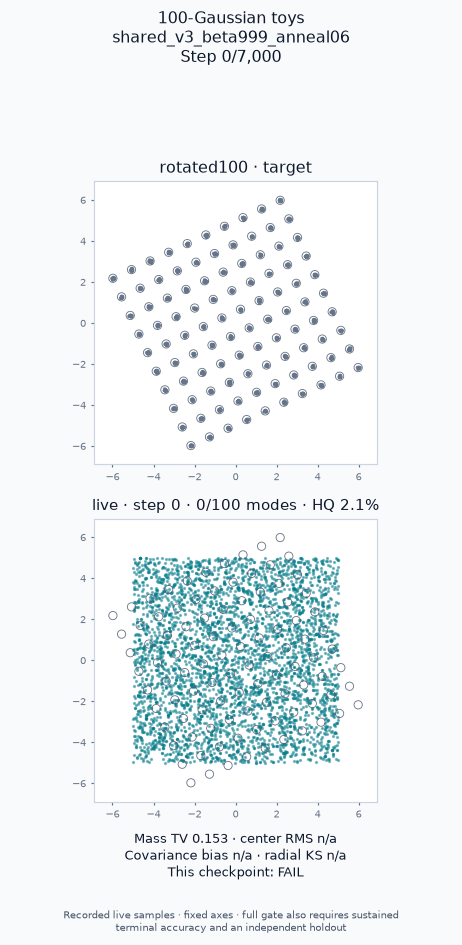

# Early full coverage followed by collapse

This retained failure uses a trainable affine generator and a generic uniform-square particle prior. It receives only unlabelled target samples. The global recipe uses LR 0.00425, Adam β₂=0.999, cosine annealing after 60%, output noise 0.029 warmed over 20%, and discriminator input noise 0.5 ending at 10%.

The rotated problem reaches all 100 modes at update 750 (HQ 87.92%, mass TV 0.0491), then collapses. At update 7,000 only 5/100 modes pass the occupancy floor, with HQ 8.74%. This is a failure under both the original coverage gate and the stricter accuracy gate. Early full coverage was never a full quality PASS.



The exact trainer probe, declared configuration, source hashes, full event curve, every saved visualization frame, five final 20,000-sample clouds, and independent 100,000-sample holdout are retained here. Regrade from the repository root:

```bash
python -m benchmarks.toy100 accuracy --problem rotated100 --output reports/toy100/accuracy-failure
# Expected exit status: 1 (FAIL).
```
