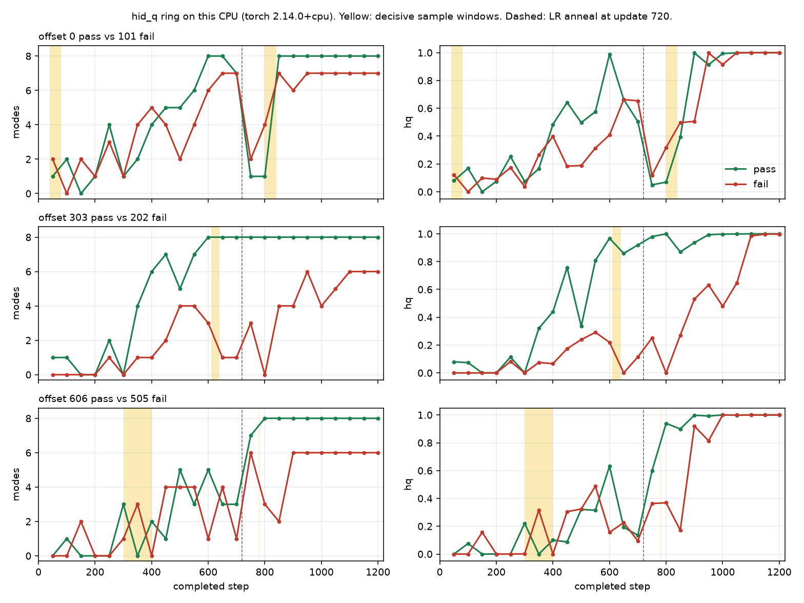

# hid_q ring: when the samples decide pass or fail

Diagnosis only. Recipe, coefficients, learning rates, and clips are unchanged.
Tooling is `benchmarks/toy100/diag_splice.py` and `benchmarks/toy100/splice_hook.py`.
This write-up is the result of the splice campaign on this machine.

**The outcome is not one shared step, and it is not monotone in the switch index.**
A binary search on `k` would have reported a false threshold. Neighboring switches
flip opposite ways, and a full sample bundle inside a window can pass while one
stream from that same window fails.

What the samples decide, on this CPU:

| pair (pass / fail) | decisive window | stream | what it does |
| --- | --- | --- | --- |
| 0 / 101 | updates `[40, 80)` | critic particle index (`prior_d`, and both prior indices together) | ends at **1 mode** |
| 0 / 101 | updates `[800, 840)` | all training streams together; inside the wider `[800, 880)`, data alone and prior alone each suffice | ends at **7 modes** (mode dropped). `[800, 860)` of the same fail samples **passes** |
| 606 / 505 | updates `[300, 400)`, and mode indices on `[200, 400)` | data batches, especially the categorical mode index | `[300, 400)` ends at **0 modes**; indices alone end at **1 mode** |
| 303 / 202 | no short window | a fail **prefix** that locks, then unlocks, across updates 610–640 | still rescuable at 600 and at 630; locked at 610, 620, and from 640 |

Two mechanisms show up. Some windows drop a mode for good. Others only miss the
5-check hold (final snapshot is already 8 modes and hq ≥ 0.9, suffix 4). Both
fail the ring gate. Input-noise draws and evaluation draws did not decide any
tested case.

## Machine and protocol

Linux, 4 cores, torch **2.14.0+cpu**. One thread each for OMP, MKL, and
OpenBLAS; `PYTHONHASHSEED=0`. Command, via the splice driver:

```sh
python3 -u -m benchmarks.toy100.diag_splice record --seed-offset 0 --output /tmp/k3p-splice/rec/s0
python3 -u -m benchmarks.toy100.det_init_screen --gate ring --init hid_q --seed-offset 101 --output /tmp/k3p-splice/screen/s101
```

The gate is the unchanged K3P legacy ring probe: 1200 updates, batch 128,
`mode_hold`, relativistic-paired logistic GAN, learned particle prior, A2
latent damping, EMA-critic pull. Pass requires live modes ≥ 8, hq ≥ 0.9, and
a suffix of at least 5 consecutive passing observations. Observations are every
50 completed steps (50, 100, …, 1200). A final 8/8 with suffix 4 is a fail.

`--init hid_q` overwrites the parameters after the init draws, so the init is
bit-identical across offsets. The offset (`benchmarks/toy100/det_init_seedshim.py`)
shifts every `torch.manual_seed` and `Generator.manual_seed`. Offset 0 is not
routed through the shim. The seed therefore changes data batches, particle-index
draws, and noise, and nothing else.

Splice indices are the 0-based loop index in `train_mode_hold` (`for step in
range(1200)`). The gate label `t` is taken at the end of update `t - 1`
(`checkpoint(step + 1)`). A window `[800, 840)` is the 40 updates that the gate
records as steps 801–840. Cosine LR annealing starts at loop index 720
(`lr_anneal_start` 0.6 of 1200), the update the gate records as step 721.
Critic input noise (std 0.5) reaches 0 at 0.1 of the budget, so it is off after
update index 119.

There is no separate latent Gaussian. `ParticlePrior.sample` at sigma 0 returns
an integer index into the 12-particle table. "Noise" below means critic input
noise and generator output noise.

An earlier A6000 run (the attached seeds note, torch 2.13) passed only offsets
0 and 404. CPU paths differ. The table below is this machine only.

## Pass / fail on this machine

Offset 0 was repeated (`s0b`). Randomness sha256
`d842e67b3e9335dcc6e4b2faa1d1bc86b09967e3b587a15be945c49d057e2005` matches.
All 24 observation rows match on modes, hq, counts, and missing modes.
All 88 checkpoint tensors match, including the CPU RNG state. The only
differing field is the wall-clock `started` scalar, which is why the file
sha256 differs. Init parameter hashes match across the two runs.

| offset | status | modes | hq | suffix | stable from | first pass | missing at 1200 |
| ---: | --- | ---: | ---: | ---: | ---: | ---: | --- |
| 0 | PASS | 8 | 0.999755859375 | 7 | 900 | 600 | — |
| 101 | FAIL | 7 | 1.0 | 0 | — | — | 5 |
| 202 | FAIL | 6 | 0.997802734375 | 0 | — | — | 3, 5 |
| 303 | PASS | 8 | 1.0 | 7 | 900 | 600 | — |
| 404 | PASS | 8 | 1.0 | 5 | 1000 | 450 | — |
| 505 | FAIL | 6 | 1.0 | 0 | — | — | 1, 3 |
| 606 | PASS | 8 | 1.0 | 7 | 900 | 800 | — |
| 707 | PASS | 8 | 0.9990234375 | 9 | 800 | 450 | — |

5 pass (0, 303, 404, 606, 707), 3 fail (101, 202, 505). Pairs used below are
0/101, 303/202, and 606/505. Recorded tapes match these live metrics, including
the randomness sha. Replaying the offset-0 tape onto itself matches live
modes 8, hq 0.999755859375, suffix 7, stable from 900. The replay randomness
sha differs, because data and prior draws are substituted rather than executed
under `RandomAudit`. Endpoint controls: switch 0 reproduces the fail tape;
switch 1200 reproduces the pass tape. 179 splice jobs, zero `ERROR`.

Full every-50 curves: [`gate-curves.csv`](gate-curves.csv). Every-10 curves for
offsets 0 and 101: [`dense-0-101.csv`](dense-0-101.csv). Every splice row:
[`splice-ledger.csv`](splice-ledger.csv).



Yellow bands are the decisive windows named above (update indices; within one
step of the gate label). The dashed line is update 720, where the cosine LR
anneal starts. Offset 0 falls to 1 mode at steps 750 and 800 and is back to 8
modes at 850 (hq 0.39) and holding from 900 (hq 0.998). Offset 101 comes out of
the same collapse at 7 modes and never occupies mode 5 again (final hq counts
`[346, 706, 689, 321, 681, 0, 690, 663]`). Offset 303 never loses 8 modes after
step 600. Offset 606 first reaches 8 modes at step 800.

## How a splice is read

Tape A is the pass seed, tape B the fail seed, unless the name starts with `r`
(fail prefix, then the pass suffix). `--switch K` uses A on updates `[0, K)` and
B after that. `--window a:b` uses B only on `[a, b)`. `--streams` limits which
draws move.

| group | draws |
| --- | --- |
| `data` | two `sample_ring` calls per update (critic real, generator real): mode index and Gaussian jitter |
| `prior` | particle-table index for the critic (`prior_d`), then the generator (`prior_g`) |
| `output` / `input` | generator output noise / critic input noise |
| `noise` | output and input together |
| `eval` | evaluation prior indices and evaluation output noise |
| `train` | data, prior, output, input (no eval) |
| `all` | every stream |

## Pair 0 / 101

Offset 0 passes. Offset 101 finishes at 7 modes, missing mode 5, hq 1.0.

### Early lock, while both curves are still near zero modes

At completed steps 40–120 both seeds sit at 0–2 modes. The curves have not
split yet. The draws in that stretch already decide the ending.

Reverse splice (fail samples on `[0, K)`, pass samples after):

| K | status | modes | hq | suffix |
| ---: | --- | ---: | ---: | ---: |
| 60 | PASS | 8 | 0.9995 | 9 |
| 70 | FAIL | 7 | 0.9988 | 0 |
| 80 | PASS | 8 | 1.0 | 7 |
| 90 | PASS | 8 | 0.9971 | 9 |
| 100 | FAIL | 7 | 1.0 | 0 |
| 150 | FAIL | 8 | 0.9995 | 3 |

Updates 70 and 100 of the fail seed each lock a hole that the entire remaining
pass stream cannot fill. The neighbors do not lock. K=150 still reaches 8 modes
and misses the hold by two checks.

Window splices into an otherwise pass run:

| window | streams | status | modes | hq | suffix |
| --- | --- | --- | ---: | ---: | ---: |
| `[40, 80)` | prior (both indices) | FAIL | 1 | 0.0828 | 0 |
| `[0, 40)`, `[0, 60)`, `[60, 120)`, `[80, 120)` | prior | PASS | 8 | ≥ 0.999 | 7–10 |
| `[0, 120)` | `prior_d` only | FAIL | 6 | 0.9988 | 0 |
| `[0, 120)` | `prior_g` only | PASS | 8 | 0.9990 | 7 |
| `[0, 120)` | all streams together | PASS | 8 | 0.9998 | 6 |
| `[0, 120)` | output noise | FAIL | 8 | 0.9998 | 4 |
| `[0, 120)` | data, or input, or input+output | PASS | 8 | | ≥ 5 |
| `[0, 200)` | data | FAIL | 7 | 0.9995 | 0 |
| `[0, 200)` | prior | FAIL | 6 | 0.9998 | 0 |
| `[0, 200)` | output | FAIL | 6 | 0.9280 | 0 |
| `[0, 200)` | input, noise, or eval | PASS | 8 | | 7–9 |

The critic's particle-index draws on updates `[40, 80)` are sufficient to finish
at 1 mode. The generator's particle indices over the whole early window are not.
Output noise on `[0, 120)` does not drop a mode: the run first clears both
thresholds at step 1050, so the 5-check hold is one observation short. The joint
draw on `[0, 120)` passes even though prior alone and output alone fail.

### Late pocket, on the climb out of the step-800 collapse

Every-10 measurements (`dense-0-101.csv`):

| step | modes 0 | hq 0 | missing 0 | modes 101 | hq 101 | missing 101 |
| ---: | ---: | ---: | --- | ---: | ---: | --- |
| 750 | 1 | 0.049 | all but one | 2 | 0.118 | six modes |
| 800 | 1 | 0.069 | seven modes | 4 | 0.307 | 3, 4, 5, 7 |
| 820 | 3 | 0.287 | | 6 | 0.576 | |
| 840 | 7 | 0.626 | 7 | 5 | 0.501 | 5, 6, 7 |
| 850 | 8 | 0.393 | — | 7 | 0.501 | 5 |
| 880 | 8 | 0.900 | — | 7 | 0.938 | 5 |
| 900 | 8 | 0.998 | — | 7 | 0.512 | 5 |
| 1200 | 8 | 1.000 | — | 7 | 1.000 | 5 |

Suffix splice (pass prefix, fail samples from K on). Not a threshold:

| K | 780 | 800 | 820 | 840 | 860 | 865 | 870 | 880 | 900 |
| --- | --- | --- | --- | --- | --- | --- | --- | --- | --- |
| gate | PASS | FAIL 8 / suf 4 | PASS | FAIL 7 / hq 0.74 | FAIL 8 / suf 4 | PASS | PASS | PASS | PASS suf 5 |

The latest tested fail switch is 860. From 865 the fail suffix no longer flips
the gate. 780 passes and 800 fails; 820 passes and 840–860 fail.

Window of fail samples inside a pass run:

| window | streams | status | modes | suffix |
| --- | --- | --- | ---: | ---: |
| `[800, 840)` | all | FAIL | 7 | 0 |
| `[800, 860)` | all | PASS | 8 | 6 |
| `[800, 880)` | all | FAIL | 8 | 0 (hq 0.734) |
| `[780, 840)`, `[820, 860)`, `[820, 880)`, `[840, 880)` | all | PASS | 8 | ≥ 5 |
| `[800, 880)` | data | FAIL | 8 | 3 |
| `[800, 880)` | prior | FAIL | 7 | 0 |
| `[800, 880)` | output, noise, or eval | PASS | 8 | 7 |
| `[840, 1200)` | data, prior, output, noise, or eval, each alone | PASS | 8 | ≥ 5 |
| `[840, 1200)` | train (data+prior+noise) | FAIL | 7 | 0 (hq 0.75) |

`[800, 840)` is the shortest all-stream window that flips this pair, and it
drops a mode. Lengthening it to `[800, 860)` restores the pass, so the extra
fail samples undo the damage. Inside `[800, 880)`, data alone misses the hold
(suffix 3) and prior alone drops a mode. The long fail suffix from 840 flips
the gate only when the training streams move together.

## Pair 303 / 202

Offset 303 stays at 8 modes from step 600 through 1200, including the anneal.
Offset 202 ends at 6 modes, missing 3 and 5, and is at 1 mode at step 650 and
0 modes at step 800.

No short injection into the pass run flips the gate. Windows `[0, 200)`,
`[500, 700)`, and `[600, 720)`, and the data / prior / train / eval splits of
`[600, 720)`, all pass (suffix 7–13).

The only forward fail switch found is **K = 600** (8 modes, hq 0.9995, suffix 4).
Neighbors 590 and 610 pass, and so do 500, 550, 650, 720, and 780. That single
fail is a late hold, not a lost mode.

Reverse (fail prefix, then the pass suffix) oscillates just before the anneal:

| K | 600 | 610 | 620 | 630 | 640 | 660 | 720 and after |
| --- | --- | --- | --- | --- | --- | --- | --- |
| gate | PASS suf 9 | FAIL 7 | FAIL 6 | PASS suf 6 | FAIL 7 | FAIL 0 modes | FAIL 6–7 |

A fail prefix remains rescuable at update 600 and again at 630. It is not
rescuable at 610, 620, or from 640. This pair has no minimal window: the lock
is an accumulated prefix, and ten updates of fail samples are enough to take
it in or out.

## Pair 606 / 505

Offset 606 first passes at step 800 (it is at 1 mode at step 450 and missing
mode 2 at 750). Offset 505 ends at 6 modes, missing 1 and 3.

The only forward fail switch found is **K = 780** (8 modes, hq 1.0, suffix 4).
770, 785, 790, 800, and 820 pass. Window `[760, 820)` does not flip, nor do
its data, prior, or train splits. The K=780 failure is the whole suffix, and
it is a hold miss.

Reverse lock during acquisition, same non-monotone pattern:

| K | 250 | 260 | 270 | 280 | 290 | 300 |
| --- | --- | --- | --- | --- | --- | --- |
| gate | PASS | PASS suf 7 | FAIL 8 / suf 4 | PASS suf 7 | FAIL 0 modes | FAIL 8 / suf 1 |

Data batches are the stream that flips a pass trajectory here. The full bundle
on `[200, 400)` passes. Data alone on that window fails.

| window | streams | status | modes | hq | suffix |
| --- | --- | --- | ---: | ---: | ---: |
| `[200, 400)` | all, prior, train, or eval | PASS | 8 | ≥ 0.999 | ≥ 5 |
| `[200, 400)` | data | FAIL | 7 | 0.9993 | 0 |
| `[200, 300)` | data | PASS | 8 | 0.9995 | 7 |
| `[250, 350)` | data | FAIL | 8 | 1.0 | 3 |
| `[300, 400)` | data | FAIL | 0 | 0.0 | 0 |
| `[200, 400)` | mode indices only (`data_*_idx`) | FAIL | 1 | 0.0798 | 0 |
| `[200, 400)` | jitter only (`data_*_eps`) | FAIL | 8 | 0.8469 | 0 |
| `[200, 400)` | critic batch only, or generator batch only | FAIL | 7 | 1.0 | 0 |

Which ring mode is drawn matters more than the Gaussian jitter: indices alone
collapse to 1 mode, jitter alone keeps 8 modes but misses both the hq threshold
and the hold. Either the critic batch or the generator batch is enough to leave
a mode missing. The joint draw with the prior and the noise on that same window
cancels the data-only failure. `[0, 200)` of all streams also passes, which
matches the reverse splice still being rescuable at K=200.

## Hypothesis

Under `hid_q` the ring is a knife-edge attractor with two fragile stretches,
and the three pairs use them differently.

**Acquisition.** Through the first ~120 updates both a passing seed and a
failing seed have 0–2 modes occupied, so the gate curves do not show the
decision. Which particle the critic indexes on updates `[40, 80)` is enough,
on pair 0/101, to finish at one mode. Which target mode the data batch hits
on updates `[300, 400)` is enough, on pair 606/505, to finish at zero modes.
Pair 303/202 does not have a short window of this kind. Its fail prefix stays
reversible until a ~10-update band around 610–640, immediately before the
cosine anneal at update 720, and that band itself flickers (locked at 610 and
620, open again at 630, locked from 640).

**Reacquisition after the anneal.** Offset 0, which passes, still falls to 1
mode at steps 750–800 and has to climb back through 3 and 7 modes to 8 modes
by step 850, with hq only 0.39 at that checkpoint. The hold then starts at 900.
Offset 101 makes the same climb and stops at 7 modes, missing mode 5 for the
rest of the run. Fail samples on the first 40 updates of that climb,
`[800, 840)`, are enough to leave the pass seed at 7 modes. The next 20 fail
updates, extending the window to `[800, 860)`, put the pass back. So this is a
pocket in the sample stream, not a dose of fail samples.

Output noise can spend the hold budget without changing the final mode set:
on `[0, 120)` it delays the first full pass to step 1050 (suffix 4). The same
shape appears at the single-switch pockets K=600 (pair 303/202), K=780 (pair
606/505), and K=800 and 860 (pair 0/101): 8 modes, hq at the ceiling, suffix 4.
Input noise and the evaluation draws never moved a verdict in this campaign.

The joint draw is not the sum of its margins. On `[0, 120)` and on `[200, 400)`
the full bundle passes while one stream from that window fails. Any search that
treats "switch the samples at step k" as monotone will miss both the pockets
and the cancellations.

## Leaderboard

Most destructive splice found, by final mode count. All of these are fail
samples written into a pass run, except the 303/202 row, which is a fail prefix.

| rank | pair | splice | result |
| ---: | --- | --- | --- |
| 1 | 606 / 505 | data on `[300, 400)` | 0 modes |
| 2 | 0 / 101 | prior indices on `[40, 80)` | 1 mode, hq 0.083 |
| 3 | 606 / 505 | data mode indices on `[200, 400)` | 1 mode, hq 0.080 |
| 4 | 0 / 101 | all streams on `[800, 840)` | 7 modes, hq 0.744 |
| 5 | 0 / 101 | critic particle index on `[0, 120)` | 6 modes |
| 6 | 303 / 202 | fail prefix through update 610 (also 620, and from 640) | 6–7 modes, not undone by the pass suffix |

## Recommendation

No recipe change follows from this. The measurement says the seed split on this
toy is carried by a few short sample windows, and that the window is not the
same draw for every pair: critic particle index early, data mode index during
acquisition, and the post-collapse climb for the pair that actually collapses
at the anneal. Marginal stream effects are not additive, so a follow-up that
changes one coefficient to "fix the early window" would be guessing. The useful
next measurement, if one is wanted, is a 1-update scan inside `[40, 80)` prior
and inside `[300, 400)` data — and it has to be a scan, not a bisection, because
the response in K is not monotone.
