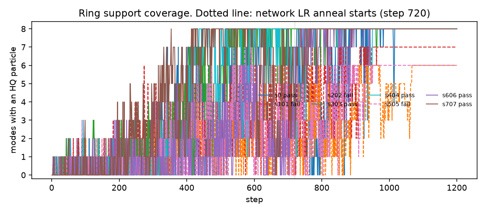
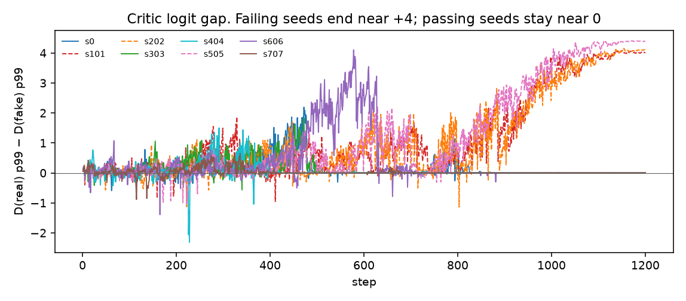
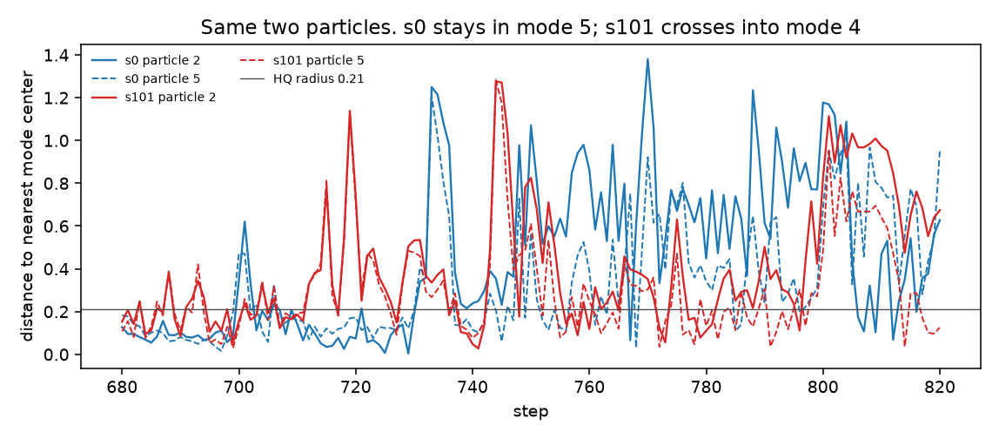
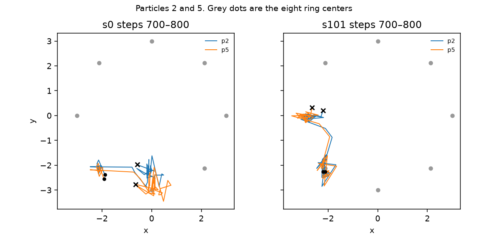
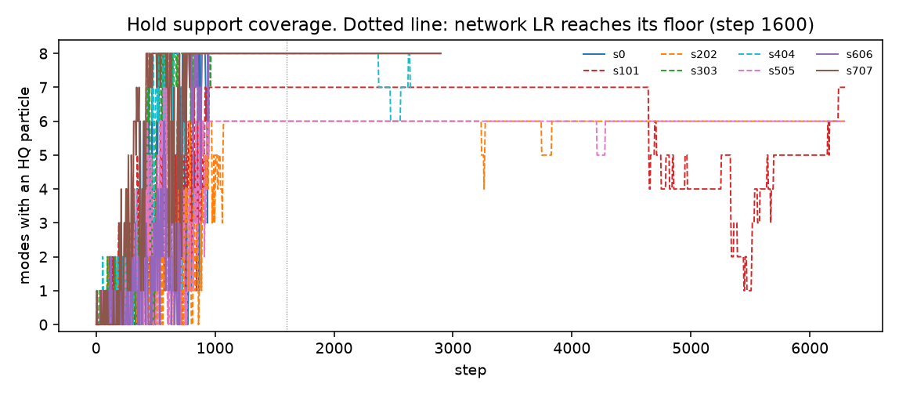

# hid_q ring failures: where the trajectories split

CPU diagnosis of K3P `--init hid_q` on the 8-mode ring. The seed offset changes only the data and noise streams. Init parameters are bit-identical across the eight offsets. Logging is read-only: a repeat of offset 0 matched the diag trace byte for byte, and a no-diag rerun of offset 0 matched the diag run's randomness digest and live metrics.

Machine: Linux, torch 2.14.0+cpu, one thread. Offsets `0, 101, 202, 303, 404, 505, 606, 707`, applied the same way as the seeds README (`K3P_SEED_OFFSET` through `det_init_seedshim.py`; offset 0 is unshifted).

The ring host trains **12 particles**, batch 128, 1,200 steps. The hold probe is a separate longer budget (network LR cosine over steps 960–1,600, then the floor), not a continuation of the ring run.

## Pass / fail

Ring gate: live coverage of all 8 modes with HQ ≥ 0.90, and a stable passing suffix of the 24 checkpoints.

| offset | ring | live modes | live HQ | passing suffix | hold | hold detail |
|---:|---|---:|---:|---:|---|---|
| 0 | PASS | 8 | 0.9998 | 7 | PASS | converged step 1400, held 1200/1200 |
| 101 | FAIL | 7 | 1.0000 | 0 | FAIL | NOT_CONVERGED, 0/4800, ends at 7 modes |
| 202 | FAIL | 6 | 0.9978 | 0 | FAIL | NOT_CONVERGED, ends at 6 modes |
| 303 | PASS | 8 | 1.0000 | 7 | FAIL | POST_CONVERGENCE_FAIL at step 1801 |
| 404 | PASS | 8 | 1.0000 | 5 | FAIL | POST_CONVERGENCE_FAIL at step 2369 |
| 505 | FAIL | 6 | 1.0000 | 0 | FAIL | NOT_CONVERGED, ends at 6 modes |
| 606 | PASS | 8 | 1.0000 | 7 | PASS | converged step 1400, held 1200/1200 |
| 707 | PASS | 8 | 0.9990 | 9 | PASS | converged step 1400, held 1200/1200 |

Ring: **5/8 pass** (0, 303, 404, 606, 707). Hold: **3/8 pass** (0, 606, 707). Offset 0 repeated with logging: diag jsonl SHA-256 `39c93cb8fcf24622…` on both runs. Offset 0 with logging removed: randomness SHA-256 `d842e67b3e9335dc…` matches the logged run.

Init fingerprint, all eight ring seeds: `init_z_sha=5342f749f8f7e60b`, `init_g0_sha=182dc5990dd2faf2`, `init_d0_sha=02929d189e01b210`.

## What the step actually computes

The host builds `benchmarks.legacy.grad_regularizers.GradRegularizer` with arm `a_r1r2`. The probe's K3P monkeypatch replaces `particlegan.grad_regularizers.GradientPenalty.penalty`. That is a different class, so the patched penalty, the EMA-critic anchor, and the critic spike guard record **0 calls** on every run (`mechanism-receipt.json`: `calls=0`, `critic_steps=0`; diag fields `s`, `prox`, `phase`, `ema_pull_rms`, `guard_clipped` stay empty).

A2's code runs on the particle table every generator step. Its scoped branch, which rewrites the Adam step, requires a missed row and a cumulative hit rate below 1/2. Batch 128 over 12 particles hits every row: `a2_active_fraction=1`, `a2_cumulative_rate=1`, `a2_scoped` is false on all 1,200 ring steps and on every hold step. `a2_rho_mean` stays empty. Damping does not change the update.

The live signals are the relativistic paired margin, the a_r1r2 critic, the 12 particle images, and the per-row generator gradient.

## Failure events

HQ radius is 0.21 (3 × σ). A mode is covered when at least one particle lies inside that ball. Adjacent modes are 45° apart on the radius-3 ring.

### Ring (budget 1,200)

Passing seeds first show 8 HQ modes at steps 354 (s707), 425 (s404), 522 (s0), 523 (s303), and 736 (s606), and they finish on 8. The three failing seeds **never** record 8 HQ modes.

| offset | event step | type | what moves |
|---:|---:|---|---|
| 101 | 743 | neighbor merge, mode abandoned | particles 2 and 5 leave mode 5 (last HQ step 742, longest streak 11) and sit on adjacent mode 4 by step 750 |
| 202 | 444 | neighbor merge | particles 4, 9, 10 leave mode 5 (last HQ 443, streak 14) and sit on adjacent mode 6 by step 450 |
| 202 | 665 | neighbor merge | particle 7 leaves mode 3 (last HQ 664, streak 3) and sits on adjacent mode 2 by step 700 |
| 505 | 595 | neighbor merge | particles 2 and 5 leave mode 3 (last HQ 594, streak 13) and sit on adjacent mode 4 by step 600 |
| 505 | 698 | neighbor merge | particles 0 and 7 leave mode 1 (last HQ 697, streak 15) and sit on adjacent mode 2 by step 725 |

Final packings (particle → mode):

| offset | assignment (12 particles) | hole |
|---:|---|---|
| 0 pass | 4,2,5,2,4,5,0,3,7,6,2,1 | none |
| 101 | 2,7,4,1,2,4,7,1,3,6,6,0 | 5, both of its particles on 4 |
| 202 | 2,4,7,2,6,0,4,2,1,6,6,4 | 3 and 5 |
| 505 | 2,6,4,0,4,4,6,2,5,4,6,7 | 1 and 3 |

### Hold

| offset | event step | type |
|---:|---:|---|
| 101 | 4707 | mode 2's pair crosses the HQ radius (distances 0.210 and 0.327) and does not return. The run never had all 8 modes at once. Final hole is mode 2. |
| 202 | 444 and 665 | same merges as the ring. Final assignment matches the ring. Unrepaired through step 6300. |
| 303 | 1600, gate fails at 1801 | duplicate particle 9 on mode 4 walks out of the ball starting the step the network LR hits the floor. Mode count stays 8 because particle 4 still covers mode 4. Eval HQ falls through 0.90 at step 1801 (0.8999). |
| 404 | 2369, support loses mode 2 at 2375 | particle 5's row gradient climbs 0.005 → 0.064 over ~40 steps. It leaves mode 2 toward mode 3. Eval HQ breaks at 2369 while the particle is still the nearest center; the mode is empty at 2375. |
| 505 | 595 and 698 | same merges as the ring. Final assignment matches the ring. |

s202 and s505 fall into the same packing on both budgets. s101's hole depends on the budget (mode 5 on the ring, mode 2 on the hold) because the hold anneals later (steps 960–1,600 rather than 720–1,200).

## Side-by-side signals

`ring_series.csv` is the coverage, max particle distance, logit gap, paired margin, and D/G gradient ratio every 5 steps.

End of the ring, pass versus fail:

| offset | modes ever at 8 | final logit gap (real p99 − fake p99) | paired margin | D/G grad ratio |
|---:|---:|---:|---:|---:|
| 0 | 410 steps, from 522 | 0.00 | 0.208 | 18 |
| 303 | 591 steps, from 523 | 0.00 | 0.215 | 44 |
| 404 | 609 steps, from 425 | 0.00 | 0.125 | 26 |
| 606 | 379 steps, from 736 | 0.00 | 0.040 | 96 |
| 707 | 601 steps, from 354 | 0.00 | 0.165 | 21 |
| 101 | 0 | 4.02 | 0.448 | 83 |
| 202 | 0 | 4.13 | 1.400 | 38 |
| 505 | 0 | 4.39 | 1.575 | 78 |

The ~4 logit gap appears only on the three ring failures. Passing seeds keep D(real) and D(fake) matched.

s101, the 40 steps around the mode-5 merge. Particles 2 and 5 are the mode-5 pair. On the passing seed those same two indices finish inside mode 5.

| step | s101 modes of p2, p5 | dist | row grad | D(fake) mode 4 | D(fake) mode 5 | D/G ratio |
|---:|---|---|---|---:|---:|---:|
| 705 | 5, 5 | 0.196, 0.161 | 0.002, 0.003 | 0.61 | −0.20 | 4.2 |
| 715 | 5, 5 | 0.778, 0.815 | 0.017, 0.030 | 0.62 | 0.25 | 23.0 |
| 725 | 5, 5 | 0.308, 0.273 | 0.009, 0.004 | 0.66 | 0.30 | 4.2 |
| 745 | 5, 4 | 1.271, 1.173 | 0.004, 0.009 | 0.60 | 0.55 | 10.6 |
| 750 | 4, 4 | 0.825, 0.609 | 0.014, 0.016 | 0.12 | — | 7.9 |
| 800 | 4, 4 | 0.823, 0.482 | 0.021, 0.021 | 0.50 | — | 2.8 |

At step 715 the row gradients are about 10× the step-705 values and the D/G ratio spikes to 23, while both particles are still nearest to mode 5. Mode 4's fake score stays above mode 5's. By step 750 both particles are on mode 4 and mode 5 has no fake. They are still there at step 1,200.

The same critic tilt shows up on the other holes, one snapshot from the last stored step before the abandonment:

| hole | snapshot | D(real) on the source | D(real) on the neighbor they enter |
|---|---:|---:|---:|
| s202 mode 5 → 6 | 425 | −0.73 | 1.02 (no fake on 6 yet) |
| s505 mode 1 → 2 | 675 | 0.38 | 1.75 (no fake on 2 yet) |
| s404 hold mode 2 → 3 | 2360 | D(fake) −0.06 | D(fake) 0.58 |

s404's row gradient on particle 5 goes 0.0046 (step 2320) → 0.0149 (2350) → 0.0506 (2360) → 0.064 (2365). The logit gap stays ~0 through that spike, so this ejection is a localized generator gradient, with the same direction: away from the low score and toward the high-score neighbor.

s303's hold failure is the slow version. Particle 9's distance to mode 4 is 0.215 at step 1,600 (the floor), 0.333 at 1,700, 0.652 at 1,800, 0.822 at 1,900. Row gradients stay small (0.002–0.011). The mode remains covered by particle 4. The gate dies on HQ, not on mode count.

## Mechanism

Particles move up the critic. A mode whose samples score below a neighbor loses its particles across the shared Voronoi edge. Twelve particles cannot split, so the source mode stays empty and the duplicate mass sits on the neighbor. Once the network LR has fallen, that packing stays put.

On the ring budget the three failures are already short of 8 modes through the full-LR phase. Each finally-missing mode is abandoned by a short visit (longest HQ streak 3–15 steps) whose particles cross into an adjacent mode. In the ~40 steps before the crossing, the destination's critic score is higher and the leaving rows' gradient jumps by about an order of magnitude. After the hole exists, D(real) on the empty mode is unopposed, and the real-versus-fake logit gap grows to about 4. Passing seeds keep that gap near 0 and, even when the cosine scatters them (s0 falls to 1 mode at step 800), they fall back into eight wells by the floor.

A2 does not mediate this. Its damping branch is idle for the whole run because the batch covers every row. The EMA-critic pull does not mediate it either: the anchor is never started, and the penalty in the graph is a_r1r2 for the entire schedule.

The hold failures are the same climb on the longer budget. s202 and s505 repeat their ring merges and never acquire the missing modes. s101 loses a different mode (2, at step 4707) after a long partial cover. s303 and s404 do acquire 8 modes, then during the floor a particle walks toward a higher-scoring neighbor until eval HQ crosses under 0.90 (step 1801 and step 2369).
