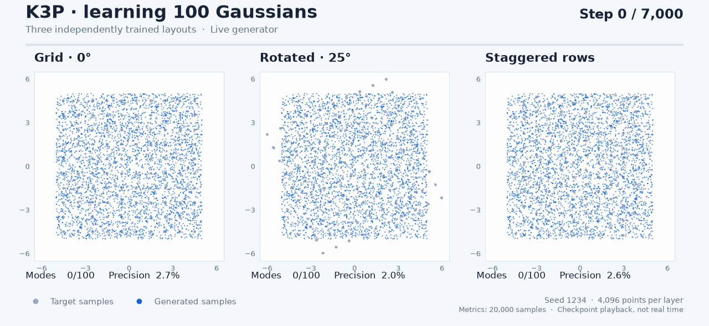

# Selected research base: K3P

**K3P is the user-selected GAN research and launcher base.** It replaces
`direct_particle_response` as the starting formulation for future research.
It passes all 22 declared GPU toy gates and the measured ring hold plus
300-update extension. Target-shift recovery remains the next problem to solve.
This is a research selection; the public training-package defaults are separate.



## Results

| Measurement | K3P result | Scope |
|---|---:|---|
| Declared toy suite | **22/22 PASS** | 19 transfer problems + three full native gates |
| Transfer problems | **19/19 PASS** | Frozen per-task seeds, budgets and sustained verdicts |
| grid100 | **4/4 PASS** | Existing seeds 1234–1237, coverage and accuracy |
| rotated100 | **1/1 PASS** | Declared seed 1234, coverage and accuracy |
| staggered100 | **1/1 PASS** | Declared seed 1234, coverage and accuracy |
| Ring hold after convergence | **1,200/1,200 PASS** | Every update, minimum HQ 0.90723 |
| Following ring extension | **300/300 PASS** | Every update, minimum HQ 0.98779 |
| Target-shift recovery | **FAIL: 28/81 passing checks** | Fixed deadline window requires 81/81 |

The native gates run all 7,000 updates. The 22/22 total uses the declared native
seed 1234 and each transfer task's declared seed; the historical extra grid
seeds are reported separately. Rotated/staggered results are one run each, not
robustness estimates. The hold and recovery measurements are each one declared
ring run; they do not qualify continuation on every transfer host.

K3G and P1 also reach 22/22 at the declared seeds, but fail 237 of the 300 ring
extension checks, reaching minimum HQ 0.719. K3P preserves that quality in the
measured extension. Its remaining recovery failure is explicit: after a target
shift at update 2400, sustained passing resumes only at 3530, 1,130 updates
later, missing the fixed deadline. No other candidate's floor schedule or
recovery result is attributed to K3P.

[Gate-by-gate evidence](../gap-fill-20260925/qualification-summary.json) ·
[Compared formulations](../continuous-practical-leaderboard.md) ·
[53-job gap-fill report](../gap-fill-20260925/README.md) ·
[Original ring evidence](../overnight-20260925/evidence.json).

## What K3P is

K3P remains a relativistic-paired logistic GAN with a generator, critic and
learned particle prior. It retains the selected parent's direct-particle
response and A2's bounded sparse-latent damping. Its main new ingredient is a
critic constraint that changes with the critic's actual learning rate:

1. **Early training:** dimension-normalized real R1 plus a fake-gradient RMS
   cap supplies the original damping while the model acquires the distribution.
2. **As the critic learning rate falls:** the penalty transitions toward
   one-sided L2 gradient caps on real and fake data. It also penalizes the
   difference between the current real-data input gradient and that of a critic
   whose parameters are an exponential moving average, decay **0.999**. The
   anchor starts at the first blended call and updates after critic steps.
   At a stationary critic this difference is zero even when its gradient is
   nonzero. This is designed to damp oscillation without forcing a flat critic
   at real data.
3. **Critic spike guard:** after 200 optimizer steps, a critic tensor whose
   gradient RMS exceeds five times its bias-corrected Adam second-moment RMS
   is scaled back to that ratio. K3P does not add K3G's generator guard.

The transition reads optimizer learning-rate history. It does not read task
names, target centers, mode labels or evaluation metrics. The anchor adds an
EMA-critic forward/input-gradient evaluation during the blended and final
phases after initialization; it adds no optimizer steps. Equal-step results
should not be described as equal-compute results. The old receipt field
`extra_critic_forwards` is not incremented by the anchor implementation, so
its zero value must not be interpreted as zero additional work.

For the exact scalar penalty, with coefficient and cap threshold both 1:

```text
A = mean(||grad D(real)||² / d)
    + mean(relu(||grad D(fake)|| / sqrt(d) - 1)²)
B = mean(relu(||grad D(real)|| - 1)²)
    + mean(relu(||grad D(fake)|| - 1)²)
P = mean(||grad D(real) - grad D_ema(real)||² / d)
s = max(0, min(1, 2*r) - 2*f) / (1 - 2*f)
penalty = 0.5 * (s*A + (1-s)*(B+P))
r = last applied critic LR / maximum applied critic LR; f = 0.01
```

The inherited direct response applies only to direct sample-particle groups:
Adam betas `(0,.9)` and a scheduled-LR gain between 1 and 2 according to
successive centered-gradient alignment. Registered latent priors and networks
are excluded. A2 separately damps an observed latent row by a factor in `[.5,1]`
according to agreement with its previous observed gradient, only for sparse
tables with cumulative observation rate below one half. Inactive rows remain
motionless and Adam's second moment uses the raw gradient.

The saved schedule uses network/prior floors **.01/.05**, network horizon cap
1600, base LR .00425, prior LR multiplier 2, and the existing noise schedules.
Changing those floors or adding RG5 creates a new candidate to qualify.

## Exact selected bundle and execution

The [selection declaration](../current-research-base.json) pins the unchanged
executed files under [`gap-fill-20260925/sources/k3p`](../gap-fill-20260925/sources/k3p):
`config.json`, `mechanism.py`, `latent.py`, `response.py`, and the gate drivers.
**Config alone is not K3P.** Its legacy `a_r1r2` field invokes the installed
mechanism patch, and the drivers call both latent and response hooks around Adam.
Selection changes metadata and research guidance, not these trained sources.

The [selection audit](selection-audit.json) verifies all eleven pinned files
against the executed bundle and checks the 22 passes, hold/extension, and recovery
failure against saved raw evidence. The live launcher's default focus is recorded
in [launcher-focus.patch](launcher-focus.patch).

Use `probe.py` for the 19 transfer tasks, `native100.py` for the three native
problems, and `hold.py`, `shift.py`, `shift_frozen.py` for the ring protocols.
The [job manifest](../gap-fill-20260925/manifest.json) contains the executed
argument lists, frozen runtime paths, source hashes and initialization fixtures.
Use a fresh output directory. The frozen local runtime and fixtures are required;
this research bundle is not a replacement public-package entry point.

Training, gradients, Adam state and mechanism history use CUDA FP32, deterministic
algorithms, TF32 disabled and one CPU thread. Transfer tasks reuse zero-update
CPU parameter fixtures; native problems use CUDA initialization. Keep native
CUDA random draws and the qualified noncapturable Adam arithmetic.

Continuous hold/recovery was measured without checkpoint restart. A fresh-process
resume must additionally preserve critic EMA, learning-rate/hook history,
latent observation counts and direct-response history, alongside model,
optimizer and RNG state. The existing checkpoint helper does not serialize all
of those module-global states; restart equivalence is unqualified.

The next research gate is K3P's own target-shift recovery while protecting its
hold/extension and all 22 toy passes. No new training is launched by selection.
