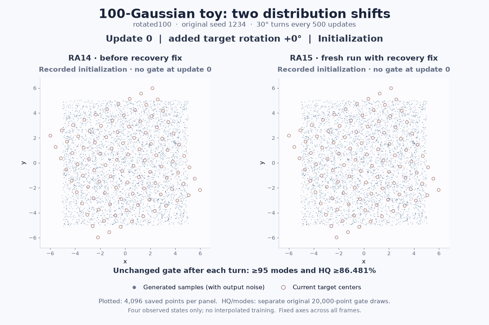

# Automatic feature cells: qualification and distribution shifts

This is the implementation and validation follow-up in [PR223](https://github.com/255BITS/ParticleGAN/pull/223),
based on [PR155](https://github.com/255BITS/ParticleGAN/pull/155) at `cabe2084`.
Use [`ra13-settled.json`](../../../../../configs/100gaussians/ra13-settled.json)
with your own models, initialization, population, latent width, batch size, and
data stream; see the [package guide](../../../../../docs/feature-cells.md).
RA13 through RA17 use identical configuration bytes. Their names identify
successive implementation repairs.

**Qualification: 19/19 original quality gates pass; Toy passes; MNIST matches
E22 at all 10 metric and learning-rate checkpoints.** The latest merged source
also passes the actual CUDA suite and strict checkpoint replays.
The [final qualification](release-prep/final-v4-attempt1/QUALIFICATION.md)
and [machine-readable receipt](release-prep/final-v4-attempt1/QUALIFICATION.json)
record original execution labels and the source proofs used below.

## What the package does

The caller supplies the generator and discriminator. ParticleGAN manages a
learned latent population and monitors the training game. This configuration
selects feature cells when the population can resolve the evidence budget and
the output has at most eight raw coordinates. Other cases retain existing kNN
or representation controls, including MNIST. Selection uses capabilities
without reading task names or quality scores.

Feature cells monitor occupancy in critic features and conditional output
moments. Population controls can rebalance counts, introduce particles from
certified real anchors, and correct group means. The optional settled R1 guard
requires a network contraction witness before reopening a settled game. After
an actual R1 fire, mean correction can use occupied frozen groups; missing
groups keep zero direction and weight, without redistributing their mass.
This fixes the empty-group veto observed after a distribution shift.

Other repairs cover CPU optimizer isolation, repeated tensor references during
checkpoint transfer, explicit CPU placement of planning operations, and atomic
rejection of malformed initialized FIFO shapes. Ordinary package defaults
remain unchanged; the recommended configuration explicitly enables these controls.

## Comparison with the archived RA11 candidate

| Check | Archived RA11 | Recommended configuration |
| --- | --- | --- |
| Toy25 | PASS, 25/25 modes | PASS, 25/25 modes; all 9 post-update score/LR checkpoints match RA11 |
| Original portability tasks | 8/13 PASS | 13/13 PASS |
| Static native Gaussian grids | 3/3 PASS | 3/3 PASS |
| MNIST active embedding distance, lower is better | 40.5444 | 0.5445 |
| MNIST embedding precision | 28.13% | 86.91% |
| MNIST embedding recall | 0% | 84.72% |
| MNIST confident class coverage | 1/10 | 10/10 |

The [RA11 receipt](../fixes/quality/results/CB64-RA11-regressions.json)
retains its five portability failures and MNIST regression. MNIST has no
separate invented acceptance threshold: the new result matches the corrected
E22 comparator at every recorded checkpoint. Its selected backend is kNN.
Toy's final noisy-sample precision is 96.53%, with mass TV 0.05211.

## Moving distribution: two rotations, every 500 updates

The existing task trains for 1,500 updates and rotates the target by 30 degrees
after each 500-update period. Each post-rotation gate requires at least 95 modes
and quality at least 90% of the step-500 baseline. Quality (HQ) is the fraction
of noisy primary samples within the scorer's radius of a target center.
The original tasks, models, seed, streams, scorers, and thresholds are preserved.

The GIF compares saved observations from the failed RA14 run and fresh RA15
repair at steps 0, 500, 1,000, and 1,500. It plots 4,096 generated points per
observation. Captions and scores use the separate original 20,000-point
acceptance draws. Particle movement between observations is not interpolated.
[Visualization provenance](visualization-pr223/README.md).

| Moving task | Before repair: final HQ / modes | After repair: final HQ / modes | Gate before → after |
| --- | --- | --- | --- |
| Grid100 | 96.24% / 100 | 96.20% / 100 | PASS → PASS |
| Rotated100 | 85.57% / 99 | 92.59% / 98 | FAIL → PASS |
| Staggered100 | 97.28% / 100 | 94.76% / 100 | PASS → PASS |

Rotated100 improves by **7.02 percentage points**; its unchanged requirement is
86.481% and at least 95 modes. The other two final HQ scores decrease while
remaining above their original thresholds. All three repaired tasks pass both
turns. The [old receipts](validation-ra14-r2/scoreboard-moving.json) retain the
failure; the [fresh repaired receipts](validation-ra15/scoreboard-moving.json)
record the three passes.

The separate 4,600-update ring-shift task also passes its original quality,
acceptance, and source-validity checks: final HQ 99.51%, all eight modes,
419/460 passing observations, and a final streak of 199. A paired rotated-grid
diagnostic resumed from step 1,000 improves final HQ from 85.57% to 89.84%
with 99 modes. This diagnostic is separate from the fresh runs in the table.

## Latest source verification

| Check | Actual result |
| --- | --- |
| Full suite with CUDA visible | 1,502 passed, 12 skipped, 18 subtests passed |
| Required CUDA routing/readback and portability cases | All four executed and passed |
| Toy/MNIST checkpoint continuation | 40 update calls PASS: 10 per task and load path |
| CPU contracts | 104 PASS, CUDA uninitialized |
| CPU versus CUDA default-device diagnostic | 40 update calls PASS |
| Upstream CPU CLI smoke | PASS |

The full suite ran in 403.52 seconds. Its 12 skips comprise missing optional
Gymnasium/torch-fidelity dependencies, opt-in CIFAR/native research gates,
and two assertions requiring CUDA to be absent.
[Suite receipt](validation-ra17/FULL-TESTS.json),
[test log](validation-ra17/full-pytest.log),
[JUnit](validation-ra17/full-pytest-junit.xml),
[replay closure](mnist/ra17-replay/CLOSED.json).

Replays compare losses, semantic training state, and RNG streams after every
update, and primary sample bytes at the endpoints, for native and CPU-mapped
checkpoints restored onto CUDA.
Only the original observational birth-evaluation duration is excluded from
state comparisons; the native branch also matches the pinned original control.

## How earlier fresh runs apply to the latest source

The qualification preserves **15 fresh RA14 quality executions and four fresh
RA15 executions**, rather than relabeling them as RA17 training runs. Toy and
MNIST retain their fresh 2,000-update RA13 execution labels.

- RA14 repairs checkpoint transfer only. RA15's occupied-group recovery is
  inactive on retained zero-fire or kNN runs. All three moving tasks and the
  ring-shift task were rerun in full because they exercise recovery.
- RA16's explicit CPU factories preserve arithmetic under the original CPU
  default; shape validation accepts the original valid checkpoints. Source
  comparisons, reaction/replay contracts, and actual CUDA default-device
  checks verify this bridge.
- RA17 integrates current PR155. Lazy diagnostics and batched routing preserve
  checked valid arithmetic. The noise-floor change is inactive throughout all
  21 retained quality/learned fixtures: lifetime table-stationarity counts are
  at most two, proving table scale stays at least 0.25, above the 1/64 floor
  boundary. This is a lifetime source proof, rather than an endpoint inference.
  The latest full suite and CUDA checkpoint replays run the merged source.

See the [RA16 bridge](portability/ra16-portability/REPORT.md),
[RA17 bridge](portability/ra17-current-pr155/REPORT.md), and
[noise-floor applicability proof](diagnostics/upstream-noise-floor-applicability/REPORT.md).
The tested package SHA is
`500ff0e966beb649dd7cafa0b91d7bb30cb451e5d62ece2883411a0507c8df61`;
the shared configuration SHA is
`a3ee5c67ac6594014feeb1ec333131abb4b1d86832510b69923100ebd8510ad4`.

## Recommendation and scope

Use the shared configuration for the recorded tasks and as an explicit starting
point with caller-owned models. Feature-cell selection is qualified for these
low-dimensional tasks; MNIST's kNN result does not establish image-scale
feature-cell behavior. Larger models still need their own memory, throughput,
and quality measurements. Fixed-seed results do not establish scaling laws or
robustness over seeds.

The archive retains failed candidates, preparation errors, the RA13 checkpoint
alias failure, and the RA14 rotated-grid failure. Sealed receipts keep their
original statuses. Raw checkpoints, datasets, and sample clouds stay local,
with paths and hashes in the manifests. The user-requested GIF exports saved
observations.
