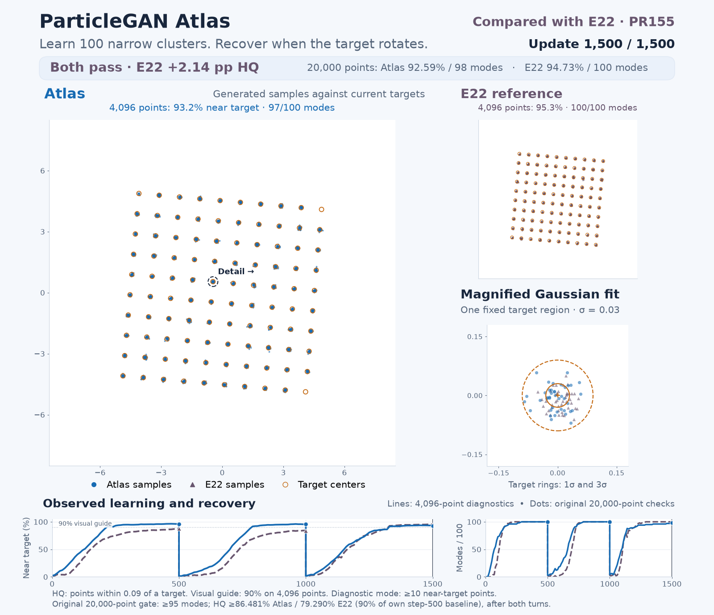

# ParticleGAN Atlas and current PR155 E22: recorded convergence



Watch [the GIF](atlas-vs-e22-convergence.gif) or [the MP4](atlas-vs-e22-convergence.mp4).
The GIF has 153 frames over 37.86 seconds at 1600 × 1380 pixels. The MP4 repeats
those recorded images at 24fps, with no interpolation of generated clouds.

## What is shown

The original `rotated100` task has 100 narrow Gaussian modes, σ = 0.03. The
target rotates 30° after updates 500 and 1000. Both methods run the original
1,500-update protocol with the same original seed, models, initialization and
data stream. E22 is the current PR155 source at `cabe2084`; Atlas is the current
source with raw package hash `500ff0e9…`.

Blue circles and solid lines denote Atlas. Purple triangles and dashed lines
denote E22. Orange rings are target centers. Each full plot shows every one
of the 4,096 observed samples on the same fixed ±8.5 axes. The zoom follows
target index 55, selected geometrically before the results, with 1σ and 3σ
target rings. Its ±0.18 crop makes the narrow Gaussian fit visible.

The animation uses real observations every 10 completed updates. At each
target shift, the exact previous generated cloud is retained while only the
target changes. Gray target ghosts and arrows show the jump. Holds at these
events give time to read them without adding training updates.

## Scores and comparison

The timeline lines and plot summaries use the **4,096-point visualization
draw**. The dotted 90% line and phase labels are a common visual guide. Modes
in that draw require at least 10 points within 0.09 of a target center.

The banner and filled timeline markers use the separate **original
20,000-point acceptance draw**:

| Recorded update | E22 HQ / modes | Atlas HQ / modes | Atlas − E22 HQ |
|---|---:|---:|---:|
| 500: baseline | 88.10% / 100 | 96.09% / 100 | +7.99 pp |
| 1000: first turn | 83.99% / 100 | 96.09% / 100 | +12.10 pp |
| 1500: second turn | 94.73% / 100 | 92.59% / 98 | −2.14 pp |

Both runs pass the original acceptance rule after both turns: at least 95
modes and HQ at least 90% of the method's own update-500 baseline. This gives
minimum HQ 79.290% for E22 and 86.481% for Atlas. HQ is the fraction of points
within 0.09 of a target center.

Atlas reaches the common 90% visual guide earlier during initial learning and
the first turn. E22 finishes with the higher original HQ and mode count. This
is one original fixed-seed recipe comparison, with separate acceptance and
visualization measurements.

## Evidence and rendering

Both fresh current-source captures completed all 1,500 updates. All 151
observations per method passed checks for unchanged public state, global and
private RNG, external data cursor, parameter versions, gradients and module
flags. The two target-shift clouds per method are exact copies of the preceding
cloud. Actual CUDA observer parity was checked separately before the full
capture. Its source and numerical evidence are in the companion capture
archive; raw NPZ/checkpoint files remain pinned local references there.

[MEDIA-MANIFEST.json](MEDIA-MANIFEST.json) lists the final assets and their
hashes. [RENDER-RECEIPT.json](RENDER-RECEIPT.json) records every displayed step,
event, duration, input hash and output hash. The archived
[renderer](render_convergence.py) is the exact source used for these assets.
Rendering imports no Torch or training package and launches no GPU work.

To reproduce at the original study location, use this source with the pinned
captures from `../../full-attempt-1/` and write to a new output directory:

```bash
/tmp/pr38-default-env/bin/python render_convergence.py \
  --atlas-capture ../../full-attempt-1/atlas/capture/dense-frames.npz \
  --e22-capture ../../full-attempt-1/e22/capture/dense-frames.npz \
  --atlas-gates ../../full-attempt-1/atlas/capture/original-frames.npz.verdict.json \
  --e22-gates ../../full-attempt-1/e22/capture/original-frames.npz.verdict.json \
  --metadata ../../full-attempt-1/COMPLETION.json \
  --output-dir ../new-render
```

For an archived copy, supply the pinned capture files at their new locations.
Intermediate PNG frames are retained locally. The compact media archive keeps
the GIF, MP4, poster, source and receipts.
