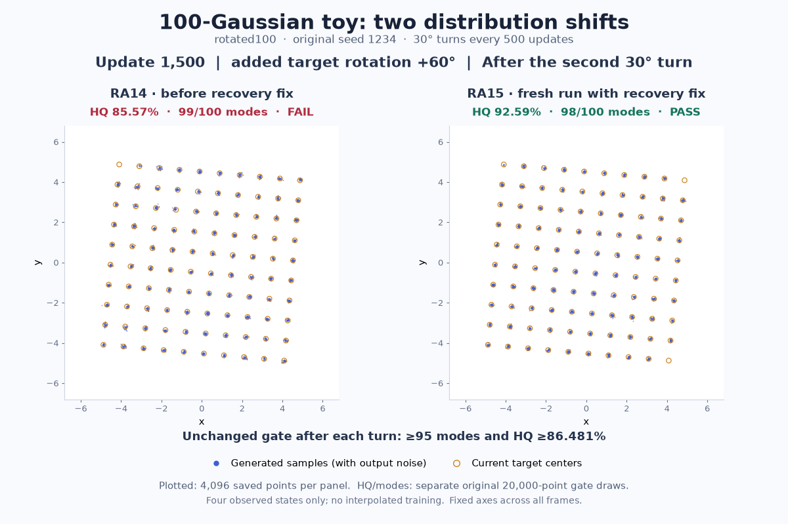

# Original moving-distribution observations



The [GIF](rotated100-shift-comparison.gif) compares saved **RA14** observations
with the **fresh RA15** recovery run of the original `rotated100` task.
The source runs use seed 1234 and 1,500 updates, with two 30° target shifts.
These are the actual historical source labels; the animation is not a new
RA17 execution. The [score comparison](moving-score-comparison.md) includes
both original turns for grid100, rotated100 and staggered100.

## Frames and scores

Only four recorded states appear, at updates **0, 500, 1,000 and 1,500**.
Each panel plots every one of the original **4,096 saved float16 samples**.
Open rings show target centers calculated from the saved initial centers and
saved additional angles **0°, 0°, 30° and 60°**. The initial rotated100 layout
is already rotated 25°, so its absolute target orientations are 25°, 25°, 55°
and 85°. The first two recorded sample arrays are exactly identical across
RA14 and RA15. All frames share the same axes, and every saved point is visible.

HQ and mode labels come from **separate original 20,000-point gate draws**.
HQ measures the fraction within Euclidean distance 0.09 (three target standard
deviations) of the nearest current target center. A mode needs at least 10 HQ
samples. Both turns must retain at least 95 modes and HQ at least 90% of the
update 500 baseline. For rotated100, the baseline is 96.09% and the unchanged
HQ minimum is 86.481%.

After the second turn, RA14 has **85.57% HQ / 99 modes (FAIL)** and fresh RA15
has **92.59% HQ / 98 modes (PASS)**. HQ gains are not uniform across all three
moving tasks; the complete comparison retains the lower grid and staggered
scores. See [CAPTION.md](CAPTION.md) for a compact caption.

There are no diagnostic target-shift frames or interpolated particle moves.
The animation holds each observed state; recovery between snapshots is not
shown. Rendering used no model sampling, fresh training, PyTorch import or GPU.
The 4,096-point plots do not substitute for the original acceptance draws.

## Provenance and reproduction

[GIF-RECEIPT.json](GIF-RECEIPT.json) records the exact input and output SHA256
hashes, original source-package identities, rendering command, versions and
limits. Inputs are retained under these study paths:

- `validation-ra14-r2/moving/rotated100/frames.npz`
- `validation-ra15/moving/rotated100/frames.npz`
- `validation-{ra14-r2,ra15}/moving/{grid100,rotated100,staggered100}/frames.npz.verdict.json`

The renderer also hashes the original gate runner, adapted runners, launch and
completion receipts, and identical config files. It verifies input hashes again
after rendering. This directory contains the visualization and provenance;
the original point clouds remain in the study archive.

To reproduce into a new empty directory with the original archive available:

```sh
mkdir /tmp/rotated100-pr223-render
OMP_NUM_THREADS=1 OPENBLAS_NUM_THREADS=1 /tmp/pr38-default-env/bin/python \
  render_rotated100_comparison.py \
  --study-root /ml2/hypergan/gan-attempts/feature-cells-generalization-20260930 \
  --output-dir /tmp/rotated100-pr223-render
```

Earlier layout attempts are retained in `attempt-1/`, `attempt-2/` and
`attempt-3/`, including their exact renderer and any completed receipts.
Their receipts record the original canonical paths; the corresponding source
bytes are now in each attempt's `render_rotated100_comparison.py`. The final
render uses explicit figure coordinates, separates all header rows by at
least four pixels and cleans the prose. Numerical inputs and observations
are unchanged.
