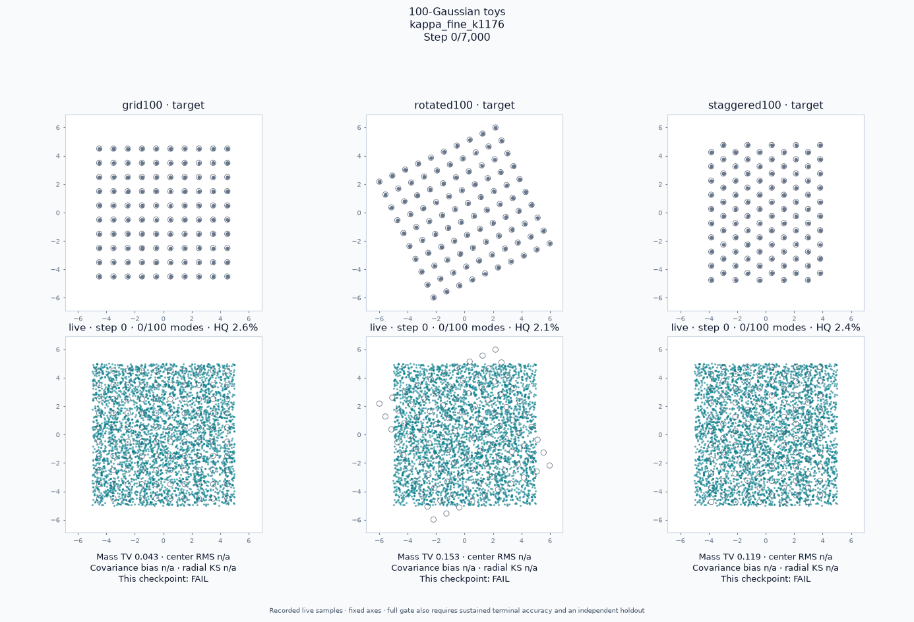

# One shared recipe: 22/22

The exact [`shared_candidate.json`](../../../configs/toy100/shared_candidate.json) passes **22/22** in a fresh production-runner replay: all three 100-Gaussian accuracy gates and all 19 frozen older toys. A separate fresh installed-wheel public-default control passes **19/19**. The same raw evidence passed independent regrading and regrading after relocation with the tightened common-gate checker. A fresh-copy audit also passed while filesystem access to the original RAM run, isolated worktree, and ignored artifacts was denied. The full local unit run passed 911 tests, with 8 skips, one existing expected failure, and 27 passing subtests. This report records the local replay; the [hosted workflow](https://github.com/255BITS/ParticleGAN/actions/workflows/toy100.yml) separately trains the full gate on pull-request updates.

The final search change was **`reg_kappa: 1.0 → 1.176`**. Every other optimizer, loss, noise, architecture-policy, and schedule setting stayed the same as the previous 20/22 candidate. Its two failures were rotated100 and residual_student. The fine bracket selected κ=1.176 after a strict ten-host screen and fresh 19-host replay; this report is a subsequent complete 22-host run, not a collection of best cases from different trials. See the [fine-bracket evidence](../shared-kappa-fine-v1.md).



| Shared setting | Exact value / behavior |
| --- | --- |
| Optimizer / loss | Ordinary Adam; logistic relativistic pairing (`gan_mode: rp`) |
| Base learning rates | G .00425; D .00425 (`d_lr_mult: 1`); particles .0085 (`prior_lr_mult: 2`) |
| Adam moments | β₁=0, β₂=.999 for G, D, and prior; `prior_betas: null` inherits |
| Discriminator penalty | `b_cap`, coefficient 6, κ=1.176, exact autograd every update |
| Penalty meaning | `(6/2) × (mean_real relu(‖∇D‖₂−1.176)² + mean_fake relu(‖∇D‖₂−1.176)²)`; gradients below the cap incur no penalty |
| Prior penalty | Weight .05 on the existing VICReg variance-floor and off-diagonal decorrelation loss |
| G/D learning-rate schedule | Cosine decay starts at 60% of `min(host_budget, 1600)`; floor is .01 of each base rate |
| Prior learning-rate schedule | Cosine decay starts at 60% of the full host budget; floor is .05 of its base rate |
| Discriminator input noise | Gaussian σ=.5, linearly reduced to zero over the first 10% of the host budget |
| Generator output noise | Gaussian σ rises linearly from 0 to .029 over the first 20% of the host budget, then stays .029 during training and sampling |
| Randomness | Existing global output-noise RNG; `output_noise_rng` is absent; fixed seeds, no seed search |
| EMA | Decay .995, diagnostic only; every PASS is from live weights |

For a native 7,000-update run, G/D start decaying after 960 completed updates and reach their .0000425 floor at 1,600; the prior starts decaying after 4,200 and approaches .000425 at the end. Input smoothing reaches zero at 700; output noise reaches .029 at 1,400. Schedules are indexed by completed updates, immediately before each update. The same rules apply to every host. For older budgets at or below 1,600 the horizon cap has no effect, while the .01 network floor still applies.

All three native problems use `affine_square_v1`: an identity-initialized trainable 2D affine generator (six parameters), **20,000 learned 2D particles** initialized uniformly on **[−5,5]²**, and a width-128, three-hidden-layer discriminator with Fourier setting 3. No target centers or mode labels initialize or supervise the particles. Native runs use batch 2,048, 7,000 updates, one CPU thread, and seed 1234. Older hosts retain their frozen architectures, particle/batch sizes, budgets, data, and seed 0. One shared optimization/noise recipe does not replace these different benchmark tasks with identical networks. Public package defaults are unchanged.

All three first cover **100/100 modes at update 750** (about 28–32 measured episode seconds here). That is early coverage, not sustained accuracy. All five terminal checks at 6,000, 6,250, 6,500, 6,750, and 7,000 pass both original coverage and strict fidelity on 20,000 live draws, followed by an independent 100,000-draw holdout. The three native runs took 259.8, 261.3, and 285.7 seconds including evaluation, excluding process startup and GIF rendering.

| Independent 100k holdout | Precision | Mode-mass TV | Center RMS / σ | Covariance trace bias | Radial KS |
| --- | ---: | ---: | ---: | ---: | ---: |
| grid100 | 0.98266 | 0.03679 | 0.10340 | -0.03596 | 0.01354 |
| rotated100 | 0.97737 | 0.04106 | 0.08242 | -0.03561 | 0.01486 |
| staggered100 | 0.98396 | 0.04095 | 0.09336 | -0.03773 | 0.01538 |

The fixed accuracy limits are precision ≥.97, mass TV ≤.06, center RMS ≤.20σ, absolute mean covariance-trace bias ≤.10, and radial KS ≤.04, together with the original per-mode coverage/mass/shape criteria. The [per-case combined gate](compatibility.md), [native coverage timings](toy100/leaderboard.md), [accuracy gate](toy100/accuracy-leaderboard.md), and [machine-readable combined result](compatibility.json) retain the full verdicts. `mode_hold` and `vector_unequal_mass` pass with exactly the required five-check terminal streak: this is a fixed-seed regression result, not evidence of broad seed or hyperparameter robustness.

To reproduce the common gate with the recorded AVX2 CPU dispatch profile:

```bash
export OMP_NUM_THREADS=1 MKL_NUM_THREADS=1 CUDA_VISIBLE_DEVICES=''
export ATEN_CPU_CAPABILITY=avx2 MKL_ENABLE_INSTRUCTIONS=AVX2
export ONEDNN_MAX_CPU_ISA=AVX2 DNNL_MAX_CPU_ISA=AVX2
python -u -m benchmarks.toy_suite run \
  --config configs/toy100/shared_candidate.json \
  --output artifacts/toy-suite/shared22 --with-default-control
python -m benchmarks.toy_suite regrade --output artifacts/toy-suite/shared22
python experiments/leaderboard.py --toy-suite-output artifacts/toy-suite/shared22
python -m benchmarks.toy100 render --output artifacts/toy-suite/shared22/toy100
```

To inspect one problem or regrade the checked-in evidence:

```bash
python -u -m benchmarks.toy100 run \
  --config configs/toy100/shared_candidate.json --problem grid100 \
  --require-accuracy --output artifacts/toy-suite/grid
python -m benchmarks.toy_suite regrade --output reports/toy100/shared22
```

Training source was frozen at commit `b7d9963`, with config SHA-256 `6de24743336a3ce7e922deceab91dff0688bdb28ae8f5e6ff2c8b88b9f2bec27`. Python 3.12.13 / PyTorch 2.13.0+cu126 ran on CPU. Source archives and hashes bind the native policy and all public-package files to the older-host replay; applied-noise and actual optimizer-rate receipts are checked. The complete 243-file RAM bundle was copied and SHA-256 verified into `artifacts/toy100-accuracy/production-k1176-shared22`. This review bundle contains all 211 numerical, source, log, snapshot, GIF, and regrading files; only the temporary wheel/install directories are omitted. Regrading recomputes aggregate reports from the saved samples and episodes; the initial copy hashes are retained in `retention.json`.

The [original failing GIF](../accuracy-failure/rotated100/progress.gif), unsuccessful candidates, and [research comparisons](../optimizer-formulation-research.md) remain available. Research-only optimizer substitutions cannot qualify for the production gate.
