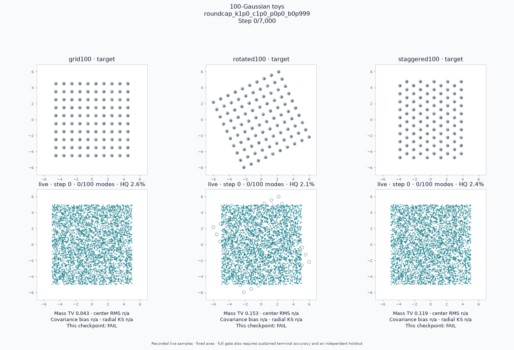

# Simpler shared recipe: 22/22

The exact [`constraints_simple_regularization.json`](../../../configs/toy100/constraints_simple_regularization.json) passes all 22 frozen toys in one fresh production-runner replay. It replaces the previous discriminator cap 1.176 and coefficient 6 with **1 and 1**, and removes the particle VICReg penalty (`prior_reg=0`). Every other optimizer, noise, schedule, model, resource, seed, and accuracy-gate setting is unchanged. This simplifies regularization; it does not eliminate every hyperparameter.



| Setting | Exact recipe |
| --- | --- |
| Optimizer / objective | Ordinary Adam; logistic relativistic pairing |
| Learning rates | G .00425; D .00425; particles .0085 |
| Adam moments | β₁=0, β₂=.999 for all players |
| Discriminator regularizer | `b_cap`, κ=1, coefficient 1; exact autograd every update |
| Particle regularizer | Disabled (`prior_reg=0`) |
| Network schedule | Cosine starts at 60% of `min(host_budget,1600)`; floor .01 |
| Particle schedule | Cosine starts at 60% of host budget; floor .05 |
| Input noise | σ=.5 decreases linearly to zero during the first 10% |
| Output noise | σ rises to .029 during the first 20%, then stays .029 |
| Native initialization | Identity 2D affine G; 20,000 learned particles uniform on [−5,5]² |
| Native critic / resources | Width128, depth3, Fourier3; batch2048; 7000 updates |
| Randomness | Native seed1234, older seed0; historical global output-noise stream |
| EMA | .995; diagnostic only, never supplies a PASS |

The penalty is `0.5 × (mean_real relu(‖∇D‖₂−1)² + mean_fake relu(‖∇D‖₂−1)²)`. A unit threshold and coefficient remain fixed modeling choices. The generator remains affine on the native toys; older hosts retain their frozen architectures and resources. The .029 output width is still close to the known .03 Gaussian width, and learning rates still decay. The [constraint-removal ledger](../constraint-removal.md) distinguishes successful simplifications from failed alternatives.

All three native problems first cover 100 modes at update 750. Coverage is transient at that point: a PASS additionally requires every final check at 6000, 6250, 6500, 6750, and 7000, plus a separate 100,000-draw holdout, on live weights. All these checks pass.

| Independent 100k holdout | Precision | Mass TV | Center RMS / σ | Covariance trace bias | Radial KS |
| --- | ---: | ---: | ---: | ---: | ---: |
| grid100 | 0.98285 | 0.03577 | 0.08538 | -0.04194 | 0.01713 |
| rotated100 | 0.98631 | 0.03473 | 0.08119 | -0.03826 | 0.01594 |
| staggered100 | 0.98911 | 0.03763 | 0.08449 | -0.03974 | 0.01621 |

The [combined per-case gate](compatibility.md), [machine-readable verdict](compatibility.json), [native coverage timings](toy100/leaderboard.md), and [strict accuracy results](toy100/accuracy-leaderboard.md) are independently regradable from this bundle. One configuration supplies all 22 passes; no case is borrowed from another experiment. The historical public-default 19/19 control remains in the [previous winner bundle](../shared22/README.md), separate from these candidate passes.

```bash
export OMP_NUM_THREADS=1 MKL_NUM_THREADS=1 OPENBLAS_NUM_THREADS=1 CUDA_VISIBLE_DEVICES=''
export ATEN_CPU_CAPABILITY=avx2 MKL_ENABLE_INSTRUCTIONS=AVX2
export ONEDNN_MAX_CPU_ISA=AVX2 DNNL_MAX_CPU_ISA=AVX2
python -u -m benchmarks.toy_suite run \
  --config configs/toy100/constraints_simple_regularization.json \
  --output artifacts/toy-suite/simpler22
python -m benchmarks.toy_suite regrade --output artifacts/toy-suite/simpler22
python -m benchmarks.toy100 render --output artifacts/toy-suite/simpler22/toy100
# Independently regrade the checked-in evidence without retraining:
python -m benchmarks.toy_suite regrade --output reports/toy100/simpler22
```

Training source was frozen at `43d800d`; config SHA-256 is `4af9863a319378b362bfb925b161d9ae8b8b07c9ecf1a452bb645570e04b99b7`. The archive binds executable policy and full public-package source across the native and older hosts. Actual optimizer-rate and noise receipts are checked. The 188-file run, including raw checkpoint/holdout samples and rendered GIFs, was copied from RAM and every file hash verified; [retention.json](retention.json) records the initial copy. Regrading regenerates aggregate reports from those raw files.

The fixed profile is Python3.12.13 / PyTorch2.13.0+cu126 on CPU with AVX2 dispatch. Seeds and thresholds were never searched or loosened. These are fixed-seed regression results; the failed initialization and schedule variants show that nearby-looking recipes do not necessarily transfer.

An [independent copied-bundle audit](../simpler22-independent-audit.md) passed 22/22 with access to the original runs and ignored artifacts denied. All three CPU initializations were independently regenerated from their declared seeds; forged prior hashes were rejected. All four GIFs were regenerated byte-identically from the included arrays and recorded events. CUDA affine initialization replay is currently unsupported by the common gate.

Both training commands now select this preset without `--config`; native `run` requires the stricter accuracy gate by default. The [constraint-removal report](../constraint-removal.md) records the unsuccessful alternatives and remaining numerical dependencies, including learning-rate decay.
