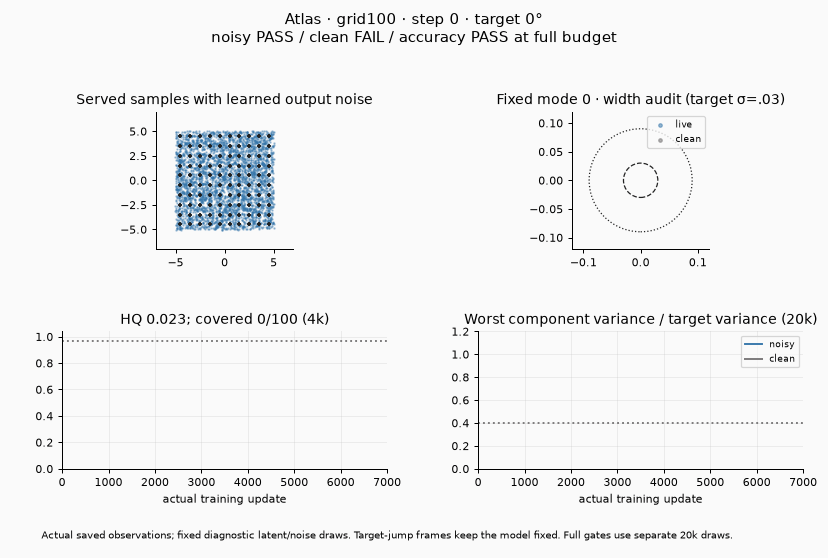
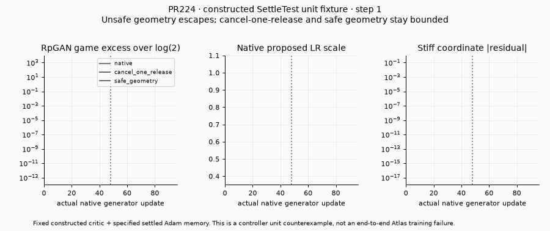

# What the highly rated tests verify

Ratings describe the test's scientific question, rather than whether today's
recipe passes. Exact parameters, budgets, sampling laws, endpoint metrics and
five-check terminal convergence results are in [catalog.json](catalog.json).
The [sorted catalog](PROBLEMS.md) includes every captured variant.

## 5/5 — Native 100-Gaussian distribution fidelity

**Question:** can an unlabelled adversarial model recover the distribution of
100 narrow Gaussians, rather than just put points near their centers?

`grid100` uses a 10×10 lattice; `rotated100` rotates it 25 degrees;
`staggered100` offsets alternating rows and contracts their spacing. All have
uniform component mass and isotropic sigma 0.03. The latter two test dependence
on axis alignment/lattice geometry. They are related geometry controls, not
three unrelated application domains. Training receives unlabelled draws; target
centers are available only to the independent evaluator and visualizer.

The full native gate uses 20,000 draws: all 100 modes, at least 0.5% genuine
three-sigma hits per mode, precision ≥0.97, mass TV ≤0.10, largest mode mass
≤0.02, every component covariance eigenvalue ratio in [0.40, 1.70], and every
component radial-median ratio in [0.65, 1.40]. The additional accuracy gate
requires mass TV ≤0.06, center RMS ≤0.20 target sigmas, absolute covariance
trace bias ≤0.10 and radial KS ≤0.04. Success must persist through the last
five recorded gate observations; an earlier good snapshot earns no terminal pass.

**Discriminating controls:** missing a component fails coverage; one atom at
each center can have excellent HQ yet fails spread; unequal occupancy fails
mass; too-wide or biased components fail shape/accuracy. This makes the test
substantially stronger than an attractive scatterplot or a mode-count score.

**Current result:** Atlas passes the noisy native and accuracy gates on all
three at 7,000 updates. The clean sampler fails all three native gates. For
grid100, the worst clean variance ratio is 0.0070, versus 0.6635 with output
noise; all 100 modes are present in both. The GIF keeps the clean and noisy
clouds visible in a fixed, preselected mode zoom. Thus this is evidence for
the declared noisy served distribution, not a clean-sampler pass or a public
default qualification.

Sources: [native evaluator](../../benchmarks/toy100/metrics.py),
[accuracy evaluator](../../benchmarks/toy100/accuracy.py),
[target sampler](../../benchmarks/toy100/problems.py).

## 5/5 — Unequal mass, unequal width and anisotropic mixtures

These are three distinct questions that a uniform isotropic mode farm misses:

| Test | Intended distinction | Important negative control |
|---|---|---|
| `vector_unequal_mass` | Recover masses 0.55/0.30/0.13/0.02, including a rare component. | Uniform mode occupancy, or dropping the rare mode. |
| `vector_unequal_width` | Recover sigmas 0.07/0.12/0.20/0.30 without imposing one shared width. | Correct centers with a common width, or center-only atoms. |
| `vector_anisotropic` | Recover each component's rotated covariance, including its narrow axis. | Correct average trace with a collapsed narrow axis. |

Their live evaluator combines normalized sliced W1 ≤0.18, mass TV ≤0.15,
HQ ≥0.85, resolved core covariance error ≤0.50, resolved minimum eigenvalue
ratio ≥0.15, and resolved spill ≤0.05. Unequal mass additionally requires
minimum mass ratio ≥0.25. Shape uses a four-sigma core and separately bounds
three-sigma spill. Components with fewer than 32 expected table atoms are
excluded from resolved shape aggregates; the rare component remains subject
to mass/coverage checks. **Its within-mode covariance is therefore not certified
when under-resolved.** Exact per-run particle counts are in the catalog.

Fresh synthetic evaluator checks accept independent target draws and reject
center-only, single-component and global-mean controls. These checks verify
the scorer, not a trained GAN. The frozen positive host passes unequal width
and anisotropy; unequal mass fails in this audit. That is a model/reference
failure, not evidence that rare-mode recovery is a bad problem.

Sources: [definitions and scorer](../../benchmarks/transfer_suite/vector_tasks.py),
[measured controls](scorer-controls.json).

## 5/5 — PR224's constructed stiff-game controller counterexample

**Question:** can coherent motion in a weak direction make the native
SettleTest release a common generator LR that a settled stiff direction cannot
safely tolerate?

The specified two-coordinate game uses the real E22 generator optimizer,
RpGAN loss and SettleTest, a fixed constructed nonlinear critic, and an
explicit settled Adam/AMSGrad memory. At half scale the stiff local factor
is 1.6; releasing to full scale makes it 3.2, outside the local Euler stability
interval (0,2). Weak-direction motion dominates displacement cosines; two-step
blocks can alias the alternating stiff updates.

**Controls:** cancel only the release at update 48 while retaining controller
history; separately change the prescribed geometry so the full-scale factor
is 1.6 and release is safe. These distinguish an unsafe release from an oracle
that simply forbids every LR increase.

The reproduced native game peaks at **4406.589**, versus initial log(2).
Cancel-one-release and safe-geometry controls stay near **0.693147**. Stability
is measured with the actual game, not an output-MSE training/guard surrogate.
This is a strong causal **controller unit fixture**. It does not establish
that a trained critic reaches this snapshot or that the complete Atlas
reopen guard/row/birth-death system fails.

Source: [PR224](https://github.com/255BITS/ParticleGAN/pull/224).

## 4/5 — PR226/227 native convergence diagnostics

**PR226 asks whether a stale asymmetric critic keeps moving an already-correct
paired prediction.** Public-loss identities isolate the odd force; matched
1,200-update profiles separate critic parity from D estimator variance. Removing
odd score/features lowers clean reporting RMSE from 0.053377 to 0.042724. The
affine path can solve the two-channel task without routing, and all G controllers
decide frequently: neither particle advantage nor a real-run stationarity delay
is established.

**PR227 asks whether initial H/b modulation causes a convergence gap within a
teacher-aligned adapter family.** Both families exactly realize the same teacher;
the within-particle initialization intervention changes only H/b before policy
construction. All four predetermined learned critics rank it ahead at 6,400,
and removing its trained codes worsens all four scores. H and b change together;
the teacher favors the ordinary initial basis, and the ordinary/particle baseline
has owner/policy differences. The unsigned ablation gate should become a positive
signed check before serving as a regression for beneficial particle contribution.

Both are strong bounded diagnostics with fixed-budget progress, rather than
absolute accuracy qualifications. The [full explanation, controls, retained
failure and two GIFs](PR226_PR227.md) preserve their later develop cohort separately.

## 4/5 — MisGAN incomplete-data and conditional-posterior tests

**Question:** can a model learn complete data from incomplete observations,
and can its imputer produce the right conditional distribution when an
observation admits several completions?

PR196 lifts the known 100-Gaussian grid to eight dimensions through a fixed
orthonormal map, adds small full-dimensional noise, and standardizes from
observed training entries. MCAR drops 20%, 50% or 80% of coordinates;
`block` uses four sensor-group masks. These are four actual observation laws,
not four training seeds. Masks are independent of the data. A fixed complete
test set and the analytic linear-Gaussian mixture posterior supply an oracle.

**Measure separately:** generated coverage/HQ, eight-dimensional sliced W1
and off-plane error; mask frequency/pattern fit; imputation mode accuracy,
accuracy on ambiguous rows, posterior mode TV, stochastic spread and missing
coordinate RMSE. A nice projected grid alone does not verify an eight-dimensional
law or a conditional imputer. Nonzero imputation standard deviation alone
does not verify which modes receive that randomness.

**Controls:** exact Bayes posterior draws and deterministic mean-fill on the
same fixed test rows. There are 16 conditional draws per row: even Bayes has
nonzero finite-sample TV, particularly at 80% missingness. Compare with that
floor rather than requiring TV=0. At 20% missingness only 16/10,000 test rows
are ambiguous, so their empirical accuracy is a weak discriminator; sampled
Bayes accuracy is a reference, not a hard ceiling on every finite realization.

Fresh runs of the original MisGAN arm use the current public recipe and EMA
evaluation, without Atlas being silently substituted into its three-pair loop.
The 50% case has almost deterministic imputations (std 0.00155); the block
case has randomness but poor ambiguous-row mode accuracy. A different
failure can therefore hide behind similar overall accuracy. All four training
GIFs and the fresh oracle values are linked in the catalog.

**Why 4, not 5:** the proposal has strong definitions and analytic controls,
but no prespecified binary convergence gate. Its reported model success must
not be inferred from one favorable scalar. The next test revision should
freeze tolerances relative to the Bayes finite-draw reference, including the
ambiguous subset and full-dimensional fidelity.

Sources: [PR196](https://github.com/255BITS/ParticleGAN/pull/196),
[fresh oracle measurements](misgan-oracles.json).

## 4/5 — Circle control and sprite dynamics, currently blocked

**Circle (PR22):** the learned policy receives current position, circle center,
target radius and signed angular step. It must learn radial recovery and
signed tangential motion from independent local state/action rows. Closed-loop
playback applies its action to the real displacement environment, without
circle projection, expert correction or replacing observation with a learned
next-state head. The 1,024-step radius-hold gate also checks direction/speed
and both direction groups. Zero, reversed and analytic-expert controls make
radius-only hovering or backwards motion visible. A detached tangent residual
is part of the published positive arm; this is not a pure from-scratch GAN.

Its actual bars are radial RMSE <0.10, signed-speed error <0.03, direction
agreement >0.95, no nonfinite episodes, overall episode success ≥0.50, and
worst-direction success >0.203125+0.15. The last margin references the
observed cartesian baseline; it is not an independently preregistered reliability
criterion. A passing arm is not required to succeed on 95% of episodes.

**Sprite (PR153):** learn current state, successor and rendered frame from
independent simulator records, then dream freely for 1/5/20/50 steps.
Compare to the exact simulator on held-out episodes and a ceiling-bounce OOD
law. State error and frame-to-state consistency must be checked separately:
convincing frames can accompany wrong dynamics. Direct supervised and
persistence controls distinguish the GAN/encoder composition from ordinary
prediction and doing nothing. Checkpoint selection uses validation only;
test/OOD results must remain separate. This verifies this fully observed
synthetic simulator, not general physical reasoning.

Both proposals fail **before training on pinned develop**. Circle imports
the removed `edit_cap` helper; sprite calls the removed
`Recipe.make_gradient_penalty`. Their historical endpoint media is retained
as context, explicitly labelled as rollout rather than training convergence.
They need a current host and training-checkpoint GIF before being used as
demonstrated current positives. No config/API repairs are included here.

## 4/5 — Bounded supporting regressions

**Broad mixture, overlapping mixture, spiral and annulus:** check the observable
distribution using sliced distance, means and covariance as appropriate.
Overlapping mixture labels are deliberately not treated as recoverable modes.
Global moments and finitely many slices do not prove equality of continuous
densities. Scale-drift tests changing units before a stationary final window,
not long-term adaptation to arbitrary target changes.

**Simple image stripes/bars/blobs/intensities:** enumerate all 32 clean live
particles and compare each 8×8 grayscale output to independent target templates.
Require HQ ≥0.90 and all declared modes for a five-observation terminal suffix.
This verifies template fidelity and coarse coverage. It does not require exact
uniform mass: all 30 two-template PR scorers accept a perfect **25/75** mixture.
RMSE is neither a dedicated count/topology oracle nor a conditional application
metric. The table names each proposed template's narrower claim explicitly.

**Paired behavioral edits:** trajectory, residual-student, unipolar, AE hold,
leftover coverage, unused-token hold and intermediate-strength identity test
specific intended updates and preservation constraints on small finite hosts.
Their distinct metric bounds are preserved in the catalog. They are useful
regressions, not evidence of natural-image editing or unseen application transfer.
`two_pole` is rated lower because travel plus bounded gradient does not require
both target modes. Ring `mode_hold` checks coverage/HQ, but lacks the native
100-Gaussian family's complete mass and within-component fidelity audit.

**PR45 unit change:** scale both the kernel lengths and particle initialization
with the ×32 target gauge. The archived factory replay reproduces FAIL/PASS.
This is a bounded demonstration that absolute length/init scales do not transfer
across units. It is not scale-invariance certification of today's public recipe.
Other wide-gap polygon PRs change the critic and initialization together, so
their successes do not isolate the critic as the cause. Keep one representative
scale test and the two-level pair hierarchy, rather than counting each polygon
as independent scientific coverage.

**Moving rotated100:** reacquire after two 30-degree target shifts. Fresh Atlas
passes the original ≥95-mode / ≥90%-of-initial-HQ end-of-phase criterion. It
fails the stricter native fidelity and accuracy gates at the end. There is no
paired frozen-model comparator in this GIF, and the moving criterion alone
does not establish complete conditional density recovery after each shift.
