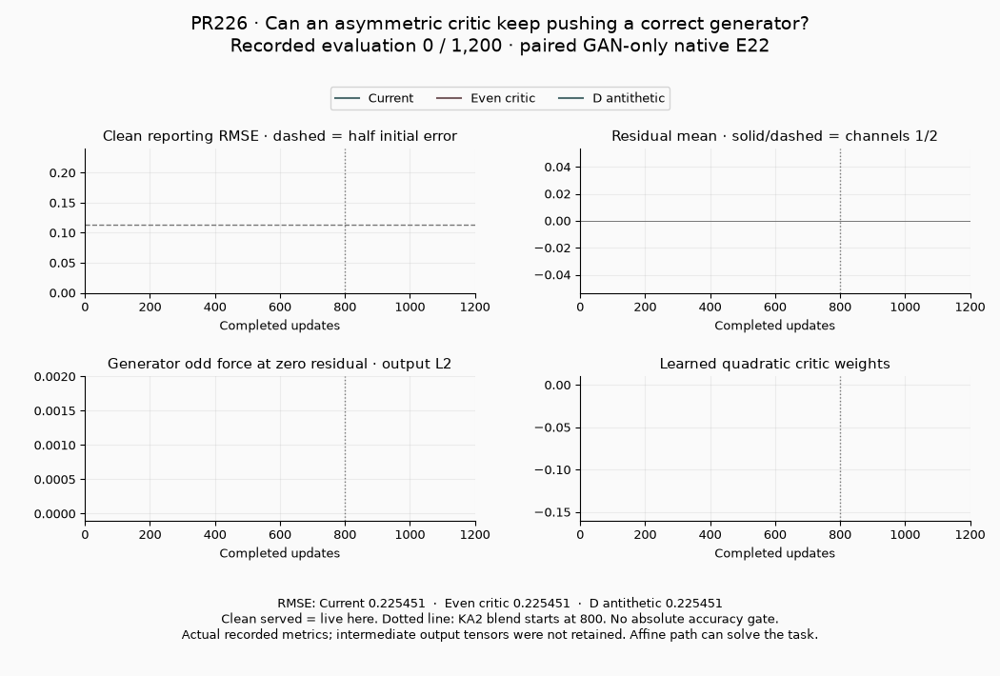
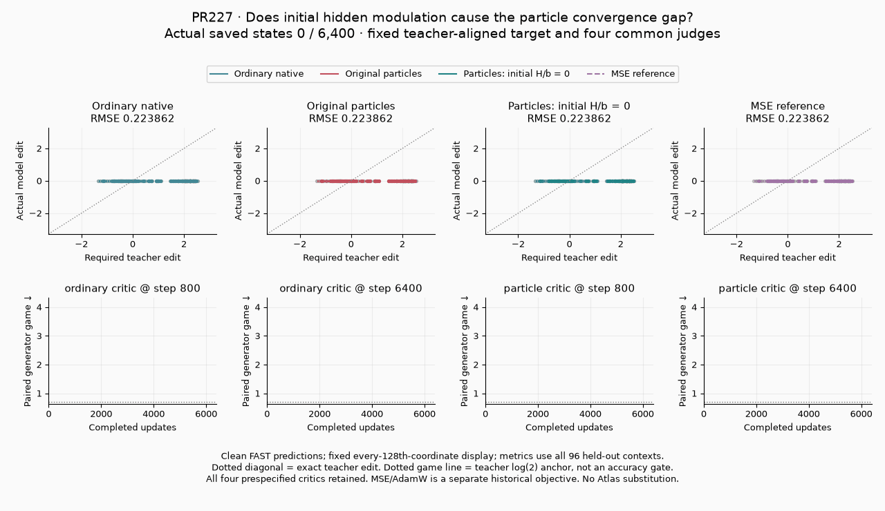

# PR226 and PR227: convergence-test review

Both proposals are useful, well-defined **4/5 diagnostics**. Their trained
evidence supports their bounded claims. PR227 has a contribution-gate weakness
that should be corrected before treating the long test as a regression for
beneficial particle use. Neither defines an absolute output-accuracy pass or
establishes full Nova/Qwen/Supra quality.

These are supplemental reviews after the original 134-PR snapshot. They use
develop `6ec7e5788e14ea15ddc3e16ac71110458108b6a6`, with proposal heads
`0e69fa60bf151762f8edc49bb714c6b7f8cf4804` (226) and
`b0e4f420856d7607baa98cbef488e569d20a3f31` (227). The original audit's
`4b16312e` results keep their original identities. Production configs and
trainers are untouched.

| Rank | Proposal | What the test verifies | Verdict |
|---|---|---|---|
| 1 · 4/5 | [PR226](https://github.com/255BITS/ParticleGAN/pull/226) | A stale odd critic can push a correct paired prediction; removing odd score/features reduces the residual bias in a matched learned game. | Good mechanism diagnostic with exact analytic controls and reproducible progress. The affine task can bypass routing. |
| 2 · 4/5 | [PR227](https://github.com/255BITS/ParticleGAN/pull/227) | Within a teacher-aligned, jointly realizable two-site adapter family, initial H/b modulation causes a learned-game convergence gap; zeroing it closes the gap while particles remain useful. | Good bounded initialization regression. Strengthen the signed code-ablation gate; general adapter superiority is outside scope. |

## PR226: asymmetric critic lag and estimation variance

The paired residual game supplies `z` as real and `z + prediction - target`
as fake. At zero residual, a critic `D(x) = v*x - k*x²` has zero **adversarial**
D parameter gradient, yet antithetic G draws leave residual derivative `-v/2`.
An even critic cancels this force. KA2 can still move the critic: the analytic
claim concerns the adversarial term, not a zero total regularized D update.

The public-loss oracle separately verifies the initial quadratic-head
cross-noise cancellation from antithetic D estimation, and the first pure-A
KA2 penalty `1.5/n²` for the specified mean-linear critic. That dimension law
depends on mean pooling; it does not apply universally to spatial critics or
the blended penalty phase.

The trained target is an exactly realizable affine edit of a frozen BF16 source.
Its 64-coordinate tensor contains two spatially repeated output channels. Fit,
protected guard and reporting grids contain 100, 64 and 144 disjoint contexts.
All three profiles retain the public routed 128×4 bank, native E22/KA2 lifecycle,
1.3 output noise, batch16 and common initialization/caller draws. RMSE is
reporting only. The parity intervention removes both odd score and features;
its complete native-policy consequences belong to that intervention.

| Profile | Initial clean reporting RMSE | Final at 1,200 | First recorded half-error |
|---|---:|---:|---:|
| Current | 0.225451 | 0.053377 | 600 |
| Even critic | 0.225451 | 0.042724 | 500 |
| D antithetic | 0.225451 | 0.052040 | 600 |

Removing the odd branch improves final RMSE **19.96%**; **59.4%** of its MSE
gain comes from lower mean bias. Antithetic D improves RMSE **2.51%**. These
are fixed-budget comparisons, not evidence that D variance is the dominant
remaining error. The half-error point is a progress marker, not an accuracy
qualification. All controllers make frequent G decisions; this fixture does
not reproduce the large run's long stationarity window. The affine path alone
can solve the target, so live bank gradients do not establish a particle advantage.

The GIF uses **16 actual recorded evaluations**, including early observations
at 10/25/50 updates. Clean served and live error coincide in this campaign.
Intermediate output tensors were overwritten by the runner; this is a metric
animation, with no reconstructed or interpolated sample clouds.

Sources: [frozen protocol](https://github.com/255BITS/ParticleGAN/blob/0e69fa60bf151762f8edc49bb714c6b7f8cf4804/reports/paired-residual-toy/protocol.json),
[training loop](https://github.com/255BITS/ParticleGAN/blob/0e69fa60bf151762f8edc49bb714c6b7f8cf4804/examples/e22_paired_residual_toy.py),
[component oracle](https://github.com/255BITS/ParticleGAN/blob/0e69fa60bf151762f8edc49bb714c6b7f8cf4804/experiments/paired_residual_oracle.py).

## PR227: initial hidden-feature distortion

Both ordinary rank-two LoRA and the two-site routed particle adapter can
exactly realize the teacher. The witness checks complete outputs on fit,
guard and held-out panels before training. The teacher's down basis matches
the students' initial ordinary basis. Held-out times and latent grids are
different; the six source identities are shared, so this is not unseen-subject
generalization.

The controlled particle intervention zeros only initial hidden bridge `H` and
bias `b`, before policy/EMA construction. The sampled particle gate `C`, shared
128×4 bank, sequential routing and all trainable owners remain. Both initial
up factors are zero, so initial outputs stay identical while their learning
features change. H and b change together; the test cannot identify their
separate effects or uniquely establish feature distortion as the mediator.

Both native arms train their own conditional critics. Scoring every saved
generator with **all four prespecified common critics**, at each native arm's
800 and 6,400 updates, avoids ranking incomparable moving own losses. The
teacher anchor is log(2); each judge ranks the declared teacher-to-fresh
residual path monotonically. These judges are learned from this task, rather
than an independent universal quality oracle.

| Configuration at 6,400 | Ordinary D800 | Ordinary D6400 | Particle D800 | Particle D6400 | Output RMSE diagnostic |
|---|---:|---:|---:|---:|---:|
| Ordinary native | 0.719085 | 0.923587 | 0.725256 | 0.930792 | 0.047493 |
| Original particles | 1.022885 | 1.504398 | 1.185411 | 2.304944 | 0.135631 |
| Particles, initial H/b zero | **0.702292** | **0.802713** | **0.704504** | **0.800708** | 0.034320 |
| Historical ordinary MSE/AdamW | 0.709138 | 0.819877 | 0.709846 | 0.831208 | **0.031274** |

Lower common game loss is better. The historical MSE arm has a different
training objective/optimizer and stays separately labelled. The ordinary and
particle native arms also differ in owned optimizer groups and policy feedback;
their initial gap is a complete-configuration comparison. The within-particle
H/b intervention supplies the more precise causal test.

Removing the neutral arm's trained particle codes worsens its game by
**0.755647 / 0.584848 / 1.185280 / 0.930370**, respectively. Together with
live bank/router gradients and trainable nonzero C, this demonstrates retained
useful particle participation in the measured run. No structural move was
accepted; the fixture therefore does not exercise a successful birth/death edit.
It shows better fixed-horizon progress, not exact recovery of the teacher or
a calibrated absolute convergence threshold.

The GIF restores **33 scheduled states per arm**, retains all four judges and
shows fixed every-128th output-coordinate pairs against the required teacher
edit. Metrics use every held-out context. Predictions are clean FAST outputs,
without DV12/output-noise draws; scores use the original private paired
Gaussian panels at sigma0.125. Both GIFs use the proposals' declared native
routed E22/KA2 execution; changing to an Atlas native-grid fixture would change
the tested host and question.

### Follow-up: require a beneficial signed code-ablation effect

The [long regression's assertion](https://github.com/255BITS/ParticleGAN/blob/b0e4f420856d7607baa98cbef488e569d20a3f31/tests/test_e22_routed_convergence_long.py#L99)
currently requires `abs(zero_code_minus_live) > 1e-6`. The
[intervention runner](https://github.com/255BITS/ParticleGAN/blob/b0e4f420856d7607baa98cbef488e569d20a3f31/examples/e22_routed_convergence_neutral.py#L273)
and [recovered scorer](https://github.com/255BITS/ParticleGAN/blob/b0e4f420856d7607baa98cbef488e569d20a3f31/examples/evaluate_e22_routed_convergence_neutral.py#L148)
use the same unsigned condition. This establishes an effect, but accepts
particles that make the game worse.

An executed **synthetic gate control** substitutes an ablated score 0.01 below
the live score under each judge, retaining all other actual checkpoint and
game assertions. The original tensor-based regression still returns normally.
This is a gate counterexample, not another trained model. The measured artifact
deltas above are all positive, so the weakness does not invalidate the current
beneficial-participation result.

For a regression claiming useful particles, require
`zero_code_minus_live > 1e-6` under every mandatory judge in all three paths,
and add a negative-direction control. Preserve the original outcomes. H/b
neutralization remains an initialization diagnostic on this teacher-aligned
family, not an instruction to change production defaults.

## Independent verification and retained failure

- PR226: **25 focused tests pass**; 17 retained artifact hashes match the
  committed measurements, all 48 metric observations are hash-bound, 39
  compact curve points match numerically, and all 1,200 caller-chain records
  match across profiles.
- PR227: **14 focused tests pass; one full-training opt-in test is skipped**.
  Its actual tensor-based long-test assertion separately passes the retained
  endpoints. All **136 saved states** restore exactly. Independently computed
  scores for **132 held-out rows × four judges** match the saved curves with
  maximum absolute difference **0.0**; observation leaves owned state/RNG intact.
- PR227's original post-training scorer failure remains preserved. The repaired
  helper creates a fresh policy before restoring the unresolved step-zero
  checkpoint. AST comparison confirms this is the sole source repair; original
  training artifacts match the recovered receipt. This is a repaired reporting
  failure, not an unresolved training failure.
- Both proposal CI matrices pass Python3.10/3.11/3.12 and distribution builds:
  [226 CI](https://github.com/255BITS/ParticleGAN/actions/runs/36912219096),
  [227 CI](https://github.com/255BITS/ParticleGAN/actions/runs/36916280800).
  CI does not run the opt-in 6,400-step regression.

The PR226 campaign retains its measured Python3.11/Torch2.11 runtime. PR227
training and this independent review use Python3.12.13/Torch2.13.0. No unchanged
training campaign was rerun. Compact identities/results are in
[convergence-addendum.json](convergence-addendum.json), with the observation-only
reproducer and artifact locations in [PROVENANCE.md](PROVENANCE.md).
