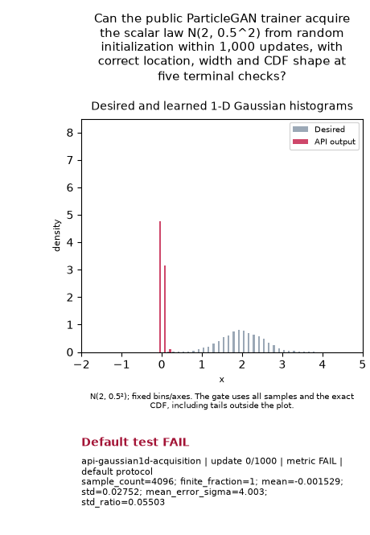

# 1-D Gaussian histogram matching

Can ParticleGAN learn `N(2, 0.5²)` from random initialization within a small
fixed budget? This new question tests acquisition of location, spread and the
whole scalar CDF. Histogram bins illustrate training; they do not grade it.

The [Forge task](../../../../configs/forge/tasks/gaussian1d_acquisition.json)
is the first required Tier 1 task in `discriminator_stability` revision 4.
That view has **6/19/2** required tasks and reserves **2,220 seconds** for the
complete Tier 1. The new task reserves at most **120 seconds**, one CPU thread.
[The v2 campaign](../../../../configs/forge/campaigns/tier1-acquisition-v2.json)
covers the expanded reservation; historical campaigns and evidence keep their
original view. Placement is provisional until independently calibrated.

## Frozen protocol

One standalone public `GANTrainer` run: protocol seed 0, **1,000 updates**,
batch 128, 256 learned MoG rows with two latent coordinates, fixed latent
sigma .025, uniform weights and no standardization. The shared MLP generator
has one scalar output; G/D use width 32, two hidden layers, and D has two
Fourier bands. G/D use deterministic orthogonal seeds 0/1; initial prior
locations are independent Gaussian draws with standard deviation .5.

The public K3P recipe uses LR .00425, D multiplier 1, prior multiplier 2,
betas (0,.999) and prior regularization 0. Training noise follows the resolved
recipe. Evaluation samples the live public MoG/G law with `output_noise=False`;
MoG kernel noise remains. The receipt records the actual recipe and training
noise. This standalone initializer/RNG cohort is separate from Forge's named
streams and supplies **no ordinary whole-view qualification or default credit**.

Before training, freeze 4,096 samples at 24 evenly spaced post-update checks.
All five terminal checks, updates **834, 875, 917, 959, 1,000**, must pass:

| Metric | Bound |
| --- | --- |
| Finite fraction | 1 |
| Sample count | ≥ 4,096 |
| Absolute mean error / target sigma | ≤ .20 |
| Sample standard deviation / target sigma | [.80, 1.20] |
| KS distance from the exact Gaussian CDF | ≤ .05 |

Independent oracle draws and destructive controls test the evaluator without
training: point collapse, shifted location, doubled width, same-moment two-point
and uniform laws, nonfinite samples and undersized evaluation. Controls do not
calibrate the tier. No seed sweep, automatic tuning or continuation is declared.

## Reproduce

Run from the repository root. Each execution needs an unused ignored directory.

```sh
python -m benchmarks.toy_audit.gaussian1d_experiment controls \
  --output /tmp/gaussian1d-controls.json
mkdir -p runs/api/gaussian1d-reproduction
OMP_NUM_THREADS=1 MKL_NUM_THREADS=1 OPENBLAS_NUM_THREADS=1 \
  timeout 120s python -u -m benchmarks.toy_audit.api_run \
  --case api-gaussian1d-acquisition --device cpu --wall-cap-seconds 120 \
  --output runs/api/gaussian1d-reproduction \
  > runs/api/gaussian1d-reproduction/runner.log 2>&1
tail -F runs/api/gaussian1d-reproduction/runner.log
python -m benchmarks.toy_audit.gaussian1d_experiment publish \
  --raw runs/api/gaussian1d-reproduction/api-gaussian1d-acquisition \
  --output /tmp/gaussian1d-publication
```

The run returns nonzero on FAIL. Raw logs, observation arrays and checkpoints
stay under ignored `runs/api`; publish only controls, endpoint/terminal metrics,
provenance and the actual-training GIF. The existing
[current solution leaderboard](../../../forge/technique-inventory.md) retains
its source-bound revision-3 results. The [archived view](../../../../configs/forge/view-history/discriminator_stability-v3.json)
preserves that exact five-task policy. Revision 4's additional scalar cell is
unmeasured in ordinary qualification; the standalone result does not fill it.
This task readout creates no competing ranking.

## Completed result

**A close scalar fit in 4.953 seconds; strict acquisition FAIL.** The single
CPU run completed all 1,000 updates and 24 numerical checks. Twelve checks passed,
including three of the five terminal checks. All terminal observations passed
location, width and finite-output bounds; updates 875 and 1,000 failed the CDF
shape bound. No retry, seed variation, continuation or threshold adjustment ran.

| Endpoint metric | Measured | Target or bound | Result |
| --- | ---: | ---: | --- |
| Mean | 2.02749 | 2.0; error ≤ .10 | PASS |
| Standard deviation | .52790 | .5; accepted [.4, .6] | PASS |
| Mean error / sigma | .05498 | ≤ .20 | PASS |
| Standard deviation ratio | 1.05580 | [.80, 1.20] | PASS |
| Exact-CDF KS | .05674 | ≤ .05 | FAIL |
| Finite fraction | 1 | 1 | PASS |
| Evaluation samples | 4,096 | ≥ 4,096 | PASS |
| Terminal joint checks | 3/5 | 5/5 | FAIL |

The untrained generator had mean -.00153, standard deviation .02752 and KS
.99980. Training therefore acquired the displaced mass and most of the spread.
Terminal KS distances were .03174, .05208, .04563, .03802 and .05674 at updates
834, 875, 917, 959 and 1,000. Their variation demonstrates that an isolated
passing endpoint would not establish sustained acquisition. These finite-sample
scores do not distinguish sampling fluctuation from training-state variation.
The shape failure does not identify the critic formulation as the cause.

The measured public recipe retained input noise .5, output noise .029 with a
.2-budget warmup, and a 1,000-update horizon. Scoring removed additive output
noise while retaining fixed MoG kernel noise. The full recipe, prior,
initializer, sampling law and Python/Torch/CPU cohort are in the
[compact endpoint and terminal receipt](results.json). Execution source is
`f28dd8fd`; its full commit and Python file hashes are recorded there. The
elapsed time covers construction, training and numerical evaluation; it excludes
GIF rendering and supplies no speed ranking against other hardware.

**Recommendation:** retain this inexpensive, provisional Tier 1 question and
its numerical failure. Before introducing a more complex 1-D target, test one
substantive, preregistered stability hypothesis on this same question; its
recipe, budget and evidence identity must remain explicit. This result does not
justify relaxing the CDF bound or adopting a training default.

[Oracle and destructive controls](controls.json) all behaved as declared,
with zero training updates. The [actual-training histogram GIF](goal.gif)
contains nine retained states, fixed bins and axes, and numerical gate labels.
The exporter verified original arrays, media hashes and the full protocol;
publication added zero training or scoring updates. Bulk evidence remains in
`runs/api/gaussian1d-acquisition-v1/` and is excluded from Git.


