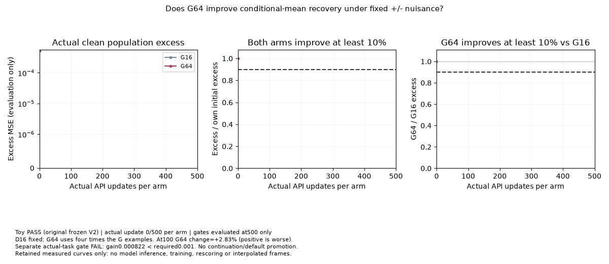

# PR236: conditional-mean recovery with a larger generator batch

**Keep, 4/5 for the bounded diagnostic question. Original fixed500 toy PASS;
separate real-task gate FAIL.** The question is whether G64 improves the final
conditional-mean excess error over G16 after the same 500 updates, with D16
fixed and native E22 controls active. Hidden, symmetric `+/-` nuisance labels
are unidentifiable from the generator inputs. This verifies conditional-mean
recovery; it does not verify nuisance distribution coverage or the optimum of
the learned GAN game.



The GIF contains exactly 12 recorded evaluation states at updates
`0, 1, 50, 100, 150, 200, 250, 300, 350, 400, 450, 500`. Its first panel shows
the measured clean population excess; the other panels show the two original
numerical gates. Connected points join actual observations. No additional
frames, model predictions, training updates, or metric rescoring were created.
No spatial prediction snapshots were retained, so this illustration uses the
actual measured curves.

| Frozen endpoint quantity | G16 | G64 |
| --- | ---: | ---: |
| Initial live excess | 0.0005141192814335227 | 0.0005141192814335227 |
| Final live excess | 0.000010215697329840623 | 0.000008308770702569745 |
| Final / own initial | 0.019870286329966298 | 0.016161173102479907 |
| Actual native updates | 500 | 500 |

G64's final excess is 18.6666% below G16's. At update 100 it is 2.8327% worse.
G64 uses four times as many generator examples per update, so this does not
establish equal-compute speedup or sustained dominance. Both arms share the
same four caller RNG streams and complete caller-panel history; private native
DV12 consumption can differ with batch size.

The original binary requirements remain unchanged: complete 500 updates per
arm within the combined 60-second CPU1 protocol; identical caller streams;
frozen sources; finite, owned native health in both arms; each endpoint at
most 90% of its own initial live excess; and G64 endpoint at most 90% of G16's.
All eight recorded gate flags match an independent arithmetic evaluation of
the retained observations. No new threshold was fitted to these results.
The original full campaign took 27.0727267 seconds.

The separate actual-task observation remains **FAIL**: after 100 updates from
the 4600 checkpoint, LPIPS improvement was 0.0008224256082692005 against the
required 0.001, a shortfall of 0.00017757439173080036. It does not qualify a new
default, extension, or task-wide benefit. Its original
[results and limitations](../../../../docs/routed_generator_batch_20261002_results.md)
remain intact. The existing 176-case API campaign and all its statuses remain
unchanged; PR236 is a separate follow-up question.

## Reproduction and retained export

From the repository root, this explicit future command runs the actual public
API caller once under its original fixed 500/60-second CPU1 protocol, checks
the complete result, then exports its genuine measured observations:

```sh
python -m benchmarks.toy_audit.batch_toy_media \
  --reproduce --input /tmp/pr236-new-raw --output /tmp/pr236-new-media
```

Both directories must be new. The child is
`examples/routed_generator_batch.py --output <input>/attempt`, with no seed,
recipe, budget, source, or gate override. The helper verifies all 37 frozen
publication source files before and after execution and enforces a 60-second
subprocess timeout. A changed source, fixture, teacher, initialization,
stream history, nonfinite health, missing observation, partial budget, or
contradictory child exit rejects publication with exit 2. A complete numerical
FAIL retains failure media and exits 1; only a complete gate PASS exits 0.
A different seeded runtime identity is not accepted as the same reproduction.

The committed GIF used this retained-only command, with **no** `--reproduce`:

```sh
python -m benchmarks.toy_audit.batch_toy_media \
  --input /ml2/hypergan/routed-generator-batch-v2-artifacts-20261002 \
  --output /ml2/hypergan/toy-pr236-media-final-export-20261002
```

## Source and artifact bindings

[receipt.json](receipt.json) binds all five consumed raw files to the original
public evidence: `source.py`, `protocol.json`, `result.json`, and both 500-row
JSONL traces. It contains only the 24 selected per-arm observations, fixed
fixture/teacher/five-role initialization identities, original gate flags,
source identities, and media hashes. Full streams and checkpoints remain
outside Git. Checkpoints were not read for this export and have no claimed
original public-card attestation.

The reviewed original PR236 head is
`e71265fd7b77ae2ab70ccbf8b7f0049c3d539b84`. The original executed driver SHA256
is `85e23d03a3c8a583c2b928b024fa48b3c16a425364c64f0f92c03bb194d7adba`;
its protocol SHA256 is
`f302530f82d9f0ff6ce28d7e6b38b3e547212c5313b7631813acbd7ee8f1bd3d`.
The publication protocol is separately bound to
`08c7d8f90ede0d2f8b416ad9434e0c55d89530158d53af8b58727d7540f5b088`.
Its 26 scientific function/class AST nodes match the original driver; the
publication source plumbing does not retroactively become the executed
original source.

The exporter was committed before rendering at
`72662f24134809e2fade554793489da9041c5f85`, with module SHA256
`4c71ce4a7fa86e97c60887ec65c8b6a84a795cefe0306c80e92e4f340e9bde15`.
The 12-frame GIF SHA256 is
`41979682b2abda1fd6d22e23173e5d8c123d975594f9e1e2d6e4066a7d4bab5d`.
Original raw files, selected numerical observations, and exporter bytes were
checked unchanged across the retained export. The original cards and archived
receipts were not rewritten.

## Software validation

```sh
CUDA_VISIBLE_DEVICES='' OMP_NUM_THREADS=1 MKL_NUM_THREADS=1 \
  python -m pytest -p no:cacheprovider -q \
  tests/test_batch_toy_media.py tests/test_routed_generator_batch_public.py \
  tests/test_routed_generator_batch_identity.py
```

36 tests passed in 9.86 seconds: 29 self-contained media/reproduction controls
and 7 original public API/source contracts. Independent reviewers also passed
the same 29 helper controls. Negative controls cover partial or missing
protocol evidence, false endpoint/pass flags, nonfinite weights/health,
changed panel/RNG/source/fixture identities, exit-status contradictions,
timeout/error rejection, and a full numerical FAIL that preserves failure
media with a nonzero exit. These software controls need no historical Git
objects, raw scientific datasets, or scientific training in shallow CI.
