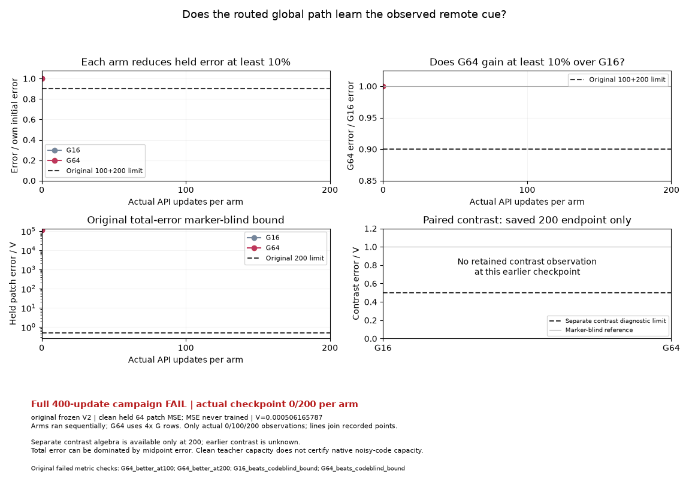

# Observed remote cue and paired contrast: PR246

This distinct public-API toy asks whether increasing G's caller batch from 16 to
64 improves learning of a required, observed remote conditioning signal. The
direct CNN cannot see the remote marker on the evaluated patch; the global
encoder, routed bank and FiLM path can carry it. Both arms keep D16, the same
fit-only target normalization, teacher, initialization, caller panels, native
policy, GAN-only objective, 200-update budget and fixed gates.

The original full 400-update campaign **FAIL** is preserved. Both arms reduce
their held error substantially, but G64 misses the required 10% advantage at
both endpoints. Both also miss the original total-error bound of 0.5 times the
teacher's marker-blind variance V. A separate previously executed saved-200
diagnostic finds contrast error near V while midpoint error dominates total
error. It establishes little remote-marker contrast was learned in this fixed
fixture and budget; it does not establish a ParticleGAN or real bridge defect.

| Actual API updates per arm | G16 clean held patch MSE | G64 clean held patch MSE | G64 gain over G16 |
| ---: | ---: | ---: | ---: |
| 0 | 56.984703064 | 56.984703064 | 0% |
| 100 | 2.945585966 | 2.946149826 | -0.019143% |
| 200 | 1.598696470 | 1.594727516 | 0.248262% |

V is 0.0005061657866463065. At the saved 200 endpoint, the separately attested
contrast errors/V are 1.000345118 (G16) and 0.996276603 (G64), above its 0.5
diagnostic bound. This contrast diagnostic supplies no replacement campaign
gate or additional training qualification.



The three frames show only actual recorded evaluations at 0, 100 and 200 updates
per arm. Lines connect recorded metric points. No intermediate model image
arrays were retained. Contrast is explicitly unknown in the earlier frames and
appears only at the separately observed saved endpoint. All axes are fixed
across frames, both original 10% goals and the code-blind bound are visible, and
the completed campaign's FAIL remains prominent. Arms ran sequentially; G64
uses four times as many G rows, so this is not an equal-compute or speed claim.

The definition merits **4/5** as a bounded diagnostic: explicit public API,
complete numerical/health gates, a distinct required-context law, and honest
negative evidence with goal media. The prescribed teacher encoder scale 320,
small pooled cue, and native DV12 perturbations limit transfer and leave exact
noisy-code capacity unresolved. This rating does not promote learned quality,
alter any default, or fill the existing 176-variant qualification campaign.

Unlike the earlier batch toy's unobserved nuisance and conditional-mean target,
this fixture makes the marker an observed required distinction. It also
retains additive and multiplicative FiLM code paths; it is useful independently
of code-column initialization and critic-lag controls. Keep this question and
its failed result. No duplicate closure or remote mutation was performed.

[The compact media receipt](receipt.json) binds the exact PR246 head
`b35dee597943c95499ca4a94d3cd141bd19f8fda`, original scientific source/protocol,
all displayed observations, separate endpoint diagnostic, and exact committed
exporter/dependency bytes. Original result/source/protocol and the separate
diagnostic have public hash authorities. The two full per-step traces receive
an explicitly labeled export-time identity; the original public card did not
attest their file hashes. Checkpoints are neither consumed nor claimed here.
The original raw archives remain outside Git and unchanged. Export performs
zero model forwards, updates, draws or model-metric rescoring.

The [original result and limits](../../../../docs/routed_remote_conditioning_results_20261002.md)
and [public protocol guide](../../../../docs/routed_remote_conditioning_20261002.md)
remain unchanged. To reproduce this media from the retained original evidence:

```sh
python -m benchmarks.toy_audit.remote_conditioning_media \
  --runs /path/to/routed-remote-conditioning-v2-artifacts-20261002 \
  --decomposition /path/to/routed-remote-conditioning-decomposition-20261002 \
  --output /tmp/remote-conditioning-original-media
```

A future scientific reproduction uses the original public caller, followed by
an observation-only exporter. These commands were documented, not executed in
this media follow-up. Use new directories and the bound PR246 public source
bytes; source drift is refused. The caller exits 0 for all gates PASS, 2 for a
complete metric FAIL, and 1 for an invalid attempt. The successful media export
exits 0 independently and records the scientific verdict explicitly; partial
or invalid evidence is rejected before creating its output directory.

```sh
timeout 60s env PYTHONPATH=. OMP_NUM_THREADS=1 MKL_NUM_THREADS=1 \
  python -u examples/routed_remote_conditioning.py \
  --output /tmp/remote-conditioning-new
# For a complete result, including a completed metric FAIL with caller exit 2:
python -m benchmarks.toy_audit.remote_conditioning_media \
  --runs /tmp/remote-conditioning-new --fresh \
  --output /tmp/remote-conditioning-new-media
```

The publication caller already records paired algebra on its existing clean
predictions. A fresh export uses those actual 0/100/200 paired observations and
cannot borrow the original saved-endpoint diagnostic. It keeps that new source
cohort separate from this original GIF.

Validation: 26 self-contained software controls pass in 2.23s; Ruff passes.
Controls exercise full-budget rejection, actual checkpoint coverage, source
identity, numerical/health finiteness, caller histories, unchanged gates,
contrast arithmetic, raw-file immutability and exactly three decoded GIF frames.
Synthetic controls need neither a historical Git object nor local raw archives
and confer no scientific qualification. All three actual GIF frames were
inspected for readable goals, original FAIL, and honest missing contrast.
