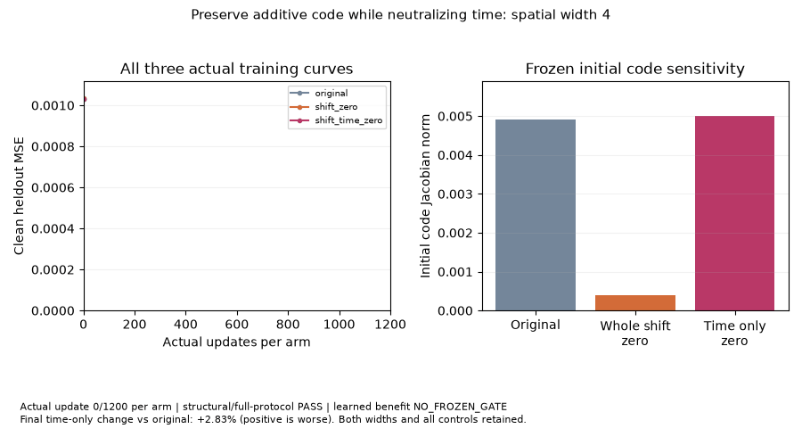
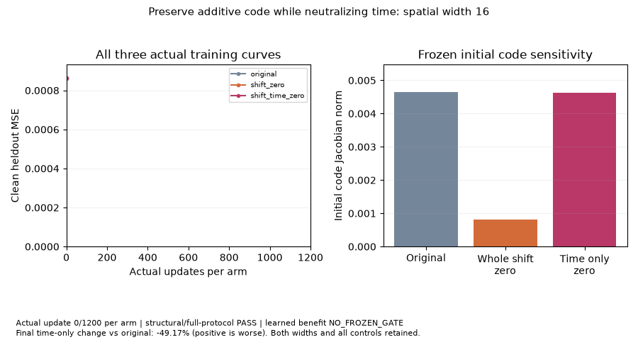
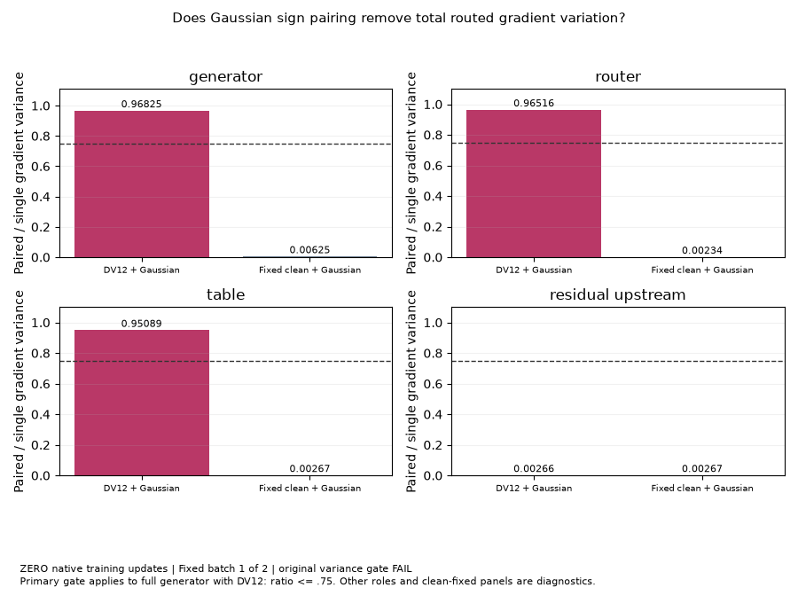
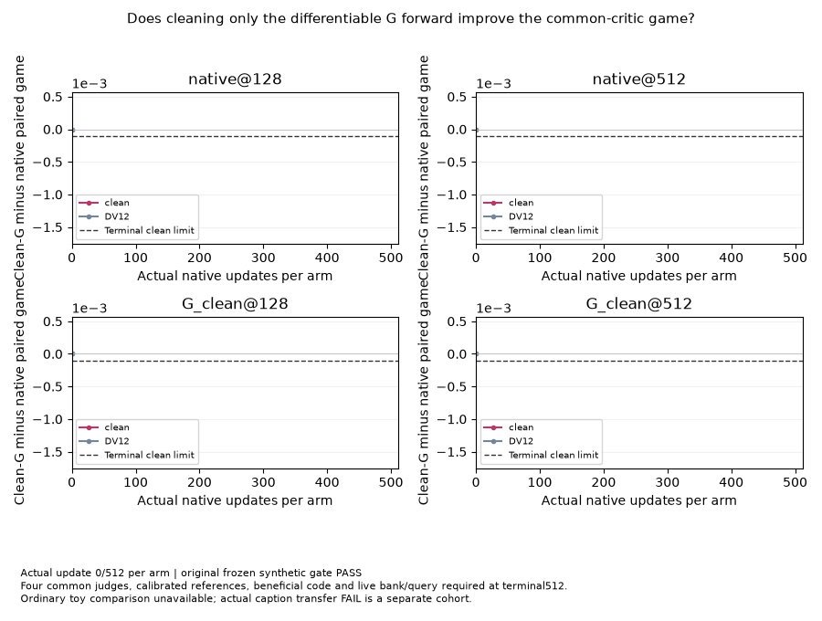

# Recent open toy PRs:233–235

Keep all three: each asks a distinct, useful question. Each earns **4/5 for its bounded definition**. Their learned outcomes remain separate from that rating and from the frozen176-variant/110-question API campaign. These three standalone questions bring the combined question coverage to113 and add four goal GIFs. No training, model rescoring, production change or remote PR mutation occurred during this review.

| PR | Distinct purpose | Original result | Follow-up contract |
|---|---|---|---|
| [233](https://github.com/255BITS/ParticleGAN/pull/233) | Preserve additive code columns while zeroing only time columns, on spatial hosts of widths4/16 | Learned benefit **NO_FROZEN_GATE**; width4 worse2.83%, width16 better49.17%; actual NovaQwen transfer worse3.32% | Source numerical code-retention controls and all six1200-update finite protocols **PASS**; learned benefit remains unqualified |
| [234](https://github.com/255BITS/ParticleGAN/pull/234) | Measure total public routed gradient-variance reduction from Gaussian sign pairing in the presence of DV12/BF16 | Ratio0.978547 exceeds0.75: **FAIL**; ownership controls PASS | Same gate and failure preserved; explicitly **zero native updates**, not a convergence animation |
| [235](https://github.com/255BITS/ParticleGAN/pull/235) | Disable perturbation only on the differentiable G forward while retaining D DV12 and native draw cadence | Frozen512-update synthetic four-judge gate **PASS**; separate actual caption transfer **FAIL** | Same terminal relative-game gate; ordinary-toy comparison unavailable; no absolute or sustained fit claim |

The existing `api-film-*` arms use the vector FiLM host and whole additive erasure. They do not duplicate233’s spatial/time-only code control. Existing D-antithetic and critic-lag arms ask about trained fit or force, rather than234’s centered estimator variance. Existing routed acquisition arms alter initialization;235 isolates G-forward perturbation. None merits duplicate closure.

## Actual observed GIFs

Each animation uses retained measurements and finite fixed axes. There are no invented intermediate checkpoints, interpolated samples or newly selected endpoints.

**233, spatial width4:** all three actual clean heldout curves, plus the frozen initial code Jacobian control. Thirteen observations at updates0,100,…,1200 per arm.



**233, spatial width16:** the same protocol at the second frozen width; its favorable result does not erase width4 or the failed real-task transfer.



**234:** three actual estimator phases: fixed batch1, fixed batch2, and the ratio of their mean variances. Both total DV12+Gaussian and fixed-clean Gaussian controls are displayed for each owned parameter role. The0.75 gate applies to the full generator’s total variance.



**235:** nine actual common-judge observations at updates0,64,…,512 per arm. The final clean-game bound is relative to native under four judges. DV12 diagnostic curves and intermediate regressions remain visible.



## Reproduction through the public API

Use a checkout containing the exact selected PR sources and this exporter. The wrapper verifies caller/test/native source bytes before invoking the original public caller; it uses neither a copied training loop nor a new optimizer recipe. It records commands, caps and raw stdout in the new input directory. Each command below creates a **new, separate cohort**, requires unused paths and does not replace the original receipts:

```bash
python -m benchmarks.toy_audit.recent_toy_media --pr 233 --reproduce \
  --input /tmp/new-film-code --output /tmp/new-film-code-media
python -m benchmarks.toy_audit.recent_toy_media --pr 234 --reproduce \
  --input /tmp/new-routed-variance --output /tmp/new-routed-variance-media
python -m benchmarks.toy_audit.recent_toy_media --pr 235 --reproduce \
  --input /tmp/new-clean-g --output /tmp/new-clean-g-media
```

233 invokes `python -m benchmarks.routed_conditioning.spatial_damping` for the original three profiles at both widths,1200 updates each and900s per width, after the source software controls. 234 invokes `examples/e22_routed_antithetic_variance.py --fixture routed-dv12 --bf16`,120s cap and zero updates. 235 invokes `examples/e22_routed_g_clean.py --run`,512 updates per arm and300s cap. CPU uses one thread. The exact resolved source/profile recipes remain in the original caller artifacts.

A complete variance FAIL returns exit1. A partial, missing, unbound or nonfinite protocol returns **INCOMPLETE/exit2 before a qualification/media receipt**, even if233’s original capped caller exited0. 233’s exit0 means structural/full-protocol PASS; it never implies a learned-benefit gate. The wrapper refuses a preexisting output or raw reproduction directory.

For media-only export from a retained exact archive, omit `--reproduce`; this reads evidence and never trains:

```bash
python -m benchmarks.toy_audit.recent_toy_media --pr 233 \
  --input /ml2/hypergan/routed-film-code-preserved-artifacts-20261002 \
  --output /tmp/review-film-code
python -m benchmarks.toy_audit.recent_toy_media --pr 234 \
  --input /ml2/hypergan/ParticleGAN-antithetic-variance-public-develop/runs/routed-dv12-first.json \
  --output /tmp/review-routed-variance
python -m benchmarks.toy_audit.recent_toy_media --pr 235 \
  --input /ml2/hypergan/ParticleGAN-routed-g-clean-toy-develop/runs/routed-g-clean-v1 \
  --output /tmp/review-clean-g
```

## Verification and source bounds

The self-contained software controls passed **26 tests in11.96s**, with zero native updates. They reject incomplete budgets, forged endpoints, empty source bindings, unknown native manifests, nonfinite optimizer health, inconsistent variance ratios/aggregates, empty code-branch norm checks and missing judges. Fresh partial1199-update and endpoint controls have no old summary hash that could mask their numeric rejection. The original exact-head software suites passed29/9/12 checks for233/234/235 respectively. All four GIFs were decoded and visually inspected; their bytes match the reviewed previews.

The final exporter was committed before export at `02215b50fae7189db3c132b72cfb0d7f93ee320f`; each receipt binds that commit/file to SHA256 `71fb5ea6a15f40f87d0d586394b1ae80326517ac0362bc2172926095fc732a98`. All bound raw files are checked unchanged before and after rendering. Original preview exports remain outside Git in `/ml2/hypergan/toy-recent-pr-media-first-export-20261002`; the final export is a separate directory.

233’s published campaign/readout/JUnit attest the summary digest, evaluation curves, initial Jacobians, serving endpoints and source/native manifests. Its per-update trace, metadata and checkpoint hashes are **export-time identities only**: the historical readout did not contain those hashes.234’s source card attests the portable first receipt; it contains fixed-batch summaries, not saved per-pair vectors.235’s card attests the report, completion, two traces and retained tensors. No model or metric was recomputed for these GIFs.

[coverage.json](coverage.json) records exact PR heads, source paths/hashes, completed CI snapshots, distinct-purpose mappings, original and added-gate statuses, scoped source commits, all media hashes and receipt bindings. The source/publication cards retain the separate real-task failures. These reports do not promote a scientific default or rewrite the original176 outcomes.
