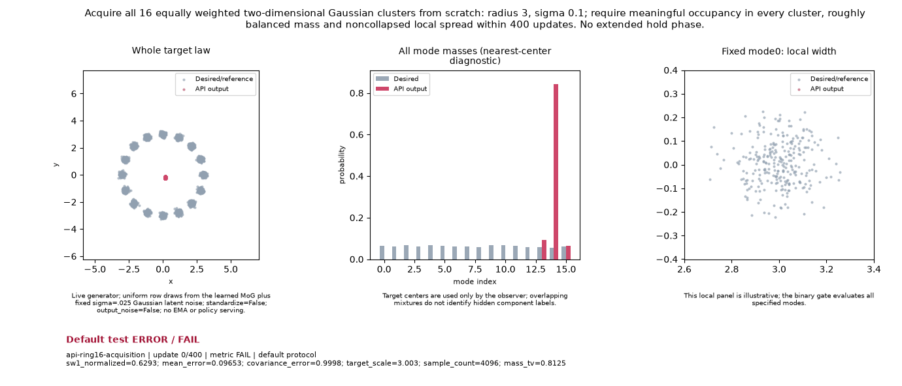

# Sixteen Gaussian clusters: acquisition

[Current tier report](../../../forge/EXPERIMENTS_BY_TIER.md#experiment-ring16-acquisition) · [Forge task](../../../../configs/forge/tasks/ring16_acquisition.json) · [Main qualification view](../../../../configs/forge/views/discriminator_stability.json)

This new retained question asks whether training from scratch acquires all 16 equally weighted 2D Gaussian clusters within a small fixed budget. The means are `3(cos(2πk/16), sin(2πk/16))`, k = 0,…,15; each covariance is `0.01I`. Adjacent centers are about 11.7 Gaussian standard deviations apart. Acquisition is separate from extended retention or target adaptation.

The user chose an initial **Tier 1** placement in the main `discriminator_stability` view. Revision 3 requires this task and `five_word_joint_acquisition` alongside the three existing behavior checks, giving a 5/19/2 denominator. Placement remains provisional until calibration establishes rejection/cost performance. The existing eight-mode `mode_hold` task and historical revision-2 3/19/2 qualification retain their original identities and results.

## Preregistered protocol

One full standalone public-API run, protocol seed **0**, **400 updates**, batch 128, 256 learned MoG rows in four latent dimensions. Generator/discriminator are the shared vector MLPs, width 64, two hidden layers; the discriminator uses two Fourier bands. The public K3P preset resolves the training mechanism; learning rate .00425, discriminator multiplier 1, prior multiplier 2, betas (0,.999), prior regularization 0. Initial networks use deterministic orthogonal seeds 0/1; prior locations use Gaussian init_std .5 seed 0. Prior sigma is fixed at **.025**, standardization is off. Training noise follows the exact resolved recipe. Scoring uses **live, clean outputs** while retaining the MoG latent kernel; EMA, output-noise and policy-served evidence do not substitute for these draws.

These API initializer/data/trainer RNG streams are a separate cohort from Forge's named `FormulationContext` streams. A completed API demonstration supplies **no ordinary Forge qualification**. The task uses the same target, shared vector host and numerical scorer through the existing public Forge adapter, but a future Forge receipt must bind its own exact candidate/source/runtime.

The budget, geometry and gates are frozen before the sole scientific run. Evaluation draws contain 4,096 samples at 24 fixed post-update observations. The last five checks (updates 334, 350, 367, 384, 400) must jointly pass. These are acquisition checks inside the original budget; there is no post-acquisition continuation. Timeout is 300 seconds, one GPU and one CPU thread. No seed-only repetition, tuning after failure or calibration matrix expansion is included.

| Gate | Numerical bound | Purpose |
|---|---|---|
| Finite output | All generated values finite | Reject execution/NaN failures |
| Sample count | ≥ 4,096 | Preserve declared statistical resolution |
| Meaningful modes | All 16 | Each mode has ≥ 1/4 of its target mass **inside its 3-sigma ball**, divided by all generated samples |
| Mass TV | ≤ .15 | Roughly balanced nearest-component mass |
| HQ | ≥ .85 | Most outputs are inside target clusters |
| Average component covariance error | ≤ .85 | Bound gross local width mismatch |
| Minimum component covariance eigen ratio | ≥ .15 | Reject collapsed width in any component |

These are deliberately broad acquisition bounds, not tight Gaussian density certification. In particular covariance error is averaged across components; the minimum eigen gate applies to every component. Projected CDF and global moments are reported as diagnostics, without adding unregistered gates.

## Scorer controls

The [compact control receipt](controls.json) records an independent full target draw (PASS) and eight destructive draws (all correctly rejected): missing cluster, biased mass, centers only, collapsed width, inflated width, continuous circle, displaced target and nonfinite output. They execute **zero training updates**. Controls establish discrimination against these counterexamples; they do not calibrate the smoke screen's predictive value for trained solutions.

## Result

**Numerical acquisition FAIL after all 400 updates; original execution stamp ERROR / FAIL.** The one declared K3P-MoG run took **6.113 paid execution seconds** on `cuda:0`, one Torch thread, Python 3.14.7 / Torch 2.14.0+cu130. All 24 scoring checks completed and **0/5 terminal joint checks passed**. No retry, continuation or seed variation followed.

| Endpoint metric | Measured | Bound | Result |
|---|---:|---:|---|
| Finite output | 0 nonfinite values | 0 | PASS |
| Evaluation samples | 4,096 | ≥ 4,096 | PASS |
| Meaningful modes | 16/16 | 16/16 | PASS |
| Minimum in-cluster mass / target mass | .3125 | ≥ .25 to count a mode | PASS |
| Mass TV | .08374 | ≤ .15 | PASS |
| HQ | .73877 | ≥ .85 | FAIL |
| Average component covariance error | 40.84168 | ≤ .85 | FAIL |
| Minimum component eigen ratio | .59631 | ≥ .15 | PASS |

The terminal checkpoints contained 15, 16, 16, 16 and 16 meaningful modes at updates 334, 350, 367, 384 and 400. Every terminal checkpoint failed HQ and covariance. The result therefore demonstrates late mode acquisition with roughly balanced mass, while **26.1% of final samples remain outside all target 3-sigma balls**. Within the four-sigma component cores the covariance-error diagnostic is .378; scoring the full assigned components gives 40.84. That gap is consistent with off-cluster samples inflating spread and is not evidence of a precise Gaussian fit. The nongating projection-KS diagnostic is .07510.

This does not rerate the eight-mode `mode_hold` result: it changes mode count, sigma, acquisition budget and the standalone API initializer/RNG cohort. Nor does the low observed cost establish Tier 1 calibration; there is still no independently qualified positive reference or rejection/cost comparison for this task.

**Recommendation:** keep this provisional Tier 1 acquisition question in the main view and its honest negative result. Before scientific adoption of the expanded screen, preregister a bounded independent reference/cost study. Stop this exact failed training cohort; any subsequent solution change needs a substantive hypothesis and a new evidence identity. No 0.9.0 solution is selected or qualified by this demonstration.

[Compact numerical/recipe/provenance publication](publication.json) · [Actual-training GIF](goal.gif)



The original raw receipt remains unchanged. Training, numerical observations and checkpoint saving completed, then the shell Python lacked `matplotlib` during GIF rendering. Its original **ERROR / FAIL** and that artifact failure are retained in the publication. The GIF was subsequently rendered from the saved target/output arrays in the project environment, with **zero extra training or sampling** and a separate renderer receipt. The frozen training source is `32e25a8e872a519304d54c1081efe89a73bf821e`; renderer source is `094c55a65395411f3eee378bdb308f6cda45d10d` (the exact commit/file identities are authoritative in `publication.json`). Both the original artifact hashes and nine-frame GIF hash are recorded. Numerical FAIL, original execution ERROR and media availability are separate facts.

The initial control/readout source was committed before execution. The existing current solution leaderboard keeps its frozen research cohorts; this standalone result is discoverable through the generated experiment guide and grants no Forge qualification.

## Reproduce and inspect

From the repository root in the project environment, these commands use an unused ignored raw output directory. The scientific command runs the sole declared protocol; its exit status is nonzero on numerical FAIL. The JSON lines are easy to tail.

```sh
python -m benchmarks.toy_audit.ring16_controls --output /tmp/ring16-controls.json
mkdir -p runs/api/ring16-reproduction
timeout 300s python -m benchmarks.toy_audit.api_run --case api-ring16-acquisition \
  --device cuda:0 --output runs/api/ring16-reproduction \
  > runs/api/ring16-reproduction/runner.log 2>&1
tail -f runs/api/ring16-reproduction/runner.log
python -m benchmarks.toy_audit.ring16_publish \
  --raw runs/api/ring16-reproduction/api-ring16-acquisition \
  --output /tmp/ring16-publication
```

For this recorded rendering failure only, the media-only exporter additionally uses `--recover-missing-media` in the project environment; it requires the exact original missing-dependency failure and does not change the raw receipt.

The caller selects the declared seed 0; the published metadata records it explicitly. The exporter verifies the complete original receipt, protocol and artifact identities; it copies compact endpoint/terminal evidence and the GIF and launches no training or rescoring. Checkpoints, arrays and the complete observation/log streams stay in ignored local storage.

## How to determine tiers scientifically later

Before a separate bounded calibration, freeze independent positive/negative reference criteria, exact prior/init/recipe/sampling/runtime cohorts and a total compute cap. Compare this acquisition screen against independent later-quality/retention tasks rather than use its own answer as the reference. Measure full execution cost, rejection of failing lineages and false rejection of successful ones. Compare cost savings and incremental predictive value against the other proposed Tier 1 tasks, with unknowns retained.

The existing [frozen Forge calibration criteria](../../../../configs/forge/calibration/criteria-v1.json) provide a useful acceptance template: at least three paired lineages, one reference-positive and two reference-negatives, ≥90% paired coverage, zero false rejection, ≤10% false acceptance, complete cost vectors and smoke/reference cost ratio ≤.1 within each cohort. A new profile must declare how these apply before spending; a single API run or oracle draw cannot satisfy them. A justified future tier or budget change gets a new protocol/view revision and preserves this evidence. No broad calibration campaign follows from this PR.
