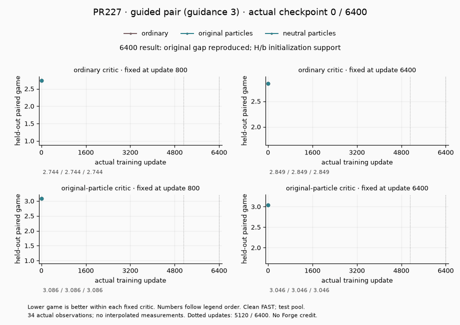
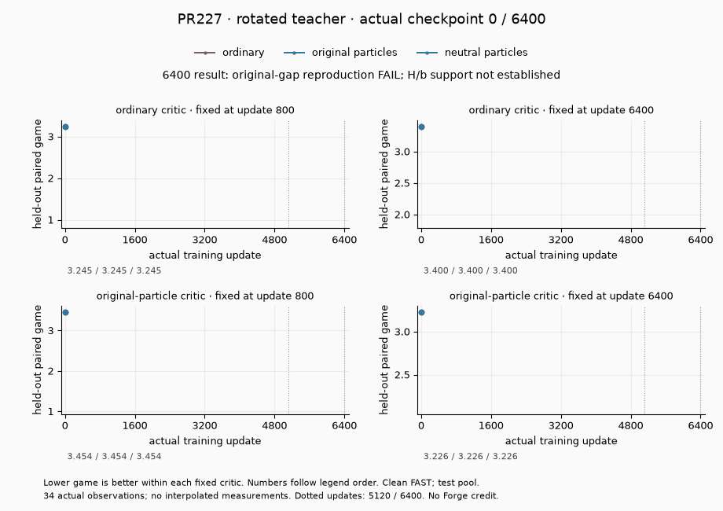

# PR227 supplemental guided-pair and rotated-teacher training media

These GIFs use every retained common-critic observation from the two expanded PR227 protocols. Each frame advances to an actual saved update; all three arms share the same four fixed critics. The plots show the already measured held-out paired native RpGAN game on clean FAST outputs under the original private critic-input panels. Lower is better within a fixed critic. Both archives passed their independent provenance review; that review does not make every scientific gate pass.

| Protocol | Full-budget scientific result | Actual frames |
|---|---|---|
| Guided pair, guidance 3 | Original gap reproduced; H/b initialization support | 34, updates 0–6400 |
| Rotated teacher | Original-gap reproduction FAIL; H/b support not established | 34, updates 0–6400 |

## What the guided-pair problem verifies

The fixed guided execution combines conditional and unconditional halves at guidance 3 while keeping the rotated teacher exactly reachable. It compares ordinary adapters, original routed particles, and particles with only fresh H/b initialization neutralized. At update 6400 original particles score worse than ordinary under all four critics; neutral particles score better than both. This supports initialization sensitivity in this specific fixture. At update 5120 original particles still beat ordinary under the two early critics, so the final finding does not describe every update.



## What the rotated-teacher problem verifies

The fixed teacher rotates the down span to a declared low-overlap basis while preserving its weight row Gram and exact reachability. It tests acquisition of that span and whether neutralizing H/b explains an original-particle disadvantage. That disadvantage is not reproduced consistently: the final ordinary and original-particle endpoint critics disagree. The failed reproduction and inapplicable gap-reduction support remain failed findings, even though neutral particles beat ordinary under all four critics at both endpoints.



## Boundaries and reproduction

Neither fixture isolates the unique cause of full Supra behavior. Absolute games across the two protocols use different target scales and critics and cannot be subtracted as a causal effect size. Weight-space overlap does not preserve activation covariance; the rotated toy's chance overlap also differs from the historical wide host. Both particle controls retain trainable banks, routers and nonzero code paths, but no structural moves were accepted. These standalone diagnostics grant no learned-MoG, Forge, robustness or default-promotion credit.

The supplemental [receipt](receipt.json) pins PR227 source commit `b370cb7a49429e67f106e41752abea078327c5d0`, the committed cards/results, exact source archives, native source, data, critic identities, original execution/review hashes and both complete artifact manifests. All checkpoint files were hashed without deserialization. No training, replay update, model loading or metric recomputation occurred. The software-only 802 recovery states are excluded from these 34-point training curves. Existing audit catalog, media manifest and original PR227 GIF remain unchanged.

```sh
python -m benchmarks.toy_audit.pr227_current_media --validate-only
python -m benchmarks.toy_audit.pr227_current_media
```

Default external archives:

- `/ml2/hypergan/ParticleGAN-convergence-toy-develop/runs/routed-convergence-guided-pair-v1`
- `/ml2/hypergan/ParticleGAN-convergence-toy-develop/runs/routed-convergence-rotated-v1`
