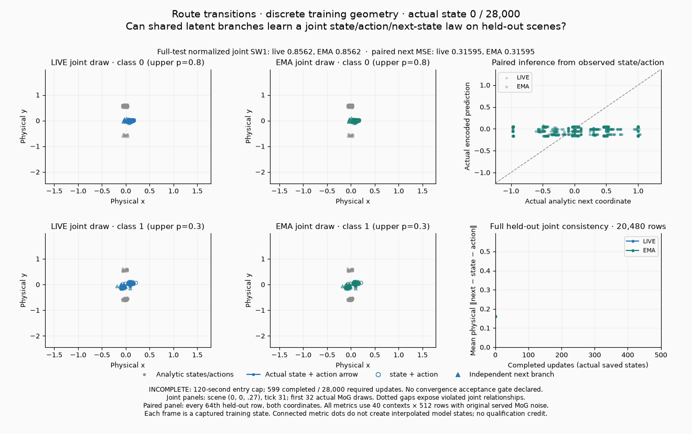
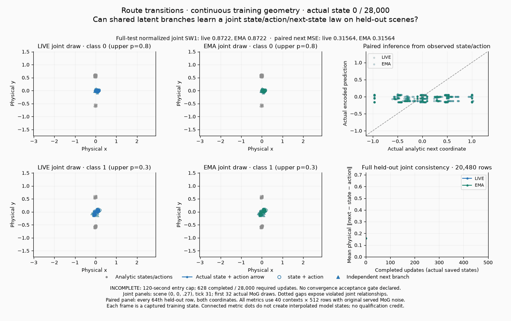

# Fresh exact-source coverage for conditional routes

Two trajectory entries are **BLOCKED** by their original CUDA prerequisite.
Both transition entries are **INCOMPLETE** at the permitted 120-second entry
cap. These attempts add genuine training-state media and explicit blockers to
`source-family-04/05/06/07`; they preserve the original catalog's **4/5,
SOURCE REVIEW ONLY** snapshot. No completed convergence result, Atlas
qualification or merge eligibility is inferred from this new cohort.

Every entry uses source from develop
`6ec7e5788e14ea15ddc3e16ac71110458108b6a6`, seed **24002**, its original
initialization, architecture, prior, data law, batch size and full update
budget. All execution is CPU1. No config, public library, solver, seed or
training loop was changed. There was one source attempt per entry, with no
failed-prerequisite extension, retry or budget increase.

| Catalog entry | Original budget | Fresh execution | Actual training GIF | Scientific question |
|---|---:|---|---|---|
| 04 · discrete two-route trajectories | 10,000 | **BLOCKED**, 0 updates | None: source rejects CPU | Match class-conditioned route probabilities, bounded path variation, endpoints and obstacle clearance on held-out scenes. |
| 05 · continuous two-route trajectories | 10,000 | **BLOCKED**, 0 updates | None: source rejects CPU | Match the same conditional trajectory law when training scenes vary continuously. |
| 06 · discrete route transitions | 28,000 | **INCOMPLETE**, 599 completed iterations | [8 actual states](media/source-family-06.gif) | Learn a joint `(state, action, next_state)` law, including `next_state = state + action`. |
| 07 · continuous route transitions | 28,000 | **INCOMPLETE**, 628 completed iterations | [8 actual states](media/source-family-07.gif) | Learn the same joint relationship from continuously varying scenes and retain it on held-out contexts. |

Each source reports numerical endpoint diagnostics but declares **no aggregate
convergence acceptance gate**. The additional observer supplies diagnostics,
not a new acceptance threshold. Both `added_gate_status` values therefore
remain **NOT EVALUATED**; their source-execution status is recorded separately.
For transitions, the original endpoint reference-floor, shuffled-block control
and inference evaluations were not reached at the cap. A partial run cannot
establish full-budget convergence or failure.

## Why the trajectory entries have no GIF

Both unmodified calls fail at `experiments/train_trajectory.py:88` with the
exact prerequisite error:

```text
RuntimeError: CUDA is required
```

The trainer hardcodes `cuda:0` and has no CPU CLI path. The discrete entry uses
`configs/trajectory/default.yaml`; the continuous entry uses the existing
`configs/trajectory/diversity/confirm_10k/mlp_continuous.yaml`. Both retain DDGAN,
UCD, learned 20,000-row latent table, Gaussian reverse-process noise, 64 future
positions, generator width 32, critic width 256, batch 128 and 10,000 updates.
The source requests generator/critic orthogonal initialization seeds 0/1,
prior seed 24103 and named training streams 24013–24018. Those initializations
were not reached; their source-defined intent is not trained evidence.

Frozen input and resolved-recipe receipts precede the call. No parity run,
training state or endpoint was fabricated after the prerequisite failed.
Their `media` fields are null. A future CPU implementation or a CUDA run would
be a separately bound cohort.

## What the transition GIFs show





The three independent generator branches share latent code and observed
class/geometry/time. They output state, action and next state. Each joint
panel plots the actual state and action arrow, a hollow marker for their sum,
and a triangle for the independent next-state output. Dotted gaps reveal
broken correspondence even when the block marginals look plausible. A joint
residual alone is insufficient: a collapsed constant triple can have a small
residual while failing the required conditional distribution.

The paired panel feeds the actual reference state/action to the original
encoder and shows predicted next coordinates against their analytic targets.
These paired predictions are a different inference path from unconditioned
prior draws. Good paired predictions alone do not establish that the full
generated joint law has converged.

Each GIF has exactly **eight captured states**: updates
`0, 1, 10, 25, 50, 100, 250, 500`. No intermediate model state is interpolated.
Every frame uses saved prediction tensors rather than a reconstruction from
endpoint numbers. Joint panels display the same first 32 draws of held-out
scene `(0, 0, .27)`, tick 31, for both classes. The paired panel displays every
64th row and both coordinates. Metrics include **all 20,480 rows**:
eight class/geometry contexts × five ticks `(0,16,31,46,62)` × 512 draws.
Reference and latent seeds are the original **99001** and **99000**, with the
same 256-row sampling chunks as source endpoint evaluation.

The actual served law is the source **MoG with Gaussian component noise**,
not clean enumeration of finite latent atoms. The observer adds no observation
noise. Live and EMA are explicitly separate. At the last saved state, update
500, the diagnostic values are:

| Geometry | Live / EMA joint SW1 | Live / EMA joint residual | Live / EMA paired next MSE |
|---|---|---|---|
| Discrete | 0.346977 / 0.413698 | 0.226771 / 0.070633 | 0.007513 / 0.016812 |
| Continuous | 0.352069 / 0.416490 | 0.129317 / 0.085882 | 0.004967 / 0.015479 |

These are last **observed** values, not trained endpoints at updates 599/628 or
28,000. They show partial distribution and paired-prediction progress with a
remaining joint relationship error. The missing full-budget endpoint and
controls prevent a convergence conclusion.

## Frozen transition recipe and bounded cost

The discrete source uses `configs/transition/default.yaml` and all source
defaults. There is no checked-in continuous transition YAML. Entry 07 selects
the source-supported `geometry_mode=continuous` from the same defaults; this
selection changes the real training law, and is explicit in its input receipt.
The original trainer accepts the runtime `device=cpu` setting. Only device and
fresh output/log paths are runtime overrides; neither run overrides `steps`.

Both preserve 28,000 updates, batch 256, 1,024 MoG components, latent width 32,
generator/encoder width 128, joint critic width 256, marginal width 128, class
scale 8, geometry/time scale 1, encoder and shared state critic enabled. The
original recipe resolves on this pinned package to **KA2**, with LR `.00425`,
EMA `.995` and `sigma_rel=.025`. Actual initial component sigma is
`.13090139627456665`, with initial neighbor distance `5.236055850982666`.
The older trainer docstring/log labels are not a substitute for the saved
resolved recipe; this report claims no historical BCap/K3P cohort equivalence.

Source initialization is unchanged: normalization uses 32,768 training draws
with seed 91001; the original code requests orthogonal module seeds 0/1/2 and
prior-generator seed 24103, then creates streams 24013/24014. Normalization
statistics differ between discrete and continuous data and are retained in
the compact receipt. The source includes a paired real-triple reconstruction
term and synthetic state/action reconstruction alongside the joint and
marginal adversarial objectives. This is not a purely adversarial-only claim.

Each entry's **120-second SIGALRM** covers source import, the short purity/parity
prerequisite and the sole original-budget attempt. The discrete/continuous
full-budget stages lasted 95.583/100.295 seconds including their tensor save;
paid observer measurement accounted for 27.757/24.473 seconds. Total entry wall
time including post-alarm tensor/receipt cleanup was 123.210/121.070 seconds.
No optimizer update occurred after the alarm and no continuation was launched.
These are diagnostic costs, not a training-speed comparison.

The completed-iteration counts are captured at the next original loop boundary.
The discrete alarm interrupted iteration 600 during EMA copying, after some
owner updates; the continuous alarm interrupted iteration 629 during fake
composition before its discriminator update. Neither interrupted owner state
is treated as a completed endpoint or rendered as a final training frame.

## Observation parity and source/media bindings

Before either full-budget attempt, an unobserved and an observed three-update
prefix run the original loop with its 28,000-step configuration unchanged.
Stopping these short prefixes is an external software check, not a reduced
scientific training budget. All **8/8 baseline/observer hashes** match across
updates 0–3 for the two entries. The hashes include all nested modules,
optimizers, gradients, modes, local tensors, named RNGs and global Torch RNG.
The two prefix pairs execute **12 software updates** in total.

All **24 observations**—eight software-prefix states and 16 full-budget
training states—also pass their own before/after owner and RNG invariance
assertion. This self-check supplements the independent short trajectory
comparison; it does not replace it. All 16 GIF frames decode successfully,
have distinct pixel hashes and match the saved state counts. Both final posters
were visually inspected.

The reproducible [compact receipt](coverage.json) exposes `records`, keyed by
full `catalog_id`, with separate original-catalog, fresh-execution, scientific
and added-gate status fields. [Media bindings](media/media.json) record decoded
frame hashes, source tensor/metric hashes and renderer source hash. A retained
source archive at
`/ml2/hypergan/toy-route-source-training-20261001/source.tar` binds **251 exact
source/config files**; every frozen source hash was checked against the archive.
All 251 also match the named develop revision's Git blobs exactly.
Its SHA256 is
`f5e105fb49e06532a336468e992d91349a1df90195b2698e01139e2401e59537`.

Bulk stdout, full tracebacks, original source-generated provenance/recipe
files, per-update logs and prediction tensors remain outside Git:

- `/ml2/hypergan/toy-route-source-training-20261001/source-family-04/` through `source-family-07/`.
- `/ml2/hypergan/toy-route-source-04.log` through `toy-route-source-07.log`, easy to tail.

Reproduction uses the checked-in runner, pure observer and renderer:

```sh
CUDA_VISIBLE_DEVICES= OMP_NUM_THREADS=1 MKL_NUM_THREADS=1 OPENBLAS_NUM_THREADS=1 \
  MKL_CBWR=AVX2 /tmp/pr155-e22-venv/bin/python \
  -m benchmarks.toy_audit.source_conditional_routes_run \
  --source /tmp/particlegan-route-sources-6ec7 \
  --entry source-family-06 --out /tmp/new-route-source-06

python -m benchmarks.toy_audit.source_conditional_routes_render \
  --artifacts /ml2/hypergan/toy-route-source-training-20261001 \
  --out reports/toy_audit/route_sources/media
python -m benchmarks.toy_audit.source_conditional_routes_report \
  --artifacts /ml2/hypergan/toy-route-source-training-20261001 \
  --out reports/toy_audit/route_sources
```

The run command documents reproduction; no extra attempt was launched. Python
3.12.13 and Torch 2.13.0+cu126 were used on CPU with one thread. Neither Atlas
lifecycle checks, Forge calibration/adoption cells nor proposal merge gates
are filled by this source-only evidence.
